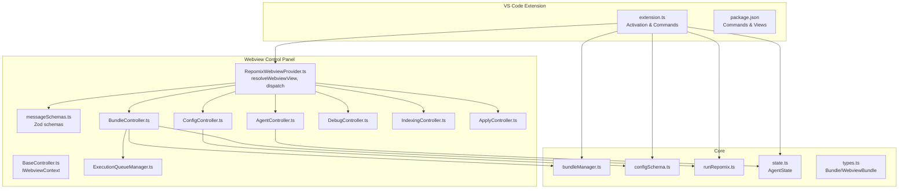
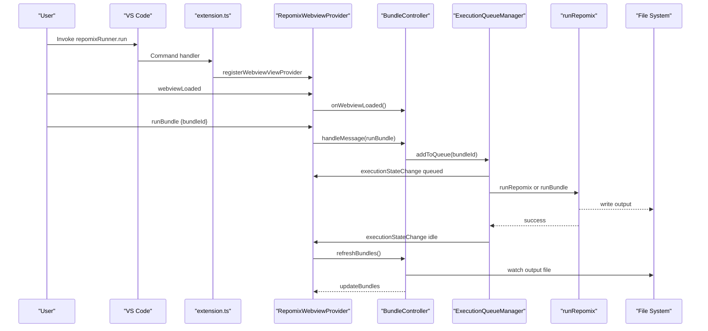
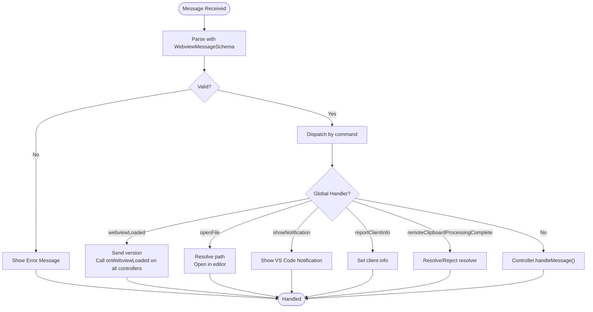
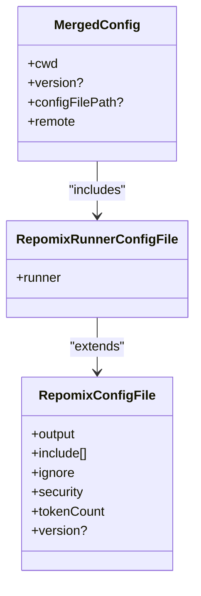
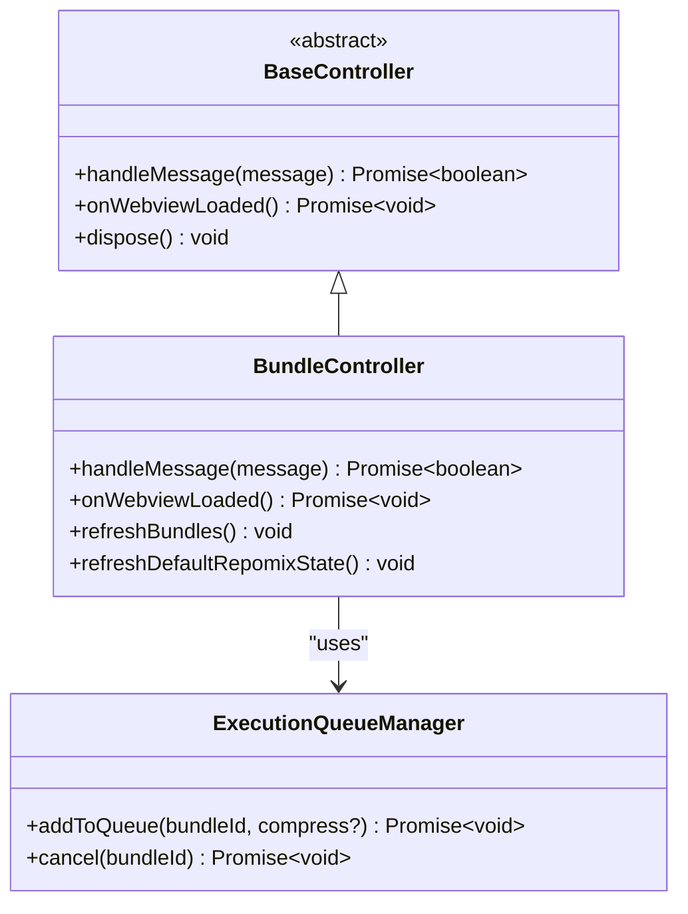
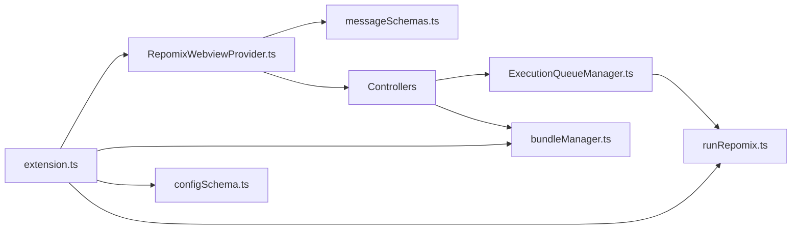

# API Reference

<cite>
**Referenced Files in This Document**
- [extension.ts](file://src/extension.ts)
- [messageSchemas.ts](file://src/webview/messageSchemas.ts)
- [RepomixWebviewProvider.ts](file://src/webview/RepomixWebviewProvider.ts)
- [configSchema.ts](file://src/config/configSchema.ts)
- [state.ts](file://src/agent/state.ts)
- [types.ts](file://src/core/bundles/types.ts)
- [BundleController.ts](file://src/webview/controllers/BundleController.ts)
- [BaseController.ts](file://src/webview/controllers/BaseController.ts)
- [ExecutionQueueManager.ts](file://src/webview/services/ExecutionQueueManager.ts)
- [runRepomix.ts](file://src/commands/runRepomix.ts)
- [bundleManager.ts](file://src/core/bundles/bundleManager.ts)
- [vscode-api.ts](file://src/webview/vscode-api.ts)
- [utils.ts](file://src/webview/utils.ts)
- [package.json](file://package.json)
</cite>

## Table of Contents
1. [Introduction](#introduction)
2. [Project Structure](#project-structure)
3. [Core Components](#core-components)
4. [Architecture Overview](#architecture-overview)
5. [Detailed Component Analysis](#detailed-component-analysis)
6. [Dependency Analysis](#dependency-analysis)
7. [Performance Considerations](#performance-considerations)
8. [Troubleshooting Guide](#troubleshooting-guide)
9. [Conclusion](#conclusion)
10. [Appendices](#appendices)

## Introduction
This document provides a comprehensive API reference for Repomix Runner Plus. It covers:
- Extension activation lifecycle and dependency injection patterns
- Public VS Code commands and context menu contributions
- Webview messaging interfaces and message schemas
- Configuration schemas for both repomix and runner settings
- AgentState interface for AI workflow orchestration
- Bundle types for file management
- Event handling patterns, state synchronization, and webhook-free runtime integration
- Practical usage examples and best practices

## Project Structure
The extension is organized around a VS Code extension entrypoint, a webview control panel with typed controllers, a bundle management subsystem, and configuration loaders. The webview communicates via strongly typed Zod schemas, and controllers coordinate execution and UI updates.

**Diagram sources**
- [extension.ts](file://src/extension.ts#L43-L781)
- [RepomixWebviewProvider.ts](file://src/webview/RepomixWebviewProvider.ts#L19-L288)
- [messageSchemas.ts](file://src/webview/messageSchemas.ts#L1-L517)
- [BundleController.ts](file://src/webview/controllers/BundleController.ts#L1-L257)
- [ExecutionQueueManager.ts](file://src/webview/services/ExecutionQueueManager.ts#L1-L133)
- [bundleManager.ts](file://src/core/bundles/bundleManager.ts#L1-L117)
- [configSchema.ts](file://src/config/configSchema.ts#L1-L165)
- [runRepomix.ts](file://src/commands/runRepomix.ts#L1-L173)
- [state.ts](file://src/agent/state.ts#L1-L52)
- [types.ts](file://src/core/bundles/types.ts#L1-L37)
- [package.json](file://package.json#L20-L540)

**Section sources**
- [extension.ts](file://src/extension.ts#L43-L781)
- [package.json](file://package.json#L20-L540)

## Core Components
- Extension activation and service registration:
  - Initializes database, embedding service, background indexing monitor, tree view, webview provider, and registers commands.
- Webview control panel:
  - Hosts controllers for bundles, agents, configuration, indexing, debug, and apply.
  - Validates inbound messages with Zod schemas and routes to controllers.
- Bundle management:
  - CRUD for bundles, active bundle selection, and persistence under .repomix/bundles.json.
- Execution queue manager:
  - Serializes runs, supports cancellation, and notifies UI state changes.
- Configuration schemas:
  - Strongly typed repomix and runner settings with defaults and validation.
- AgentState:
  - Shared memory for AI orchestration graph with annotations for keys like apiKey, userQuery, workspaceRoot, allFilePaths, candidateFiles, confirmedFiles, finalCommand, objectiveType, relevanceCriteria, outputPath, summaryPath, generateFile, and totalTokens.

**Section sources**
- [extension.ts](file://src/extension.ts#L43-L781)
- [RepomixWebviewProvider.ts](file://src/webview/RepomixWebviewProvider.ts#L19-L288)
- [BundleController.ts](file://src/webview/controllers/BundleController.ts#L1-L257)
- [ExecutionQueueManager.ts](file://src/webview/services/ExecutionQueueManager.ts#L1-L133)
- [bundleManager.ts](file://src/core/bundles/bundleManager.ts#L1-L117)
- [configSchema.ts](file://src/config/configSchema.ts#L1-L165)
- [state.ts](file://src/agent/state.ts#L1-L52)

## Architecture Overview
The extension follows a layered architecture:
- Activation layer initializes services and registers VS Code contributions.
- Webview layer handles UI and user actions, validating messages and delegating to controllers.
- Core layer manages bundles, runs, and configuration.
- Agent layer orchestrates AI workflows with a LangGraph state.

**Diagram sources**
- [extension.ts](file://src/extension.ts#L498-L540)
- [RepomixWebviewProvider.ts](file://src/webview/RepomixWebviewProvider.ts#L90-L195)
- [BundleController.ts](file://src/webview/controllers/BundleController.ts#L38-L60)
- [ExecutionQueueManager.ts](file://src/webview/services/ExecutionQueueManager.ts#L26-L118)
- [runRepomix.ts](file://src/commands/runRepomix.ts#L48-L154)

## Detailed Component Analysis

### Extension Activation and Service Registration
- Initializes:
  - DatabaseService
  - Embedding service provider selection (Gemini/Ollama)
  - Background indexing monitor with debounced file watcher and gitignore-based filtering
  - Tree view for bundles with decoration provider
  - Webview view provider for the control panel
- Registers commands for:
  - Running repomix (default and on selections)
  - Managing bundles (create, edit, delete, select, refresh)
  - Smart agent run and regeneration
  - Copying files to clipboard (explorer and SCM)
- Subscribes disposables for cleanup.

**Section sources**
- [extension.ts](file://src/extension.ts#L43-L781)
- [package.json](file://package.json#L309-L539)

### Webview Messaging Interfaces and Message Schemas
- Discriminated union of messages validated by Zod schemas.
- Requests include:
  - Bundle operations: runBundle, cancelBundle, copyBundleOutput
  - Default repomix: runDefaultRepomix, cancelDefaultRepomix, copyDefaultRepomixOutput
  - Agent: runSmartAgent, rerunAgent, copyAgentOutput, copyLastAgentOutput, regenerateAgentRun, getAgentHistory
  - Debug: getDebugRuns, reRunDebug, copyDebugOutput, deleteDebugRun
  - Environment: getEnvironmentInfo, updateEnvironmentInfo, reportClientInfo
  - Pinecone/Qdrant: fetchPineconeIndexes, savePineconeIndex, getPineconeIndex, getVectorDbProvider, setVectorDbProvider, getVectorDbCollectionInfo, fetchQdrantCollections, getQdrantConfig, setQdrantConfig, testQdrantConnection
  - Indexing: indexRepo, indexRepoProgress, indexRepoStateChange, pause/resume/stop, indexRepoComplete, deleteRepoIndex, getRepoIndexCount, getRepoVectorCount
  - Search: searchRepo, generateRepomixFromSearch, copySearchOutput, copySearchResultsMarkdown, copySearchFilePaths, searchSummaryReady
  - Clipboard: getCopyMode, setCopyMode
  - Embedding: getEmbeddingConfig, setEmbeddingConfig, fetchOllamaModels, testEmbedding, testOllamaDimension, embeddingConfig, embeddingTestResult
  - Compatibility: checkCompatibility, compatibilityStatus, resetVectorIndex, vectorIndexReset, indexingBlocked
  - Misc: webviewLoaded, showNotification, applyPatches, remoteClipboardProcessingComplete
- Responses include state updates, notifications, and progress events.

**Diagram sources**
- [RepomixWebviewProvider.ts](file://src/webview/RepomixWebviewProvider.ts#L90-L195)
- [messageSchemas.ts](file://src/webview/messageSchemas.ts#L443-L515)

**Section sources**
- [RepomixWebviewProvider.ts](file://src/webview/RepomixWebviewProvider.ts#L90-L195)
- [messageSchemas.ts](file://src/webview/messageSchemas.ts#L1-L517)

### Configuration Schemas
- Repomix output styles: plain, xml, markdown, json.
- Base and default schemas for repomix config and runner-specific settings.
- Runner copy modes: content, file.
- Merged config includes cwd, version, configFilePath, and optional remote settings.

**Diagram sources**
- [configSchema.ts](file://src/config/configSchema.ts#L14-L149)

**Section sources**
- [configSchema.ts](file://src/config/configSchema.ts#L1-L165)
- [package.json](file://package.json#L31-L283)

### AgentState Interface for AI Workflow Orchestration
- Defines shared memory for the agent graph with annotations for:
  - apiKey, userQuery, workspaceRoot
  - allFilePaths, candidateFiles, confirmedFiles
  - finalCommand, objectiveType, relevanceCriteria
  - outputPath, summaryPath
  - generateFile (reducer), totalTokens (reducer)

**Section sources**
- [state.ts](file://src/agent/state.ts#L1-L52)

### Bundle Types for File Management
- Bundle: name, description, configPath, output, created, lastUsed, tags, files.
- BundleMetadata: bundles map keyed by id.
- BundleTreeItem: VS Code tree item augmented with bundle and type.
- WebviewBundle: Bundle extended with id, output file path/status, and stats.

**Section sources**
- [types.ts](file://src/core/bundles/types.ts#L1-L37)

### VS Code Extension API Integrations, Commands, and Menus
- Commands:
  - repomixRunner.run, repomixRunner.runOnOpenFiles, repomixRunner.runOnSelectedFiles
  - repomixRunner.openSettings, repomixRunner.openOutput
  - repomixRunner.createBundle, repomixRunner.editBundle, repomixRunner.deleteBundle, repomixRunner.selectActiveBundle, repomixRunner.refreshBundles
  - repomixRunner.runBundle, repomixRunner.goToConfigFile
  - repomixRunner.smartRun, repomixRunner.regenerateAgentRun
  - repomixRunner.copySelectedFilesToClipboard, repomixRunner.copyFromScm
- Menus:
  - Explorer context menu for bundle operations and selection
  - SCM resource state context menu
  - View title actions for bundle and run actions
- Views:
  - repomixBundles tree view
  - repomixRunner.controlPanel webview

**Section sources**
- [package.json](file://package.json#L309-L539)
- [extension.ts](file://src/extension.ts#L498-L780)

### Webview Controllers and State Synchronization
- BaseController defines IWebviewContext and abstract handleMessage/onWebviewLoaded/dispose.
- BundleController:
  - Handles run/cancel/copy for bundles and default repomix
  - Debounced refresh of bundles and default state
  - Watches output files for existence changes
- ExecutionQueueManager:
  - Serializes executions, supports cancellation, and emits state changes
  - Delegates to runRepomix or runBundle depending on bundle id

**Diagram sources**
- [BaseController.ts](file://src/webview/controllers/BaseController.ts#L1-L19)
- [BundleController.ts](file://src/webview/controllers/BundleController.ts#L1-L257)
- [ExecutionQueueManager.ts](file://src/webview/services/ExecutionQueueManager.ts#L1-L133)

**Section sources**
- [BaseController.ts](file://src/webview/controllers/BaseController.ts#L1-L19)
- [BundleController.ts](file://src/webview/controllers/BundleController.ts#L1-L257)
- [ExecutionQueueManager.ts](file://src/webview/services/ExecutionQueueManager.ts#L1-L133)

### Command Implementations and Execution Flow
- runRepomix:
  - Reads VS Code and repomix configs, merges them, validates output path security, builds CLI flags, executes via npx repomix, copies to clipboard if configured, cleans up temp files, and shows notifications.
- runBundle:
  - Delegated by ExecutionQueueManager to run a specific bundle with overrides.

**Section sources**
- [runRepomix.ts](file://src/commands/runRepomix.ts#L1-L173)
- [ExecutionQueueManager.ts](file://src/webview/services/ExecutionQueueManager.ts#L85-L94)

### Bundle Management
- BundleManager:
  - Persists bundles.json under .repomix
  - Emits events on changes and active bundle selection
  - Supports get/save/delete operations

**Section sources**
- [bundleManager.ts](file://src/core/bundles/bundleManager.ts#L1-L117)

### Webview Utilities and API Access
- vscode-api.ts:
  - Wrapper to acquireVsCodeApi once and expose postMessage/getState/ setState
- utils.ts:
  - updateVsState helper to merge partial state into VS Code state

**Section sources**
- [vscode-api.ts](file://src/webview/vscode-api.ts#L1-L24)
- [utils.ts](file://src/webview/utils.ts#L1-L8)

## Dependency Analysis
- Internal dependencies:
  - extension.ts depends on controllers, managers, and services
  - Webview controllers depend on BundleManager, ExecutionQueueManager, and commands
  - ExecutionQueueManager depends on runRepomix and runBundle
- External dependencies:
  - VS Code APIs for commands, views, menus, webviews, workspace, secrets
  - Zod for message validation
  - LangGraph for agent orchestration
  - Pinecone and Qdrant clients for vector DB operations

**Diagram sources**
- [extension.ts](file://src/extension.ts#L43-L781)
- [RepomixWebviewProvider.ts](file://src/webview/RepomixWebviewProvider.ts#L19-L288)
- [messageSchemas.ts](file://src/webview/messageSchemas.ts#L1-L517)
- [bundleManager.ts](file://src/core/bundles/bundleManager.ts#L1-L117)
- [runRepomix.ts](file://src/commands/runRepomix.ts#L1-L173)
- [ExecutionQueueManager.ts](file://src/webview/services/ExecutionQueueManager.ts#L1-L133)

**Section sources**
- [extension.ts](file://src/extension.ts#L43-L781)
- [RepomixWebviewProvider.ts](file://src/webview/RepomixWebviewProvider.ts#L19-L288)

## Performance Considerations
- Debounced background indexing reduces redundant embeddings during rapid saves.
- File watchers filter ignored paths using gitignore plus defaults to minimize work.
- ExecutionQueueManager serializes runs to prevent contention and excessive resource usage.
- Stats caching and debounced refresh reduce UI thrash when bundles change.
- Compression flag reduces token usage for agent runs.

## Troubleshooting Guide
- Validation errors:
  - Webview messages failing Zod validation trigger error notifications; inspect the logged message and schema mismatch.
- Missing API keys:
  - Embedding provider selection requires valid secrets; ensure repomix.agent.googleApiKey and provider-specific credentials are configured.
- Output path security:
  - runRepomix enforces workspace root containment; adjust output.filePath to stay within workspace.
- Cancellation:
  - Cancel requests abort running executions; confirm AbortError handling in callers.
- Notifications:
  - showNotification command from webview posts VS Code notifications based on type.

**Section sources**
- [RepomixWebviewProvider.ts](file://src/webview/RepomixWebviewProvider.ts#L100-L116)
- [runRepomix.ts](file://src/commands/runRepomix.ts#L75-L80)
- [ExecutionQueueManager.ts](file://src/webview/services/ExecutionQueueManager.ts#L42-L60)

## Conclusion
Repomix Runner Plus exposes a robust, typed webview API, strong configuration schemas, and a modular controller architecture. Its extension activation pattern initializes core services and integrates tightly with VS Code’s command, menu, and view systems. The AgentState and bundle types formalize AI orchestration and file packaging, while the ExecutionQueueManager ensures predictable execution and state synchronization.

## Appendices

### Webview Message Schema Reference
- Discriminated union of commands with Zod validation. See [messageSchemas.ts](file://src/webview/messageSchemas.ts#L443-L515) for the complete set.

**Section sources**
- [messageSchemas.ts](file://src/webview/messageSchemas.ts#L1-L517)

### Configuration Settings Reference
- Runner settings: keepOutputFile, copyMode, useTargetAsOutput, useBundleNameAsOutputName, verbose, configPath
- Output settings: filePath, style, parsableStyle, headerText, instructionFilePath, fileSummary, directoryStructure, removeComments, removeEmptyLines, topFilesLength, showLineNumbers, copyToClipboard, includeEmptyDirectories, compress
- Include/Ignore/Security/Token count/Embedding settings defined in package.json contributes.

**Section sources**
- [package.json](file://package.json#L31-L283)

### Best Practices for Extending the Extension
- Always validate inbound webview messages using the provided Zod schemas before acting.
- Use ExecutionQueueManager for any execution to benefit from cancellation and state updates.
- Leverage BaseController to implement new controllers; implement onWebviewLoaded for initial synchronization.
- Respect workspace root containment for output paths in commands.
- Use VS Code state helpers to persist lightweight UI state across sessions.