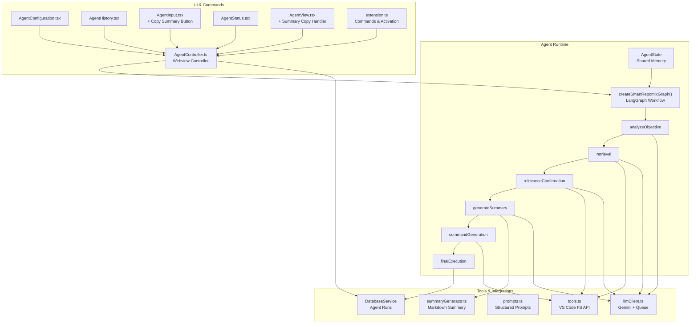
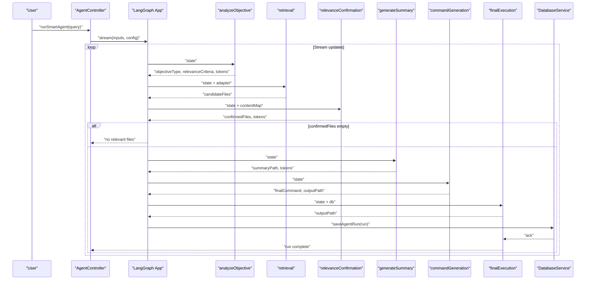
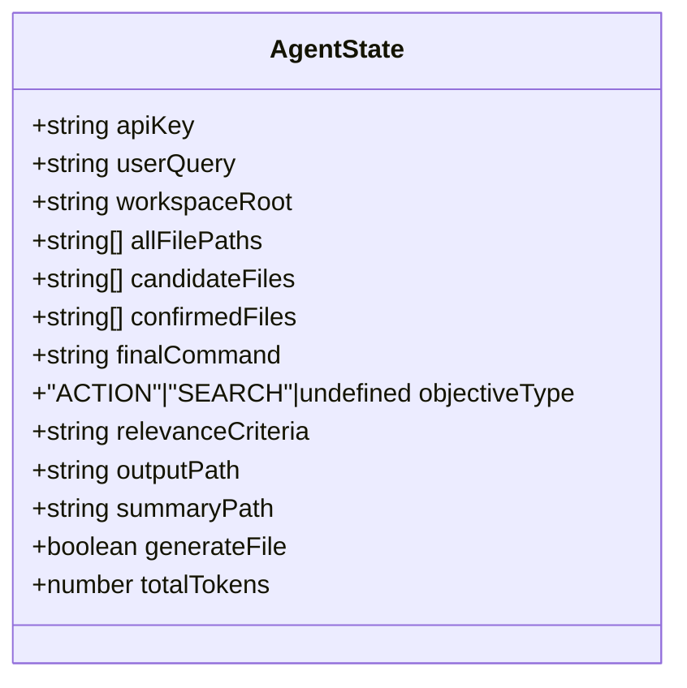
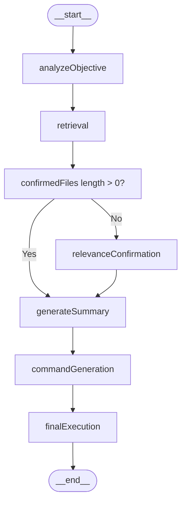
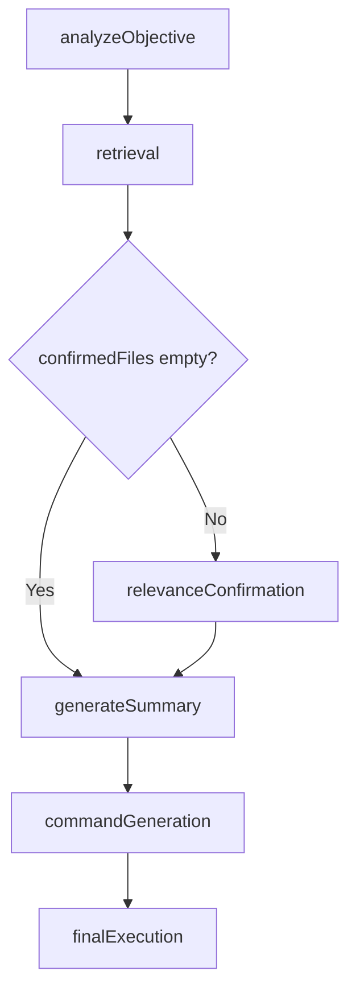
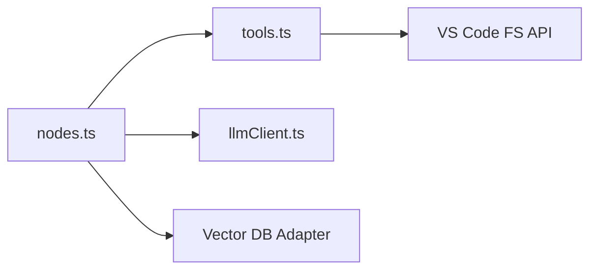
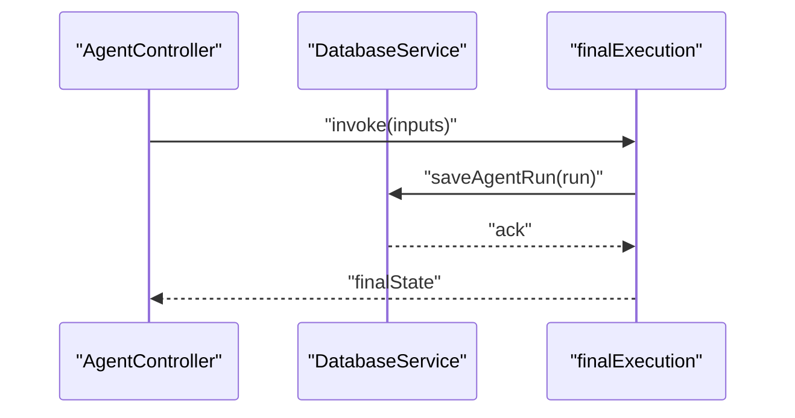
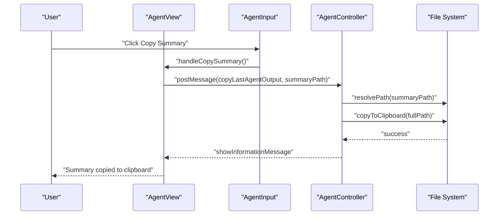
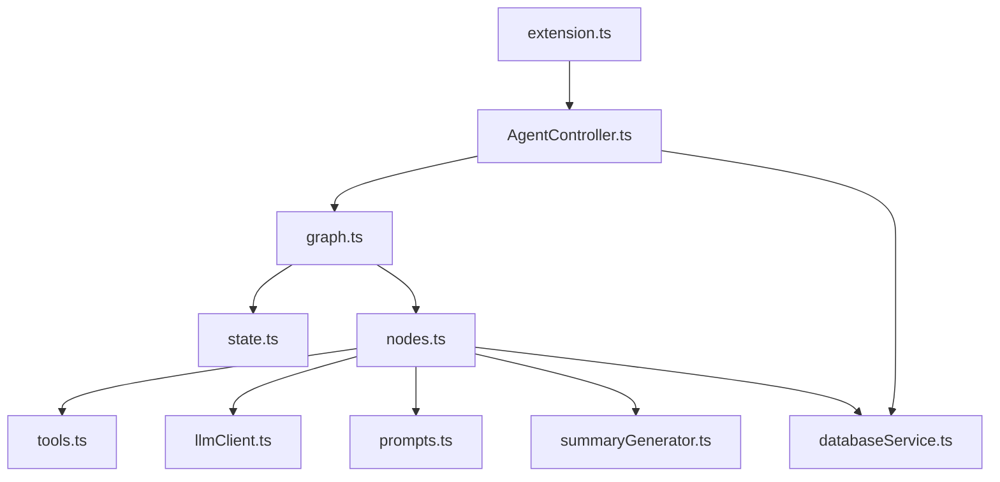

# Agent Interface

<cite>
**Referenced Files in This Document**
- [state.ts](file://src/agent/state.ts)
- [graph.ts](file://src/agent/graph.ts)
- [nodes.ts](file://src/agent/nodes.ts)
- [tools.ts](file://src/agent/tools.ts)
- [llmClient.ts](file://src/agent/llmClient.ts)
- [prompts.ts](file://src/agent/prompts.ts)
- [summaryGenerator.ts](file://src/agent/summaryGenerator.ts)
- [AgentController.ts](file://src/webview/controllers/AgentController.ts)
- [AgentConfiguration.tsx](file://src/webview/components/agent/AgentConfiguration.tsx)
- [AgentHistory.tsx](file://src/webview/components/agent/AgentHistory.tsx)
- [AgentInput.tsx](file://src/webview/components/agent/AgentInput.tsx)
- [AgentStatus.tsx](file://src/webview/components/agent/AgentStatus.tsx)
- [AgentView.tsx](file://src/webview/components/AgentView.tsx)
- [databaseService.ts](file://src/core/storage/databaseService.ts)
- [extension.ts](file://src/extension.ts)
- [package.json](file://package.json)
- [types.ts](file://src/webview/types.ts)
</cite>

## Update Summary
**Changes Made**
- Added documentation for new Agent summary copying functionality
- Updated UI components section to include summary copy button
- Enhanced AgentState documentation to include summary path tracking
- Updated AgentController documentation to cover summary file copying
- Added practical examples for summary copying workflow

## Table of Contents
1. [Introduction](#introduction)
2. [Project Structure](#project-structure)
3. [Core Components](#core-components)
4. [Architecture Overview](#architecture-overview)
5. [Detailed Component Analysis](#detailed-component-analysis)
6. [Dependency Analysis](#dependency-analysis)
7. [Performance Considerations](#performance-considerations)
8. [Troubleshooting Guide](#troubleshooting-guide)
9. [Conclusion](#conclusion)
10. [Appendices](#appendices)

## Introduction
This document explains the Agent Interface in Repomix Runner Plus, focusing on the AI workflow orchestration powered by LangGraph. It covers the AgentState shared memory, the LangGraph workflow definition, node implementations, state transitions, and integrations with tools, external APIs, and persistent storage. It also provides practical guidance for configuration, customization, debugging, and performance optimization.

**Updated** Added comprehensive documentation for the new Agent summary copying functionality that allows users to copy AI-generated summary files produced after successful agent runs.

## Project Structure
The Agent Interface spans several modules:
- Agent state and workflow: state, graph, nodes, prompts, summary generator, and LLM client
- Tools for filesystem operations and content retrieval
- Webview controllers and UI components for user interaction
- Persistent storage for agent run history and indexing metadata
- Extension activation wiring and command integration

**Diagram sources**
- [state.ts](file://src/agent/state.ts#L1-L52)
- [graph.ts](file://src/agent/graph.ts#L1-L67)
- [nodes.ts](file://src/agent/nodes.ts#L1-L742)
- [tools.ts](file://src/agent/tools.ts#L1-L172)
- [llmClient.ts](file://src/agent/llmClient.ts#L1-L176)
- [prompts.ts](file://src/agent/prompts.ts#L1-L68)
- [summaryGenerator.ts](file://src/agent/summaryGenerator.ts#L1-L90)
- [AgentController.ts](file://src/webview/controllers/AgentController.ts#L1-L334)
- [AgentConfiguration.tsx](file://src/webview/components/agent/AgentConfiguration.tsx#L1-L60)
- [AgentHistory.tsx](file://src/webview/components/agent/AgentHistory.tsx#L1-L176)
- [AgentInput.tsx](file://src/webview/components/agent/AgentInput.tsx#L1-L74)
- [AgentStatus.tsx](file://src/webview/components/agent/AgentStatus.tsx#L1-L78)
- [AgentView.tsx](file://src/webview/components/AgentView.tsx#L1-L174)
- [databaseService.ts](file://src/core/storage/databaseService.ts#L1-L892)
- [extension.ts](file://src/extension.ts#L1-L816)

**Section sources**
- [state.ts](file://src/agent/state.ts#L1-L52)
- [graph.ts](file://src/agent/graph.ts#L1-L67)
- [nodes.ts](file://src/agent/nodes.ts#L1-L742)
- [tools.ts](file://src/agent/tools.ts#L1-L172)
- [llmClient.ts](file://src/agent/llmClient.ts#L1-L176)
- [prompts.ts](file://src/agent/prompts.ts#L1-L68)
- [summaryGenerator.ts](file://src/agent/summaryGenerator.ts#L1-L90)
- [AgentController.ts](file://src/webview/controllers/AgentController.ts#L1-L334)
- [AgentConfiguration.tsx](file://src/webview/components/agent/AgentConfiguration.tsx#L1-L60)
- [AgentHistory.tsx](file://src/webview/components/agent/AgentHistory.tsx#L1-L176)
- [AgentInput.tsx](file://src/webview/components/agent/AgentInput.tsx#L1-L74)
- [AgentStatus.tsx](file://src/webview/components/agent/AgentStatus.tsx#L1-L78)
- [AgentView.tsx](file://src/webview/components/AgentView.tsx#L1-L174)
- [databaseService.ts](file://src/core/storage/databaseService.ts#L1-L892)
- [extension.ts](file://src/extension.ts#L1-L816)
- [package.json](file://package.json#L1-L608)

## Core Components
- AgentState: Defines the shared memory schema used across nodes. It includes API key, user query, workspace root, file lists (all, candidates, confirmed), final command, objective classification, relevance criteria, output paths, flags (generateFile), and cumulative token usage.
- LangGraph workflow: A directed graph with nodes for objective analysis, retrieval, relevance confirmation, summary generation, command generation, and final execution. Conditional edges enable skipping steps when files are pre-saved.
- Nodes: Implement each step with structured LLM calls, batching, caching, and fallbacks. They update AgentState with results and tokens.
- Tools: Provide filesystem operations (listing, reading, stats) respecting .gitignore and VS Code workspace APIs.
- LLM Client: Wraps Gemini with a serial queue enforcing RPM caps, exponential backoff for retryable errors, and structured output parsing.
- Prompts: Provide structured prompts for objective classification, relevance scoring, and summary generation.
- Summary Generator: Produces markdown summaries for confirmed files and persists them to disk.
- DatabaseService: Persists agent runs with timestamps, queries, file lists, success/error, duration, and output paths.
- Webview Controller: Orchestrates agent runs, streams state updates, manages progress, and handles reruns/regenerations.
- UI Components: Configuration, history, input, and status panels for user interaction.

**Updated** Enhanced with summary copying functionality that allows users to copy AI-generated summary files directly from the UI.

**Section sources**
- [state.ts](file://src/agent/state.ts#L1-L52)
- [graph.ts](file://src/agent/graph.ts#L1-L67)
- [nodes.ts](file://src/agent/nodes.ts#L1-L742)
- [tools.ts](file://src/agent/tools.ts#L1-L172)
- [llmClient.ts](file://src/agent/llmClient.ts#L1-L176)
- [prompts.ts](file://src/agent/prompts.ts#L1-L68)
- [summaryGenerator.ts](file://src/agent/summaryGenerator.ts#L1-L90)
- [databaseService.ts](file://src/core/storage/databaseService.ts#L1-L892)
- [AgentController.ts](file://src/webview/controllers/AgentController.ts#L1-L334)
- [AgentConfiguration.tsx](file://src/webview/components/agent/AgentConfiguration.tsx#L1-L60)
- [AgentHistory.tsx](file://src/webview/components/agent/AgentHistory.tsx#L1-L176)
- [AgentInput.tsx](file://src/webview/components/agent/AgentInput.tsx#L1-L74)
- [AgentStatus.tsx](file://src/webview/components/agent/AgentStatus.tsx#L1-L78)
- [AgentView.tsx](file://src/webview/components/AgentView.tsx#L1-L174)

## Architecture Overview
The Agent orchestrates a multi-stage workflow:
- Objective analysis classifies the user intent and relevance criteria.
- Retrieval optionally uses vector DB for RAG; falls back to filesystem scanning.
- Relevance confirmation performs batched LLM checks with confidence thresholds and caching.
- Summary generation produces a markdown summary for the selected files.
- Command generation builds the repomix CLI invocation with included files and output path.
- Final execution runs the CLI, captures results, and persists run history.

**Diagram sources**
- [AgentController.ts](file://src/webview/controllers/AgentController.ts#L44-L194)
- [graph.ts](file://src/agent/graph.ts#L8-L67)
- [nodes.ts](file://src/agent/nodes.ts#L129-L742)
- [databaseService.ts](file://src/core/storage/databaseService.ts#L254-L280)

**Section sources**
- [graph.ts](file://src/agent/graph.ts#L1-L67)
- [nodes.ts](file://src/agent/nodes.ts#L129-L742)
- [AgentController.ts](file://src/webview/controllers/AgentController.ts#L44-L194)
- [databaseService.ts](file://src/core/storage/databaseService.ts#L254-L280)

## Detailed Component Analysis

### AgentState and Shared Memory
AgentState defines the schema for shared memory across nodes. It includes:
- Authentication and environment: apiKey, workspaceRoot
- Inputs and intermediate results: userQuery, allFilePaths, candidateFiles, confirmedFiles
- Outputs and flags: finalCommand, objectiveType, relevanceCriteria, outputPath, summaryPath, generateFile
- Metrics: totalTokens with a reducer that accumulates usage across steps

**Updated** Enhanced with summaryPath property to track AI-generated summary file locations.

**Diagram sources**
- [state.ts](file://src/agent/state.ts#L6-L51)

**Section sources**
- [state.ts](file://src/agent/state.ts#L1-L52)

### LangGraph Workflow and State Transitions
The workflow is defined with nodes and edges:
- Nodes: analyzeObjective, retrieval, relevanceConfirmation, generateSummary, commandGeneration, finalExecution
- Edges: sequential flow from analyzeObjective to retrieval, then conditional branching:
  - If confirmedFiles already populated, skip to generateSummary
  - Else proceed to relevanceConfirmation
- Conditional edge after retrieval: if confirmedFiles length > 0, go to generateSummary; otherwise continue to relevanceConfirmation
- After generateSummary, proceed to commandGeneration
- After commandGeneration, execute finalExecution and end

**Diagram sources**
- [graph.ts](file://src/agent/graph.ts#L8-L67)

**Section sources**
- [graph.ts](file://src/agent/graph.ts#L1-L67)

### Node Implementations and Processing Logic
- analyzeObjective: Parses objective type and relevance criteria from the user query using structured LLM output.
- retrieval: Attempts RAG with vector DB; falls back to filesystem listing if unavailable or fails.
- relevanceConfirmation: Batches file content through LLM with confidence thresholds, caches responses, and aggregates results.
- generateSummary: Builds markdown summary for confirmed files and writes to .repomix-runner directory.
- commandGeneration: Constructs the repomix CLI command with included files and unique output path.
- finalExecution: Executes the command, updates run history, and reports success/failure.

**Updated** Enhanced generateSummary node to produce structured summaries with tiered context and track the summaryPath in AgentState.

**Diagram sources**
- [nodes.ts](file://src/agent/nodes.ts#L129-L742)
- [graph.ts](file://src/agent/graph.ts#L11-L36)

**Section sources**
- [nodes.ts](file://src/agent/nodes.ts#L129-L742)

### Tools Integration and External API Interactions
- Filesystem operations: Listing files respecting .gitignore and VS Code workspace APIs; reading file contents; checking existence and stats.
- External API: Gemini via LangChain Google GenAI; queue enforces RPM; exponential backoff for retryable errors.
- Vector DB: Adapter resolution per repository; retrieval and fallback to filesystem scanning.

**Diagram sources**
- [tools.ts](file://src/agent/tools.ts#L1-L172)
- [llmClient.ts](file://src/agent/llmClient.ts#L1-L176)
- [nodes.ts](file://src/agent/nodes.ts#L167-L230)

**Section sources**
- [tools.ts](file://src/agent/tools.ts#L1-L172)
- [llmClient.ts](file://src/agent/llmClient.ts#L1-L176)
- [nodes.ts](file://src/agent/nodes.ts#L167-L230)

### State Synchronization and Persistence
- Agent runs are persisted with id, timestamp, query, files, fileCount, outputPath, success, error, duration, and bundleId.
- The webview controller streams state updates and posts messages to the UI; final state is saved after execution.

**Diagram sources**
- [AgentController.ts](file://src/webview/controllers/AgentController.ts#L86-L194)
- [databaseService.ts](file://src/core/storage/databaseService.ts#L254-L280)
- [nodes.ts](file://src/agent/nodes.ts#L656-L742)

**Section sources**
- [databaseService.ts](file://src/core/storage/databaseService.ts#L254-L280)
- [AgentController.ts](file://src/webview/controllers/AgentController.ts#L86-L194)
- [nodes.ts](file://src/agent/nodes.ts#L656-L742)

### Summary Copying Functionality
**New Feature** The Agent Interface now includes comprehensive summary copying functionality that allows users to easily copy AI-generated summary files produced after successful agent runs.

#### UI Components
- **AgentInput.tsx**: Added a "Copy Summary" button that appears when `lastSummaryPath` is available in AgentState. The button provides a clear title indicating it copies AI-generated summaries with tiered context.
- **AgentView.tsx**: Added `handleCopySummary` function that posts a message to copy the last summary file using the existing `copyLastAgentOutput` command.
- **AgentState**: Enhanced with `lastSummaryPath` property to track the location of the most recent summary file.

#### Controller Implementation
The AgentController already supported file copying through the `copyLastAgentOutput` command, which is now reused for both output files and summary files. The controller resolves relative paths to absolute workspace paths and uses a temporary directory for clipboard operations.

#### Usage Workflow
1. User runs the Smart Agent with a query
2. Agent successfully generates a summary file and updates AgentState with `lastSummaryPath`
3. UI displays "Copy Summary" button alongside the existing "Copy Generated File" button
4. User clicks "Copy Summary" to copy the AI-generated markdown summary to clipboard
5. System resolves the summary file path and copies it to clipboard using temporary file management

**Diagram sources**
- [AgentView.tsx](file://src/webview/components/AgentView.tsx#L104-L107)
- [AgentInput.tsx](file://src/webview/components/agent/AgentInput.tsx#L59-L70)
- [AgentController.ts](file://src/webview/controllers/AgentController.ts#L301-L333)

**Section sources**
- [AgentView.tsx](file://src/webview/components/AgentView.tsx#L104-L107)
- [AgentInput.tsx](file://src/webview/components/agent/AgentInput.tsx#L59-L70)
- [AgentController.ts](file://src/webview/controllers/AgentController.ts#L301-L333)
- [types.ts](file://src/webview/types.ts#L25-L32)

### Practical Examples and Customization
- Configuration: Store API key in VS Code secrets; UI component displays status and allows saving.
- Workflow customization: Adjust batch sizes, confidence thresholds, and fallback behavior in node constants.
- Debugging: Use progress notifications and state streaming to observe node updates; inspect run history for failures.
- **Summary Copying**: After a successful agent run, users can quickly copy AI-generated summaries to clipboard using the new "Copy Summary" button.

**Updated** Added practical guidance for using the new summary copying functionality.

**Section sources**
- [AgentConfiguration.tsx](file://src/webview/components/agent/AgentConfiguration.tsx#L1-L60)
- [AgentController.ts](file://src/webview/controllers/AgentController.ts#L44-L194)
- [nodes.ts](file://src/agent/nodes.ts#L94-L108)
- [AgentView.tsx](file://src/webview/components/AgentView.tsx#L104-L107)
- [AgentInput.tsx](file://src/webview/components/agent/AgentInput.tsx#L59-L70)

### Integration with Extension Ecosystem
- Commands: Smart Agent run command, rerun, regenerate, output copy actions, and summary copy actions.
- Background indexing: Optional vector DB-backed indexing with file watcher and incremental embedding.
- Views: Webview panel for agent controls, history, and status.

**Updated** Enhanced with summary copy command integration.

**Section sources**
- [extension.ts](file://src/extension.ts#L572-L781)
- [package.json](file://package.json#L280-L283)

## Dependency Analysis
The Agent depends on:
- LangGraph for stateful workflows
- LLM client for structured generation and rate-limited calls
- Tools for filesystem operations
- DatabaseService for run history persistence
- Webview controller for orchestration and UI integration

**Diagram sources**
- [graph.ts](file://src/agent/graph.ts#L1-L67)
- [state.ts](file://src/agent/state.ts#L1-L52)
- [nodes.ts](file://src/agent/nodes.ts#L1-L742)
- [tools.ts](file://src/agent/tools.ts#L1-L172)
- [llmClient.ts](file://src/agent/llmClient.ts#L1-L176)
- [prompts.ts](file://src/agent/prompts.ts#L1-L68)
- [summaryGenerator.ts](file://src/agent/summaryGenerator.ts#L1-L90)
- [databaseService.ts](file://src/core/storage/databaseService.ts#L1-L892)
- [AgentController.ts](file://src/webview/controllers/AgentController.ts#L1-L334)
- [extension.ts](file://src/extension.ts#L1-L816)

**Section sources**
- [graph.ts](file://src/agent/graph.ts#L1-L67)
- [nodes.ts](file://src/agent/nodes.ts#L1-L742)
- [AgentController.ts](file://src/webview/controllers/AgentController.ts#L1-L334)
- [extension.ts](file://src/extension.ts#L1-L816)

## Performance Considerations
- Rate limiting: Gemini RPM enforced via a serial queue with interval caps and carryover concurrency.
- Backoff: Exponential backoff with jitter for transient errors (429, RESOURCE_EXHAUSTED, quota exceeded).
- Batching and concurrency: Controlled parallelism for relevance checks; batching reduces LLM calls and token usage.
- Caching: LLM response cache with TTL to avoid recomputation for identical queries/content combinations.
- Fallbacks: Graceful degradation from RAG to filesystem scanning; from structured LLM to sequential processing.
- **Summary Generation**: Structured summaries with tiered context optimization to balance detail and token usage.

**Updated** Added performance considerations for summary generation and copying operations.

[No sources needed since this section provides general guidance]

## Troubleshooting Guide
Common issues and resolutions:
- Missing API key: UI warns and directs to settings; agent aborts early with a clear message.
- Rate limiting or quota errors: Automatic retry with exponential backoff; adjust GEMINI_RPM environment variable if needed.
- Empty or no relevant files: Agent reports failure; review relevance criteria and query phrasing.
- Vector DB adapter errors: Agent falls back to filesystem scanning; verify credentials and index configuration.
- Persistence failures: DatabaseService logs errors but does not fail the main workflow; check storage permissions.
- **Summary copying failures**: If summary file is not found, verify that the agent successfully generated a summary and that the file still exists in the expected location.

**Updated** Added troubleshooting guidance for summary copying functionality.

**Section sources**
- [AgentController.ts](file://src/webview/controllers/AgentController.ts#L151-L194)
- [llmClient.ts](file://src/agent/llmClient.ts#L32-L77)
- [nodes.ts](file://src/agent/nodes.ts#L155-L163)
- [nodes.ts](file://src/agent/nodes.ts#L216-L229)
- [databaseService.ts](file://src/core/storage/databaseService.ts#L694-L736)

## Conclusion
The Agent Interface in Repomix Runner Plus provides a robust, stateful AI workflow for file recommendation, smart search, and bundle generation. Its design emphasizes reliability through structured LLM outputs, batching, caching, and fallbacks; persistence for reproducibility; and a responsive UI for configuration and inspection. The modular architecture enables easy customization and extension.

**Updated** The recent addition of summary copying functionality enhances the user experience by providing quick access to AI-generated insights, allowing users to easily copy and share generated summaries with team members or integrate them into documentation workflows.

## Appendices

### AgentState Properties Reference
- apiKey: LLM API key
- userQuery: Original user request
- workspaceRoot: Repository root path
- allFilePaths: Full repository file list
- candidateFiles: Files selected by name/path heuristics
- confirmedFiles: Files validated by content analysis
- finalCommand: Repomix CLI command to execute
- objectiveType: Classification of the request (ACTION or SEARCH)
- relevanceCriteria: Checklist guiding relevance decisions
- outputPath: Path to generated output file
- summaryPath: Path to generated markdown summary
- generateFile: Flag to skip command generation
- totalTokens: Accumulated token usage across steps

**Updated** Enhanced with summaryPath property for tracking AI-generated summary files.

**Section sources**
- [state.ts](file://src/agent/state.ts#L6-L51)

### Node Responsibilities Summary
- analyzeObjective: Classify intent and criteria
- retrieval: RAG or filesystem-based candidate discovery
- relevanceConfirmation: Batched LLM validation with caching
- generateSummary: Markdown summary creation with tiered context
- commandGeneration: CLI command construction
- finalExecution: Command execution and run persistence

**Updated** Enhanced generateSummary node responsibilities to include structured summary generation.

**Section sources**
- [nodes.ts](file://src/agent/nodes.ts#L129-L742)

### UI and Commands
- AgentConfiguration: Secure API key storage and status
- AgentHistory: Run history, rerun, regen, and copy actions
- AgentInput: Query input and run button with summary copy functionality
- AgentStatus: Success/warning messaging and token badge
- AgentView: Summary copy handler and state management
- Commands: Smart run, rerun, regenerate, output copy, and summary copy

**Updated** Added summary copy functionality to UI components and commands.

**Section sources**
- [AgentConfiguration.tsx](file://src/webview/components/agent/AgentConfiguration.tsx#L1-L60)
- [AgentHistory.tsx](file://src/webview/components/agent/AgentHistory.tsx#L1-L176)
- [AgentInput.tsx](file://src/webview/components/agent/AgentInput.tsx#L1-L74)
- [AgentStatus.tsx](file://src/webview/components/agent/AgentStatus.tsx#L1-L78)
- [AgentView.tsx](file://src/webview/components/AgentView.tsx#L1-L174)
- [extension.ts](file://src/extension.ts#L572-L781)