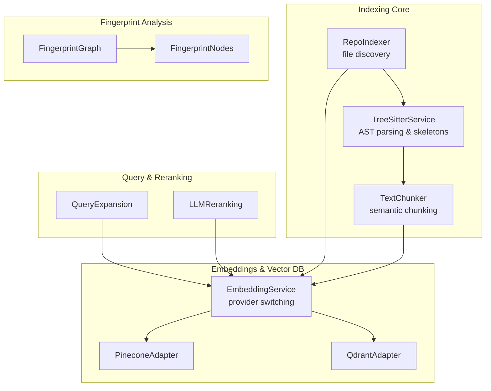
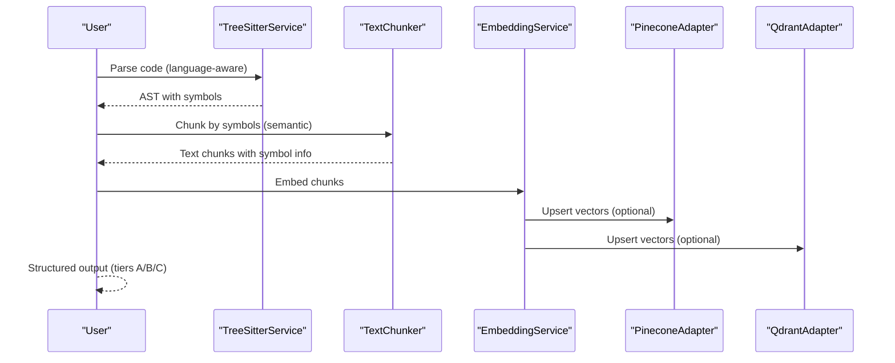
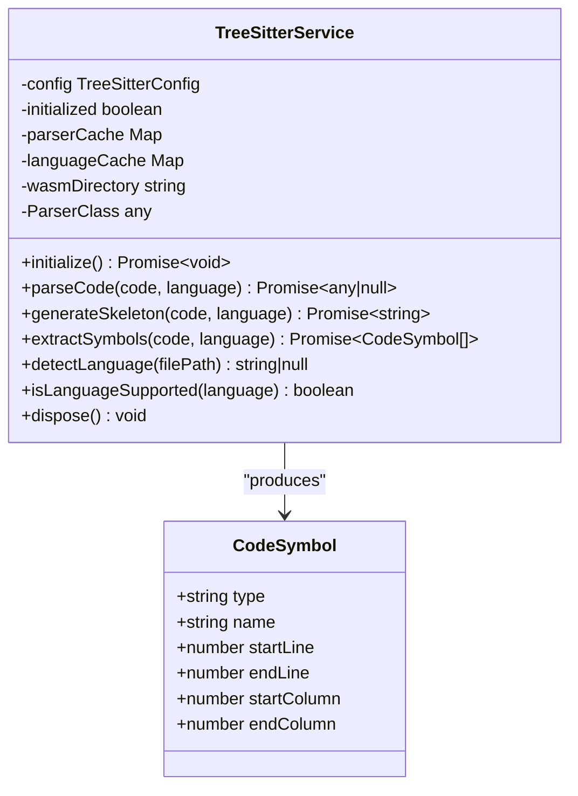
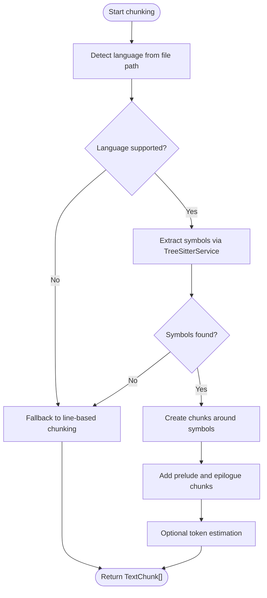
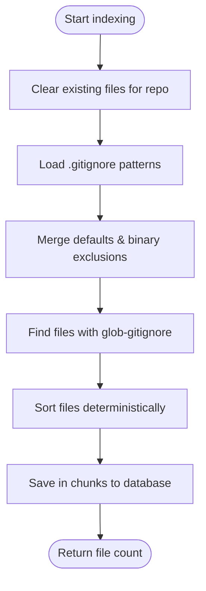
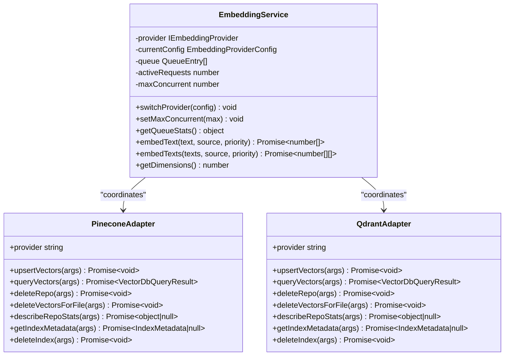
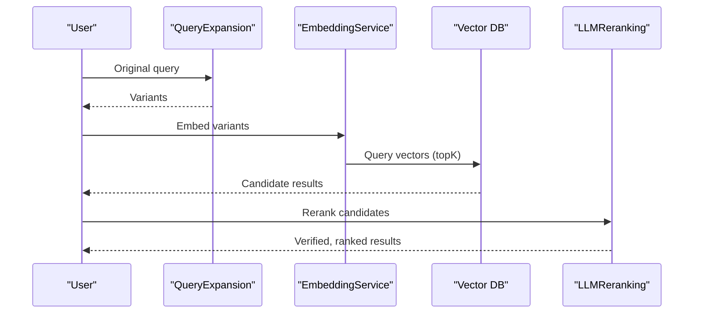
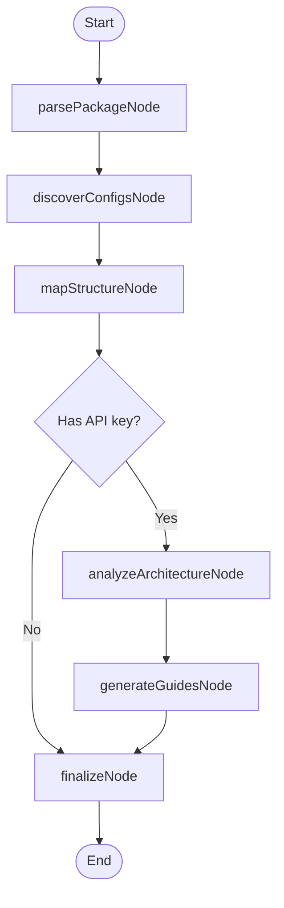
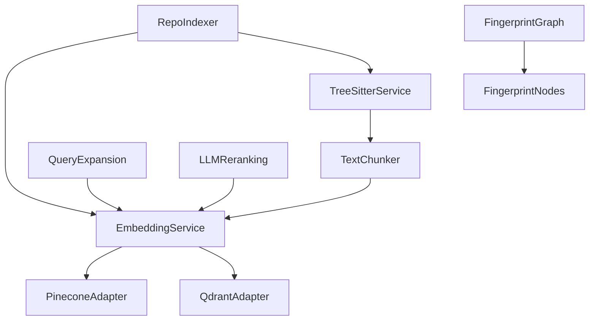

# Semantic Folding Capabilities

<cite>
**Referenced Files in This Document**
- [README.md](file://README.md)
- [architecture.md](file://architecture.md)
- [test-semantic-folding.mjs](file://test-semantic-folding.mjs)
- [treeSitterService.ts](file://src/core/indexing/treeSitterService.ts)
- [textChunker.ts](file://src/core/indexing/textChunker.ts)
- [repoIndexer.ts](file://src/core/indexing/repoIndexer.ts)
- [embeddingService.ts](file://src/core/indexing/embeddingService.ts)
- [pineconeAdapter.ts](file://src/core/indexing/vectorDb/providers/pineconeAdapter.ts)
- [qdrantAdapter.ts](file://src/core/indexing/vectorDb/providers/qdrantAdapter.ts)
- [queryExpansion.ts](file://src/core/indexing/queryExpansion.ts)
- [llmReranking.ts](file://src/core/indexing/llmReranking.ts)
- [graph.ts](file://src/fingerprint/graph.ts)
- [nodes.ts](file://src/fingerprint/nodes.ts)
</cite>

## Table of Contents
1. [Introduction](#introduction)
2. [Project Structure](#project-structure)
3. [Core Components](#core-components)
4. [Architecture Overview](#architecture-overview)
5. [Detailed Component Analysis](#detailed-component-analysis)
6. [Dependency Analysis](#dependency-analysis)
7. [Performance Considerations](#performance-considerations)
8. [Troubleshooting Guide](#troubleshooting-guide)
9. [Conclusion](#conclusion)

## Introduction
This document explains the semantic folding capabilities implemented in the Repomix Runner Plus extension. Semantic folding enables intelligent summarization and abstraction of code by preserving essential structures (signatures, types, class declarations) while hiding implementation details. The system combines tree-sitter AST parsing, semantic chunking, and multi-tier content presentation to produce structured outputs suitable for AI processing.

The capability is demonstrated by a test script that organizes processed files into three tiers:
- Tier A: Full code content for critical files
- Tier B: Skeletons (signatures and structure with hidden bodies)
- Tier C: Summaries (high-level descriptions)

These tiers are combined into a structured markdown document that preserves context and relevance for downstream AI tasks.

**Section sources**
- [README.md](file://README.md#L1-L142)
- [architecture.md](file://architecture.md#L1-L167)
- [test-semantic-folding.mjs](file://test-semantic-folding.mjs#L1-L199)

## Project Structure
The semantic folding functionality spans several modules:
- Tree-sitter service for language-aware parsing and skeleton generation
- Text chunker for semantic segmentation using AST boundaries
- Repository indexer for file discovery and preparation
- Embedding service and vector database adapters for semantic search
- Query expansion and LLM reranking for improved retrieval
- Fingerprint graph and nodes for repository analysis and guidance

**Diagram sources**
- [treeSitterService.ts](file://src/core/indexing/treeSitterService.ts#L1-L497)
- [textChunker.ts](file://src/core/indexing/textChunker.ts#L1-L253)
- [repoIndexer.ts](file://src/core/indexing/repoIndexer.ts#L1-L121)
- [embeddingService.ts](file://src/core/indexing/embeddingService.ts#L1-L167)
- [pineconeAdapter.ts](file://src/core/indexing/vectorDb/providers/pineconeAdapter.ts#L1-L82)
- [qdrantAdapter.ts](file://src/core/indexing/vectorDb/providers/qdrantAdapter.ts#L1-L248)
- [queryExpansion.ts](file://src/core/indexing/queryExpansion.ts#L1-L64)
- [llmReranking.ts](file://src/core/indexing/llmReranking.ts#L1-L144)
- [graph.ts](file://src/fingerprint/graph.ts#L1-L132)
- [nodes.ts](file://src/fingerprint/nodes.ts#L1-L618)

**Section sources**
- [architecture.md](file://architecture.md#L15-L44)

## Core Components
This section outlines the primary components involved in semantic folding and their roles.

- TreeSitterService: Provides language-aware parsing and skeleton generation by identifying foldable constructs (functions, methods, classes) and replacing bodies with placeholders while preserving signatures and comments.
- TextChunker: Performs semantic chunking using tree-sitter symbols to create meaningful code segments aligned with function/class boundaries.
- RepoIndexer: Discovers repository files respecting .gitignore and binary exclusions, preparing content for embedding and folding.
- EmbeddingService: Manages embedding provider selection (Gemini, Ollama) and request queuing to avoid rate limiting.
- Vector DB Adapters: PineconeAdapter and QdrantAdapter enable vector upsert, query, and cleanup operations for semantic search.
- QueryExpansion: Generates semantic variants of user queries to improve retrieval.
- LLMReranking: Uses LLM verification to refine and rank initial search results.
- Fingerprint Graph and Nodes: Analyze repository structure and generate development guides, complementing semantic folding with contextual insights.

**Section sources**
- [treeSitterService.ts](file://src/core/indexing/treeSitterService.ts#L76-L497)
- [textChunker.ts](file://src/core/indexing/textChunker.ts#L227-L253)
- [repoIndexer.ts](file://src/core/indexing/repoIndexer.ts#L28-L121)
- [embeddingService.ts](file://src/core/indexing/embeddingService.ts#L28-L167)
- [pineconeAdapter.ts](file://src/core/indexing/vectorDb/providers/pineconeAdapter.ts#L5-L82)
- [qdrantAdapter.ts](file://src/core/indexing/vectorDb/providers/qdrantAdapter.ts#L12-L248)
- [queryExpansion.ts](file://src/core/indexing/queryExpansion.ts#L23-L64)
- [llmReranking.ts](file://src/core/indexing/llmReranking.ts#L43-L144)
- [graph.ts](file://src/fingerprint/graph.ts#L14-L42)
- [nodes.ts](file://src/fingerprint/nodes.ts#L189-L551)

## Architecture Overview
The semantic folding architecture integrates parsing, chunking, embedding, and retrieval to produce structured, tiered content for AI consumption.

**Diagram sources**
- [treeSitterService.ts](file://src/core/indexing/treeSitterService.ts#L198-L261)
- [textChunker.ts](file://src/core/indexing/textChunker.ts#L58-L175)
- [embeddingService.ts](file://src/core/indexing/embeddingService.ts#L132-L157)
- [pineconeAdapter.ts](file://src/core/indexing/vectorDb/providers/pineconeAdapter.ts#L13-L42)
- [qdrantAdapter.ts](file://src/core/indexing/vectorDb/providers/qdrantAdapter.ts#L44-L83)

## Detailed Component Analysis

### Tree-Sitter Service
TreeSitterService performs language-aware parsing and skeleton generation. It:
- Initializes web-tree-sitter dynamically
- Loads language WASM modules and caches parsers
- Identifies foldable constructs per language (functions, methods, classes)
- Replaces method/function bodies with placeholders while preserving structure
- Extracts symbols (functions, classes, interfaces) for semantic chunking

**Diagram sources**
- [treeSitterService.ts](file://src/core/indexing/treeSitterService.ts#L76-L497)

**Section sources**
- [treeSitterService.ts](file://src/core/indexing/treeSitterService.ts#L103-L116)
- [treeSitterService.ts](file://src/core/indexing/treeSitterService.ts#L121-L148)
- [treeSitterService.ts](file://src/core/indexing/treeSitterService.ts#L229-L261)
- [treeSitterService.ts](file://src/core/indexing/treeSitterService.ts#L340-L374)
- [treeSitterService.ts](file://src/core/indexing/treeSitterService.ts#L454-L467)

### Text Chunker
TextChunker creates semantic chunks aligned with code symbols:
- Extracts symbols via TreeSitterService
- Builds chunks around symbols, combining small adjacent symbols
- Adds prelude and epilogue chunks for code outside symbol boundaries
- Supports token estimation for non-AST files

**Diagram sources**
- [textChunker.ts](file://src/core/indexing/textChunker.ts#L227-L251)
- [textChunker.ts](file://src/core/indexing/textChunker.ts#L58-L175)

**Section sources**
- [textChunker.ts](file://src/core/indexing/textChunker.ts#L58-L175)
- [textChunker.ts](file://src/core/indexing/textChunker.ts#L180-L217)
- [textChunker.ts](file://src/core/indexing/textChunker.ts#L227-L251)

### Repository Indexer
RepoIndexer discovers files while respecting .gitignore and binary exclusions:
- Clears existing files for the repository
- Loads .gitignore patterns and merges defaults
- Uses glob-gitignore to find files recursively
- Saves discovered files to the database in chunks

**Diagram sources**
- [repoIndexer.ts](file://src/core/indexing/repoIndexer.ts#L28-L121)

**Section sources**
- [repoIndexer.ts](file://src/core/indexing/repoIndexer.ts#L28-L121)

### Embedding Service and Vector DB Adapters
EmbeddingService manages provider selection and request queuing:
- Supports Gemini and Ollama providers
- Serializes embedding requests to prevent rate limiting
- Provides queue statistics for monitoring

Vector DB adapters implement upsert, query, and cleanup:
- PineconeAdapter: Upserts, queries, deletes vectors by repo or file
- QdrantAdapter: Deterministic vector IDs, payload filtering, and metadata extraction

**Diagram sources**
- [embeddingService.ts](file://src/core/indexing/embeddingService.ts#L28-L167)
- [pineconeAdapter.ts](file://src/core/indexing/vectorDb/providers/pineconeAdapter.ts#L5-L82)
- [qdrantAdapter.ts](file://src/core/indexing/vectorDb/providers/qdrantAdapter.ts#L12-L248)

**Section sources**
- [embeddingService.ts](file://src/core/indexing/embeddingService.ts#L37-L62)
- [embeddingService.ts](file://src/core/indexing/embeddingService.ts#L89-L127)
- [embeddingService.ts](file://src/core/indexing/embeddingService.ts#L132-L157)
- [pineconeAdapter.ts](file://src/core/indexing/vectorDb/providers/pineconeAdapter.ts#L13-L42)
- [qdrantAdapter.ts](file://src/core/indexing/vectorDb/providers/qdrantAdapter.ts#L44-L83)

### Query Expansion and LLM Reranking
QueryExpansion generates semantic variants to broaden retrieval scope. LLMReranking refines initial results by verifying relevance and confidence, combining embedding scores with LLM confidence.

**Diagram sources**
- [queryExpansion.ts](file://src/core/indexing/queryExpansion.ts#L23-L64)
- [llmReranking.ts](file://src/core/indexing/llmReranking.ts#L43-L144)

**Section sources**
- [queryExpansion.ts](file://src/core/indexing/queryExpansion.ts#L23-L64)
- [llmReranking.ts](file://src/core/indexing/llmReranking.ts#L43-L144)

### Fingerprint Graph and Nodes
The fingerprint graph orchestrates repository analysis:
- parsePackageNode: Reads package metadata
- discoverConfigsNode: Finds configuration files and computes hashes
- mapStructureNode: Builds directory tree and counts files
- analyzeArchitectureNode: Uses LLM to identify patterns (conditional edges if no API key)
- generateGuidesNode: Creates practical guides
- finalizeNode: Marks completion

**Diagram sources**
- [graph.ts](file://src/fingerprint/graph.ts#L14-L42)
- [nodes.ts](file://src/fingerprint/nodes.ts#L189-L551)

**Section sources**
- [graph.ts](file://src/fingerprint/graph.ts#L14-L42)
- [nodes.ts](file://src/fingerprint/nodes.ts#L189-L551)

## Dependency Analysis
The semantic folding pipeline exhibits strong cohesion within indexing and embedding domains, with clear separation of concerns:
- TreeSitterService depends on web-tree-sitter and WASM language modules
- TextChunker depends on TreeSitterService for symbol extraction
- EmbeddingService coordinates provider selection and queuing
- Vector DB adapters depend on their respective services for operations
- QueryExpansion and LLMReranking integrate with embedding and retrieval
- Fingerprint nodes operate independently but can leverage embeddings for richer analysis

**Diagram sources**
- [treeSitterService.ts](file://src/core/indexing/treeSitterService.ts#L1-L497)
- [textChunker.ts](file://src/core/indexing/textChunker.ts#L1-L253)
- [embeddingService.ts](file://src/core/indexing/embeddingService.ts#L1-L167)
- [pineconeAdapter.ts](file://src/core/indexing/vectorDb/providers/pineconeAdapter.ts#L1-L82)
- [qdrantAdapter.ts](file://src/core/indexing/vectorDb/providers/qdrantAdapter.ts#L1-L248)
- [queryExpansion.ts](file://src/core/indexing/queryExpansion.ts#L1-L64)
- [llmReranking.ts](file://src/core/indexing/llmReranking.ts#L1-L144)
- [repoIndexer.ts](file://src/core/indexing/repoIndexer.ts#L1-L121)
- [graph.ts](file://src/fingerprint/graph.ts#L1-L132)
- [nodes.ts](file://src/fingerprint/nodes.ts#L1-L618)

**Section sources**
- [treeSitterService.ts](file://src/core/indexing/treeSitterService.ts#L1-L497)
- [textChunker.ts](file://src/core/indexing/textChunker.ts#L1-L253)
- [embeddingService.ts](file://src/core/indexing/embeddingService.ts#L1-L167)
- [pineconeAdapter.ts](file://src/core/indexing/vectorDb/providers/pineconeAdapter.ts#L1-L82)
- [qdrantAdapter.ts](file://src/core/indexing/vectorDb/providers/qdrantAdapter.ts#L1-L248)
- [queryExpansion.ts](file://src/core/indexing/queryExpansion.ts#L1-L64)
- [llmReranking.ts](file://src/core/indexing/llmReranking.ts#L1-L144)
- [repoIndexer.ts](file://src/core/indexing/repoIndexer.ts#L1-L121)
- [graph.ts](file://src/fingerprint/graph.ts#L1-L132)
- [nodes.ts](file://src/fingerprint/nodes.ts#L1-L618)

## Performance Considerations
- Tree-sitter initialization and language loading are cached to minimize overhead.
- Text chunking falls back to line-based chunking if symbol extraction fails, ensuring robustness.
- EmbeddingService serializes requests by default to prevent rate limiting; adjust concurrency based on provider limits.
- Vector DB operations use deterministic IDs and filtered queries to optimize upsert and cleanup.
- QueryExpansion and LLMReranking add latency; consider batching and caching where appropriate.

[No sources needed since this section provides general guidance]

## Troubleshooting Guide
Common issues and resolutions:
- Tree-sitter initialization failures: Ensure web-tree-sitter is available and WASM language files are present in the configured directory.
- Unsupported language errors: Verify language detection and supported language list.
- Embedding provider misconfiguration: Confirm API keys and dimensions match the selected provider.
- Vector DB connectivity: Validate adapter configuration (host, API key, collection/index name).
- QueryExpansion/LLMReranking errors: Check API key validity and network connectivity.

**Section sources**
- [treeSitterService.ts](file://src/core/indexing/treeSitterService.ts#L103-L116)
- [treeSitterService.ts](file://src/core/indexing/treeSitterService.ts#L183-L193)
- [embeddingService.ts](file://src/core/indexing/embeddingService.ts#L37-L62)
- [pineconeAdapter.ts](file://src/core/indexing/vectorDb/providers/pineconeAdapter.ts#L55-L76)
- [qdrantAdapter.ts](file://src/core/indexing/vectorDb/providers/qdrantAdapter.ts#L21-L42)
- [queryExpansion.ts](file://src/core/indexing/queryExpansion.ts#L23-L56)
- [llmReranking.ts](file://src/core/indexing/llmReranking.ts#L43-L144)

## Conclusion
The semantic folding capabilities combine language-aware parsing, semantic chunking, and multi-tier content presentation to deliver structured, AI-ready outputs. By leveraging tree-sitter for accurate code structure understanding and integrating with embedding and vector databases, the system supports efficient retrieval and refinement workflows. The fingerprint graph further enriches the context by analyzing repository structure and generating practical development guidance.

[No sources needed since this section summarizes without analyzing specific files]