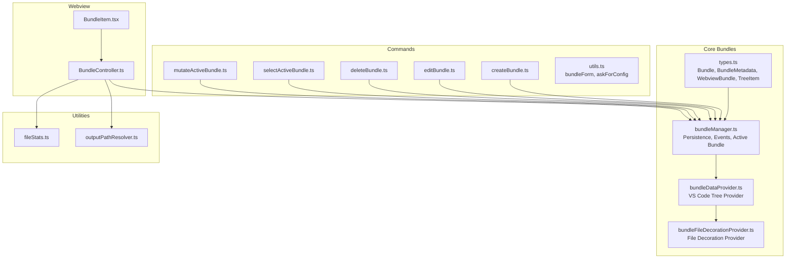
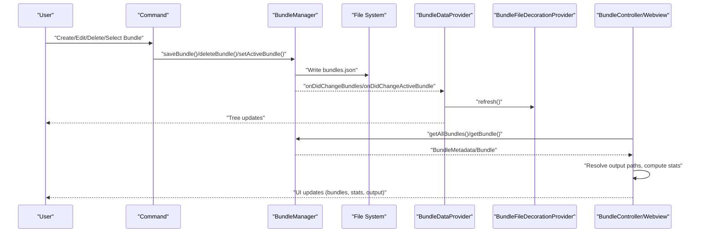
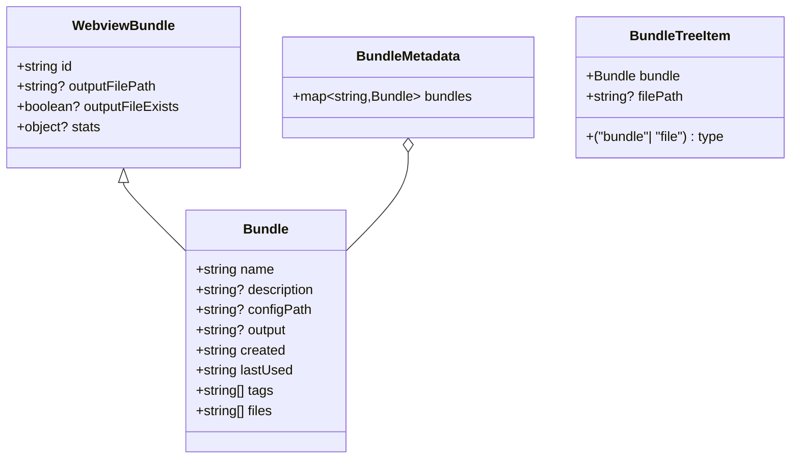
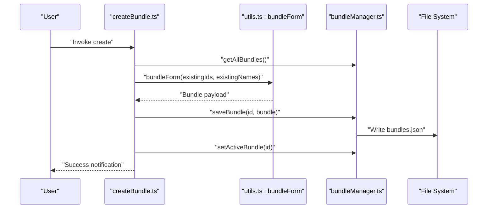
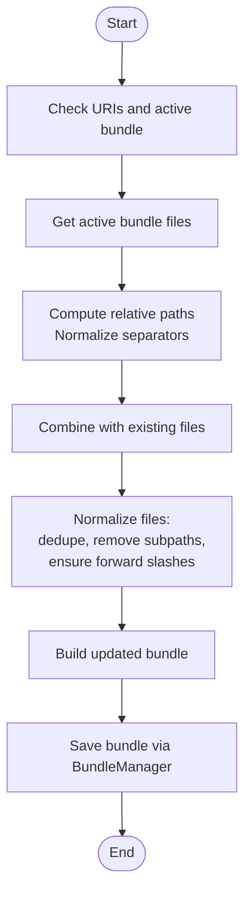
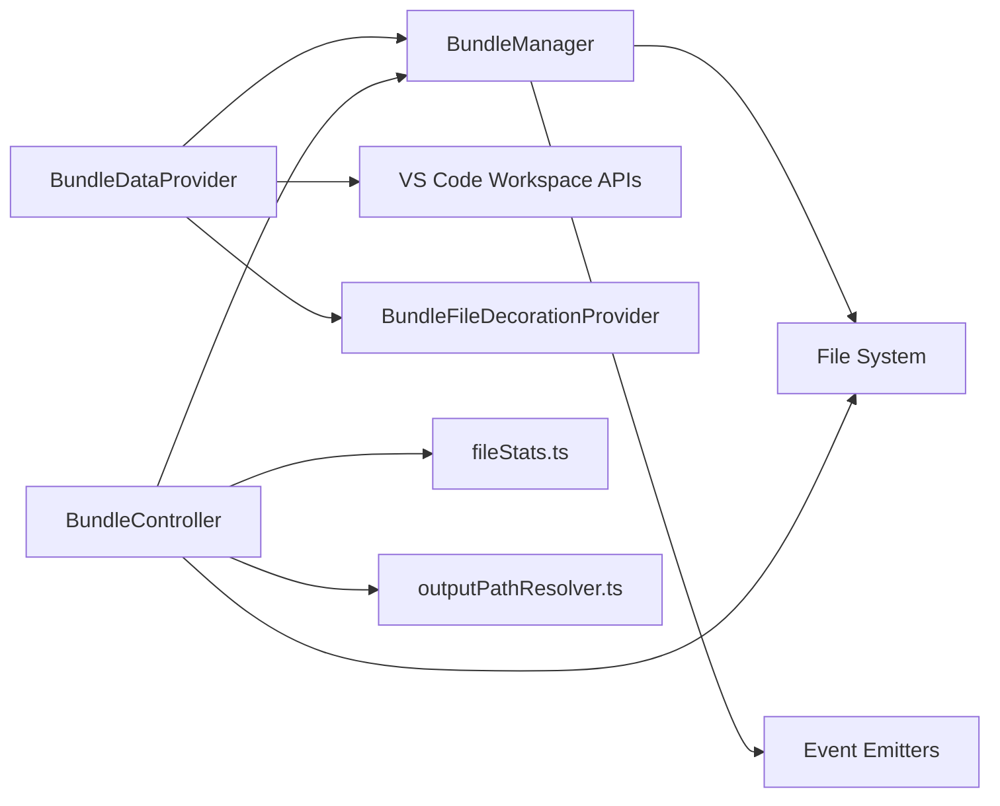

# Bundle Types

<cite>
**Referenced Files in This Document**
- [types.ts](file://src/core/bundles/types.ts)
- [bundleManager.ts](file://src/core/bundles/bundleManager.ts)
- [bundleDataProvider.ts](file://src/core/bundles/bundleDataProvider.ts)
- [bundleFileDecorationProvider.ts](file://src/core/bundles/bundleFileDecorationProvider.ts)
- [createBundle.ts](file://src/commands/createBundle.ts)
- [editBundle.ts](file://src/commands/editBundle.ts)
- [deleteBundle.ts](file://src/commands/deleteBundle.ts)
- [selectActiveBundle.ts](file://src/commands/selectActiveBundle.ts)
- [mutateActiveBundle.ts](file://src/commands/mutateActiveBundle.ts)
- [utils.ts](file://src/commands/utils.ts)
- [BundleController.ts](file://src/webview/controllers/BundleController.ts)
- [BundleItem.tsx](file://src/webview/components/BundleItem.tsx)
- [fileStats.ts](file://src/core/files/fileStats.ts)
- [outputPathResolver.ts](file://src/core/files/outputPathResolver.ts)
- [bundleManager.test.ts](file://src/test/core/bundles/bundleManager.test.ts)
- [bundleDataProviders.test.ts](file://src/test/core/bundles/bundleDataProviders.test.ts)
</cite>

## Table of Contents
1. [Introduction](#introduction)
2. [Project Structure](#project-structure)
3. [Core Components](#core-components)
4. [Architecture Overview](#architecture-overview)
5. [Detailed Component Analysis](#detailed-component-analysis)
6. [Dependency Analysis](#dependency-analysis)
7. [Performance Considerations](#performance-considerations)
8. [Troubleshooting Guide](#troubleshooting-guide)
9. [Conclusion](#conclusion)
10. [Appendices](#appendices)

## Introduction
This document describes the Bundle Types system in Repomix Runner Plus. It covers the data structures, interfaces, and type safety mechanisms used to model and manage file bundles. It explains the bundle metadata schema, file inclusion patterns, and bundle state management. It also documents the integration with the VS Code tree view system, UI components, persistence and serialization, and the indexing and file watching mechanisms that keep the UI synchronized with the workspace.

## Project Structure
The bundle system spans several modules:
- Core data types and tree view integration
- Persistence and state management
- Command handlers for bundle lifecycle operations
- Webview controller and UI components for bundle presentation and actions
- Utilities for statistics and output path resolution

**Diagram sources**
- [types.ts](file://src/core/bundles/types.ts#L1-L37)
- [bundleManager.ts](file://src/core/bundles/bundleManager.ts#L1-L117)
- [bundleDataProvider.ts](file://src/core/bundles/bundleDataProvider.ts#L1-L325)
- [bundleFileDecorationProvider.ts](file://src/core/bundles/bundleFileDecorationProvider.ts#L1-L30)
- [createBundle.ts](file://src/commands/createBundle.ts#L1-L32)
- [editBundle.ts](file://src/commands/editBundle.ts#L1-L49)
- [deleteBundle.ts](file://src/commands/deleteBundle.ts#L1-L9)
- [selectActiveBundle.ts](file://src/commands/selectActiveBundle.ts#L1-L55)
- [mutateActiveBundle.ts](file://src/commands/mutateActiveBundle.ts#L1-L348)
- [utils.ts](file://src/commands/utils.ts#L1-L148)
- [BundleController.ts](file://src/webview/controllers/BundleController.ts#L1-L257)
- [BundleItem.tsx](file://src/webview/components/BundleItem.tsx#L1-L121)
- [fileStats.ts](file://src/core/files/fileStats.ts#L1-L74)
- [outputPathResolver.ts](file://src/core/files/outputPathResolver.ts#L1-L44)

**Section sources**
- [types.ts](file://src/core/bundles/types.ts#L1-L37)
- [bundleManager.ts](file://src/core/bundles/bundleManager.ts#L1-L117)
- [bundleDataProvider.ts](file://src/core/bundles/bundleDataProvider.ts#L1-L325)
- [bundleFileDecorationProvider.ts](file://src/core/bundles/bundleFileDecorationProvider.ts#L1-L30)
- [createBundle.ts](file://src/commands/createBundle.ts#L1-L32)
- [editBundle.ts](file://src/commands/editBundle.ts#L1-L49)
- [deleteBundle.ts](file://src/commands/deleteBundle.ts#L1-L9)
- [selectActiveBundle.ts](file://src/commands/selectActiveBundle.ts#L1-L55)
- [mutateActiveBundle.ts](file://src/commands/mutateActiveBundle.ts#L1-L348)
- [utils.ts](file://src/commands/utils.ts#L1-L148)
- [BundleController.ts](file://src/webview/controllers/BundleController.ts#L1-L257)
- [BundleItem.tsx](file://src/webview/components/BundleItem.tsx#L1-L121)
- [fileStats.ts](file://src/core/files/fileStats.ts#L1-L74)
- [outputPathResolver.ts](file://src/core/files/outputPathResolver.ts#L1-L44)

## Core Components
- Bundle: The primary data structure representing a named collection of files with metadata and tags.
- BundleMetadata: Top-level container holding a dictionary of bundles keyed by id.
- WebviewBundle: Extended bundle shape enriched with computed fields for the webview (output path, existence, stats).
- BundleTreeItem: VS Code tree item variant carrying bundle identity and type information.

Key responsibilities:
- Define strict shapes for runtime and persistence.
- Enable type-safe operations across commands, providers, and webview layers.
- Support cross-platform path normalization and consistent storage.

**Section sources**
- [types.ts](file://src/core/bundles/types.ts#L3-L36)

## Architecture Overview
The bundle system integrates persistence, UI, and file watching:

**Diagram sources**
- [bundleManager.ts](file://src/core/bundles/bundleManager.ts#L18-L115)
- [bundleDataProvider.ts](file://src/core/bundles/bundleDataProvider.ts#L31-L62)
- [bundleFileDecorationProvider.ts](file://src/core/bundles/bundleFileDecorationProvider.ts#L26-L28)
- [BundleController.ts](file://src/webview/controllers/BundleController.ts#L77-L134)

## Detailed Component Analysis

### Data Types and Interfaces
- Bundle: name, optional description, optional configPath, optional output, timestamps, tags, and files list.
- BundleMetadata: bundles map keyed by id.
- BundleTreeItem: VS Code TreeItem extended with bundle, type, and optional filePath.
- WebviewBundle: Bundle plus id, output file path, existence flag, and stats.

Type safety highlights:
- Strict separation between persisted Bundle and UI-focused WebviewBundle prevents accidental misuse of computed fields.
- Event emitters for bundle changes decouple persistence from UI updates.

**Section sources**
- [types.ts](file://src/core/bundles/types.ts#L3-L36)

### Bundle Manager
Responsibilities:
- Initialize persistent storage under the workspace’s .repomix directory.
- Provide CRUD operations for bundles and active bundle selection.
- Emit events when bundles or active bundle change to notify consumers.

Persistence:
- Uses a JSON file (bundles.json) with a bundles map.
- Ensures directory creation and default file initialization if missing.

Events:
- onDidChangeBundles fires after save/delete.
- onDidChangeActiveBundle fires when active bundle changes.

Active bundle:
- Persists via VS Code context for UI state.
- Provides getters/setters for active bundle id and retrieval of active bundle.

**Section sources**
- [bundleManager.ts](file://src/core/bundles/bundleManager.ts#L18-L115)

### VS Code Tree Provider
Responsibilities:
- Build a hierarchical tree from bundle file lists.
- Track missing files and pending scans for lazy-loading directories.
- Provide TreeItem instances with icons, commands, and context values.
- Refresh on bundle changes and active bundle changes.
- Watch file deletions and trigger reloads when relevant.

Tree construction:
- Normalizes paths and splits into segments to build parent-child nodes.
- Distinguishes directories from files; marks pending scan for directories.
- Handles missing resources gracefully by marking nodes as missing.

Decoration:
- Integrates with BundleFileDecorationProvider to highlight bundle files in the editor.

Change detection:
- Watches file system deletions and refreshes the tree when affected paths are included in any bundle.

**Section sources**
- [bundleDataProvider.ts](file://src/core/bundles/bundleDataProvider.ts#L69-L192)
- [bundleDataProvider.ts](file://src/core/bundles/bundleDataProvider.ts#L194-L210)
- [bundleDataProvider.ts](file://src/core/bundles/bundleDataProvider.ts#L240-L283)
- [bundleDataProvider.ts](file://src/core/bundles/bundleDataProvider.ts#L314-L323)

### File Decoration Provider
Responsibilities:
- Compute terminal file URIs for the active bundle.
- Provide badges for files that belong to the active bundle.

Integration:
- Refresh triggered by tree provider and bundle changes.

**Section sources**
- [bundleFileDecorationProvider.ts](file://src/core/bundles/bundleFileDecorationProvider.ts#L1-L30)

### Commands and UI Integration
- Create bundle: collects form inputs, generates a unique id, saves, sets as active, notifies user.
- Edit bundle: selects active bundle, opens form, persists edits.
- Delete bundle: removes from storage, resets active bundle, notifies user.
- Select active bundle: quick pick of existing bundles or fallback messaging.
- Mutate active bundle: add/remove files with normalization and deduplication, directory-aware removal, and compression heuristics.

Form validation:
- Enforces non-empty, safe names and uniqueness.
- Optional config selection via workspace search.

File mutation logic:
- Converts to relative paths and normalizes separators for storage.
- Deduplicates and prunes subpaths when directories are present.
- Expands directories when removing subsets and recomputes compressible directories.

**Section sources**
- [createBundle.ts](file://src/commands/createBundle.ts#L7-L31)
- [editBundle.ts](file://src/commands/editBundle.ts#L6-L48)
- [deleteBundle.ts](file://src/commands/deleteBundle.ts#L5-L8)
- [selectActiveBundle.ts](file://src/commands/selectActiveBundle.ts#L6-L54)
- [mutateActiveBundle.ts](file://src/commands/mutateActiveBundle.ts#L15-L112)
- [mutateActiveBundle.ts](file://src/commands/mutateActiveBundle.ts#L114-L275)
- [utils.ts](file://src/commands/utils.ts#L5-L81)
- [utils.ts](file://src/commands/utils.ts#L88-L147)

### Webview Controller and UI
Responsibilities:
- Load and refresh bundles for the webview.
- Resolve output file paths per bundle and default repomix output.
- Watch output file changes and update UI accordingly.
- Compute and cache bundle statistics (files, folders, total size).
- Provide copy-to-clipboard actions for outputs.

Statistics:
- Uses cached stats to render quickly, recalculating lazily when missing.

Output path resolution:
- Considers bundle-specific config path, global runner config, and defaults.
- Applies output style and file extension normalization.

**Section sources**
- [BundleController.ts](file://src/webview/controllers/BundleController.ts#L77-L134)
- [BundleController.ts](file://src/webview/controllers/BundleController.ts#L144-L206)
- [BundleItem.tsx](file://src/webview/components/BundleItem.tsx#L7-L120)
- [fileStats.ts](file://src/core/files/fileStats.ts#L10-L73)
- [outputPathResolver.ts](file://src/core/files/outputPathResolver.ts#L10-L43)

### Class Diagram: Core Types

**Diagram sources**
- [types.ts](file://src/core/bundles/types.ts#L3-L36)

### Sequence Diagram: Create Bundle Flow

**Diagram sources**
- [createBundle.ts](file://src/commands/createBundle.ts#L7-L31)
- [utils.ts](file://src/commands/utils.ts#L5-L81)
- [bundleManager.ts](file://src/core/bundles/bundleManager.ts#L75-L90)

### Flowchart: Add/Remove Files Logic

**Diagram sources**
- [mutateActiveBundle.ts](file://src/commands/mutateActiveBundle.ts#L15-L112)
- [mutateActiveBundle.ts](file://src/commands/mutateActiveBundle.ts#L114-L132)

## Dependency Analysis
- BundleManager depends on:
  - VS Code commands for context setting
  - File system for initialization and persistence
  - Event emitters for change notifications
- BundleDataProvider depends on:
  - BundleManager for data
  - VS Code workspace APIs for file stats and scanning
  - BundleFileDecorationProvider for decorations
- BundleController depends on:
  - BundleManager for bundle metadata
  - File system watchers for output files
  - Stats and output path resolvers for UI rendering

**Diagram sources**
- [bundleManager.ts](file://src/core/bundles/bundleManager.ts#L1-L117)
- [bundleDataProvider.ts](file://src/core/bundles/bundleDataProvider.ts#L1-L325)
- [BundleController.ts](file://src/webview/controllers/BundleController.ts#L1-L257)
- [fileStats.ts](file://src/core/files/fileStats.ts#L1-L74)
- [outputPathResolver.ts](file://src/core/files/outputPathResolver.ts#L1-L44)

**Section sources**
- [bundleManager.ts](file://src/core/bundles/bundleManager.ts#L1-L117)
- [bundleDataProvider.ts](file://src/core/bundles/bundleDataProvider.ts#L1-L325)
- [BundleController.ts](file://src/webview/controllers/BundleController.ts#L1-L257)
- [fileStats.ts](file://src/core/files/fileStats.ts#L1-L74)
- [outputPathResolver.ts](file://src/core/files/outputPathResolver.ts#L1-L44)

## Performance Considerations
- Lazy directory scanning: directories are scanned on-demand to minimize startup cost.
- File stats caching: bundle statistics are cached to avoid repeated traversal.
- Debounced UI refresh: webview updates are debounced to batch changes.
- Cross-platform path normalization: storage uses forward slashes to avoid OS-specific issues and simplify comparisons.

[No sources needed since this section provides general guidance]

## Troubleshooting Guide
Common issues and resolutions:
- Missing bundles.json: The manager initializes the file automatically if absent.
- Active bundle not updating: Ensure setActiveBundle is invoked and context is set.
- Tree not refreshing after deletion: File deletion watcher triggers reload if any bundle includes the deleted path.
- Stats not appearing: Stats are computed lazily; wait for debounce or trigger refresh.
- Output path mismatch: Verify bundle configPath, runner config, and output style settings.

**Section sources**
- [bundleManager.ts](file://src/core/bundles/bundleManager.ts#L18-L30)
- [bundleDataProvider.ts](file://src/core/bundles/bundleDataProvider.ts#L194-L209)
- [BundleController.ts](file://src/webview/controllers/BundleController.ts#L67-L75)
- [outputPathResolver.ts](file://src/core/files/outputPathResolver.ts#L10-L43)

## Conclusion
The Bundle Types system provides a robust, type-safe foundation for organizing and managing file collections in Repomix Runner Plus. It integrates tightly with VS Code’s tree view and webview, supports efficient file watching and statistics computation, and offers clear validation and mutation semantics for reliable bundle lifecycle management.

[No sources needed since this section summarizes without analyzing specific files]

## Appendices

### Practical Examples

- Create a bundle
  - Invoke the create command, fill the form, and observe the new bundle appear in the tree and become active.
  - See [createBundle.ts](file://src/commands/createBundle.ts#L7-L31) and [utils.ts](file://src/commands/utils.ts#L5-L81).

- Edit a bundle
  - Select the active bundle and update name, description, tags, or files; save persists changes.
  - See [editBundle.ts](file://src/commands/editBundle.ts#L6-L48).

- Delete a bundle
  - Choose a bundle node and run delete; the bundle is removed and active bundle reset.
  - See [deleteBundle.ts](file://src/commands/deleteBundle.ts#L5-L8).

- Add files to active bundle
  - Select files and add; normalization ensures deduplication and directory pruning.
  - See [mutateActiveBundle.ts](file://src/commands/mutateActiveBundle.ts#L15-L112).

- Remove files from active bundle
  - Select files and remove; directory-aware logic expands and recomputes compressible directories.
  - See [mutateActiveBundle.ts](file://src/commands/mutateActiveBundle.ts#L114-L275).

- Query bundles
  - Retrieve all bundles or a single bundle via the manager.
  - See [bundleManager.ts](file://src/core/bundles/bundleManager.ts#L55-L73).

- Validation rules
  - Name validation, uniqueness checks, and optional config selection.
  - See [utils.ts](file://src/commands/utils.ts#L17-L81) and [utils.ts](file://src/commands/utils.ts#L88-L147).

- Conflict resolution
  - Directory vs file conflicts resolved by pruning subpaths and recomputing compressible directories.
  - See [mutateActiveBundle.ts](file://src/commands/mutateActiveBundle.ts#L114-L275).

- Error handling patterns
  - Try/catch around file operations; logging and user notifications for failures.
  - See [bundleManager.ts](file://src/core/bundles/bundleManager.ts#L75-L115), [createBundle.ts](file://src/commands/createBundle.ts#L18-L30), [editBundle.ts](file://src/commands/editBundle.ts#L43-L47).

### Tests Overview
- BundleManager tests cover initialization, active bundle context, CRUD operations, and event firing.
  - See [bundleManager.test.ts](file://src/test/core/bundles/bundleManager.test.ts#L29-L298).
- BundleDataProvider tests cover tree building, lazy scanning, missing files, and file opening commands.
  - See [bundleDataProviders.test.ts](file://src/test/core/bundles/bundleDataProviders.test.ts#L65-L402).