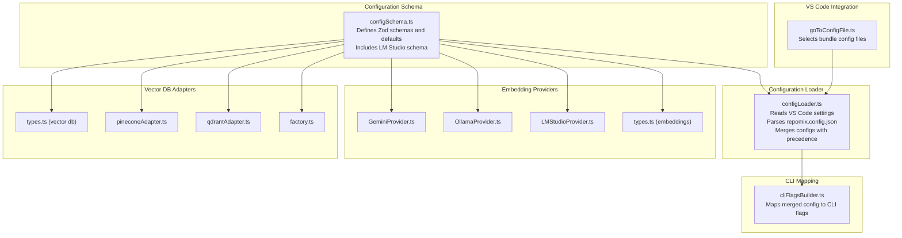
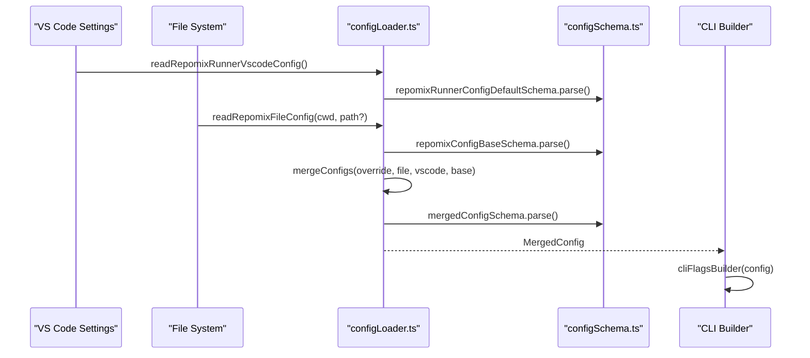
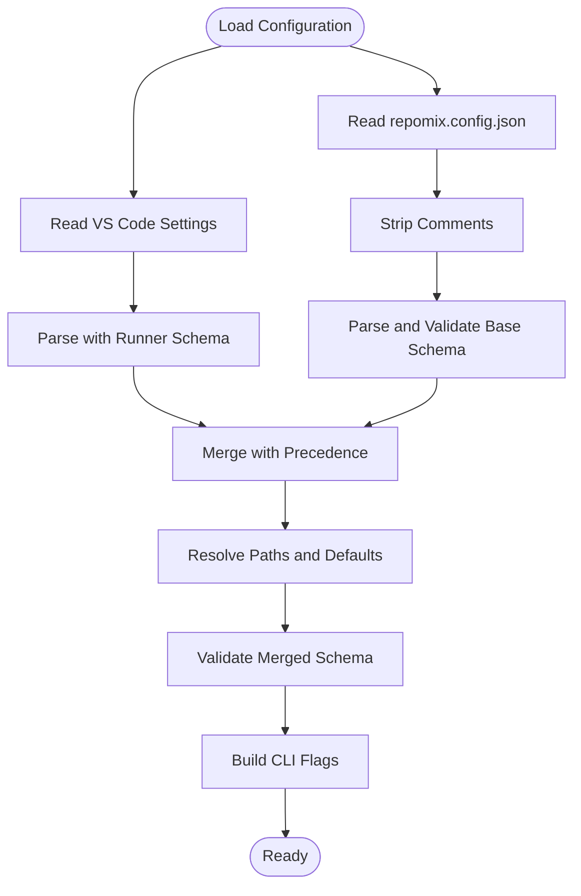
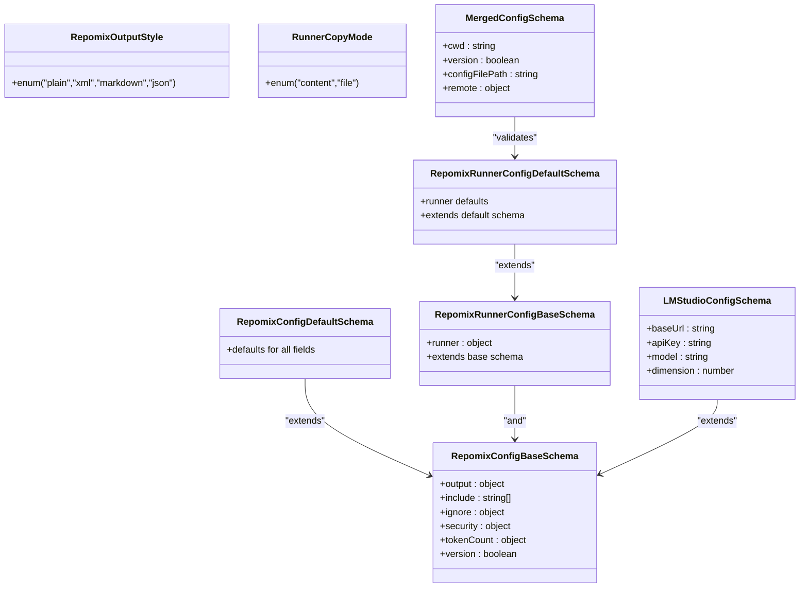
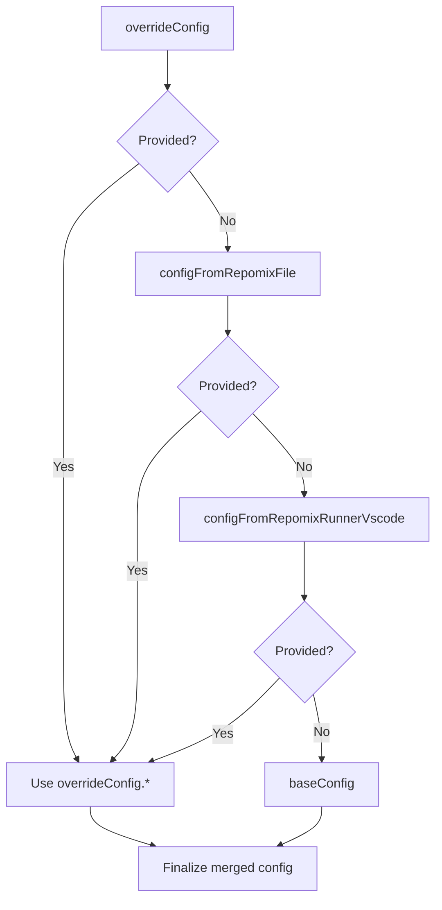
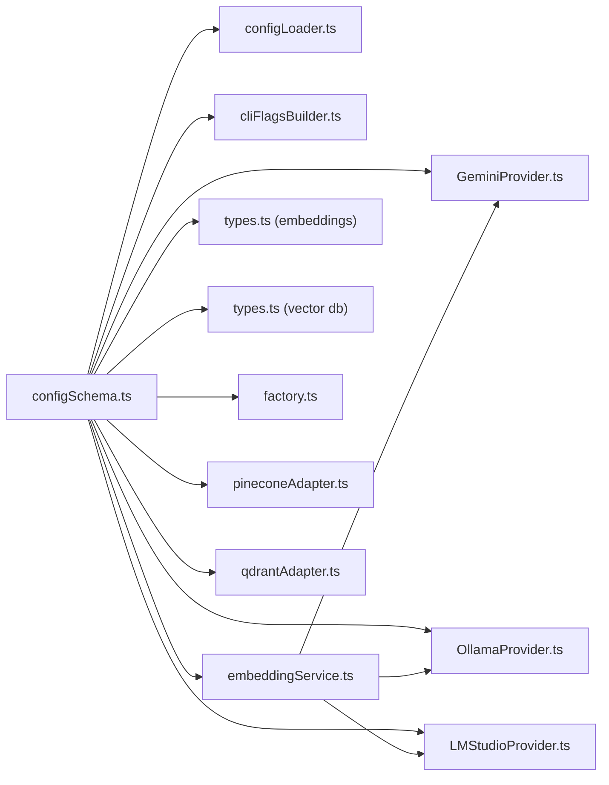

# Configuration Schema

<cite>
**Referenced Files in This Document**
- [configSchema.ts](file://src/config/configSchema.ts)
- [configLoader.ts](file://src/config/configLoader.ts)
- [repomix.config.json](file://repomix.config.json)
- [cliFlagsBuilder.ts](file://src/core/cli/cliFlagsBuilder.ts)
- [GeminiProvider.ts](file://src/core/indexing/embeddings/GeminiProvider.ts)
- [OllamaProvider.ts](file://src/core/indexing/embeddings/OllamaProvider.ts)
- [LMStudioProvider.ts](file://src/core/indexing/embeddings/LMStudioProvider.ts)
- [types.ts (embeddings)](file://src/core/indexing/embeddings/types.ts)
- [types.ts (vector db)](file://src/core/indexing/vectorDb/types.ts)
- [pineconeAdapter.ts](file://src/core/indexing/vectorDb/providers/pineconeAdapter.ts)
- [qdrantAdapter.ts](file://src/core/indexing/vectorDb/providers/qdrantAdapter.ts)
- [factory.ts](file://src/core/indexing/vectorDb/factory.ts)
- [goToConfigFile.ts](file://src/commands/goToConfigFile.ts)
- [outputPathResolver.test.ts](file://src/test/core/files/outputPathResolver.test.ts)
- [embeddingService.ts](file://src/core/indexing/embeddingService.ts)
- [SettingsTab.tsx](file://src/webview/components/SettingsTab.tsx)
- [ConfigController.ts](file://src/webview/controllers/ConfigController.ts)
</cite>

## Update Summary
**Changes Made**
- Added LM Studio embedding provider configuration schema documentation
- Updated embedding provider types to include LM Studio alongside Gemini and Ollama
- Documented LM Studio configuration properties: base URL, API key, model selection, and dimension settings
- Added LM Studio-specific configuration validation and defaults
- Updated configuration precedence to include LM Studio settings

## Table of Contents
1. [Introduction](#introduction)
2. [Project Structure](#project-structure)
3. [Core Components](#core-components)
4. [Architecture Overview](#architecture-overview)
5. [Detailed Component Analysis](#detailed-component-analysis)
6. [Dependency Analysis](#dependency-analysis)
7. [Performance Considerations](#performance-considerations)
8. [Troubleshooting Guide](#troubleshooting-guide)
9. [Conclusion](#conclusion)
10. [Appendices](#appendices)

## Introduction
This document describes the configuration schema system in Repomix Runner Plus. It explains how configuration is defined, validated, loaded, and merged from multiple sources, including VS Code settings, repomix.config.json, and runtime overrides. It also documents the configuration types for embedding providers, vector database adapters, clipboard modes, and indexing parameters, along with precedence rules, validation feedback, and troubleshooting guidance.

**Updated** Added comprehensive documentation for LM Studio embedding provider configuration, including schema definitions, validation rules, and integration with the broader configuration system.

## Project Structure
The configuration system spans three primary areas:
- Schema definitions that declare allowed keys, types, defaults, and validation rules
- Loader utilities that read and merge configuration from VS Code settings and repomix.config.json
- CLI mapping that translates merged configuration into command-line flags

**Diagram sources**
- [configSchema.ts](file://src/config/configSchema.ts#L1-L175)
- [configLoader.ts](file://src/config/configLoader.ts#L1-L230)
- [cliFlagsBuilder.ts](file://src/core/cli/cliFlagsBuilder.ts#L1-L215)
- [goToConfigFile.ts](file://src/commands/goToConfigFile.ts#L1-L36)
- [GeminiProvider.ts](file://src/core/indexing/embeddings/GeminiProvider.ts#L1-L78)
- [OllamaProvider.ts](file://src/core/indexing/embeddings/OllamaProvider.ts#L1-L46)
- [LMStudioProvider.ts](file://src/core/indexing/embeddings/LMStudioProvider.ts#L1-L90)
- [types.ts (embeddings)](file://src/core/indexing/embeddings/types.ts#L1-L6)
- [types.ts (vector db)](file://src/core/indexing/vectorDb/types.ts#L1-L44)
- [pineconeAdapter.ts](file://src/core/indexing/vectorDb/providers/pineconeAdapter.ts)
- [qdrantAdapter.ts](file://src/core/indexing/vectorDb/providers/qdrantAdapter.ts)
- [factory.ts](file://src/core/indexing/vectorDb/factory.ts)

**Section sources**
- [configSchema.ts](file://src/config/configSchema.ts#L1-L175)
- [configLoader.ts](file://src/config/configLoader.ts#L1-L230)
- [cliFlagsBuilder.ts](file://src/core/cli/cliFlagsBuilder.ts#L1-L215)
- [goToConfigFile.ts](file://src/commands/goToConfigFile.ts#L1-L36)

## Core Components
- Configuration schemas define the shape of configuration objects, including enums, optional fields, passthrough support for extensibility, and default values.
- The loader reads VS Code settings and repomix.config.json, strips comments from JSON, validates against schemas, and merges them with deterministic precedence.
- CLI mapping converts merged configuration into flags, warning on unsupported keys.

Key responsibilities:
- Define and validate configuration shapes
- Load and parse configuration from multiple sources
- Merge and normalize configuration with explicit precedence
- Translate configuration to CLI flags for external tooling

**Updated** Enhanced with LM Studio embedding provider configuration schema and validation rules.

**Section sources**
- [configSchema.ts](file://src/config/configSchema.ts#L1-L175)
- [configLoader.ts](file://src/config/configLoader.ts#L1-L230)
- [cliFlagsBuilder.ts](file://src/core/cli/cliFlagsBuilder.ts#L1-L215)

## Architecture Overview
The configuration architecture follows a layered approach:
- Schemas: Strongly typed definitions with defaults
- Loader: Reads and validates sources, resolves file paths, and merges
- CLI: Produces flags from merged configuration
- VS Code integration: Selects and opens configuration files per bundle

**Diagram sources**
- [configLoader.ts](file://src/config/configLoader.ts#L99-L229)
- [configSchema.ts](file://src/config/configSchema.ts#L103-L175)
- [cliFlagsBuilder.ts](file://src/core/cli/cliFlagsBuilder.ts#L43-L215)

## Detailed Component Analysis

### Configuration Schema Definitions
The schema system defines:
- Output styles and default file name mapping
- Base configuration schema for repomix.config.json
- Default configuration schema with sensible defaults
- Runner-specific schema for VS Code extension settings
- Merged configuration schema that adds runtime metadata
- **New** LM Studio configuration schema for local embedding provider

Highlights:
- Output style enum restricts style to predefined values
- Passthrough allows future-proofing of configuration sections
- Defaults are applied via default() on fields and a default object for sections
- Runner schema extends the base schema to include VS Code-specific keys
- **New** LM Studio schema includes base URL validation, optional API key, model selection, and dimension settings

Practical implications:
- Adding new keys to repomix.config.json is supported via passthrough
- Defaults ensure predictable behavior when keys are omitted
- Runner schema isolates VS Code-specific settings while inheriting base configuration
- **New** LM Studio configuration provides comprehensive validation for local AI model deployment

**Section sources**
- [configSchema.ts](file://src/config/configSchema.ts#L1-L175)

### Configuration Loading and Validation
The loader performs:
- Reading VS Code settings under the repomix namespace and validating with the runner schema
- Locating repomix.config.json, stripping comments, parsing JSON, and validating with the base schema
- Merging sources with explicit precedence and resolving output file paths
- Returning a merged configuration validated against the merged schema

Comment stripping supports:
- Single-line comments (//)
- Multi-line comments (/* */)
- Escaped quotes inside strings are handled correctly

Precedence rules:
1. overrideConfig (highest)
2. repomix.config.json
3. VS Code settings
4. base defaults (lowest)

Output path resolution:
- Adds file extension based on output.style
- Supports directory targets when enabled and include points to a single directory

**Section sources**
- [configLoader.ts](file://src/config/configLoader.ts#L17-L130)
- [configLoader.ts](file://src/config/configLoader.ts#L132-L229)
- [repomix.config.json](file://repomix.config.json#L1-L43)

### Configuration Types for Embedding Providers
Embedding providers expose a common interface and require configuration:
- IEmbeddingProvider defines embedText, embedTexts, and getDimensions
- GeminiProvider requires an API key and uses a fixed embedding dimension
- OllamaProvider requires URL, model, and dimension
- **New** LMStudioProvider requires base URL, optional API key, model, and dimension

These types inform how embedding-related configuration is structured and validated within the broader schema system.

**Updated** Enhanced with LM Studio provider configuration including comprehensive validation rules.

**Section sources**
- [types.ts (embeddings)](file://src/core/indexing/embeddings/types.ts#L1-L6)
- [GeminiProvider.ts](file://src/core/indexing/embeddings/GeminiProvider.ts#L1-L78)
- [OllamaProvider.ts](file://src/core/indexing/embeddings/OllamaProvider.ts#L1-L46)
- [LMStudioProvider.ts](file://src/core/indexing/embeddings/LMStudioProvider.ts#L1-L90)

### LM Studio Configuration Schema
**New Section** The LM Studio configuration schema provides comprehensive validation for local AI model deployment:

- **baseUrl**: String URL with automatic validation, defaults to 'http://localhost:1234/v1'
- **apiKey**: Optional string with empty string default, supports bearer token authentication
- **model**: Required string with minimum length validation, specifies the embedding model name
- **dimension**: Positive number with default 768, validates embedding vector dimensions

Validation rules:
- Base URL must be a valid URL format
- Model field requires non-empty string
- Dimension must be positive number
- API key is optional but validated when provided

Integration points:
- Webview settings interface with real-time validation
- VS Code workspace configuration storage
- Embedding service provider switching
- Model fetching and dimension testing capabilities

**Section sources**
- [configSchema.ts](file://src/config/configSchema.ts#L151-L157)
- [LMStudioProvider.ts](file://src/core/indexing/embeddings/LMStudioProvider.ts#L1-L90)
- [SettingsTab.tsx](file://src/webview/components/SettingsTab.tsx#L870-L984)
- [ConfigController.ts](file://src/webview/controllers/ConfigController.ts#L746-L751)

### Vector Database Adapter Types
Vector database adapters define a common interface for upsert/query/delete operations:
- Provider type union for supported backends
- Vector shape with id, values, and metadata
- Query result with matches and scores
- Adapter interface with provider identification and CRUD-like methods

These types influence how vector database configuration is represented and validated in the schema system.

**Section sources**
- [types.ts (vector db)](file://src/core/indexing/vectorDb/types.ts#L1-L44)

### Clipboard Modes and Runner Settings
Runner settings include:
- Copy mode enum with content and file modes
- Flags controlling verbosity, output retention, target-as-output behavior, and bundle naming for output
- Runner settings are part of the runner schema and contribute to merged configuration

These settings impact how outputs are produced and presented, particularly in the VS Code extension context.

**Section sources**
- [configSchema.ts](file://src/config/configSchema.ts#L103-L136)

### CLI Flag Mapping and Unsupported Keys
The CLI builder:
- Translates merged configuration into command-line flags
- Warns on unsupported keys, including internal-only keys and runner-only keys when not applicable
- Normalizes include patterns and handles negated flags for boolean toggles

This mapping ensures compatibility with external tooling while surfacing configuration mismatches.

**Section sources**
- [cliFlagsBuilder.ts](file://src/core/cli/cliFlagsBuilder.ts#L1-L215)

### VS Code Settings Integration and File Selection
VS Code integration:
- Reads repomix settings from the workspace configuration
- Provides helpers to locate and open repomix.config.json files per bundle
- Supports selecting among multiple config files and handling legacy locations

This enables seamless authoring and switching of configuration files within the editor.

**Section sources**
- [configLoader.ts](file://src/config/configLoader.ts#L99-L103)
- [goToConfigFile.ts](file://src/commands/goToConfigFile.ts#L1-L36)

## Architecture Overview

**Diagram sources**
- [configLoader.ts](file://src/config/configLoader.ts#L99-L229)
- [configSchema.ts](file://src/config/configSchema.ts#L103-L175)
- [cliFlagsBuilder.ts](file://src/core/cli/cliFlagsBuilder.ts#L43-L215)

## Detailed Component Analysis

### Schema Class Model

**Diagram sources**
- [configSchema.ts](file://src/config/configSchema.ts#L3-L175)

### Configuration Resolution Flow

**Diagram sources**
- [configLoader.ts](file://src/config/configLoader.ts#L132-L229)

### Example: Output Path Resolution
- When runner.useTargetAsOutput is enabled and include resolves to a single directory, the output file path is resolved relative to that directory
- The output file extension is added based on output.style
- The final path is resolved against the current working directory

**Section sources**
- [configLoader.ts](file://src/config/configLoader.ts#L166-L184)

### Example: Comment Stripping in repomix.config.json
- Single-line comments (// ...) are replaced with whitespace
- Multi-line comments (/* ... */) are replaced with whitespace
- Escaped quotes inside strings are preserved

**Section sources**
- [configLoader.ts](file://src/config/configLoader.ts#L17-L95)

### Example: CLI Mapping Warnings
- Internal-only keys (e.g., cwd) are ignored
- Runner-only keys (e.g., keepOutputFile) produce warnings when unsupported by CLI flags
- Unknown keys trigger warnings

**Section sources**
- [cliFlagsBuilder.ts](file://src/core/cli/cliFlagsBuilder.ts#L151-L214)

### Example: LM Studio Configuration Validation
**New Example** LM Studio configuration validation demonstrates comprehensive schema enforcement:

- Base URL validation ensures proper URL format with automatic default
- API key validation supports optional bearer token authentication
- Model selection requires non-empty string with minimum length validation
- Dimension validation enforces positive numeric values with sensible defaults

The validation system provides immediate feedback for configuration errors and ensures compatibility with the LM Studio embedding provider.

**Section sources**
- [configSchema.ts](file://src/config/configSchema.ts#L151-L157)
- [LMStudioProvider.ts](file://src/core/indexing/embeddings/LMStudioProvider.ts#L23-L30)

## Dependency Analysis
- configLoader.ts depends on configSchema.ts for schema definitions and default values
- cliFlagsBuilder.ts depends on MergedConfig type from configSchema.ts
- Embedding providers depend on types.ts (embeddings) and are influenced by configuration schemas
- **New** LM Studio provider integrates with the unified embedding service architecture
- Vector DB adapters depend on types.ts (vector db) and are influenced by configuration schemas

**Diagram sources**
- [configSchema.ts](file://src/config/configSchema.ts#L1-L175)
- [configLoader.ts](file://src/config/configLoader.ts#L1-L230)
- [cliFlagsBuilder.ts](file://src/core/cli/cliFlagsBuilder.ts#L1-L215)
- [GeminiProvider.ts](file://src/core/indexing/embeddings/GeminiProvider.ts#L1-L78)
- [OllamaProvider.ts](file://src/core/indexing/embeddings/OllamaProvider.ts#L1-L46)
- [LMStudioProvider.ts](file://src/core/indexing/embeddings/LMStudioProvider.ts#L1-L90)
- [embeddingService.ts](file://src/core/indexing/embeddingService.ts#L1-L84)
- [types.ts (embeddings)](file://src/core/indexing/embeddings/types.ts#L1-L6)
- [types.ts (vector db)](file://src/core/indexing/vectorDb/types.ts#L1-L44)
- [factory.ts](file://src/core/indexing/vectorDb/factory.ts)
- [pineconeAdapter.ts](file://src/core/indexing/vectorDb/providers/pineconeAdapter.ts)
- [qdrantAdapter.ts](file://src/core/indexing/vectorDb/providers/qdrantAdapter.ts)

**Section sources**
- [configSchema.ts](file://src/config/configSchema.ts#L1-L175)
- [configLoader.ts](file://src/config/configLoader.ts#L1-L230)
- [cliFlagsBuilder.ts](file://src/core/cli/cliFlagsBuilder.ts#L1-L215)

## Performance Considerations
- Comment stripping is linear in the size of the configuration file; keep repomix.config.json reasonably sized
- Merging prioritizes later sources; avoid excessive overrides to reduce merge overhead
- CLI flag building is O(N) over configuration keys; minimize unnecessary nested sections
- Embedding provider calls are external API-bound; cache results where appropriate and batch requests
- **New** LM Studio provider performance considerations include local model inference latency and memory usage

## Troubleshooting Guide
Common issues and resolutions:
- Invalid repomix.config.json format
  - Symptom: Error message indicating invalid JSON format
  - Action: Validate JSON syntax and remove trailing commas; ensure comments are valid
  - Reference: [configLoader.ts](file://src/config/configLoader.ts#L121-L129)
- Cannot access config file at path
  - Symptom: Error message indicating inability to access the file
  - Action: Verify file path correctness and permissions
  - Reference: [configLoader.ts](file://src/config/configLoader.ts#L111-L119)
- Unexpected output file extension
  - Symptom: Output file does not match expected extension
  - Action: Confirm output.style and ensure addFileExtension is applied
  - Reference: [configLoader.ts](file://src/config/configLoader.ts#L184-L184)
- Conflicting configuration sources
  - Symptom: Unexpected behavior due to overridden settings
  - Action: Review precedence order and disable unwanted overrides
  - Reference: [configLoader.ts](file://src/config/configLoader.ts#L132-L138)
- Unsupported configuration keys for CLI
  - Symptom: Warning about unsupported keys
  - Action: Remove or adjust keys not supported by CLI flags
  - Reference: [cliFlagsBuilder.ts](file://src/core/cli/cliFlagsBuilder.ts#L151-L214)
- Legacy config file location
  - Symptom: Need to migrate from old .repomix/config path
  - Action: Use goToConfigFile to select and confirm migration
  - Reference: [goToConfigFile.ts](file://src/commands/goToConfigFile.ts#L1-L36)
- **New** LM Studio connection failures
  - Symptom: API request failures or invalid response format
  - Action: Verify base URL accessibility, model availability, and dimension compatibility
  - Reference: [LMStudioProvider.ts](file://src/core/indexing/embeddings/LMStudioProvider.ts#L41-L45)
- **New** LM Studio configuration validation errors
  - Symptom: Schema validation failures for base URL, model, or dimension
  - Action: Check URL format, model name spelling, and dimension value positivity
  - Reference: [configSchema.ts](file://src/config/configSchema.ts#L151-L157)

**Section sources**
- [configLoader.ts](file://src/config/configLoader.ts#L111-L129)
- [configLoader.ts](file://src/config/configLoader.ts#L132-L138)
- [cliFlagsBuilder.ts](file://src/core/cli/cliFlagsBuilder.ts#L151-L214)
- [goToConfigFile.ts](file://src/commands/goToConfigFile.ts#L1-L36)
- [LMStudioProvider.ts](file://src/core/indexing/embeddings/LMStudioProvider.ts#L41-L45)
- [configSchema.ts](file://src/config/configSchema.ts#L151-L157)

## Conclusion
The configuration schema system in Repomix Runner Plus provides a robust, extensible, and strongly validated foundation for managing configuration across multiple sources. With clear precedence rules, comprehensive defaults, and explicit validation, it ensures predictable behavior while enabling flexible customization. The integration with VS Code settings and CLI mapping further enhances usability and interoperability.

**Updated** The addition of LM Studio embedding provider configuration significantly expands the system's flexibility for local AI model deployment, providing comprehensive validation, real-time feedback, and seamless integration with the existing configuration architecture.

## Appendices

### Configuration Precedence and Resolution Summary
- Highest precedence: overrideConfig
- Next: repomix.config.json
- Next: VS Code settings
- Lowest precedence: base defaults

Resolution specifics:
- include: last source wins
- output.filePath: resolved against cwd and extended with style-appropriate suffix
- output.style: determines file extension
- ignore.customPatterns: concatenated across sources
- security.enableSecurityCheck: last source wins
- tokenCount.encoding: last source wins
- version: override if present
- configFilePath: provided or from runner configPath
- **New** lmstudio.baseUrl: validated URL with automatic default
- **New** lmstudio.apiKey: optional bearer token authentication
- **New** lmstudio.model: required model name validation
- **New** lmstudio.dimension: positive numeric dimension validation

**Section sources**
- [configLoader.ts](file://src/config/configLoader.ts#L132-L229)
- [configSchema.ts](file://src/config/configSchema.ts#L151-L157)

### Practical Examples and References
- Example: Output path resolution with directory target
  - Reference: [configLoader.ts](file://src/config/configLoader.ts#L166-L184)
- Example: Comment-stripping behavior
  - Reference: [configLoader.ts](file://src/config/configLoader.ts#L17-L95)
- Example: CLI mapping warnings
  - Reference: [cliFlagsBuilder.ts](file://src/core/cli/cliFlagsBuilder.ts#L151-L214)
- Example: Legacy config file selection
  - Reference: [goToConfigFile.ts](file://src/commands/goToConfigFile.ts#L1-L36)
- **New** Example: LM Studio configuration validation
  - Reference: [configSchema.ts](file://src/config/configSchema.ts#L151-L157)
- **New** Example: LM Studio embedding provider integration
  - Reference: [embeddingService.ts](file://src/core/indexing/embeddingService.ts#L65-L69)
- **New** Example: LM Studio webview configuration interface
  - Reference: [SettingsTab.tsx](file://src/webview/components/SettingsTab.tsx#L870-L984)