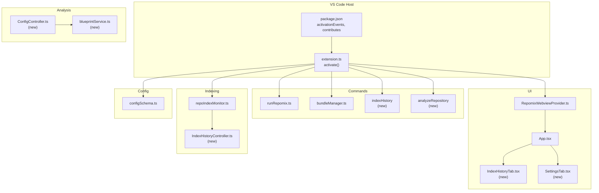
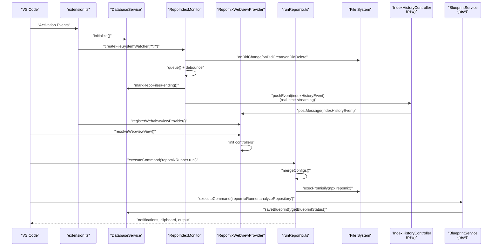
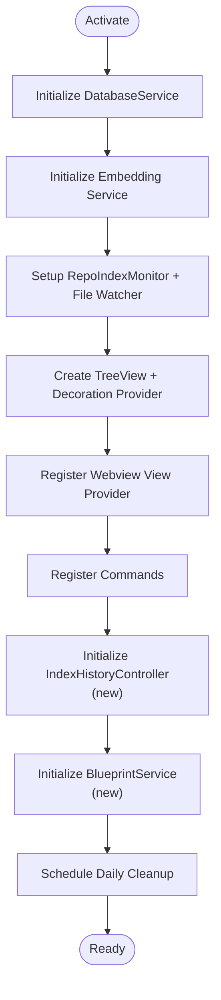
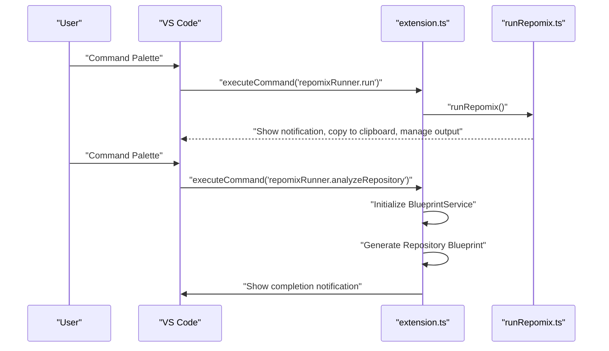
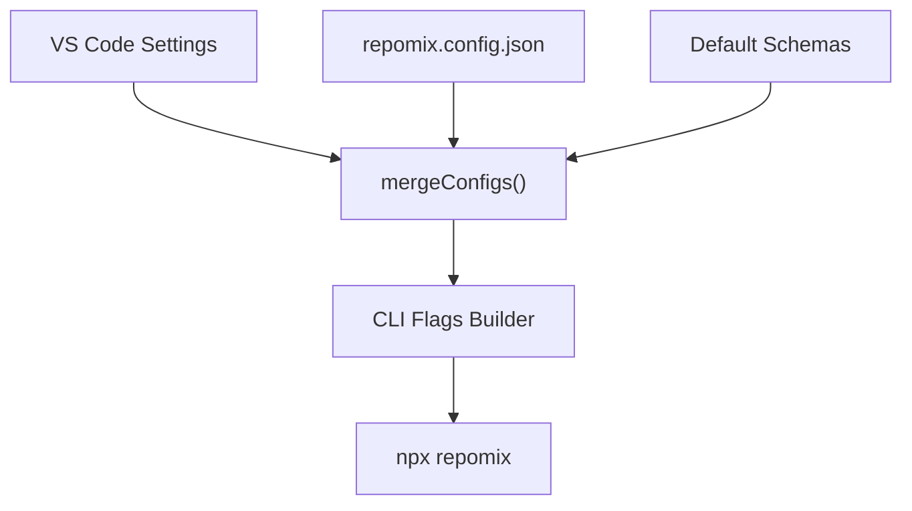
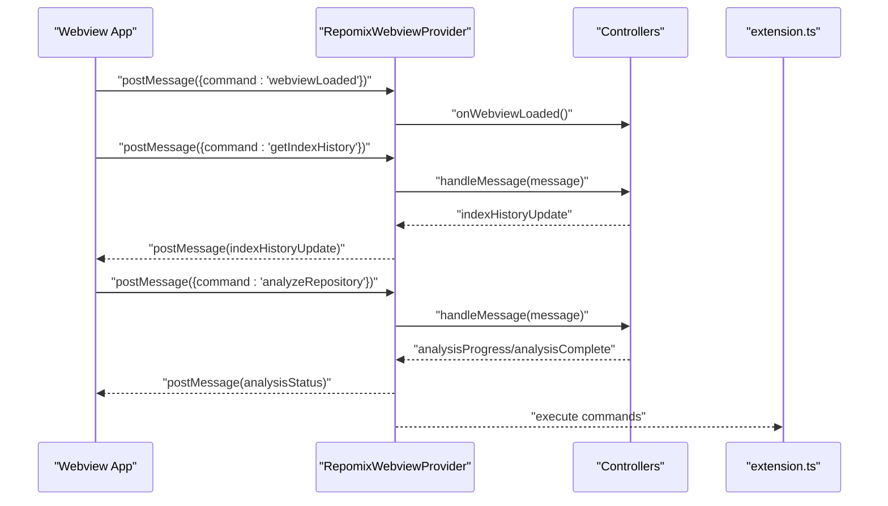
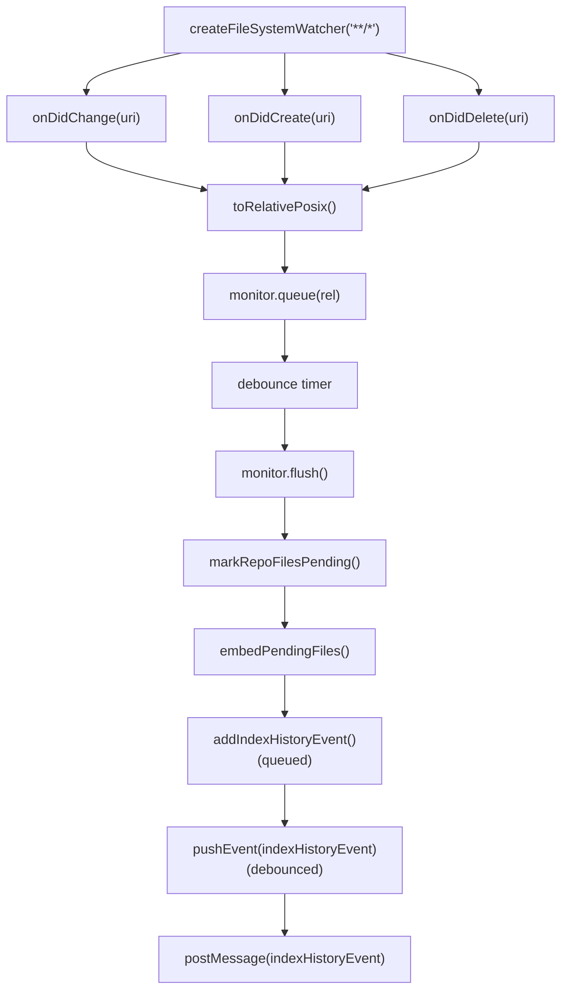
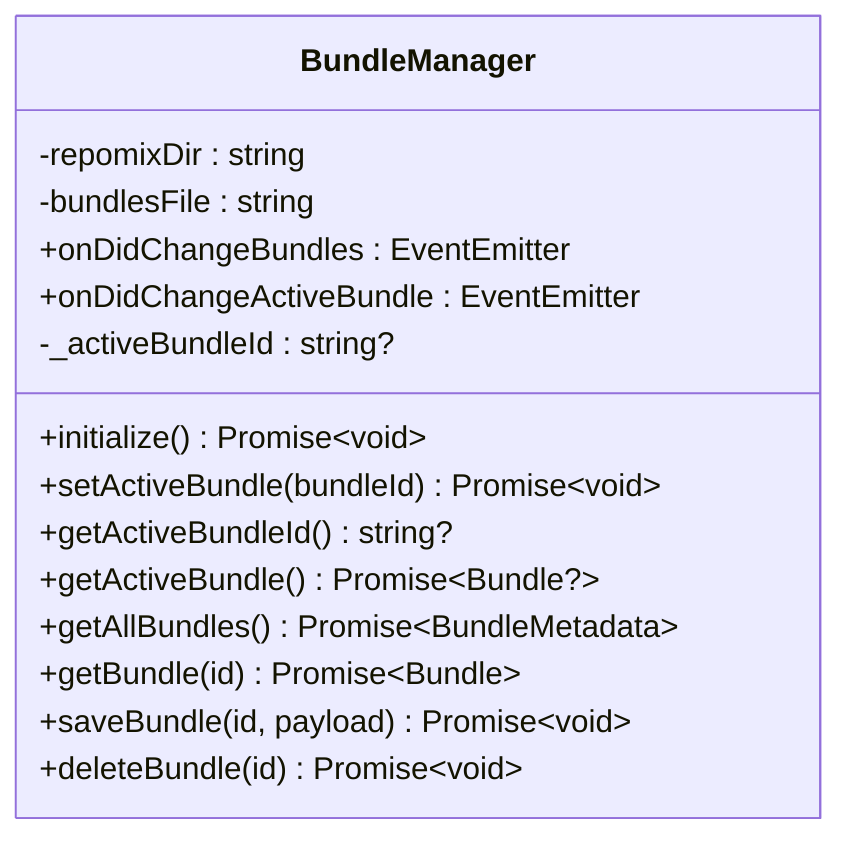
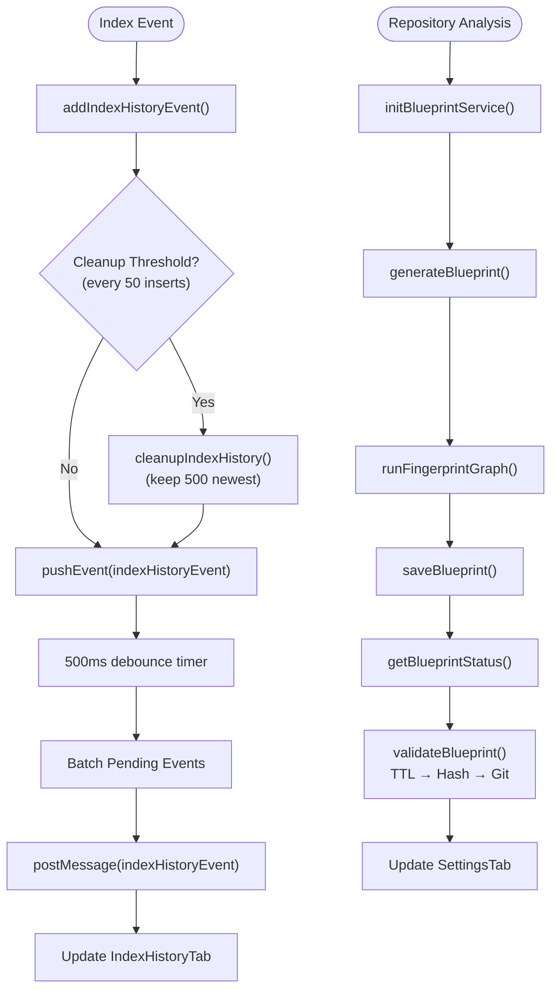
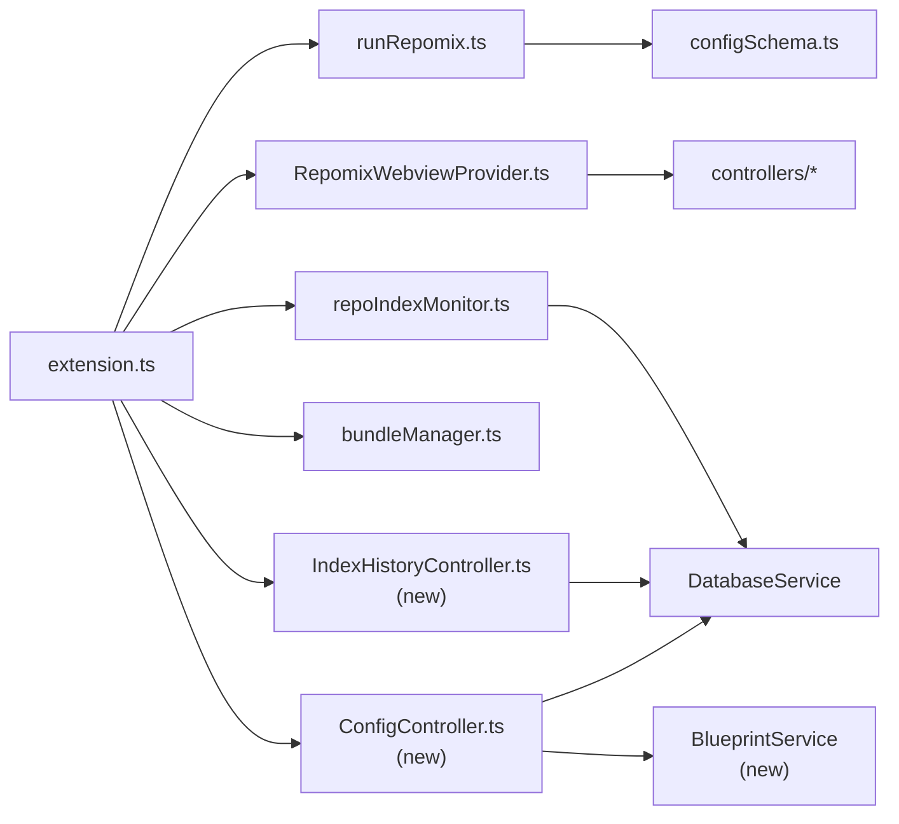

# Extension API

<cite>
**Referenced Files in This Document**
- [package.json](file://package.json)
- [extension.ts](file://src/extension.ts)
- [configSchema.ts](file://src/config/configSchema.ts)
- [App.tsx](file://src/webview/App.tsx)
- [RepomixWebviewProvider.ts](file://src/webview/RepomixWebviewProvider.ts)
- [runRepomix.ts](file://src/commands/runRepomix.ts)
- [bundleManager.ts](file://src/core/bundles/bundleManager.ts)
- [repoIndexMonitor.ts](file://src/core/indexing/repoIndexMonitor.ts)
- [logger.ts](file://src/shared/logger.ts)
- [README.md](file://README.md)
- [IndexHistoryTab.tsx](file://src/webview/components/IndexHistoryTab.tsx)
- [IndexHistoryController.ts](file://src/webview/controllers/IndexHistoryController.ts)
- [databaseService.ts](file://src/core/storage/databaseService.ts)
- [messageSchemas.ts](file://src/webview/messageSchemas.ts)
- [ConfigController.ts](file://src/webview/controllers/ConfigController.ts)
- [blueprintService.ts](file://src/fingerprint/blueprintService.ts)
- [SettingsTab.tsx](file://src/webview/components/SettingsTab.tsx)
</cite>

## Update Summary
**Changes Made**
- Added documentation for new Index History feature with real-time event streaming
- Added documentation for Repository Analysis commands including blueprint generation and validation
- Updated command registration patterns to include new analysis and history commands
- Enhanced webview controller documentation with new message schemas and controllers
- Added new sections covering blueprint service architecture and fingerprinting capabilities

## Table of Contents
1. [Introduction](#introduction)
2. [Project Structure](#project-structure)
3. [Core Components](#core-components)
4. [Architecture Overview](#architecture-overview)
5. [Detailed Component Analysis](#detailed-component-analysis)
6. [Dependency Analysis](#dependency-analysis)
7. [Performance Considerations](#performance-considerations)
8. [Troubleshooting Guide](#troubleshooting-guide)
9. [Conclusion](#conclusion)
10. [Appendices](#appendices)

## Introduction
This document describes the Repomix Runner Plus extension API and lifecycle. It covers how the extension activates, registers commands and views, integrates with VS Code's ecosystem, and exposes internal services for other extensions. It also documents the extension's contribution points (commands, menus, views, configuration), the webview control panel, file system watchers, and the API surface for state and events. **Updated** to include new Index History monitoring capabilities and Repository Analysis features.

## Project Structure
The extension is organized around a modular architecture:
- Activation and lifecycle orchestration in the extension entrypoint
- Command registration and execution flows
- Configuration schemas and runtime configuration merging
- Webview-based control panel with controllers and message routing
- Background indexing and file watching for incremental embeddings
- Storage and state management for bundles and agent runs
- **New**: Index history tracking with real-time event streaming
- **New**: Repository analysis with blueprint generation and validation

**Diagram sources**
- [package.json](file://package.json#L20-L540)
- [extension.ts](file://src/extension.ts#L43-L781)
- [runRepomix.ts](file://src/commands/runRepomix.ts#L48-L154)
- [bundleManager.ts](file://src/core/bundles/bundleManager.ts#L6-L116)
- [RepomixWebviewProvider.ts](file://src/webview/RepomixWebviewProvider.ts#L19-L288)
- [App.tsx](file://src/webview/App.tsx#L47-L258)
- [repoIndexMonitor.ts](file://src/core/indexing/repoIndexMonitor.ts#L52-L224)
- [configSchema.ts](file://src/config/configSchema.ts#L15-L165)
- [IndexHistoryTab.tsx](file://src/webview/components/IndexHistoryTab.tsx#L1-L170)
- [IndexHistoryController.ts](file://src/webview/controllers/IndexHistoryController.ts#L1-L103)
- [ConfigController.ts](file://src/webview/controllers/ConfigController.ts#L908-L1017)
- [blueprintService.ts](file://src/fingerprint/blueprintService.ts#L1-L247)

**Section sources**
- [package.json](file://package.json#L20-L540)
- [extension.ts](file://src/extension.ts#L43-L781)

## Core Components
- Extension lifecycle and activation: Initializes services, sets up file watchers, registers commands, and exposes the webview control panel.
- Command palette and context menu integrations: Registers dozens of commands and menus for explorer, SCM, and view actions.
- Configuration schema: Defines and merges runner, output, include/ignore, security, token count, and embedding settings.
- Webview control panel: A React-based UI with tabs for bundles, search, settings, apply, and debug; communicates via a typed message bus.
- Background indexing monitor: Watches file system changes and triggers incremental embedding with debouncing and ignore filters.
- Bundle management: CRUD operations for bundles persisted in the workspace under a hidden directory.
- **New**: Index history tracking: Real-time monitoring and visualization of indexing events with automatic cleanup.
- **New**: Repository analysis: Blueprint generation, validation, and status management for intelligent repository understanding.
- Logging and output channel: Unified logging utility with console and output channel targets.

**Section sources**
- [extension.ts](file://src/extension.ts#L43-L781)
- [package.json](file://package.json#L30-L540)
- [configSchema.ts](file://src/config/configSchema.ts#L15-L165)
- [RepomixWebviewProvider.ts](file://src/webview/RepomixWebviewProvider.ts#L19-L288)
- [repoIndexMonitor.ts](file://src/core/indexing/repoIndexMonitor.ts#L52-L224)
- [bundleManager.ts](file://src/core/bundles/bundleManager.ts#L6-L116)
- [logger.ts](file://src/shared/logger.ts#L7-L132)
- [IndexHistoryController.ts](file://src/webview/controllers/IndexHistoryController.ts#L1-L103)
- [blueprintService.ts](file://src/fingerprint/blueprintService.ts#L1-L247)

## Architecture Overview
The extension follows a layered architecture:
- Entry point initializes services and registers contributions
- Commands orchestrate operations, delegating to core services
- Webview provides a UI layer with a message-driven controller pattern
- Background indexing monitors file changes and triggers incremental embedding
- Configuration schemas validate and merge settings from multiple sources
- **New**: Index history controller manages real-time event streaming and cleanup
- **New**: Blueprint service handles repository analysis and validation workflows

**Diagram sources**
- [extension.ts](file://src/extension.ts#L43-L781)
- [repoIndexMonitor.ts](file://src/core/indexing/repoIndexMonitor.ts#L52-L224)
- [RepomixWebviewProvider.ts](file://src/webview/RepomixWebviewProvider.ts#L43-L218)
- [runRepomix.ts](file://src/commands/runRepomix.ts#L48-L154)
- [IndexHistoryController.ts](file://src/webview/controllers/IndexHistoryController.ts#L65-L95)
- [blueprintService.ts](file://src/fingerprint/blueprintService.ts#L58-L91)

## Detailed Component Analysis

### Extension Lifecycle and Activation Hooks
- Activation events: The extension activates on specific commands and view activations, plus on startup.
- Initialization steps:
  - Database service initialization
  - Embedding provider selection and initialization (Gemini/Ollama)
  - Background indexing monitor setup with file watcher and ignore filters
  - Tree view provider for bundles and file decoration provider
  - Webview view provider registration
  - Command registrations for all user-facing actions
  - **New**: Index history controller initialization for real-time event streaming
  - **New**: Blueprint service initialization for repository analysis
  - Periodic cleanup of old agent runs and index history entries

**Diagram sources**
- [extension.ts](file://src/extension.ts#L43-L781)
- [IndexHistoryController.ts](file://src/webview/controllers/IndexHistoryController.ts#L1-L103)
- [blueprintService.ts](file://src/fingerprint/blueprintService.ts#L236-L246)

**Section sources**
- [extension.ts](file://src/extension.ts#L43-L781)
- [package.json](file://package.json#L20-L29)

### Command Registration Patterns and Menus
- Command palette entries: A comprehensive set of commands for running, bundling, editing, and managing bundles.
- **New**: Index History command: `repomixRunner.indexHistory` for retrieving index history data
- **New**: Repository Analysis command: `repomixRunner.analyzeRepository` for generating repository blueprints
- Context menus:
  - Explorer context menu for file/folder selections
  - SCM resource state context menu for Git diffs
  - View item context menu for bundle actions
- Visibility and grouping: Menus use conditions (e.g., active bundle presence) and groups for ordering.

**Diagram sources**
- [package.json](file://package.json#L309-L539)
- [extension.ts](file://src/extension.ts#L498-L500)
- [runRepomix.ts](file://src/commands/runRepomix.ts#L48-L154)
- [ConfigController.ts](file://src/webview/controllers/ConfigController.ts#L910-L977)

**Section sources**
- [package.json](file://package.json#L309-L539)
- [extension.ts](file://src/extension.ts#L498-L500)

### Configuration Schema and Runtime Merging
- Runner settings: verbosity, copy mode, output targeting, bundle naming, and config path.
- Output settings: file path, style, parsable style, header text, file summary, line numbers, compression, and more.
- Include/ignore: patterns and defaults, with Gitignore integration.
- Security and token count: security checks and encoding selection.
- Embedding settings: provider selection and provider-specific parameters.
- Runtime merging: merges VS Code settings with optional repomix.config.json, with precedence rules.

**Diagram sources**
- [configSchema.ts](file://src/config/configSchema.ts#L15-L165)
- [runRepomix.ts](file://src/commands/runRepomix.ts#L67-L73)

**Section sources**
- [configSchema.ts](file://src/config/configSchema.ts#L15-L165)
- [runRepomix.ts](file://src/commands/runRepomix.ts#L48-L154)

### Webview Control Panel and Message Bus
- Webview provider:
  - Generates HTML with CSP and loads the built React bundle
  - Initializes controllers and an execution queue manager
  - Handles messages from the webview with schema validation
  - Routes commands to controllers and manages notifications
- React app:
  - Tabs for bundles, search, settings, apply, debug, **and index history**
  - Receives updates from the extension (bundles, execution state, version)
  - Sends commands to the extension (run, cancel, copy, open file)
- **New**: Index History tab with real-time event streaming and statistics
- **New**: Repository Analysis tab with progress tracking and blueprint status

**Diagram sources**
- [RepomixWebviewProvider.ts](file://src/webview/RepomixWebviewProvider.ts#L92-L195)
- [App.tsx](file://src/webview/App.tsx#L78-L145)
- [IndexHistoryController.ts](file://src/webview/controllers/IndexHistoryController.ts#L18-L50)
- [ConfigController.ts](file://src/webview/controllers/ConfigController.ts#L936-L977)

**Section sources**
- [RepomixWebviewProvider.ts](file://src/webview/RepomixWebviewProvider.ts#L19-L288)
- [App.tsx](file://src/webview/App.tsx#L47-L258)

### Tree View Providers and File System Watchers
- Tree view provider:
  - Creates and registers a tree view for bundles
  - Sets the tree view and decoration provider on the data provider
- File system watcher:
  - Watches all files recursively with a 2.5-second debounce
  - Filters ignored paths (.gitignore + additional patterns)
  - Triggers incremental embedding via the orchestrator
- **New**: Index history event streaming:
  - Real-time push of indexing events to webview
  - Debounced event batching to prevent flooding
  - Automatic cleanup of old history entries

**Diagram sources**
- [extension.ts](file://src/extension.ts#L283-L339)
- [repoIndexMonitor.ts](file://src/core/indexing/repoIndexMonitor.ts#L52-L224)
- [IndexHistoryController.ts](file://src/webview/controllers/IndexHistoryController.ts#L65-L95)

**Section sources**
- [extension.ts](file://src/extension.ts#L404-L417)
- [repoIndexMonitor.ts](file://src/core/indexing/repoIndexMonitor.ts#L52-L224)

### Bundle Management and State
- BundleManager:
  - Manages a JSON metadata file under a hidden directory
  - Emits events for bundle changes and active bundle selection
  - Supports CRUD operations and active bundle context
- Events:
  - onDidChangeBundles and onDidChangeActiveBundle for UI updates

**Diagram sources**
- [bundleManager.ts](file://src/core/bundles/bundleManager.ts#L6-L116)

**Section sources**
- [bundleManager.ts](file://src/core/bundles/bundleManager.ts#L6-L116)

### Index History Tracking and Repository Analysis

#### Index History System
- **New**: Real-time event tracking for indexing operations
- **New**: Database-backed history with automatic cleanup (500-entry limit)
- **New**: Debounced event streaming to webview with 500ms delay
- **New**: Statistics aggregation (queued, flush, embedding_complete, embedding_failed)

#### Repository Analysis System
- **New**: Blueprint generation using fingerprinting graph
- **New**: Multi-layer validation (TTL, Hash, Git diff)
- **New**: Status tracking with expiration and invalidation reasons
- **New**: Progress reporting for long-running analysis operations

**Diagram sources**
- [databaseService.ts](file://src/core/storage/databaseService.ts#L1139-L1168)
- [IndexHistoryController.ts](file://src/webview/controllers/IndexHistoryController.ts#L65-L95)
- [blueprintService.ts](file://src/fingerprint/blueprintService.ts#L58-L91)
- [ConfigController.ts](file://src/webview/controllers/ConfigController.ts#L948-L951)

**Section sources**
- [databaseService.ts](file://src/core/storage/databaseService.ts#L1129-L1319)
- [IndexHistoryController.ts](file://src/webview/controllers/IndexHistoryController.ts#L1-L103)
- [blueprintService.ts](file://src/fingerprint/blueprintService.ts#L1-L247)
- [ConfigController.ts](file://src/webview/controllers/ConfigController.ts#L908-L1017)

### Logging and Output Channel
- Unified logger with multiple targets (console, output channel, both)
- Emoji-enhanced messages and verbose mode toggle
- Output channel named for the extension

**Section sources**
- [logger.ts](file://src/shared/logger.ts#L7-L132)

## Dependency Analysis
- External dependencies:
  - VS Code API for commands, views, webviews, secrets, workspace, and output channels
  - React and Fluent UI for the webview UI
  - LangChain and Pinecone/Qdrant adapters for embeddings
  - Utilities for ignore patterns, tokenization, and clipboard operations
- Internal dependencies:
  - Commands depend on config loaders and CLI flag builder
  - Webview provider depends on controllers and queue manager
  - Indexing monitor depends on database service and orchestrator
  - **New**: Index history controller depends on database service for event persistence
  - **New**: Blueprint service depends on database service for blueprint storage and validation

**Diagram sources**
- [extension.ts](file://src/extension.ts#L1-L42)
- [runRepomix.ts](file://src/commands/runRepomix.ts#L1-L16)
- [RepomixWebviewProvider.ts](file://src/webview/RepomixWebviewProvider.ts#L1-L16)
- [repoIndexMonitor.ts](file://src/core/indexing/repoIndexMonitor.ts#L1-L4)
- [bundleManager.ts](file://src/core/bundles/bundleManager.ts#L1-L4)
- [configSchema.ts](file://src/config/configSchema.ts#L1-L1)
- [IndexHistoryController.ts](file://src/webview/controllers/IndexHistoryController.ts#L1-L16)
- [ConfigController.ts](file://src/webview/controllers/ConfigController.ts#L1-L16)
- [blueprintService.ts](file://src/fingerprint/blueprintService.ts#L1-L6)

**Section sources**
- [package.json](file://package.json#L583-L603)
- [extension.ts](file://src/extension.ts#L1-L42)

## Performance Considerations
- Debounced file watching: 2.5 seconds to batch rapid saves and reduce redundant embeddings
- **New**: Debounced index history streaming: 500ms delay to batch rapid indexing events
- Ignore filters: Respect .gitignore and additional patterns to avoid indexing build artifacts and temporary files
- Concurrency control: Background embedding uses conservative concurrency limits
- Memory safety: Timers are cleared on dispose; controllers are disposed on webview close
- **New**: Automatic cleanup: Index history limited to 500 entries with periodic cleanup
- Clipboard operations: Hybrid remote workflow minimizes network overhead by transferring base64-encoded content locally

[No sources needed since this section provides general guidance]

## Troubleshooting Guide
- Missing API keys or vector database configuration:
  - Background monitor is skipped; check settings for embedding provider and vector DB credentials
- Remote clipboard issues:
  - Verify client OS detection and local binary availability; use the Debug tab to inspect environment
- Command failures:
  - Check the output channel for detailed logs; enable verbose mode for more information
- File watcher not triggering:
  - Confirm ignore patterns and that the workspace root is correct; verify file watcher subscription
- **New**: Index history not updating:
  - Check that indexing is active and events are being generated; verify webview connection
- **New**: Repository analysis failing:
  - Ensure API key is configured; check blueprint service initialization; verify workspace permissions

**Section sources**
- [extension.ts](file://src/extension.ts#L130-L397)
- [logger.ts](file://src/shared/logger.ts#L28-L30)
- [README.md](file://README.md#L112-L119)

## Conclusion
Repomix Runner Plus provides a robust, modular extension with strong integration points in VS Code. Its lifecycle is designed for efficient background indexing, a rich webview control panel, and a comprehensive command palette. **Updated** to include new Index History monitoring capabilities for real-time event tracking and Repository Analysis features for intelligent blueprint generation and validation. The configuration system supports flexible overrides, and the API surface enables other extensions to leverage bundle management, agent run history, and repository analysis through the exposed services.

[No sources needed since this section summarizes without analyzing specific files]

## Appendices

### Extension Activation and Deactivation
- Activation events: onCommand, onView, onStartupFinished
- Deactivation: disposes file watchers, timers, and webview controllers
- **New**: Index history controller disposal with timer cleanup
- **New**: Blueprint service singleton management

**Section sources**
- [package.json](file://package.json#L20-L29)
- [extension.ts](file://src/extension.ts#L338-L339)
- [RepomixWebviewProvider.ts](file://src/webview/RepomixWebviewProvider.ts#L214-L217)
- [IndexHistoryController.ts](file://src/webview/controllers/IndexHistoryController.ts#L97-L103)
- [blueprintService.ts](file://src/fingerprint/blueprintService.ts#L236-L246)

### Contribution Points to VS Code Ecosystem
- Commands: dozens of commands for bundles, runs, settings, and SCM integration
- **New**: Index History command for debugging and monitoring indexing operations
- **New**: Repository Analysis command for intelligent blueprint generation
- Menus: explorer, SCM, and view item context menus
- Views: explorer view for bundles and a webview-based control panel
- Configuration: comprehensive schema with multiple categories and defaults

**Section sources**
- [package.json](file://package.json#L30-L540)

### API Surface for Other Extensions
- Bundle management:
  - BundleManager exposes CRUD operations and events for bundle changes and active selection
- Agent run history:
  - DatabaseService persists and retrieves agent runs; used by regenerate command
- **New**: Index history tracking:
  - DatabaseService provides methods for adding, querying, and cleaning up index history events
  - IndexHistoryController manages real-time event streaming to webview
- **New**: Repository analysis:
  - BlueprintService provides blueprint generation, validation, and status management
  - DatabaseService stores and retrieves blueprint data with validation support
- Logging:
  - Shared logger utility for consistent messaging across the extension

**Section sources**
- [bundleManager.ts](file://src/core/bundles/bundleManager.ts#L6-L116)
- [extension.ts](file://src/extension.ts#L676-L725)
- [logger.ts](file://src/shared/logger.ts#L7-L132)
- [databaseService.ts](file://src/core/storage/databaseService.ts#L1129-L1319)
- [IndexHistoryController.ts](file://src/webview/controllers/IndexHistoryController.ts#L1-L103)
- [blueprintService.ts](file://src/fingerprint/blueprintService.ts#L1-L247)

### Practical Examples
- Extension initialization:
  - See activation steps and service initialization
- Command execution flow:
  - Example: repomix run command invokes the runRepomix function and handles output
  - **New**: Index history command retrieves and streams indexing events
  - **New**: Repository analysis command generates and validates blueprints
- Integration patterns:
  - Webview message bus for bidirectional communication
  - File watcher integration for background indexing
  - **New**: Real-time event streaming for index history monitoring
  - **New**: Progress reporting for long-running analysis operations

**Section sources**
- [extension.ts](file://src/extension.ts#L43-L781)
- [runRepomix.ts](file://src/commands/runRepomix.ts#L48-L154)
- [RepomixWebviewProvider.ts](file://src/webview/RepomixWebviewProvider.ts#L92-L195)
- [IndexHistoryController.ts](file://src/webview/controllers/IndexHistoryController.ts#L32-L50)
- [ConfigController.ts](file://src/webview/controllers/ConfigController.ts#L910-L977)

### Packaging, Distribution, and Marketplace Requirements
- Package scripts for building, packaging, and publishing
- Engine requirement for VS Code version
- Asset and icon references

**Section sources**
- [package.json](file://package.json#L541-L559)
- [README.md](file://README.md#L69-L75)

### New Features Reference

#### Index History Feature
- **Purpose**: Monitor and visualize indexing operations in real-time
- **Components**:
  - DatabaseService: Stores index history events with automatic cleanup
  - IndexHistoryController: Manages event streaming and debouncing
  - IndexHistoryTab: React component for displaying history and statistics
- **Usage**: Accessible through the webview control panel's Index History tab

#### Repository Analysis Feature
- **Purpose**: Generate intelligent blueprints of repositories for analysis and guidance
- **Components**:
  - BlueprintService: Manages blueprint lifecycle and validation
  - ConfigController: Handles analysis commands and progress reporting
  - SettingsTab: UI for initiating and monitoring analysis
- **Validation**: Multi-layer validation (TTL, Hash, Git diff) ensures blueprint accuracy
- **Storage**: Blueprints stored in database with expiration and token usage tracking

**Section sources**
- [databaseService.ts](file://src/core/storage/databaseService.ts#L1129-L1319)
- [IndexHistoryController.ts](file://src/webview/controllers/IndexHistoryController.ts#L1-L103)
- [IndexHistoryTab.tsx](file://src/webview/components/IndexHistoryTab.tsx#L1-L170)
- [blueprintService.ts](file://src/fingerprint/blueprintService.ts#L1-L247)
- [ConfigController.ts](file://src/webview/controllers/ConfigController.ts#L908-L1017)
- [SettingsTab.tsx](file://src/webview/components/SettingsTab.tsx#L969-L1012)