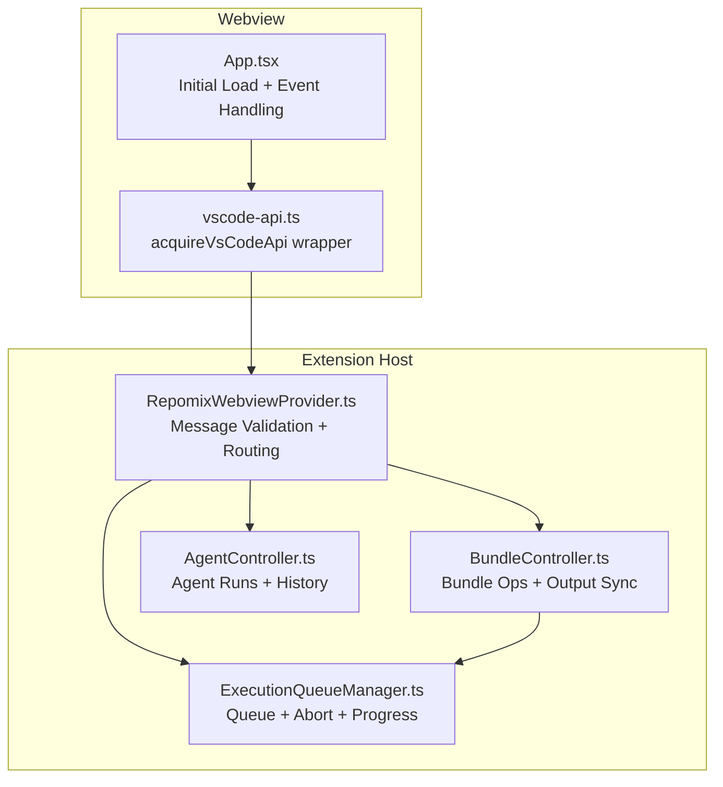
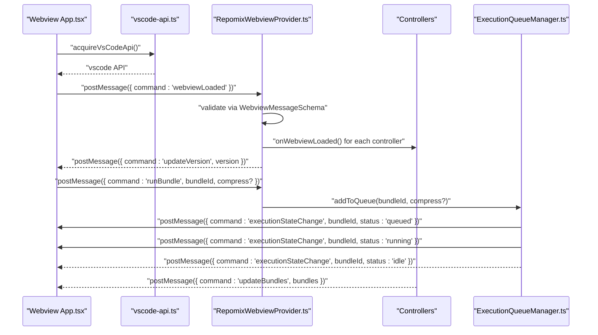
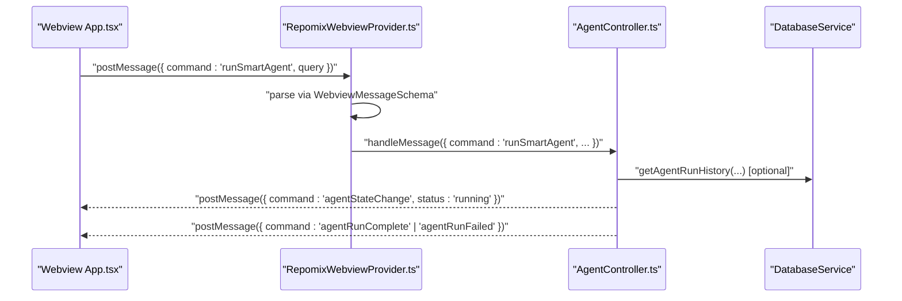
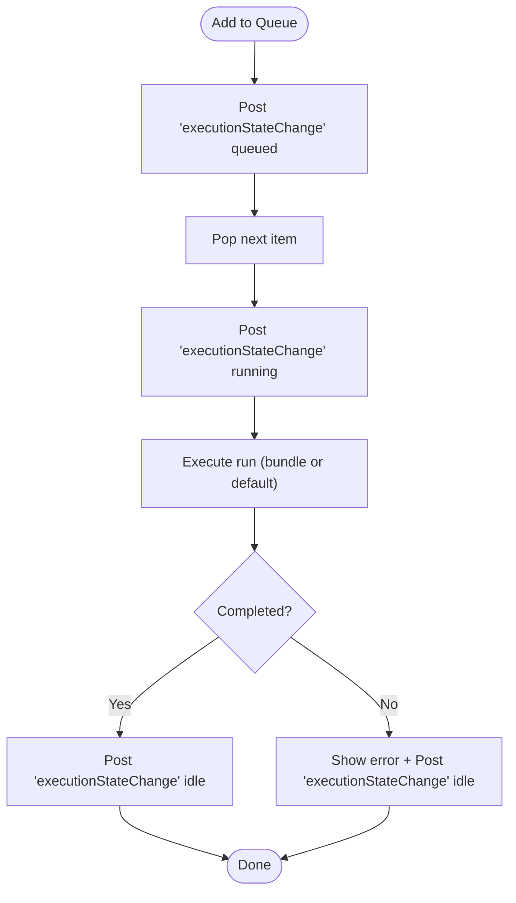
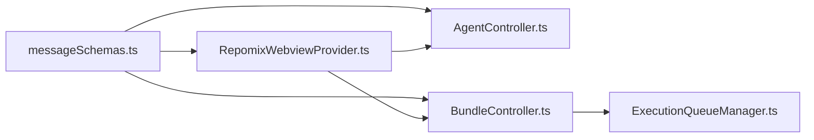

# Webview Messaging

<cite>
**Referenced Files in This Document**
- [messageSchemas.ts](file://src/webview/messageSchemas.ts)
- [types.ts](file://src/webview/types.ts)
- [RepomixWebviewProvider.ts](file://src/webview/RepomixWebviewProvider.ts)
- [App.tsx](file://src/webview/App.tsx)
- [BaseController.ts](file://src/webview/controllers/BaseController.ts)
- [BundleController.ts](file://src/webview/controllers/BundleController.ts)
- [AgentController.ts](file://src/webview/controllers/AgentController.ts)
- [ExecutionQueueManager.ts](file://src/webview/services/ExecutionQueueManager.ts)
- [vscode-api.ts](file://src/webview/vscode-api.ts)
- [messageSchemas.test.ts](file://src/test/webview/messageSchemas.test.ts)
</cite>

## Table of Contents
1. [Introduction](#introduction)
2. [Project Structure](#project-structure)
3. [Core Components](#core-components)
4. [Architecture Overview](#architecture-overview)
5. [Detailed Component Analysis](#detailed-component-analysis)
6. [Dependency Analysis](#dependency-analysis)
7. [Performance Considerations](#performance-considerations)
8. [Troubleshooting Guide](#troubleshooting-guide)
9. [Conclusion](#conclusion)

## Introduction
This document describes the webview messaging system used by Repomix Runner Plus. It covers the complete message schema definitions, request/response patterns, data validation rules, and type safety mechanisms. It explains the WebviewLoadedSchema through WebviewMessageSchema discriminated union, detailing each command’s purpose, parameters, and expected responses. It documents the message flow between the webview and the extension host, including error handling, state synchronization, and asynchronous operation patterns. It also explains the Zod schema validation approach, type inference patterns, and runtime type checking, and provides practical examples of message sending/receiving, event handling, and state management across the webview boundary.

## Project Structure
The messaging system spans several modules:
- Message schemas define typed contracts for inbound/outbound messages.
- The extension-side provider validates and routes messages to controllers.
- The webview-side app sends initial load and operational messages and reacts to state updates.
- Controllers implement command-specific logic and emit UI state updates.
- An execution queue manager coordinates asynchronous operations and emits progress/state updates.

**Diagram sources**
- [App.tsx](file://src/webview/App.tsx#L75-L145)
- [vscode-api.ts](file://src/webview/vscode-api.ts#L1-L24)
- [RepomixWebviewProvider.ts](file://src/webview/RepomixWebviewProvider.ts#L90-L195)
- [BundleController.ts](file://src/webview/controllers/BundleController.ts#L38-L60)
- [AgentController.ts](file://src/webview/controllers/AgentController.ts#L20-L42)
- [ExecutionQueueManager.ts](file://src/webview/services/ExecutionQueueManager.ts#L26-L40)

**Section sources**
- [messageSchemas.ts](file://src/webview/messageSchemas.ts#L443-L515)
- [RepomixWebviewProvider.ts](file://src/webview/RepomixWebviewProvider.ts#L19-L32)
- [App.tsx](file://src/webview/App.tsx#L47-L145)

## Core Components
- Message schemas: Strongly typed Zod schemas for all commands and responses.
- Discriminated union: A single schema that selects the correct shape based on the command field.
- Extension provider: Validates messages, dispatches to controllers, handles global commands, and posts state updates.
- Webview app: Sends initial load and operational commands, listens for state updates, and persists UI state.
- Controllers: Implement command handlers and emit UI state updates.
- Execution queue manager: Coordinates runs, cancellation, and progress notifications.

**Section sources**
- [messageSchemas.ts](file://src/webview/messageSchemas.ts#L1-L517)
- [RepomixWebviewProvider.ts](file://src/webview/RepomixWebviewProvider.ts#L90-L195)
- [App.tsx](file://src/webview/App.tsx#L75-L145)
- [BaseController.ts](file://src/webview/controllers/BaseController.ts#L8-L19)
- [ExecutionQueueManager.ts](file://src/webview/services/ExecutionQueueManager.ts#L15-L24)

## Architecture Overview
The messaging architecture is a strict request/response contract enforced by Zod schemas. The webview initiates the session with a load event, and the extension responds with version and initialization signals. Subsequent commands are validated and routed to specialized controllers. Asynchronous operations emit incremental state updates back to the webview.

**Diagram sources**
- [App.tsx](file://src/webview/App.tsx#L129-L132)
- [RepomixWebviewProvider.ts](file://src/webview/RepomixWebviewProvider.ts#L119-L133)
- [ExecutionQueueManager.ts](file://src/webview/services/ExecutionQueueManager.ts#L26-L40)
- [BundleController.ts](file://src/webview/controllers/BundleController.ts#L77-L134)

## Detailed Component Analysis

### Message Schema Definitions and Discriminated Union
- WebviewLoadedSchema: Initial handshake from webview.
- Command schemas: Each command defines required fields and validations (e.g., string length, enums, booleans).
- Discriminated union: A single schema that branches on the command field to select the correct shape.

Key validation rules observed:
- String constraints: min length, max length, startsWith prefix.
- Enum constraints: restricted values for platforms, providers, modes.
- Numeric constraints: integers, non-negative, bounded ranges.
- Optional fields: present only when applicable.

Type safety:
- A single type alias infers the union shape for TypeScript consumers.

Practical examples of message shapes are defined in tests and used throughout the codebase.

**Section sources**
- [messageSchemas.ts](file://src/webview/messageSchemas.ts#L3-L517)
- [messageSchemas.test.ts](file://src/test/webview/messageSchemas.test.ts#L1-L93)

### Webview Loaded and Global Commands
- Webview sends a load event to the extension.
- Extension validates the message, then:
  - Sends version info back to the webview.
  - Calls onWebviewLoaded on all controllers.
  - Requests initial Pinecone index status.

Global command handling:
- showNotification: Displays user-facing notifications based on severity.
- reportClientInfo: Records client OS/arch for remote clipboard support.
- openFile: Opens a file in the editor after resolving path.
- remoteClipboardProcessingComplete: Resolves a promise keyed by resolverKey.

**Section sources**
- [RepomixWebviewProvider.ts](file://src/webview/RepomixWebviewProvider.ts#L92-L195)
- [App.tsx](file://src/webview/App.tsx#L129-L141)

### Message Flow Between Webview and Extension
- Webview posts commands (e.g., runBundle, runDefaultRepomix, runSmartAgent).
- Extension validates with Zod, dispatches to controllers, and emits state updates.
- Controllers may call external services and post incremental updates (e.g., agent progress, bundle stats).

**Diagram sources**
- [App.tsx](file://src/webview/App.tsx#L147-L169)
- [RepomixWebviewProvider.ts](file://src/webview/RepomixWebviewProvider.ts#L179-L195)
- [AgentController.ts](file://src/webview/controllers/AgentController.ts#L20-L42)

### Execution Queue Manager and Asynchronous Operations
- Queues runs and manages concurrency.
- Emits state changes: queued, running, idle.
- Supports cancellation via AbortController.
- Notifies completion callbacks to refresh UI.

**Diagram sources**
- [ExecutionQueueManager.ts](file://src/webview/services/ExecutionQueueManager.ts#L26-L118)

**Section sources**
- [ExecutionQueueManager.ts](file://src/webview/services/ExecutionQueueManager.ts#L15-L133)
- [BundleController.ts](file://src/webview/controllers/BundleController.ts#L38-L60)

### Type Safety and Runtime Validation
- Zod schemas define compile-time and runtime contracts.
- Discriminated union enables precise typing for each command.
- Tests validate schema correctness and error conditions.

Best practices:
- Always validate inbound messages with the discriminated union.
- Use separate refinement for special cases (e.g., SaveSecretSchema).
- Emit structured notifications for user feedback.

**Section sources**
- [messageSchemas.ts](file://src/webview/messageSchemas.ts#L443-L515)
- [RepomixWebviewProvider.ts](file://src/webview/RepomixWebviewProvider.ts#L100-L116)
- [messageSchemas.test.ts](file://src/test/webview/messageSchemas.test.ts#L1-L93)

### Practical Examples

- Sending a bundle run request:
  - Webview posts a runBundle message with bundleId and optional compression flag.
  - Extension queues the run and emits state transitions.
  - Webview updates UI state and refreshes bundle lists.

- Running the default Repomix:
  - Webview posts runDefaultRepomix with optional compression.
  - Extension routes to the queue manager and emits execution state changes.

- Running the Smart Agent:
  - Webview posts runSmartAgent with a query.
  - Extension routes to the agent controller, which streams progress and emits completion or failure.

- Copying outputs:
  - Webview requests copyBundleOutput or copyDefaultRepomixOutput.
  - Controllers resolve output paths and copy to clipboard via temporary files.

- Managing secrets and vector DB:
  - Webview posts checkSecret/saveSecret/getPineconeIndex/setQdrantConfig/etc.
  - Controllers validate inputs, interact with secrets/global state, and post updates.

**Section sources**
- [App.tsx](file://src/webview/App.tsx#L147-L169)
- [BundleController.ts](file://src/webview/controllers/BundleController.ts#L38-L60)
- [AgentController.ts](file://src/webview/controllers/AgentController.ts#L20-L42)
- [RepomixWebviewProvider.ts](file://src/webview/RepomixWebviewProvider.ts#L179-L195)

## Dependency Analysis
- Webview depends on a single discriminated union schema for all messages.
- Extension provider depends on the schema and controller implementations.
- Controllers depend on services (bundle manager, database service) and emit state updates.
- Execution queue manager depends on bundle manager and orchestrates runs.

**Diagram sources**
- [messageSchemas.ts](file://src/webview/messageSchemas.ts#L443-L515)
- [RepomixWebviewProvider.ts](file://src/webview/RepomixWebviewProvider.ts#L90-L195)
- [AgentController.ts](file://src/webview/controllers/AgentController.ts#L20-L42)
- [BundleController.ts](file://src/webview/controllers/BundleController.ts#L38-L60)
- [ExecutionQueueManager.ts](file://src/webview/services/ExecutionQueueManager.ts#L26-L40)

**Section sources**
- [messageSchemas.ts](file://src/webview/messageSchemas.ts#L443-L515)
- [RepomixWebviewProvider.ts](file://src/webview/RepomixWebviewProvider.ts#L90-L195)

## Performance Considerations
- Debounce UI refreshes: Controllers debounce bundle and default state updates to reduce redundant renders.
- Watchers: Controllers watch output file existence to trigger refreshes efficiently.
- Streaming progress: Agent controller streams progress updates to keep UI responsive.
- Queue management: Execution queue serializes runs and supports cancellation to avoid resource contention.

[No sources needed since this section provides general guidance]

## Troubleshooting Guide
Common issues and resolutions:
- Validation failures:
  - Symptom: Extension shows an invalid message error and logs details.
  - Cause: Missing or incorrect fields in the message payload.
  - Resolution: Ensure the message matches the schema for the given command.

- API key errors:
  - Symptom: Agent fails with a missing API key message.
  - Cause: Google API key not configured.
  - Resolution: Set the key in settings or secrets and retry.

- File not found:
  - Symptom: Copy operations fail with “not found”.
  - Cause: Output path does not exist or is inaccessible.
  - Resolution: Verify the output file exists and permissions are correct.

- Remote clipboard disabled:
  - Symptom: Immediate rejection of clipboard processing requests.
  - Cause: Webview sandbox limitations.
  - Resolution: Use supported clipboard operations or adjust expectations.

Debugging techniques:
- Enable logging in the extension provider and webview app to trace message flow.
- Use tests to validate schema compliance for new commands.
- Inspect posted messages and emitted state updates to confirm bidirectional synchronization.

**Section sources**
- [RepomixWebviewProvider.ts](file://src/webview/RepomixWebviewProvider.ts#L110-L116)
- [AgentController.ts](file://src/webview/controllers/AgentController.ts#L51-L55)
- [App.tsx](file://src/webview/App.tsx#L115-L124)

## Conclusion
The Repomix Runner Plus webview messaging system enforces strong type safety and validation using Zod schemas, with a discriminated union enabling precise command routing. The extension provider validates and dispatches messages to specialized controllers, emitting structured state updates back to the webview. Asynchronous operations are coordinated through an execution queue manager, and global commands handle cross-cutting concerns like notifications and client info reporting. The system’s design ensures predictable, reliable communication across the webview boundary with robust error handling and debugging support.