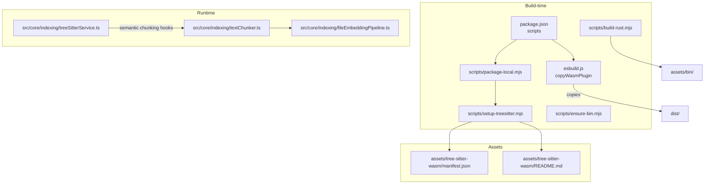
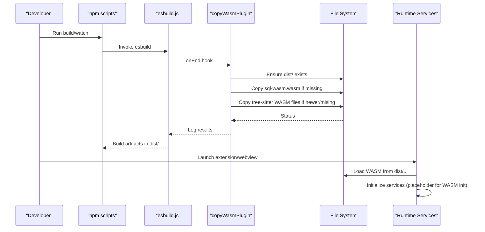
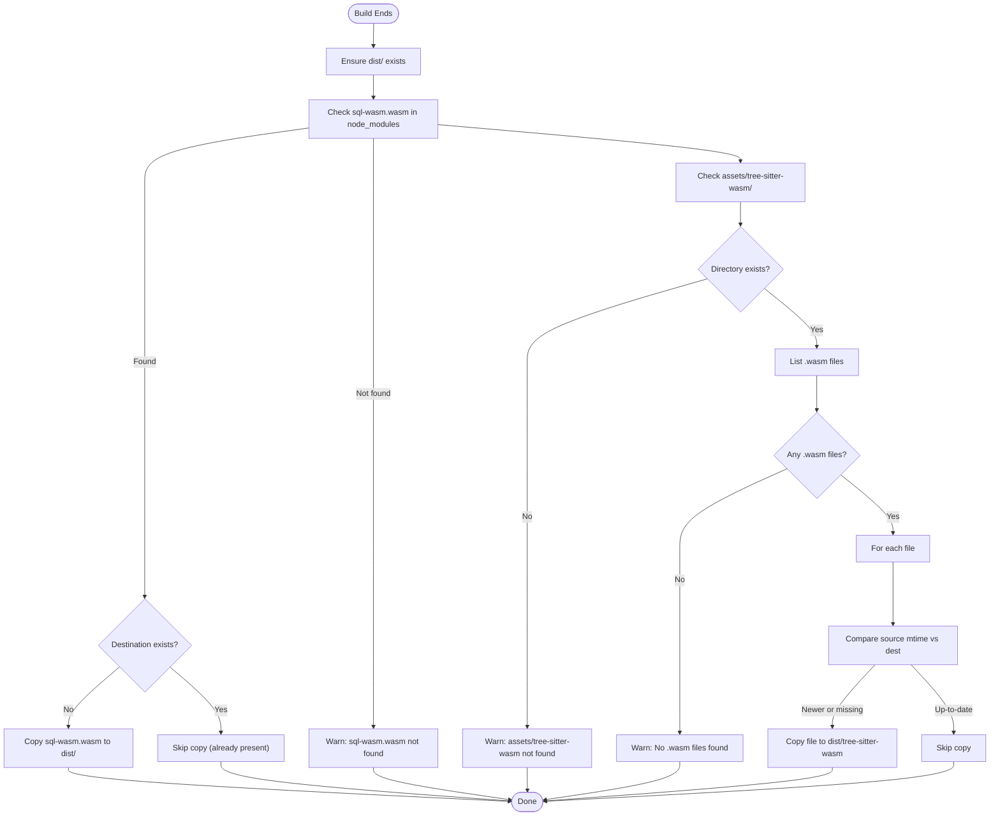
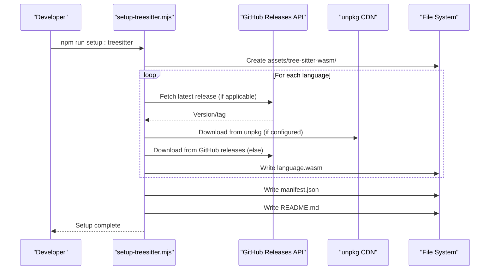
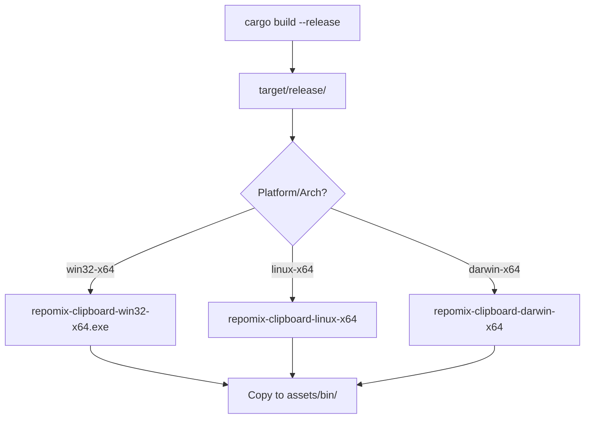
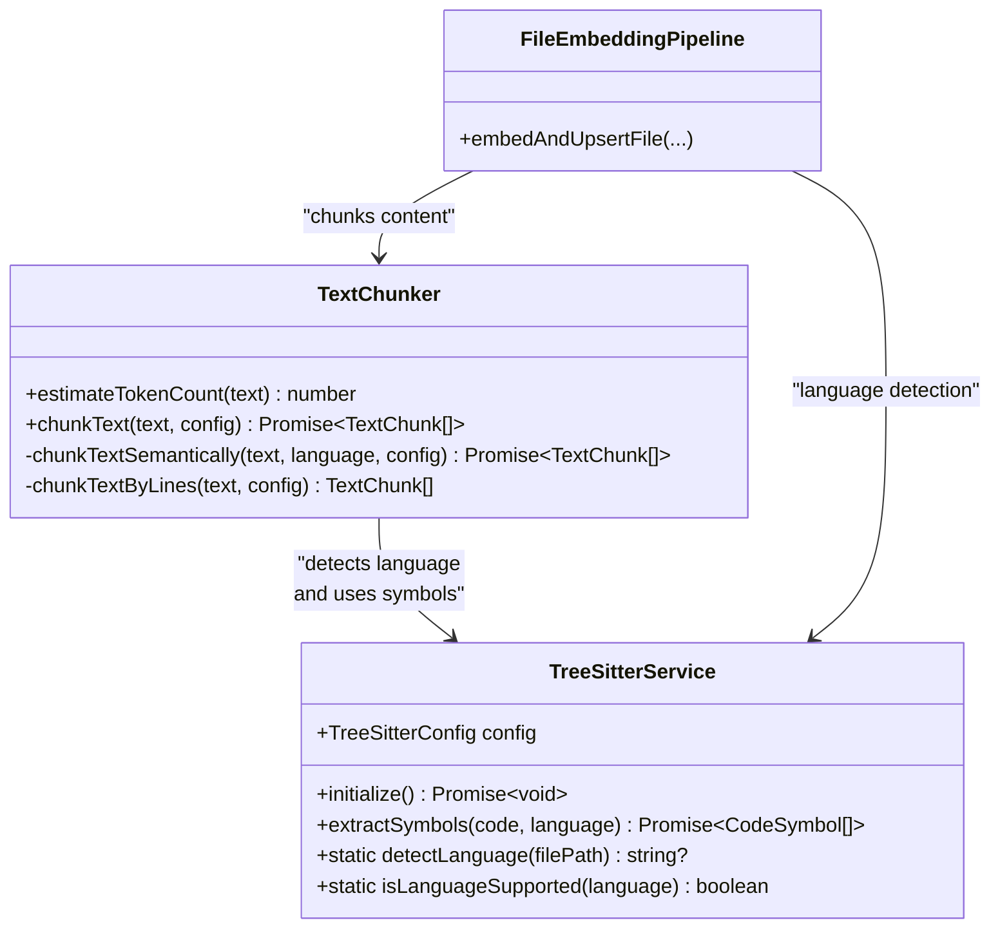
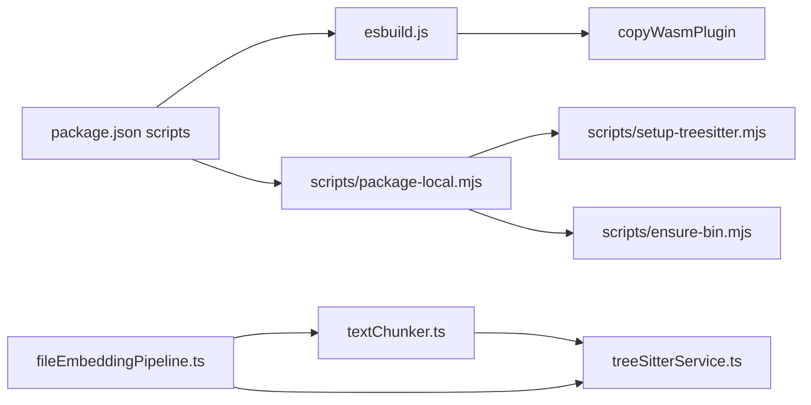

# Asset Bundling and Distribution

<cite>
**Referenced Files in This Document**
- [esbuild.js](file://esbuild.js)
- [package.json](file://package.json)
- [scripts/setup-treesitter.mjs](file://scripts/setup-treesitter.mjs)
- [assets/tree-sitter-wasm/manifest.json](file://assets/tree-sitter-wasm/manifest.json)
- [assets/tree-sitter-wasm/README.md](file://assets/tree-sitter-wasm/README.md)
- [scripts/build-rust.mjs](file://scripts/build-rust.mjs)
- [scripts/ensure-bin.mjs](file://scripts/ensure-bin.mjs)
- [scripts/package-local.mjs](file://scripts/package-local.mjs)
- [src/core/indexing/treeSitterService.ts](file://src/core/indexing/treeSitterService.ts)
- [src/core/indexing/textChunker.ts](file://src/core/indexing/textChunker.ts)
- [src/core/indexing/fileEmbeddingPipeline.ts](file://src/core/indexing/fileEmbeddingPipeline.ts)
</cite>

## Table of Contents
1. [Introduction](#introduction)
2. [Project Structure](#project-structure)
3. [Core Components](#core-components)
4. [Architecture Overview](#architecture-overview)
5. [Detailed Component Analysis](#detailed-component-analysis)
6. [Dependency Analysis](#dependency-analysis)
7. [Performance Considerations](#performance-considerations)
8. [Troubleshooting Guide](#troubleshooting-guide)
9. [Conclusion](#conclusion)
10. [Appendices](#appendices)

## Introduction
This document explains how the project manages and distributes binary assets required at runtime, with a focus on WebAssembly (WASM) parsers for tree-sitter and the SQL.js WASM engine. It covers the build-time asset bundling via an esbuild plugin, the setup and maintenance of tree-sitter WASM files, the distribution strategy for binary assets, caching and update mechanisms, and the runtime integration points. It also provides practical guidance for adding new WASM dependencies, updating existing assets, and handling platform-specific considerations.

## Project Structure
The asset bundling and distribution pipeline spans build-time scripts, a custom esbuild plugin, and runtime services:
- Build-time:
  - esbuild plugin copies WASM files into the distribution directory.
  - Setup script downloads tree-sitter WASM parsers and generates a manifest.
  - Package scripts orchestrate local packaging and ensure prerequisites.
- Runtime:
  - Tree-sitter service and text chunker coordinate semantic chunking and language detection.
  - File embedding pipeline integrates chunking and embeddings.

**Diagram sources**
- [esbuild.js](file://esbuild.js#L28-L92)
- [scripts/setup-treesitter.mjs](file://scripts/setup-treesitter.mjs#L1-L278)
- [assets/tree-sitter-wasm/manifest.json](file://assets/tree-sitter-wasm/manifest.json#L1-L65)
- [assets/tree-sitter-wasm/README.md](file://assets/tree-sitter-wasm/README.md#L1-L44)
- [scripts/build-rust.mjs](file://scripts/build-rust.mjs#L1-L50)
- [scripts/ensure-bin.mjs](file://scripts/ensure-bin.mjs#L1-L14)
- [scripts/package-local.mjs](file://scripts/package-local.mjs#L1-L115)
- [src/core/indexing/treeSitterService.ts](file://src/core/indexing/treeSitterService.ts#L1-L119)
- [src/core/indexing/textChunker.ts](file://src/core/indexing/textChunker.ts#L1-L253)
- [src/core/indexing/fileEmbeddingPipeline.ts](file://src/core/indexing/fileEmbeddingPipeline.ts#L1-L469)

**Section sources**
- [esbuild.js](file://esbuild.js#L1-L150)
- [package.json](file://package.json#L541-L559)
- [scripts/setup-treesitter.mjs](file://scripts/setup-treesitter.mjs#L1-L278)
- [assets/tree-sitter-wasm/manifest.json](file://assets/tree-sitter-wasm/manifest.json#L1-L65)
- [assets/tree-sitter-wasm/README.md](file://assets/tree-sitter-wasm/README.md#L1-L44)
- [scripts/build-rust.mjs](file://scripts/build-rust.mjs#L1-L50)
- [scripts/ensure-bin.mjs](file://scripts/ensure-bin.mjs#L1-L14)
- [scripts/package-local.mjs](file://scripts/package-local.mjs#L1-L115)
- [src/core/indexing/treeSitterService.ts](file://src/core/indexing/treeSitterService.ts#L1-L119)
- [src/core/indexing/textChunker.ts](file://src/core/indexing/textChunker.ts#L1-L253)
- [src/core/indexing/fileEmbeddingPipeline.ts](file://src/core/indexing/fileEmbeddingPipeline.ts#L1-L469)

## Core Components
- copyWasmPlugin (esbuild):
  - Copies sql-wasm.wasm from node_modules into dist/.
  - Copies all tree-sitter WASM files from assets/tree-sitter-wasm into dist/tree-sitter-wasm.
  - Conditional copy logic: only copies if destination does not exist or if source is newer than destination.
- setup-treesitter.mjs:
  - Downloads language-specific WASM parsers from GitHub releases or unpkg.
  - Generates manifest.json and README.md in assets/tree-sitter-wasm.
- package-local.mjs:
  - Ensures assets/tree-sitter-wasm exists before packaging; runs setup script if needed.
  - Temporarily bumps version to an alpha timestamp for local builds.
- treeSitterService and textChunker:
  - Provide language detection and semantic chunking hooks; currently a placeholder for WASM loading.
- fileEmbeddingPipeline:
  - Integrates chunking and embeddings; uses language detection to enable semantic chunking when available.

**Section sources**
- [esbuild.js](file://esbuild.js#L28-L92)
- [scripts/setup-treesitter.mjs](file://scripts/setup-treesitter.mjs#L1-L278)
- [scripts/package-local.mjs](file://scripts/package-local.mjs#L1-L115)
- [src/core/indexing/treeSitterService.ts](file://src/core/indexing/treeSitterService.ts#L1-L119)
- [src/core/indexing/textChunker.ts](file://src/core/indexing/textChunker.ts#L1-L253)
- [src/core/indexing/fileEmbeddingPipeline.ts](file://src/core/indexing/fileEmbeddingPipeline.ts#L1-L469)

## Architecture Overview
The asset pipeline operates in two stages: build-time bundling and runtime consumption.

**Diagram sources**
- [esbuild.js](file://esbuild.js#L33-L92)
- [package.json](file://package.json#L541-L559)

## Detailed Component Analysis

### WASM Asset Management and copyWasmPlugin
- Purpose:
  - Ensure sql-wasm.wasm and tree-sitter WASM files are present in dist/ for runtime.
- Conditional logic:
  - sql-wasm.wasm: copied only if destination does not exist.
  - tree-sitter WASM files: copied if destination does not exist OR if source mtime is newer than destination.
- Error handling:
  - Logs warnings when assets are missing in node_modules or assets/tree-sitter-wasm.
- Distribution:
  - Assets are placed under dist/ and consumed by runtime services.

**Diagram sources**
- [esbuild.js](file://esbuild.js#L33-L92)

**Section sources**
- [esbuild.js](file://esbuild.js#L28-L92)

### Tree-sitter WASM Setup and Manifest
- Setup script:
  - Creates assets/tree-sitter-wasm directory.
  - Downloads language-specific WASM files from GitHub releases or unpkg.
  - Supports fallback versions and handles redirects.
- Manifest:
  - Describes supported languages, WASM directory, sources, and per-language metadata.
- README:
  - Documents supported languages, update procedure, and special notes (e.g., C# parser).

**Diagram sources**
- [scripts/setup-treesitter.mjs](file://scripts/setup-treesitter.mjs#L1-L278)
- [assets/tree-sitter-wasm/manifest.json](file://assets/tree-sitter-wasm/manifest.json#L1-L65)
- [assets/tree-sitter-wasm/README.md](file://assets/tree-sitter-wasm/README.md#L1-L44)

**Section sources**
- [scripts/setup-treesitter.mjs](file://scripts/setup-treesitter.mjs#L1-L278)
- [assets/tree-sitter-wasm/manifest.json](file://assets/tree-sitter-wasm/manifest.json#L1-L65)
- [assets/tree-sitter-wasm/README.md](file://assets/tree-sitter-wasm/README.md#L1-L44)

### Binary Asset Distribution and Platform Handling
- Rust binary:
  - Built per-host platform/architecture and copied to assets/bin/ with a platform-specific filename.
- Packaging:
  - ensure-bin.mjs ensures the bin directory exists.
  - package-local.mjs orchestrates local packaging and ensures tree-sitter WASM presence.

**Diagram sources**
- [scripts/build-rust.mjs](file://scripts/build-rust.mjs#L1-L50)
- [scripts/ensure-bin.mjs](file://scripts/ensure-bin.mjs#L1-L14)
- [scripts/package-local.mjs](file://scripts/package-local.mjs#L1-L115)

**Section sources**
- [scripts/build-rust.mjs](file://scripts/build-rust.mjs#L1-L50)
- [scripts/ensure-bin.mjs](file://scripts/ensure-bin.mjs#L1-L14)
- [scripts/package-local.mjs](file://scripts/package-local.mjs#L1-L115)

### Runtime Loading and Integration Points
- Language detection and semantic chunking:
  - Tree-sitter service exposes language detection and placeholders for WASM initialization and symbol extraction.
  - Text chunker conditionally uses semantic chunking when language is supported and WASM is available.
  - File embedding pipeline selects semantic chunking based on detected language and service availability.

**Diagram sources**
- [src/core/indexing/treeSitterService.ts](file://src/core/indexing/treeSitterService.ts#L1-L119)
- [src/core/indexing/textChunker.ts](file://src/core/indexing/textChunker.ts#L1-L253)
- [src/core/indexing/fileEmbeddingPipeline.ts](file://src/core/indexing/fileEmbeddingPipeline.ts#L1-L469)

**Section sources**
- [src/core/indexing/treeSitterService.ts](file://src/core/indexing/treeSitterService.ts#L1-L119)
- [src/core/indexing/textChunker.ts](file://src/core/indexing/textChunker.ts#L1-L253)
- [src/core/indexing/fileEmbeddingPipeline.ts](file://src/core/indexing/fileEmbeddingPipeline.ts#L1-L469)

## Dependency Analysis
- Build-time dependencies:
  - esbuild.js depends on copyWasmPlugin to distribute assets.
  - package.json scripts invoke esbuild and setup scripts.
  - package-local.mjs depends on setup-treesitter.mjs and ensure-bin.mjs.
- Runtime dependencies:
  - textChunker and fileEmbeddingPipeline depend on treeSitterService for language detection.
  - treeSitterService is a placeholder for WASM initialization and symbol extraction.

**Diagram sources**
- [package.json](file://package.json#L541-L559)
- [esbuild.js](file://esbuild.js#L1-L150)
- [scripts/package-local.mjs](file://scripts/package-local.mjs#L1-L115)
- [scripts/setup-treesitter.mjs](file://scripts/setup-treesitter.mjs#L1-L278)
- [scripts/ensure-bin.mjs](file://scripts/ensure-bin.mjs#L1-L14)
- [src/core/indexing/treeSitterService.ts](file://src/core/indexing/treeSitterService.ts#L1-L119)
- [src/core/indexing/textChunker.ts](file://src/core/indexing/textChunker.ts#L1-L253)
- [src/core/indexing/fileEmbeddingPipeline.ts](file://src/core/indexing/fileEmbeddingPipeline.ts#L1-L469)

**Section sources**
- [package.json](file://package.json#L541-L559)
- [esbuild.js](file://esbuild.js#L1-L150)
- [scripts/package-local.mjs](file://scripts/package-local.mjs#L1-L115)
- [scripts/setup-treesitter.mjs](file://scripts/setup-treesitter.mjs#L1-L278)
- [scripts/ensure-bin.mjs](file://scripts/ensure-bin.mjs#L1-L14)
- [src/core/indexing/treeSitterService.ts](file://src/core/indexing/treeSitterService.ts#L1-L119)
- [src/core/indexing/textChunker.ts](file://src/core/indexing/textChunker.ts#L1-L253)
- [src/core/indexing/fileEmbeddingPipeline.ts](file://src/core/indexing/fileEmbeddingPipeline.ts#L1-L469)

## Performance Considerations
- Conditional copying minimizes I/O overhead by avoiding redundant copies when assets are up-to-date.
- Timestamp-based updates ensure incremental rebuilds copy only changed files.
- Tree-sitter WASM setup uses GitHub API to fetch latest versions, reducing manual maintenance.
- Embedding pipeline batching and concurrency controls help manage resource usage during indexing.

[No sources needed since this section provides general guidance]

## Troubleshooting Guide
- Missing sql-wasm.wasm:
  - Verify node_modules/sql.js/dist/sql-wasm.wasm exists; otherwise, install the dependency.
  - copyWasmPlugin will warn if not found.
- Missing tree-sitter WASM files:
  - Ensure assets/tree-sitter-wasm exists and contains .wasm files.
  - Run the setup script to download parsers.
  - copyWasmPlugin warns if the directory is missing or empty.
- Local packaging failures:
  - package-local.mjs restores package.json on failure and cleans up backups.
  - Confirm assets/tree-sitter-wasm presence or allow the script to run setup automatically.
- Runtime semantic chunking:
  - treeSitterService is a placeholder; WASM initialization is not yet implemented.
  - The system falls back to line-based chunking when semantic chunking is unavailable.

**Section sources**
- [esbuild.js](file://esbuild.js#L44-L90)
- [scripts/setup-treesitter.mjs](file://scripts/setup-treesitter.mjs#L180-L270)
- [scripts/package-local.mjs](file://scripts/package-local.mjs#L29-L115)
- [src/core/indexing/treeSitterService.ts](file://src/core/indexing/treeSitterService.ts#L30-L65)

## Conclusion
The project’s asset bundling and distribution strategy centers on a robust esbuild plugin that ensures required WASM files are present in dist/, a dedicated setup script for tree-sitter parsers with manifest generation, and packaging scripts that automate prerequisite checks. While the runtime WASM integration remains a future enhancement, the architecture cleanly separates build-time asset preparation from runtime consumption, enabling scalable updates and platform-specific distributions.

[No sources needed since this section summarizes without analyzing specific files]

## Appendices

### Adding a New Tree-sitter WASM Dependency
- Determine the language and repository hosting the WASM.
- Update the setup script constants to include the new language and its source (GitHub or unpkg).
- Re-run the setup script to download and manifest the new parser.
- Verify assets/tree-sitter-wasm contains the new .wasm file and manifest.json reflects the addition.

**Section sources**
- [scripts/setup-treesitter.mjs](file://scripts/setup-treesitter.mjs#L21-L43)
- [assets/tree-sitter-wasm/manifest.json](file://assets/tree-sitter-wasm/manifest.json#L1-L65)

### Updating Existing Tree-sitter WASM Assets
- Run the setup script to fetch the latest versions from GitHub releases or unpkg.
- The script attempts to query the GitHub API for the latest tag and falls back to configured versions.
- Re-run packaging to ensure updated assets are included in the distribution.

**Section sources**
- [scripts/setup-treesitter.mjs](file://scripts/setup-treesitter.mjs#L48-L76)
- [scripts/setup-treesitter.mjs](file://scripts/setup-treesitter.mjs#L123-L174)

### Managing Asset Versions and Manifests
- The manifest describes supported languages, WASM directory, and per-language metadata.
- The setup script writes manifest.json and README.md; keep them in sync with the actual assets.

**Section sources**
- [assets/tree-sitter-wasm/manifest.json](file://assets/tree-sitter-wasm/manifest.json#L1-L65)
- [assets/tree-sitter-wasm/README.md](file://assets/tree-sitter-wasm/README.md#L1-L44)

### Platform-Specific Asset Handling
- Rust binary naming includes platform and architecture identifiers; ensure the correct binary is copied to assets/bin/.
- esbuild aliases and shims are configured for browser builds; ensure WASM assets are bundled and loaded from dist/.

**Section sources**
- [scripts/build-rust.mjs](file://scripts/build-rust.mjs#L6-L14)
- [esbuild.js](file://esbuild.js#L124-L130)