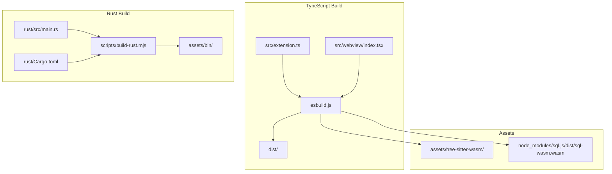
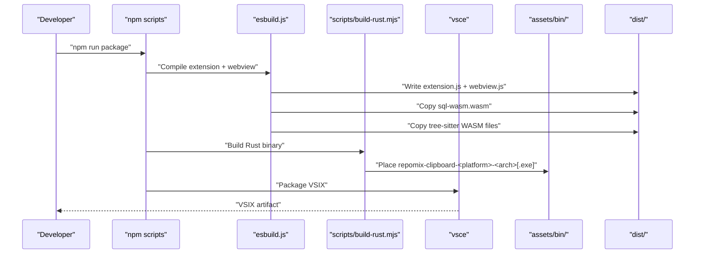
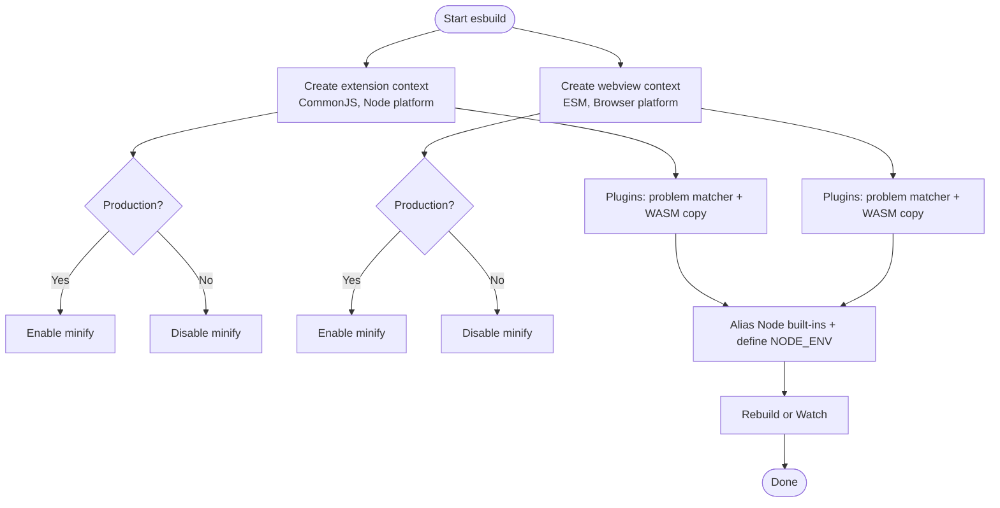
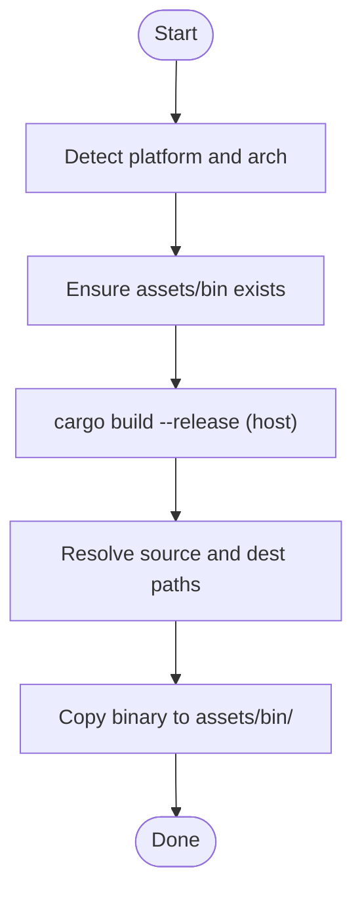
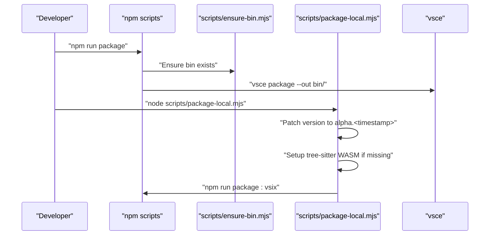
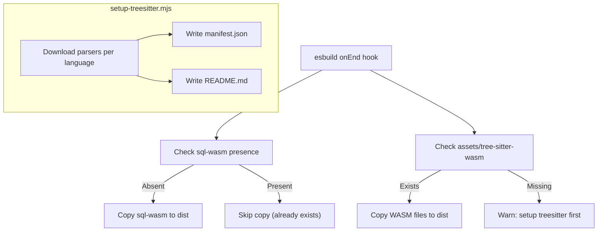
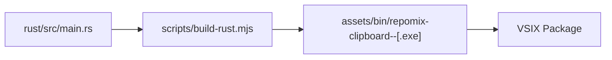
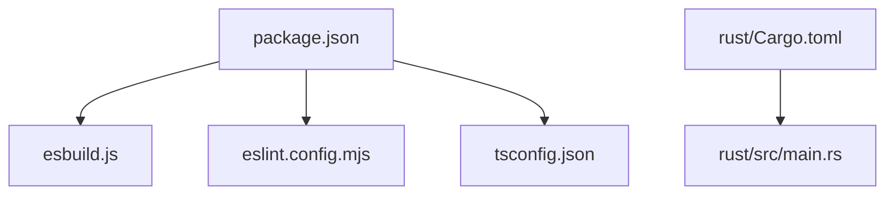

# Build and Deployment

<cite>
**Referenced Files in This Document**
- [package.json](file://package.json)
- [esbuild.js](file://esbuild.js)
- [tsconfig.json](file://tsconfig.json)
- [eslint.config.mjs](file://eslint.config.mjs)
- [.vscodeignore](file://.vscodeignore)
- [scripts/build-rust.mjs](file://scripts/build-rust.mjs)
- [scripts/ensure-bin.mjs](file://scripts/ensure-bin.mjs)
- [scripts/package-local.mjs](file://scripts/package-local.mjs)
- [scripts/setup-treesitter.mjs](file://scripts/setup-treesitter.mjs)
- [rust/Cargo.toml](file://rust/Cargo.toml)
- [rust/src/main.rs](file://rust/src/main.rs)
- [README.md](file://README.md)
</cite>

## Table of Contents
1. [Introduction](#introduction)
2. [Project Structure](#project-structure)
3. [Core Components](#core-components)
4. [Architecture Overview](#architecture-overview)
5. [Detailed Component Analysis](#detailed-component-analysis)
6. [Dependency Analysis](#dependency-analysis)
7. [Performance Considerations](#performance-considerations)
8. [Troubleshooting Guide](#troubleshooting-guide)
9. [Conclusion](#conclusion)
10. [Appendices](#appendices)

## Introduction
This document explains the Build and Deployment system for the project, covering:
- Multi-language build pipeline: TypeScript compilation, Rust binary compilation, and asset bundling
- esbuild configuration for efficient builds and asset handling
- Rust build script for cross-platform binary generation
- VSIX packaging process, dependency management, and release automation
- Development workflow including hot reloading, debugging, and local testing
- Distribution strategy for the repomix-clipboard utility across platforms
- Environment setup, building from source, publishing updates, versioning, and changelog generation
- Troubleshooting common build issues, dependency conflicts, and platform-specific compilation problems

## Project Structure
The build system spans TypeScript sources, a Rust utility, and packaging scripts:
- TypeScript sources are compiled via esbuild into a Node extension and a browser webview bundle
- Rust sources produce a platform-specific binary included in assets/bin
- Asset bundling ensures WASM files are available at runtime
- Packaging scripts orchestrate local builds, binary preparation, and VSIX creation

**Diagram sources**
- [esbuild.js](file://esbuild.js#L94-L144)
- [scripts/build-rust.mjs](file://scripts/build-rust.mjs#L1-L50)
- [rust/src/main.rs](file://rust/src/main.rs#L1-L249)
- [rust/Cargo.toml](file://rust/Cargo.toml#L1-L12)

**Section sources**
- [package.json](file://package.json#L541-L559)
- [esbuild.js](file://esbuild.js#L1-L150)
- [scripts/build-rust.mjs](file://scripts/build-rust.mjs#L1-L50)
- [.vscodeignore](file://.vscodeignore#L1-L57)

## Core Components
- TypeScript build and bundling via esbuild:
  - Compiles the extension entrypoint to CommonJS and the webview to ESM
  - Minimizes in production, generates sourcemaps otherwise
  - Copies WASM assets into dist/ during build
  - Defines environment variables and aliases for browser compatibility
- Rust binary build:
  - Produces a platform- and architecture-specific binary named with OS and arch identifiers
  - Copies the binary into assets/bin for inclusion in the extension
- VSIX packaging:
  - Prepares the bin directory, runs the Rust build, and packages the extension
  - Supports local alpha packaging with timestamped versions
- Asset management:
  - Downloads and manages Tree-sitter WASM parsers for semantic code chunking
  - Ensures sql-wasm is available at runtime

**Section sources**
- [esbuild.js](file://esbuild.js#L94-L144)
- [scripts/build-rust.mjs](file://scripts/build-rust.mjs#L12-L44)
- [scripts/ensure-bin.mjs](file://scripts/ensure-bin.mjs#L1-L14)
- [scripts/package-local.mjs](file://scripts/package-local.mjs#L72-L94)
- [scripts/setup-treesitter.mjs](file://scripts/setup-treesitter.mjs#L179-L270)

## Architecture Overview
The build pipeline integrates TypeScript bundling, Rust compilation, and asset distribution, culminating in a VSIX package.

**Diagram sources**
- [package.json](file://package.json#L541-L559)
- [esbuild.js](file://esbuild.js#L94-L144)
- [scripts/build-rust.mjs](file://scripts/build-rust.mjs#L22-L44)
- [scripts/ensure-bin.mjs](file://scripts/ensure-bin.mjs#L8-L13)

## Detailed Component Analysis

### TypeScript Build with esbuild
Key behaviors:
- Two build contexts: Node CommonJS for the extension and browser ESM for the webview
- Production toggles minification and sourcemap generation
- Plugins:
  - Problem matcher plugin logs build start/end and errors
  - WASM copy plugin ensures sql-wasm and tree-sitter WASM are present in dist/
- Aliasing and defines:
  - Browser-safe aliases for Node built-ins
  - NODE_ENV define for runtime behavior
- Watch mode:
  - Parallel watch for extension and webview contexts

**Diagram sources**
- [esbuild.js](file://esbuild.js#L94-L144)

**Section sources**
- [esbuild.js](file://esbuild.js#L94-L144)
- [tsconfig.json](file://tsconfig.json#L1-L31)

### Rust Binary Build Script
Purpose:
- Detect current platform and architecture
- Build the Rust project in release mode
- Copy the resulting binary into assets/bin with a filename that encodes platform and arch
- Support Windows executable naming convention

**Diagram sources**
- [scripts/build-rust.mjs](file://scripts/build-rust.mjs#L12-L44)
- [rust/Cargo.toml](file://rust/Cargo.toml#L1-L12)

**Section sources**
- [scripts/build-rust.mjs](file://scripts/build-rust.mjs#L1-L50)
- [rust/src/main.rs](file://rust/src/main.rs#L10-L42)

### VSIX Packaging and Release Automation
Scripts:
- ensure-bin: creates the bin directory before packaging
- package: cleans dist, lints, and runs esbuild in production
- package:vsix: prepares bin, then invokes vsce to package the extension into bin/
- package:local: bumps version to an alpha timestamp, ensures tree-sitter WASM, then packages a local VSIX

**Diagram sources**
- [package.json](file://package.json#L541-L559)
- [scripts/ensure-bin.mjs](file://scripts/ensure-bin.mjs#L1-L14)
- [scripts/package-local.mjs](file://scripts/package-local.mjs#L72-L94)

**Section sources**
- [package.json](file://package.json#L541-L559)
- [scripts/ensure-bin.mjs](file://scripts/ensure-bin.mjs#L1-L14)
- [scripts/package-local.mjs](file://scripts/package-local.mjs#L1-L115)

### Asset Bundling and Tree-sitter Setup
- esbuild copy-wasm plugin:
  - Copies sql-wasm from node_modules into dist only if absent
  - Copies tree-sitter WASM files from assets/tree-sitter-wasm into dist on every build
- setup-treesitter script:
  - Downloads language-specific WASM parsers from GitHub releases or unpkg
  - Creates manifest.json and README.md in assets/tree-sitter-wasm
  - Handles C# parser special-case and provides guidance

**Diagram sources**
- [esbuild.js](file://esbuild.js#L33-L92)
- [scripts/setup-treesitter.mjs](file://scripts/setup-treesitter.mjs#L179-L270)

**Section sources**
- [esbuild.js](file://esbuild.js#L33-L92)
- [scripts/setup-treesitter.mjs](file://scripts/setup-treesitter.mjs#L1-L278)

### Remote Clipboard Binary Distribution
The repomix-clipboard utility is distributed as platform- and architecture-specific binaries:
- Naming convention encodes OS and arch
- Included in assets/bin and packaged into the VSIX
- README documents remote clipboard workflow and requirements

**Diagram sources**
- [rust/src/main.rs](file://rust/src/main.rs#L10-L42)
- [scripts/build-rust.mjs](file://scripts/build-rust.mjs#L12-L44)
- [README.md](file://README.md#L96-L119)

**Section sources**
- [scripts/build-rust.mjs](file://scripts/build-rust.mjs#L12-L44)
- [README.md](file://README.md#L96-L119)

## Dependency Analysis
- TypeScript toolchain:
  - esbuild for bundling, TypeScript compiler for type checks, ESLint for linting
- Runtime dependencies:
  - React and related UI libraries, LangChain integrations, Pinecone/Qdrant clients, sql.js, tokenizers
- Rust dependencies:
  - clipboard-win, arboard, byteorder, anyhow, tempfile, ignore

**Diagram sources**
- [package.json](file://package.json#L541-L559)
- [esbuild.js](file://esbuild.js#L1-L150)
- [eslint.config.mjs](file://eslint.config.mjs#L1-L34)
- [tsconfig.json](file://tsconfig.json#L1-L31)
- [rust/Cargo.toml](file://rust/Cargo.toml#L1-L12)
- [rust/src/main.rs](file://rust/src/main.rs#L1-L249)

**Section sources**
- [package.json](file://package.json#L560-L603)
- [rust/Cargo.toml](file://rust/Cargo.toml#L6-L12)

## Performance Considerations
- esbuild minimization and sourcemap toggling reduce bundle size in production and improve debugging in development
- Parallel rebuild/watch contexts minimize iteration time
- WASM copy plugin avoids redundant copies and ensures assets are present
- TypeScript skipLibCheck reduces type-check overhead during development

[No sources needed since this section provides general guidance]

## Troubleshooting Guide
Common issues and resolutions:
- Missing tree-sitter WASM files
  - Run the setup script to download parsers and create manifest/README
  - Verify assets/tree-sitter-wasm contains .wasm files
- esbuild “Failed to resolve module specifier 'fs'” in webview
  - esbuild aliases Node built-ins to empty shims; ensure no runtime imports of Node fs in webview code
- Missing sql-wasm in dist
  - Confirm node_modules/sql.js/dist/sql-wasm.wasm exists; the copy plugin only copies if absent
- Rust binary not found after build
  - Ensure cargo build completes successfully and the target/release binary matches the expected name
  - Confirm assets/bin directory exists and is writable
- VSIX packaging fails due to missing bin directory
  - Run the ensure-bin script or the package script which creates bin automatically
- Local alpha packaging fails to restore package.json
  - The package-local script backs up package.json; if interrupted, it restores from backup and exits with error
- Linux file copy mode requires xclip
  - Install xclip for drag-and-drop file copy mode support

**Section sources**
- [scripts/setup-treesitter.mjs](file://scripts/setup-treesitter.mjs#L179-L270)
- [esbuild.js](file://esbuild.js#L124-L130)
- [scripts/ensure-bin.mjs](file://scripts/ensure-bin.mjs#L8-L13)
- [scripts/package-local.mjs](file://scripts/package-local.mjs#L29-L61)
- [README.md](file://README.md#L120-L131)

## Conclusion
The build and deployment system combines TypeScript bundling with esbuild, a Rust utility for cross-platform clipboard operations, and robust asset management. Scripts automate packaging, local alpha releases, and binary distribution. The architecture supports efficient development workflows, reliable releases, and cross-platform compatibility.

[No sources needed since this section summarizes without analyzing specific files]

## Appendices

### Development Workflow
- Build and watch
  - Use the watch scripts to rebuild on changes for both extension and webview
  - Ensure TypeScript type checks and linting pass before packaging
- Testing
  - Compile tests and run pretest to validate builds and linting
- Debugging
  - Use sourcemaps in development builds
  - Inspect the Debug tab in the Control Panel for environment and binary status in remote scenarios

**Section sources**
- [package.json](file://package.json#L541-L559)
- [tsconfig.json](file://tsconfig.json#L1-L31)
- [eslint.config.mjs](file://eslint.config.mjs#L1-L34)
- [README.md](file://README.md#L112-L119)

### Building from Source
- Prerequisites
  - Node.js and npm
  - Rust toolchain (cargo)
  - Platform-specific clipboard requirements (xclip on Linux)
- Steps
  - Install dependencies
  - Prepare Tree-sitter WASM files
  - Build TypeScript bundles
  - Build Rust binary
  - Package VSIX

**Section sources**
- [package.json](file://package.json#L541-L559)
- [scripts/setup-treesitter.mjs](file://scripts/setup-treesitter.mjs#L179-L270)
- [scripts/build-rust.mjs](file://scripts/build-rust.mjs#L22-L44)

### Publishing Updates
- Version management
  - Update package.json version as needed
  - Use package:local to create timestamped alpha versions for internal testing
- Changelog
  - Maintain a CHANGELOG.md alongside the repository
- Release
  - Run package:vsix to produce a VSIX in bin/

**Section sources**
- [package.json](file://package.json#L541-L559)
- [scripts/package-local.mjs](file://scripts/package-local.mjs#L72-L94)
- [.vscodeignore](file://.vscodeignore#L52-L52)

### Backward Compatibility Considerations
- The repomix-clipboard binary supports a backwards-compatible mode and a new --generate-md mode
- Ensure consumers of the binary adapt to argument changes if upgrading

**Section sources**
- [rust/src/main.rs](file://rust/src/main.rs#L13-L31)
- [rust/src/main.rs](file://rust/src/main.rs#L49-L134)