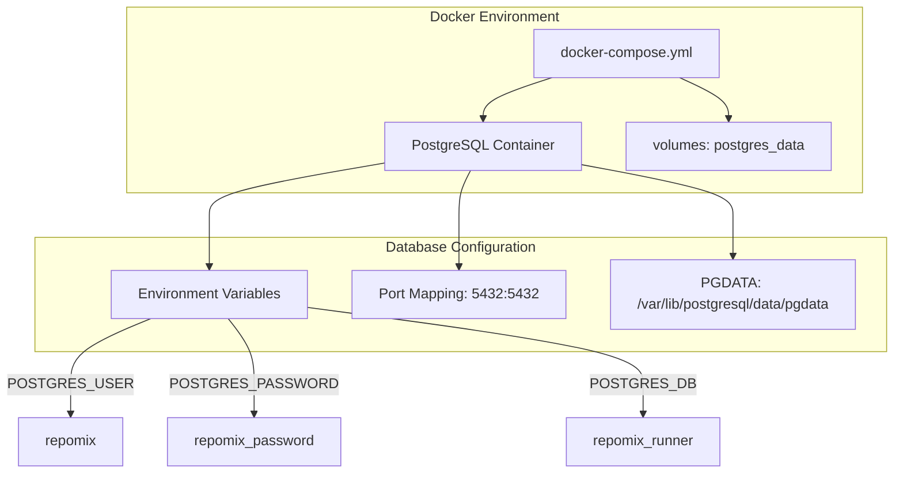
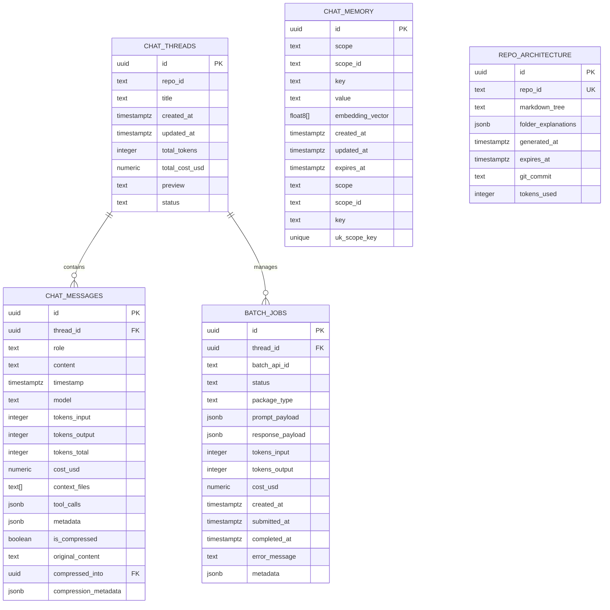
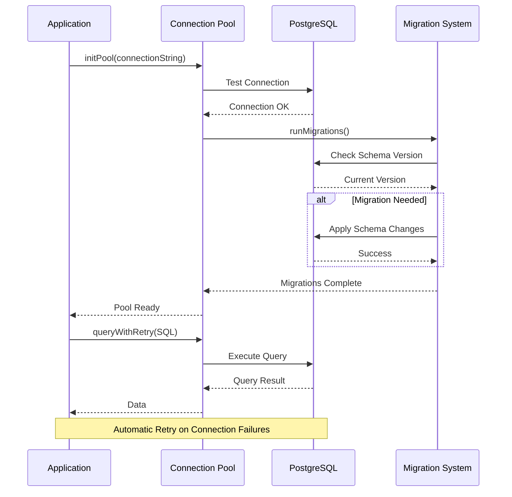
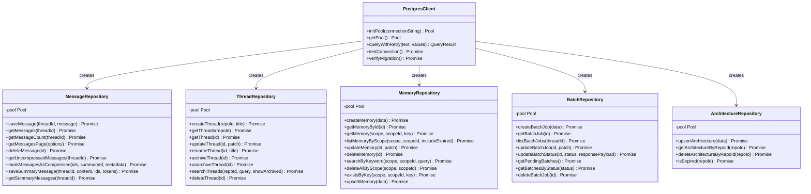
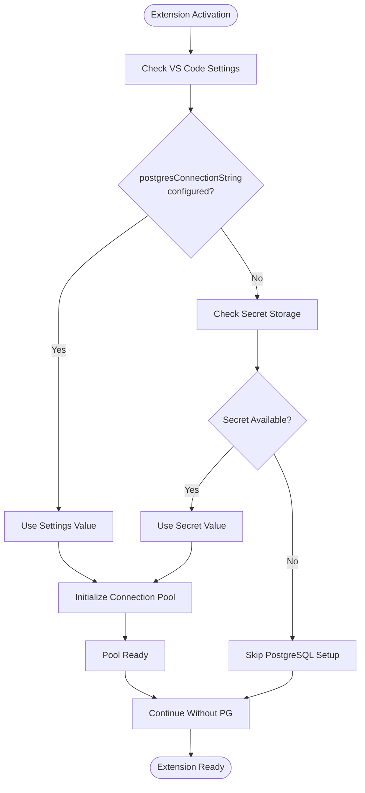
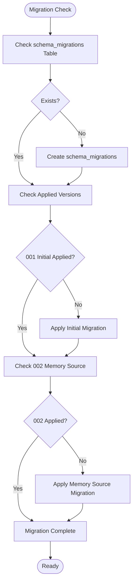

# Docker PostgreSQL Development Setup

<cite>
**Referenced Files in This Document**
- [docker-compose.yml](file://docker-compose.yml)
- [postgresClient.ts](file://src/chat/db/postgresClient.ts)
- [messageRepository.ts](file://src/chat/db/messageRepository.ts)
- [threadRepository.ts](file://src/chat/db/threadRepository.ts)
- [memoryRepository.ts](file://src/chat/db/memoryRepository.ts)
- [batchRepository.ts](file://src/chat/db/batchRepository.ts)
- [architectureRepository.ts](file://src/chat/db/architectureRepository.ts)
- [extension.ts](file://src/extension.ts)
- [package.json](file://package.json)
</cite>

## Table of Contents
1. [Introduction](#introduction)
2. [Docker PostgreSQL Setup](#docker-postgresql-setup)
3. [Database Schema Design](#database-schema-design)
4. [Connection Management](#connection-management)
5. [Repository Pattern Implementation](#repository-pattern-implementation)
6. [Development Environment Configuration](#development-environment-configuration)
7. [Migration System](#migration-system)
8. [Performance Considerations](#performance-considerations)
9. [Troubleshooting Guide](#troubleshooting-guide)
10. [Best Practices](#best-practices)

## Introduction

This document provides comprehensive guidance for setting up and developing with Docker PostgreSQL for the Repomix Runner project. The system utilizes PostgreSQL as the primary database for chat storage, message persistence, and various AI-driven features. The setup includes Docker Compose configuration, database schema design, connection pooling, and repository pattern implementation for robust development workflows.

## Docker PostgreSQL Setup

The Docker PostgreSQL setup is configured through a comprehensive compose file that defines the database service with production-ready defaults and health checks.

**Diagram sources**
- [docker-compose.yml](file://docker-compose.yml#L1-L26)

The Docker configuration provides several key features:

- **Container Management**: Automatic restart policy ensures database availability
- **Volume Persistence**: Named volume `postgres_data` for data persistence across container restarts
- **Health Monitoring**: Built-in health check using `pg_isready` command
- **Network Configuration**: Port mapping enables local development access

**Section sources**
- [docker-compose.yml](file://docker-compose.yml#L1-L26)

## Database Schema Design

The PostgreSQL schema is designed around five core tables that support the chat functionality and AI features. Each table serves a specific purpose in the application architecture.

**Diagram sources**
- [postgresClient.ts](file://src/chat/db/postgresClient.ts#L18-L117)

The schema design incorporates several advanced PostgreSQL features:

- **UUID Primary Keys**: Ensures globally unique identifiers across distributed systems
- **JSONB Support**: Enables flexible data structures for dynamic content
- **Array Types**: Text arrays for context file references
- **Constraints**: Check constraints ensure data integrity
- **Indexes**: Strategic indexing for performance optimization

**Section sources**
- [postgresClient.ts](file://src/chat/db/postgresClient.ts#L18-L117)

## Connection Management

The application implements a sophisticated connection pooling system using the `pg` library with automatic retry mechanisms and health monitoring.

**Diagram sources**
- [postgresClient.ts](file://src/chat/db/postgresClient.ts#L286-L380)

The connection management system includes:

- **Pool Configuration**: Maximum 10 connections with 30-second idle timeout
- **Automatic Retry**: Intelligent retry mechanism for transient failures
- **Health Monitoring**: Connection error logging and recovery
- **Graceful Shutdown**: Proper pool cleanup on application exit

**Section sources**
- [postgresClient.ts](file://src/chat/db/postgresClient.ts#L286-L380)

## Repository Pattern Implementation

Each database table is encapsulated within a dedicated repository class following the repository pattern for clean separation of concerns and testability.

**Diagram sources**
- [messageRepository.ts](file://src/chat/db/messageRepository.ts#L82-L330)
- [threadRepository.ts](file://src/chat/db/threadRepository.ts#L60-L200)
- [memoryRepository.ts](file://src/chat/db/memoryRepository.ts#L41-L331)
- [batchRepository.ts](file://src/chat/db/batchRepository.ts#L45-L253)
- [architectureRepository.ts](file://src/chat/db/architectureRepository.ts#L26-L134)

Each repository implements specific business logic:

- **MessageRepository**: Handles chat message persistence with compression support
- **ThreadRepository**: Manages conversation threads with status tracking
- **MemoryRepository**: Implements memory management with scope-based organization
- **BatchRepository**: Processes batch jobs for AI operations
- **ArchitectureRepository**: Stores repository architecture documents

**Section sources**
- [messageRepository.ts](file://src/chat/db/messageRepository.ts#L82-L330)
- [threadRepository.ts](file://src/chat/db/threadRepository.ts#L60-L200)
- [memoryRepository.ts](file://src/chat/db/memoryRepository.ts#L41-L331)
- [batchRepository.ts](file://src/chat/db/batchRepository.ts#L45-L253)
- [architectureRepository.ts](file://src/chat/db/architectureRepository.ts#L26-L134)

## Development Environment Configuration

The extension integrates PostgreSQL connectivity seamlessly with VS Code settings and secret storage for secure configuration management.

**Diagram sources**
- [extension.ts](file://src/extension.ts#L88-L108)

The configuration system supports multiple sources with priority ordering:

- **VS Code Settings**: Primary configuration source with immediate effect
- **Secret Storage**: Backward compatibility and secure storage
- **Environment Variables**: Alternative deployment scenarios

**Section sources**
- [extension.ts](file://src/extension.ts#L88-L108)
- [package.json](file://package.json#L383-L388)

## Migration System

The application includes a comprehensive migration system that ensures database schema consistency across deployments and development environments.

**Diagram sources**
- [postgresClient.ts](file://src/chat/db/postgresClient.ts#L202-L284)

The migration system provides:

- **Version Tracking**: Centralized tracking of applied migrations
- **Idempotent Operations**: Safe repeated execution of migration steps
- **Transaction Safety**: Rollback capability on failure
- **Backward Compatibility**: Graceful handling of partial migrations

**Section sources**
- [postgresClient.ts](file://src/chat/db/postgresClient.ts#L202-L284)

## Performance Considerations

The PostgreSQL setup incorporates several performance optimization strategies:

- **Connection Pooling**: Limits concurrent connections to prevent resource exhaustion
- **Index Optimization**: Strategic indexing for frequently queried columns
- **Query Optimization**: Parameterized queries with prepared statement support
- **Health Monitoring**: Automatic detection and recovery from connection failures
- **Data Type Efficiency**: Use of appropriate PostgreSQL data types for optimal storage

## Troubleshooting Guide

Common issues and their solutions:

**Connection Issues**
- Verify Docker container is running: `docker ps`
- Check port availability: `netstat -an | grep 5432`
- Validate connection string format and credentials

**Migration Failures**
- Review migration logs for specific error details
- Check database permissions for migration table creation
- Ensure sufficient disk space for database operations

**Performance Problems**
- Monitor connection pool utilization
- Check query execution plans for slow operations
- Verify index usage with `EXPLAIN ANALYZE`

**Data Integrity Issues**
- Validate foreign key constraints
- Check for unique constraint violations
- Review transaction rollback scenarios

## Best Practices

- **Connection Management**: Always use the provided pool management functions
- **Error Handling**: Implement proper error handling for database operations
- **Security**: Store sensitive credentials in VS Code secret storage
- **Monitoring**: Regularly monitor database health and performance metrics
- **Backup Strategy**: Implement regular database backups for production deployments
- **Testing**: Use separate database instances for development and testing environments