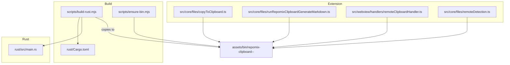
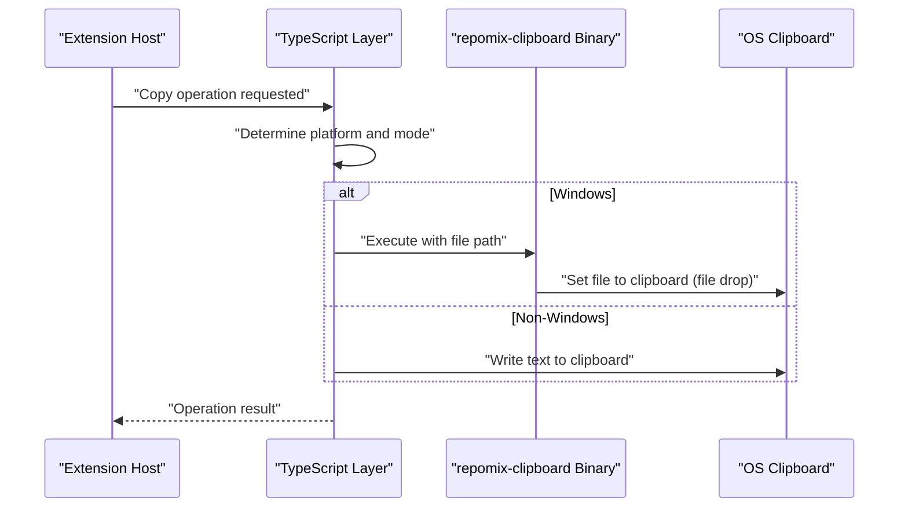
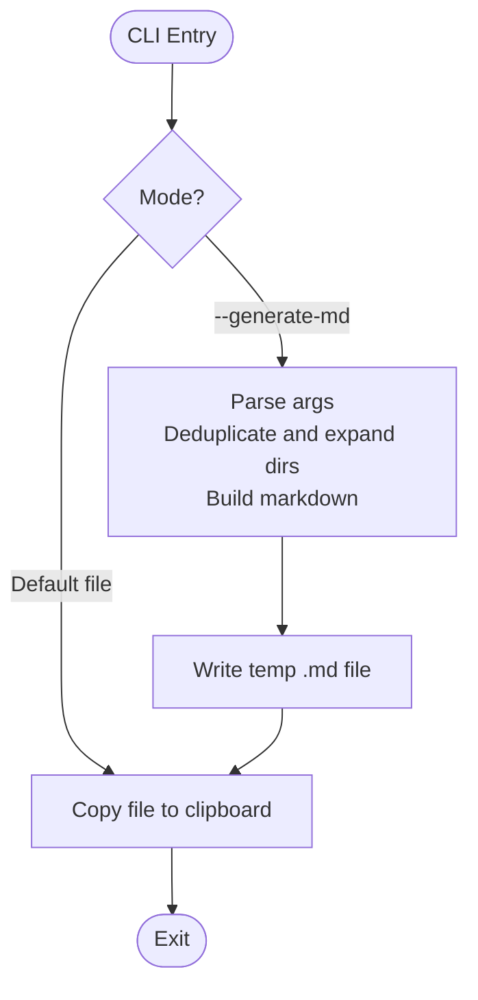
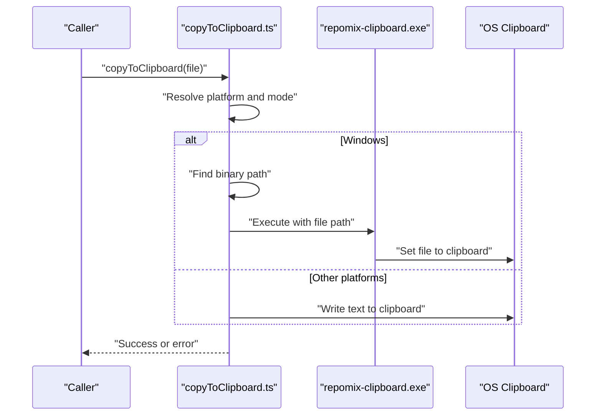
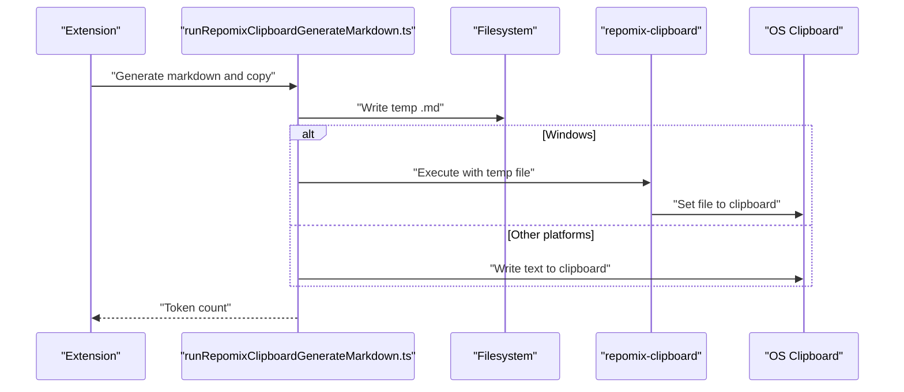
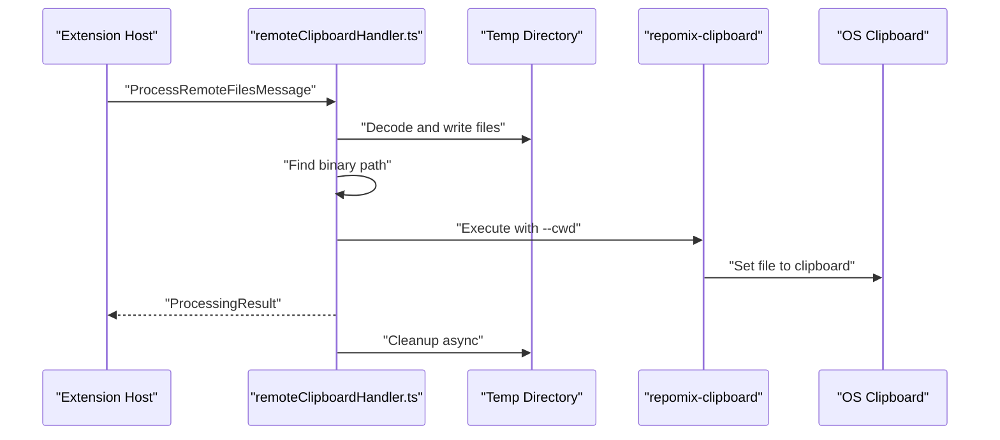
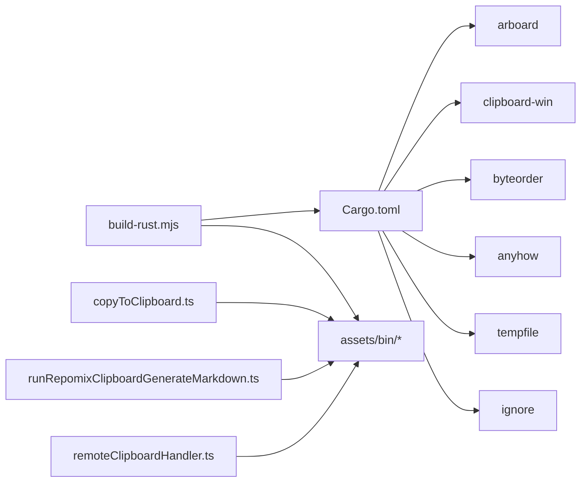

# Rust Binary Compilation

<cite>
**Referenced Files in This Document**
- [build-rust.mjs](file://scripts/build-rust.mjs)
- [ensure-bin.mjs](file://scripts/ensure-bin.mjs)
- [Cargo.toml](file://rust/Cargo.toml)
- [main.rs](file://rust/src/main.rs)
- [copyToClipboard.ts](file://src/core/files/copyToClipboard.ts)
- [runRepomixClipboardGenerateMarkdown.ts](file://src/core/files/runRepomixClipboardGenerateMarkdown.ts)
- [remoteClipboardHandler.ts](file://src/webview/handlers/remoteClipboardHandler.ts)
- [remoteDetection.ts](file://src/core/files/remoteDetection.ts)
- [package.json](file://package.json)
- [esbuild.js](file://esbuild.js)
</cite>

## Table of Contents
1. [Introduction](#introduction)
2. [Project Structure](#project-structure)
3. [Core Components](#core-components)
4. [Architecture Overview](#architecture-overview)
5. [Detailed Component Analysis](#detailed-component-analysis)
6. [Dependency Analysis](#dependency-analysis)
7. [Performance Considerations](#performance-considerations)
8. [Troubleshooting Guide](#troubleshooting-guide)
9. [Conclusion](#conclusion)
10. [Appendices](#appendices)

## Introduction
This document explains the Rust binary compilation pipeline for the cross-platform clipboard system. It covers the build scripts, Cargo configuration, platform-specific behavior, and the integration between the Rust utility and the TypeScript extension. It also provides guidance for building, distributing, and troubleshooting the repomix-clipboard utility across Windows, macOS, and Linux.

## Project Structure
The clipboard system consists of:
- A Rust crate under rust/ that produces a platform-specific binary named repomix-clipboard.
- A Node.js build script that compiles the Rust crate and places the resulting binary into assets/bin/.
- A TypeScript extension that discovers, executes, and handles errors for the binary on Windows and in remote environments.
- A packaging script that ensures the binary directory exists during VSIX creation.

**Diagram sources**
- [build-rust.mjs](file://scripts/build-rust.mjs#L1-L50)
- [ensure-bin.mjs](file://scripts/ensure-bin.mjs#L1-L14)
- [Cargo.toml](file://rust/Cargo.toml#L1-L12)
- [main.rs](file://rust/src/main.rs#L1-L249)
- [copyToClipboard.ts](file://src/core/files/copyToClipboard.ts#L1-L160)
- [runRepomixClipboardGenerateMarkdown.ts](file://src/core/files/runRepomixClipboardGenerateMarkdown.ts#L1-L84)
- [remoteClipboardHandler.ts](file://src/webview/handlers/remoteClipboardHandler.ts#L1-L190)
- [remoteDetection.ts](file://src/core/files/remoteDetection.ts#L1-L148)

**Section sources**
- [build-rust.mjs](file://scripts/build-rust.mjs#L1-L50)
- [ensure-bin.mjs](file://scripts/ensure-bin.mjs#L1-L14)
- [Cargo.toml](file://rust/Cargo.toml#L1-L12)
- [main.rs](file://rust/src/main.rs#L1-L249)
- [copyToClipboard.ts](file://src/core/files/copyToClipboard.ts#L1-L160)
- [runRepomixClipboardGenerateMarkdown.ts](file://src/core/files/runRepomixClipboardGenerateMarkdown.ts#L1-L84)
- [remoteClipboardHandler.ts](file://src/webview/handlers/remoteClipboardHandler.ts#L1-L190)
- [remoteDetection.ts](file://src/core/files/remoteDetection.ts#L1-L148)
- [package.json](file://package.json#L541-L559)
- [esbuild.js](file://esbuild.js#L1-L150)

## Core Components
- Rust crate: Defines the repomix-clipboard utility with clipboard and file-handling capabilities.
- Build script: Compiles the Rust crate and places the binary into assets/bin with a platform-arch naming scheme.
- Extension integration: Discovers the binary, executes it, and handles platform-specific behaviors and errors.
- Packaging: Ensures the binary directory exists during VSIX packaging.

**Section sources**
- [Cargo.toml](file://rust/Cargo.toml#L1-L12)
- [main.rs](file://rust/src/main.rs#L1-L249)
- [build-rust.mjs](file://scripts/build-rust.mjs#L1-L50)
- [copyToClipboard.ts](file://src/core/files/copyToClipboard.ts#L1-L160)
- [runRepomixClipboardGenerateMarkdown.ts](file://src/core/files/runRepomixClipboardGenerateMarkdown.ts#L1-L84)
- [remoteClipboardHandler.ts](file://src/webview/handlers/remoteClipboardHandler.ts#L1-L190)
- [ensure-bin.mjs](file://scripts/ensure-bin.mjs#L1-L14)

## Architecture Overview
The clipboard system integrates Rust and TypeScript across platforms:

**Diagram sources**
- [copyToClipboard.ts](file://src/core/files/copyToClipboard.ts#L52-L160)
- [runRepomixClipboardGenerateMarkdown.ts](file://src/core/files/runRepomixClipboardGenerateMarkdown.ts#L29-L84)
- [remoteClipboardHandler.ts](file://src/webview/handlers/remoteClipboardHandler.ts#L137-L159)

## Detailed Component Analysis

### Rust Crate and Cargo Configuration
- Package identity: repomix-clipboard with edition 2021.
- Dependencies:
  - clipboard-win: Windows-specific clipboard APIs with std feature.
  - byteorder: Byte order utilities.
  - arboard: Cross-platform clipboard abstraction.
  - anyhow: Error handling.
  - tempfile: Temporary file management.
  - ignore: Directory traversal with .gitignore support.

Key behaviors:
- Command-line modes:
  - Default: copy a single file to clipboard.
  - --generate-md: generate markdown from files and copy the resulting file to clipboard.
- File handling:
  - Uses arboard for cross-platform file list clipboard.
  - Writes temporary markdown file and defers deletion until after paste-time needs are satisfied.

**Diagram sources**
- [main.rs](file://rust/src/main.rs#L10-L42)
- [main.rs](file://rust/src/main.rs#L49-L134)
- [main.rs](file://rust/src/main.rs#L207-L248)

**Section sources**
- [Cargo.toml](file://rust/Cargo.toml#L1-L12)
- [main.rs](file://rust/src/main.rs#L1-L249)

### Build Script: scripts/build-rust.mjs
- Determines current platform and architecture.
- Names the target binary as repomix-clipboard-<platform>-<arch>[.exe].
- Invokes cargo build --release in the rust/ directory.
- Copies the compiled binary from target/release to assets/bin/<target-binary>.
- Exits with error if the source binary is not found.

Cross-compilation note:
- The script builds for the host platform by default. Cross-compilation targets are not configured in this script.

**Section sources**
- [build-rust.mjs](file://scripts/build-rust.mjs#L1-L50)

### Binary Verification and Distribution: scripts/ensure-bin.mjs
- Ensures the bin directory exists at the project root during packaging.
- Used by the VSIX packaging script to guarantee the binary artifact location.

**Section sources**
- [ensure-bin.mjs](file://scripts/ensure-bin.mjs#L1-L14)
- [package.json](file://package.json#L548-L548)

### Extension Integration: Windows Binary Execution
- Discovery:
  - Searches multiple locations for repomix-clipboard.exe, including dev and production paths.
- Execution:
  - Executes the binary with the file path argument.
  - Shows user-friendly error messages when execution fails.
- Behavior:
  - Uses file-drop clipboard on Windows via the Rust binary.
  - Uses VS Code clipboard API on non-Windows platforms.

**Diagram sources**
- [copyToClipboard.ts](file://src/core/files/copyToClipboard.ts#L33-L48)
- [copyToClipboard.ts](file://src/core/files/copyToClipboard.ts#L145-L158)

**Section sources**
- [copyToClipboard.ts](file://src/core/files/copyToClipboard.ts#L1-L160)

### Extension Integration: Markdown Generation and Binary Execution
- Generates concatenated markdown content for selected files.
- On Windows:
  - Writes content to a temporary .md file.
  - Executes the Rust binary with the temp file path to copy the file to the clipboard.
- On non-Windows:
  - Writes text content directly to the clipboard via VS Code API.

**Diagram sources**
- [runRepomixClipboardGenerateMarkdown.ts](file://src/core/files/runRepomixClipboardGenerateMarkdown.ts#L29-L84)

**Section sources**
- [runRepomixClipboardGenerateMarkdown.ts](file://src/core/files/runRepomixClipboardGenerateMarkdown.ts#L1-L84)

### Extension Integration: Remote Clipboard Handler
- Receives base64-encoded files from the extension host.
- Writes files to a per-session temp directory.
- Locates the repomix-clipboard binary in multiple possible locations.
- Executes the binary with either content or file mode.
- Returns structured results and initiates asynchronous cleanup.

**Diagram sources**
- [remoteClipboardHandler.ts](file://src/webview/handlers/remoteClipboardHandler.ts#L22-L67)
- [remoteClipboardHandler.ts](file://src/webview/handlers/remoteClipboardHandler.ts#L107-L132)
- [remoteClipboardHandler.ts](file://src/webview/handlers/remoteClipboardHandler.ts#L137-L159)

**Section sources**
- [remoteClipboardHandler.ts](file://src/webview/handlers/remoteClipboardHandler.ts#L1-L190)

### Remote Environment Detection and Binary Availability
- Detects whether the extension is running remotely and identifies the client OS/architecture.
- Determines if a platform-specific binary exists for the detected environment.
- Provides helpers to construct binary names and check availability.

**Section sources**
- [remoteDetection.ts](file://src/core/files/remoteDetection.ts#L1-L148)

## Dependency Analysis
- Rust crate depends on arboard for cross-platform clipboard and clipboard-win for Windows-specific clipboard APIs.
- The TypeScript layer depends on the presence of the repomix-clipboard binary on Windows and on VS Code's clipboard API elsewhere.
- The build pipeline depends on cargo and the Node.js build script to produce distributable binaries.

**Diagram sources**
- [Cargo.toml](file://rust/Cargo.toml#L6-L12)
- [build-rust.mjs](file://scripts/build-rust.mjs#L22-L44)
- [copyToClipboard.ts](file://src/core/files/copyToClipboard.ts#L24-L31)
- [runRepomixClipboardGenerateMarkdown.ts](file://src/core/files/runRepomixClipboardGenerateMarkdown.ts#L11-L14)
- [remoteClipboardHandler.ts](file://src/webview/handlers/remoteClipboardHandler.ts#L107-L132)

**Section sources**
- [Cargo.toml](file://rust/Cargo.toml#L1-L12)
- [build-rust.mjs](file://scripts/build-rust.mjs#L1-L50)
- [copyToClipboard.ts](file://src/core/files/copyToClipboard.ts#L1-L160)
- [runRepomixClipboardGenerateMarkdown.ts](file://src/core/files/runRepomixClipboardGenerateMarkdown.ts#L1-L84)
- [remoteClipboardHandler.ts](file://src/webview/handlers/remoteClipboardHandler.ts#L1-L190)

## Performance Considerations
- Binary size and startup: The Rust binary is compiled in release mode, minimizing runtime overhead.
- File operations: The Rust utility writes a temporary markdown file and defers deletion to accommodate clipboard consumers that require the file to exist at paste time.
- Clipboard behavior:
  - Windows: Uses file-drop clipboard via the Rust binary for robust file handling.
  - Non-Windows: Uses VS Code's clipboard API for immediate text copy.
- Remote execution: The remote clipboard handler executes the binary with a timeout and bounded output buffers to prevent runaway processes.

[No sources needed since this section provides general guidance]

## Troubleshooting Guide
Common issues and resolutions:
- Binary not found on Windows:
  - Ensure the repomix-clipboard.exe exists in assets/bin and is discoverable by the extension.
  - Rebuild the Rust binary using the build script.
- Execution failures:
  - Verify the binary path resolution logic and environment variables.
  - Check for permission issues or antivirus interference.
- Remote environments:
  - Confirm the binary exists on the client machine for SSH remotes.
  - Use the remote clipboard handler to decode and execute the binary in a temp directory.
- Packaging:
  - Ensure the bin directory exists during VSIX packaging using the ensure-bin script.

**Section sources**
- [copyToClipboard.ts](file://src/core/files/copyToClipboard.ts#L145-L158)
- [remoteClipboardHandler.ts](file://src/webview/handlers/remoteClipboardHandler.ts#L137-L159)
- [ensure-bin.mjs](file://scripts/ensure-bin.mjs#L8-L13)

## Conclusion
The clipboard system combines a Rust utility with a TypeScript extension to provide reliable cross-platform clipboard operations. The build pipeline compiles the Rust crate into platform-specific binaries, which the extension locates and executes. Windows benefits from file-drop clipboard semantics via the Rust binary, while non-Windows platforms use the VS Code clipboard API. Remote environments leverage a dedicated handler to manage binary execution safely.

[No sources needed since this section summarizes without analyzing specific files]

## Appendices

### Platform-Specific Build Instructions
- Windows:
  - Install Rust toolchain and ensure cargo is available.
  - Run the build script to compile and copy the binary to assets/bin.
- macOS:
  - Install Rust toolchain and ensure cargo is available.
  - Run the build script; the resulting binary will be named repomix-clipboard-darwin-<arch>.
- Linux:
  - Install Rust toolchain and ensure cargo is available.
  - Run the build script; the resulting binary will be named repomix-clipboard-linux-<arch>.

[No sources needed since this section provides general guidance]

### Cross-Compilation Notes
- The current build script compiles for the host platform.
- To enable cross-compilation, add a --target flag to cargo build in the build script and ensure the appropriate Rust target is installed.

[No sources needed since this section provides general guidance]

### Release Preparation Workflow
- Build Rust binaries for all target platforms.
- Package the extension using the VSIX packaging script, ensuring the bin directory exists.
- Verify binary discovery and execution in representative environments.

**Section sources**
- [package.json](file://package.json#L548-L548)
- [ensure-bin.mjs](file://scripts/ensure-bin.mjs#L8-L13)
- [build-rust.mjs](file://scripts/build-rust.mjs#L22-L44)