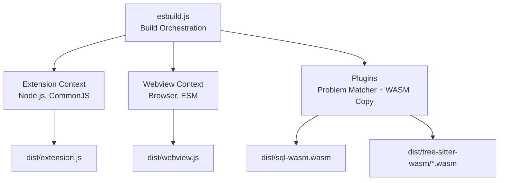
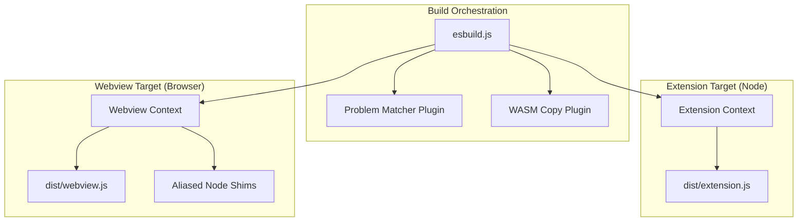
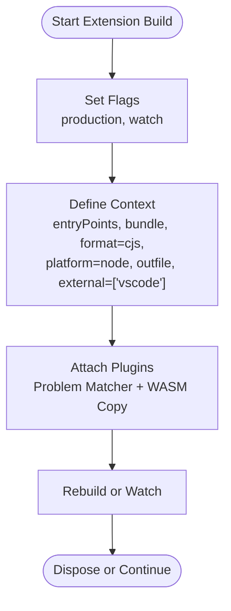
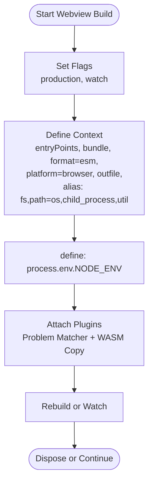
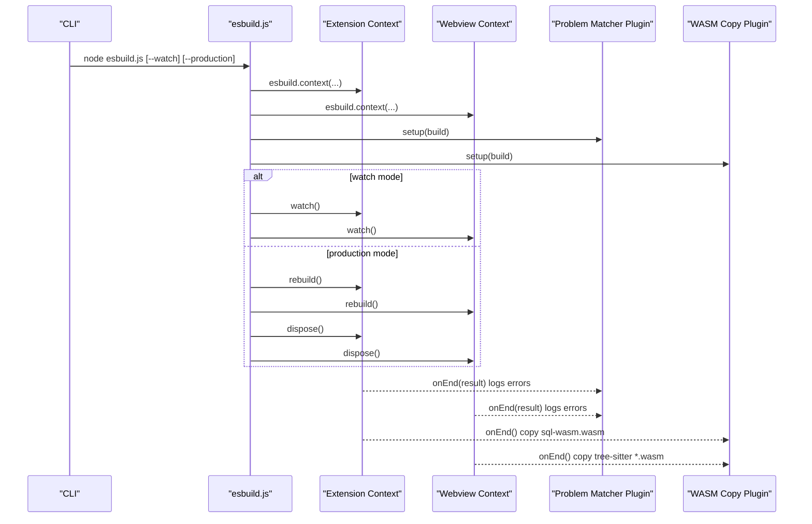
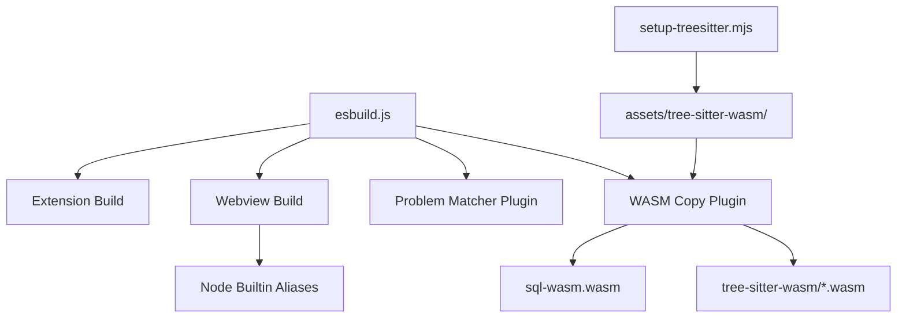

# TypeScript Compilation

<cite>
**Referenced Files in This Document**
- [esbuild.js](file://esbuild.js)
- [package.json](file://package.json)
- [tsconfig.json](file://tsconfig.json)
- [src/extension.ts](file://src/extension.ts)
- [src/webview/index.tsx](file://src/webview/index.tsx)
- [scripts/setup-treesitter.mjs](file://scripts/setup-treesitter.mjs)
- [scripts/build-rust.mjs](file://scripts/build-rust.mjs)
</cite>

## Table of Contents
1. [Introduction](#introduction)
2. [Project Structure](#project-structure)
3. [Core Components](#core-components)
4. [Architecture Overview](#architecture-overview)
5. [Detailed Component Analysis](#detailed-component-analysis)
6. [Dependency Analysis](#dependency-analysis)
7. [Performance Considerations](#performance-considerations)
8. [Troubleshooting Guide](#troubleshooting-guide)
9. [Conclusion](#conclusion)

## Introduction
This document explains the TypeScript compilation pipeline in the Repomix Runner Plus build system. It covers esbuild configuration for both the extension (Node.js) and webview (browser) targets, build contexts, environment handling, external dependencies, source maps, and the custom plugin ecosystem. It also documents development versus production differences, watch mode, parallel builds, TypeScript configuration, path aliases, module resolution, and troubleshooting strategies for common issues.

## Project Structure
The build system centers on a single esbuild orchestration script that defines two build contexts:
- Extension context: Node.js target, CommonJS output, externalized VS Code API, and WASM asset copying.
- Webview context: Browser target, ESM output, aliased Node.js builtin shims, and environment variable injection.

**Diagram sources**
- [esbuild.js](file://esbuild.js#L94-L144)

**Section sources**
- [esbuild.js](file://esbuild.js#L1-L150)
- [package.json](file://package.json#L541-L559)

## Core Components
- Build orchestration script: Defines two esbuild contexts, handles watch vs rebuild, and applies plugins.
- Problem matcher plugin: Captures and logs build errors with file, line, and column information.
- WASM copy plugin: Ensures runtime WASM dependencies are present in the distribution directory.
- TypeScript configuration: Shared tsconfig for type checking and editor support.
- Entry points: Extension entry and webview entry for bundling.

**Section sources**
- [esbuild.js](file://esbuild.js#L8-L26)
- [esbuild.js](file://esbuild.js#L28-L92)
- [esbuild.js](file://esbuild.js#L94-L144)
- [tsconfig.json](file://tsconfig.json#L1-L31)
- [src/extension.ts](file://src/extension.ts#L1-L10)
- [src/webview/index.tsx](file://src/webview/index.tsx#L1-L18)

## Architecture Overview
The build architecture separates concerns between the extension and webview:
- Extension build produces a CommonJS bundle for VS Code runtime, with the VS Code API marked external.
- Webview build produces an ESM bundle for the browser, with Node.js builtin modules shimmed via aliasing and environment variables injected for runtime behavior.

**Diagram sources**
- [esbuild.js](file://esbuild.js#L94-L144)

## Detailed Component Analysis

### Extension Build Context (Node.js)
- Entry point: Single-file entry for the extension.
- Output: CommonJS bundle written to the extension’s main field.
- Platform: Node.js.
- Minification: Controlled by production flag.
- Source maps: Generated only in development.
- External dependencies: The VS Code API is marked external to prevent bundling it.
- Plugins: Problem matcher and WASM copy plugins.
- Logging: Silent logging level for cleaner output.

**Diagram sources**
- [esbuild.js](file://esbuild.js#L94-L107)

**Section sources**
- [esbuild.js](file://esbuild.js#L94-L107)
- [package.json](file://package.json#L4)

### Webview Build Context (Browser)
- Entry point: React-based webview entry.
- Output: ESM bundle for the browser.
- Platform: Browser.
- Minification: Controlled by production flag.
- Source maps: Generated only in development.
- Aliases: Node.js builtins are mapped to empty or minimal shims to avoid unresolved module errors.
- Environment injection: NODE_ENV is defined for runtime behavior differentiation.
- Plugins: Problem matcher and WASM copy plugins.
- Logging: Silent logging level for cleaner output.

**Diagram sources**
- [esbuild.js](file://esbuild.js#L109-L136)

**Section sources**
- [esbuild.js](file://esbuild.js#L109-L136)

### Plugin System
- Problem matcher plugin: Logs build start and finish messages and prints structured error details with file, line, and column information during build lifecycle hooks.
- WASM copy plugin: Ensures required WASM files are present in the distribution directory:
  - Copies the SQL.js WASM file if not already present.
  - Copies all Tree-sitter WASM files from assets to dist on every build, preserving timestamps to avoid unnecessary re-copying.

**Diagram sources**
- [esbuild.js](file://esbuild.js#L94-L144)
- [esbuild.js](file://esbuild.js#L11-L26)
- [esbuild.js](file://esbuild.js#L33-L92)

**Section sources**
- [esbuild.js](file://esbuild.js#L11-L26)
- [esbuild.js](file://esbuild.js#L33-L92)

### TypeScript Configuration and Module Resolution
- TypeScript compiler options:
  - Module and target aligned with modern environments.
  - JSX enabled for React.
  - Source maps enabled for development.
  - Strictness and performance-oriented flags.
- Root directory and emit behavior:
  - Root directory set to src.
  - Emit disabled to rely on esbuild for bundling.
- Exclude patterns:
  - Skips node_modules, assets, and dist from TypeScript checks.

Module resolution:
- esbuild resolves imports using Node module resolution semantics by default.
- For the webview, Node builtin aliases are provided to prevent unresolved module errors.

**Section sources**
- [tsconfig.json](file://tsconfig.json#L1-L31)
- [esbuild.js](file://esbuild.js#L124-L130)

### Development vs Production Builds
- Minification:
  - Controlled by the production flag passed to the build script.
- Source maps:
  - Disabled in production; enabled in development.
- Environment:
  - NODE_ENV is injected differently depending on production mode.

Watch mode:
- When watch is enabled, both contexts enter watch mode concurrently.
- Otherwise, both contexts perform a single rebuild and then dispose.

Parallel execution:
- Both contexts are created and driven in parallel using Promise-based orchestration.

**Section sources**
- [esbuild.js](file://esbuild.js#L5-L6)
- [esbuild.js](file://esbuild.js#L98-L100)
- [esbuild.js](file://esbuild.js#L113-L115)
- [esbuild.js](file://esbuild.js#L138-L143)

### External Dependencies Handling
- Extension target:
  - The VS Code API is marked external to avoid bundling and ensure runtime availability.
- Webview target:
  - Node builtins are aliased to lightweight shims to satisfy static analysis and avoid runtime failures.
  - Ensure no code path imports Node-only modules at runtime; otherwise, the shim aliasing will be necessary.

**Section sources**
- [esbuild.js](file://esbuild.js#L104)
- [esbuild.js](file://esbuild.js#L124-L130)

### WASM Runtime Dependencies
- SQL.js WASM:
  - Copied from node_modules to dist only if not already present.
- Tree-sitter WASM:
  - Copied from assets/tree-sitter-wasm to dist/tree-sitter-wasm on every build, preserving timestamps.
- Setup script:
  - A dedicated script downloads language-specific WASM parsers into assets and generates a manifest and README for reference.

**Section sources**
- [esbuild.js](file://esbuild.js#L44-L57)
- [esbuild.js](file://esbuild.js#L59-L89)
- [scripts/setup-treesitter.mjs](file://scripts/setup-treesitter.mjs#L1-L278)

### Entry Points and Outputs
- Extension entry point:
  - Single TS entry for the extension.
- Webview entry point:
  - React-based entry initializes the webview UI.
- Outputs:
  - Extension output path is configured in the package main field.
  - Webview output path is configured as the webview bundle.

**Section sources**
- [esbuild.js](file://esbuild.js#L96)
- [esbuild.js](file://esbuild.js#L110)
- [esbuild.js](file://esbuild.js#L103)
- [esbuild.js](file://esbuild.js#L117)
- [package.json](file://package.json#L4)

## Dependency Analysis
The build depends on:
- esbuild for bundling and plugin system.
- Node.js built-ins for the webview, resolved via aliases to shims.
- WASM assets managed by the WASM copy plugin and prepared by the setup script.

**Diagram sources**
- [esbuild.js](file://esbuild.js#L94-L144)
- [scripts/setup-treesitter.mjs](file://scripts/setup-treesitter.mjs#L18-L19)

**Section sources**
- [esbuild.js](file://esbuild.js#L1-L150)
- [scripts/setup-treesitter.mjs](file://scripts/setup-treesitter.mjs#L1-L278)

## Performance Considerations
- Parallel builds: Both contexts are created and driven concurrently, reducing total build time.
- Watch mode: Enables incremental rebuilds for faster iteration during development.
- Minification: Controlled by production flag to optimize bundle size for distribution.
- Source maps: Disabled in production to avoid shipping mapping overhead.
- Aliasing: Reduces runtime polyfills and avoids bundling heavy Node builtins.

[No sources needed since this section provides general guidance]

## Troubleshooting Guide
Common issues and resolutions:
- Unresolved module errors for Node builtins in the webview:
  - Ensure Node builtin aliases are applied and that no code imports Node-only modules at runtime.
  - Verify that the webview entry does not import Node-only modules directly.
- Missing WASM files:
  - Run the setup script to populate assets/tree-sitter-wasm and ensure the WASM copy plugin is copying them to dist.
  - Confirm the presence of sql-wasm.wasm in node_modules and dist.
- Build errors not visible:
  - The problem matcher plugin logs structured errors with file, line, and column; check the console output during builds.
- Production vs development behavior:
  - Verify NODE_ENV injection and minification flags are set according to the production flag.
- Watch mode not triggering:
  - Ensure the watch flag is passed to the build script and that both contexts are watching concurrently.

**Section sources**
- [esbuild.js](file://esbuild.js#L11-L26)
- [esbuild.js](file://esbuild.js#L33-L92)
- [esbuild.js](file://esbuild.js#L138-L143)
- [scripts/setup-treesitter.mjs](file://scripts/setup-treesitter.mjs#L179-L270)

## Conclusion
The Repomix Runner Plus build system uses a focused esbuild configuration to produce separate bundles for the extension and webview. It leverages a plugin system for improved diagnostics and runtime asset management, supports both development and production modes, and uses watch mode for efficient iteration. Proper handling of external dependencies and Node builtin aliases ensures robust operation across environments.