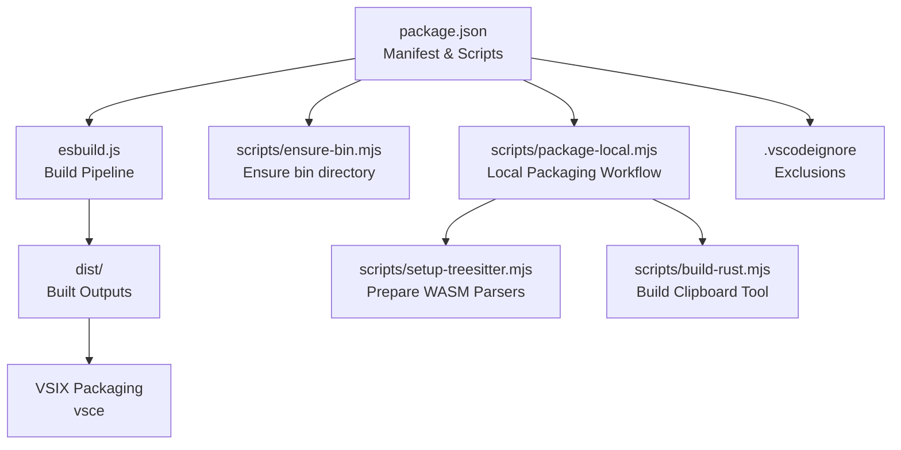
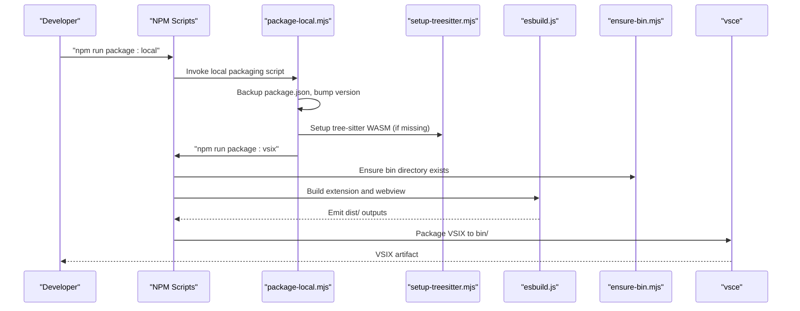
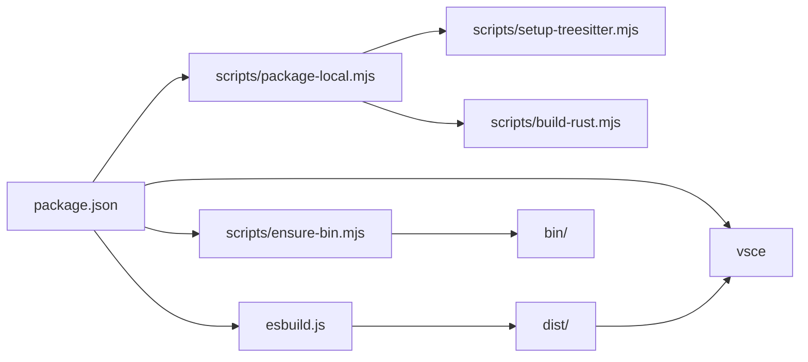

# VSIX Packaging and Release

<cite>
**Referenced Files in This Document**
- [package.json](file://package.json)
- [scripts/package-local.mjs](file://scripts/package-local.mjs)
- [.vscodeignore](file://.vscodeignore)
- [esbuild.js](file://esbuild.js)
- [scripts/ensure-bin.mjs](file://scripts/ensure-bin.mjs)
- [scripts/setup-treesitter.mjs](file://scripts/setup-treesitter.mjs)
- [scripts/build-rust.mjs](file://scripts/build-rust.mjs)
- [assets/tree-sitter-wasm/manifest.json](file://assets/tree-sitter-wasm/manifest.json)
- [CHANGELOG.md](file://CHANGELOG.md)
- [README.md](file://README.md)
</cite>

## Table of Contents
1. [Introduction](#introduction)
2. [Project Structure](#project-structure)
3. [Core Components](#core-components)
4. [Architecture Overview](#architecture-overview)
5. [Detailed Component Analysis](#detailed-component-analysis)
6. [Dependency Analysis](#dependency-analysis)
7. [Performance Considerations](#performance-considerations)
8. [Troubleshooting Guide](#troubleshooting-guide)
9. [Conclusion](#conclusion)
10. [Appendices](#appendices)

## Introduction
This document explains how the project packages and releases the VSIX extension. It covers the extension manifest configuration, build pipeline, local packaging workflow, exclusion rules, versioning and changelog practices, and marketplace submission requirements. It also provides guidance for testing VSIX packages locally, debugging packaging issues, and managing updates.

## Project Structure
The packaging and release automation spans several key areas:
- Manifest and scripts in the root package configuration
- Build pipeline orchestrated by esbuild
- Local packaging workflow script
- Asset preparation for WASM parsers and Rust binaries
- Exclusion rules for packaging

**Diagram sources**
- [package.json](file://package.json#L541-L559)
- [esbuild.js](file://esbuild.js#L94-L144)
- [scripts/ensure-bin.mjs](file://scripts/ensure-bin.mjs#L8-L13)
- [scripts/package-local.mjs](file://scripts/package-local.mjs#L84-L93)
- [scripts/setup-treesitter.mjs](file://scripts/setup-treesitter.mjs#L179-L270)
- [scripts/build-rust.mjs](file://scripts/build-rust.mjs#L16-L44)
- [.vscodeignore](file://.vscodeignore#L1-L57)

**Section sources**
- [package.json](file://package.json#L1-L608)
- [esbuild.js](file://esbuild.js#L1-L150)
- [scripts/ensure-bin.mjs](file://scripts/ensure-bin.mjs#L1-L14)
- [scripts/package-local.mjs](file://scripts/package-local.mjs#L1-L115)
- [scripts/setup-treesitter.mjs](file://scripts/setup-treesitter.mjs#L1-L278)
- [scripts/build-rust.mjs](file://scripts/build-rust.mjs#L1-L50)
- [.vscodeignore](file://.vscodeignore#L1-L57)

## Core Components
- Extension manifest and metadata: publisher, name, display name, version, engines, categories, activation events, contributions, and scripts.
- Build pipeline: esbuild compiles TypeScript/React sources, manages WASM assets, and produces the extension bundle.
- Local packaging workflow: a script that temporarily modifies version, ensures WASM assets, and runs VSIX packaging.
- Asset preparation: scripts to download and stage WASM parsers and Rust binaries.
- Packaging exclusions: .vscodeignore defines what files are included or excluded from the package.

**Section sources**
- [package.json](file://package.json#L1-L608)
- [esbuild.js](file://esbuild.js#L33-L92)
- [scripts/package-local.mjs](file://scripts/package-local.mjs#L72-L95)
- [scripts/setup-treesitter.mjs](file://scripts/setup-treesitter.mjs#L179-L270)
- [scripts/build-rust.mjs](file://scripts/build-rust.mjs#L16-L44)
- [.vscodeignore](file://.vscodeignore#L1-L57)

## Architecture Overview
The packaging pipeline integrates manifest configuration, build steps, asset preparation, and VSIX packaging.

**Diagram sources**
- [scripts/package-local.mjs](file://scripts/package-local.mjs#L72-L95)
- [scripts/setup-treesitter.mjs](file://scripts/setup-treesitter.mjs#L179-L270)
- [esbuild.js](file://esbuild.js#L94-L144)
- [scripts/ensure-bin.mjs](file://scripts/ensure-bin.mjs#L8-L13)
- [package.json](file://package.json#L541-L559)

## Detailed Component Analysis

### Manifest and Metadata (package.json)
Key aspects:
- Publisher and identity: publisher, name, display name, repository URL.
- Versioning: semantic version string used for VSIX identity and marketplace.
- Engine compatibility: minimum VS Code version constraint.
- Activation and contributions: commands, views, menus, configuration schemas.
- Scripts: build, watch, package, VSIX packaging, local packaging, and Rust setup.

Practical implications:
- Changing version affects the VSIX filename and marketplace identity.
- Activation events and contributions define the extension surface exposed to VS Code.
- Scripts orchestrate the build and packaging lifecycle.

**Section sources**
- [package.json](file://package.json#L1-L608)

### Build Pipeline (esbuild.js)
Highlights:
- Compiles the extension and webview bundles with optional minification.
- Copies WASM assets to the dist directory:
  - sql-wasm.wasm from node_modules to dist/.
  - tree-sitter WASM files from assets/tree-sitter-wasm/ to dist/tree-sitter-wasm/.
- Defines aliases and shims to avoid browser/runtime errors for Node-only modules in the webview context.
- Supports watch mode for development.

Asset copying behavior:
- sql-wasm.wasm is copied only if not already present.
- tree-sitter WASM files are copied on every build to ensure freshness.

**Section sources**
- [esbuild.js](file://esbuild.js#L33-L92)
- [esbuild.js](file://esbuild.js#L94-L144)

### Local Packaging Workflow (scripts/package-local.mjs)
Purpose:
- Generate a reproducible local alpha build with a timestamped version suffix.
- Ensure tree-sitter WASM assets are present.
- Run the existing VSIX packaging script.

Safety mechanisms:
- Backs up package.json before modification and restores it afterward.
- Handles signals (SIGINT/SIGTERM) to ensure cleanup.
- Restores original package.json and removes backup on completion.

Versioning strategy:
- Strips existing -alpha suffixes to avoid stacking (e.g., -alpha.1-alpha.2).
- Constructs a new version with a timestamped -alpha suffix.

**Section sources**
- [scripts/package-local.mjs](file://scripts/package-local.mjs#L29-L68)
- [scripts/package-local.mjs](file://scripts/package-local.mjs#L72-L95)
- [scripts/package-local.mjs](file://scripts/package-local.mjs#L96-L112)

### Asset Preparation (scripts/setup-treesitter.mjs)
Responsibilities:
- Creates assets/tree-sitter-wasm/ and downloads language-specific WASM parsers.
- Supports multiple sources: GitHub releases and unpkg CDN.
- Generates a manifest.json and README.md for the WASM directory.

Integration:
- The esbuild plugin copies these WASM files into dist/ during builds.
- The manifest documents supported languages and sources.

**Section sources**
- [scripts/setup-treesitter.mjs](file://scripts/setup-treesitter.mjs#L179-L270)
- [assets/tree-sitter-wasm/manifest.json](file://assets/tree-sitter-wasm/manifest.json#L1-L65)

### Rust Binary Preparation (scripts/build-rust.mjs)
Responsibilities:
- Builds the repomix-clipboard tool for the current platform/architecture.
- Copies the resulting binary to assets/bin/ with a platform/architecture-specific name.

Integration:
- The binary is distributed with the extension to support clipboard operations in remote environments.

**Section sources**
- [scripts/build-rust.mjs](file://scripts/build-rust.mjs#L16-L44)

### Packaging Exclusions (.vscodeignore)
Scope:
- Excludes development artifacts, source files, build outputs, and temporary files.
- Explicitly includes specific binaries and WASM files needed at runtime.

Important inclusions:
- assets/bin/ and assets/bin/*.exe for the clipboard tool.
- dist/tiktoken_bg.wasm and dist/sql-wasm.wasm for WASM dependencies.

**Section sources**
- [.vscodeignore](file://.vscodeignore#L1-L57)

### VSIX Packaging Script (package.json scripts)
- package:vsix: Runs asset preparation and delegates to vsce to produce a VSIX in bin/.
- package:local: Invokes the local packaging script for alpha builds.

**Section sources**
- [package.json](file://package.json#L541-L559)

## Dependency Analysis
The packaging pipeline depends on:
- Manifest configuration for identity and engine compatibility.
- Build tooling (esbuild) for bundling and asset copying.
- Asset preparation scripts for WASM and Rust binaries.
- Packaging tool (vsce) invoked by the packaging scripts.

**Diagram sources**
- [package.json](file://package.json#L541-L559)
- [esbuild.js](file://esbuild.js#L94-L144)
- [scripts/ensure-bin.mjs](file://scripts/ensure-bin.mjs#L8-L13)
- [scripts/package-local.mjs](file://scripts/package-local.mjs#L84-L93)
- [scripts/setup-treesitter.mjs](file://scripts/setup-treesitter.mjs#L179-L270)
- [scripts/build-rust.mjs](file://scripts/build-rust.mjs#L16-L44)

**Section sources**
- [package.json](file://package.json#L541-L559)
- [esbuild.js](file://esbuild.js#L33-L92)
- [scripts/ensure-bin.mjs](file://scripts/ensure-bin.mjs#L8-L13)
- [scripts/package-local.mjs](file://scripts/package-local.mjs#L84-L93)
- [scripts/setup-treesitter.mjs](file://scripts/setup-treesitter.mjs#L179-L270)
- [scripts/build-rust.mjs](file://scripts/build-rust.mjs#L16-L44)

## Performance Considerations
- Minification: esbuild minifies bundles in production builds to reduce payload size.
- Asset caching: WASM files are copied only when absent or newer, reducing redundant I/O.
- Watch mode: enables incremental rebuilds during development.
- Exclusions: .vscodeignore prevents large or unnecessary files from being packaged.

[No sources needed since this section provides general guidance]

## Troubleshooting Guide

Common packaging issues and resolutions:
- Missing tree-sitter WASM files
  - Symptom: warnings about missing tree-sitter WASM directory or files during build.
  - Resolution: run the setup script to download parsers; ensure assets/tree-sitter-wasm/ exists and contains .wasm files.
  - Related code paths:
    - [scripts/setup-treesitter.mjs](file://scripts/setup-treesitter.mjs#L179-L270)
    - [esbuild.js](file://esbuild.js#L59-L89)

- SQL WASM not found
  - Symptom: warning that sql-wasm.wasm is not found in node_modules.
  - Resolution: ensure the sql.js dependency is installed; the build copies it to dist/ if present.
  - Related code paths:
    - [esbuild.js](file://esbuild.js#L44-L57)

- Local packaging fails to restore package.json
  - Symptom: backup file remains or package.json is modified after failure.
  - Resolution: the local packaging script creates a backup and restores it; check for filesystem permissions and signal handling.
  - Related code paths:
    - [scripts/package-local.mjs](file://scripts/package-local.mjs#L29-L68)
    - [scripts/package-local.mjs](file://scripts/package-local.mjs#L96-L112)

- VSIX packaging fails due to missing bin directory
  - Symptom: vsce packaging errors indicating missing output directory.
  - Resolution: ensure the bin directory exists; the packaging script invokes a preparatory script to create it.
  - Related code paths:
    - [scripts/ensure-bin.mjs](file://scripts/ensure-bin.mjs#L8-L13)
    - [package.json](file://package.json#L548-L548)

- Remote clipboard binary not found
  - Symptom: clipboard operations fail in remote environments.
  - Resolution: build the Rust clipboard tool for the current platform; the build script copies the binary to assets/bin/.
  - Related code paths:
    - [scripts/build-rust.mjs](file://scripts/build-rust.mjs#L16-L44)

- Excessive package size
  - Symptom: large VSIX size impacting distribution.
  - Resolution: review .vscodeignore to ensure unnecessary files are excluded; confirm WASM and binary exclusions are intentional.
  - Related code paths:
    - [.vscodeignore](file://.vscodeignore#L1-L57)

- Version mismatch or marketplace rejection
  - Symptom: marketplace rejection due to invalid version or identity.
  - Resolution: verify semantic versioning and publisher/name consistency; ensure the version matches expectations.
  - Related code paths:
    - [package.json](file://package.json#L12-L12)
    - [package.json](file://package.json#L2-L4)

**Section sources**
- [scripts/setup-treesitter.mjs](file://scripts/setup-treesitter.mjs#L179-L270)
- [esbuild.js](file://esbuild.js#L44-L57)
- [scripts/package-local.mjs](file://scripts/package-local.mjs#L29-L68)
- [scripts/ensure-bin.mjs](file://scripts/ensure-bin.mjs#L8-L13)
- [scripts/build-rust.mjs](file://scripts/build-rust.mjs#L16-L44)
- [.vscodeignore](file://.vscodeignore#L1-L57)
- [package.json](file://package.json#L12-L12)

## Conclusion
The project’s packaging and release automation combines a robust manifest configuration, a reliable build pipeline, targeted asset preparation, and a safe local packaging workflow. By following the documented practices—maintaining semantic versioning, preparing WASM assets, and leveraging .vscodeignore—the extension can be consistently packaged, tested, and published.

[No sources needed since this section summarizes without analyzing specific files]

## Appendices

### Release Process and Version Management
- Version management
  - Maintain semantic versioning and update the version field in the manifest.
  - Use the local packaging script for alpha builds with timestamped suffixes.
  - Related code paths:
    - [package.json](file://package.json#L12-L12)
    - [scripts/package-local.mjs](file://scripts/package-local.mjs#L72-L79)

- Changelog generation
  - Follow Keep a Changelog conventions and Semantic Versioning adherence.
  - Update the changelog with notable changes for each release.
  - Related code paths:
    - [CHANGELOG.md](file://CHANGELOG.md#L1-L181)

- Automated publishing workflows
  - The manifest includes a pre-publish script that triggers packaging; integrate with CI to automate publishing after successful builds.
  - Related code paths:
    - [package.json](file://package.json#L541-L542)

**Section sources**
- [package.json](file://package.json#L12-L12)
- [scripts/package-local.mjs](file://scripts/package-local.mjs#L72-L79)
- [CHANGELOG.md](file://CHANGELOG.md#L1-L181)
- [package.json](file://package.json#L541-L542)

### Testing VSIX Packages Locally
- Local alpha builds
  - Use the local packaging script to generate a timestamped alpha VSIX for testing.
  - Related code paths:
    - [scripts/package-local.mjs](file://scripts/package-local.mjs#L72-L95)

- Installing and verifying
  - Install the generated VSIX in VS Code and verify commands, views, and webview functionality.
  - Related code paths:
    - [README.md](file://README.md#L69-L75)

**Section sources**
- [scripts/package-local.mjs](file://scripts/package-local.mjs#L72-L95)
- [README.md](file://README.md#L69-L75)

### Extension Manifest Structure and Marketplace Submission
- Manifest structure
  - Identity: publisher, name, display name, repository.
  - Compatibility: engines with VS Code version.
  - Contributions: commands, views, menus, configuration schemas.
  - Scripts: build, watch, package, VSIX packaging, local packaging.
  - Related code paths:
    - [package.json](file://package.json#L1-L608)

- Marketplace submission requirements
  - Ensure publisher and extension name are set and consistent.
  - Verify activation events and contributions are accurate.
  - Confirm assets and binaries are properly included/excluded via .vscodeignore.
  - Related code paths:
    - [package.json](file://package.json#L1-L608)
    - [.vscodeignore](file://.vscodeignore#L1-L57)

**Section sources**
- [package.json](file://package.json#L1-L608)
- [.vscodeignore](file://.vscodeignore#L1-L57)

### Security Considerations and Permissions
- Distribution channels
  - Publish to the Visual Studio Marketplace using the configured publisher and identity.
  - Related code paths:
    - [package.json](file://package.json#L2-L4)

- Asset integrity
  - WASM parsers are downloaded from trusted sources; maintain manifest.json for auditability.
  - Related code paths:
    - [scripts/setup-treesitter.mjs](file://scripts/setup-treesitter.mjs#L179-L270)
    - [assets/tree-sitter-wasm/manifest.json](file://assets/tree-sitter-wasm/manifest.json#L1-L65)

**Section sources**
- [package.json](file://package.json#L2-L4)
- [scripts/setup-treesitter.mjs](file://scripts/setup-treesitter.mjs#L179-L270)
- [assets/tree-sitter-wasm/manifest.json](file://assets/tree-sitter-wasm/manifest.json#L1-L65)