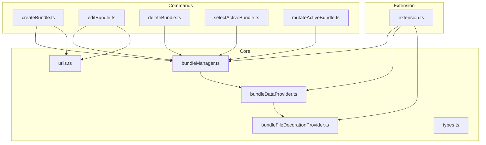
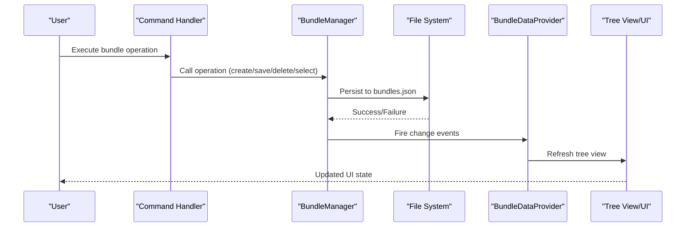
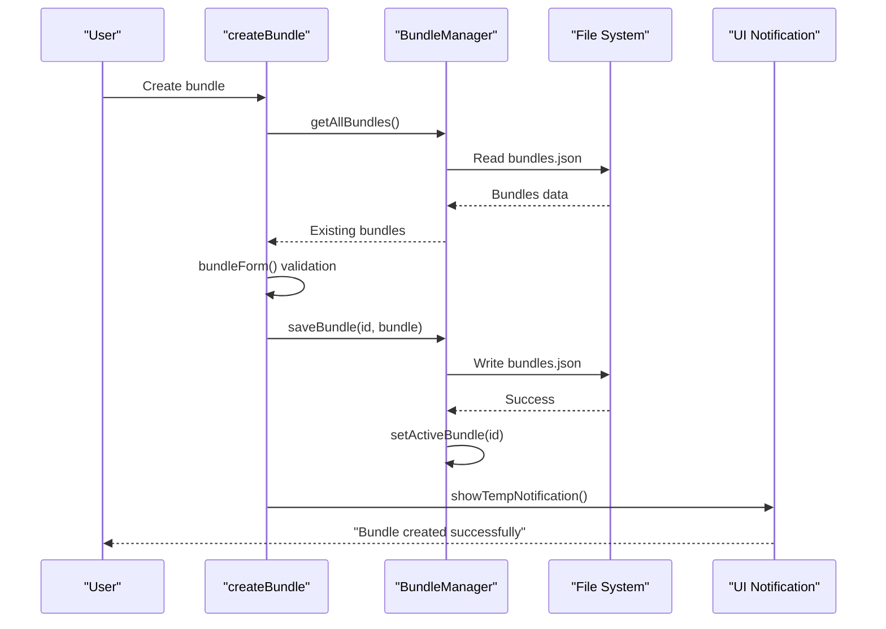
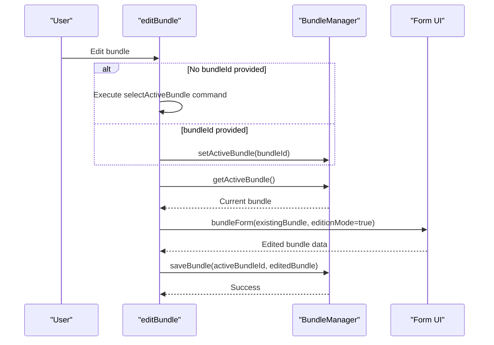
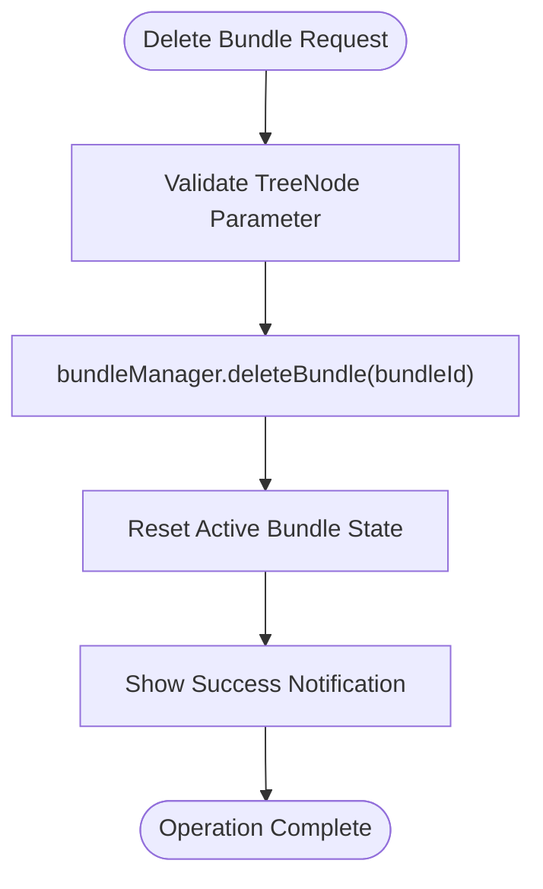
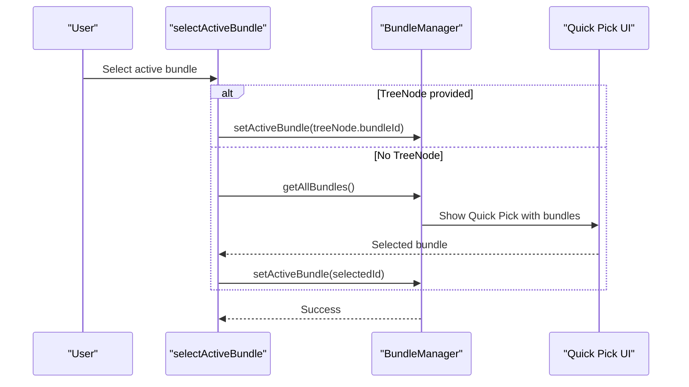
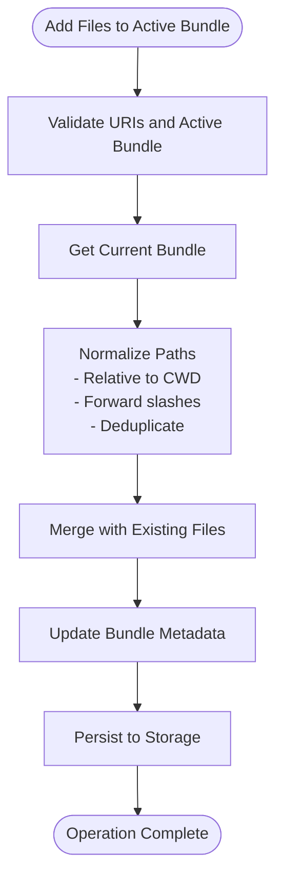
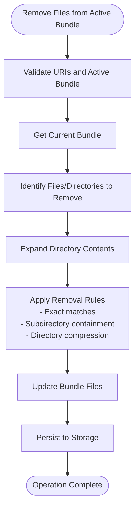
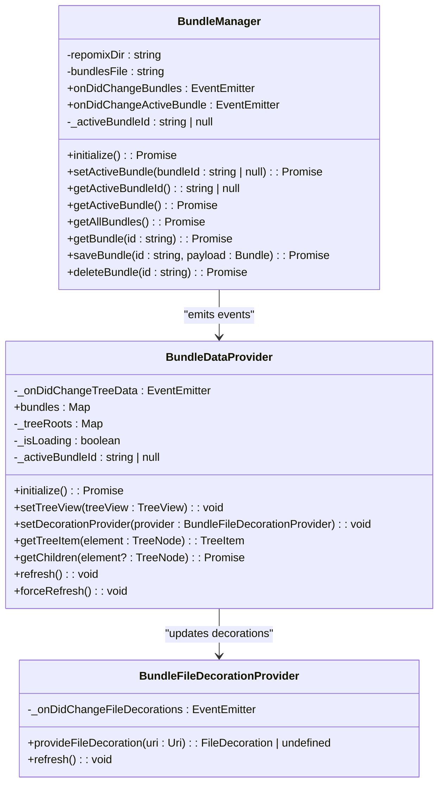
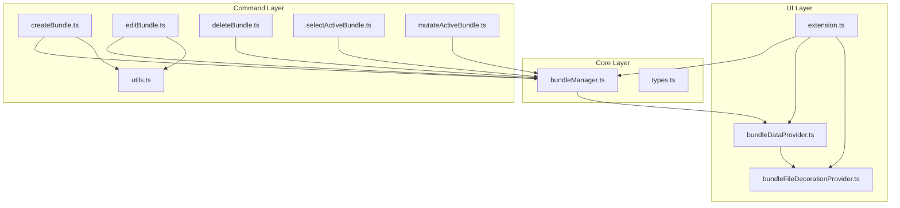

# Bundle Management Commands

<cite>
**Referenced Files in This Document**
- [createBundle.ts](file://src/commands/createBundle.ts)
- [editBundle.ts](file://src/commands/editBundle.ts)
- [deleteBundle.ts](file://src/commands/deleteBundle.ts)
- [selectActiveBundle.ts](file://src/commands/selectActiveBundle.ts)
- [mutateActiveBundle.ts](file://src/commands/mutateActiveBundle.ts)
- [bundleManager.ts](file://src/core/bundles/bundleManager.ts)
- [bundleDataProvider.ts](file://src/core/bundles/bundleDataProvider.ts)
- [bundleFileDecorationProvider.ts](file://src/core/bundles/bundleFileDecorationProvider.ts)
- [types.ts](file://src/core/bundles/types.ts)
- [utils.ts](file://src/commands/utils.ts)
- [extension.ts](file://src/extension.ts)
</cite>

## Table of Contents
1. [Introduction](#introduction)
2. [Project Structure](#project-structure)
3. [Core Components](#core-components)
4. [Architecture Overview](#architecture-overview)
5. [Detailed Component Analysis](#detailed-component-analysis)
6. [Dependency Analysis](#dependency-analysis)
7. [Performance Considerations](#performance-considerations)
8. [Troubleshooting Guide](#troubleshooting-guide)
9. [Conclusion](#conclusion)

## Introduction
This document provides comprehensive coverage of the bundle management command implementations in the Repomix Runner extension. It focuses on five core commands: createBundle, editBundle, deleteBundle, selectActiveBundle, and mutateActiveBundle. The documentation explains the bundle lifecycle management through command handlers, including validation, persistence, and UI updates. It details mutation patterns for bundle modifications and active bundle switching, error handling for bundle operations, conflict resolution, and state synchronization with the bundle provider. Examples of bundle creation workflows, editing processes, and selection mechanisms are included, along with integration details for the bundle data provider and tree view updates.

## Project Structure
The bundle management functionality is organized around a clear separation of concerns:
- Command handlers: User-facing operations for bundle creation, editing, deletion, selection, and mutation
- Core bundle manager: Persistence layer managing bundle storage and active bundle state
- Data provider: Tree view integration and UI synchronization
- Decoration provider: Visual indicators for bundle files in the editor
- Shared utilities: Form validation and configuration selection

**Diagram sources**
- [createBundle.ts](file://src/commands/createBundle.ts#L1-L32)
- [editBundle.ts](file://src/commands/editBundle.ts#L1-L49)
- [deleteBundle.ts](file://src/commands/deleteBundle.ts#L1-L9)
- [selectActiveBundle.ts](file://src/commands/selectActiveBundle.ts#L1-L55)
- [mutateActiveBundle.ts](file://src/commands/mutateActiveBundle.ts#L1-L348)
- [bundleManager.ts](file://src/core/bundles/bundleManager.ts#L1-L117)
- [bundleDataProvider.ts](file://src/core/bundles/bundleDataProvider.ts#L1-L325)
- [bundleFileDecorationProvider.ts](file://src/core/bundles/bundleFileDecorationProvider.ts#L1-L30)
- [types.ts](file://src/core/bundles/types.ts#L1-L37)
- [utils.ts](file://src/commands/utils.ts#L1-L148)
- [extension.ts](file://src/extension.ts#L487-L560)

**Section sources**
- [extension.ts](file://src/extension.ts#L487-L560)
- [bundleManager.ts](file://src/core/bundles/bundleManager.ts#L1-L117)
- [bundleDataProvider.ts](file://src/core/bundles/bundleDataProvider.ts#L1-L325)

## Core Components
This section outlines the primary components involved in bundle management and their responsibilities.

- BundleManager: Handles persistence of bundles to a JSON file, manages active bundle state, and emits events for UI synchronization.
- BundleDataProvider: Implements the VS Code TreeDataProvider interface to render bundle files in the explorer, handles lazy loading, and maintains UI state.
- BundleFileDecorationProvider: Provides visual badges for files that belong to the active bundle.
- Command Handlers: Implement user-facing operations for bundle lifecycle management.
- Shared Utilities: Provide form validation and configuration selection for bundle creation and editing.

**Section sources**
- [bundleManager.ts](file://src/core/bundles/bundleManager.ts#L6-L117)
- [bundleDataProvider.ts](file://src/core/bundles/bundleDataProvider.ts#L18-L325)
- [bundleFileDecorationProvider.ts](file://src/core/bundles/bundleFileDecorationProvider.ts#L4-L30)
- [createBundle.ts](file://src/commands/createBundle.ts#L7-L31)
- [editBundle.ts](file://src/commands/editBundle.ts#L6-L48)
- [deleteBundle.ts](file://src/commands/deleteBundle.ts#L5-L8)
- [selectActiveBundle.ts](file://src/commands/selectActiveBundle.ts#L6-L54)
- [mutateActiveBundle.ts](file://src/commands/mutateActiveBundle.ts#L15-L348)
- [utils.ts](file://src/commands/utils.ts#L5-L148)

## Architecture Overview
The bundle management architecture follows a layered approach with clear boundaries between UI, command handlers, persistence, and data providers.

**Diagram sources**
- [bundleManager.ts](file://src/core/bundles/bundleManager.ts#L75-L90)
- [bundleDataProvider.ts](file://src/core/bundles/bundleDataProvider.ts#L31-L40)
- [extension.ts](file://src/extension.ts#L487-L560)

## Detailed Component Analysis

### Bundle Lifecycle Management
The bundle lifecycle encompasses creation, modification, selection, mutation, and deletion phases, each handled by dedicated command handlers with validation, persistence, and UI updates.

#### Creation Workflow
The createBundle command orchestrates bundle creation through a structured process:
1. Retrieve existing bundles to prevent conflicts
2. Present a form for bundle metadata input
3. Generate a unique identifier for the new bundle
4. Persist the bundle to storage
5. Activate the newly created bundle
6. Notify the user of successful creation

**Diagram sources**
- [createBundle.ts](file://src/commands/createBundle.ts#L7-L31)
- [bundleManager.ts](file://src/core/bundles/bundleManager.ts#L75-L90)
- [bundleManager.ts](file://src/core/bundles/bundleManager.ts#L32-L41)

**Section sources**
- [createBundle.ts](file://src/commands/createBundle.ts#L7-L31)
- [utils.ts](file://src/commands/utils.ts#L5-L81)

#### Editing Process
The editBundle command enables modification of existing bundles:
1. Ensure an active bundle exists (prompt selection if needed)
2. Load current bundle metadata
3. Present an edition form pre-populated with existing values
4. Validate and persist changes
5. Maintain active bundle state

**Diagram sources**
- [editBundle.ts](file://src/commands/editBundle.ts#L6-L48)
- [bundleManager.ts](file://src/core/bundles/bundleManager.ts#L47-L53)
- [bundleManager.ts](file://src/core/bundles/bundleManager.ts#L75-L90)

**Section sources**
- [editBundle.ts](file://src/commands/editBundle.ts#L6-L48)
- [utils.ts](file://src/commands/utils.ts#L5-L81)

#### Deletion Mechanism
The deleteBundle command removes bundles from storage and resets active state:
1. Delete bundle from persistent storage
2. Clear active bundle state
3. Notify user of successful deletion

**Diagram sources**
- [deleteBundle.ts](file://src/commands/deleteBundle.ts#L5-L8)
- [bundleManager.ts](file://src/core/bundles/bundleManager.ts#L92-L115)

**Section sources**
- [deleteBundle.ts](file://src/commands/deleteBundle.ts#L5-L8)
- [bundleManager.ts](file://src/core/bundles/bundleManager.ts#L92-L115)

#### Selection Mechanism
The selectActiveBundle command manages active bundle switching:
1. Accept a tree node or prompt user to select from available bundles
2. Validate selection and handle empty states
3. Update active bundle state and notify UI

**Diagram sources**
- [selectActiveBundle.ts](file://src/commands/selectActiveBundle.ts#L6-L54)
- [bundleManager.ts](file://src/core/bundles/bundleManager.ts#L32-L41)

**Section sources**
- [selectActiveBundle.ts](file://src/commands/selectActiveBundle.ts#L6-L54)
- [bundleManager.ts](file://src/core/bundles/bundleManager.ts#L32-L41)

### Mutation Patterns for Bundle Modifications
The mutateActiveBundle command implements sophisticated file addition and removal patterns with intelligent normalization and directory handling.

#### Adding Files to Active Bundle
The addFilesToActiveBundle function handles file additions with robust path normalization:
1. Validate input URIs and active bundle state
2. Convert absolute paths to workspace-relative paths
3. Normalize paths for cross-platform compatibility
4. Merge with existing files and deduplicate
5. Persist updated bundle

**Diagram sources**
- [mutateActiveBundle.ts](file://src/commands/mutateActiveBundle.ts#L15-L61)

**Section sources**
- [mutateActiveBundle.ts](file://src/commands/mutateActiveBundle.ts#L15-L61)

#### Removing Files from Active Bundle
The removeFilesFromActiveBundle function implements complex directory and file removal logic:
1. Identify directories and individual files to remove
2. Expand directories to identify all contained files
3. Apply intelligent removal rules to maintain bundle integrity
4. Compress removable directories when all contents are removed
5. Persist updated bundle state

**Diagram sources**
- [mutateActiveBundle.ts](file://src/commands/mutateActiveBundle.ts#L68-L112)
- [mutateActiveBundle.ts](file://src/commands/mutateActiveBundle.ts#L134-L275)

**Section sources**
- [mutateActiveBundle.ts](file://src/commands/mutateActiveBundle.ts#L68-L112)
- [mutateActiveBundle.ts](file://src/commands/mutateActiveBundle.ts#L134-L275)

### Integration with Bundle Data Provider and Tree View Updates
The bundle management system integrates tightly with VS Code's tree view and file decoration systems:

**Diagram sources**
- [bundleManager.ts](file://src/core/bundles/bundleManager.ts#L6-L117)
- [bundleDataProvider.ts](file://src/core/bundles/bundleDataProvider.ts#L18-L325)
- [bundleFileDecorationProvider.ts](file://src/core/bundles/bundleFileDecorationProvider.ts#L4-L30)

**Section sources**
- [bundleDataProvider.ts](file://src/core/bundles/bundleDataProvider.ts#L18-L325)
- [bundleFileDecorationProvider.ts](file://src/core/bundles/bundleFileDecorationProvider.ts#L4-L30)

## Dependency Analysis
The bundle management system exhibits well-defined dependencies with clear separation of concerns:

**Diagram sources**
- [createBundle.ts](file://src/commands/createBundle.ts#L1-L32)
- [editBundle.ts](file://src/commands/editBundle.ts#L1-L49)
- [deleteBundle.ts](file://src/commands/deleteBundle.ts#L1-L9)
- [selectActiveBundle.ts](file://src/commands/selectActiveBundle.ts#L1-L55)
- [mutateActiveBundle.ts](file://src/commands/mutateActiveBundle.ts#L1-L348)
- [utils.ts](file://src/commands/utils.ts#L1-L148)
- [bundleManager.ts](file://src/core/bundles/bundleManager.ts#L1-L117)
- [bundleDataProvider.ts](file://src/core/bundles/bundleDataProvider.ts#L1-L325)
- [bundleFileDecorationProvider.ts](file://src/core/bundles/bundleFileDecorationProvider.ts#L1-L30)
- [extension.ts](file://src/extension.ts#L487-L560)

**Section sources**
- [extension.ts](file://src/extension.ts#L487-L560)
- [bundleManager.ts](file://src/core/bundles/bundleManager.ts#L1-L117)
- [bundleDataProvider.ts](file://src/core/bundles/bundleDataProvider.ts#L1-L325)

## Performance Considerations
The bundle management system incorporates several performance optimizations:

- Lazy loading: BundleDataProvider implements lazy loading for directory contents to minimize initial load time
- Event-driven updates: BundleManager uses EventEmitter patterns to efficiently notify UI components of changes
- Path normalization: Cross-platform path handling reduces filesystem operations and ensures consistency
- File system watching: Automatic detection of file deletions triggers targeted refreshes rather than full reloads
- Memory management: Proper disposal of subscriptions prevents memory leaks during extension lifecycle

## Troubleshooting Guide
Common issues and their resolutions:

### Bundle Creation Failures
- **Symptom**: Failed to save bundle error messages
- **Causes**: File system permission issues, invalid bundle names, or corrupted storage
- **Resolution**: Check file permissions, validate bundle name format, and restart the extension

### Active Bundle Selection Issues
- **Symptom**: No bundles found notification
- **Causes**: Empty bundles.json file or corrupted bundle metadata
- **Resolution**: Create a new bundle or restore from backup

### File Mutation Problems
- **Symptom**: Files not appearing in bundle after add/remove operations
- **Causes**: Path normalization inconsistencies or directory expansion errors
- **Resolution**: Verify file paths, check for directory permissions, and refresh the tree view

### UI Synchronization Issues
- **Symptom**: Tree view not updating after bundle operations
- **Causes**: Event emission failures or decoration provider refresh issues
- **Resolution**: Force refresh the tree view or restart the extension

**Section sources**
- [createBundle.ts](file://src/commands/createBundle.ts#L26-L30)
- [selectActiveBundle.ts](file://src/commands/selectActiveBundle.ts#L46-L48)
- [bundleDataProvider.ts](file://src/core/bundles/bundleDataProvider.ts#L194-L209)

## Conclusion
The bundle management system provides a robust foundation for organizing and manipulating file collections within the Repomix Runner extension. The five core commands—createBundle, editBundle, deleteBundle, selectActiveBundle, and mutateActiveBundle—implement comprehensive lifecycle management with strong validation, persistence, and UI synchronization. The architecture demonstrates excellent separation of concerns, enabling maintainable and extensible bundle operations while providing intuitive user experiences through VS Code's native UI components.