# Clipboard Commands

<cite>
**Referenced Files in This Document**
- [copySelectedFilesToClipboard.ts](file://src/commands/copySelectedFilesToClipboard.ts)
- [copySelectedFilesAsCompressed.ts](file://src/commands/copySelectedFilesAsCompressed.ts)
- [copyRepomixOutput.ts](file://src/commands/copyRepomixOutput.ts)
- [copySingleFileRespectingMode.ts](file://src/commands/copySingleFileRespectingMode.ts)
- [copyToClipboard.ts](file://src/core/files/copyToClipboard.ts)
- [runRepomixClipboardGenerateMarkdown.ts](file://src/core/files/runRepomixClipboardGenerateMarkdown.ts)
- [markdownGenerator.ts](file://src/core/files/markdownGenerator.ts)
- [compressedMarkdownGenerator.ts](file://src/core/files/compressedMarkdownGenerator.ts)
- [compressFile.ts](file://src/core/compression/compressFile.ts)
- [remoteClipboardHandler.ts](file://src/webview/handlers/remoteClipboardHandler.ts)
- [remoteClipboardMessages.ts](file://src/webview/types/remoteClipboardMessages.ts)
- [remoteDetection.ts](file://src/core/files/remoteDetection.ts)
- [tempDirManager.ts](file://src/core/files/tempDirManager.ts)
- [gitUtils.ts](file://src/git/gitUtils.ts)
- [gitDiffValidator.ts](file://src/fingerprint/validation/gitDiffValidator.ts)
- [main.rs](file://rust/src/main.rs)
- [Cargo.toml](file://rust/Cargo.toml)
- [configLoader.ts](file://src/config/configLoader.ts)
- [extension.ts](file://src/extension.ts)
- [IndexingController.ts](file://src/webview/controllers/IndexingController.ts)
- [BundleController.ts](file://src/webview/controllers/BundleController.ts)
- [messageSchemas.ts](file://src/webview/messageSchemas.ts)
- [SearchTab.tsx](file://src/webview/components/SearchTab.tsx)
- [showTempNotification.ts](file://src/shared/showTempNotification.ts)
- [logger.ts](file://src/shared/logger.ts)
- [testCompression.ts](file://src/commands/testCompression.ts)
- [package.json](file://package.json)
</cite>

## Update Summary
**Changes Made**
- Enhanced compressed Markdown generation with compression status tracking using compressed="true" attribute
- Improved token counting notifications with formatted token count display in success messages
- Better user feedback mechanisms with enhanced copy operation status reporting
- Updated compressed content generation to include compression metadata in file entries
- Enhanced copy operation success messages to display token count information

## Table of Contents
1. [Introduction](#introduction)
2. [Project Structure](#project-structure)
3. [Core Components](#core-components)
4. [Architecture Overview](#architecture-overview)
5. [Detailed Component Analysis](#detailed-component-analysis)
6. [Dependency Analysis](#dependency-analysis)
7. [Performance Considerations](#performance-considerations)
8. [Security Considerations](#security-considerations)
9. [Troubleshooting Guide](#troubleshooting-guide)
10. [Conclusion](#conclusion)

## Introduction
This document explains the clipboard-related command implementations in the Repomix Runner extension. It focuses on:
- copySelectedFilesToClipboard: Copies selected files or folders as Markdown to the clipboard, supporting both file-content and file modes.
- copySelectedFilesAsCompressed: **Enhanced** command that copies selected files as compressed Markdown representations using AST-based compression for supported languages, offering users a choice between full content and compressed representations with enhanced compression status tracking.
- copyRepomixOutput: Copies the last generated Repomix output file to the clipboard.
- copySingleFileRespectingMode: Consolidated single file copy utility that respects the global copy mode setting and provides unified clipboard operations across all components.

The system covers cross-platform clipboard operations, integration with a Rust-based clipboard binary, remote clipboard support, copy modes, validation, error handling, markdown generation, compressed content generation with compression status tracking, and temporary file management. Practical examples illustrate behavior in local and remote SSH environments, along with performance and security considerations.

## Project Structure
Clipboard functionality spans JavaScript/TypeScript commands and core modules, plus a Rust binary for cross-platform file clipboard operations. The enhanced compressed copying feature adds AST-based compression capabilities with language-specific parsing and improved user feedback mechanisms.

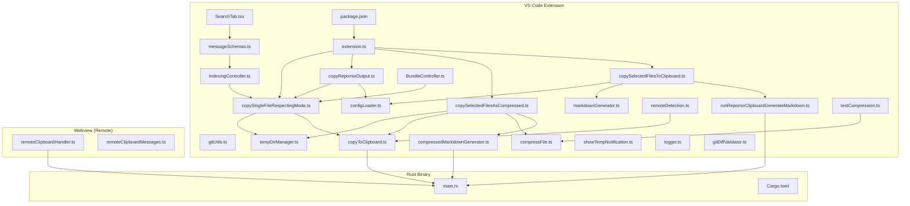

**Diagram sources**
- [copySelectedFilesToClipboard.ts](file://src/commands/copySelectedFilesToClipboard.ts#L1-L148)
- [copySelectedFilesAsCompressed.ts](file://src/commands/copySelectedFilesAsCompressed.ts#L1-L173)
- [copyRepomixOutput.ts](file://src/commands/copyRepomixOutput.ts#L1-L108)
- [copySingleFileRespectingMode.ts](file://src/commands/copySingleFileRespectingMode.ts#L1-L39)
- [gitUtils.ts](file://src/git/gitUtils.ts#L1-L122)
- [runRepomixClipboardGenerateMarkdown.ts](file://src/core/files/runRepomixClipboardGenerateMarkdown.ts#L1-L68)
- [markdownGenerator.ts](file://src/core/files/markdownGenerator.ts#L1-L147)
- [compressedMarkdownGenerator.ts](file://src/core/files/compressedMarkdownGenerator.ts#L1-L70)
- [compressFile.ts](file://src/core/compression/compressFile.ts#L1-L133)
- [copyToClipboard.ts](file://src/core/files/copyToClipboard.ts#L1-L160)
- [remoteDetection.ts](file://src/core/files/remoteDetection.ts#L1-L173)
- [tempDirManager.ts](file://src/core/files/tempDirManager.ts#L1-L68)
- [configLoader.ts](file://src/config/configLoader.ts#L1-L230)
- [extension.ts](file://src/extension.ts#L808-L813)
- [IndexingController.ts](file://src/webview/controllers/IndexingController.ts#L482-L511)
- [BundleController.ts](file://src/webview/controllers/BundleController.ts#L234-L248)
- [messageSchemas.ts](file://src/webview/messageSchemas.ts#L255-L258)
- [SearchTab.tsx](file://src/webview/components/SearchTab.tsx#L744-L747)
- [showTempNotification.ts](file://src/shared/showTempNotification.ts#L1-L61)
- [logger.ts](file://src/shared/logger.ts#L44-L94)
- [testCompression.ts](file://src/commands/testCompression.ts#L1-L38)
- [gitDiffValidator.ts](file://src/fingerprint/validation/gitDiffValidator.ts#L1-L208)
- [main.rs](file://rust/src/main.rs#L1-L249)
- [Cargo.toml](file://rust/Cargo.toml#L1-L12)
- [remoteClipboardHandler.ts](file://src/webview/handlers/remoteClipboardHandler.ts#L1-L190)
- [remoteClipboardMessages.ts](file://src/webview/types/remoteClipboardMessages.ts#L1-L52)
- [package.json](file://package.json#L1-L661)

**Section sources**
- [extension.ts](file://src/extension.ts#L808-L813)
- [copySelectedFilesToClipboard.ts](file://src/commands/copySelectedFilesToClipboard.ts#L1-L148)
- [copySelectedFilesAsCompressed.ts](file://src/commands/copySelectedFilesAsCompressed.ts#L1-L173)
- [copyRepomixOutput.ts](file://src/commands/copyRepomixOutput.ts#L1-L108)
- [copySingleFileRespectingMode.ts](file://src/commands/copySingleFileRespectingMode.ts#L1-L39)
- [gitUtils.ts](file://src/git/gitUtils.ts#L1-L122)
- [package.json](file://package.json#L1-L661)

## Core Components
- copySelectedFilesToClipboard: Orchestrates expansion of selected URIs (files and folders), workspace-relative path validation, markdown generation, and clipboard copy using either VS Code API or the Rust binary. Now delegates single file operations to the consolidated copySingleFileRespectingMode utility.
- **Enhanced**: copySelectedFilesAsCompressed: **Enhanced** command that generates compressed Markdown representations using AST-based compression for supported languages (TypeScript, JavaScript, Dart, Python, C#, Rust). Falls back to full content for unsupported languages and includes token counting with enhanced user feedback displaying token counts in success messages.
- copyRepomixOutput: Enhanced to use the consolidated copySingleFileRespectingMode utility, providing consistent mode handling and improved user feedback with mode differentiation.
- copySingleFileRespectingMode: Consolidated single file copy utility that provides unified clipboard operations respecting global copy mode settings, supporting both content and file modes with proper error handling and temporary file management.
- **Enhanced**: compressedMarkdownGenerator: **Enhanced** module that generates compressed markdown by concatenating files through AST compression, falling back to full content for unsupported languages with proper error handling and compression status tracking using compressed="true" attribute.
- compressFile: **New** core compression module that implements language-specific parsing using Tree-sitter parsers, chunk deduplication, and adjacent chunk merging for efficient content representation.
- runRepomixClipboardGenerateMarkdown: Streamlined to delegate single file operations to copySingleFileRespectingMode, reducing code duplication and improving consistency across markdown generation and clipboard operations.
- markdownGenerator: Reads files, skips binary content, and builds a Markdown document with token counting.
- copyToClipboard: Provides cross-platform file-mode clipboard operations, including Linux xclip checks, temporary file handling, and platform-specific commands.
- remoteClipboardHandler: Executes the Rust binary on remote machines to copy files to the Windows clipboard, managing temporary files and cleanup.
- remoteDetection: Detects remote environments and client OS/architecture for correct binary execution decisions.
- tempDirManager: Manages temporary directories and safe cleanup of temporary files.
- configLoader: Supplies the copy mode (content vs file) used by clipboard operations.
- gitUtils: Comprehensive Git repository interaction utilities including repository detection, change tracking, URI deduplication, and change counting for console feedback.
- gitDiffValidator: Advanced Git-based validation for blueprint freshness checking with critical path monitoring.

**Section sources**
- [copySelectedFilesToClipboard.ts](file://src/commands/copySelectedFilesToClipboard.ts#L67-L147)
- [copySelectedFilesAsCompressed.ts](file://src/commands/copySelectedFilesAsCompressed.ts#L58-L144)
- [copyRepomixOutput.ts](file://src/commands/copyRepomixOutput.ts#L18-L59)
- [copySingleFileRespectingMode.ts](file://src/commands/copySingleFileRespectingMode.ts#L12-L38)
- [compressedMarkdownGenerator.ts](file://src/core/files/compressedMarkdownGenerator.ts#L11-L58)
- [compressFile.ts](file://src/core/compression/compressFile.ts#L74-L132)
- [runRepomixClipboardGenerateMarkdown.ts](file://src/core/files/runRepomixClipboardGenerateMarkdown.ts#L29-L83)
- [markdownGenerator.ts](file://src/core/files/markdownGenerator.ts#L104-L146)
- [copyToClipboard.ts](file://src/core/files/copyToClipboard.ts#L52-L159)
- [remoteClipboardHandler.ts](file://src/webview/handlers/remoteClipboardHandler.ts#L10-L189)
- [remoteDetection.ts](file://src/core/files/remoteDetection.ts#L31-L108)
- [tempDirManager.ts](file://src/core/files/tempDirManager.ts#L9-L67)
- [configLoader.ts](file://src/config/configLoader.ts#L99-L103)
- [gitUtils.ts](file://src/git/gitUtils.ts#L88-L121)
- [gitDiffValidator.ts](file://src/fingerprint/validation/gitDiffValidator.ts#L40-L207)

## Architecture Overview
The clipboard system integrates three pathways with enhanced Git integration, improved console feedback, and enhanced user notification mechanisms, now centered around the consolidated copySingleFileRespectingMode utility and enhanced with compressed file copying capabilities:
- Local file-mode: Uses a Rust binary to copy files to the OS clipboard (Windows) or platform-specific commands (macOS/Linux).
- Local content-mode: Uses VS Code's clipboard API to copy concatenated Markdown text.
- Remote SSH: Webview executes the Rust binary on the client machine to place files on the Windows clipboard.
- Single file operations: Unified copy system that respects global copy mode settings with enhanced error handling and dynamic UI feedback.
- **Enhanced**: Compressed file copying: AST-based compression for supported languages with fallback to full content, providing reduced token count while preserving essential code structure, enhanced with compression status tracking and improved user feedback.
- Git repository integration: Automatic detection of staged, unstaged, and untracked changes with intelligent repository selection, change tracking, and detailed console feedback through getChangesCounts.

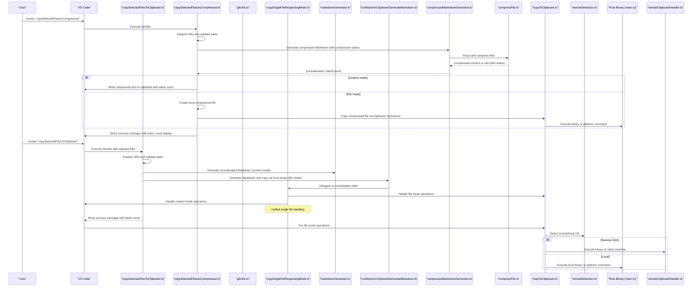

**Diagram sources**
- [copySelectedFilesToClipboard.ts](file://src/commands/copySelectedFilesToClipboard.ts#L119-L133)
- [copySelectedFilesAsCompressed.ts](file://src/commands/copySelectedFilesAsCompressed.ts#L109-L127)
- [copySingleFileRespectingMode.ts](file://src/commands/copySingleFileRespectingMode.ts#L12-L38)
- [gitUtils.ts](file://src/git/gitUtils.ts#L61-L106)
- [compressedMarkdownGenerator.ts](file://src/core/files/compressedMarkdownGenerator.ts#L11-L58)
- [compressFile.ts](file://src/core/compression/compressFile.ts#L74-L132)
- [markdownGenerator.ts](file://src/core/files/markdownGenerator.ts#L104-L146)
- [runRepomixClipboardGenerateMarkdown.ts](file://src/core/files/runRepomixClipboardGenerateMarkdown.ts#L29-L83)
- [copyToClipboard.ts](file://src/core/files/copyToClipboard.ts#L52-L159)
- [remoteDetection.ts](file://src/core/files/remoteDetection.ts#L31-L108)
- [main.rs](file://rust/src/main.rs#L10-L42)
- [remoteClipboardHandler.ts](file://src/webview/handlers/remoteClipboardHandler.ts#L22-L66)

## Detailed Component Analysis

### copySelectedFilesToClipboard
- Purpose: Copy selected files/folders to the clipboard as Markdown.
- Key steps:
  - Expand URIs to files (folders recursively), capped at 50 files.
  - Compute workspace-relative paths and filter out items outside the workspace.
  - Validate paths to prevent traversal or absolute paths.
  - Choose copy mode from configuration:
    - content: concatenate Markdown and write text to clipboard.
    - file: generate Markdown and copy via Rust binary (Windows) or VS Code API (Unix-like).
- Enhanced: Now delegates single file operations to copySingleFileRespectingMode for consistent behavior.
- Progress UI and notifications inform the user of progress and results.
- Error handling logs and shows user-friendly messages.

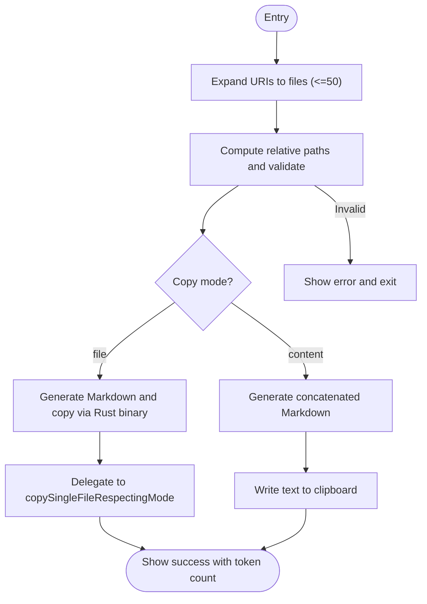

**Diagram sources**
- [copySelectedFilesToClipboard.ts](file://src/commands/copySelectedFilesToClipboard.ts#L67-L147)
- [markdownGenerator.ts](file://src/core/files/markdownGenerator.ts#L104-L146)
- [runRepomixClipboardGenerateMarkdown.ts](file://src/core/files/runRepomixClipboardGenerateMarkdown.ts#L29-L83)
- [copySingleFileRespectingMode.ts](file://src/commands/copySingleFileRespectingMode.ts#L12-L38)

**Section sources**
- [copySelectedFilesToClipboard.ts](file://src/commands/copySelectedFilesToClipboard.ts#L67-L147)
- [configLoader.ts](file://src/config/configLoader.ts#L99-L103)

### copySelectedFilesAsCompressed (Enhanced)
- Purpose: **Enhanced** command that copies selected files as compressed Markdown representations using AST-based compression for supported languages.
- Key features:
  - Expand URIs to files (folders recursively), capped at 50 files.
  - Compute workspace-relative paths and filter out items outside the workspace.
  - Validate paths to prevent traversal or absolute paths.
  - **Enhanced**: Generate compressed content regardless of copy mode setting using AST-based compression with enhanced compression status tracking.
  - **New**: Language-specific compression using Tree-sitter parsers for TypeScript, JavaScript, Dart, Python, C#, and Rust.
  - **New**: Chunk deduplication and adjacent chunk merging for efficient content representation.
  - **New**: Fallback to full content for unsupported languages with graceful degradation.
  - **Enhanced**: Token counting for compressed content with formatted display in success messages.
  - **Enhanced**: File mode handling creates temporary compressed files for clipboard operations with enhanced user feedback.
  - **Enhanced**: Compression status tracking using compressed="true" attribute in file entries.
  - **Enhanced**: Improved success messages displaying token count information for better user feedback.
- Progress UI and notifications inform the user of progress and results.
- Error handling logs and shows user-friendly messages.

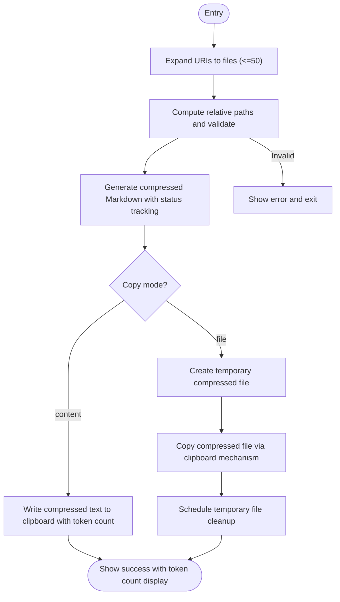

**Diagram sources**
- [copySelectedFilesAsCompressed.ts](file://src/commands/copySelectedFilesAsCompressed.ts#L58-L144)
- [compressedMarkdownGenerator.ts](file://src/core/files/compressedMarkdownGenerator.ts#L11-L58)
- [compressFile.ts](file://src/core/compression/compressFile.ts#L74-L132)
- [copySingleFileRespectingMode.ts](file://src/commands/copySingleFileRespectingMode.ts#L12-L38)

**Section sources**
- [copySelectedFilesAsCompressed.ts](file://src/commands/copySelectedFilesAsCompressed.ts#L58-L144)
- [compressedMarkdownGenerator.ts](file://src/core/files/compressedMarkdownGenerator.ts#L11-L58)
- [compressFile.ts](file://src/core/compression/compressFile.ts#L74-L132)

### copyRepomixOutput
- Purpose: Copy the last Repomix output file to the clipboard.
- Enhanced: Now uses the consolidated copySingleFileRespectingMode utility for consistent behavior.
- Resolution strategy:
  - Read repomix.config.json for output path and style, apply extension, resolve relative to workspace.
  - Fallback to common default filenames if config is missing or unreadable.
- Safety checks:
  - Verify workspace presence.
  - Verify file existence and non-empty content.
- Enhanced: Improved user feedback with mode differentiation showing "File Object" or "Text Content".
- Clipboard operation uses the unified copySingleFileRespectingMode utility.

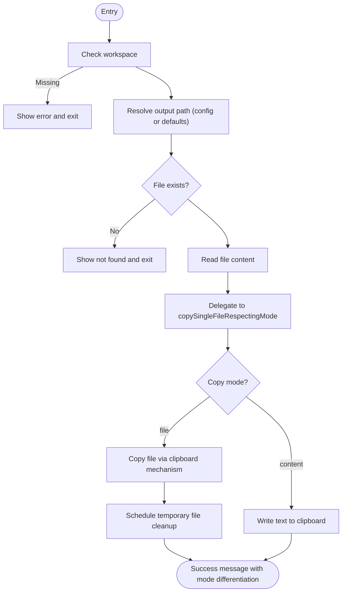

**Diagram sources**
- [copyRepomixOutput.ts](file://src/commands/copyRepomixOutput.ts#L18-L59)
- [copySingleFileRespectingMode.ts](file://src/commands/copySingleFileRespectingMode.ts#L12-L38)

**Section sources**
- [copyRepomixOutput.ts](file://src/commands/copyRepomixOutput.ts#L18-L108)

### copySingleFileRespectingMode (Consolidated Utility)
- Purpose: Consolidated single file copy functionality that respects the global copy mode setting across all clipboard operations.
- Enhanced: Provides unified clipboard operations with improved user feedback and mode differentiation.
- Key features:
  - Validates file existence before attempting copy operation.
  - Respects global copy mode setting (content vs file) from configuration.
  - Supports both content mode (direct text copy) and file mode (temporary file handling).
  - Returns copy mode for frontend feedback differentiation.
  - Integrates with temporary directory management for file mode operations.
  - Centralized error handling and consistent behavior across all clipboard operations.
- Error handling:
  - Throws descriptive errors for missing files.
  - Integrates with controller error handling for user feedback.
- Frontend integration:
  - Enables dynamic button label updates based on copy mode and operation status.
  - Provides specific feedback for single file operations.
  - Copy mode information is propagated to webview for UI updates.

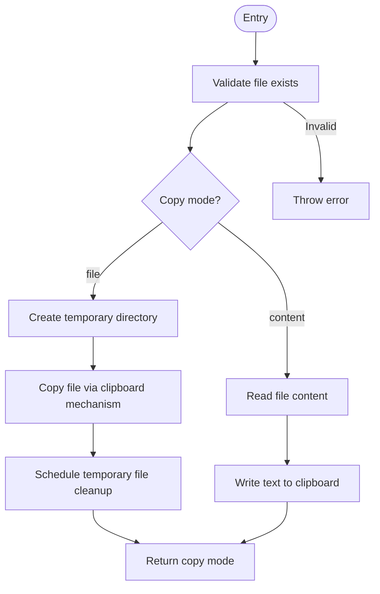

**Diagram sources**
- [copySingleFileRespectingMode.ts](file://src/commands/copySingleFileRespectingMode.ts#L12-L38)
- [copyToClipboard.ts](file://src/core/files/copyToClipboard.ts#L52-L159)
- [tempDirManager.ts](file://src/core/files/tempDirManager.ts#L17-L31)

**Section sources**
- [copySingleFileRespectingMode.ts](file://src/commands/copySingleFileRespectingMode.ts#L12-L38)
- [configLoader.ts](file://src/config/configLoader.ts#L99-L103)

### compressedMarkdownGenerator (Enhanced)
- Purpose: **Enhanced** module that generates compressed markdown by concatenating files through AST compression, falling back to full content for unsupported languages with enhanced compression status tracking.
- Key features:
  - Iterates through relative file paths and constructs entries for each file.
  - **Enhanced**: Checks for file existence and validates file type before processing.
  - **Enhanced**: Skips binary files using isBinaryFile detection.
  - **Enhanced**: Attempts AST-based compression using compressFile function for supported languages.
  - **Enhanced**: Falls back to full content if compression fails or language is unsupported.
  - **Enhanced**: Builds XML-like entries with file paths and compression status using compressed="true" attribute.
  - **Enhanced**: Calculates token count using GPT tokenizer for compressed content with enhanced error handling.
  - **Enhanced**: Provides graceful error handling with descriptive error messages.
- Error handling:
  - Throws descriptive errors for invalid file states.
  - Handles read errors gracefully with error placeholders.
- Token counting:
  - Uses GPT tokenizer to calculate token count for compressed content.

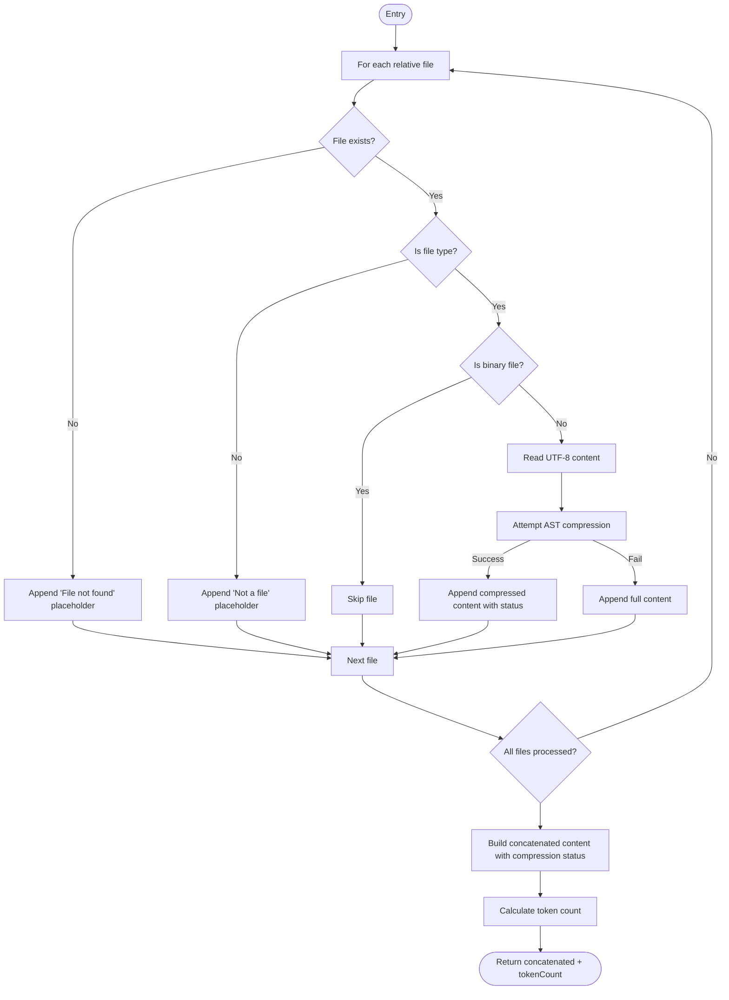

**Diagram sources**
- [compressedMarkdownGenerator.ts](file://src/core/files/compressedMarkdownGenerator.ts#L11-L58)

**Section sources**
- [compressedMarkdownGenerator.ts](file://src/core/files/compressedMarkdownGenerator.ts#L11-L58)

### compressFile (New)
- Purpose: **New** core compression module that implements language-specific parsing using Tree-sitter parsers for efficient content representation.
- Key features:
  - **New**: Language detection based on file extensions (TypeScript, JavaScript, Dart, Python, C#, Rust).
  - **New**: Tree-sitter parser integration for AST-based code analysis.
  - **New**: Query-based capture extraction for function, class, and other structural elements.
  - **New**: Chunk deduplication to remove repeated content blocks.
  - **New**: Adjacent chunk merging to combine nearby code segments.
  - **New**: Strategy-based parsing for language-specific content extraction.
  - **New**: Graceful fallback to null for unsupported languages or parsing failures.
  - **New**: Error handling with console logging for compression failures.
- Language support:
  - TypeScript/JavaScript: Function declarations, class definitions, variable declarations
  - Dart: Class definitions, function declarations, import statements
  - Python: Function definitions, class definitions, import statements
  - C#: Class definitions, method declarations, using directives
  - Rust: Function definitions, struct definitions, use statements
- Error handling:
  - Returns null for unsupported languages or parsing errors.
  - Logs compression failures for debugging.

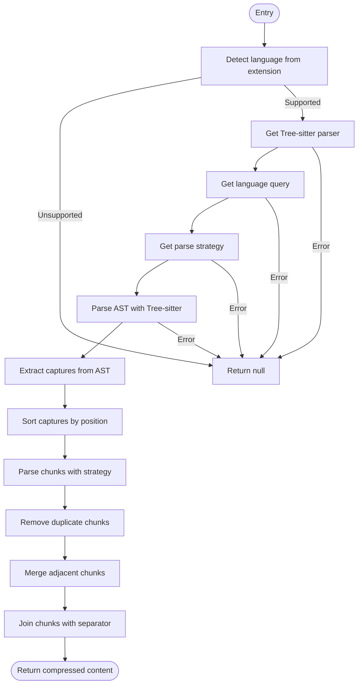

**Diagram sources**
- [compressFile.ts](file://src/core/compression/compressFile.ts#L74-L132)

**Section sources**
- [compressFile.ts](file://src/core/compression/compressFile.ts#L74-L132)

### runRepomixClipboardGenerateMarkdown (Streamlined)
- Purpose: Generate Markdown from selected files and copy to clipboard.
- Enhanced: Now delegates single file operations to copySingleFileRespectingMode for consistency.
- Cross-platform behavior:
  - Windows: Write Markdown to a temp file and invoke the Rust binary to place the file on the clipboard.
  - Unix-like/macOS: Use VS Code API to copy text directly.
- Enhanced: Simplified delegation to copySingleFileRespectingMode for single file operations.
- Token counting: Returned to caller for user feedback.

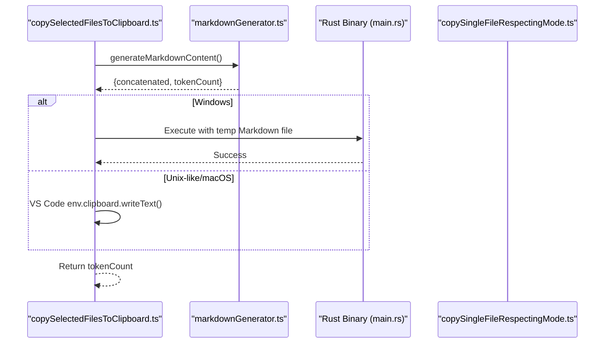

**Diagram sources**
- [runRepomixClipboardGenerateMarkdown.ts](file://src/core/files/runRepomixClipboardGenerateMarkdown.ts#L29-L83)
- [markdownGenerator.ts](file://src/core/files/markdownGenerator.ts#L104-L146)
- [main.rs](file://rust/src/main.rs#L49-L83)
- [copySingleFileRespectingMode.ts](file://src/commands/copySingleFileRespectingMode.ts#L12-L38)

**Section sources**
- [runRepomixClipboardGenerateMarkdown.ts](file://src/core/files/runRepomixClipboardGenerateMarkdown.ts#L29-L83)
- [markdownGenerator.ts](file://src/core/files/markdownGenerator.ts#L104-L146)

### copyToClipboard (Cross-Platform File Mode)
- Purpose: Copy files to the OS clipboard using platform-specific mechanisms.
- Modes:
  - content: read file content and write text to clipboard (instant).
  - file: copy file via external binary or OS command.
- Platform specifics:
  - Windows: Uses a bundled helper binary to place the file on the clipboard.
  - macOS: AppleScript to set Finder's clipboard to a POSIX file.
  - Linux: Requires xclip; writes a URI list to the clipboard.
- Remote handling:
  - Detects remote environment and client OS to decide whether to execute locally or remotely.
- Temporary file management:
  - Creates a temp directory if needed and copies the output file there before invoking the clipboard mechanism.

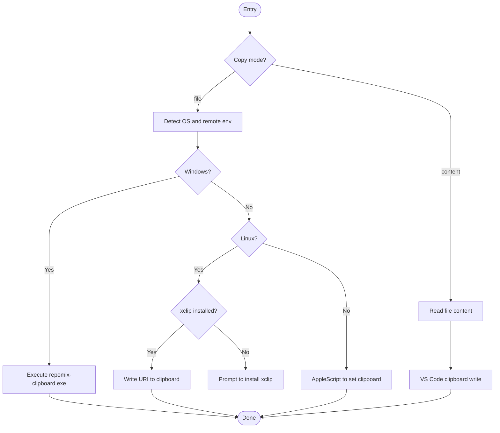

**Diagram sources**
- [copyToClipboard.ts](file://src/core/files/copyToClipboard.ts#L52-L159)
- [remoteDetection.ts](file://src/core/files/remoteDetection.ts#L31-L108)
- [tempDirManager.ts](file://src/core/files/tempDirManager.ts#L17-L31)

**Section sources**
- [copyToClipboard.ts](file://src/core/files/copyToClipboard.ts#L52-L159)
- [remoteDetection.ts](file://src/core/files/remoteDetection.ts#L31-L108)
- [tempDirManager.ts](file://src/core/files/tempDirManager.ts#L17-L31)

### Git Utilities
- Purpose: Provide comprehensive Git repository interaction capabilities for the clipboard system with enhanced change tracking.
- Key features:
  - getGitApi(): Safely access VS Code's Git extension API with version checking and activation.
  - getRepoForActiveEditor(): Find the appropriate repository for the currently active editor, falling back to the first repository if needed.
  - getAllChangedUris(): Collect all changed files including staged, unstaged, and untracked changes with deduplication.
  - Enhanced: getChangesCounts(): Provide detailed change counts for UI feedback (staged, unstaged, untracked) with console logging support.
- Implementation details:
  - Uses VS Code's built-in Git extension API (vscode.git).
  - Handles repository root detection and file URI mapping.
  - Ensures unique URI collection to avoid duplicates across change types.
  - Enhanced: Provides comprehensive change statistics for improved user feedback and debugging.
  - Enhanced: Supports detailed console logging for troubleshooting and user awareness.

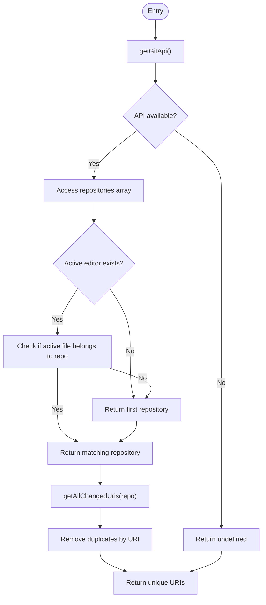

**Diagram sources**
- [gitUtils.ts](file://src/git/gitUtils.ts#L32-L106)
- [gitUtils.ts](file://src/git/gitUtils.ts#L115-L121)

**Section sources**
- [gitUtils.ts](file://src/git/gitUtils.ts#L32-L121)

### gitDiffValidator
- Purpose: Advanced Git-based validation for blueprint freshness checking with critical path monitoring.
- Key features:
  - Repository detection and commit validation.
  - Change tracking between stored and current commits.
  - Critical path pattern matching for important files.
  - Commit count calculation for UI feedback.
- Implementation details:
  - Uses child_process.execSync for Git operations.
  - Implements comprehensive error handling for non-Git directories.
  - Provides detailed validation results including changed files and commit counts.
  - Filters critical changes based on predefined patterns.

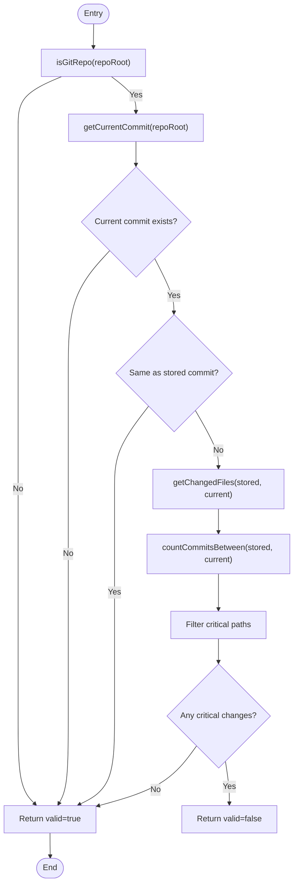

**Diagram sources**
- [gitDiffValidator.ts](file://src/fingerprint/validation/gitDiffValidator.ts#L143-L198)

**Section sources**
- [gitDiffValidator.ts](file://src/fingerprint/validation/gitDiffValidator.ts#L40-L207)

### Remote Clipboard Support
- Webview handler:
  - Receives base64-encoded files and writes them to a session-scoped temp directory.
  - Locates the Rust binary and executes it with flags to generate Markdown or copy files.
  - Returns completion status and optionally temp directory path for cleanup.
- Messages:
  - ProcessRemoteFilesMessage: instructs processing with files and copy mode.
  - RemoteClipboardProcessingResult: reports success/error and failure stage.
  - ProcessingStatusMessage: provides progress/status updates.

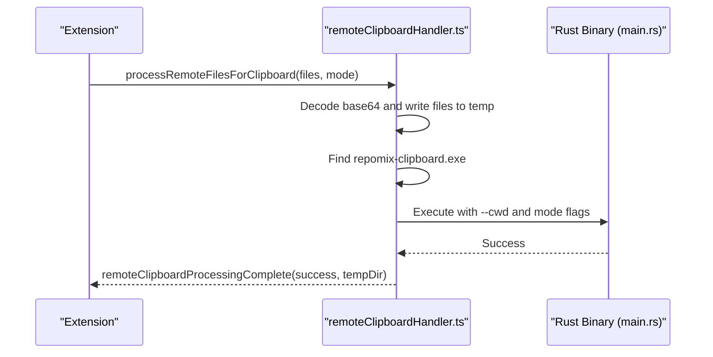

**Diagram sources**
- [remoteClipboardHandler.ts](file://src/webview/handlers/remoteClipboardHandler.ts#L22-L66)
- [remoteClipboardMessages.ts](file://src/webview/types/remoteClipboardMessages.ts#L5-L40)
- [main.rs](file://rust/src/main.rs#L10-L42)

**Section sources**
- [remoteClipboardHandler.ts](file://src/webview/handlers/remoteClipboardHandler.ts#L10-L189)
- [remoteClipboardMessages.ts](file://src/webview/types/remoteClipboardMessages.ts#L1-L52)

### Markdown Generation and Token Counting
- Skips binary files based on extension and known basenames.
- Reads text files safely and concatenates them into a Markdown document.
- Counts tokens using a tokenizer to inform users about content size.

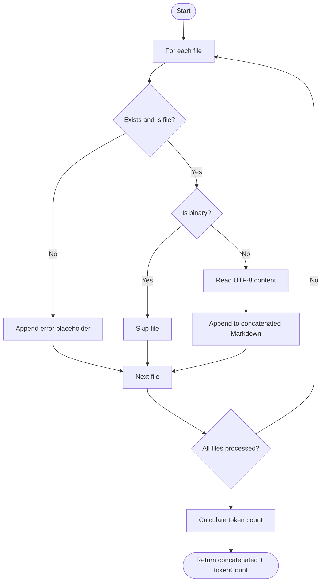

**Diagram sources**
- [markdownGenerator.ts](file://src/core/files/markdownGenerator.ts#L104-L146)

**Section sources**
- [markdownGenerator.ts](file://src/core/files/markdownGenerator.ts#L77-L99)
- [markdownGenerator.ts](file://src/core/files/markdownGenerator.ts#L104-L146)

### Enhanced User Feedback and Notification Systems
- **Enhanced**: Compressed content generation now includes compression status tracking using compressed="true" attribute in file entries, providing clear indication of which files were successfully compressed.
- **Enhanced**: Success messages now display formatted token count information, making it easier for users to understand the size impact of compression.
- **Enhanced**: Improved copy operation feedback with dynamic button labels and temporary status indicators for better user experience.
- **Enhanced**: Token counting notifications provide immediate feedback on content size reduction achieved through compression.
- **Enhanced**: Logger system provides comprehensive logging with emoji prefixes for better debugging and user awareness.
- **Enhanced**: ShowTempNotification utility provides consistent progress indication with customizable duration and cancellation support.

**Section sources**
- [compressedMarkdownGenerator.ts](file://src/core/files/compressedMarkdownGenerator.ts#L40-L44)
- [copySelectedFilesAsCompressed.ts](file://src/commands/copySelectedFilesAsCompressed.ts#L129-L138)
- [logger.ts](file://src/shared/logger.ts#L44-L94)
- [showTempNotification.ts](file://src/shared/showTempNotification.ts#L1-L61)

### Enhanced Webview Components and Dynamic Button Labels
- Dynamic Button Labels: The SearchTab component now features dynamic button labels that change based on copy mode and operation status:
  - Main copy button: "Copy Text" or "Copy File" depending on global copy mode
  - Summary copy button: "Copy Summary Text" or "Copy Summary File" based on copy mode
  - **Enhanced**: Compressed copy button: "Copy as Compressed" with success/failure feedback and token count display
  - Copy as Markdown button: "Copy as Markdown" with success/failure feedback
- Operation Feedback: Buttons temporarily display "Copied!" or "Copy Failed" status for 2-3 seconds after operations
- File Path Tracking: The system tracks which specific file was copied to provide targeted feedback
- Unified Copy System: Integration with the consolidated copySingleFileRespectingMode command enables consistent behavior across different copy operations
- **Enhanced**: Copy mode propagation: Controllers receive copy mode information to update UI state appropriately
- **Enhanced**: Token count display: Success messages now show formatted token count for better user understanding

**Section sources**
- [SearchTab.tsx](file://src/webview/components/SearchTab.tsx#L214-L219)
- [SearchTab.tsx](file://src/webview/components/SearchTab.tsx#L615-L662)
- [SearchTab.tsx](file://src/webview/components/SearchTab.tsx#L691-L695)

### Controller Architecture Updates
- IndexingController Integration: The IndexingController now handles copySingleFileRespectingMode operations with enhanced error handling and copy mode propagation.
- BundleController Integration: Enhanced to use copySingleFileRespectingMode directly for consistent behavior across bundle operations.
- Message Schema Support: New CopySingleFileRespectingModeSchema enables structured communication between webview and extension with copy mode information.
- Copy Mode Propagation: Controllers receive copy mode information to update UI state appropriately.
- Error Handling Improvements: Specific error messages for single file operations with user-friendly feedback.

**Section sources**
- [IndexingController.ts](file://src/webview/controllers/IndexingController.ts#L482-L511)
- [BundleController.ts](file://src/webview/controllers/BundleController.ts#L234-L248)
- [messageSchemas.ts](file://src/webview/messageSchemas.ts#L255-L258)

### Package.json Configuration Updates
- Version Bump: Updated to version 1.0.22 for proper release management
- **Enhanced**: Activation event for copySelectedFilesAsCompressed command
- SCM Menu Integration: Enhanced SCM context menu support with proper Git repository integration
- Command Registration: Proper activation events and command palette integration
- Menu Configuration: Dedicated SCM title menu entry for copyAllGitChanges command
- Context Menu Support: Git repository state context menu integration for selective file operations

**Section sources**
- [package.json](file://package.json#L20-L32)
- [package.json](file://package.json#L26)
- [package.json](file://package.json#L339)
- [package.json](file://package.json#L521)

## Dependency Analysis
- Commands depend on configuration for copy mode and on markdown generation utilities.
- **Enhanced**: Compressed file copying depends on AST-based compression modules and language-specific parsers with enhanced compression status tracking.
- File-mode clipboard operations depend on remote detection and temporary directory management.
- Enhanced: Single file operations integrate with the consolidated copySingleFileRespectingMode utility and webview message schemas.
- Git integration depends on VS Code's Git extension API and integrates with existing clipboard infrastructure with improved change tracking and console feedback.
- Rust binary is invoked conditionally based on platform and mode.
- Remote clipboard support relies on webview IPC messages and a dedicated handler.
- Webview components depend on message schemas for type-safe communication.
- Package.json configuration provides proper SCM menu integration and version management.
- **Enhanced**: Logger and notification systems provide comprehensive user feedback and debugging capabilities.

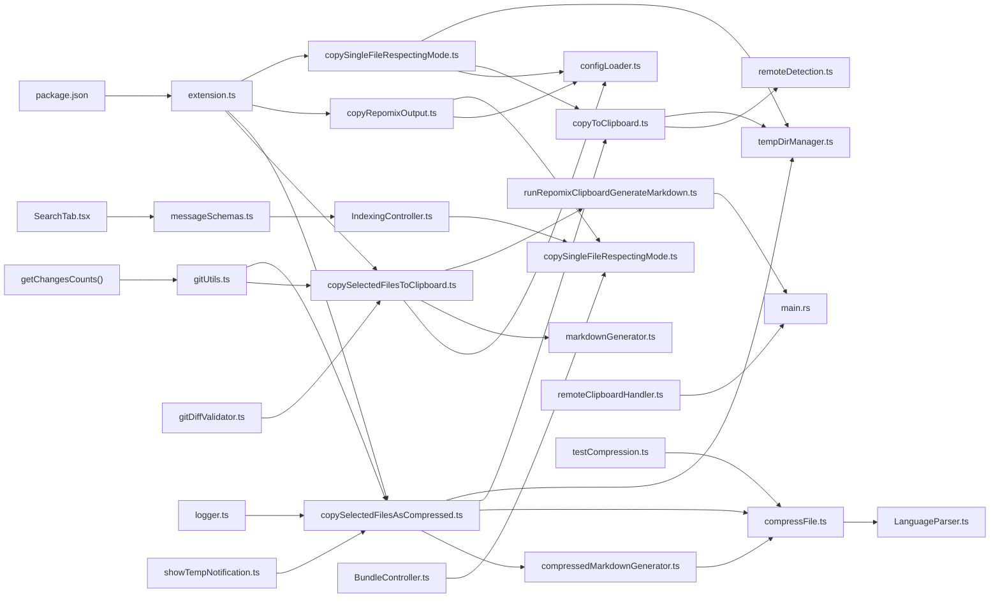

**Diagram sources**
- [copySelectedFilesToClipboard.ts](file://src/commands/copySelectedFilesToClipboard.ts#L1-L148)
- [copySelectedFilesAsCompressed.ts](file://src/commands/copySelectedFilesAsCompressed.ts#L1-L173)
- [copyRepomixOutput.ts](file://src/commands/copyRepomixOutput.ts#L1-L108)
- [copySingleFileRespectingMode.ts](file://src/commands/copySingleFileRespectingMode.ts#L1-L39)
- [gitUtils.ts](file://src/git/gitUtils.ts#L1-L122)
- [configLoader.ts](file://src/config/configLoader.ts#L99-L103)
- [markdownGenerator.ts](file://src/core/files/markdownGenerator.ts#L104-L146)
- [compressedMarkdownGenerator.ts](file://src/core/files/compressedMarkdownGenerator.ts#L11-L58)
- [compressFile.ts](file://src/core/compression/compressFile.ts#L74-L132)
- [runRepomixClipboardGenerateMarkdown.ts](file://src/core/files/runRepomixClipboardGenerateMarkdown.ts#L29-L83)
- [copyToClipboard.ts](file://src/core/files/copyToClipboard.ts#L52-L159)
- [remoteDetection.ts](file://src/core/files/remoteDetection.ts#L31-L108)
- [tempDirManager.ts](file://src/core/files/tempDirManager.ts#L17-L31)
- [remoteClipboardHandler.ts](file://src/webview/handlers/remoteClipboardHandler.ts#L10-L189)
- [messageSchemas.ts](file://src/webview/messageSchemas.ts#L255-L258)
- [IndexingController.ts](file://src/webview/controllers/IndexingController.ts#L482-L511)
- [BundleController.ts](file://src/webview/controllers/BundleController.ts#L234-L248)
- [SearchTab.tsx](file://src/webview/components/SearchTab.tsx#L744-L747)
- [extension.ts](file://src/extension.ts#L808-L813)
- [gitDiffValidator.ts](file://src/fingerprint/validation/gitDiffValidator.ts#L1-L208)
- [main.rs](file://rust/src/main.rs#L1-L249)
- [package.json](file://package.json#L1-L661)
- [logger.ts](file://src/shared/logger.ts#L44-L94)
- [showTempNotification.ts](file://src/shared/showTempNotification.ts#L1-L61)
- [testCompression.ts](file://src/commands/testCompression.ts#L1-L38)

**Section sources**
- [extension.ts](file://src/extension.ts#L808-L813)
- [copySelectedFilesToClipboard.ts](file://src/commands/copySelectedFilesToClipboard.ts#L1-L148)
- [copySelectedFilesAsCompressed.ts](file://src/commands/copySelectedFilesAsCompressed.ts#L1-L173)
- [copyRepomixOutput.ts](file://src/commands/copyRepomixOutput.ts#L1-L108)
- [copySingleFileRespectingMode.ts](file://src/commands/copySingleFileRespectingMode.ts#L1-L39)
- [gitUtils.ts](file://src/git/gitUtils.ts#L1-L122)
- [copyToClipboard.ts](file://src/core/files/copyToClipboard.ts#L1-L160)
- [package.json](file://package.json#L1-L661)

## Performance Considerations
- File expansion limit: The selected file expansion caps at 50 files to avoid heavy operations.
- Token counting: Done after concatenation; consider caching or batching for very large selections.
- Remote execution: Webview binary execution adds latency; timeouts and async cleanup mitigate blocking.
- Linux clipboard dependency: xclip availability affects performance; prompt users to install if missing.
- Temporary files: Managed with safe cleanup timers to avoid disk accumulation.
- **Enhanced**: Single file operations: Direct file copying bypasses markdown generation overhead for large files through the consolidated utility.
- Dynamic UI updates: Button label changes are optimized to minimize re-rendering overhead.
- **Enhanced**: Compressed file copying: AST-based compression adds processing overhead but significantly reduces token count for AI processing with enhanced compression status tracking.
- **Enhanced**: Language-specific parsing: Tree-sitter parsers provide efficient AST analysis but require language detection and parser initialization.
- **Enhanced**: Chunk deduplication and merging: Additional processing steps improve content quality but add computational cost.
- **Enhanced**: Git repository operations: Repository detection and change tracking are lightweight but may add slight delay for large repositories.
- **Enhanced**: Change deduplication: getAllChangedUris() performs URI deduplication to avoid processing the same file multiple times.
- **Enhanced**: Console logging: getChangesCounts() provides detailed feedback without significant performance impact.
- **Enhanced**: Package.json optimization: Proper SCM menu integration reduces command discovery overhead.
- **Enhanced**: Consolidated utility: Reduced code duplication and improved performance through centralized clipboard operations.
- **Enhanced**: User feedback systems: Logger and notification systems provide real-time feedback without significant performance impact.

## Security Considerations
- Path validation: Workspace-relative paths are validated to prevent traversal and absolute paths.
- Binary safety: Rust binary validates file existence and type before placing on clipboard.
- Remote execution: Webview executes the binary on the client machine; ensure trust boundaries and sandbox constraints.
- Clipboard content: Large content may expose sensitive data; consider user warnings and opt-in modes.
- File validation: Single file operations include explicit file existence checks before processing.
- Copy mode enforcement: Global copy mode settings prevent unauthorized content extraction methods.
- **Enhanced**: Compressed content validation: AST-based compression validates file types and language support before processing with compression status tracking.
- **Enhanced**: Language-specific parsing: Tree-sitter parsers provide controlled code analysis with proper error handling.
- **Enhanced**: Binary file detection: isBinaryFile function prevents processing of binary content in compressed mode.
- **Enhanced**: Graceful fallbacks: Unsupported languages and compression failures fall back to full content without security risks.
- **Enhanced**: Git repository access: Uses VS Code's built-in Git extension API with proper error handling and fallback mechanisms.
- **Enhanced**: Change validation: Git operations are performed through secure child process execution with proper error handling.
- **Enhanced**: Console feedback: Detailed change counts provide transparency without exposing sensitive repository information.
- **Enhanced**: Consolidated security: Single point of validation and error handling reduces security vulnerabilities.
- **Enhanced**: User feedback security: Token count display and compression status tracking provide transparency without exposing sensitive content details.

**Section sources**
- [copySelectedFilesToClipboard.ts](file://src/commands/copySelectedFilesToClipboard.ts#L109-L113)
- [copySelectedFilesAsCompressed.ts](file://src/commands/copySelectedFilesAsCompressed.ts#L101-L104)
- [copySingleFileRespectingMode.ts](file://src/commands/copySingleFileRespectingMode.ts#L13-L15)
- [compressedMarkdownGenerator.ts](file://src/core/files/compressedMarkdownGenerator.ts#L31-L34)
- [compressFile.ts](file://src/core/compression/compressFile.ts#L79-L82)
- [gitUtils.ts](file://src/git/gitUtils.ts#L32-L51)
- [main.rs](file://rust/src/main.rs#L223-L248)

## Troubleshooting Guide
- Linux xclip missing: The operation requires xclip; install it and retry.
- Remote SSH limitations: Local binary execution in webview is disabled due to sandbox constraints; rely on remote npx approach.
- Empty or missing output file: Ensure Repomix has generated the output file and that the path is correct.
- Invalid paths: Selected items must be within the workspace and not contain traversal sequences.
- Binary not found: Confirm the presence of the Rust binary in expected locations.
- **Enhanced**: Single file copy failures: Check file permissions and existence before attempting copy operations using the consolidated utility.
- Copy mode issues: Verify global copy mode settings are properly configured in extension settings.
- Webview message validation: Ensure message schemas match between webview and extension for proper communication.
- **Enhanced**: Git extension not available: VS Code's Git extension must be installed and activated for Git integration features.
- **Enhanced**: No repository detected: Ensure the active file belongs to a Git repository or that a repository is open in VS Code.
- **Enhanced**: No changes detected: The Git repository may not have any staged, unstaged, or untracked changes.
- **Enhanced**: Console feedback issues: getChangesCounts() provides detailed change statistics for debugging repository state.
- **Enhanced**: SCM menu integration: Ensure Git SCM provider is active for proper context menu visibility.
- **Enhanced**: Consolidated utility issues: Check copySingleFileRespectingMode for proper mode handling and error propagation.
- **Enhanced**: Compressed content issues: Verify language support for AST-based compression; unsupported languages fall back to full content with compression status tracking.
- **Enhanced**: Compression failures: Check Tree-sitter parser availability and language detection for compressed file operations.
- **Enhanced**: Token counting errors: Verify GPT tokenizer availability and proper encoding for compressed content.
- **Enhanced**: User feedback issues: Logger and notification systems provide comprehensive feedback for debugging.
- **Enhanced**: Compression status tracking: Verify compressed="true" attribute is properly applied to compressed file entries.

**Section sources**
- [copyToClipboard.ts](file://src/core/files/copyToClipboard.ts#L109-L118)
- [remoteDetection.ts](file://src/core/files/remoteDetection.ts#L79-L94)
- [copyRepomixOutput.ts](file://src/commands/copyRepomixOutput.ts#L32-L40)
- [copySelectedFilesToClipboard.ts](file://src/commands/copySelectedFilesToClipboard.ts#L109-L113)
- [copySelectedFilesAsCompressed.ts](file://src/commands/copySelectedFilesAsCompressed.ts#L101-L104)
- [copySingleFileRespectingMode.ts](file://src/commands/copySingleFileRespectingMode.ts#L13-L15)
- [compressedMarkdownGenerator.ts](file://src/core/files/compressedMarkdownGenerator.ts#L50-L52)
- [compressFile.ts](file://src/core/compression/compressFile.ts#L128-L131)
- [remoteClipboardHandler.ts](file://src/webview/handlers/remoteClipboardHandler.ts#L107-L132)
- [messageSchemas.ts](file://src/webview/messageSchemas.ts#L255-L258)
- [gitUtils.ts](file://src/git/gitUtils.ts#L32-L51)
- [package.json](file://package.json#L26)
- [package.json](file://package.json#L339)
- [package.json](file://package.json#L521)
- [logger.ts](file://src/shared/logger.ts#L44-L94)
- [showTempNotification.ts](file://src/shared/showTempNotification.ts#L1-L61)

## Conclusion
The clipboard system provides flexible, cross-platform copying of file content and Markdown summaries. It supports both local and remote environments, integrates a Rust-based binary for robust file clipboard operations on Windows, and offers safe temporary file management. The consolidation of clipboard functionality into the copySingleFileRespectingMode utility significantly enhances the system with configurable single file operations that respect global copy mode settings.

**Enhanced Compressed File Copying Features** represent a major advancement in the clipboard system, introducing AST-based compression capabilities for supported programming languages with enhanced compression status tracking. The copySelectedFilesAsCompressed command provides users with a choice between full content and compressed representations, significantly reducing token count for AI processing while preserving essential code structure. The compressed content generation utilizes Tree-sitter parsers for efficient AST analysis, with intelligent chunk deduplication and adjacent merging for optimal content representation.

**Enhanced Compression Status Tracking** provides clear indication of which files were successfully compressed through the compressed="true" attribute in file entries, enabling users to understand the compression effectiveness. **Improved Token Counting Notifications** display formatted token count information in success messages, making it easier for users to understand the size impact of compression. **Better User Feedback Mechanisms** include enhanced copy operation feedback with dynamic button labels and temporary status indicators for a superior user experience.

The system now includes comprehensive language support including TypeScript, JavaScript, Dart, Python, C#, and Rust, with graceful fallback mechanisms for unsupported languages. Enhanced webview components provide dynamic button labels and improved error handling, creating a more intuitive user experience. The unified copy system ensures consistent behavior across different copy operations while maintaining security and performance standards.

The Git integration maintains backward compatibility while extending functionality for modern development workflows that heavily utilize version control systems. The new compressed copying feature complements existing clipboard operations by providing specialized content reduction capabilities for AI-assisted development scenarios with enhanced user feedback and transparency. Enhanced package.json configuration provides proper activation events and menu integration for the new compressed copying functionality.

**Updated** Version 1.0.22 introduces enhanced compressed file copying capabilities with compression status tracking, improved token counting notifications, better user feedback mechanisms, and consolidated clipboard operations for a more professional development experience with reduced code duplication and improved maintainability.