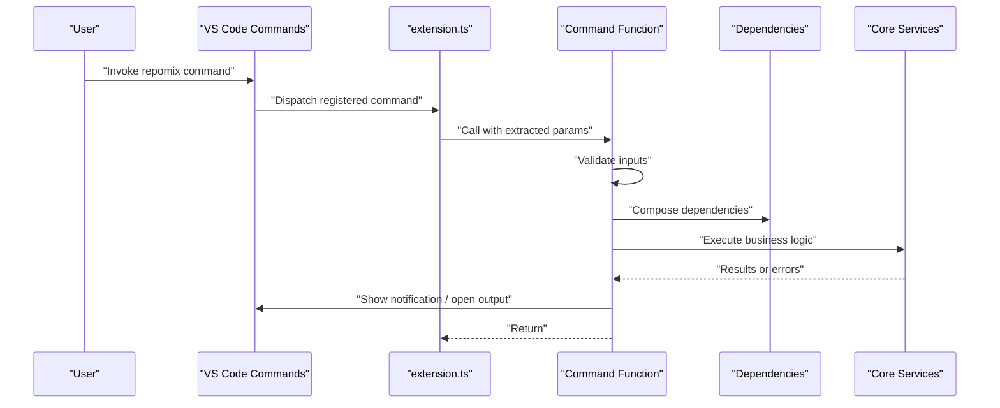
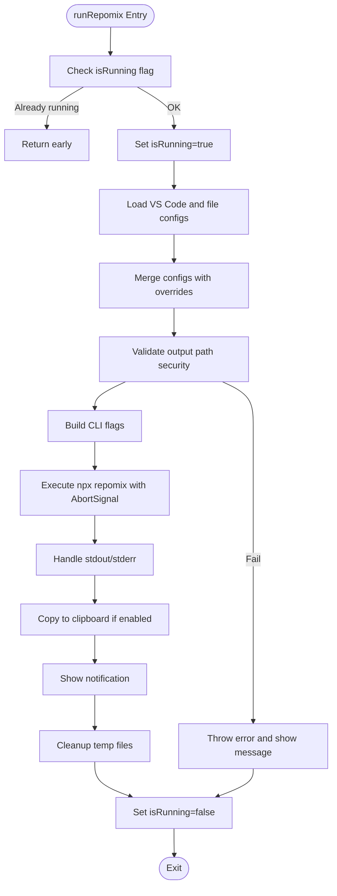
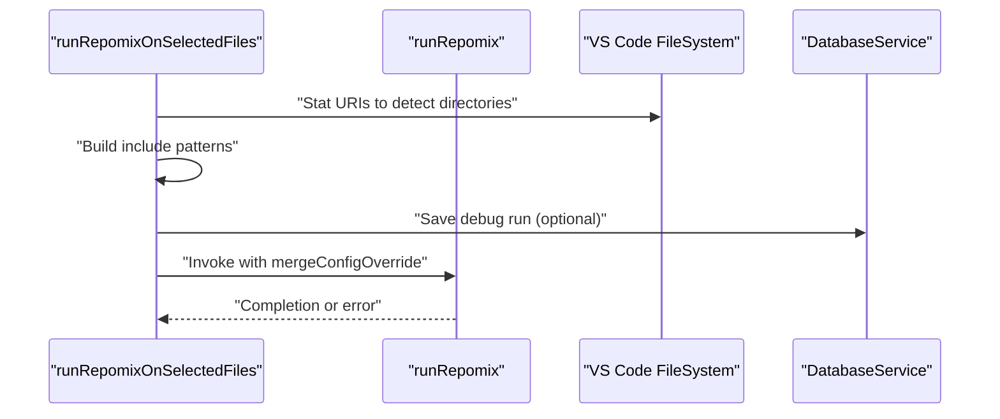
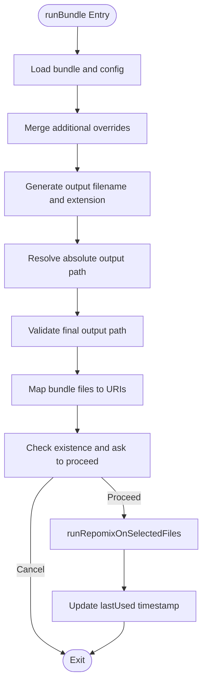
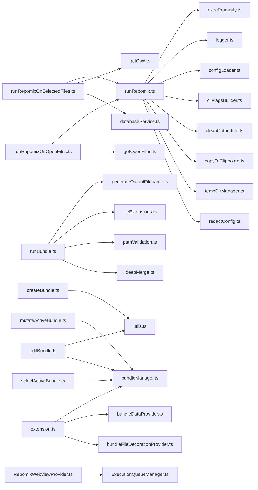

# Command Handlers

<cite>
**Referenced Files in This Document**
- [extension.ts](file://src/extension.ts)
- [runRepomix.ts](file://src/commands/runRepomix.ts)
- [runBundle.ts](file://src/commands/runBundle.ts)
- [runRepomixOnSelectedFiles.ts](file://src/commands/runRepomixOnSelectedFiles.ts)
- [runRepomixOnOpenFiles.ts](file://src/commands/runRepomixOnOpenFiles.ts)
- [createBundle.ts](file://src/commands/createBundle.ts)
- [mutateActiveBundle.ts](file://src/commands/mutateActiveBundle.ts)
- [selectActiveBundle.ts](file://src/commands/selectActiveBundle.ts)
- [editBundle.ts](file://src/commands/editBundle.ts)
- [utils.ts](file://src/commands/utils.ts)
- [openSettings.ts](file://src/commands/openSettings.ts)
- [showTempNotification.ts](file://src/shared/showTempNotification.ts)
- [execPromisify.ts](file://src/shared/execPromisify.ts)
- [bundleManager.ts](file://src/core/bundles/bundleManager.ts)
- [bundleDataProvider.ts](file://src/core/bundles/bundleDataProvider.ts)
- [bundleFileDecorationProvider.ts](file://src/core/bundles/bundleFileDecorationProvider.ts)
- [RepomixWebviewProvider.ts](file://src/webview/RepomixWebviewProvider.ts)
- [ExecutionQueueManager.ts](file://src/webview/services/ExecutionQueueManager.ts)
- [logger.ts](file://src/shared/logger.ts)
- [redactConfig.ts](file://src/utils/redactConfig.ts)
- [pathValidation.ts](file://src/utils/pathValidation.ts)
- [generateOutputFilename.ts](file://src/utils/generateOutputFilename.ts)
- [fileExtensions.ts](file://src/utils/fileExtensions.ts)
- [deepMerge.ts](file://src/utils/deepMerge.ts)
- [getCwd.ts](file://src/config/getCwd.ts)
- [getOpenFiles.ts](file://src/config/getOpenFiles.ts)
- [configLoader.ts](file://src/config/configLoader.ts)
- [cliFlagsBuilder.ts](file://src/core/cli/cliFlagsBuilder.ts)
- [cleanOutputFile.ts](file://src/core/files/cleanOutputFile.ts)
- [copyToClipboard.ts](file://src/core/files/copyToClipboard.ts)
- [tempDirManager.ts](file://src/core/files/tempDirManager.ts)
- [databaseService.ts](file://src/core/storage/databaseService.ts)
- [smartRunCommand](file://src/extension.ts)
- [regenerateAgentRunCommand](file://src/extension.ts)
- [architecture.md](file://architecture.md)
</cite>

## Table of Contents
1. [Introduction](#introduction)
2. [Project Structure](#project-structure)
3. [Core Components](#core-components)
4. [Architecture Overview](#architecture-overview)
5. [Detailed Component Analysis](#detailed-component-analysis)
6. [Dependency Analysis](#dependency-analysis)
7. [Performance Considerations](#performance-considerations)
8. [Troubleshooting Guide](#troubleshooting-guide)
9. [Conclusion](#conclusion)
10. [Appendices](#appendices)

## Introduction
This document explains the Command Handlers implementation used throughout the extension. The system follows a pure function-based command pattern: each command is a small, composable function that extracts parameters from VS Code contexts, validates inputs, orchestrates core services, and reports outcomes to the user. Commands are registered in the extension activation lifecycle and often delegate to specialized handlers or services for execution. The document covers handler architecture, parameter extraction, execution flow, error handling, user feedback, progress reporting, command chaining, conditional execution, dynamic generation, validation, sanitization, security, and dependency injection patterns.

## Project Structure
The command handlers live under src/commands and are wired into the extension via src/extension.ts. Supporting utilities and services reside in src/shared, src/utils, src/config, src/core, and src/webview.

```mermaid
graph TB
subgraph "Extension Entry"
EXT["extension.ts"]
end
subgraph "Commands"
RUNRM["runRepomix.ts"]
RUNSEL["runRepomixOnSelectedFiles.ts"]
RUNOPEN["runRepomixOnOpenFiles.ts"]
RUNBND["runBundle.ts"]
CREATBND["createBundle.ts"]
MUTBND["mutateActiveBundle.ts"]
SELBND["selectActiveBundle.ts"]
EDITBND["editBundle.ts"]
OPENSET["openSettings.ts"]
UTILS["utils.ts"]
end
subgraph "Shared Utilities"
NOTIF["showTempNotification.ts"]
EXEC["execPromisify.ts"]
LOG["logger.ts"]
REDACT["redactConfig.ts"]
PATHVAL["pathValidation.ts"]
GENNAME["generateOutputFilename.ts"]
FEXT["fileExtensions.ts"]
DMERGE["deepMerge.ts"]
GETCWD["getCwd.ts"]
GETOPEN["getOpenFiles.ts"]
CFGLOAD["configLoader.ts"]
CLIFLAGS["cliFlagsBuilder.ts"]
CLEANOUT["cleanOutputFile.ts"]
COPYCLIP["copyToClipboard.ts"]
TEMPDIR["tempDirManager.ts"]
end
subgraph "Core Services"
BMAN["bundleManager.ts"]
BDATAP["bundleDataProvider.ts"]
BDECOR["bundleFileDecorationProvider.ts"]
DB["databaseService.ts"]
end
subgraph "Webview"
RPVP["RepomixWebviewProvider.ts"]
EQM["ExecutionQueueManager.ts"]
end
EXT --> RUNRM
EXT --> RUNSEL
EXT --> RUNOPEN
EXT --> RUNBND
EXT --> CREATBND
EXT --> MUTBND
EXT --> SELBND
EXT --> EDITBND
EXT --> OPENSET
RUNRM --> EXEC
RUNRM --> LOG
RUNRM --> CFGLOAD
RUNRM --> CLIFLAGS
RUNRM --> CLEANOUT
RUNRM --> COPYCLIP
RUNRM --> TEMPDIR
RUNRM --> REDACT
RUNSEL --> RUNRM
RUNSEL --> GETCWD
RUNSEL --> DB
RUNOPEN --> RUNRM
RUNOPEN --> GETOPEN
RUNOPEN --> GETCWD
RUNBND --> GETCWD
RUNBND --> RUNSEL
RUNBND --> PATHVAL
RUNBND --> GENNAME
RUNBND --> FEXT
RUNBND --> DMERGE
CREATBND --> UTILS
CREATBND --> BMAN
MUTBND --> BMAN
SELBND --> BMAN
EDITBND --> UTILS
EDITBND --> BMAN
EXT --> BMAN
EXT --> BDATAP
EXT --> BDECOR
EXT --> RPVP
RPVP --> EQM
EXT --> DB
```

**Diagram sources**
- [extension.ts](file://src/extension.ts#L43-L781)
- [runRepomix.ts](file://src/commands/runRepomix.ts#L1-L173)
- [runRepomixOnSelectedFiles.ts](file://src/commands/runRepomixOnSelectedFiles.ts#L1-L101)
- [runRepomixOnOpenFiles.ts](file://src/commands/runRepomixOnOpenFiles.ts#L1-L29)
- [runBundle.ts](file://src/commands/runBundle.ts#L1-L156)
- [createBundle.ts](file://src/commands/createBundle.ts#L1-L32)
- [mutateActiveBundle.ts](file://src/commands/mutateActiveBundle.ts#L1-L348)
- [selectActiveBundle.ts](file://src/commands/selectActiveBundle.ts#L1-L55)
- [editBundle.ts](file://src/commands/editBundle.ts#L1-L49)
- [utils.ts](file://src/commands/utils.ts#L1-L148)
- [showTempNotification.ts](file://src/shared/showTempNotification.ts#L1-L62)
- [execPromisify.ts](file://src/shared/execPromisify.ts#L1-L4)
- [bundleManager.ts](file://src/core/bundles/bundleManager.ts)
- [bundleDataProvider.ts](file://src/core/bundles/bundleDataProvider.ts)
- [bundleFileDecorationProvider.ts](file://src/core/bundles/bundleFileDecorationProvider.ts)
- [RepomixWebviewProvider.ts](file://src/webview/RepomixWebviewProvider.ts#L62-L91)
- [ExecutionQueueManager.ts](file://src/webview/services/ExecutionQueueManager.ts#L39-L82)
- [logger.ts](file://src/shared/logger.ts#L1-L42)
- [redactConfig.ts](file://src/utils/redactConfig.ts)
- [pathValidation.ts](file://src/utils/pathValidation.ts)
- [generateOutputFilename.ts](file://src/utils/generateOutputFilename.ts)
- [fileExtensions.ts](file://src/utils/fileExtensions.ts)
- [deepMerge.ts](file://src/utils/deepMerge.ts)
- [getCwd.ts](file://src/config/getCwd.ts)
- [getOpenFiles.ts](file://src/config/getOpenFiles.ts)
- [configLoader.ts](file://src/config/configLoader.ts)
- [cliFlagsBuilder.ts](file://src/core/cli/cliFlagsBuilder.ts)
- [cleanOutputFile.ts](file://src/core/files/cleanOutputFile.ts)
- [copyToClipboard.ts](file://src/core/files/copyToClipboard.ts)
- [tempDirManager.ts](file://src/core/files/tempDirManager.ts)
- [databaseService.ts](file://src/core/storage/databaseService.ts)

**Section sources**
- [extension.ts](file://src/extension.ts#L43-L781)
- [architecture.md](file://architecture.md#L46-L74)

## Core Components
- Pure function commands: Each command is a small, deterministic function that accepts explicit dependencies and parameters, enabling easy testing and reuse.
- Parameter extraction: Commands extract parameters from VS Code arguments, selections, or global state (e.g., active bundle, open files).
- Execution orchestration: Commands compose lower-level functions (e.g., runRepomix) and core services (e.g., BundleManager, DatabaseService).
- User feedback: Progress notifications and temporary notifications are used consistently for long-running tasks and quick feedback.
- Error handling: Centralized try/catch blocks, AbortSignal checks, and user-visible messages ensure robustness.
- Dependency injection: Commands accept a dependency object (or defaults) to support testing and customization.

Examples of core command files:
- [runRepomix.ts](file://src/commands/runRepomix.ts#L1-L173)
- [runRepomixOnSelectedFiles.ts](file://src/commands/runRepomixOnSelectedFiles.ts#L1-L101)
- [runRepomixOnOpenFiles.ts](file://src/commands/runRepomixOnOpenFiles.ts#L1-L29)
- [runBundle.ts](file://src/commands/runBundle.ts#L1-L156)
- [createBundle.ts](file://src/commands/createBundle.ts#L1-L32)
- [mutateActiveBundle.ts](file://src/commands/mutateActiveBundle.ts#L1-L348)
- [selectActiveBundle.ts](file://src/commands/selectActiveBundle.ts#L1-L55)
- [editBundle.ts](file://src/commands/editBundle.ts#L1-L49)
- [utils.ts](file://src/commands/utils.ts#L1-L148)
- [openSettings.ts](file://src/commands/openSettings.ts#L1-L10)

**Section sources**
- [runRepomix.ts](file://src/commands/runRepomix.ts#L1-L173)
- [runRepomixOnSelectedFiles.ts](file://src/commands/runRepomixOnSelectedFiles.ts#L1-L101)
- [runRepomixOnOpenFiles.ts](file://src/commands/runRepomixOnOpenFiles.ts#L1-L29)
- [runBundle.ts](file://src/commands/runBundle.ts#L1-L156)
- [createBundle.ts](file://src/commands/createBundle.ts#L1-L32)
- [mutateActiveBundle.ts](file://src/commands/mutateActiveBundle.ts#L1-L348)
- [selectActiveBundle.ts](file://src/commands/selectActiveBundle.ts#L1-L55)
- [editBundle.ts](file://src/commands/editBundle.ts#L1-L49)
- [utils.ts](file://src/commands/utils.ts#L1-L148)
- [openSettings.ts](file://src/commands/openSettings.ts#L1-L10)

## Architecture Overview
The command architecture centers on a thin registration layer in the extension that wires VS Code commands to pure functions. These functions:
- Extract parameters from the command invocation context or global state.
- Optionally validate and transform inputs.
- Compose lower-level functions and services.
- Report progress and outcomes to the user.
- Propagate errors and cancellation signals.

**Diagram sources**
- [extension.ts](file://src/extension.ts#L498-L520)
- [runRepomix.ts](file://src/commands/runRepomix.ts#L48-L154)
- [showTempNotification.ts](file://src/shared/showTempNotification.ts#L4-L61)

**Section sources**
- [extension.ts](file://src/extension.ts#L498-L520)
- [runRepomix.ts](file://src/commands/runRepomix.ts#L48-L154)
- [showTempNotification.ts](file://src/shared/showTempNotification.ts#L4-L61)

## Detailed Component Analysis

### runRepomix
Purpose: Executes the Repomix CLI with merged configuration, handles output, copying to clipboard, and cleanup. Implements concurrency guard, abort handling, and security checks.

Key behaviors:
- Reads and merges configurations from VS Code settings and repomix config files.
- Validates output path to prevent traversal outside workspace.
- Builds CLI flags and executes via child process with AbortSignal support.
- Copies output to clipboard if configured.
- Provides progress and notifications; cleans up temp files.

**Diagram sources**
- [runRepomix.ts](file://src/commands/runRepomix.ts#L48-L154)
- [execPromisify.ts](file://src/shared/execPromisify.ts#L1-L4)
- [showTempNotification.ts](file://src/shared/showTempNotification.ts#L4-L61)
- [redactConfig.ts](file://src/utils/redactConfig.ts)
- [pathValidation.ts](file://src/utils/pathValidation.ts)

**Section sources**
- [runRepomix.ts](file://src/commands/runRepomix.ts#L1-L173)
- [execPromisify.ts](file://src/shared/execPromisify.ts#L1-L4)
- [showTempNotification.ts](file://src/shared/showTempNotification.ts#L1-L62)
- [redactConfig.ts](file://src/utils/redactConfig.ts)
- [pathValidation.ts](file://src/utils/pathValidation.ts)

### runRepomixOnSelectedFiles
Purpose: Translates selected file URIs into include patterns, optionally applies directory include patterns from config, and invokes runRepomix with merged overrides.

Key behaviors:
- Computes include patterns per URI (directory expansion supported via override include patterns).
- Logs debug runs to database if provided.
- Injects runner and dependencies for testability.

**Diagram sources**
- [runRepomixOnSelectedFiles.ts](file://src/commands/runRepomixOnSelectedFiles.ts#L26-L100)
- [runRepomix.ts](file://src/commands/runRepomix.ts#L48-L154)
- [databaseService.ts](file://src/core/storage/databaseService.ts)

**Section sources**
- [runRepomixOnSelectedFiles.ts](file://src/commands/runRepomixOnSelectedFiles.ts#L1-L101)
- [runRepomix.ts](file://src/commands/runRepomix.ts#L1-L173)
- [databaseService.ts](file://src/core/storage/databaseService.ts)

### runRepomixOnOpenFiles
Purpose: Runs Repomix on currently open editor files by building an include list from the open files.

Key behaviors:
- Retrieves open files relative to workspace.
- Invokes runRepomix with include override.

**Section sources**
- [runRepomixOnOpenFiles.ts](file://src/commands/runRepomixOnOpenFiles.ts#L1-L29)

### runBundle
Purpose: Executes Repomix on a bundle’s files with bundle-specific configuration overrides, computed output path, and safety checks.

Key behaviors:
- Loads bundle config or falls back to global config.
- Validates and merges additional overrides safely.
- Generates and normalizes output filename and extension.
- Validates final resolved output path.
- Checks for missing files and asks user to proceed.
- Invokes runRepomixOnSelectedFiles with computed include patterns.
- Updates bundle last-used timestamp.

**Diagram sources**
- [runBundle.ts](file://src/commands/runBundle.ts#L15-L156)
- [runRepomixOnSelectedFiles.ts](file://src/commands/runRepomixOnSelectedFiles.ts#L26-L100)
- [generateOutputFilename.ts](file://src/utils/generateOutputFilename.ts)
- [fileExtensions.ts](file://src/utils/fileExtensions.ts)
- [pathValidation.ts](file://src/utils/pathValidation.ts)
- [deepMerge.ts](file://src/utils/deepMerge.ts)

**Section sources**
- [runBundle.ts](file://src/commands/runBundle.ts#L1-L156)
- [generateOutputFilename.ts](file://src/utils/generateOutputFilename.ts)
- [fileExtensions.ts](file://src/utils/fileExtensions.ts)
- [pathValidation.ts](file://src/utils/pathValidation.ts)
- [deepMerge.ts](file://src/utils/deepMerge.ts)

### createBundle
Purpose: Guides the user through creating a new bundle via a form and activates it.

Key behaviors:
- Collects bundle metadata via bundleForm.
- Saves bundle and sets as active.
- Provides feedback on success or failure.

**Section sources**
- [createBundle.ts](file://src/commands/createBundle.ts#L1-L32)
- [utils.ts](file://src/commands/utils.ts#L1-L148)

### mutateActiveBundle
Purpose: Adds or removes files from the active bundle, normalizing paths and handling directory semantics.

Key behaviors:
- Normalizes file paths for storage.
- Handles directory inclusion/exclusion and subpath resolution.
- Removes duplicates and compresses directories when all contents are included.

**Section sources**
- [mutateActiveBundle.ts](file://src/commands/mutateActiveBundle.ts#L1-L348)

### selectActiveBundle
Purpose: Allows the user to pick an active bundle from the list.

Key behaviors:
- Lists available bundles and lets the user choose.
- Sets the active bundle ID.

**Section sources**
- [selectActiveBundle.ts](file://src/commands/selectActiveBundle.ts#L1-L55)

### editBundle
Purpose: Edits the active bundle using the same form logic as creation.

Key behaviors:
- Ensures an active bundle exists (via command or argument).
- Opens bundleForm in edition mode.
- Saves edits.

**Section sources**
- [editBundle.ts](file://src/commands/editBundle.ts#L1-L49)
- [utils.ts](file://src/commands/utils.ts#L1-L148)

### utils
Purpose: Shared utilities for bundle forms and config selection.

Key behaviors:
- bundleForm: Interactive form for bundle metadata with validation.
- askForConfig: QuickPick to select a repomix config file.

**Section sources**
- [utils.ts](file://src/commands/utils.ts#L1-L148)

### openSettings
Purpose: Opens VS Code settings filtered to extension settings.

**Section sources**
- [openSettings.ts](file://src/commands/openSettings.ts#L1-L10)

## Dependency Analysis
Commands depend on shared utilities and core services. The dependency injection pattern is explicit via a typed dependency object passed to functions (e.g., runRepomixDeps), enabling testability and customization.

**Diagram sources**
- [runRepomix.ts](file://src/commands/runRepomix.ts#L1-L173)
- [runRepomixOnSelectedFiles.ts](file://src/commands/runRepomixOnSelectedFiles.ts#L1-L101)
- [runRepomixOnOpenFiles.ts](file://src/commands/runRepomixOnOpenFiles.ts#L1-L29)
- [runBundle.ts](file://src/commands/runBundle.ts#L1-L156)
- [createBundle.ts](file://src/commands/createBundle.ts#L1-L32)
- [mutateActiveBundle.ts](file://src/commands/mutateActiveBundle.ts#L1-L348)
- [selectActiveBundle.ts](file://src/commands/selectActiveBundle.ts#L1-L55)
- [editBundle.ts](file://src/commands/editBundle.ts#L1-L49)
- [utils.ts](file://src/commands/utils.ts#L1-L148)
- [extension.ts](file://src/extension.ts#L43-L781)
- [bundleManager.ts](file://src/core/bundles/bundleManager.ts)
- [bundleDataProvider.ts](file://src/core/bundles/bundleDataProvider.ts)
- [bundleFileDecorationProvider.ts](file://src/core/bundles/bundleFileDecorationProvider.ts)
- [RepomixWebviewProvider.ts](file://src/webview/RepomixWebviewProvider.ts#L62-L91)
- [ExecutionQueueManager.ts](file://src/webview/services/ExecutionQueueManager.ts#L39-L82)

**Section sources**
- [runRepomix.ts](file://src/commands/runRepomix.ts#L1-L173)
- [runRepomixOnSelectedFiles.ts](file://src/commands/runRepomixOnSelectedFiles.ts#L1-L101)
- [runRepomixOnOpenFiles.ts](file://src/commands/runRepomixOnOpenFiles.ts#L1-L29)
- [runBundle.ts](file://src/commands/runBundle.ts#L1-L156)
- [createBundle.ts](file://src/commands/createBundle.ts#L1-L32)
- [mutateActiveBundle.ts](file://src/commands/mutateActiveBundle.ts#L1-L348)
- [selectActiveBundle.ts](file://src/commands/selectActiveBundle.ts#L1-L55)
- [editBundle.ts](file://src/commands/editBundle.ts#L1-L49)
- [utils.ts](file://src/commands/utils.ts#L1-L148)
- [extension.ts](file://src/extension.ts#L43-L781)

## Performance Considerations
- Concurrency guard: runRepomix prevents overlapping executions.
- AbortSignal propagation: Commands respect cancellation to avoid wasted work.
- Batch processing: runRepomixOnSelectedFiles computes include patterns efficiently and delegates execution to runRepomix.
- Path normalization: mutateActiveBundle avoids redundant entries and compresses directories to reduce overhead.
- Background indexing: While not a command, the background monitor demonstrates debouncing and batching for long-running operations.

[No sources needed since this section provides general guidance]

## Troubleshooting Guide
Common issues and resolutions:
- Output path security violation: runRepomix validates the output path to prevent traversal outside the workspace.
- Missing or invalid config: runBundle loads bundle config and falls back to global; errors are surfaced to the user.
- Aborted execution: Commands check AbortSignal and throw to propagate cancellation.
- Missing files in a bundle: runBundle warns and asks whether to proceed with remaining files.
- Notifications and logs: Use showTempNotification for progress and logger for verbose output.

**Section sources**
- [runRepomix.ts](file://src/commands/runRepomix.ts#L75-L80)
- [runBundle.ts](file://src/commands/runBundle.ts#L33-L37)
- [runBundle.ts](file://src/commands/runBundle.ts#L149-L152)
- [showTempNotification.ts](file://src/shared/showTempNotification.ts#L4-L61)
- [logger.ts](file://src/shared/logger.ts#L1-L42)

## Conclusion
The command handlers implement a clean, testable, and user-focused architecture. They extract parameters, validate inputs, compose dependencies, and report outcomes through notifications and logs. The system supports cancellation, security checks, and flexible configuration, enabling reliable automation of Repomix workflows.

[No sources needed since this section summarizes without analyzing specific files]

## Appendices

### Command Registration and Chaining
- Commands are registered in extension.ts and often chain to other commands or handlers.
- Example chains:
  - runBundle selects an active bundle, computes overrides, and runs runRepomixOnSelectedFiles.
  - createBundle opens a form and then sets the newly created bundle as active.
  - editBundle ensures an active bundle and then edits it via the form.

**Section sources**
- [extension.ts](file://src/extension.ts#L498-L539)
- [createBundle.ts](file://src/commands/createBundle.ts#L1-L32)
- [editBundle.ts](file://src/commands/editBundle.ts#L1-L49)
- [runBundle.ts](file://src/commands/runBundle.ts#L1-L156)

### Conditional Execution and Dynamic Generation
- Conditional execution:
  - runRepomixOnOpenFiles checks for open files before invoking runRepomix.
  - runBundle checks for missing files and asks the user to proceed.
  - runRepomix respects AbortSignal and throws on cancellation.
- Dynamic generation:
  - runBundle generates output filenames based on bundle name and output style.
  - mutateActiveBundle dynamically normalizes and compresses directory entries.

**Section sources**
- [runRepomixOnOpenFiles.ts](file://src/commands/runRepomixOnOpenFiles.ts#L1-L29)
- [runBundle.ts](file://src/commands/runBundle.ts#L97-L121)
- [runRepomix.ts](file://src/commands/runRepomix.ts#L144-L148)
- [generateOutputFilename.ts](file://src/utils/generateOutputFilename.ts)
- [mutateActiveBundle.ts](file://src/commands/mutateActiveBundle.ts#L114-L132)

### Validation, Sanitization, and Security
- Path validation: runRepomix validates output path; runBundle validates final resolved path.
- Input sanitization: bundleForm validates bundle names and tags; askForConfig filters config files.
- Security considerations: runRepomix redacts sensitive information in logs; output path traversal prevention.

**Section sources**
- [runRepomix.ts](file://src/commands/runRepomix.ts#L75-L80)
- [runBundle.ts](file://src/commands/runBundle.ts#L42-L82)
- [utils.ts](file://src/commands/utils.ts#L21-L35)
- [redactConfig.ts](file://src/utils/redactConfig.ts)

### Integrating with External Tools
- External tool execution: runRepomix uses npx to run repomix with merged configuration.
- Clipboard integration: copyToClipboard copies output to clipboard; runRepomix optionally copies file or content.
- Smart agent: extension.ts registers a smartRun command that orchestrates agent graph execution with progress and notifications.

**Section sources**
- [runRepomix.ts](file://src/commands/runRepomix.ts#L88-L90)
- [copyToClipboard.ts](file://src/core/files/copyToClipboard.ts)
- [smartRunCommand](file://src/extension.ts#L572-L665)

### Dependency Injection Patterns
- Explicit dependency objects:
  - runRepomixDeps and defaultRunRepomixDeps define the dependencies for runRepomix.
  - runRepomixOnSelectedFilesDeps allows injecting a custom runner and dependencies for testing.
- Service composition:
  - Commands instantiate and use core services (e.g., BundleManager, DatabaseService) directly or via providers.

**Section sources**
- [runRepomix.ts](file://src/commands/runRepomix.ts#L19-L46)
- [runRepomixOnSelectedFiles.ts](file://src/commands/runRepomixOnSelectedFiles.ts#L13-L24)
- [bundleManager.ts](file://src/core/bundles/bundleManager.ts)
- [databaseService.ts](file://src/core/storage/databaseService.ts)