# Run Repomix Command

<cite>
**Referenced Files in This Document**
- [runRepomix.ts](file://src/commands/runRepomix.ts)
- [runRepomixOnOpenFiles.ts](file://src/commands/runRepomixOnOpenFiles.ts)
- [runRepomixOnSelectedFiles.ts](file://src/commands/runRepomixOnSelectedFiles.ts)
- [cliFlagsBuilder.ts](file://src/core/cli/cliFlagsBuilder.ts)
- [configLoader.ts](file://src/config/configLoader.ts)
- [configSchema.ts](file://src/config/configSchema.ts)
- [redactConfig.ts](file://src/utils/redactConfig.ts)
- [execPromisify.ts](file://src/shared/execPromisify.ts)
- [copyToClipboard.ts](file://src/core/files/copyToClipboard.ts)
- [showTempNotification.ts](file://src/shared/showTempNotification.ts)
- [tempDirManager.ts](file://src/core/files/tempDirManager.ts)
- [getOpenFiles.ts](file://src/config/getOpenFiles.ts)
- [pathValidation.ts](file://src/utils/pathValidation.ts)
- [extension.ts](file://src/extension.ts)
</cite>

## Table of Contents
1. [Introduction](#introduction)
2. [Project Structure](#project-structure)
3. [Core Components](#core-components)
4. [Architecture Overview](#architecture-overview)
5. [Detailed Component Analysis](#detailed-component-analysis)
6. [Dependency Analysis](#dependency-analysis)
7. [Performance Considerations](#performance-considerations)
8. [Troubleshooting Guide](#troubleshooting-guide)
9. [Conclusion](#conclusion)

## Introduction
This document explains the Run Repomix command implementation, covering the core execution flow, configuration merging, security validations, dependency injection pattern, command construction, and notification/error handling. It also documents the three command variants: runRepomix, runRepomixOnOpenFiles, and runRepomixOnSelectedFiles, along with clipboard integration and security safeguards such as path traversal protection and sensitive data redaction.

## Project Structure
The Run Repomix feature spans several modules:
- Commands: orchestrate execution and variant-specific behaviors
- Configuration: load, merge, and validate configuration sources
- CLI flags: translate merged config into repomix CLI arguments
- Utilities: security redaction, path validation, clipboard operations
- Shared: process execution and notifications
- Extension: registers commands and wires them to VS Code

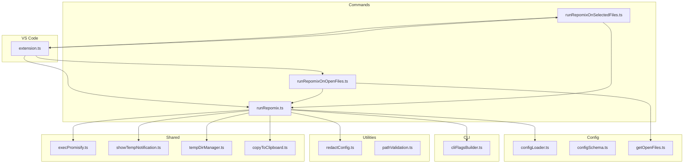

**Diagram sources**
- [runRepomix.ts](file://src/commands/runRepomix.ts#L48-L154)
- [runRepomixOnOpenFiles.ts](file://src/commands/runRepomixOnOpenFiles.ts#L8-L28)
- [runRepomixOnSelectedFiles.ts](file://src/commands/runRepomixOnSelectedFiles.ts#L26-L99)
- [configLoader.ts](file://src/config/configLoader.ts#L145-L229)
- [cliFlagsBuilder.ts](file://src/core/cli/cliFlagsBuilder.ts#L43-L148)
- [redactConfig.ts](file://src/utils/redactConfig.ts#L3-L55)
- [pathValidation.ts](file://src/utils/pathValidation.ts#L9-L24)
- [execPromisify.ts](file://src/shared/execPromisify.ts#L1-L5)
- [showTempNotification.ts](file://src/shared/showTempNotification.ts#L4-L61)
- [tempDirManager.ts](file://src/core/files/tempDirManager.ts#L9-L64)
- [copyToClipboard.ts](file://src/core/files/copyToClipboard.ts#L52-L159)
- [getOpenFiles.ts](file://src/config/getOpenFiles.ts#L4-L12)
- [extension.ts](file://src/extension.ts#L498-L520)

**Section sources**
- [runRepomix.ts](file://src/commands/runRepomix.ts#L48-L154)
- [runRepomixOnOpenFiles.ts](file://src/commands/runRepomixOnOpenFiles.ts#L8-L28)
- [runRepomixOnSelectedFiles.ts](file://src/commands/runRepomixOnSelectedFiles.ts#L26-L99)
- [extension.ts](file://src/extension.ts#L498-L520)

## Core Components
- RunRepomixDeps interface and defaultRunRepomixDeps: define the dependency contract and default implementations for the core runRepomix function. This enables testability and decoupling from concrete implementations.
- runRepomix: orchestrates configuration loading, merging, security checks, CLI flag generation, command execution, notifications, and cleanup.
- runRepomixOnOpenFiles: variant that computes include patterns from currently open editor files.
- runRepomixOnSelectedFiles: variant that accepts arbitrary file URIs, computes include patterns (including directory expansion), and optionally logs runs to a database.

Key responsibilities:
- Configuration sources: VS Code settings, repomix.config.json, and overrides
- Security: path traversal protection and sensitive data redaction
- Execution: spawn npx repomix@latest with constructed flags
- UX: progress notifications, cancellations, and success/error messages

**Section sources**
- [runRepomix.ts](file://src/commands/runRepomix.ts#L19-L46)
- [runRepomix.ts](file://src/commands/runRepomix.ts#L48-L154)
- [runRepomixOnOpenFiles.ts](file://src/commands/runRepomixOnOpenFiles.ts#L8-L28)
- [runRepomixOnSelectedFiles.ts](file://src/commands/runRepomixOnSelectedFiles.ts#L26-L99)

## Architecture Overview
The execution pipeline follows a deterministic flow: load and merge configuration, validate security, build CLI flags, construct the command string, execute it, and handle outputs and notifications.

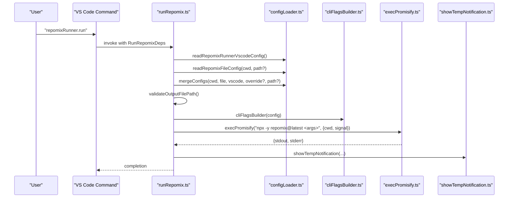

**Diagram sources**
- [runRepomix.ts](file://src/commands/runRepomix.ts#L54-L114)
- [configLoader.ts](file://src/config/configLoader.ts#L99-L130)
- [configLoader.ts](file://src/config/configLoader.ts#L145-L229)
- [cliFlagsBuilder.ts](file://src/core/cli/cliFlagsBuilder.ts#L43-L148)
- [execPromisify.ts](file://src/shared/execPromisify.ts#L1-L5)
- [showTempNotification.ts](file://src/shared/showTempNotification.ts#L4-L61)

## Detailed Component Analysis

### Run Repomix Core Execution (runRepomix)
Responsibilities:
- Load and set verbosity from VS Code settings
- Read repomix.config.json if present
- Merge configuration from multiple sources with strict precedence
- Enforce path traversal protection for output file path
- Build CLI flags from merged config
- Construct and execute the npx repomix@latest command with optional AbortSignal
- Log outputs, show notifications, and manage temp files and clipboard

Security validations:
- Path traversal check ensures output path remains within workspace root
- Sensitive data redaction for logs and command strings

Notifications and UX:
- Progress notification with cancellation support
- Success notification summarizing outcomes (clipboard, keep file, path)
- Error handling with user-visible messages

Clipboard integration:
- When configured, copies either file content (content mode) or file to OS clipboard (file mode)

Cleanup:
- Optionally removes output file after processing
- Cleans up temporary files after a delay

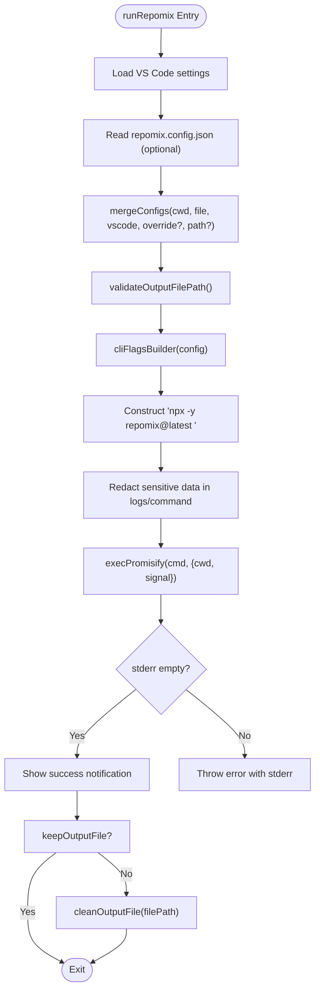

**Diagram sources**
- [runRepomix.ts](file://src/commands/runRepomix.ts#L54-L154)
- [pathValidation.ts](file://src/utils/pathValidation.ts#L9-L24)
- [cliFlagsBuilder.ts](file://src/core/cli/cliFlagsBuilder.ts#L43-L148)
- [redactConfig.ts](file://src/utils/redactConfig.ts#L3-L55)
- [execPromisify.ts](file://src/shared/execPromisify.ts#L1-L5)

**Section sources**
- [runRepomix.ts](file://src/commands/runRepomix.ts#L48-L154)
- [pathValidation.ts](file://src/utils/pathValidation.ts#L9-L24)
- [redactConfig.ts](file://src/utils/redactConfig.ts#L3-L55)

### Configuration Merging (mergeConfigs)
Priority order (highest to lowest):
1. overrideConfig (function parameter)
2. repomix.config.json
3. VS Code settings (repomix runner defaults)
4. base defaults

Behavior highlights:
- include patterns resolution
- output file path resolution and extension normalization
- conditional output directory usage when targeting a single directory and specific runner option
- ignore patterns aggregation
- security and token count sections merged

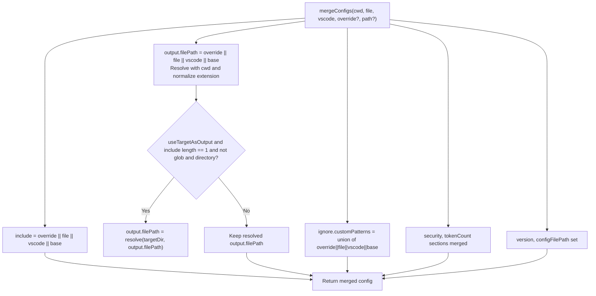

**Diagram sources**
- [configLoader.ts](file://src/config/configLoader.ts#L145-L229)
- [configSchema.ts](file://src/config/configSchema.ts#L138-L149)

**Section sources**
- [configLoader.ts](file://src/config/configLoader.ts#L145-L229)
- [configSchema.ts](file://src/config/configSchema.ts#L138-L149)

### CLI Flag Building (cliFlagsBuilder)
Translates merged configuration into repomix CLI arguments:
- Supports version, verbose, config file path, output options, include, ignore, security, token count, and remote flags
- Warns about unsupported keys via onWarning callback
- Normalizes include patterns to forward slashes

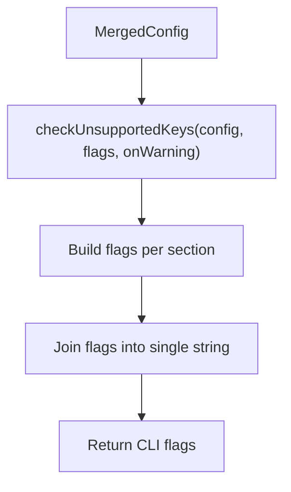

**Diagram sources**
- [cliFlagsBuilder.ts](file://src/core/cli/cliFlagsBuilder.ts#L43-L148)
- [cliFlagsBuilder.ts](file://src/core/cli/cliFlagsBuilder.ts#L151-L214)

**Section sources**
- [cliFlagsBuilder.ts](file://src/core/cli/cliFlagsBuilder.ts#L43-L148)
- [cliFlagsBuilder.ts](file://src/core/cli/cliFlagsBuilder.ts#L151-L214)

### Variant: runRepomixOnOpenFiles
Behavior:
- Detects currently open files in editors
- If none, notifies and exits
- Overrides include to the list of open files
- Delegates to runRepomix with merged dependencies

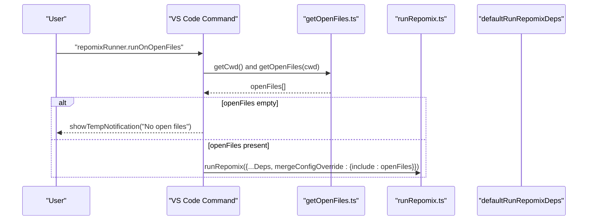

**Diagram sources**
- [runRepomixOnOpenFiles.ts](file://src/commands/runRepomixOnOpenFiles.ts#L8-L28)
- [getOpenFiles.ts](file://src/config/getOpenFiles.ts#L4-L12)
- [runRepomix.ts](file://src/commands/runRepomix.ts#L48-L154)

**Section sources**
- [runRepomixOnOpenFiles.ts](file://src/commands/runRepomixOnOpenFiles.ts#L8-L28)
- [getOpenFiles.ts](file://src/config/getOpenFiles.ts#L4-L12)

### Variant: runRepomixOnSelectedFiles
Behavior:
- Accepts VS Code URIs and optional override configuration
- Computes include patterns:
  - If a selected item is a directory and override includes exist, expands each pattern under the directory
  - Otherwise, includes the exact relative path
- Optionally logs the run to a database and passes AbortSignal and config file path to the underlying runner
- Uses dependency injection for runner and dependencies to support testing

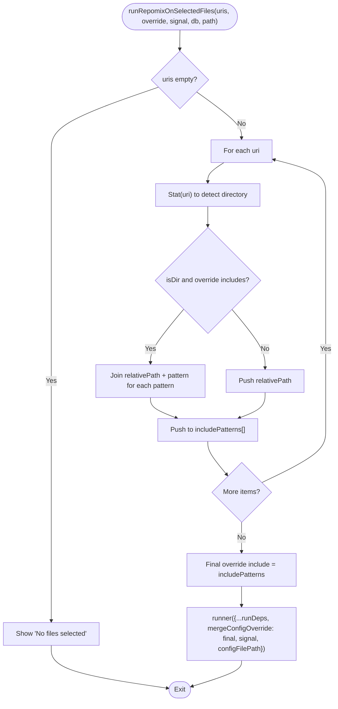

**Diagram sources**
- [runRepomixOnSelectedFiles.ts](file://src/commands/runRepomixOnSelectedFiles.ts#L26-L99)

**Section sources**
- [runRepomixOnSelectedFiles.ts](file://src/commands/runRepomixOnSelectedFiles.ts#L26-L99)

### Security Validation Mechanisms
- Path traversal protection:
  - Validates that the resolved output path remains within the workspace root
  - Throws on violations to prevent writing outside the workspace
- Sensitive data redaction:
  - Redacts URLs and credentials in logs and command strings
  - Masks usernames and passwords in remote URLs and command substrings

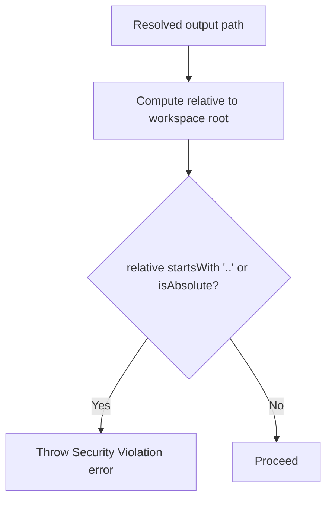

**Diagram sources**
- [runRepomix.ts](file://src/commands/runRepomix.ts#L75-L80)
- [pathValidation.ts](file://src/utils/pathValidation.ts#L9-L24)
- [redactConfig.ts](file://src/utils/redactConfig.ts#L3-L55)

**Section sources**
- [runRepomix.ts](file://src/commands/runRepomix.ts#L75-L80)
- [pathValidation.ts](file://src/utils/pathValidation.ts#L9-L24)
- [redactConfig.ts](file://src/utils/redactConfig.ts#L3-L55)

### Dependency Injection Pattern
- RunRepomixDeps defines the interface for all runtime dependencies
- defaultRunRepomixDeps provides default implementations
- Variants accept optional injected dependencies for testing and flexibility
- This pattern allows swapping implementations and stubbing for unit tests

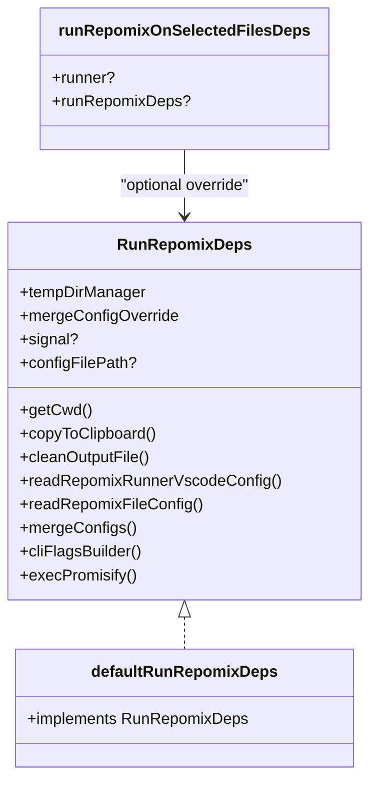

**Diagram sources**
- [runRepomix.ts](file://src/commands/runRepomix.ts#L19-L46)
- [runRepomixOnSelectedFiles.ts](file://src/commands/runRepomixOnSelectedFiles.ts#L13-L24)

**Section sources**
- [runRepomix.ts](file://src/commands/runRepomix.ts#L19-L46)
- [runRepomixOnSelectedFiles.ts](file://src/commands/runRepomixOnSelectedFiles.ts#L13-L24)

### Command Construction and Execution
- Command: npx -y repomix@latest "<cwd>" <flags>
- cwd is quoted to handle spaces and special characters
- Flags built from merged config
- Optional AbortSignal passed to process execution
- Notifications wrap execution with progress and cancellation

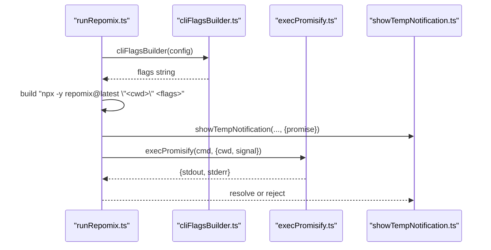

**Diagram sources**
- [runRepomix.ts](file://src/commands/runRepomix.ts#L87-L103)
- [cliFlagsBuilder.ts](file://src/core/cli/cliFlagsBuilder.ts#L43-L148)
- [execPromisify.ts](file://src/shared/execPromisify.ts#L1-L5)
- [showTempNotification.ts](file://src/shared/showTempNotification.ts#L4-L61)

**Section sources**
- [runRepomix.ts](file://src/commands/runRepomix.ts#L87-L103)
- [cliFlagsBuilder.ts](file://src/core/cli/cliFlagsBuilder.ts#L43-L148)
- [execPromisify.ts](file://src/shared/execPromisify.ts#L1-L5)
- [showTempNotification.ts](file://src/shared/showTempNotification.ts#L4-L61)

### Clipboard Integration
- Two modes:
  - content: copies file content via VS Code clipboard API
  - file: copies the output file to OS clipboard using platform-specific helpers
- Temporary file management ensures the file persists long enough for clipboard operations
- Linux requires xclip; Windows uses a helper binary bundled with the extension

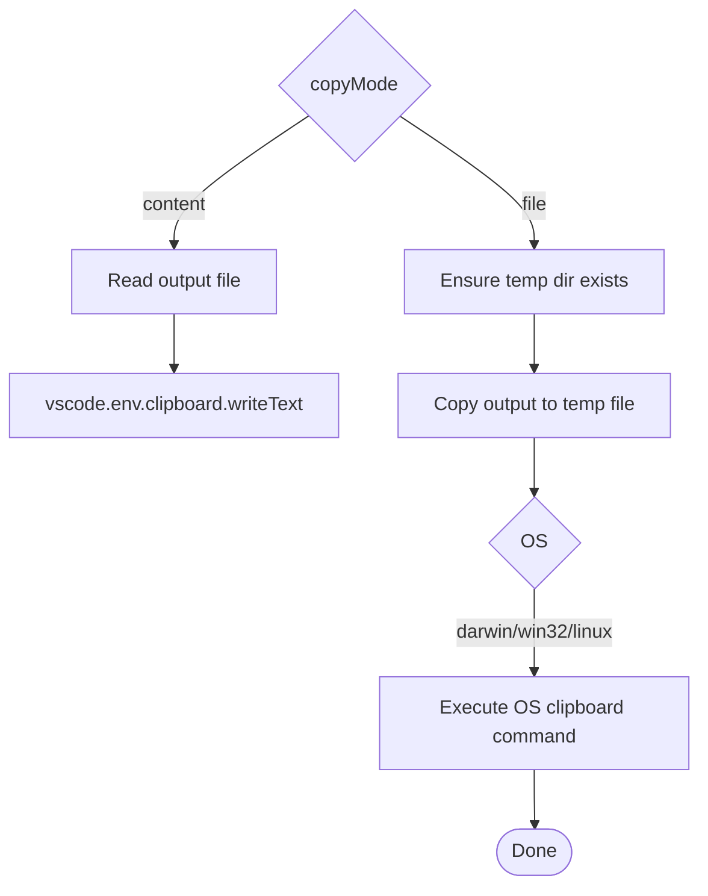

**Diagram sources**
- [copyToClipboard.ts](file://src/core/files/copyToClipboard.ts#L52-L159)
- [tempDirManager.ts](file://src/core/files/tempDirManager.ts#L9-L64)

**Section sources**
- [copyToClipboard.ts](file://src/core/files/copyToClipboard.ts#L52-L159)
- [tempDirManager.ts](file://src/core/files/tempDirManager.ts#L9-L64)

### Error Handling and Notifications
- AbortSignal support: respects cancellation and re-throws AbortError for upstream handling
- Error logging and user notifications via showTempNotification
- Sensitive debug warnings when verbose mode is enabled
- Graceful handling of missing open files or selected files

**Section sources**
- [runRepomix.ts](file://src/commands/runRepomix.ts#L141-L153)
- [showTempNotification.ts](file://src/shared/showTempNotification.ts#L4-L61)

## Dependency Analysis
The following diagram shows key dependencies among the Run Repomix components:

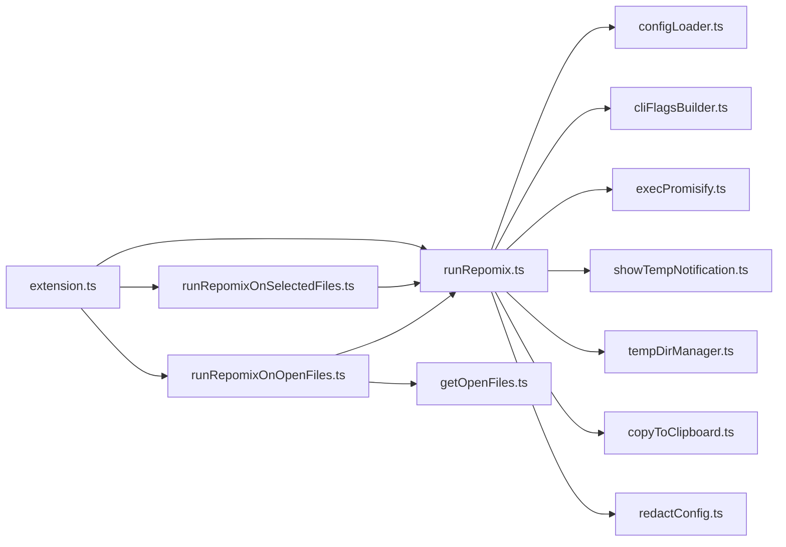

**Diagram sources**
- [runRepomix.ts](file://src/commands/runRepomix.ts#L1-L173)
- [configLoader.ts](file://src/config/configLoader.ts#L1-L230)
- [cliFlagsBuilder.ts](file://src/core/cli/cliFlagsBuilder.ts#L1-L215)
- [execPromisify.ts](file://src/shared/execPromisify.ts#L1-L5)
- [showTempNotification.ts](file://src/shared/showTempNotification.ts#L1-L62)
- [tempDirManager.ts](file://src/core/files/tempDirManager.ts#L1-L68)
- [copyToClipboard.ts](file://src/core/files/copyToClipboard.ts#L1-L160)
- [redactConfig.ts](file://src/utils/redactConfig.ts#L1-L79)
- [runRepomixOnOpenFiles.ts](file://src/commands/runRepomixOnOpenFiles.ts#L1-L29)
- [getOpenFiles.ts](file://src/config/getOpenFiles.ts#L1-L13)
- [runRepomixOnSelectedFiles.ts](file://src/commands/runRepomixOnSelectedFiles.ts#L1-L101)
- [extension.ts](file://src/extension.ts#L498-L520)

**Section sources**
- [runRepomix.ts](file://src/commands/runRepomix.ts#L1-L173)
- [runRepomixOnOpenFiles.ts](file://src/commands/runRepomixOnOpenFiles.ts#L1-L29)
- [runRepomixOnSelectedFiles.ts](file://src/commands/runRepomixOnSelectedFiles.ts#L1-L101)
- [extension.ts](file://src/extension.ts#L498-L520)

## Performance Considerations
- Minimize repeated filesystem access by caching resolved paths and computed include patterns
- Avoid unnecessary copying of output files when not needed
- Use forward-slash normalization for include patterns to reduce regex overhead
- Keep verbose logging disabled by default to reduce I/O overhead

## Troubleshooting Guide
Common issues and resolutions:
- Output path outside workspace:
  - Symptom: Security Violation error mentioning path traversal
  - Resolution: Adjust output path to remain within the workspace root
- Missing xclip on Linux:
  - Symptom: Error indicating xclip is required for file clipboard mode
  - Resolution: Install xclip or switch to content mode
- Windows clipboard helper missing:
  - Symptom: Error about helper tool not being installed
  - Resolution: Ensure the helper binary is available or reinstall the extension
- Aborted execution:
  - Symptom: AbortError logged and command cancelled
  - Resolution: Retry or adjust AbortSignal source
- Invalid repomix.config.json:
  - Symptom: Error about invalid format
  - Resolution: Fix JSON syntax or comments and validate schema

**Section sources**
- [runRepomix.ts](file://src/commands/runRepomix.ts#L75-L80)
- [copyToClipboard.ts](file://src/core/files/copyToClipboard.ts#L109-L118)
- [copyToClipboard.ts](file://src/core/files/copyToClipboard.ts#L150-L158)
- [configLoader.ts](file://src/config/configLoader.ts#L121-L130)

## Conclusion
The Run Repomix command implementation provides a robust, secure, and user-friendly integration with the repomix CLI. Through a clear dependency injection pattern, comprehensive configuration merging, strict security validations, and thoughtful UX, it supports flexible execution modes while maintaining safety and reliability. The variants enable quick execution on open or selected files, and the clipboard integration streamlines post-processing workflows.