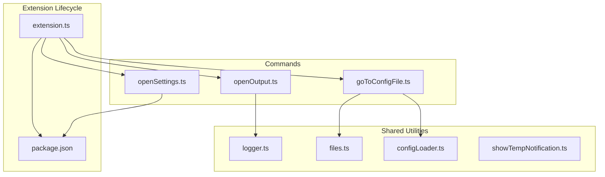
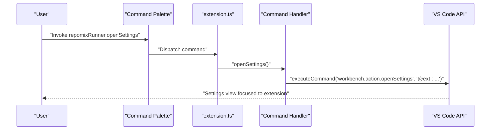
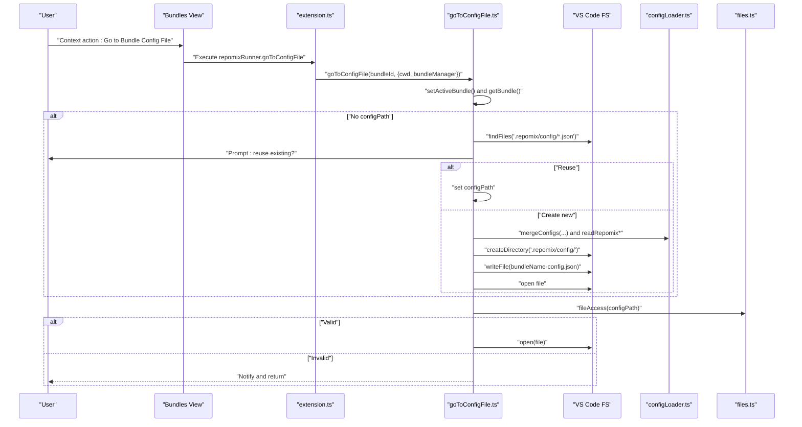
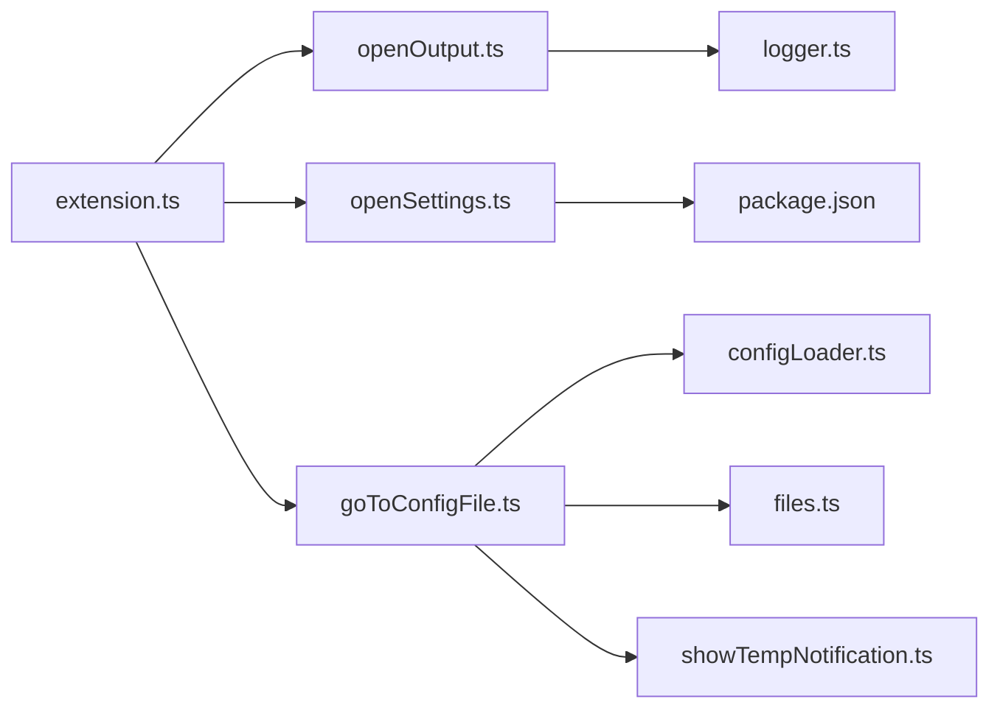

# Utility Commands

<cite>
**Referenced Files in This Document**
- [openOutput.ts](file://src/commands/openOutput.ts)
- [openSettings.ts](file://src/commands/openSettings.ts)
- [goToConfigFile.ts](file://src/commands/goToConfigFile.ts)
- [extension.ts](file://src/extension.ts)
- [logger.ts](file://src/shared/logger.ts)
- [files.ts](file://src/shared/files.ts)
- [configLoader.ts](file://src/config/configLoader.ts)
- [showTempNotification.ts](file://src/shared/showTempNotification.ts)
- [package.json](file://package.json)
- [openOutput.test.ts](file://src/test/commands/openOutput.test.ts)
- [openSettings.test.ts](file://src/test/commands/openSettings.test.ts)
- [README.md](file://README.md)
</cite>

## Table of Contents
1. [Introduction](#introduction)
2. [Project Structure](#project-structure)
3. [Core Components](#core-components)
4. [Architecture Overview](#architecture-overview)
5. [Detailed Component Analysis](#detailed-component-analysis)
6. [Dependency Analysis](#dependency-analysis)
7. [Performance Considerations](#performance-considerations)
8. [Troubleshooting Guide](#troubleshooting-guide)
9. [Conclusion](#conclusion)

## Introduction
This document explains the utility command implementations that power user interface navigation and configuration access in the extension. It focuses on three commands:
- openOutput: Opens the extension’s output channel for runtime logs and diagnostics.
- openSettings: Opens VS Code settings filtered to the extension’s configuration.
- goToConfigFile: Navigates to a bundle’s configuration file, creating or linking it as needed.

It covers the VS Code API integration patterns, file opening mechanisms, settings panel integration, configuration file navigation, error handling, and user experience aspects such as notifications and progress indicators. It also includes usage patterns and integration with the extension’s UI components.

## Project Structure
The utility commands live under src/commands and are wired into the extension lifecycle via src/extension.ts. They integrate with shared utilities for logging, file access, and configuration merging, and are surfaced through the VS Code command palette and menus.

**Diagram sources**
- [extension.ts](file://src/extension.ts#L507-L570)
- [openOutput.ts](file://src/commands/openOutput.ts#L1-L6)
- [openSettings.ts](file://src/commands/openSettings.ts#L1-L10)
- [goToConfigFile.ts](file://src/commands/goToConfigFile.ts#L1-L114)
- [logger.ts](file://src/shared/logger.ts#L1-L132)
- [files.ts](file://src/shared/files.ts#L1-L70)
- [configLoader.ts](file://src/config/configLoader.ts#L1-L230)
- [showTempNotification.ts](file://src/shared/showTempNotification.ts#L1-L62)
- [package.json](file://package.json#L20-L540)

**Section sources**
- [extension.ts](file://src/extension.ts#L507-L570)
- [package.json](file://package.json#L20-L540)

## Core Components
- openOutput: Minimal command that surfaces the extension’s output channel for viewing logs and diagnostics.
- openSettings: Executes a VS Code built-in command to open settings with an extension-specific filter.
- goToConfigFile: Orchestrates bundle configuration file selection or creation, validates paths, and opens the file in the editor.

These commands are registered in the extension activation routine and exposed through the command palette and explorer menus.

**Section sources**
- [openOutput.ts](file://src/commands/openOutput.ts#L1-L6)
- [openSettings.ts](file://src/commands/openSettings.ts#L1-L10)
- [goToConfigFile.ts](file://src/commands/goToConfigFile.ts#L1-L114)
- [extension.ts](file://src/extension.ts#L507-L570)
- [package.json](file://package.json#L309-L415)

## Architecture Overview
The commands follow a straightforward pattern:
- Registration: Commands are registered in the extension activation routine with unique identifiers.
- Execution: Command handlers call VS Code APIs or shared utilities to perform actions.
- UI Integration: Menus and views (bundles view, control panel) trigger these commands.

**Diagram sources**
- [extension.ts](file://src/extension.ts#L507-L510)
- [openSettings.ts](file://src/commands/openSettings.ts#L1-L10)
- [package.json](file://package.json#L388-L392)

## Detailed Component Analysis

### openOutput Command
Purpose:
- Provide immediate access to the extension’s output channel for logs and diagnostics.

Implementation highlights:
- Delegates to the logger utility, which exposes a method to show the output channel.
- No file operations or configuration changes; purely UI navigation.

User experience:
- Invoking the command immediately reveals the output channel, enabling quick inspection of recent activity.

Usage pattern:
- From the command palette: “Repomix: Output”
- From the bundles view toolbar or control panel, depending on UI wiring.

Integration:
- Registered under repomixRunner.openOutput and contributes to the command palette and menus.

**Section sources**
- [openOutput.ts](file://src/commands/openOutput.ts#L1-L6)
- [logger.ts](file://src/shared/logger.ts#L15-L17)
- [extension.ts](file://src/extension.ts#L512-L512)
- [package.json](file://package.json#L394-L398)

### openSettings Command
Purpose:
- Quickly open VS Code settings filtered to the extension’s configuration namespace.

Implementation highlights:
- Calls a VS Code built-in command with an extension filter to narrow settings to the extension.
- Uses the extension identifier to scope the settings view.

User experience:
- Users land directly on the extension’s settings page, reducing navigation overhead.

Usage pattern:
- From the command palette: “Repomix: Settings”
- From the bundles view toolbar or control panel.

Integration:
- Registered under repomixRunner.openSettings and surfaced in menus and command palette.

**Section sources**
- [openSettings.ts](file://src/commands/openSettings.ts#L1-L10)
- [extension.ts](file://src/extension.ts#L507-L510)
- [package.json](file://package.json#L388-L392)

### goToConfigFile Command
Purpose:
- Navigate to a bundle’s configuration file, creating or linking it if needed.

Key behaviors:
- Sets the active bundle and retrieves its configuration path.
- If no path is set:
  - Scans for legacy config files in the project’s .repomix/config directory.
  - Prompts the user to reuse an existing file or create a new bundle-specific config.
  - Creates a new config file with merged defaults and opens it.
- Validates the file path and opens it in the editor.

File opening mechanism:
- Uses VS Code’s file system APIs to create directories and write files.
- Opens the resolved file URI in the editor.

Settings panel integration:
- Reads and merges configuration from VS Code settings and the project’s repomix.config.json.
- Normalizes output paths to be relative to the workspace root.

Error handling:
- Shows error messages for directory creation failures and file write failures.
- Uses a file access utility to validate existence and notify users when files are missing.
- Provides temporary notifications to inform users about the selected config file.

User experience:
- Modal dialogs guide users through decisions when no config is present.
- Notifications confirm successful configuration updates.
- Progress indicators can be used in broader flows (see usage patterns below).

Usage patterns:
- From the bundles view context menu: “Go to Bundle Config File”.
- From the control panel or other UI components that expose bundle actions.

Integration with UI components:
- The bundles view and control panel trigger this command, enabling seamless navigation from bundle management to configuration editing.

**Diagram sources**
- [goToConfigFile.ts](file://src/commands/goToConfigFile.ts#L10-L114)
- [configLoader.ts](file://src/config/configLoader.ts#L99-L229)
- [files.ts](file://src/shared/files.ts#L11-L19)
- [extension.ts](file://src/extension.ts#L562-L570)

**Section sources**
- [goToConfigFile.ts](file://src/commands/goToConfigFile.ts#L1-L114)
- [configLoader.ts](file://src/config/configLoader.ts#L99-L229)
- [files.ts](file://src/shared/files.ts#L11-L19)
- [showTempNotification.ts](file://src/shared/showTempNotification.ts#L4-L62)
- [extension.ts](file://src/extension.ts#L562-L570)
- [package.json](file://package.json#L321-L324)

## Dependency Analysis
The commands depend on shared utilities and configuration loaders. The extension registers commands and wires them to UI contributions.

**Diagram sources**
- [extension.ts](file://src/extension.ts#L507-L570)
- [openOutput.ts](file://src/commands/openOutput.ts#L1-L6)
- [openSettings.ts](file://src/commands/openSettings.ts#L1-L10)
- [goToConfigFile.ts](file://src/commands/goToConfigFile.ts#L1-L114)
- [logger.ts](file://src/shared/logger.ts#L1-L132)
- [files.ts](file://src/shared/files.ts#L1-L70)
- [configLoader.ts](file://src/config/configLoader.ts#L1-L230)
- [showTempNotification.ts](file://src/shared/showTempNotification.ts#L1-L62)
- [package.json](file://package.json#L20-L540)

**Section sources**
- [extension.ts](file://src/extension.ts#L507-L570)
- [package.json](file://package.json#L20-L540)

## Performance Considerations
- openOutput: Instant channel reveal; negligible overhead.
- openSettings: Single command dispatch to VS Code; negligible overhead.
- goToConfigFile: Directory creation and file writes are synchronous operations; keep configuration files small and avoid frequent re-creation. Use notifications sparingly in loops if extending the command.

## Troubleshooting Guide
Common issues and resolutions:
- Settings not opening:
  - Ensure the command is registered and the extension identifier matches the filter used by the command.
  - Verify the command palette entry exists in the extension contribution.

- Output channel not visible:
  - Confirm the logger output channel is created and the show method is invoked.

- Config file creation fails:
  - Directory creation errors are surfaced via error messages; verify permissions and path validity.
  - File write failures are reported; check for disk space and write permissions.

- Missing configuration file:
  - The file access utility notifies users when a path does not exist; ensure the path is correct or recreate the file.

- User prompts not appearing:
  - Modal dialogs require explicit user choice; ensure the command is invoked from the UI context that supports prompts.

Verification references:
- Tests demonstrate expected behavior for openOutput and openSettings command invocation and argument validation.

**Section sources**
- [openOutput.test.ts](file://src/test/commands/openOutput.test.ts#L1-L43)
- [openSettings.test.ts](file://src/test/commands/openSettings.test.ts#L1-L39)
- [files.ts](file://src/shared/files.ts#L11-L19)
- [goToConfigFile.ts](file://src/commands/goToConfigFile.ts#L80-L83)
- [goToConfigFile.ts](file://src/commands/goToConfigFile.ts#L104-L107)

## Conclusion
The utility commands provide streamlined navigation and configuration access:
- openOutput gives immediate access to diagnostic logs.
- openSettings quickly filters to the extension’s settings.
- goToConfigFile integrates bundle management with configuration file creation and editing, ensuring a smooth developer experience.

They leverage VS Code APIs and shared utilities to deliver reliable, user-friendly workflows integrated into the extension’s UI.