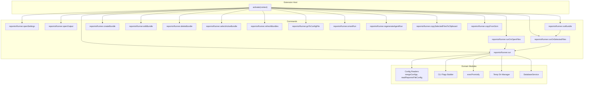
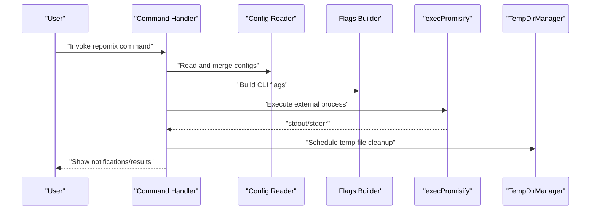
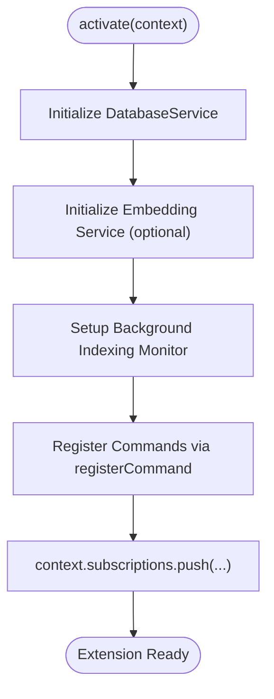
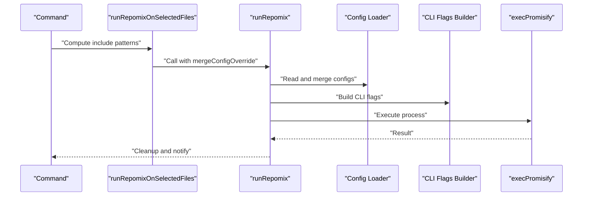
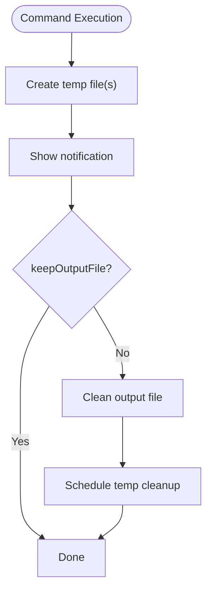
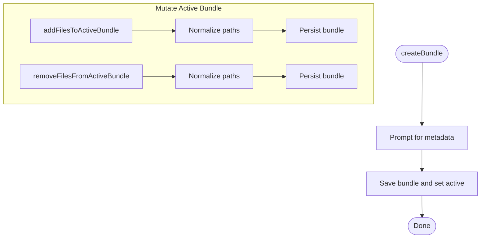
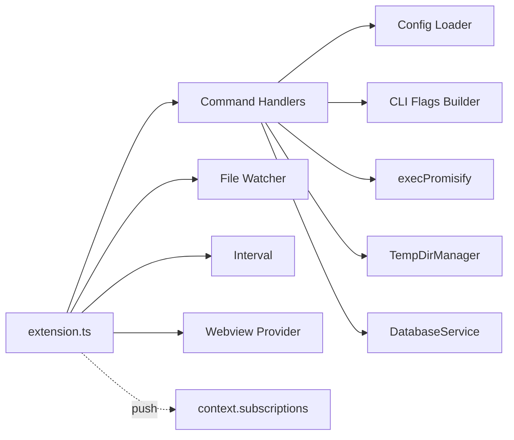

# Command Lifecycle Management

<cite>
**Referenced Files in This Document**
- [extension.ts](file://src/extension.ts)
- [package.json](file://package.json)
- [runRepomix.ts](file://src/commands/runRepomix.ts)
- [runRepomixOnOpenFiles.ts](file://src/commands/runRepomixOnOpenFiles.ts)
- [runRepomixOnSelectedFiles.ts](file://src/commands/runRepomixOnSelectedFiles.ts)
- [runBundle.ts](file://src/commands/runBundle.ts)
- [mutateActiveBundle.ts](file://src/commands/mutateActiveBundle.ts)
- [createBundle.ts](file://src/commands/createBundle.ts)
- [deleteBundle.ts](file://src/commands/deleteBundle.ts)
- [utils.ts](file://src/commands/utils.ts)
- [tempDirManager.ts](file://src/core/files/tempDirManager.ts)
- [execPromisify.ts](file://src/shared/execPromisify.ts)
- [runRepomix.test.ts](file://src/test/commands/runRepomix.test.ts)
- [runRepomixOnOpenFiles.test.ts](file://src/test/commands/runRepomixOnOpenFiles.test.ts)
- [runRepomixOnSelectedFiles.test.ts](file://src/test/commands/runRepomixOnSelectedFiles.test.ts)
</cite>

## Table of Contents
1. [Introduction](#introduction)
2. [Project Structure](#project-structure)
3. [Core Components](#core-components)
4. [Architecture Overview](#architecture-overview)
5. [Detailed Component Analysis](#detailed-component-analysis)
6. [Dependency Analysis](#dependency-analysis)
7. [Performance Considerations](#performance-considerations)
8. [Troubleshooting Guide](#troubleshooting-guide)
9. [Conclusion](#conclusion)
10. [Appendices](#appendices)

## Introduction
This document explains the complete lifecycle of commands in the extension, from registration and activation through execution to cleanup. It documents how commands are registered, how they interact with the extension context and global state, and how resources are managed and disposed. It also covers error recovery, graceful degradation, and testing strategies for lifecycle correctness.

## Project Structure
The extension registers commands in the activation hook and pushes disposable subscriptions into the extension context. Commands are thin orchestration layers that delegate work to domain modules (configuration, CLI flag building, process execution, file operations, and persistence). Background services (indexing monitor, webview provider, periodic cleanup) are also registered and cleaned up via context.subscriptions.

**Diagram sources**
- [extension.ts](file://src/extension.ts#L43-L781)
- [runRepomix.ts](file://src/commands/runRepomix.ts#L48-L154)
- [runRepomixOnOpenFiles.ts](file://src/commands/runRepomixOnOpenFiles.ts#L8-L28)
- [runRepomixOnSelectedFiles.ts](file://src/commands/runRepomixOnSelectedFiles.ts#L26-L100)
- [runBundle.ts](file://src/commands/runBundle.ts#L15-L156)
- [tempDirManager.ts](file://src/core/files/tempDirManager.ts#L9-L68)
- [execPromisify.ts](file://src/shared/execPromisify.ts#L1-L5)

**Section sources**
- [extension.ts](file://src/extension.ts#L43-L781)
- [package.json](file://package.json#L20-L29)

## Core Components
- Command registration and activation: All commands are registered inside the activation hook and pushed into context.subscriptions for automatic disposal.
- Command execution flow: Commands validate inputs, compute overrides, and delegate to runRepomix or runRepomixOnSelectedFiles, which orchestrate configuration, CLI flags, process execution, and post-processing.
- Resource management: Temporary files are created under a dedicated temp directory and scheduled for delayed cleanup; long-running watchers and intervals are disposed via context.subscriptions.
- Global state: The extension context exposes secrets and disposables; bundle and agent run history are persisted via DatabaseService.

**Section sources**
- [extension.ts](file://src/extension.ts#L43-L781)
- [runRepomix.ts](file://src/commands/runRepomix.ts#L48-L154)
- [runRepomixOnOpenFiles.ts](file://src/commands/runRepomixOnOpenFiles.ts#L8-L28)
- [runRepomixOnSelectedFiles.ts](file://src/commands/runRepomixOnSelectedFiles.ts#L26-L100)
- [runBundle.ts](file://src/commands/runBundle.ts#L15-L156)
- [tempDirManager.ts](file://src/core/files/tempDirManager.ts#L9-L68)

## Architecture Overview
The command lifecycle follows a predictable pattern:
- Registration: Commands are registered in activate and added to context.subscriptions.
- Activation: Activation initializes services (database, embedding, indexing monitor) and registers commands.
- Execution: Commands validate inputs, compute overrides, and execute the external process via execPromisify.
- Cleanup: Temporary files are scheduled for cleanup; watchers and intervals are disposed on deactivation.

**Diagram sources**
- [runRepomix.ts](file://src/commands/runRepomix.ts#L48-L154)
- [execPromisify.ts](file://src/shared/execPromisify.ts#L1-L5)
- [tempDirManager.ts](file://src/core/files/tempDirManager.ts#L44-L64)

## Detailed Component Analysis

### Command Registration and Timing
- All commands are registered inside the activate function and pushed into context.subscriptions for automatic disposal.
- Activation also initializes background services (indexing monitor, webview provider, periodic cleanup) and stores the extension context globally for agent graph access.
- Activation events in package.json define when the extension activates (e.g., onCommand for each command, onStartupFinished).

**Diagram sources**
- [extension.ts](file://src/extension.ts#L43-L781)
- [package.json](file://package.json#L20-L29)

**Section sources**
- [extension.ts](file://src/extension.ts#L43-L781)
- [package.json](file://package.json#L20-L29)

### Command Execution Orchestration
- runRepomix: Central orchestrator that merges configurations, validates output paths, builds CLI flags, executes the external process, copies to clipboard if configured, and cleans up temporary files.
- runRepomixOnOpenFiles: Computes currently open files and delegates to runRepomix with an include override.
- runRepomixOnSelectedFiles: Computes include patterns from selected URIs (handling directories and override patterns), optionally logs debug runs, and delegates to runRepomix.
- runBundle: Loads bundle configuration, computes final output path, validates security, filters missing files, and delegates to runRepomixOnSelectedFiles.

**Diagram sources**
- [runRepomixOnSelectedFiles.ts](file://src/commands/runRepomixOnSelectedFiles.ts#L26-L100)
- [runRepomix.ts](file://src/commands/runRepomix.ts#L48-L154)

**Section sources**
- [runRepomix.ts](file://src/commands/runRepomix.ts#L48-L154)
- [runRepomixOnOpenFiles.ts](file://src/commands/runRepomixOnOpenFiles.ts#L8-L28)
- [runRepomixOnSelectedFiles.ts](file://src/commands/runRepomixOnSelectedFiles.ts#L26-L100)
- [runBundle.ts](file://src/commands/runBundle.ts#L15-L156)

### Resource Management and Cleanup
- Temporary files: Created under a temp directory and scheduled for delayed cleanup using a timer. Errors during cleanup are logged but do not fail the operation.
- Disposables: File watchers, intervals, and custom disposable objects are added to context.subscriptions to ensure automatic disposal on deactivation.
- Output retention: Controlled by configuration; when disabled, the output file is cleaned up after execution.

**Diagram sources**
- [runRepomix.ts](file://src/commands/runRepomix.ts#L116-L139)
- [tempDirManager.ts](file://src/core/files/tempDirManager.ts#L44-L64)
- [extension.ts](file://src/extension.ts#L754-L780)

**Section sources**
- [runRepomix.ts](file://src/commands/runRepomix.ts#L116-L139)
- [tempDirManager.ts](file://src/core/files/tempDirManager.ts#L44-L64)
- [extension.ts](file://src/extension.ts#L754-L780)

### Bundle Management Commands
- createBundle: Prompts for bundle metadata and persists it, then sets it as active.
- mutateActiveBundle: Adds/removes files to/from the active bundle, normalizing paths and handling directories.
- runBundle: Loads bundle config, computes output path, validates security, filters missing files, and runs repomix on the bundle’s files.
- deleteBundle: Deletes a bundle and notifies the user.

**Diagram sources**
- [createBundle.ts](file://src/commands/createBundle.ts#L7-L31)
- [mutateActiveBundle.ts](file://src/commands/mutateActiveBundle.ts#L15-L112)
- [runBundle.ts](file://src/commands/runBundle.ts#L15-L156)

**Section sources**
- [createBundle.ts](file://src/commands/createBundle.ts#L7-L31)
- [mutateActiveBundle.ts](file://src/commands/mutateActiveBundle.ts#L15-L112)
- [runBundle.ts](file://src/commands/runBundle.ts#L15-L156)

### Global State and Secrets
- The extension context is exposed globally for agent graph usage.
- Secrets are retrieved from context.secrets for embedding provider configuration and agent runs.
- DatabaseService is initialized early and used for agent run history and debug logging.

**Section sources**
- [extension.ts](file://src/extension.ts#L93-L51)
- [runBundle.ts](file://src/commands/runBundle.ts#L78-L87)

### Error Recovery and Graceful Degradation
- Many background services are optional (embedding provider, vector DB adapter, file watcher). Failures are logged and do not prevent activation.
- Commands validate output paths and abort early with user feedback when invalid.
- runRepomix handles AbortError and propagates errors to the UI with user-friendly messages.
- runBundle filters missing files and asks the user whether to proceed.

**Section sources**
- [extension.ts](file://src/extension.ts#L55-L90)
- [runRepomix.ts](file://src/commands/runRepomix.ts#L141-L153)
- [runBundle.ts](file://src/commands/runBundle.ts#L110-L121)

## Dependency Analysis
- Commands depend on configuration loaders, CLI flag builder, and execPromisify.
- runRepomixOnSelectedFiles and runBundle inject dependencies for testability.
- context.subscriptions aggregates disposables from commands, file watchers, webview providers, and intervals.

**Diagram sources**
- [extension.ts](file://src/extension.ts#L43-L781)
- [runRepomix.ts](file://src/commands/runRepomix.ts#L19-L46)

**Section sources**
- [extension.ts](file://src/extension.ts#L43-L781)
- [runRepomix.ts](file://src/commands/runRepomix.ts#L19-L46)

## Performance Considerations
- Debounced background indexing reduces redundant embeddings during rapid saves.
- Concurrency is limited for background tasks to balance responsiveness and resource usage.
- Temporary file cleanup is deferred to minimize blocking the main execution path.
- Avoid unnecessary file system operations by validating inputs early (e.g., missing files in bundles).

[No sources needed since this section provides general guidance]

## Troubleshooting Guide
Common issues and remedies:
- Command does nothing: Verify activation events and that the command palette entry exists.
- External process fails: Check stderr handling and user notifications; validate output path security.
- Temporary files not cleaned: Confirm cleanup scheduling and that the temp directory exists.
- Background monitor not starting: Ensure required secrets and vector DB configuration are present.

Debugging techniques:
- Use withProgress for long-running commands to provide feedback and cancellation support.
- Log verbose configuration and command construction for sensitive environments.
- Inspect context.subscriptions to ensure disposables are registered.

**Section sources**
- [extension.ts](file://src/extension.ts#L601-L665)
- [runRepomix.ts](file://src/commands/runRepomix.ts#L96-L114)
- [tempDirManager.ts](file://src/core/files/tempDirManager.ts#L44-L64)

## Conclusion
The extension implements a robust command lifecycle: commands are registered at activation, validated and orchestrated centrally, and cleaned up systematically. Optional services degrade gracefully, and error handling ensures user feedback. Testing patterns demonstrate how to isolate dependencies and verify behavior across command flows.

[No sources needed since this section summarizes without analyzing specific files]

## Appendices

### Command Lifecycle Hooks and Disposal Patterns
- Registration: Use vscode.commands.registerCommand and push the returned Disposable into context.subscriptions.
- Disposal: Add custom disposables (e.g., { dispose: () => ... }) alongside built-in disposables.
- Example disposal patterns:
  - File watchers: watcher, { dispose: () => monitor.dispose() }
  - Intervals: { dispose: () => clearInterval(interval) }
  - Webview providers: subscription returned by registerWebviewViewProvider

**Section sources**
- [extension.ts](file://src/extension.ts#L338-L339)
- [extension.ts](file://src/extension.ts#L779-L780)
- [extension.ts](file://src/extension.ts#L423-L426)

### Testing Approaches for Command Lifecycle
- Stub dependencies (execPromisify, config readers, tempDirManager) to isolate command behavior.
- Verify that commands call downstream functions with expected overrides (e.g., include patterns).
- Validate notifications and logging for edge cases (no files selected/open).
- Test cancellation scenarios by passing AbortSignal and asserting behavior.

**Section sources**
- [runRepomix.test.ts](file://src/test/commands/runRepomix.test.ts#L11-L141)
- [runRepomixOnOpenFiles.test.ts](file://src/test/commands/runRepomixOnOpenFiles.test.ts#L12-L84)
- [runRepomixOnSelectedFiles.test.ts](file://src/test/commands/runRepomixOnSelectedFiles.test.ts#L15-L117)