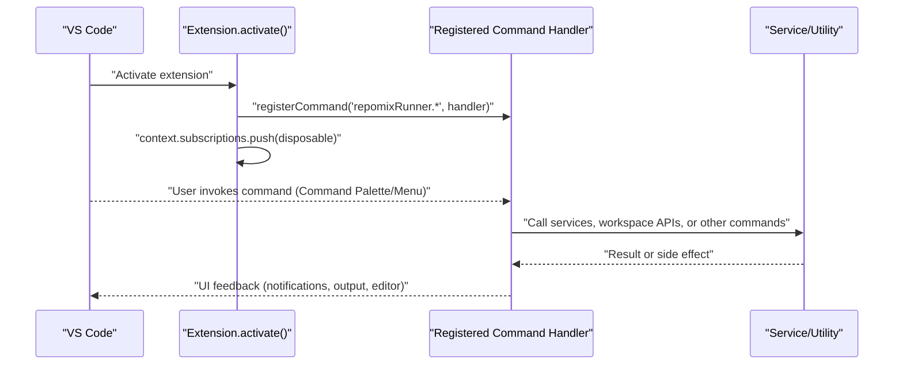
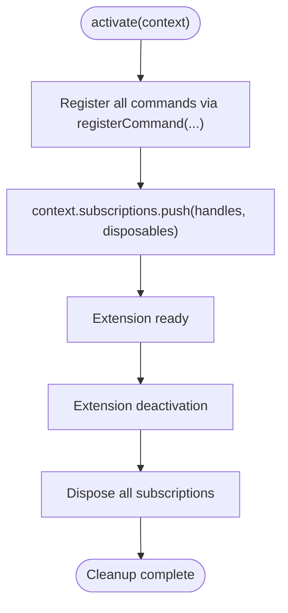
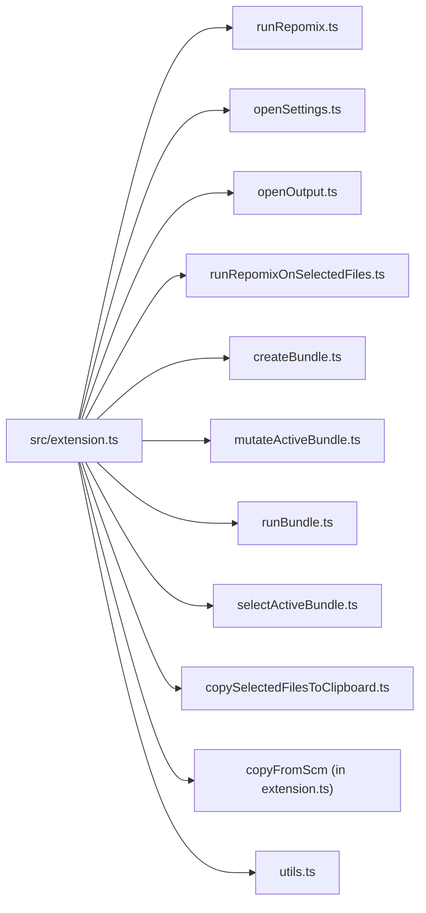

# Command Registration

<cite>
**Referenced Files in This Document**
- [extension.ts](file://src/extension.ts)
- [package.json](file://package.json)
- [runRepomix.ts](file://src/commands/runRepomix.ts)
- [runRepomixOnOpenFiles.ts](file://src/commands/runRepomixOnOpenFiles.ts)
- [runRepomixOnSelectedFiles.ts](file://src/commands/runRepomixOnSelectedFiles.ts)
- [createBundle.ts](file://src/commands/createBundle.ts)
- [mutateActiveBundle.ts](file://src/commands/mutateActiveBundle.ts)
- [runBundle.ts](file://src/commands/runBundle.ts)
- [selectActiveBundle.ts](file://src/commands/selectActiveBundle.ts)
- [openSettings.ts](file://src/commands/openSettings.ts)
- [openOutput.ts](file://src/commands/openOutput.ts)
- [copySelectedFilesToClipboard.ts](file://src/commands/copySelectedFilesToClipboard.ts)
- [copyRepomixOutput.ts](file://src/commands/copyRepomixOutput.ts)
- [utils.ts](file://src/commands/utils.ts)
</cite>

## Table of Contents
1. [Introduction](#introduction)
2. [Project Structure](#project-structure)
3. [Core Components](#core-components)
4. [Architecture Overview](#architecture-overview)
5. [Detailed Component Analysis](#detailed-component-analysis)
6. [Dependency Analysis](#dependency-analysis)
7. [Performance Considerations](#performance-considerations)
8. [Troubleshooting Guide](#troubleshooting-guide)
9. [Conclusion](#conclusion)

## Introduction
This document explains the Command Registration system used by the extension. It covers how VS Code commands are registered via vscode.commands.registerCommand(), the naming convention (repomixRunner.*), namespace organization, and the consistent registration pattern across the extension. It also documents parameter handling, context binding, exposure to the Command Palette and menus, subscription management, lifecycle, error handling, and debugging techniques.

## Project Structure
The extension registers commands in the main activation function and exposes them through package.json contributions. Commands are grouped under the repomixRunner namespace and organized by functionality (bundles, running Repomix, settings, output, SCM integration).

```mermaid
graph TB
subgraph "Extension Activation"
EXT["src/extension.ts<br/>activate(context)"]
end
subgraph "Command Registration"
REG1["registerCommand('repomixRunner.run', ...)"]
REG2["registerCommand('repomixRunner.runOnOpenFiles', ...)"]
REG3["registerCommand('repomixRunner.runOnSelectedFiles', ...)"]
REG4["registerCommand('repomixRunner.createBundle', ...)"]
REG5["registerCommand('repomixRunner.runBundle', ...)"]
REG6["registerCommand('repomixRunner.openSettings', ...)"]
REG7["registerCommand('repomixRunner.openOutput', ...)"]
REG8["registerCommand('repomixRunner.copySelectedFilesToClipboard', ...)"]
REG9["registerCommand('repomixRunner.copyFromScm', ...)"]
end
subgraph "Package Contributions"
PKG["package.json<br/>contributes.commands + menus"]
end
EXT --> REG1
EXT --> REG2
EXT --> REG3
EXT --> REG4
EXT --> REG5
EXT --> REG6
EXT --> REG7
EXT --> REG8
EXT --> REG9
PKG --- REG1
PKG --- REG2
PKG --- REG3
PKG --- REG4
PKG --- REG5
PKG --- REG6
PKG --- REG7
PKG --- REG8
PKG --- REG9
```

**Diagram sources**
- [extension.ts](file://src/extension.ts#L429-L780)
- [package.json](file://package.json#L309-L539)

**Section sources**
- [extension.ts](file://src/extension.ts#L429-L780)
- [package.json](file://package.json#L309-L539)

## Core Components
- Command registration pattern: Each command is registered using vscode.commands.registerCommand(namespace.commandName, handler). Handlers are imported from dedicated modules under src/commands/.
- Naming convention: repomixRunner.<verb><Noun> for consistent discoverability and grouping.
- Parameter handling: Commands accept zero or more parameters (e.g., URIs, TreeNodes, strings). Some commands delegate to other commands to reuse logic.
- Context binding: Registered commands receive the extension context implicitly via closure capture in the activation function; commands that require secrets or services use injected dependencies or global context accessors.
- Exposure: Commands appear in the Command Palette and menus as configured in package.json.

Examples of registrations:
- Simple command: registerCommand('repomixRunner.openSettings', openSettings)
- Parameterized command: registerCommand('repomixRunner.runOnSelectedFiles', handler with uri/uris)
- Context-menu command: registerCommand('repomixRunner.copySelectedFilesToClipboard', handler)
- Delegating command: registerCommand('repomixRunner.copyFromScm', handler that executes another command)

**Section sources**
- [extension.ts](file://src/extension.ts#L429-L780)
- [openSettings.ts](file://src/commands/openSettings.ts#L1-L10)
- [openOutput.ts](file://src/commands/openOutput.ts#L1-L6)
- [copySelectedFilesToClipboard.ts](file://src/commands/copySelectedFilesToClipboard.ts#L67-L148)

## Architecture Overview
The command registration architecture centers on a single activation point that registers all commands and pushes disposables into context.subscriptions for lifecycle management. Package contributions define titles, categories, icons, and visibility rules.

**Diagram sources**
- [extension.ts](file://src/extension.ts#L43-L780)
- [package.json](file://package.json#L309-L539)

**Section sources**
- [extension.ts](file://src/extension.ts#L43-L780)
- [package.json](file://package.json#L309-L539)

## Detailed Component Analysis

### Command Namespace and Organization
- Namespace: repomixRunner.*
- Organization:
  - Running: run, runOnOpenFiles, runOnSelectedFiles, runBundle
  - Bundles: createBundle, editBundle, deleteBundle, selectActiveBundle, refreshBundles, goToConfigFile
  - Utilities: openSettings, openOutput, copySelectedFilesToClipboard, copyFromScm
  - Advanced: smartRun, regenerateAgentRun

These groupings align with package.json contributes.commands and menus.

**Section sources**
- [package.json](file://package.json#L309-L539)
- [extension.ts](file://src/extension.ts#L429-L780)

### Registration Pattern and Lifecycle
- Registration occurs in activate(context) and returns immediately after pushing disposables.
- Disposables include command handles, file watchers, webview providers, tree views, intervals, and secret listeners.
- Proper disposal ensures resources are cleaned up on extension deactivation.

**Diagram sources**
- [extension.ts](file://src/extension.ts#L429-L780)

**Section sources**
- [extension.ts](file://src/extension.ts#L429-L780)

### Command Registration Examples

#### Simple Command: openSettings
- Registration: registerCommand('repomixRunner.openSettings', openSettings)
- Handler: Opens VS Code settings filtered to the extension
- Exposure: Appears in Command Palette and menus

**Section sources**
- [extension.ts](file://src/extension.ts#L507-L510)
- [openSettings.ts](file://src/commands/openSettings.ts#L1-L10)
- [package.json](file://package.json#L388-L392)

#### Parameterized Command: runOnSelectedFiles
- Registration: registerCommand('repomixRunner.runOnSelectedFiles', handler)
- Handler signature: accepts uri and uris; computes include patterns; delegates to runRepomixOnSelectedFiles
- Exposure: Explorer context menu and Command Palette

**Section sources**
- [extension.ts](file://src/extension.ts#L514-L520)
- [runRepomixOnSelectedFiles.ts](file://src/commands/runRepomixOnSelectedFiles.ts#L26-L100)
- [package.json](file://package.json#L378-L386)

#### Context-Menu Command: copySelectedFilesToClipboard
- Registration: registerCommand('repomixRunner.copySelectedFilesToClipboard', handler)
- Handler: expands URIs (files/folders), validates workspace bounds, generates Markdown, copies to clipboard
- Exposure: Explorer context menu and Command Palette

**Section sources**
- [extension.ts](file://src/extension.ts#L726-L731)
- [copySelectedFilesToClipboard.ts](file://src/commands/copySelectedFilesToClipboard.ts#L67-L148)
- [package.json](file://package.json#L311-L314)

#### Delegating Command: copyFromScm
- Registration: registerCommand('repomixRunner.copyFromScm', handler)
- Handler: converts SCM resource states to URIs and delegates to copySelectedFilesToClipboard
- Exposure: SCM resource state context menu

**Section sources**
- [extension.ts](file://src/extension.ts#L734-L748)
- [package.json](file://package.json#L502-L508)

#### Bundle Management Commands
- createBundle: registerCommand('repomixRunner.createBundle', handler)
- add/remove files: registerCommand('repomixRunner.addSelectedFilesToActiveBundle', ...)
- runBundle: registerCommand('repomixRunner.runBundle', handler)
- editBundle: registerCommand('repomixRunner.editBundle', handler)
- deleteBundle: registerCommand('repomixRunner.deleteBundle', handler)
- selectActiveBundle: registerCommand('repomixRunner.selectActiveBundle', handler)
- goToConfigFile: registerCommand('repomixRunner.goToConfigFile', handler)

Handlers orchestrate BundleManager and workspace operations.

**Section sources**
- [extension.ts](file://src/extension.ts#L487-L570)
- [createBundle.ts](file://src/commands/createBundle.ts#L7-L31)
- [mutateActiveBundle.ts](file://src/commands/mutateActiveBundle.ts#L15-L112)
- [runBundle.ts](file://src/commands/runBundle.ts#L15-L156)
- [utils.ts](file://src/commands/utils.ts#L5-L81)

#### Advanced Commands
- smartRun: registerCommand('repomixRunner.smartRun', handler)
  - Prompts user query, initializes agent, shows progress, handles errors
- regenerateAgentRun: registerCommand('repomixRunner.regenerateAgentRun', handler)
  - Reads run history, regenerates output, updates database

**Section sources**
- [extension.ts](file://src/extension.ts#L572-L725)

### Parameter Handling and Context Binding
- URIs: Many commands accept vscode.Uri or vscode.Uri[]. The handlers compute relative paths and validate workspace boundaries.
- Tree nodes: Commands like runBundle and editBundle accept TreeNode objects to operate on the active bundle.
- Context: Commands requiring secrets or services either inject dependencies or access global context via closures established in activate().
- Delegation: copyFromScm demonstrates delegating to another command with prepared arguments.

**Section sources**
- [extension.ts](file://src/extension.ts#L429-L780)
- [runRepomixOnSelectedFiles.ts](file://src/commands/runRepomixOnSelectedFiles.ts#L26-L100)
- [mutateActiveBundle.ts](file://src/commands/mutateActiveBundle.ts#L15-L112)
- [copySelectedFilesToClipboard.ts](file://src/commands/copySelectedFilesToClipboard.ts#L67-L148)

### Exposure to Command Palette and Menus
- Command Palette: All repomixRunner.* commands are exposed; some are hidden via when clauses.
- Menus:
  - Explorer context: runOnSelectedFiles, add/remove to bundle, copy to clipboard
  - View title: create/run bundles, refresh, settings
  - View item context: run/edit/go-to-config/remove from bundle
  - SCM resource state: copyFromScm

**Section sources**
- [package.json](file://package.json#L309-L539)

### Subscription Management and Disposal
- All command registrations are pushed to context.subscriptions.
- Additional disposables include file watchers, webview providers, tree views, intervals, and anonymous disposables for cleanup.
- Proper disposal prevents leaks and ensures clean shutdown.

**Section sources**
- [extension.ts](file://src/extension.ts#L755-L780)

### Command Lifecycle Management
- Activation: register commands, set up UI providers, background monitors, periodic tasks.
- Runtime: commands execute handlers; handlers may show notifications, open settings, or run external processes.
- Deactivation: dispose all subscriptions; background tasks and watchers are torn down.

**Section sources**
- [extension.ts](file://src/extension.ts#L43-L780)

### Error Handling During Registration
- Registration-time errors are typically prevented by ensuring handlers exist and package.json contributions match.
- Runtime errors in handlers are caught and surfaced via notifications; some commands rethrow to support cancellation-aware flows.

**Section sources**
- [runRepomix.ts](file://src/commands/runRepomix.ts#L141-L154)
- [runBundle.ts](file://src/commands/runBundle.ts#L148-L156)

### Debugging Techniques for Command Registration Issues
- Verify namespace and command names in package.json matches registration.
- Confirm activationEvents include onCommand entries for lazy-loaded commands.
- Use console logging in activate() around registration blocks.
- Test in a fresh window to ensure activationEvents work as intended.
- Inspect Command Palette and menus to confirm visibility and icons.

**Section sources**
- [package.json](file://package.json#L20-L29)
- [package.json](file://package.json#L309-L539)
- [extension.ts](file://src/extension.ts#L43-L780)

## Dependency Analysis
Commands depend on:
- Core services: BundleManager, DatabaseService, workspace APIs
- Utilities: getCwd, config loaders, file operations
- Other commands: delegation patterns (e.g., copyFromScm -> copySelectedFilesToClipboard)

**Diagram sources**
- [extension.ts](file://src/extension.ts#L4-L40)
- [runRepomix.ts](file://src/commands/runRepomix.ts#L1-L173)
- [runRepomixOnSelectedFiles.ts](file://src/commands/runRepomixOnSelectedFiles.ts#L1-L101)
- [createBundle.ts](file://src/commands/createBundle.ts#L1-L32)
- [mutateActiveBundle.ts](file://src/commands/mutateActiveBundle.ts#L1-L348)
- [runBundle.ts](file://src/commands/runBundle.ts#L1-L156)
- [selectActiveBundle.ts](file://src/commands/selectActiveBundle.ts#L1-L55)
- [copySelectedFilesToClipboard.ts](file://src/commands/copySelectedFilesToClipboard.ts#L1-L148)
- [utils.ts](file://src/commands/utils.ts#L1-L148)

**Section sources**
- [extension.ts](file://src/extension.ts#L4-L40)
- [runRepomix.ts](file://src/commands/runRepomix.ts#L1-L173)
- [runRepomixOnSelectedFiles.ts](file://src/commands/runRepomixOnSelectedFiles.ts#L1-L101)
- [createBundle.ts](file://src/commands/createBundle.ts#L1-L32)
- [mutateActiveBundle.ts](file://src/commands/mutateActiveBundle.ts#L1-L348)
- [runBundle.ts](file://src/commands/runBundle.ts#L1-L156)
- [selectActiveBundle.ts](file://src/commands/selectActiveBundle.ts#L1-L55)
- [copySelectedFilesToClipboard.ts](file://src/commands/copySelectedFilesToClipboard.ts#L1-L148)
- [utils.ts](file://src/commands/utils.ts#L1-L148)

## Performance Considerations
- Prefer lightweight handlers for frequently used commands; defer heavy work to background tasks or with progress reporting.
- Avoid unnecessary workspace scans; compute relative paths and validate early.
- Use AbortSignal-aware flows for long-running commands to support cancellation.

[No sources needed since this section provides general guidance]

## Troubleshooting Guide
Common issues and resolutions:
- Command does not appear in Command Palette:
  - Ensure contributes.commands defines the command and that activationEvents include onCommand for lazy activation.
- Command palette shows “No commands found”:
  - Check when clauses in contributes.menus for commands hidden from the palette.
- Command fails at runtime:
  - Wrap handlers in try/catch and surface user-friendly messages; rethrow for cancellation-aware callers.
- Menu item not visible:
  - Verify when conditions (e.g., view == repomixBundles, viewItem == bundle) and groups.

**Section sources**
- [package.json](file://package.json#L20-L29)
- [package.json](file://package.json#L309-L539)
- [runRepomix.ts](file://src/commands/runRepomix.ts#L141-L154)
- [runBundle.ts](file://src/commands/runBundle.ts#L148-L156)

## Conclusion
The extension’s command registration system uses a consistent repomixRunner.* namespace, centralized registration in activate(), and robust exposure via package.json contributions. Handlers encapsulate business logic, parameterize inputs, and integrate with VS Code APIs and services. Proper subscription management and error handling ensure reliable operation and easy maintenance.