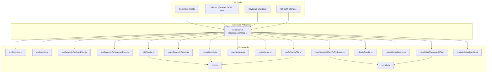
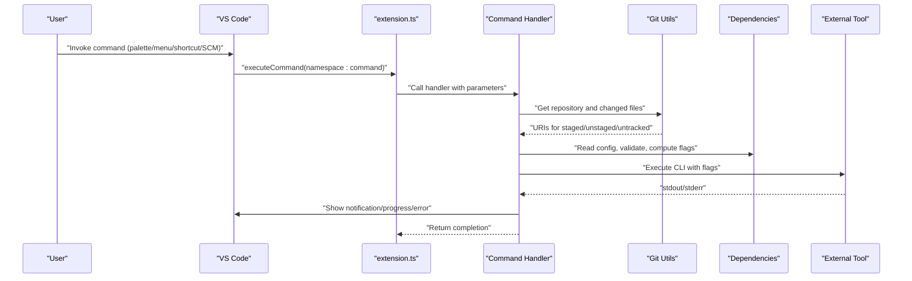
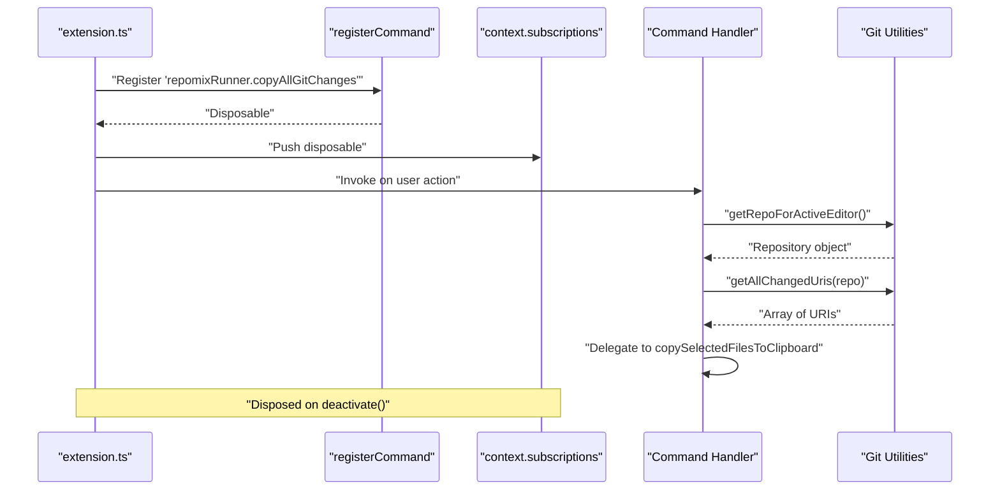
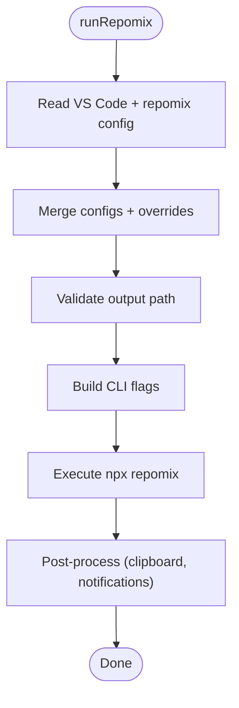
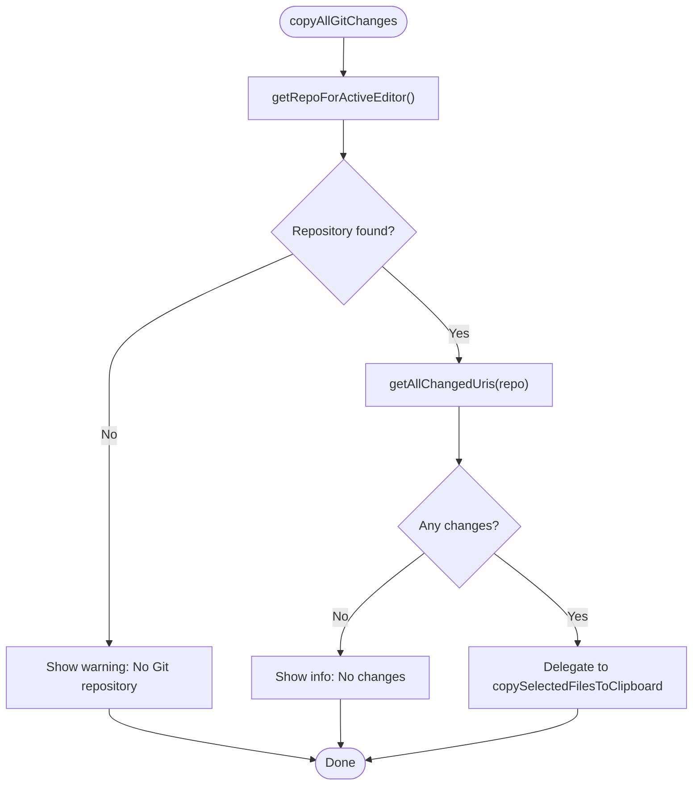
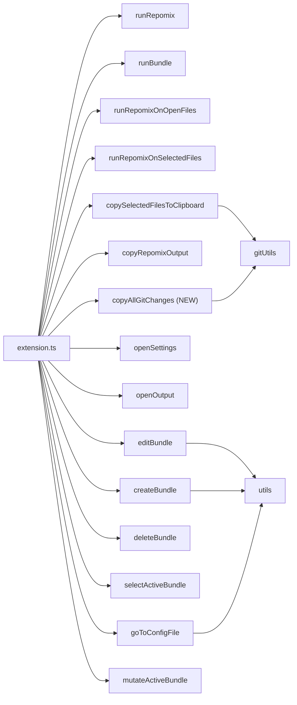

# Command System

<cite>
**Referenced Files in This Document**
- [package.json](file://package.json)
- [extension.ts](file://src/extension.ts)
- [runRepomix.ts](file://src/commands/runRepomix.ts)
- [runBundle.ts](file://src/commands/runBundle.ts)
- [runRepomixOnOpenFiles.ts](file://src/commands/runRepomixOnOpenFiles.ts)
- [runRepomixOnSelectedFiles.ts](file://src/commands/runRepomixOnSelectedFiles.ts)
- [copySelectedFilesToClipboard.ts](file://src/commands/copySelectedFilesToClipboard.ts)
- [copyRepomixOutput.ts](file://src/commands/copyRepomixOutput.ts)
- [openSettings.ts](file://src/commands/openSettings.ts)
- [openOutput.ts](file://src/commands/openOutput.ts)
- [createBundle.ts](file://src/commands/createBundle.ts)
- [editBundle.ts](file://src/commands/editBundle.ts)
- [deleteBundle.ts](file://src/commands/deleteBundle.ts)
- [selectActiveBundle.ts](file://src/commands/selectActiveBundle.ts)
- [goToConfigFile.ts](file://src/commands/goToConfigFile.ts)
- [mutateActiveBundle.ts](file://src/commands/mutateActiveBundle.ts)
- [utils.ts](file://src/commands/utils.ts)
- [gitUtils.ts](file://src/git/gitUtils.ts)
</cite>

## Update Summary
**Changes Made**
- Added documentation for the new 'Copy All Changed Files to Clipboard' command (repomixRunner.copyAllGitChanges)
- Updated Git SCM integration section to include the new command
- Enhanced Git utilities documentation with new functions
- Updated command registration and lifecycle section to include the new command
- Added Git SCM interface integration patterns

## Table of Contents
1. [Introduction](#introduction)
2. [Project Structure](#project-structure)
3. [Core Components](#core-components)
4. [Architecture Overview](#architecture-overview)
5. [Detailed Component Analysis](#detailed-component-analysis)
6. [Dependency Analysis](#dependency-analysis)
7. [Performance Considerations](#performance-considerations)
8. [Troubleshooting Guide](#troubleshooting-guide)
9. [Conclusion](#conclusion)
10. [Appendices](#appendices)

## Introduction
This document explains the Command System of the extension, covering how VS Code commands are registered, how command handlers are structured as pure functions, and how user interactions are orchestrated. It documents each command's purpose, parameters, execution flow, and user feedback mechanisms. It also covers command registration in package.json, command palette integration, keyboard shortcuts, error handling, progress reporting, command chaining, conditional visibility, dynamic generation of commands, and utility patterns for extending the system.

## Project Structure
The command system is organized around a central activation routine that registers commands and wires them to pure function-based handlers. Commands are grouped under the namespace and grouped by feature areas such as bundling, running Repomix, copying output, and settings. The system now includes Git SCM integration for quick access to repository changes.

**Diagram sources**
- [extension.ts](file://src/extension.ts#L390-L853)
- [runRepomix.ts](file://src/commands/runRepomix.ts#L48-L154)
- [runBundle.ts](file://src/commands/runBundle.ts#L15-L156)
- [runRepomixOnOpenFiles.ts](file://src/commands/runRepomixOnOpenFiles.ts#L8-L28)
- [runRepomixOnSelectedFiles.ts](file://src/commands/runRepomixOnSelectedFiles.ts#L26-L100)
- [copySelectedFilesToClipboard.ts](file://src/commands/copySelectedFilesToClipboard.ts#L67-L147)
- [copyRepomixOutput.ts](file://src/commands/copyRepomixOutput.ts#L18-L59)
- [openSettings.ts](file://src/commands/openSettings.ts#L3-L9)
- [openOutput.ts](file://src/commands/openOutput.ts#L3-L5)
- [createBundle.ts](file://src/commands/createBundle.ts#L7-L31)
- [editBundle.ts](file://src/commands/editBundle.ts#L6-L48)
- [deleteBundle.ts](file://src/commands/deleteBundle.ts#L5-L8)
- [selectActiveBundle.ts](file://src/commands/selectActiveBundle.ts#L6-L54)
- [goToConfigFile.ts](file://src/commands/goToConfigFile.ts#L10-L69)
- [mutateActiveBundle.ts](file://src/commands/mutateActiveBundle.ts#L15-L112)
- [utils.ts](file://src/commands/utils.ts#L5-L81)
- [gitUtils.ts](file://src/git/gitUtils.ts#L1-L122)

**Section sources**
- [extension.ts](file://src/extension.ts#L390-L853)
- [package.json](file://package.json#L309-L542)

## Core Components
- Pure function-based command handlers: Each command is a small, testable function that receives inputs and performs side effects via injected dependencies. Examples include runRepomix, runBundle, runRepomixOnOpenFiles, runRepomixOnSelectedFiles, copySelectedFilesToClipboard, copyRepomixOutput, openSettings, openOutput, createBundle, editBundle, deleteBundle, selectActiveBundle, goToConfigFile, mutateActiveBundle, and the new copyAllGitChanges command.
- Central registration: All commands are registered in extension.ts using vscode.commands.registerCommand and stored in context.subscriptions for lifecycle management.
- Configuration-driven behavior: Many commands read from VS Code settings and repomix configuration files to tailor behavior (e.g., output path, style, copy mode).
- User feedback: Commands consistently use notifications, warnings, and progress reporting to inform users of outcomes and long-running tasks.
- Security checks: Commands validate paths and configurations to prevent unsafe operations.
- Git SCM integration: New Git utilities provide seamless integration with VS Code's Git SCM interface for quick access to repository changes.

**Section sources**
- [extension.ts](file://src/extension.ts#L390-L853)
- [runRepomix.ts](file://src/commands/runRepomix.ts#L48-L154)
- [runBundle.ts](file://src/commands/runBundle.ts#L15-L156)
- [runRepomixOnOpenFiles.ts](file://src/commands/runRepomixOnOpenFiles.ts#L8-L28)
- [runRepomixOnSelectedFiles.ts](file://src/commands/runRepomixOnSelectedFiles.ts#L26-L100)
- [copySelectedFilesToClipboard.ts](file://src/commands/copySelectedFilesToClipboard.ts#L67-L147)
- [copyRepomixOutput.ts](file://src/commands/copyRepomixOutput.ts#L18-L59)
- [openSettings.ts](file://src/commands/openSettings.ts#L3-L9)
- [openOutput.ts](file://src/commands/openOutput.ts#L3-L5)
- [createBundle.ts](file://src/commands/createBundle.ts#L7-L31)
- [editBundle.ts](file://src/commands/editBundle.ts#L6-L48)
- [deleteBundle.ts](file://src/commands/deleteBundle.ts#L5-L8)
- [selectActiveBundle.ts](file://src/commands/selectActiveBundle.ts#L6-L54)
- [goToConfigFile.ts](file://src/commands/goToConfigFile.ts#L10-L69)
- [mutateActiveBundle.ts](file://src/commands/mutateActiveBundle.ts#L15-L112)
- [utils.ts](file://src/commands/utils.ts#L5-L81)
- [gitUtils.ts](file://src/git/gitUtils.ts#L1-L122)

## Architecture Overview
The command architecture follows a layered pattern:
- Presentation/UI: VS Code menus, command palette, keyboard shortcuts, and Git SCM interface trigger commands.
- Registration: extension.ts registers commands and wires them to pure function handlers.
- Execution: Handlers orchestrate configuration loading, validation, and external tool invocation.
- Feedback: Notifications, progress dialogs, and error messages communicate outcomes.
- Persistence: Some commands update bundle state or write files.
- Git Integration: New Git utilities provide seamless integration with VS Code's Git SCM interface.

**Diagram sources**
- [extension.ts](file://src/extension.ts#L780-L819)
- [gitUtils.ts](file://src/git/gitUtils.ts#L61-L106)
- [runRepomix.ts](file://src/commands/runRepomix.ts#L48-L154)
- [runRepomixOnSelectedFiles.ts](file://src/commands/runRepomixOnSelectedFiles.ts#L26-L100)

## Detailed Component Analysis

### Command Registration and Lifecycle
- Registration: All commands are registered in extension.ts with vscode.commands.registerCommand and pushed to context.subscriptions for disposal on deactivation.
- Lifecycle: Commands are long-lived during activation; subscriptions ensure proper cleanup. Background tasks (e.g., file watchers) are also managed here.
- Chaining: Some commands delegate to others (e.g., editBundle invokes selectActiveBundle internally, copyAllGitChanges delegates to copySelectedFilesToClipboard).
- Git Integration: New Git commands integrate seamlessly with existing command infrastructure.

**Diagram sources**
- [extension.ts](file://src/extension.ts#L780-L819)
- [gitUtils.ts](file://src/git/gitUtils.ts#L61-L106)

**Section sources**
- [extension.ts](file://src/extension.ts#L390-L853)

### Pure Function-Based Command Pattern
- Handlers are pure functions with explicit inputs and side effects isolated via injected dependencies.
- Common patterns:
  - Dependency injection for testability (e.g., defaultRunRepomixDeps).
  - Abort signals for cancellation support.
  - Override configuration merges for flexible behavior.
  - Validation and security checks before invoking external tools.
  - Git utilities integration for SCM operations.

Examples:
- runRepomix: orchestrates config reading, flag building, execution, and post-processing.
- runRepomixOnSelectedFiles: computes include patterns from URIs and delegates to runRepomix.
- runBundle: resolves bundle-specific overrides, validates output paths, filters missing files, and executes on selected files.
- copyAllGitChanges: integrates with Git SCM to copy all changed files to clipboard using existing copySelectedFilesToClipboard functionality.

**Section sources**
- [runRepomix.ts](file://src/commands/runRepomix.ts#L48-L154)
- [runRepomixOnSelectedFiles.ts](file://src/commands/runRepomixOnSelectedFiles.ts#L26-L100)
- [runBundle.ts](file://src/commands/runBundle.ts#L15-L156)
- [copySelectedFilesToClipboard.ts](file://src/commands/copySelectedFilesToClipboard.ts#L67-L147)
- [gitUtils.ts](file://src/git/gitUtils.ts#L61-L106)

### Command Palette, Menus, and Keyboard Shortcuts
- Contributes: package.json defines commands, categories, titles, icons, and menus.
- Menus:
  - Explorer context menu for file/folder actions (Run on Selection, Add to Bundle, Remove from Bundle).
  - View title/context menus for bundle management (Create, Run, Edit, Delete, Go to Config).
  - SCM resource state context menu for quick copy (Copy as Markdown to Clipboard).
  - SCM title menu for Git integration (Copy All Changed Files to Clipboard).
- Command palette: most commands are exposed; some are hidden via when clauses.
- Keyboard shortcuts: configured in package.json; commands are bound to repomixRunner.* identifiers.

**Updated** Added Git SCM integration with new copyAllGitChanges command in SCM title menu and copyFromScm in SCM resource state context menu.

**Section sources**
- [package.json](file://package.json#L430-L542)

### Git SCM Integration
- Git Utilities: Provides functions to access VS Code's Git extension API safely.
- Repository Detection: Automatically detects the Git repository for the active editor.
- Change Detection: Aggregates staged, unstaged, and untracked changes into a unified list.
- Count Reporting: Provides change counts for user feedback.
- Integration Patterns: Seamless delegation to existing copySelectedFilesToClipboard functionality.

**New Section** The Git SCM integration enables users to quickly access repository changes through VS Code's native Git interface, providing both command palette and SCM title bar access.

**Section sources**
- [gitUtils.ts](file://src/git/gitUtils.ts#L1-L122)
- [extension.ts](file://src/extension.ts#L780-L819)

### Command Handlers Overview

#### runRepomix
- Purpose: Execute Repomix on the entire workspace root with merged configuration.
- Parameters: Optional dependency overrides and signal for cancellation.
- Flow:
  - Read VS Code and repomix configs.
  - Merge and validate configuration (security checks on output path).
  - Build CLI flags and execute via npx.
  - Copy to clipboard if enabled; notify outcome; optionally keep/remove output file.
- Error handling: Catches errors, logs, shows messages, respects AbortSignal.

**Diagram sources**
- [runRepomix.ts](file://src/commands/runRepomix.ts#L48-L154)

**Section sources**
- [runRepomix.ts](file://src/commands/runRepomix.ts#L48-L154)

#### runBundle
- Purpose: Run Repomix on a bundle's files with bundle-specific overrides.
- Parameters: bundleManager, bundleId, optional AbortSignal, additional overrides.
- Flow:
  - Load bundle and merge overrides; validate output path.
  - Compute final output filename and extension.
  - Resolve URIs, validate existence, warn about missing files.
  - Delegate to runRepomixOnSelectedFiles with computed include patterns.
  - Update lastUsed timestamp.

**Section sources**
- [runBundle.ts](file://src/commands/runBundle.ts#L15-L156)

#### runRepomixOnOpenFiles
- Purpose: Run Repomix on currently open editor files.
- Flow: Collect open files, set include override, call runRepomix with merged config.

**Section sources**
- [runRepomixOnOpenFiles.ts](file://src/commands/runRepomixOnOpenFiles.ts#L8-L28)

#### runRepomixOnSelectedFiles
- Purpose: Run Repomix on a set of selected URIs with optional include patterns.
- Flow: Compute include patterns per URI (directory expansion with override patterns), optionally log run to DB, then run runRepomix with merged config.

**Section sources**
- [runRepomixOnSelectedFiles.ts](file://src/commands/runRepomixOnSelectedFiles.ts#L26-L100)

#### copySelectedFilesToClipboard
- Purpose: Copy selected files (or folders expanded) as Markdown to clipboard.
- Flow: Expand URIs to files (limit), compute relative paths, validate safety, generate Markdown (content or via repomix), write to clipboard, show token count.

**Section sources**
- [copySelectedFilesToClipboard.ts](file://src/commands/copySelectedFilesToClipboard.ts#L67-L147)

#### copyRepomixOutput
- Purpose: Find and copy the Repomix output file to clipboard.
- Flow: Resolve output path from config or defaults, check existence, read content, copy to clipboard, notify.

**Section sources**
- [copyRepomixOutput.ts](file://src/commands/copyRepomixOutput.ts#L18-L59)

#### copyAllGitChanges (NEW)
- Purpose: Copy all changed Git files (staged, unstaged, untracked) to clipboard.
- Parameters: None (uses active editor's repository context).
- Flow:
  - Detect Git repository for active editor using getRepoForActiveEditor().
  - Retrieve all changed URIs using getAllChangedUris(repo).
  - Validate that changes exist and provide appropriate feedback.
  - Delegate to copySelectedFilesToClipboard with all changed files.
  - Handle errors gracefully with user-friendly messages.
- Integration: Seamlessly integrates with existing copySelectedFilesToClipboard functionality.

**New Section** The copyAllGitChanges command provides quick access to all repository changes through VS Code's Git SCM interface, appearing in both the Command Palette and Git SCM title bar.

**Diagram sources**
- [extension.ts](file://src/extension.ts#L780-L819)
- [gitUtils.ts](file://src/git/gitUtils.ts#L61-L106)

**Section sources**
- [extension.ts](file://src/extension.ts#L780-L819)
- [gitUtils.ts](file://src/git/gitUtils.ts#L61-L106)

#### copyFromScm (ADDED)
- Purpose: Adapter command to convert SCM resource states to URIs and delegate to copySelectedFilesToClipboard.
- Parameters: Single resource or array of resources from SCM context menu.
- Flow: Extract URIs from SCM resource states, handle single/multiple selection, delegate to copySelectedFilesToClipboard.

**Updated** Added copyFromScm command to bridge Git SCM context menu to clipboard functionality.

**Section sources**
- [extension.ts](file://src/extension.ts#L762-L777)

#### openSettings
- Purpose: Open VS Code settings filtered to extension settings.

**Section sources**
- [openSettings.ts](file://src/commands/openSettings.ts#L3-L9)

#### openOutput
- Purpose: Show the extension output channel.

**Section sources**
- [openOutput.ts](file://src/commands/openOutput.ts#L3-L5)

#### createBundle
- Purpose: Create a new bundle via interactive form and set as active.

**Section sources**
- [createBundle.ts](file://src/commands/createBundle.ts#L7-L31)

#### editBundle
- Purpose: Edit active bundle metadata and config association.
- Flow: Optionally select active bundle, then present form with edition mode.

**Section sources**
- [editBundle.ts](file://src/commands/editBundle.ts#L6-L48)

#### deleteBundle
- Purpose: Delete the selected bundle and notify.

**Section sources**
- [deleteBundle.ts](file://src/commands/deleteBundle.ts#L5-L8)

#### selectActiveBundle
- Purpose: Present a Quick Pick to choose the active bundle.

**Section sources**
- [selectActiveBundle.ts](file://src/commands/selectActiveBundle.ts#L6-L54)

#### goToConfigFile
- Purpose: Associate a bundle with a repomix config file or create one.
- Flow: Set active bundle, offer to reuse existing config, or create a new one, then open editor.

**Section sources**
- [goToConfigFile.ts](file://src/commands/goToConfigFile.ts#L10-L69)

#### mutateActiveBundle
- Purpose: Add or remove files from the active bundle with normalization and directory handling.
- Flow: Normalize paths, deduplicate, expand directories, remove subpaths, persist updates.

**Section sources**
- [mutateActiveBundle.ts](file://src/commands/mutateActiveBundle.ts#L15-L112)

#### utils
- Purpose: Shared UI helpers for bundle forms and config selection.
- Features: Input validation, Quick Pick with current selection, config file discovery.

**Section sources**
- [utils.ts](file://src/commands/utils.ts#L5-L81)

### User Interaction Patterns
- Input boxes and Quick Picks for names, descriptions, tags, and config selection.
- Progress dialogs for long-running operations (e.g., copy to clipboard, smart agent).
- Notifications for success, warnings for partial results, and error dialogs for failures.
- Modal confirmations for destructive actions (e.g., missing file handling in runBundle).
- Git SCM integration: Direct access to repository changes through VS Code's native Git interface.

**Updated** Added Git SCM interaction patterns for quick repository change access.

**Section sources**
- [runBundle.ts](file://src/commands/runBundle.ts#L109-L121)
- [copySelectedFilesToClipboard.ts](file://src/commands/copySelectedFilesToClipboard.ts#L119-L133)
- [utils.ts](file://src/commands/utils.ts#L17-L81)

### Error Handling Strategies
- AbortSignal propagation: runRepomix and runBundle respect AbortSignal to cancel execution gracefully.
- Validation: Output path validation prevents escaping workspace; relative path checks ensure safety.
- User feedback: Errors are logged and surfaced via showErrorMessage; warnings guide users to correct actions.
- Graceful degradation: Missing files in bundles are filtered; empty output files are handled.
- Git error handling: Safe access to Git extension API with fallbacks and user-friendly error messages.

**Updated** Added Git error handling patterns for safe Git extension API access.

**Section sources**
- [runRepomix.ts](file://src/commands/runRepomix.ts#L141-L154)
- [runBundle.ts](file://src/commands/runBundle.ts#L75-L82)
- [runBundle.ts](file://src/commands/runBundle.ts#L109-L121)
- [gitUtils.ts](file://src/git/gitUtils.ts#L32-L52)

### Progress Reporting
- withProgress: Used for copySelectedFilesToClipboard and smartRun to show ongoing work and optional cancellation.
- Notifications: Temporary notifications provide immediate feedback for short operations.
- Git feedback: Console logging with change counts for debugging and user awareness.

**Updated** Added Git change counting and logging for user feedback.

**Section sources**
- [copySelectedFilesToClipboard.ts](file://src/commands/copySelectedFilesToClipboard.ts#L119-L133)
- [extension.ts](file://src/extension.ts#L562-L625)
- [gitUtils.ts](file://src/git/gitUtils.ts#L115-L121)

### Command Chaining Patterns
- editBundle invokes selectActiveBundle when no bundleId is provided.
- runBundle may call selectActiveBundle indirectly via the command registry if no node is passed.
- copyFromScm delegates to copySelectedFilesToClipboard with extracted URIs.
- copyAllGitChanges delegates to copySelectedFilesToClipboard with all changed files.
- Git utilities provide seamless integration between SCM interface and clipboard functionality.

**Updated** Added Git command chaining patterns and utility integration.

**Section sources**
- [editBundle.ts](file://src/commands/editBundle.ts#L13-L17)
- [extension.ts](file://src/extension.ts#L694-L709)
- [extension.ts](file://src/extension.ts#L780-L819)

### Conditional Visibility and Dynamic Generation
- Menus define when clauses to control visibility (e.g., view == repomixBundles, explorerResourceIsFolder || resourceLangId, scmProvider == git).
- Command palette entries can be hidden via when: never to prevent direct invocation.
- Dynamic command generation occurs implicitly through Quick Picks and forms (e.g., bundle creation, config selection).
- Git SCM integration uses when clauses to restrict commands to Git repositories.

**Updated** Added Git SCM conditional visibility patterns.

**Section sources**
- [package.json](file://package.json#L416-L542)

### Utility Functions Supporting Commands
- bundleForm: Interactive form for bundle metadata and config association.
- askForConfig: Discover and pick repomix config files in the workspace.
- Path utilities: normalize paths, file extensions, and output filename generation.
- Git utilities: Safe Git API access, repository detection, change aggregation, and change counting.

**Updated** Added Git utility functions for SCM integration.

**Section sources**
- [utils.ts](file://src/commands/utils.ts#L5-L81)
- [gitUtils.ts](file://src/git/gitUtils.ts#L1-L122)

### Implementing Custom Commands and Integrating External Tools
- Pattern:
  - Define a pure function handler with typed dependencies.
  - Inject dependencies for testability (e.g., defaultRunRepomixDeps).
  - Use withProgress for long-running tasks.
  - Validate inputs and report errors via showErrorMessage.
  - Register the command in extension.ts and contribute it in package.json.
  - Integrate with VS Code APIs (e.g., Git SCM) for enhanced UX.
- Example integrations:
  - External tool execution: runRepomix uses npx to invoke repomix.
  - Clipboard operations: copySelectedFilesToClipboard writes Markdown to clipboard.
  - File operations: goToConfigFile creates and opens config files.
  - Git SCM integration: copyAllGitChanges provides quick access to repository changes.

**Updated** Added Git SCM integration patterns for enhanced external tool integration.

**Section sources**
- [runRepomix.ts](file://src/commands/runRepomix.ts#L48-L154)
- [copySelectedFilesToClipboard.ts](file://src/commands/copySelectedFilesToClipboard.ts#L67-L147)
- [goToConfigFile.ts](file://src/commands/goToConfigFile.ts#L75-L113)
- [extension.ts](file://src/extension.ts#L390-L853)
- [package.json](file://package.json#L309-L542)
- [gitUtils.ts](file://src/git/gitUtils.ts#L1-L122)

## Dependency Analysis
The command system exhibits low coupling and high cohesion:
- Commands depend on pure functions and injected dependencies.
- Configuration is centralized and validated before execution.
- Side effects are isolated in shared utilities (logger, notifications, file operations).
- Git utilities provide clean abstraction over VS Code's Git extension API.
- Command handlers delegate appropriately to minimize complexity.

**Diagram sources**
- [extension.ts](file://src/extension.ts#L390-L853)
- [utils.ts](file://src/commands/utils.ts#L5-L81)
- [gitUtils.ts](file://src/git/gitUtils.ts#L1-L122)

**Section sources**
- [extension.ts](file://src/extension.ts#L390-L853)

## Performance Considerations
- Concurrency and batching:
  - runRepomixOnSelectedFiles computes include patterns efficiently and delegates to runRepomix.
  - Background indexing uses debounced file watching; consider similar patterns for long-running commands.
  - Git utilities cache repository detection results to avoid repeated API calls.
- Resource limits:
  - copySelectedFilesToClipboard caps file expansion to prevent heavy operations.
  - Git change aggregation deduplicates URIs to prevent redundant processing.
- Cancellation:
  - Respect AbortSignal to stop long-running tasks promptly.
- Logging:
  - Verbose logging can expose sensitive info; redact before display.
  - Git operations log change counts for debugging without exposing file contents.

## Troubleshooting Guide
- Command does not appear in palette:
  - Verify contributes.commands and ensure when clauses are appropriate.
  - Check Git SCM integration requires scmProvider == git when clause.
- Permission or path errors:
  - Check output path validation and relative path handling.
- External tool failures:
  - Review stderr handling and error surfacing.
- Missing configuration:
  - Ensure repomix config is present or create via goToConfigFile.
- Long-running operations:
  - Use withProgress and provide cancellation where supported.
- Git integration issues:
  - Verify VS Code Git extension is installed and activated.
  - Check that the active editor belongs to a Git repository.
  - Ensure proper when clauses (scmProvider == git) are met.

**Updated** Added Git integration troubleshooting guidance.

**Section sources**
- [package.json](file://package.json#L309-L542)
- [runRepomix.ts](file://src/commands/runRepomix.ts#L75-L80)
- [goToConfigFile.ts](file://src/commands/goToConfigFile.ts#L75-L113)
- [gitUtils.ts](file://src/git/gitUtils.ts#L32-L52)

## Conclusion
The command system is designed around pure function handlers, explicit dependency injection, robust validation, and consistent user feedback. Commands are centrally registered, conditionally exposed, and integrated with VS Code UI affordances. The architecture supports extension, testing, and safe execution of external tools while maintaining a clear separation of concerns. Recent additions include Git SCM integration that seamlessly bridges VS Code's native Git interface with the extension's clipboard functionality, providing users with quick access to repository changes through familiar UI patterns.

## Appendices

### Command Reference Summary
- runRepomix: Run on workspace root with merged config.
- runBundle: Run on active bundle files with bundle-specific overrides.
- runOnOpenFiles: Run on open editors.
- runOnSelectedFiles: Run on selected URIs with include patterns.
- copySelectedFilesToClipboard: Copy selected files as Markdown.
- copyRepomixOutput: Copy the Repomix output file to clipboard.
- copyAllGitChanges (NEW): Copy all changed Git files to clipboard.
- copyFromScm (ADDED): Adapter for Git SCM context menu to clipboard.
- openSettings: Open extension settings.
- openOutput: Show output channel.
- createBundle: Create a new bundle.
- editBundle: Edit active bundle metadata and config.
- deleteBundle: Delete a bundle.
- selectActiveBundle: Choose active bundle.
- goToConfigFile: Associate or create a repomix config for a bundle.
- add/remove files to/from active bundle: Manage bundle contents.

**Updated** Added new commands: copyAllGitChanges and copyFromScm.

**Section sources**
- [extension.ts](file://src/extension.ts#L390-L853)
- [package.json](file://package.json#L309-L542)