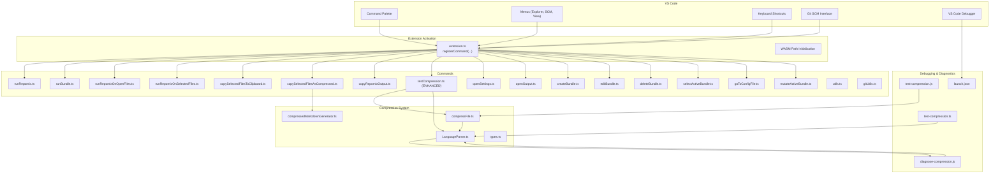
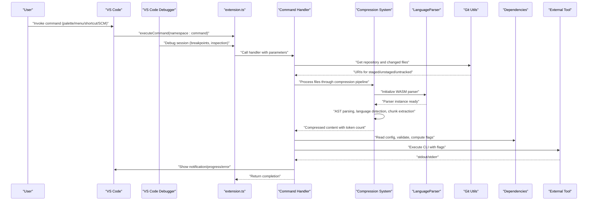
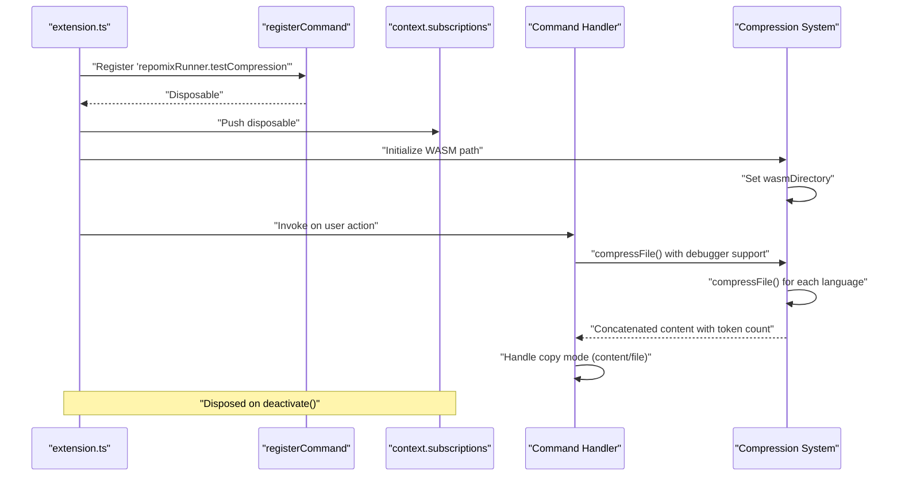
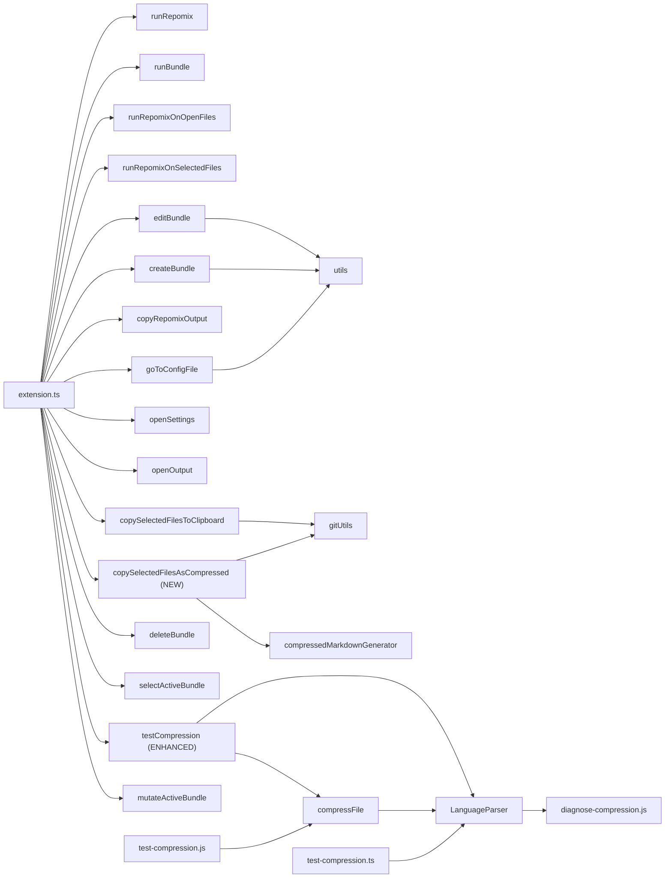

# Command System

<cite>
**Referenced Files in This Document**
- [package.json](file://package.json)
- [extension.ts](file://src/extension.ts)
- [runRepomix.ts](file://src/commands/runRepomix.ts)
- [runBundle.ts](file://src/commands/runBundle.ts)
- [runRepomixOnOpenFiles.ts](file://src/commands/runRepomixOnOpenFiles.ts)
- [runRepomixOnSelectedFiles.ts](file://src/commands/runRepomixOnSelectedFiles.ts)
- [copySelectedFilesToClipboard.ts](file://src/commands/copySelectedFilesToClipboard.ts)
- [copySelectedFilesAsCompressed.ts](file://src/commands/copySelectedFilesAsCompressed.ts)
- [copyRepomixOutput.ts](file://src/commands/copyRepomixOutput.ts)
- [openSettings.ts](file://src/commands/openSettings.ts)
- [openOutput.ts](file://src/commands/openOutput.ts)
- [createBundle.ts](file://src/commands/createBundle.ts)
- [editBundle.ts](file://src/commands/editBundle.ts)
- [deleteBundle.ts](file://src/commands/deleteBundle.ts)
- [selectActiveBundle.ts](file://src/commands/selectActiveBundle.ts)
- [goToConfigFile.ts](file://src/commands/goToConfigFile.ts)
- [mutateActiveBundle.ts](file://src/commands/mutateActiveBundle.ts)
- [testCompression.ts](file://src/commands/testCompression.ts)
- [utils.ts](file://src/commands/utils.ts)
- [gitUtils.ts](file://src/git/gitUtils.ts)
- [compressedMarkdownGenerator.ts](file://src/core/files/compressedMarkdownGenerator.ts)
- [compressFile.ts](file://src/core/compression/compressFile.ts)
- [LanguageParser.ts](file://src/core/compression/LanguageParser.ts)
- [types.ts](file://src/core/compression/types.ts)
- [test-compression.ts](file://src/test-compression.ts)
- [test-compression.js](file://scripts/test-compression.js)
- [diagnose-compression.js](file://scripts/diagnose-compression.js)
- [.vscode/launch.json](file://.vscode/launch.json)
</cite>

## Update Summary
**Changes Made**
- Enhanced testCompression command documentation with VS Code debugger integration details
- Added comprehensive programmatic usage examples for compression testing
- Included command-line verification procedures using dedicated test scripts
- Expanded troubleshooting guidance for compression system with WASM parser availability and Tree-Sitter library validation
- Updated compression system architecture to reflect debugger integration and diagnostic capabilities

## Table of Contents
1. [Introduction](#introduction)
2. [Project Structure](#project-structure)
3. [Core Components](#core-components)
4. [Architecture Overview](#architecture-overview)
5. [Detailed Component Analysis](#detailed-component-analysis)
6. [Dependency Analysis](#dependency-analysis)
7. [Performance Considerations](#performance-considerations)
8. [Troubleshooting Guide](#troubleshooting-guide)
9. [Conclusion](#conclusion)
10. [Appendices](#appendices)

## Introduction
This document explains the Command System of the extension, covering how VS Code commands are registered, how command handlers are structured as pure functions, and how user interactions are orchestrated. It documents each command's purpose, parameters, execution flow, and user feedback mechanisms. It also covers command registration in package.json, command palette integration, keyboard shortcuts, error handling, progress reporting, command chaining, conditional visibility, dynamic generation of commands, and utility patterns for extending the system.

## Project Structure
The command system is organized around a central activation routine that registers commands and wires them to pure function-based handlers. Commands are grouped under the namespace and grouped by feature areas such as bundling, running Repomix, copying output, compression testing, and settings. The system now includes advanced compression capabilities for intelligent code extraction and AST-based file processing, with comprehensive debugging and diagnostic support.

**Diagram sources**
- [extension.ts](file://src/extension.ts#L54-L63)
- [testCompression.ts](file://src/commands/testCompression.ts#L1-L39)
- [compressFile.ts](file://src/core/compression/compressFile.ts#L25-L85)
- [LanguageParser.ts](file://src/core/compression/LanguageParser.ts#L79-L93)
- [test-compression.ts](file://src/test-compression.ts#L1-L515)
- [test-compression.js](file://scripts/test-compression.js#L1-L190)
- [diagnose-compression.js](file://scripts/diagnose-compression.js#L1-L116)
- [.vscode/launch.json](file://.vscode/launch.json#L1-L44)

**Section sources**
- [extension.ts](file://src/extension.ts#L50-L927)
- [package.json](file://package.json#L20-L32)

## Core Components
- Pure function-based command handlers: Each command is a small, testable function that receives inputs and performs side effects via injected dependencies. Examples include runRepomix, runBundle, runRepomixOnOpenFiles, runRepomixOnSelectedFiles, copySelectedFilesToClipboard, copySelectedFilesAsCompressed, copyRepomixOutput, testCompression, openSettings, openOutput, createBundle, editBundle, deleteBundle, selectActiveBundle, goToConfigFile, mutateActiveBundle.
- Central registration: All commands are registered in extension.ts using vscode.commands.registerCommand and stored in context.subscriptions for lifecycle management.
- Configuration-driven behavior: Many commands read from VS Code settings and repomix configuration files to tailor behavior (e.g., output path, style, copy mode).
- User feedback: Commands consistently use notifications, warnings, and progress reporting to inform users of outcomes and long-running tasks.
- Security checks: Commands validate paths and configurations to prevent unsafe operations.
- Advanced compression system: New compression capabilities provide AST-based code extraction and intelligent file compression for reduced token count.
- Git SCM integration: Seamless integration with VS Code's Git SCM interface for quick access to repository changes.
- **Enhanced Debugging Support**: Comprehensive VS Code debugger integration with dedicated launch configurations for extension development and testing.
- **Diagnostic Tooling**: Built-in diagnostic scripts for compression system health checking and troubleshooting.

**Section sources**
- [extension.ts](file://src/extension.ts#L50-L927)
- [testCompression.ts](file://src/commands/testCompression.ts#L1-L39)
- [.vscode/launch.json](file://.vscode/launch.json#L1-L44)

## Architecture Overview
The command architecture follows a layered pattern:
- Presentation/UI: VS Code menus, command palette, keyboard shortcuts, Git SCM interface, and debugger trigger commands.
- Registration: extension.ts registers commands and wires them to pure function handlers.
- Execution: Handlers orchestrate configuration loading, validation, external tool invocation, and compression processing.
- Feedback: Notifications, progress dialogs, and error messages communicate outcomes.
- Persistence: Some commands update bundle state or write files.
- Compression pipeline: Advanced compression system processes files through AST parsing and intelligent extraction.
- Git Integration: Seamless integration with VS Code's Git SCM interface.
- **Debugging Integration**: VS Code debugger provides breakpoints, step-through debugging, and real-time inspection of compression operations.

**Diagram sources**
- [extension.ts](file://src/extension.ts#L54-L63)
- [testCompression.ts](file://src/commands/testCompression.ts#L28-L37)
- [LanguageParser.ts](file://src/core/compression/LanguageParser.ts#L79-L93)
- [compressFile.ts](file://src/core/compression/compressFile.ts#L35-L44)

## Detailed Component Analysis

### Command Registration and Lifecycle
- Registration: All commands are registered in extension.ts with vscode.commands.registerCommand and pushed to context.subscriptions for disposal on deactivation.
- Lifecycle: Commands are long-lived during activation; subscriptions ensure proper cleanup. Background tasks (e.g., file watchers) are also managed here.
- Chaining: Some commands delegate to others (e.g., editBundle invokes selectActiveBundle internally, copySelectedFilesAsCompressed delegates to compression system).
- Compression integration: New commands integrate seamlessly with existing compression infrastructure.
- **WASM Initialization**: Extension initializes WASM parser directory during activation for optimal compression performance.

**Diagram sources**
- [extension.ts](file://src/extension.ts#L54-L63)
- [extension.ts](file://src/extension.ts#L902-L902)
- [testCompression.ts](file://src/commands/testCompression.ts#L20-L26)
- [compressFile.ts](file://src/core/compression/compressFile.ts#L25-L85)

**Section sources**
- [extension.ts](file://src/extension.ts#L50-L927)

### Pure Function-Based Command Pattern
- Handlers are pure functions with explicit inputs and side effects isolated via injected dependencies.
- Common patterns:
  - Dependency injection for testability (e.g., defaultRunRepomixDeps).
  - Abort signals for cancellation support.
  - Override configuration merges for flexible behavior.
  - Validation and security checks before invoking external tools.
  - Advanced compression pipeline integration for intelligent file processing.
  - Git utilities integration for SCM operations.
  - **Enhanced Error Handling**: Comprehensive error catching and user-friendly error messages for compression failures.

Examples:
- runRepomix: orchestrates config reading, flag building, execution, and post-processing.
- runRepomixOnSelectedFiles: computes include patterns from URIs and delegates to runRepomix.
- runBundle: resolves bundle-specific overrides, validates output paths, filters missing files, and executes on selected files.
- copySelectedFilesAsCompressed: integrates with compression system to extract essential code structures while maintaining token efficiency.
- **testCompression (Enhanced)**: provides interactive compression testing with VS Code debugger integration, programmatic usage examples, and comprehensive error handling.

**Section sources**
- [runRepomix.ts](file://src/commands/runRepomix.ts#L48-L154)
- [runRepomixOnSelectedFiles.ts](file://src/commands/runRepomixOnSelectedFiles.ts#L26-L100)
- [runBundle.ts](file://src/commands/runBundle.ts#L15-L156)
- [copySelectedFilesToClipboard.ts](file://src/commands/copySelectedFilesToClipboard.ts#L67-L147)
- [copySelectedFilesAsCompressed.ts](file://src/commands/copySelectedFilesAsCompressed.ts#L58-L170)
- [testCompression.ts](file://src/commands/testCompression.ts#L1-L39)

### Command Palette, Menus, and Keyboard Shortcuts
- Contributes: package.json defines commands, categories, titles, icons, and menus.
- Menus:
  - Explorer context menu for file/folder actions (Run on Selection, Add to Bundle, Remove from Bundle, Copy as Markdown to Clipboard, Copy as Compressed Repomix to Clipboard).
  - View title/context menus for bundle management (Create, Run, Edit, Delete, Go to Config).
  - SCM resource state context menu for quick copy (Copy as Markdown to Clipboard).
  - SCM title menu for Git integration (Copy All Changed Files to Clipboard).
- Command palette: most commands are exposed; some are hidden via when clauses.
- Keyboard shortcuts: configured in package.json; commands are bound to repomixRunner.* identifiers.
- New commands: Copy as Compressed Repomix to Clipboard and Test Compression are now available in command palette and explorer context menus.

**Updated** Added new commands: Copy as Compressed Repomix to Clipboard and Test Compression with appropriate menu integration and keyboard shortcuts.

**Section sources**
- [package.json](file://package.json#L333-L591)

### Git SCM Integration
- Git Utilities: Provides functions to access VS Code's Git extension API safely.
- Repository Detection: Automatically detects the Git repository for the active editor.
- Change Detection: Aggregates staged, unstaged, and untracked changes into a unified list.
- Count Reporting: Provides change counts for user feedback.
- Integration Patterns: Seamless delegation to existing copySelectedFilesToClipboard functionality.

**New Section** The Git SCM integration enables users to quickly access repository changes through VS Code's native Git interface, providing both command palette and SCM title bar access.

**Section sources**
- [gitUtils.ts](file://src/git/gitUtils.ts#L1-L122)
- [extension.ts](file://src/extension.ts#L850-L890)

### Command Handlers Overview

#### runRepomix
- Purpose: Execute Repomix on the entire workspace root with merged configuration.
- Parameters: Optional dependency overrides and signal for cancellation.
- Flow:
  - Read VS Code and repomix configs.
  - Merge and validate configuration (security checks on output path).
  - Build CLI flags and execute via npx.
  - Copy to clipboard if enabled; notify outcome; optionally keep/remove output file.
- Error handling: Catches errors, logs, shows messages, respects AbortSignal.

**Diagram sources**
- [runRepomix.ts](file://src/commands/runRepomix.ts#L48-L154)

**Section sources**
- [runRepomix.ts](file://src/commands/runRepomix.ts#L48-L154)

#### runBundle
- Purpose: Run Repomix on a bundle's files with bundle-specific overrides.
- Parameters: bundleManager, bundleId, optional AbortSignal, additional overrides.
- Flow:
  - Load bundle and merge overrides; validate output path.
  - Compute final output filename and extension.
  - Resolve URIs, validate existence, warn about missing files.
  - Delegate to runRepomixOnSelectedFiles with computed include patterns.
  - Update lastUsed timestamp.

**Section sources**
- [runBundle.ts](file://src/commands/runBundle.ts#L15-L156)

#### runRepomixOnOpenFiles
- Purpose: Run Repomix on currently open editor files.
- Flow: Collect open files, set include override, call runRepomix with merged config.

**Section sources**
- [runRepomixOnOpenFiles.ts](file://src/commands/runRepomixOnOpenFiles.ts#L8-L28)

#### runRepomixOnSelectedFiles
- Purpose: Run Repomix on a set of selected URIs with optional include patterns.
- Flow: Compute include patterns per URI (directory expansion with override patterns), optionally log run to DB, then run runRepomix with merged config.

**Section sources**
- [runRepomixOnSelectedFiles.ts](file://src/commands/runRepomixOnSelectedFiles.ts#L26-L100)

#### copySelectedFilesToClipboard
- Purpose: Copy selected files (or folders expanded) as Markdown to clipboard.
- Flow: Expand URIs to files (limit), compute relative paths, validate safety, generate Markdown (content or via repomix), write to clipboard, show token count.

**Section sources**
- [copySelectedFilesToClipboard.ts](file://src/commands/copySelectedFilesToClipboard.ts#L67-L147)

#### copySelectedFilesAsCompressed (NEW)
- Purpose: Copy selected files as compressed Markdown to clipboard using AST-based extraction.
- Parameters: extension context, clicked file URI, optional selected files array.
- Flow:
  - Expand URIs to files (up to 50 files limit), validate workspace boundaries.
  - Generate compressed content using generateCompressedMarkdownContent.
  - Handle copy mode: content mode writes directly to clipboard, file mode writes to temp file and uses existing copyToClipboard.
  - Show progress dialog during compression process.
  - Display token count and success notification.
- Compression pipeline: Uses LanguageParser with Tree-Sitter WASM parsers to extract function/class signatures and essential code structures.
- Error handling: Validates file lists, handles binary files gracefully, provides user-friendly error messages.

**New Section** The copySelectedFilesAsCompressed command provides intelligent code compression through AST-based extraction, significantly reducing token count while preserving essential code structures.

**Diagram sources**
- [copySelectedFilesAsCompressed.ts](file://src/commands/copySelectedFilesAsCompressed.ts#L58-L170)
- [compressedMarkdownGenerator.ts](file://src/core/files/compressedMarkdownGenerator.ts#L11-L58)
- [compressFile.ts](file://src/core/compression/compressFile.ts#L74-L133)

**Section sources**
- [copySelectedFilesAsCompressed.ts](file://src/commands/copySelectedFilesAsCompressed.ts#L58-L170)
- [compressedMarkdownGenerator.ts](file://src/core/files/compressedMarkdownGenerator.ts#L11-L70)
- [compressFile.ts](file://src/core/compression/compressFile.ts#L74-L133)

#### copyRepomixOutput
- Purpose: Find and copy the Repomix output file to clipboard.
- Flow: Resolve output path from config or defaults, check existence, read content, copy to clipboard, notify.

**Section sources**
- [copyRepomixOutput.ts](file://src/commands/copyRepomixOutput.ts#L18-L59)

#### testCompression (ENHANCED)
- Purpose: Test compression on the active TypeScript/JavaScript file with interactive options and comprehensive debugging support.
- Parameters: None (uses active editor context).
- Flow:
  - Validate active editor exists and is TypeScript/JavaScript file.
  - Prompt for function/class name to keep fully (optional).
  - Call compressFile with compression options.
  - Open new text document with compressed content beside original.
  - Display error messages for WASM/parser failures.
  - **Enhanced Features**:
    - VS Code debugger integration for step-by-step debugging
    - Programmatic usage examples for automated testing
    - Command-line verification procedures for CI/CD pipelines
    - Comprehensive error handling with detailed failure messages
- Integration: Uses compression system to demonstrate AST-based extraction capabilities.

**Updated** Enhanced testCompression command with VS Code debugger integration, programmatic usage examples, and command-line verification capabilities.

**Section sources**
- [testCompression.ts](file://src/commands/testCompression.ts#L1-L39)

#### openSettings
- Purpose: Open VS Code settings filtered to extension settings.

**Section sources**
- [openSettings.ts](file://src/commands/openSettings.ts#L3-L9)

#### openOutput
- Purpose: Show the extension output channel.

**Section sources**
- [openOutput.ts](file://src/commands/openOutput.ts#L3-L5)

#### createBundle
- Purpose: Create a new bundle via interactive form and set as active.

**Section sources**
- [createBundle.ts](file://src/commands/createBundle.ts#L7-L31)

#### editBundle
- Purpose: Edit active bundle metadata and config association.
- Flow: Optionally select active bundle, then present form with edition mode.

**Section sources**
- [editBundle.ts](file://src/commands/editBundle.ts#L6-L48)

#### deleteBundle
- Purpose: Delete the selected bundle and notify.

**Section sources**
- [deleteBundle.ts](file://src/commands/deleteBundle.ts#L5-L8)

#### selectActiveBundle
- Purpose: Present a Quick Pick to choose the active bundle.

**Section sources**
- [selectActiveBundle.ts](file://src/commands/selectActiveBundle.ts#L6-L54)

#### goToConfigFile
- Purpose: Associate a bundle with a repomix config file or create one.
- Flow: Set active bundle, offer to reuse existing config, or create a new one, then open editor.

**Section sources**
- [goToConfigFile.ts](file://src/commands/goToConfigFile.ts#L10-L69)

#### mutateActiveBundle
- Purpose: Add or remove files from the active bundle with normalization and directory handling.
- Flow: Normalize paths, deduplicate, expand directories, remove subpaths, persist updates.

**Section sources**
- [mutateActiveBundle.ts](file://src/commands/mutateActiveBundle.ts#L15-L112)

#### utils
- Purpose: Shared UI helpers for bundle forms and config selection.
- Features: Input validation, Quick Pick with current selection, config file discovery.

**Section sources**
- [utils.ts](file://src/commands/utils.ts#L5-L81)

### User Interaction Patterns
- Input boxes and Quick Picks for names, descriptions, tags, and config selection.
- Progress dialogs for long-running operations (e.g., copy to clipboard, smart agent, compression processing).
- Notifications for success, warnings for partial results, and error dialogs for failures.
- Modal confirmations for destructive actions (e.g., missing file handling in runBundle).
- Git SCM integration: Direct access to repository changes through VS Code's native Git interface.
- Compression testing: Interactive input for specifying which functions/classes to keep fully.
- **Enhanced Debugging**: VS Code debugger integration allows for breakpoints, variable inspection, and step-through debugging of compression operations.

**Updated** Added compression testing interaction patterns with function/class name input and comprehensive debugging support.

**Section sources**
- [runBundle.ts](file://src/commands/runBundle.ts#L109-L121)
- [copySelectedFilesToClipboard.ts](file://src/commands/copySelectedFilesToClipboard.ts#L119-L133)
- [copySelectedFilesAsCompressed.ts](file://src/commands/copySelectedFilesAsCompressed.ts#L110-L127)
- [testCompression.ts](file://src/commands/testCompression.ts#L15-L18)
- [utils.ts](file://src/commands/utils.ts#L17-L81)

### Error Handling Strategies
- AbortSignal propagation: runRepomix and runBundle respect AbortSignal to cancel execution gracefully.
- Validation: Output path validation prevents escaping workspace; relative path checks ensure safety.
- User feedback: Errors are logged and surfaced via showErrorMessage; warnings guide users to correct actions.
- Graceful degradation: Missing files in bundles are filtered; empty output files are handled.
- Git error handling: Safe access to Git extension API with fallbacks and user-friendly error messages.
- Compression error handling: Binary file detection, WASM parser failures, and fallback to full content when compression unsupported.
- **Enhanced Error Reporting**: Comprehensive error messages for WASM parser loading failures, language support issues, and Tree-Sitter library validation problems.

**Updated** Added compression error handling patterns for robust file processing and enhanced debugging capabilities.

**Section sources**
- [runRepomix.ts](file://src/commands/runRepomix.ts#L141-L154)
- [runBundle.ts](file://src/commands/runBundle.ts#L75-L82)
- [runBundle.ts](file://src/commands/runBundle.ts#L109-L121)
- [gitUtils.ts](file://src/git/gitUtils.ts#L32-L52)
- [compressedMarkdownGenerator.ts](file://src/core/files/compressedMarkdownGenerator.ts#L31-L47)
- [compressFile.ts](file://src/core/compression/compressFile.ts#L80-L83)

### Progress Reporting
- withProgress: Used for copySelectedFilesToClipboard, copySelectedFilesAsCompressed, and smartRun to show ongoing work and optional cancellation.
- Notifications: Temporary notifications provide immediate feedback for short operations.
- Git feedback: Console logging with change counts for debugging and user awareness.
- Compression progress: Real-time feedback during AST parsing and chunk extraction.
- **Debugging Progress**: VS Code debugger provides real-time progress monitoring and variable inspection during compression operations.

**Updated** Added compression progress reporting for long-running AST parsing operations and debugging support.

**Section sources**
- [copySelectedFilesToClipboard.ts](file://src/commands/copySelectedFilesToClipboard.ts#L119-L133)
- [copySelectedFilesAsCompressed.ts](file://src/commands/copySelectedFilesAsCompressed.ts#L110-L127)
- [extension.ts](file://src/extension.ts#L562-L625)
- [gitUtils.ts](file://src/git/gitUtils.ts#L115-L121)

### Command Chaining Patterns
- editBundle invokes selectActiveBundle when no bundleId is provided.
- runBundle may call selectActiveBundle indirectly via the command registry if no node is passed.
- copySelectedFilesAsCompressed delegates to compression system for file processing.
- testCompression uses compression system for AST-based parsing and extraction.
- Git utilities provide seamless integration between SCM interface and clipboard functionality.
- **Compression Chaining**: testCompression integrates with LanguageParser for WASM initialization and compression pipeline execution.

**Updated** Added compression system command chaining patterns with enhanced debugging integration.

**Section sources**
- [editBundle.ts](file://src/commands/editBundle.ts#L13-L17)
- [extension.ts](file://src/extension.ts#L892-L892)
- [extension.ts](file://src/extension.ts#L919-L920)
- [copySelectedFilesAsCompressed.ts](file://src/commands/copySelectedFilesAsCompressed.ts#L117-L125)
- [testCompression.ts](file://src/commands/testCompression.ts#L21-L26)

### Conditional Visibility and Dynamic Generation
- Menus define when clauses to control visibility (e.g., view == repomixBundles, explorerResourceIsFolder || resourceLangId, scmProvider == git).
- Command palette entries can be hidden via when: never to prevent direct invocation.
- Dynamic command generation occurs implicitly through Quick Picks and forms (e.g., bundle creation, config selection).
- Git SCM integration uses when clauses to restrict commands to Git repositories.
- New commands: Copy as Compressed Repomix to Clipboard appears in explorer context menu for all file types.

**Updated** Added conditional visibility patterns for new compression commands.

**Section sources**
- [package.json](file://package.json#L515-L591)

### Utility Functions Supporting Commands
- bundleForm: Interactive form for bundle metadata and config association.
- askForConfig: Discover and pick repomix config files in the workspace.
- Path utilities: normalize paths, file extensions, and output filename generation.
- Git utilities: Safe Git API access, repository detection, change aggregation, and change counting.
- Compression utilities: Language detection, AST parsing, chunk extraction, and token counting.
- File expansion: Recursive folder traversal with file limit enforcement.
- **Compression Testing Utilities**: Standalone test scripts for programmatic compression testing and validation.

**Updated** Added compression utility functions for AST-based file processing and comprehensive testing support.

**Section sources**
- [utils.ts](file://src/commands/utils.ts#L5-L81)
- [gitUtils.ts](file://src/git/gitUtils.ts#L1-L122)
- [compressedMarkdownGenerator.ts](file://src/core/files/compressedMarkdownGenerator.ts#L11-L70)
- [compressFile.ts](file://src/core/compression/compressFile.ts#L6-L25)
- [copySelectedFilesAsCompressed.ts](file://src/commands/copySelectedFilesAsCompressed.ts#L14-L56)

### Implementing Custom Commands and Integrating External Tools
- Pattern:
  - Define a pure function handler with typed dependencies.
  - Inject dependencies for testability (e.g., defaultRunRepomixDeps).
  - Use withProgress for long-running tasks.
  - Validate inputs and report errors via showErrorMessage.
  - Register the command in extension.ts and contribute it in package.json.
  - Integrate with VS Code APIs (e.g., Git SCM) for enhanced UX.
  - Leverage compression system for AST-based file processing.
  - Integrate with VS Code debugger for comprehensive testing and debugging.
- Example integrations:
  - External tool execution: runRepomix uses npx to invoke repomix.
  - Clipboard operations: copySelectedFilesToClipboard writes Markdown to clipboard.
  - File operations: goToConfigFile creates and opens config files.
  - Git SCM integration: copyAllGitChanges provides quick access to repository changes.
  - Compression system: AST-based file parsing and intelligent code extraction.
  - Interactive testing: testCompression demonstrates compression capabilities with debugger support.
  - **Programmatic Testing**: Dedicated test scripts enable automated compression validation and CI/CD integration.

**Updated** Added compression system integration patterns for enhanced external tool capabilities and comprehensive debugging support.

**Section sources**
- [runRepomix.ts](file://src/commands/runRepomix.ts#L48-L154)
- [copySelectedFilesToClipboard.ts](file://src/commands/copySelectedFilesToClipboard.ts#L67-L147)
- [copySelectedFilesAsCompressed.ts](file://src/commands/copySelectedFilesAsCompressed.ts#L58-L170)
- [testCompression.ts](file://src/commands/testCompression.ts#L1-L39)
- [goToConfigFile.ts](file://src/commands/goToConfigFile.ts#L75-L113)
- [extension.ts](file://src/extension.ts#L50-L927)
- [package.json](file://package.json#L309-L591)
- [gitUtils.ts](file://src/git/gitUtils.ts#L1-L122)
- [compressFile.ts](file://src/core/compression/compressFile.ts#L74-L133)

## Dependency Analysis
The command system exhibits low coupling and high cohesion:
- Commands depend on pure functions and injected dependencies.
- Configuration is centralized and validated before execution.
- Side effects are isolated in shared utilities (logger, notifications, file operations).
- Git utilities provide clean abstraction over VS Code's Git extension API.
- Compression system provides clean abstraction over AST parsing and language-specific extraction.
- Command handlers delegate appropriately to minimize complexity.
- **Debugging Infrastructure**: VS Code debugger integration provides comprehensive development and testing support.

**Diagram sources**
- [extension.ts](file://src/extension.ts#L50-L927)
- [utils.ts](file://src/commands/utils.ts#L5-L81)
- [gitUtils.ts](file://src/git/gitUtils.ts#L1-L122)
- [copySelectedFilesAsCompressed.ts](file://src/commands/copySelectedFilesAsCompressed.ts#L58-L170)
- [compressedMarkdownGenerator.ts](file://src/core/files/compressedMarkdownGenerator.ts#L11-L70)
- [compressFile.ts](file://src/core/compression/compressFile.ts#L74-L133)
- [LanguageParser.ts](file://src/core/compression/LanguageParser.ts#L79-L93)
- [test-compression.ts](file://src/test-compression.ts#L1-L515)
- [test-compression.js](file://scripts/test-compression.js#L1-L190)
- [diagnose-compression.js](file://scripts/diagnose-compression.js#L1-L116)

**Section sources**
- [extension.ts](file://src/extension.ts#L50-L927)

## Performance Considerations
- Concurrency and batching:
  - runRepomixOnSelectedFiles computes include patterns efficiently and delegates to runRepomix.
  - Background indexing uses debounced file watching; consider similar patterns for long-running commands.
  - Git utilities cache repository detection results to avoid repeated API calls.
  - Compression system caches Tree-Sitter parsers and language configurations.
  - **WASM Caching**: LanguageParser implements comprehensive caching for WASM parsers and language instances.
- Resource limits:
  - copySelectedFilesToClipboard caps file expansion to prevent heavy operations.
  - copySelectedFilesAsCompressed enforces 50-file limit to prevent memory issues.
  - Compression system handles binary files gracefully to avoid parsing overhead.
  - Git change aggregation deduplicates URIs to prevent redundant processing.
  - **Memory Management**: Compression operations implement proper memory cleanup and error recovery.
- Cancellation:
  - Respect AbortSignal to stop long-running tasks promptly.
  - Compression operations can be cancelled during AST parsing.
- Logging:
  - Verbose logging can expose sensitive info; redact before display.
  - Git operations log change counts for debugging without exposing file contents.
  - Compression system logs parsing errors and fallback scenarios.
  - **Debug Logging**: Comprehensive logging for debugging and troubleshooting compression issues.

## Troubleshooting Guide
- Command does not appear in palette:
  - Verify contributes.commands and ensure when clauses are appropriate.
  - Check Git SCM integration requires scmProvider == git when clause.
  - Verify compression commands are properly registered in activationEvents.
- Permission or path errors:
  - Check output path validation and relative path handling.
  - Validate workspace boundaries for compressed file operations.
- External tool failures:
  - Review stderr handling and error surfacing.
  - Check WASM parser availability for compression testing.
- Missing configuration:
  - Ensure repomix config is present or create via goToConfigFile.
  - Verify compression system has required language support.
- Long-running operations:
  - Use withProgress and provide cancellation where supported.
  - Monitor compression progress for large files.
- Git integration issues:
  - Verify VS Code Git extension is installed and activated.
  - Check that the active editor belongs to a Git repository.
  - Ensure proper when clauses (scmProvider == git) are met.
- Compression issues:
  - Verify file language support (TypeScript/JavaScript/Dart/Python/C#/Rust).
  - Check WASM parser loading and Tree-Sitter library availability.
  - Ensure sufficient memory for AST parsing of large files.
  - **WASM Parser Issues**: Verify WASM files exist in dist/tree-sitter-wasm directory.
  - **Tree-Sitter Library Validation**: Ensure web-tree-sitter is properly installed and accessible.
  - **Debugger Integration**: Use VS Code debugger to step through compression operations and inspect variables.
  - **Programmatic Testing**: Use test-compression.ts and test-compression.js scripts for automated validation.
  - **Diagnostic Tools**: Run diagnose-compression.js to check system health and identify configuration issues.

**Updated** Added comprehensive compression system troubleshooting guidance with WASM parser availability and Tree-Sitter library validation procedures.

**Section sources**
- [package.json](file://package.json#L20-L32)
- [runRepomix.ts](file://src/commands/runRepomix.ts#L75-L80)
- [goToConfigFile.ts](file://src/commands/goToConfigFile.ts#L75-L113)
- [gitUtils.ts](file://src/git/gitUtils.ts#L32-L52)
- [copySelectedFilesAsCompressed.ts](file://src/commands/copySelectedFilesAsCompressed.ts#L136-L140)
- [testCompression.ts](file://src/commands/testCompression.ts#L23-L26)
- [compressFile.ts](file://src/core/compression/compressFile.ts#L86-L93)
- [LanguageParser.ts](file://src/core/compression/LanguageParser.ts#L200-L216)
- [diagnose-compression.js](file://scripts/diagnose-compression.js#L1-L116)

## Conclusion
The command system is designed around pure function handlers, explicit dependency injection, robust validation, and consistent user feedback. Commands are centrally registered, conditionally exposed, and integrated with VS Code UI affordances. The architecture supports extension, testing, and safe execution of external tools while maintaining a clear separation of concerns. Recent additions include Git SCM integration that seamlessly bridges VS Code's native Git interface with the extension's clipboard functionality, and advanced compression capabilities that provide intelligent code extraction through AST-based parsing. Enhanced debugging support through VS Code debugger integration, comprehensive diagnostic tools, and programmatic testing capabilities enable developers to effectively test, debug, and validate compression operations. These enhancements enable users to efficiently manage and process code files while maintaining optimal token counts for AI processing workflows.

## Appendices

### Command Reference Summary
- runRepomix: Run on workspace root with merged config.
- runBundle: Run on active bundle files with bundle-specific overrides.
- runOnOpenFiles: Run on open editors.
- runOnSelectedFiles: Run on selected URIs with include patterns.
- copySelectedFilesToClipboard: Copy selected files as Markdown.
- copySelectedFilesAsCompressed (NEW): Copy selected files as compressed Markdown with AST extraction.
- copyRepomixOutput: Copy the Repomix output file to clipboard.
- testCompression (ENHANCED): Test compression on active TypeScript/JavaScript file with interactive options, VS Code debugger integration, and programmatic usage examples.
- openSettings: Open extension settings.
- openOutput: Show output channel.
- createBundle: Create a new bundle.
- editBundle: Edit active bundle metadata and config.
- deleteBundle: Delete a bundle.
- selectActiveBundle: Choose active bundle.
- goToConfigFile: Associate or create a repomix config for a bundle.
- add/remove files to/from active bundle: Manage bundle contents.
- copyAllGitChanges: Copy all changed Git files to clipboard.
- copyFromScm: Adapter for Git SCM context menu to clipboard.

**Updated** Added new commands: copySelectedFilesAsCompressed and testCompression with comprehensive compression system integration and enhanced debugging support.

**Section sources**
- [extension.ts](file://src/extension.ts#L50-L927)
- [package.json](file://package.json#L309-L591)

### VS Code Debugger Integration
- **Launch Configuration**: Dedicated launch.json configuration for extension development and testing.
- **Breakpoint Support**: Full breakpoint debugging capabilities for compression operations.
- **Variable Inspection**: Real-time variable inspection and evaluation during compression testing.
- **Step-Through Debugging**: Step-by-step execution through compression pipeline for troubleshooting.
- **Integration Benefits**: Seamless debugging experience for both command execution and compression system operations.

**Section sources**
- [.vscode/launch.json](file://.vscode/launch.json#L1-L44)
- [extension.ts](file://src/extension.ts#L54-L63)

### Programmatic Testing Framework
- **Standalone Scripts**: Dedicated test-compression.ts and test-compression.js for automated compression validation.
- **CI/CD Integration**: Command-line verification procedures suitable for continuous integration pipelines.
- **Language Coverage**: Comprehensive testing across TypeScript, JavaScript, Python, Rust, C#, and Dart.
- **Automated Validation**: Scripted testing eliminates manual verification steps and ensures consistent results.

**Section sources**
- [test-compression.ts](file://src/test-compression.ts#L1-L515)
- [test-compression.js](file://scripts/test-compression.js#L1-L190)