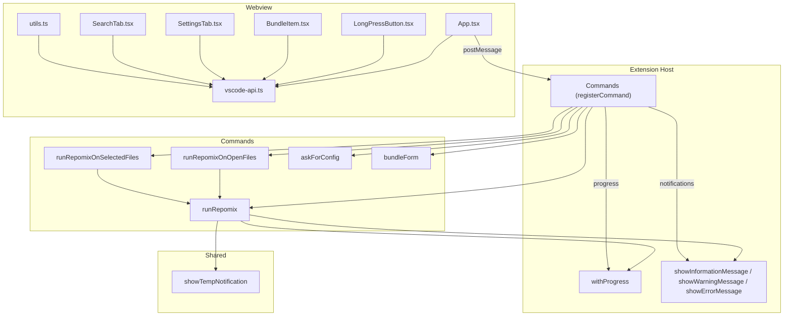
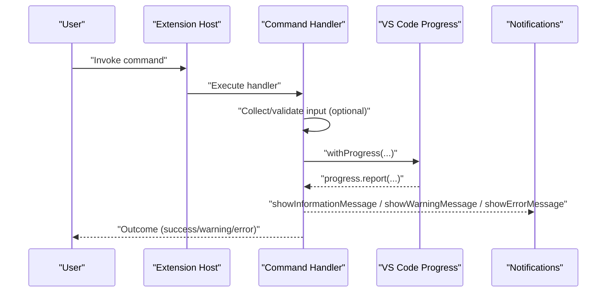
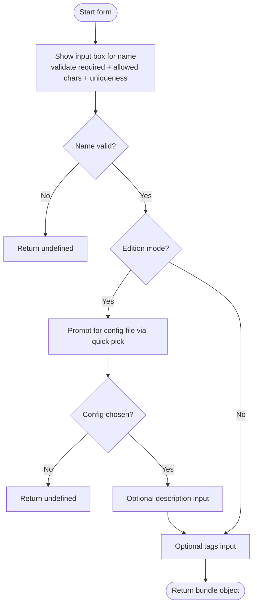
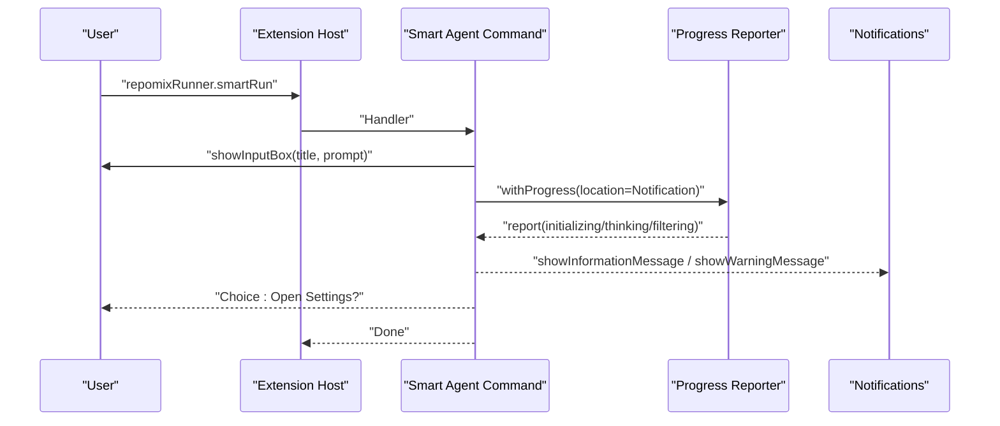
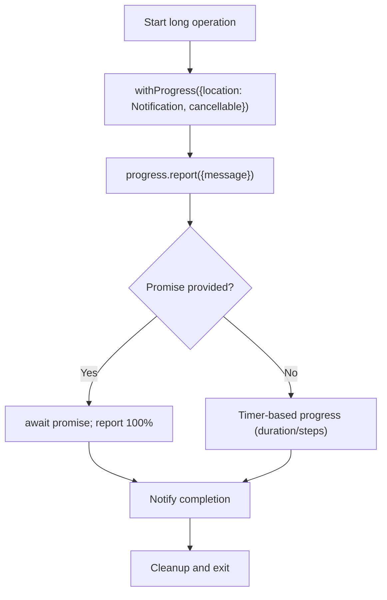
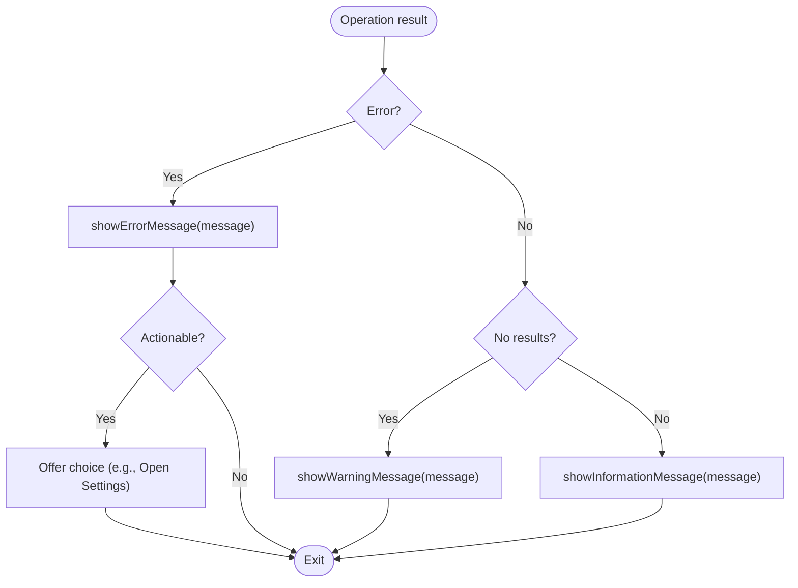
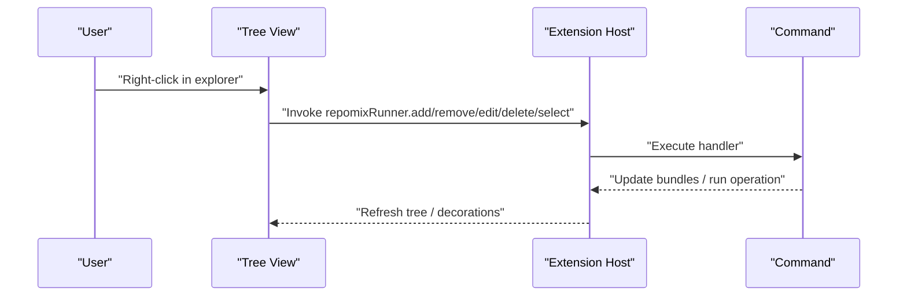
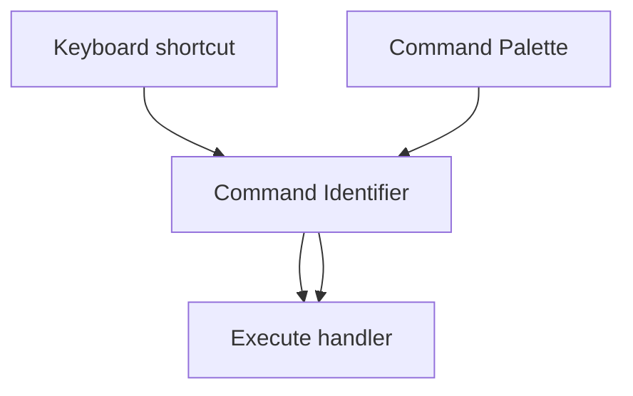
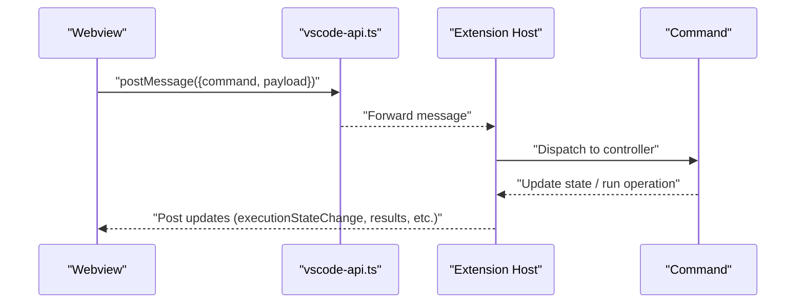
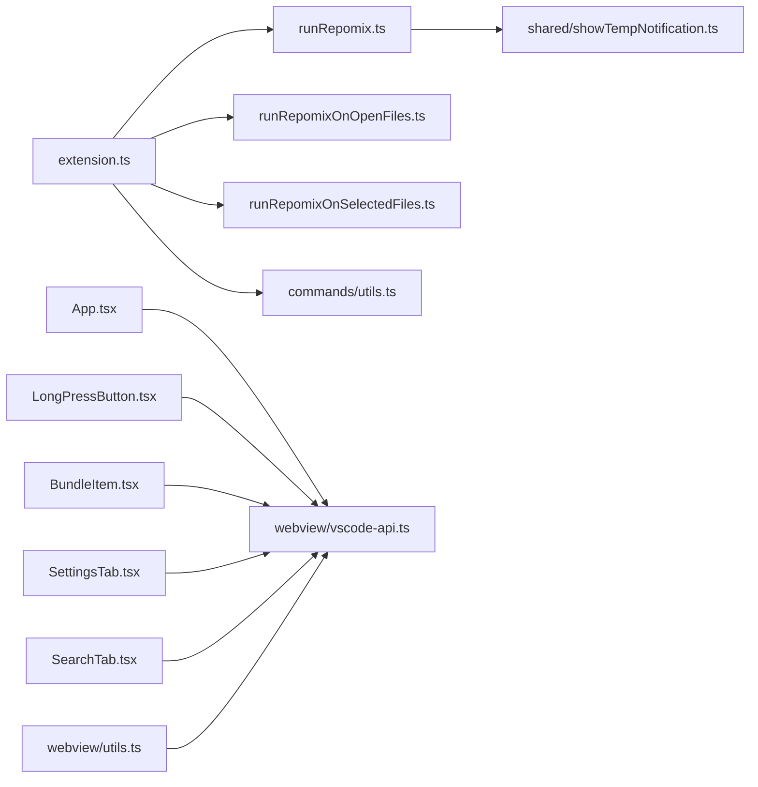

# User Interaction Patterns

<cite>
**Referenced Files in This Document**
- [extension.ts](file://src/extension.ts)
- [runRepomix.ts](file://src/commands/runRepomix.ts)
- [runRepomixOnOpenFiles.ts](file://src/commands/runRepomixOnOpenFiles.ts)
- [runRepomixOnSelectedFiles.ts](file://src/commands/runRepomixOnSelectedFiles.ts)
- [utils.ts](file://src/commands/utils.ts)
- [showTempNotification.ts](file://src/shared/showTempNotification.ts)
- [App.tsx](file://src/webview/App.tsx)
- [LongPressButton.tsx](file://src/webview/components/LongPressButton.tsx)
- [BundleItem.tsx](file://src/webview/components/BundleItem.tsx)
- [SettingsTab.tsx](file://src/webview/components/SettingsTab.tsx)
- [SearchTab.tsx](file://src/webview/components/SearchTab.tsx)
- [vscode-api.ts](file://src/webview/vscode-api.ts)
- [utils.ts](file://src/webview/utils.ts)
</cite>

## Table of Contents
1. [Introduction](#introduction)
2. [Project Structure](#project-structure)
3. [Core Components](#core-components)
4. [Architecture Overview](#architecture-overview)
5. [Detailed Component Analysis](#detailed-component-analysis)
6. [Dependency Analysis](#dependency-analysis)
7. [Performance Considerations](#performance-considerations)
8. [Troubleshooting Guide](#troubleshooting-guide)
9. [Conclusion](#conclusion)
10. [Appendices](#appendices)

## Introduction
This document explains user interaction patterns in the command system, focusing on input boxes, confirmation dialogs, progress notifications, and feedback mechanisms. It covers:
- Input capture and validation (input boxes, quick pick)
- Confirmation dialogs and user choice flows
- Progress reporting for long-running operations using withProgress
- Notification systems for success, warnings, and errors
- Context menu and explorer tree interactions
- Keyboard shortcuts and command palette integration
- Accessibility, internationalization, and responsive UI patterns
- Debugging techniques and UX optimization strategies

## Project Structure
The user interaction surface spans the extension’s command registration, command implementations, and the webview UI. Commands trigger long-running tasks and present progress and outcomes via VS Code APIs. The webview provides interactive controls and stateful feedback.

**Diagram sources**
- [extension.ts](file://src/extension.ts#L43-L781)
- [runRepomix.ts](file://src/commands/runRepomix.ts#L48-L154)
- [runRepomixOnOpenFiles.ts](file://src/commands/runRepomixOnOpenFiles.ts#L8-L28)
- [runRepomixOnSelectedFiles.ts](file://src/commands/runRepomixOnSelectedFiles.ts#L26-L100)
- [utils.ts](file://src/commands/utils.ts#L5-L147)
- [showTempNotification.ts](file://src/shared/showTempNotification.ts#L4-L61)
- [App.tsx](file://src/webview/App.tsx#L47-L257)
- [LongPressButton.tsx](file://src/webview/components/LongPressButton.tsx#L1-L158)
- [BundleItem.tsx](file://src/webview/components/BundleItem.tsx#L1-L121)
- [SettingsTab.tsx](file://src/webview/components/SettingsTab.tsx#L1-L802)
- [SearchTab.tsx](file://src/webview/components/SearchTab.tsx#L1-L1161)
- [vscode-api.ts](file://src/webview/vscode-api.ts#L1-L24)
- [utils.ts](file://src/webview/utils.ts#L1-L8)

**Section sources**
- [extension.ts](file://src/extension.ts#L43-L781)
- [App.tsx](file://src/webview/App.tsx#L47-L257)

## Core Components
- Command registration and orchestration: The extension registers commands and wires them to command handlers. Many commands use withProgress for long-running work and showInformationMessage/showWarningMessage/showErrorMessage for feedback.
- Input capture and validation: Input boxes and quick pick dialogs collect user input with validation and optional selection lists.
- Progress notifications: The withProgress API reports progress and supports cancellation. A reusable showTempNotification utility wraps withProgress for transient notifications.
- Webview-driven interactions: The webview posts messages to the extension, receives updates, and renders interactive controls with accessibility and responsive UI patterns.

**Section sources**
- [extension.ts](file://src/extension.ts#L498-L665)
- [runRepomix.ts](file://src/commands/runRepomix.ts#L48-L154)
- [showTempNotification.ts](file://src/shared/showTempNotification.ts#L4-L61)
- [utils.ts](file://src/commands/utils.ts#L5-L147)
- [App.tsx](file://src/webview/App.tsx#L47-L257)

## Architecture Overview
The user interaction lifecycle typically follows:
- User triggers a command (command palette or context menu)
- The command handler collects input (if needed), optionally validates, and starts a long-running operation
- The operation reports progress via withProgress
- Notifications inform success, warnings, or errors
- The webview can also drive actions and receive updates

**Diagram sources**
- [extension.ts](file://src/extension.ts#L498-L665)
- [runRepomix.ts](file://src/commands/runRepomix.ts#L48-L154)
- [showTempNotification.ts](file://src/shared/showTempNotification.ts#L14-L61)

## Detailed Component Analysis

### Input Box Usage and Validation
- Input boxes are used to capture free-form text and structured data:
  - Name input with validation for bundle creation/editing
  - Optional description and tags inputs
  - Config file selection via quick pick from workspace files
- Validation enforces constraints (required fields, allowed characters, uniqueness)
- Quick pick presents a prioritized list with “no config” option

**Diagram sources**
- [utils.ts](file://src/commands/utils.ts#L5-L81)
- [utils.ts](file://src/commands/utils.ts#L88-L147)

**Section sources**
- [utils.ts](file://src/commands/utils.ts#L5-L81)
- [utils.ts](file://src/commands/utils.ts#L88-L147)

### Confirmation Dialogs and User Choice Flows
- Smart Agent command demonstrates a multi-step confirmation flow:
  - Captures user intent via input box
  - Initializes agent with progress reporting
  - Presents success or warning messages depending on outcome
  - Handles error scenarios with actionable choices (e.g., open settings)
- General pattern: use showInformationMessage/showWarningMessage for outcomes; showErrorMessage for failures; offer quick actions (e.g., “Open Settings”)

**Diagram sources**
- [extension.ts](file://src/extension.ts#L572-L665)

**Section sources**
- [extension.ts](file://src/extension.ts#L572-L665)

### Progress Notifications with withProgress
- Long-running commands wrap execution in withProgress to keep users informed
- Progress messages indicate stages (initializing, thinking, filtering)
- Cancellation is supported for long operations
- A reusable showTempNotification utility can present transient notifications with either a timer or a provided promise

**Diagram sources**
- [runRepomix.ts](file://src/commands/runRepomix.ts#L96-L130)
- [showTempNotification.ts](file://src/shared/showTempNotification.ts#L14-L61)
- [extension.ts](file://src/extension.ts#L601-L664)

**Section sources**
- [runRepomix.ts](file://src/commands/runRepomix.ts#L96-L130)
- [showTempNotification.ts](file://src/shared/showTempNotification.ts#L14-L61)
- [extension.ts](file://src/extension.ts#L601-L664)

### Notification Systems: Success, Warnings, Errors
- Success: showInformationMessage with contextual details
- Warnings: showWarningMessage for low-severity issues
- Errors: showErrorMessage with optional action (e.g., open settings)
- Transient notifications: showTempNotification for short-lived updates

**Diagram sources**
- [extension.ts](file://src/extension.ts#L634-L664)
- [runRepomix.ts](file://src/commands/runRepomix.ts#L141-L154)
- [showTempNotification.ts](file://src/shared/showTempNotification.ts#L14-L61)

**Section sources**
- [extension.ts](file://src/extension.ts#L634-L664)
- [runRepomix.ts](file://src/commands/runRepomix.ts#L141-L154)
- [showTempNotification.ts](file://src/shared/showTempNotification.ts#L14-L61)

### Context Menu Integration and Explorer Tree Interactions
- Explorer context menu actions delegate to commands:
  - Add/remove selected files to/from active bundle
  - Edit/delete/select bundles
  - Copy selected files to clipboard (including SCM context)
- Tree view is registered and decorated; commands update state and trigger operations

**Diagram sources**
- [extension.ts](file://src/extension.ts#L404-L417)
- [extension.ts](file://src/extension.ts#L429-L570)

**Section sources**
- [extension.ts](file://src/extension.ts#L404-L417)
- [extension.ts](file://src/extension.ts#L429-L570)

### Keyboard Shortcut Handling and Command Palette Integration
- Commands are registered under distinct identifiers (e.g., repomixRunner.run, repomixRunner.smartRun)
- Users can bind keyboard shortcuts in VS Code keybindings
- Command palette integration is implicit via the registered command identifiers

**Diagram sources**
- [extension.ts](file://src/extension.ts#L498-L570)

**Section sources**
- [extension.ts](file://src/extension.ts#L498-L570)

### Modal Dialogs, Input Validation, and Confirmation Flows
- Modal-like input dialogs:
  - showInputBox with title/prompt/placeHolder and validation
  - showQuickPick for selecting from a curated list
- Confirmation flows:
  - Smart Agent flow captures intent and proceeds with progress
  - Error handling offers “Open Settings” action

**Section sources**
- [extension.ts](file://src/extension.ts#L584-L595)
- [utils.ts](file://src/commands/utils.ts#L17-L36)
- [utils.ts](file://src/commands/utils.ts#L127-L136)
- [extension.ts](file://src/extension.ts#L652-L664)

### Webview Interactions and Responsive UI Patterns
- The webview posts messages to the extension and receives updates to render stateful UI
- Interactive components:
  - LongPressButton: primary action with long-press compression
  - BundleItem: run/cancel/copy actions with disabled states and tooltips
  - SettingsTab and SearchTab: dynamic forms, toggles, and progress indicators
- Accessibility and responsiveness:
  - Proper ARIA labels and keyboard handling in LongPressButton
  - Responsive layout and scroll regions in App.tsx
  - State persistence via vscode.getState/setState

**Diagram sources**
- [App.tsx](file://src/webview/App.tsx#L75-L145)
- [LongPressButton.tsx](file://src/webview/components/LongPressButton.tsx#L91-L106)
- [BundleItem.tsx](file://src/webview/components/BundleItem.tsx#L7-L118)
- [SettingsTab.tsx](file://src/webview/components/SettingsTab.tsx#L214-L318)
- [SearchTab.tsx](file://src/webview/components/SearchTab.tsx#L462-L592)
- [vscode-api.ts](file://src/webview/vscode-api.ts#L1-L24)
- [utils.ts](file://src/webview/utils.ts#L4-L7)

**Section sources**
- [App.tsx](file://src/webview/App.tsx#L47-L257)
- [LongPressButton.tsx](file://src/webview/components/LongPressButton.tsx#L1-L158)
- [BundleItem.tsx](file://src/webview/components/BundleItem.tsx#L1-L121)
- [SettingsTab.tsx](file://src/webview/components/SettingsTab.tsx#L1-L802)
- [SearchTab.tsx](file://src/webview/components/SearchTab.tsx#L1-L1161)
- [vscode-api.ts](file://src/webview/vscode-api.ts#L1-L24)
- [utils.ts](file://src/webview/utils.ts#L1-L8)

## Dependency Analysis
- Commands depend on:
  - VS Code APIs for input dialogs, progress, notifications, and file system
  - Shared utilities for notifications and execution helpers
  - Webview messaging for UI-driven workflows
- Webview components depend on:
  - vscode-api wrapper for safe acquisition of VS Code API
  - Local state persistence via getState/setState
  - Controllers to handle messages and update UI

**Diagram sources**
- [extension.ts](file://src/extension.ts#L43-L781)
- [runRepomix.ts](file://src/commands/runRepomix.ts#L1-L173)
- [runRepomixOnOpenFiles.ts](file://src/commands/runRepomixOnOpenFiles.ts#L1-L29)
- [runRepomixOnSelectedFiles.ts](file://src/commands/runRepomixOnSelectedFiles.ts#L1-L101)
- [utils.ts](file://src/commands/utils.ts#L1-L148)
- [showTempNotification.ts](file://src/shared/showTempNotification.ts#L1-L62)
- [App.tsx](file://src/webview/App.tsx#L1-L258)
- [LongPressButton.tsx](file://src/webview/components/LongPressButton.tsx#L1-L158)
- [BundleItem.tsx](file://src/webview/components/BundleItem.tsx#L1-L121)
- [SettingsTab.tsx](file://src/webview/components/SettingsTab.tsx#L1-L802)
- [SearchTab.tsx](file://src/webview/components/SearchTab.tsx#L1-L1161)
- [vscode-api.ts](file://src/webview/vscode-api.ts#L1-L24)
- [utils.ts](file://src/webview/utils.ts#L1-L8)

**Section sources**
- [extension.ts](file://src/extension.ts#L43-L781)
- [runRepomix.ts](file://src/commands/runRepomix.ts#L1-L173)
- [runRepomixOnOpenFiles.ts](file://src/commands/runRepomixOnOpenFiles.ts#L1-L29)
- [runRepomixOnSelectedFiles.ts](file://src/commands/runRepomixOnSelectedFiles.ts#L1-L101)
- [utils.ts](file://src/commands/utils.ts#L1-L148)
- [showTempNotification.ts](file://src/shared/showTempNotification.ts#L1-L62)
- [App.tsx](file://src/webview/App.tsx#L1-L258)
- [LongPressButton.tsx](file://src/webview/components/LongPressButton.tsx#L1-L158)
- [BundleItem.tsx](file://src/webview/components/BundleItem.tsx#L1-L121)
- [SettingsTab.tsx](file://src/webview/components/SettingsTab.tsx#L1-L802)
- [SearchTab.tsx](file://src/webview/components/SearchTab.tsx#L1-L1161)
- [vscode-api.ts](file://src/webview/vscode-api.ts#L1-L24)
- [utils.ts](file://src/webview/utils.ts#L1-L8)

## Performance Considerations
- Prefer withProgress for long-running tasks to keep UI responsive and reduce perceived latency
- Use showTempNotification for lightweight transient updates to avoid flooding the notification center
- Batch UI updates in the webview to minimize re-renders
- Debounce quick pick and search operations to avoid redundant network calls

## Troubleshooting Guide
Common issues and resolutions:
- Input validation prevents submission:
  - Ensure required fields are filled and follow allowed character sets
  - For config selection, choose a valid workspace path or “No config”
- Progress does not appear:
  - Verify withProgress is called with a valid location and that progress.report is invoked periodically
- Notifications not shown:
  - Confirm showInformationMessage/showWarningMessage/showErrorMessage are called with appropriate severity
- Webview state not persisting:
  - Use vscode.getState/setState to persist UI state across reloads
- Keyboard shortcuts not working:
  - Check VS Code keybindings for conflicts and ensure command identifiers match

**Section sources**
- [utils.ts](file://src/commands/utils.ts#L17-L36)
- [utils.ts](file://src/commands/utils.ts#L127-L136)
- [runRepomix.ts](file://src/commands/runRepomix.ts#L96-L130)
- [showTempNotification.ts](file://src/shared/showTempNotification.ts#L14-L61)
- [App.tsx](file://src/webview/App.tsx#L50-L57)
- [extension.ts](file://src/extension.ts#L584-L595)

## Conclusion
The command system integrates VS Code APIs for robust user interactions: input capture with validation, progress reporting, and contextual notifications. The webview complements this with interactive controls and responsive UI patterns. Following the documented patterns ensures consistent, accessible, and user-friendly experiences across the extension.

## Appendices
- Accessibility checklist:
  - Provide ARIA labels and keyboard navigation for interactive components
  - Ensure sufficient color contrast and readable text sizes
  - Offer focus indicators and skip links where applicable
- Internationalization:
  - Use localized strings for prompts, placeholders, and messages
  - Avoid hardcoded text in favor of resource bundles
- Responsive UI:
  - Use flexible layouts and adaptive components
  - Test on various screen sizes and zoom levels