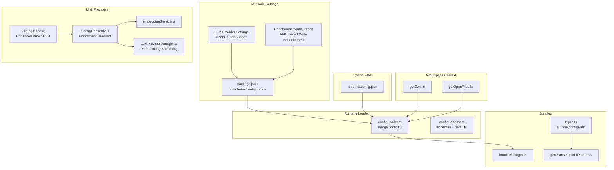
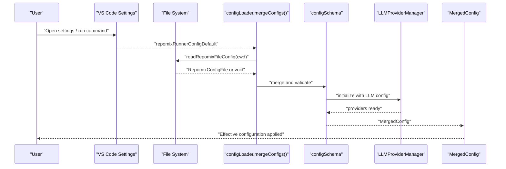
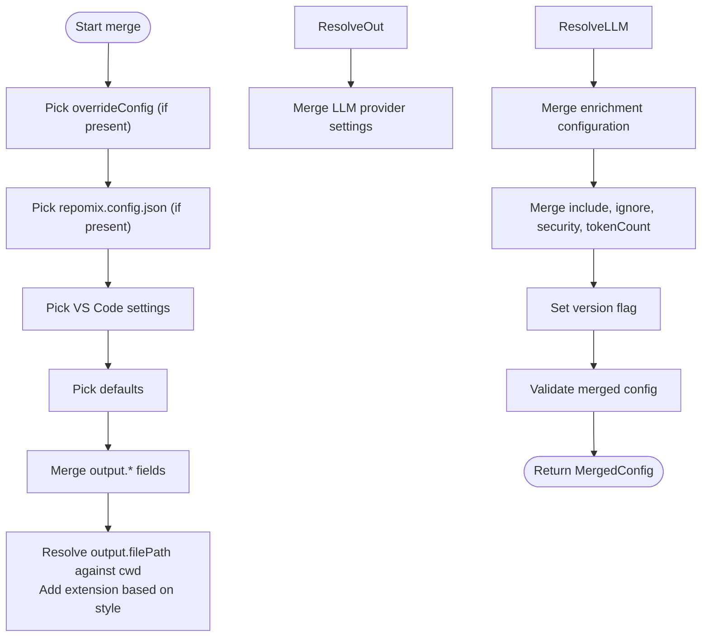
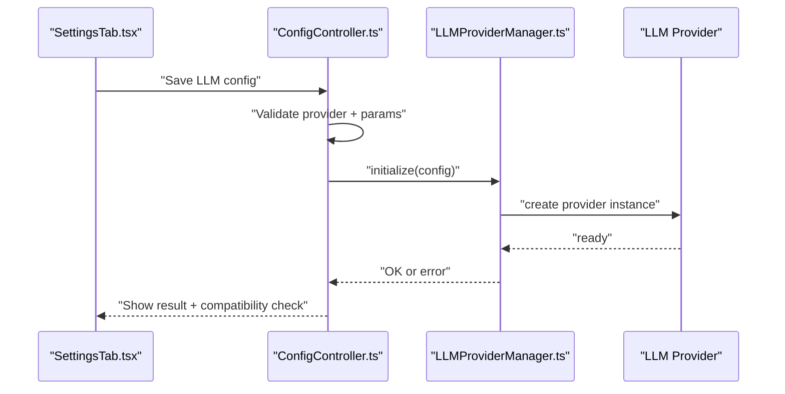
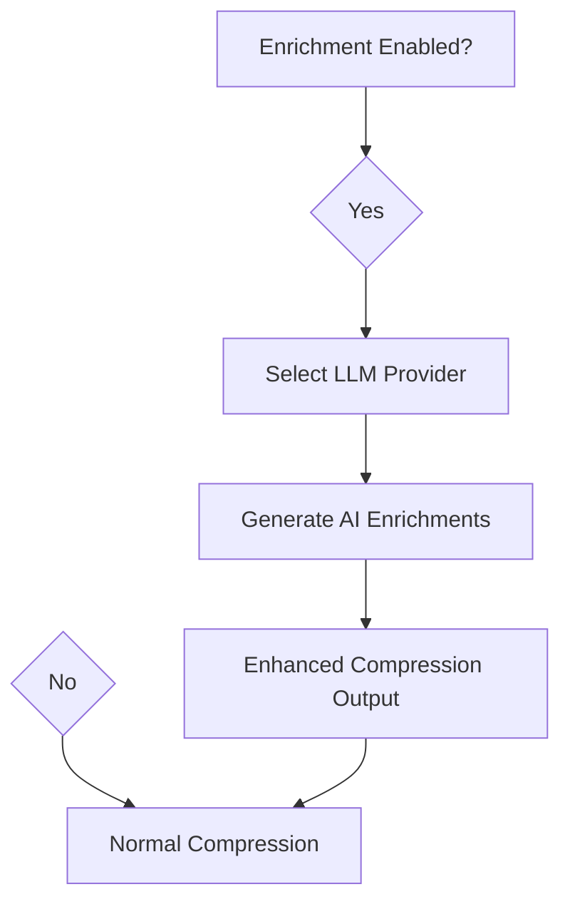
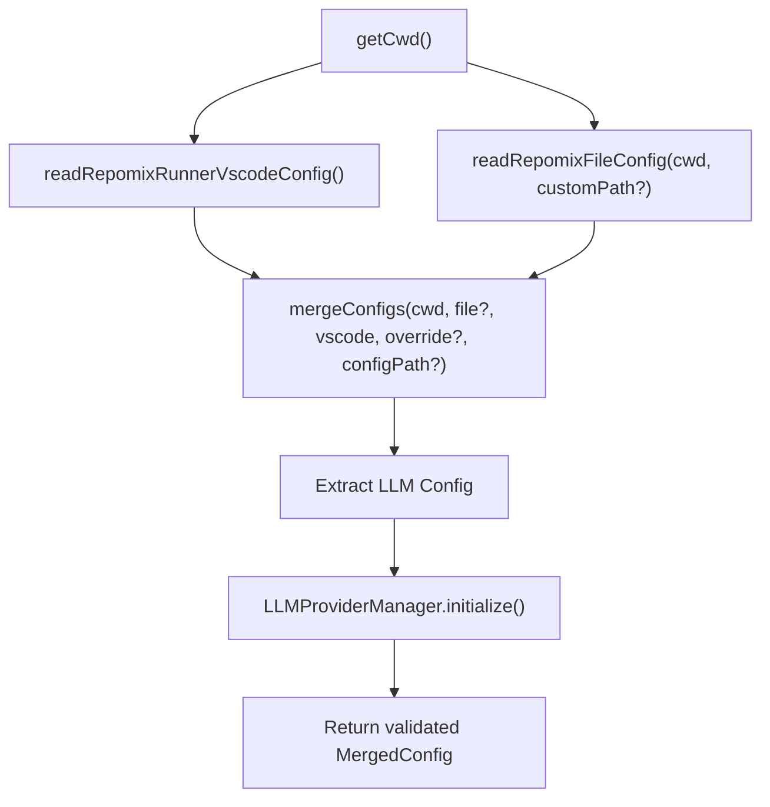
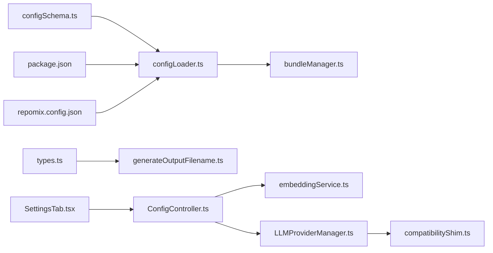

# Configuration Management

<cite>
**Referenced Files in This Document**
- [configLoader.ts](file://src/config/configLoader.ts)
- [configSchema.ts](file://src/config/configSchema.ts)
- [repomix.config.json](file://repomix.config.json)
- [package.json](file://package.json)
- [getCwd.ts](file://src/config/getCwd.ts)
- [getOpenFiles.ts](file://src/config/getOpenFiles.ts)
- [bundleManager.ts](file://src/core/bundles/bundleManager.ts)
- [types.ts](file://src/core/bundles/types.ts)
- [generateOutputFilename.ts](file://src/utils/generateOutputFilename.ts)
- [embeddingService.ts](file://src/core/indexing/embeddingService.ts)
- [SettingsTab.tsx](file://src/webview/components/SettingsTab.tsx)
- [ConfigController.ts](file://src/webview/controllers/ConfigController.ts)
- [goToConfigFile.ts](file://src/commands/goToConfigFile.ts)
- [utils.ts](file://src/commands/utils.ts)
- [cliFlagsBuilder.ts](file://src/core/cli/cliFlagsBuilder.ts)
- [LLMProviderManager.ts](file://src/core/llm/LLMProviderManager.ts)
- [types.ts](file://src/core/llm/types.ts)
- [compatibilityShim.ts](file://src/core/llm/compatibilityShim.ts)
- [switchLLMProvider.ts](file://src/commands/switchLLMProvider.ts)
- [migrationService.ts](file://src/core/indexing/migrationService.ts)
- [qdrantAdapter.ts](file://src/core/indexing/vectorDb/providers/qdrantAdapter.ts)
</cite>

## Update Summary
**Changes Made**
- Added new LLM provider settings categories including OpenRouter support
- Introduced enrichment configuration options for AI-powered code enrichment
- Updated settings UI to focus on Qdrant setup and new configuration categories
- Enhanced LLM provider management with rate limiting and usage tracking
- Removed Pinecone-specific configurations and dependencies

## Table of Contents
1. [Introduction](#introduction)
2. [Project Structure](#project-structure)
3. [Core Components](#core-components)
4. [Architecture Overview](#architecture-overview)
5. [Detailed Component Analysis](#detailed-component-analysis)
6. [Dependency Analysis](#dependency-analysis)
7. [Performance Considerations](#performance-considerations)
8. [Troubleshooting Guide](#troubleshooting-guide)
9. [Conclusion](#conclusion)
10. [Appendices](#appendices)

## Introduction
This document explains the Configuration Management system used by the extension. It covers how VS Code settings and repomix.config.json files combine to form a unified configuration, the precedence rules, inheritance patterns, and override mechanisms. It also documents the configuration schema validation, supported properties, default values, environment-specific behavior (workspace vs user settings, per-project overrides, global defaults), and practical examples for common scenarios such as custom output directories, bundle definitions, and AI provider settings. Finally, it describes the configuration loading process, validation errors, troubleshooting steps, migration guidance, and consistency practices across team environments.

**Updated** The system now includes enhanced LLM provider management with OpenRouter support, enrichment configuration options, and streamlined vector database setup focused on Qdrant.

## Project Structure
The configuration system spans several modules:
- Schema definitions and validation
- Configuration loaders and merging logic
- VS Code contribution declarations
- Bundle-level configuration and output naming
- Webview settings and embedding provider configuration
- CLI flag compatibility checks
- LLM provider management and enrichment services

**Diagram sources**
- [configLoader.ts:145-229](file://src/config/configLoader.ts#L145-L229)
- [configSchema.ts:15-165](file://src/config/configSchema.ts#L15-L165)
- [repomix.config.json:1-43](file://repomix.config.json#L1-L43)
- [package.json:30-284](file://package.json#L30-L284)
- [getCwd.ts:8-17](file://src/config/getCwd.ts#L8-L17)
- [getOpenFiles.ts:4-12](file://src/config/getOpenFiles.ts#L4-L12)
- [bundleManager.ts](file://src/core/bundles/bundleManager.ts)
- [types.ts:3-12](file://src/core/bundles/types.ts#L3-L12)
- [generateOutputFilename.ts:4-38](file://src/utils/generateOutputFilename.ts#L4-L38)
- [SettingsTab.tsx:450-479](file://src/webview/components/SettingsTab.tsx#L450-L479)
- [embeddingService.ts:17-46](file://src/core/indexing/embeddingService.ts#L17-L46)
- [ConfigController.ts:696-734](file://src/webview/controllers/ConfigController.ts#L696-L734)
- [LLMProviderManager.ts:68-186](file://src/core/llm/LLMProviderManager.ts#L68-L186)
- [types.ts:136-189](file://src/core/llm/types.ts#L136-L189)

**Section sources**
- [configLoader.ts:1-230](file://src/config/configLoader.ts#L1-L230)
- [configSchema.ts:1-165](file://src/config/configSchema.ts#L1-L165)
- [repomix.config.json:1-43](file://repomix.config.json#L1-L43)
- [package.json:30-284](file://package.json#L30-L284)

## Core Components
- Configuration schemas define supported properties, enums, defaults, and validation rules.
- VS Code settings contribute default values and UI for configuration.
- repomix.config.json provides per-project overrides.
- mergeConfigs applies precedence and produces a validated MergedConfig.
- Bundle-level configPath allows per-bundle overrides.
- Output filename generation integrates bundle names and configuration paths.
- LLM provider management handles multiple AI providers with rate limiting and usage tracking.
- Enrichment configuration enables AI-powered code enhancement during compression.

**Section sources**
- [configSchema.ts:15-165](file://src/config/configSchema.ts#L15-L165)
- [package.json:30-284](file://package.json#L30-L284)
- [repomix.config.json:1-43](file://repomix.config.json#L1-L43)
- [configLoader.ts:145-229](file://src/config/configLoader.ts#L145-L229)
- [types.ts:3-12](file://src/core/bundles/types.ts#L3-L12)
- [generateOutputFilename.ts:4-38](file://src/utils/generateOutputFilename.ts#L4-L38)
- [LLMProviderManager.ts:68-186](file://src/core/llm/LLMProviderManager.ts#L68-L186)
- [types.ts:136-189](file://src/core/llm/types.ts#L136-L189)

## Architecture Overview
The configuration pipeline reads VS Code settings, optionally loads a repomix.config.json file, merges them with defaults, and validates the final configuration. The merge respects a strict precedence order and supports runtime overrides. The system now includes enhanced LLM provider management and enrichment capabilities.

**Diagram sources**
- [configLoader.ts:145-229](file://src/config/configLoader.ts#L145-L229)
- [configSchema.ts:138-149](file://src/config/configSchema.ts#L138-L149)
- [LLMProviderManager.ts:68-186](file://src/core/llm/LLMProviderManager.ts#L68-L186)

## Detailed Component Analysis

### Configuration Precedence and Merge Logic
The merge prioritizes configuration sources from highest to lowest:
1. overrideConfig (direct function parameter)
2. configFromRepomixFile (from repomix.config.json)
3. configFromRepomixRunnerVscode (from VS Code settings)
4. baseConfig (default configuration)

Key behaviors:
- Arrays and nested objects are merged left-to-right respecting precedence.
- output.filePath is resolved against cwd and extended with a default extension based on output.style.
- Special handling: when runner.useTargetAsOutput is enabled and include resolves to a single directory, output is placed inside that directory using the configured output filename.

**Diagram sources**
- [configLoader.ts:145-229](file://src/config/configLoader.ts#L145-L229)

**Section sources**
- [configLoader.ts:132-229](file://src/config/configLoader.ts#L132-L229)

### Schema Validation and Supported Properties
- Output styles: plain, xml, markdown, json.
- Default file name mapping per style is defined centrally.
- Base schema supports optional output, include, ignore, security, tokenCount, and version.
- Default schema sets concrete defaults for all keys.
- Runner-specific schema adds runner.* keys and enforces enums.
- Merged schema adds runtime-only fields like cwd, version, and optional remote.
- **Updated** LLM provider schema now includes OpenRouter support with enhanced configuration options.

Supported properties include:
- output: filePath, style, parsableStyle, headerText, instructionFilePath, fileSummary, directoryStructure, removeComments, removeEmptyLines, topFilesLength, showLineNumbers, copyToClipboard, includeEmptyDirectories, compress
- include: array of strings
- ignore: useGitignore, useDefaultPatterns, customPatterns
- security: enableSecurityCheck
- tokenCount: encoding
- runner: verbose, keepOutputFile, copyMode, useTargetAsOutput, useBundleNameAsOutputName, configPath
- **New** enrichment: enabled, llmProvider (supports gemini, ollama, lmstudio, openrouter)
- **New** llm: defaultProvider, embeddingProvider, rateLimit.enabled, usageTracking.enabled
- **Updated** embedding: provider (ollama, lmstudio), ollama.*, lmstudio.*
- version: boolean

Defaults are declared in the default schema and enforced by Zod parsing.

**Section sources**
- [configSchema.ts:3-165](file://src/config/configSchema.ts#L3-L165)
- [repomix.config.json:6-42](file://repomix.config.json#L6-L42)
- [types.ts:136-189](file://src/core/llm/types.ts#L136-L189)

### Environment-Specific Configurations
- Workspace vs user settings: VS Code settings contribute defaults and can be overridden per workspace via .vscode/settings.json.
- Per-project overrides: repomix.config.json in the project root (or a custom path) overrides VS Code settings for that project.
- Global defaults: baseConfig provides fallbacks when keys are absent.
- Bundle-level overrides: Bundle.configPath can point to a project-local repomix.config.json for a specific bundle.

Practical effects:
- runner.configPath allows selecting a non-default config file path.
- useTargetAsOutput influences output directory placement when include targets a single directory.
- useBundleNameAsOutputName affects generated output filenames for bundles.
- **New** enrichment.enabled toggles AI-powered code enhancement during compression.
- **New** llm.defaultProvider and llm.embeddingProvider set global LLM preferences.

**Section sources**
- [package.json:30-284](file://package.json#L30-L284)
- [repomix.config.json:1-43](file://repomix.config.json#L1-L43)
- [types.ts:3-12](file://src/core/bundles/types.ts#L3-L12)
- [generateOutputFilename.ts:4-38](file://src/utils/generateOutputFilename.ts#L4-L38)

### Enhanced LLM Provider Settings and Management
**Updated** The system now includes comprehensive LLM provider management with support for multiple providers including OpenRouter.

#### LLM Provider Configuration
- **defaultProvider**: Sets the primary LLM provider for text generation (gemini, openrouter, ollama, lmstudio)
- **embeddingProvider**: Sets the provider for embeddings (ollama, lmstudio)
- **rateLimit.enabled**: Enables automatic rate limiting across all providers
- **usageTracking.enabled**: Tracks API usage, tokens, and estimated costs

#### Provider-Specific Settings
- **OpenRouter**: Supports external API with configurable base URL, model, and dimension
- **Ollama**: Local embedding models with URL, model, and dimension configuration
- **LM Studio**: Local inference server with base URL, API key, model, and dimension
- **Gemini**: Cloud-based with API key and model configuration

#### Provider Management Features
- Automatic provider initialization and validation
- Rate limiting and retry mechanisms
- Usage tracking and cost estimation
- Provider switching with compatibility checks
- Dimension validation and testing

**Diagram sources**
- [SettingsTab.tsx:450-479](file://src/webview/components/SettingsTab.tsx#L450-L479)
- [ConfigController.ts:696-734](file://src/webview/controllers/ConfigController.ts#L696-L734)
- [LLMProviderManager.ts:68-186](file://src/core/llm/LLMProviderManager.ts#L68-L186)
- [types.ts:136-189](file://src/core/llm/types.ts#L136-L189)

**Section sources**
- [SettingsTab.tsx:450-479](file://src/webview/components/SettingsTab.tsx#L450-L479)
- [ConfigController.ts:696-734](file://src/webview/controllers/ConfigController.ts#L696-L734)
- [LLMProviderManager.ts:68-186](file://src/core/llm/LLMProviderManager.ts#L68-L186)
- [types.ts:136-189](file://src/core/llm/types.ts#L136-L189)
- [compatibilityShim.ts:52-72](file://src/core/llm/compatibilityShim.ts#L52-L72)
- [switchLLMProvider.ts:36-69](file://src/commands/switchLLMProvider.ts#L36-L69)

### Enrichment Configuration Options
**New** The system now supports AI-powered code enrichment during compression processes.

#### Enrichment Settings
- **enabled**: Boolean flag to toggle enrichment functionality
- **llmProvider**: Selects the LLM provider for generating enrichments (gemini, ollama, lmstudio, openrouter)

#### Enrichment Features
- AI-generated summaries for code symbols
- Enhanced context during compression operations
- Provider flexibility with all supported LLM providers
- Seamless integration with existing compression pipeline

**Diagram sources**
- [ConfigController.ts:1423-1455](file://src/webview/controllers/ConfigController.ts#L1423-L1455)
- [SettingsTab.tsx:176-178](file://src/webview/components/SettingsTab.tsx#L176-L178)

**Section sources**
- [ConfigController.ts:1423-1455](file://src/webview/controllers/ConfigController.ts#L1423-L1455)
- [SettingsTab.tsx:176-178](file://src/webview/components/SettingsTab.tsx#L176-L178)
- [configSchema.ts:127-130](file://src/config/configSchema.ts#L127-L130)

### Practical Examples

- Custom output directory with useTargetAsOutput:
  - Set runner.useTargetAsOutput to true.
  - Provide include with a single directory path.
  - The effective output will be placed under that directory using the configured output filename.

- Bundle-specific configuration:
  - Set Bundle.configPath to a project-local repomix.config.json.
  - Use bundle-level output customization via output.filePath and output.style.

- **Updated** Multi-provider LLM configuration:
  - Set llm.defaultProvider to 'openrouter' for external API access.
  - Configure openrouter.baseUrl, model, and dimension for optimal performance.
  - Use llm.rateLimit.enabled to automatically handle API rate limits.

- **New** Enrichment configuration:
  - Enable enrichment with enrichment.enabled = true.
  - Select llmProvider as 'openrouter' for cloud-based AI enhancements.
  - Leverage AI-generated summaries during compression operations.

- **Updated** Vector database setup:
  - Focus on Qdrant configuration with URL, collection, and API key.
  - Simplified from previous Pinecone-centric setup.
  - Streamlined provider switching with migration service.

Note: These examples describe behaviors implemented by the configuration system and UI; refer to the linked sources for precise property names and defaults.

**Section sources**
- [configLoader.ts:167-176](file://src/config/configLoader.ts#L167-L176)
- [types.ts:3-12](file://src/core/bundles/types.ts#L3-L12)
- [SettingsTab.tsx:450-479](file://src/webview/components/SettingsTab.tsx#L450-L479)
- [ConfigController.ts:696-734](file://src/webview/controllers/ConfigController.ts#L696-L734)
- [migrationService.ts:17-59](file://src/core/indexing/migrationService.ts#L17-L59)
- [qdrantAdapter.ts:1-436](file://src/core/indexing/vectorDb/providers/qdrantAdapter.ts#L1-L436)

### Configuration Loading Process
- getCwd determines the workspace root used as cwd for resolving paths.
- readRepomixRunnerVscodeConfig reads VS Code settings and validates them against the runner default schema.
- readRepomixFileConfig attempts to locate and parse repomix.config.json, stripping comments before parsing.
- mergeConfigs performs the precedence-based merge and validates the final configuration.
- **Updated** LLM provider configuration is extracted and passed to LLMProviderManager for initialization.

**Diagram sources**
- [getCwd.ts:8-17](file://src/config/getCwd.ts#L8-L17)
- [configLoader.ts:99-229](file://src/config/configLoader.ts#L99-L229)
- [compatibilityShim.ts:52-72](file://src/core/llm/compatibilityShim.ts#L52-L72)

**Section sources**
- [getCwd.ts:8-17](file://src/config/getCwd.ts#L8-L17)
- [configLoader.ts:99-229](file://src/config/configLoader.ts#L99-L229)
- [compatibilityShim.ts:52-72](file://src/core/llm/compatibilityShim.ts#L52-L72)

### CLI Flags Compatibility
CLI flags builder validates whether configuration keys are supported by CLI. Some keys (like runner.configPath, include, and version) are not mapped to CLI flags and will produce warnings if present in the configuration.

**Section sources**
- [cliFlagsBuilder.ts:168-214](file://src/core/cli/cliFlagsBuilder.ts#L168-L214)

## Dependency Analysis
The configuration system exhibits clear separation of concerns:
- Schemas define contracts and defaults.
- Loaders orchestrate reading and merging.
- VS Code contributes defaults and UI.
- Bundles integrate per-bundle configuration.
- UI components manage provider configuration and compatibility checks.
- **Updated** LLM provider manager handles multiple AI providers with rate limiting and usage tracking.
- **New** Enrichment service provides AI-powered code enhancement capabilities.

**Diagram sources**
- [configSchema.ts:15-165](file://src/config/configSchema.ts#L15-L165)
- [configLoader.ts:145-229](file://src/config/configLoader.ts#L145-L229)
- [package.json:30-284](file://package.json#L30-L284)
- [repomix.config.json:1-43](file://repomix.config.json#L1-L43)
- [bundleManager.ts](file://src/core/bundles/bundleManager.ts)
- [types.ts:3-12](file://src/core/bundles/types.ts#L3-L12)
- [generateOutputFilename.ts:4-38](file://src/utils/generateOutputFilename.ts#L4-L38)
- [SettingsTab.tsx:450-479](file://src/webview/components/SettingsTab.tsx#L450-L479)
- [ConfigController.ts:696-734](file://src/webview/controllers/ConfigController.ts#L696-L734)
- [embeddingService.ts:17-46](file://src/core/indexing/embeddingService.ts#L17-L46)
- [LLMProviderManager.ts:68-186](file://src/core/llm/LLMProviderManager.ts#L68-L186)
- [compatibilityShim.ts:52-72](file://src/core/llm/compatibilityShim.ts#L52-L72)

**Section sources**
- [configLoader.ts:145-229](file://src/config/configLoader.ts#L145-L229)
- [configSchema.ts:15-165](file://src/config/configSchema.ts#L15-L165)

## Performance Considerations
- Prefer minimal include patterns to reduce processing overhead.
- Use ignore.useGitignore and ignore.useDefaultPatterns to exclude large or irrelevant directories.
- Limit output.style to the least verbose format that meets your needs to reduce token count.
- Avoid excessive customPatterns; leverage built-in defaults where possible.
- When using embedding providers, choose appropriate models and dimensions to balance accuracy and performance.
- **Updated** Enable rate limiting for external LLM providers to prevent API throttling.
- **New** Monitor usage tracking to optimize API costs and resource utilization.
- **New** Consider enrichment complexity when enabling AI-powered code enhancement.

## Troubleshooting Guide
Common issues and resolutions:
- Invalid repomix.config.json format:
  - Symptom: Error message and thrown exception during parsing.
  - Resolution: Fix JSON syntax and comments; ensure properties match the schema.
  - Reference: [configLoader.ts:121-129](file://src/config/configLoader.ts#L121-L129)

- Missing workspace root:
  - Symptom: Error indicating no root workspace folder found.
  - Resolution: Open a folder/workspace in VS Code.
  - Reference: [getCwd.ts:11-14](file://src/config/getCwd.ts#L11-L14)

- No config files found:
  - Symptom: Warning when searching for repomix.config.json files.
  - Resolution: Create a repomix.config.json in your project or select a different config path.
  - Reference: [utils.ts:95-98](file://src/commands/utils.ts#L95-L98)

- **Updated** LLM provider misconfiguration:
  - Symptom: Errors when initializing or switching providers.
  - Resolution: Ensure required keys are present (e.g., OpenRouter base URL, Ollama model/dimension).
  - Reference: [LLMProviderManager.ts:68-88](file://src/core/llm/LLMProviderManager.ts#L68-L88), [compatibilityShim.ts:52-72](file://src/core/llm/compatibilityShim.ts#L52-L72)

- **New** Enrichment configuration issues:
  - Symptom: Enrichment not working despite being enabled.
  - Resolution: Verify enrichment.enabled and llmProvider settings match available providers.
  - Reference: [ConfigController.ts:1433-1455](file://src/webview/controllers/ConfigController.ts#L1433-L1455)

- **Updated** Vector database provider switching:
  - Symptom: Migration failures or credential validation errors.
  - Resolution: Ensure Qdrant URL and collection are configured; verify API key if required.
  - Reference: [migrationService.ts:48-59](file://src/core/indexing/migrationService.ts#L48-L59), [qdrantAdapter.ts:22-25](file://src/core/indexing/vectorDb/providers/qdrantAdapter.ts#L22-L25)

- CLI flag mismatch:
  - Symptom: Warnings that certain configuration keys are not supported by CLI flags.
  - Resolution: Use VS Code settings or repomix.config.json for those keys.
  - Reference: [cliFlagsBuilder.ts:168-214](file://src/core/cli/cliFlagsBuilder.ts#L168-L214)

- Output path resolution:
  - Symptom: Unexpected output location.
  - Resolution: Review runner.useTargetAsOutput and include patterns; confirm cwd and output.filePath.
  - Reference: [configLoader.ts:167-176](file://src/config/configLoader.ts#L167-L176)

**Section sources**
- [configLoader.ts:121-129](file://src/config/configLoader.ts#L121-L129)
- [getCwd.ts:11-14](file://src/config/getCwd.ts#L11-L14)
- [utils.ts:95-98](file://src/commands/utils.ts#L95-L98)
- [LLMProviderManager.ts:68-88](file://src/core/llm/LLMProviderManager.ts#L68-L88)
- [compatibilityShim.ts:52-72](file://src/core/llm/compatibilityShim.ts#L52-L72)
- [ConfigController.ts:1433-1455](file://src/webview/controllers/ConfigController.ts#L1433-L1455)
- [migrationService.ts:48-59](file://src/core/indexing/migrationService.ts#L48-L59)
- [qdrantAdapter.ts:22-25](file://src/core/indexing/vectorDb/providers/qdrantAdapter.ts#L22-L25)
- [cliFlagsBuilder.ts:168-214](file://src/core/cli/cliFlagsBuilder.ts#L168-L214)

## Conclusion
The configuration system combines VS Code settings and repomix.config.json with a clear precedence model, robust schema validation, and helpful defaults. It supports environment-specific behavior, per-bundle overrides, and enhanced provider configuration for AI indexing. **Updated** The system now includes comprehensive LLM provider management with OpenRouter support, enrichment configuration options, and streamlined vector database setup focused on Qdrant. By following the documented precedence, defaults, and troubleshooting steps, teams can maintain consistent and reliable configurations across diverse development environments.

## Appendices

### Configuration Precedence Summary
Highest to lowest:
1. overrideConfig (function parameter)
2. repomix.config.json
3. VS Code settings (package.json contributes)
4. baseConfig (defaults)

**Section sources**
- [configLoader.ts:132-138](file://src/config/configLoader.ts#L132-L138)
- [configSchema.ts:157-165](file://src/config/configSchema.ts#L157-L165)

### Default Values Reference
- output: filePath defaults to a style-specific default; style defaults to plain; fileSummary defaults to true; directoryStructure defaults to true; removeComments defaults to false; removeEmptyLines defaults to false; topFilesLength defaults to 5; showLineNumbers defaults to false; copyToClipboard defaults to false; includeEmptyDirectories defaults to false; compress defaults to false.
- ignore: useGitignore defaults to true; useDefaultPatterns defaults to true; customPatterns defaults to [].
- security: enableSecurityCheck defaults to true.
- runner: verbose defaults to false; keepOutputFile defaults to true; copyMode defaults to file; useTargetAsOutput defaults to true; useBundleNameAsOutputName defaults to true; configPath defaults to empty string.
- tokenCount: encoding is optional.
- **New** enrichment: enabled defaults to false; llmProvider defaults to gemini.
- **New** llm: defaultProvider defaults to gemini; embeddingProvider defaults to lmstudio; rateLimit.enabled defaults to true; usageTracking.enabled defaults to true.
- **Updated** embedding: provider defaults to lmstudio; ollama.url defaults to http://localhost:11434; ollama.model defaults to nomic-embed-text; ollama.dimension defaults to 768; lmstudio.baseUrl defaults to http://192.168.0.49:1234/v1; lmstudio.apiKey defaults to ''; lmstudio.model defaults to ''; lmstudio.dimension defaults to 768.

**Section sources**
- [configSchema.ts:60-101](file://src/config/configSchema.ts#L60-L101)
- [configSchema.ts:125-136](file://src/config/configSchema.ts#L125-L136)
- [types.ts:136-189](file://src/core/llm/types.ts#L136-L189)

### Migration Guidance
- From legacy formats to repomix.config.json:
  - Map old settings to equivalent properties in the base schema.
  - Place the file at the project root or a custom path and update runner.configPath accordingly.
  - Validate by running a test bundle and checking the effective configuration in the UI.
- Team consistency:
  - Commit repomix.config.json to version control.
  - Define a shared .vscode/settings.json for common defaults across the team.
  - Use bundle.configPath for per-bundle overrides to keep the root config minimal.
- **Updated** Provider migration:
  - Update LLM provider settings to use new provider-specific configurations.
  - Enable rate limiting and usage tracking for better resource management.
  - Test provider connectivity and dimension compatibility.
- **New** Enrichment adoption:
  - Enable enrichment for AI-powered code enhancement.
  - Select appropriate LLM provider for enrichment tasks.
  - Monitor usage tracking to optimize costs.

**Section sources**
- [repomix.config.json:1-43](file://repomix.config.json#L1-L43)
- [types.ts:3-12](file://src/core/bundles/types.ts#L3-L12)
- [goToConfigFile.ts:10-69](file://src/commands/goToConfigFile.ts#L10-L69)
- [migrationService.ts:17-59](file://src/core/indexing/migrationService.ts#L17-L59)
- [ConfigController.ts:1433-1455](file://src/webview/controllers/ConfigController.ts#L1433-L1455)