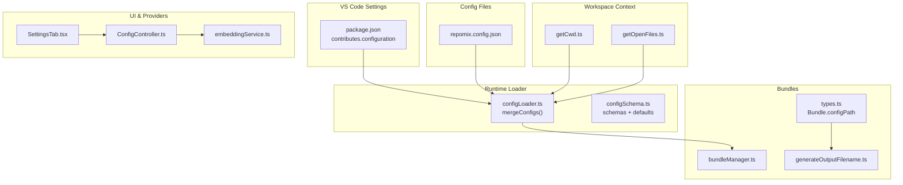
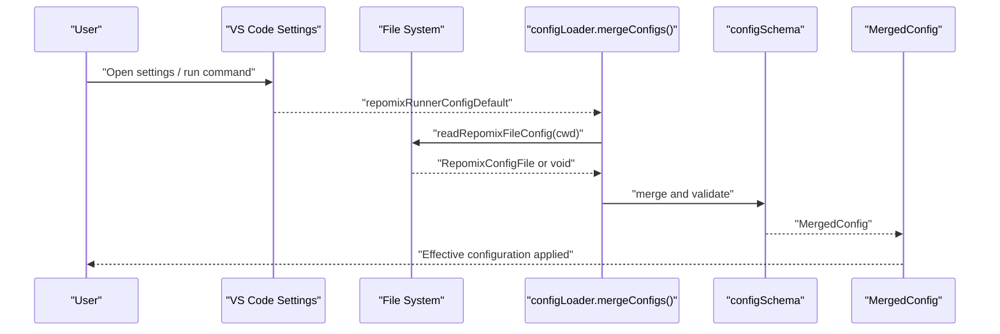
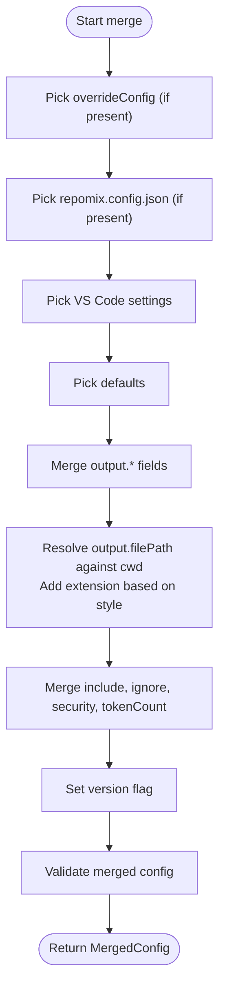
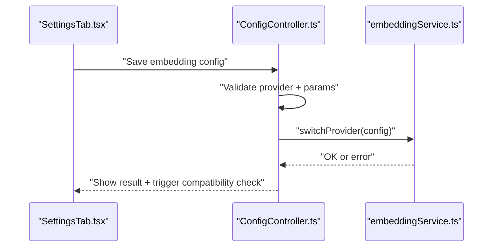
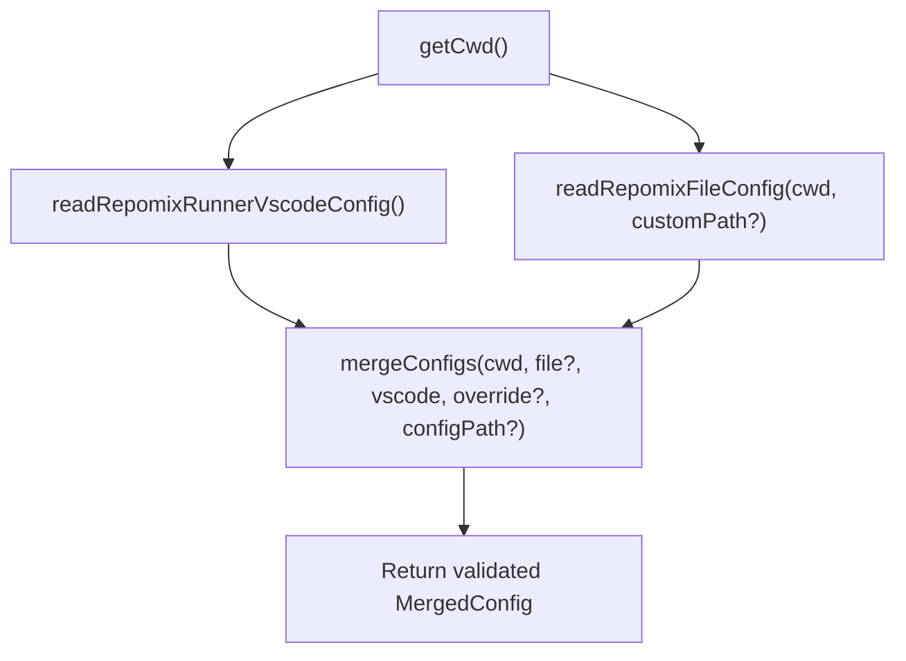
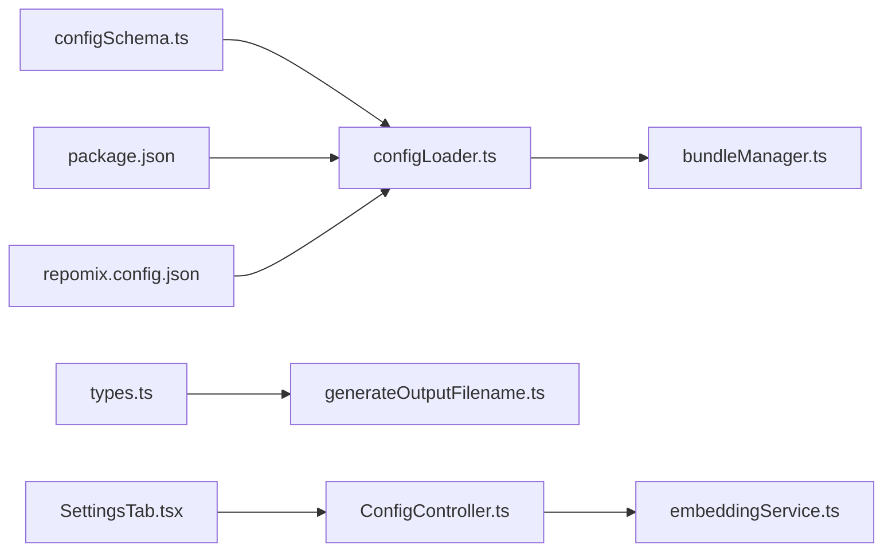

# Configuration Management

<cite>
**Referenced Files in This Document**
- [configLoader.ts](file://src/config/configLoader.ts)
- [configSchema.ts](file://src/config/configSchema.ts)
- [repomix.config.json](file://repomix.config.json)
- [package.json](file://package.json)
- [getCwd.ts](file://src/config/getCwd.ts)
- [getOpenFiles.ts](file://src/config/getOpenFiles.ts)
- [bundleManager.ts](file://src/core/bundles/bundleManager.ts)
- [types.ts](file://src/core/bundles/types.ts)
- [generateOutputFilename.ts](file://src/utils/generateOutputFilename.ts)
- [embeddingService.ts](file://src/core/indexing/embeddingService.ts)
- [SettingsTab.tsx](file://src/webview/components/SettingsTab.tsx)
- [ConfigController.ts](file://src/webview/controllers/ConfigController.ts)
- [goToConfigFile.ts](file://src/commands/goToConfigFile.ts)
- [utils.ts](file://src/commands/utils.ts)
- [cliFlagsBuilder.ts](file://src/core/cli/cliFlagsBuilder.ts)
</cite>

## Table of Contents
1. [Introduction](#introduction)
2. [Project Structure](#project-structure)
3. [Core Components](#core-components)
4. [Architecture Overview](#architecture-overview)
5. [Detailed Component Analysis](#detailed-component-analysis)
6. [Dependency Analysis](#dependency-analysis)
7. [Performance Considerations](#performance-considerations)
8. [Troubleshooting Guide](#troubleshooting-guide)
9. [Conclusion](#conclusion)
10. [Appendices](#appendices)

## Introduction
This document explains the Configuration Management system used by the extension. It covers how VS Code settings and repomix.config.json files combine to form a unified configuration, the precedence rules, inheritance patterns, and override mechanisms. It also documents the configuration schema validation, supported properties, default values, environment-specific behavior (workspace vs user settings, per-project overrides, global defaults), and practical examples for common scenarios such as custom output directories, bundle definitions, and AI provider settings. Finally, it describes the configuration loading process, validation errors, troubleshooting steps, migration guidance, and consistency practices across team environments.

## Project Structure
The configuration system spans several modules:
- Schema definitions and validation
- Configuration loaders and merging logic
- VS Code contribution declarations
- Bundle-level configuration and output naming
- Webview settings and embedding provider configuration
- CLI flag compatibility checks

**Diagram sources**
- [configLoader.ts](file://src/config/configLoader.ts#L145-L229)
- [configSchema.ts](file://src/config/configSchema.ts#L15-L165)
- [repomix.config.json](file://repomix.config.json#L1-L43)
- [package.json](file://package.json#L30-L284)
- [getCwd.ts](file://src/config/getCwd.ts#L8-L17)
- [getOpenFiles.ts](file://src/config/getOpenFiles.ts#L4-L12)
- [bundleManager.ts](file://src/core/bundles/bundleManager.ts)
- [types.ts](file://src/core/bundles/types.ts#L3-L12)
- [generateOutputFilename.ts](file://src/utils/generateOutputFilename.ts#L4-L38)
- [SettingsTab.tsx](file://src/webview/components/SettingsTab.tsx#L450-L479)
- [embeddingService.ts](file://src/core/indexing/embeddingService.ts#L17-L46)
- [ConfigController.ts](file://src/webview/controllers/ConfigController.ts#L696-L734)

**Section sources**
- [configLoader.ts](file://src/config/configLoader.ts#L1-L230)
- [configSchema.ts](file://src/config/configSchema.ts#L1-L165)
- [repomix.config.json](file://repomix.config.json#L1-L43)
- [package.json](file://package.json#L30-L284)

## Core Components
- Configuration schemas define supported properties, enums, defaults, and validation rules.
- VS Code settings contribute default values and UI for configuration.
- repomix.config.json provides per-project overrides.
- mergeConfigs applies precedence and produces a validated MergedConfig.
- Bundle-level configPath allows per-bundle overrides.
- Output filename generation integrates bundle names and configuration paths.

**Section sources**
- [configSchema.ts](file://src/config/configSchema.ts#L15-L165)
- [package.json](file://package.json#L30-L284)
- [repomix.config.json](file://repomix.config.json#L1-L43)
- [configLoader.ts](file://src/config/configLoader.ts#L145-L229)
- [types.ts](file://src/core/bundles/types.ts#L3-L12)
- [generateOutputFilename.ts](file://src/utils/generateOutputFilename.ts#L4-L38)

## Architecture Overview
The configuration pipeline reads VS Code settings, optionally loads a repomix.config.json file, merges them with defaults, and validates the final configuration. The merge respects a strict precedence order and supports runtime overrides.

**Diagram sources**
- [configLoader.ts](file://src/config/configLoader.ts#L145-L229)
- [configSchema.ts](file://src/config/configSchema.ts#L138-L149)

## Detailed Component Analysis

### Configuration Precedence and Merge Logic
The merge prioritizes configuration sources from highest to lowest:
1. overrideConfig (direct function parameter)
2. configFromRepomixFile (from repomix.config.json)
3. configFromRepomixRunnerVscode (from VS Code settings)
4. baseConfig (default configuration)

Key behaviors:
- Arrays and nested objects are merged left-to-right respecting precedence.
- output.filePath is resolved against cwd and extended with a default extension based on output.style.
- Special handling: when runner.useTargetAsOutput is enabled and include resolves to a single directory, output is placed inside that directory using the configured output filename.

**Diagram sources**
- [configLoader.ts](file://src/config/configLoader.ts#L145-L229)

**Section sources**
- [configLoader.ts](file://src/config/configLoader.ts#L132-L229)

### Schema Validation and Supported Properties
- Output styles: plain, xml, markdown, json.
- Default file name mapping per style is defined centrally.
- Base schema supports optional output, include, ignore, security, tokenCount, and version.
- Default schema sets concrete defaults for all keys.
- Runner-specific schema adds runner.* keys and enforces enums.
- Merged schema adds runtime-only fields like cwd, version, and optional remote.

Supported properties include:
- output: filePath, style, parsableStyle, headerText, instructionFilePath, fileSummary, directoryStructure, removeComments, removeEmptyLines, topFilesLength, showLineNumbers, copyToClipboard, includeEmptyDirectories, compress
- include: array of strings
- ignore: useGitignore, useDefaultPatterns, customPatterns
- security: enableSecurityCheck
- tokenCount: encoding
- runner: verbose, keepOutputFile, copyMode, useTargetAsOutput, useBundleNameAsOutputName, configPath
- version: boolean

Defaults are declared in the default schema and enforced by Zod parsing.

**Section sources**
- [configSchema.ts](file://src/config/configSchema.ts#L3-L165)
- [repomix.config.json](file://repomix.config.json#L6-L42)

### Environment-Specific Configurations
- Workspace vs user settings: VS Code settings contribute defaults and can be overridden per workspace via .vscode/settings.json.
- Per-project overrides: repomix.config.json in the project root (or a custom path) overrides VS Code settings for that project.
- Global defaults: baseConfig provides fallbacks when keys are absent.
- Bundle-level overrides: Bundle.configPath can point to a project-local repomix.config.json for a specific bundle.

Practical effects:
- runner.configPath allows selecting a non-default config file path.
- useTargetAsOutput influences output directory placement when include targets a single directory.
- useBundleNameAsOutputName affects generated output filenames for bundles.

**Section sources**
- [package.json](file://package.json#L30-L284)
- [repomix.config.json](file://repomix.config.json#L1-L43)
- [types.ts](file://src/core/bundles/types.ts#L3-L12)
- [generateOutputFilename.ts](file://src/utils/generateOutputFilename.ts#L4-L38)

### AI Provider Settings and Embedding Configuration
- Embedding provider selection and configuration are exposed in the UI and validated by the embedding service.
- Gemini requires an API key; Ollama requires URL, model, and dimension.
- Changing provider or dimensions triggers compatibility checks and may require re-indexing.

**Diagram sources**
- [SettingsTab.tsx](file://src/webview/components/SettingsTab.tsx#L450-L479)
- [ConfigController.ts](file://src/webview/controllers/ConfigController.ts#L696-L734)
- [embeddingService.ts](file://src/core/indexing/embeddingService.ts#L17-L46)

**Section sources**
- [SettingsTab.tsx](file://src/webview/components/SettingsTab.tsx#L450-L479)
- [ConfigController.ts](file://src/webview/controllers/ConfigController.ts#L696-L734)
- [embeddingService.ts](file://src/core/indexing/embeddingService.ts#L17-L46)

### Practical Examples

- Custom output directory with useTargetAsOutput:
  - Set runner.useTargetAsOutput to true.
  - Provide include with a single directory path.
  - The effective output will be placed under that directory using the configured output filename.

- Bundle-specific configuration:
  - Set Bundle.configPath to a project-local repomix.config.json.
  - Use bundle-level output customization via output.filePath and output.style.

- AI provider configuration:
  - For Gemini: set provider to gemini and supply the API key.
  - For Ollama: set provider to ollama and supply URL, model, and dimension.

Note: These examples describe behaviors implemented by the configuration system and UI; refer to the linked sources for precise property names and defaults.

**Section sources**
- [configLoader.ts](file://src/config/configLoader.ts#L167-L176)
- [types.ts](file://src/core/bundles/types.ts#L3-L12)
- [SettingsTab.tsx](file://src/webview/components/SettingsTab.tsx#L450-L479)
- [ConfigController.ts](file://src/webview/controllers/ConfigController.ts#L696-L734)

### Configuration Loading Process
- getCwd determines the workspace root used as cwd for resolving paths.
- readRepomixRunnerVscodeConfig reads VS Code settings and validates them against the runner default schema.
- readRepomixFileConfig attempts to locate and parse repomix.config.json, stripping comments before parsing.
- mergeConfigs performs the precedence-based merge and validates the final configuration.

**Diagram sources**
- [getCwd.ts](file://src/config/getCwd.ts#L8-L17)
- [configLoader.ts](file://src/config/configLoader.ts#L99-L229)

**Section sources**
- [getCwd.ts](file://src/config/getCwd.ts#L8-L17)
- [configLoader.ts](file://src/config/configLoader.ts#L99-L229)

### CLI Flags Compatibility
CLI flags builder validates whether configuration keys are supported by CLI. Some keys (like runner.configPath, include, and version) are not mapped to CLI flags and will produce warnings if present in the configuration.

**Section sources**
- [cliFlagsBuilder.ts](file://src/core/cli/cliFlagsBuilder.ts#L168-L214)

## Dependency Analysis
The configuration system exhibits clear separation of concerns:
- Schemas define contracts and defaults.
- Loaders orchestrate reading and merging.
- VS Code contributes defaults and UI.
- Bundles integrate per-bundle configuration.
- UI components manage provider configuration and compatibility checks.

**Diagram sources**
- [configSchema.ts](file://src/config/configSchema.ts#L15-L165)
- [configLoader.ts](file://src/config/configLoader.ts#L145-L229)
- [package.json](file://package.json#L30-L284)
- [repomix.config.json](file://repomix.config.json#L1-L43)
- [bundleManager.ts](file://src/core/bundles/bundleManager.ts)
- [types.ts](file://src/core/bundles/types.ts#L3-L12)
- [generateOutputFilename.ts](file://src/utils/generateOutputFilename.ts#L4-L38)
- [SettingsTab.tsx](file://src/webview/components/SettingsTab.tsx#L450-L479)
- [ConfigController.ts](file://src/webview/controllers/ConfigController.ts#L696-L734)
- [embeddingService.ts](file://src/core/indexing/embeddingService.ts#L17-L46)

**Section sources**
- [configLoader.ts](file://src/config/configLoader.ts#L145-L229)
- [configSchema.ts](file://src/config/configSchema.ts#L15-L165)

## Performance Considerations
- Prefer minimal include patterns to reduce processing overhead.
- Use ignore.useGitignore and ignore.useDefaultPatterns to exclude large or irrelevant directories.
- Limit output.style to the least verbose format that meets your needs to reduce token count.
- Avoid excessive customPatterns; leverage built-in defaults where possible.
- When using embedding providers, choose appropriate models and dimensions to balance accuracy and performance.

## Troubleshooting Guide
Common issues and resolutions:
- Invalid repomix.config.json format:
  - Symptom: Error message and thrown exception during parsing.
  - Resolution: Fix JSON syntax and comments; ensure properties match the schema.
  - Reference: [configLoader.ts](file://src/config/configLoader.ts#L121-L129)

- Missing workspace root:
  - Symptom: Error indicating no root workspace folder found.
  - Resolution: Open a folder/workspace in VS Code.
  - Reference: [getCwd.ts](file://src/config/getCwd.ts#L11-L14)

- No config files found:
  - Symptom: Warning when searching for repomix.config.json files.
  - Resolution: Create a repomix.config.json in your project or select a different config path.
  - Reference: [utils.ts](file://src/commands/utils.ts#L95-L98)

- Embedding provider misconfiguration:
  - Symptom: Errors when switching provider or saving embedding config.
  - Resolution: Ensure required keys are present (e.g., Gemini API key, Ollama URL/model/dimension).
  - Reference: [embeddingService.ts](file://src/core/indexing/embeddingService.ts#L30-L41), [ConfigController.ts](file://src/webview/controllers/ConfigController.ts#L696-L734)

- CLI flag mismatch:
  - Symptom: Warnings that certain configuration keys are not supported by CLI flags.
  - Resolution: Use VS Code settings or repomix.config.json for those keys.
  - Reference: [cliFlagsBuilder.ts](file://src/core/cli/cliFlagsBuilder.ts#L168-L214)

- Output path resolution:
  - Symptom: Unexpected output location.
  - Resolution: Review runner.useTargetAsOutput and include patterns; confirm cwd and output.filePath.
  - Reference: [configLoader.ts](file://src/config/configLoader.ts#L167-L176)

**Section sources**
- [configLoader.ts](file://src/config/configLoader.ts#L121-L129)
- [getCwd.ts](file://src/config/getCwd.ts#L11-L14)
- [utils.ts](file://src/commands/utils.ts#L95-L98)
- [embeddingService.ts](file://src/core/indexing/embeddingService.ts#L30-L41)
- [ConfigController.ts](file://src/webview/controllers/ConfigController.ts#L696-L734)
- [cliFlagsBuilder.ts](file://src/core/cli/cliFlagsBuilder.ts#L168-L214)

## Conclusion
The configuration system combines VS Code settings and repomix.config.json with a clear precedence model, robust schema validation, and helpful defaults. It supports environment-specific behavior, per-bundle overrides, and provider configuration for AI indexing. By following the documented precedence, defaults, and troubleshooting steps, teams can maintain consistent and reliable configurations across diverse development environments.

## Appendices

### Configuration Precedence Summary
Highest to lowest:
1. overrideConfig (function parameter)
2. repomix.config.json
3. VS Code settings (package.json contributes)
4. baseConfig (defaults)

**Section sources**
- [configLoader.ts](file://src/config/configLoader.ts#L132-L138)
- [configSchema.ts](file://src/config/configSchema.ts#L157-L165)

### Default Values Reference
- output: filePath defaults to a style-specific default; style defaults to plain; fileSummary defaults to true; directoryStructure defaults to true; removeComments defaults to false; removeEmptyLines defaults to false; topFilesLength defaults to 5; showLineNumbers defaults to false; copyToClipboard defaults to false; includeEmptyDirectories defaults to false; compress defaults to false.
- ignore: useGitignore defaults to true; useDefaultPatterns defaults to true; customPatterns defaults to [].
- security: enableSecurityCheck defaults to true.
- runner: verbose defaults to false; keepOutputFile defaults to true; copyMode defaults to file; useTargetAsOutput defaults to true; useBundleNameAsOutputName defaults to true; configPath defaults to empty string.
- tokenCount: encoding is optional.

**Section sources**
- [configSchema.ts](file://src/config/configSchema.ts#L60-L101)
- [configSchema.ts](file://src/config/configSchema.ts#L125-L136)

### Migration Guidance
- From legacy formats to repomix.config.json:
  - Map old settings to equivalent properties in the base schema.
  - Place the file at the project root or a custom path and update runner.configPath accordingly.
  - Validate by running a test bundle and checking the effective configuration in the UI.
- Team consistency:
  - Commit repomix.config.json to version control.
  - Define a shared .vscode/settings.json for common defaults across the team.
  - Use bundle.configPath for per-bundle overrides to keep the root config minimal.

**Section sources**
- [repomix.config.json](file://repomix.config.json#L1-L43)
- [types.ts](file://src/core/bundles/types.ts#L3-L12)
- [goToConfigFile.ts](file://src/commands/goToConfigFile.ts#L10-L69)