# Configuration Management

<cite>
**Referenced Files in This Document**
- [configLoader.ts](file://src/config/configLoader.ts)
- [configSchema.ts](file://src/config/configSchema.ts)
- [repomix.config.json](file://repomix.config.json)
- [package.json](file://package.json)
- [getCwd.ts](file://src/config/getCwd.ts)
- [getOpenFiles.ts](file://src/config/getOpenFiles.ts)
- [bundleManager.ts](file://src/core/bundles/bundleManager.ts)
- [types.ts](file://src/core/bundles/types.ts)
- [generateOutputFilename.ts](file://src/utils/generateOutputFilename.ts)
- [embeddingService.ts](file://src/core/indexing/embeddingService.ts)
- [OpenRouterProvider.ts](file://src/core/indexing/embeddings/OpenRouterProvider.ts)
- [SettingsTab.tsx](file://src/webview/components/SettingsTab.tsx)
- [ConfigController.ts](file://src/webview/controllers/ConfigController.ts)
- [goToConfigFile.ts](file://src/commands/goToConfigFile.ts)
- [utils.ts](file://src/commands/utils.ts)
- [cliFlagsBuilder.ts](file://src/core/cli/cliFlagsBuilder.ts)
- [extension.ts](file://src/extension.ts)
- [postgresClient.ts](file://src/chat/db/postgresClient.ts)
- [checkFreshness.ts](file://src/chat/architecture/nodes/checkFreshness.ts)
- [storeDocument.ts](file://src/chat/architecture/nodes/storeDocument.ts)
- [architectureRepository.ts](file://src/chat/db/architectureRepository.ts)
- [ChatController.ts](file://src/webview/controllers/ChatController.ts)
- [editModeSelector.ts](file://src/chat/apply/editModeSelector.ts)
- [searchReplaceApplier.ts](file://src/chat/apply/searchReplaceApplier.ts)
- [contentAnalyst.ts](file://src/core/patching/contentAnalyst.ts)
- [types.ts](file://src/chat/apply/types.ts)
- [ChatSettingsTab.tsx](file://src/webview/components/ai-chat/ChatSettingsTab.tsx)
- [compressContext.ts](file://src/chat/nodes/compressContext.ts)
- [contextManager.ts](file://src/chat/compression/contextManager.ts)
- [tokenBudget.ts](file://src/chat/compression/tokenBudget.ts)
- [llmClient.ts](file://src/agent/llmClient.ts)
- [AiChatWebviewProvider.ts](file://src/webview/AiChatWebviewProvider.ts)
- [010_chat_settings_ui.md](file://PRDs/010_chat_settings_ui.md)
- [008_repo_architecture_generator.md](file://PRDs/008_repo_architecture_generator.md)
- [009_file_edit_applier.md](file://PRDs/009_file_edit_applier.md)
</cite>

## Update Summary
**Changes Made**
- Enhanced OpenRouter configuration system with comprehensive settings registration in package.json
- Added OpenRouter provider support with advanced routing, fallback, and quantization controls
- Expanded configuration schema validation to include OpenRouter-specific properties
- Updated default values and enhanced security through VS Code secrets storage for OpenRouter API keys
- Improved embedding provider configuration with OpenRouter integration
- Enhanced chat configuration management with OpenRouter embedding support

## Table of Contents
1. [Introduction](#introduction)
2. [Project Structure](#project-structure)
3. [Core Components](#core-components)
4. [Architecture Overview](#architecture-overview)
5. [Detailed Component Analysis](#detailed-component-analysis)
6. [Chat Configuration Management](#chat-configuration-management)
7. [Security and Secrets Management](#security-and-secrets-management)
8. [Dependency Analysis](#dependency-analysis)
9. [Performance Considerations](#performance-considerations)
10. [Troubleshooting Guide](#troubleshooting-guide)
11. [Conclusion](#conclusion)
12. [Appendices](#appendices)

## Introduction
This document explains the Configuration Management system used by the extension. It covers how VS Code settings and repomix.config.json files combine to form a unified configuration, the precedence rules, inheritance patterns, and override mechanisms. The system now includes enhanced security through VS Code secrets storage for sensitive credentials like PostgreSQL connection strings and OpenRouter API keys, comprehensive chat configuration management including architecture document refresh controls, advanced embedding provider configuration with OpenRouter support, and sophisticated file edit application mode controls. It also documents the configuration schema validation, supported properties, default values, environment-specific behavior (workspace vs user settings, per-project overrides, global defaults), and practical examples for common scenarios such as custom output directories, bundle definitions, AI provider settings, chat workflow optimization, and fine-grained edit application control. Finally, it describes the configuration loading process, validation errors, troubleshooting steps, migration guidance, and consistency practices across team environments.

## Project Structure
The configuration system spans several modules with enhanced security, chat integration, embedding provider support, and file edit application capabilities:
- Schema definitions and validation with OpenRouter integration
- Configuration loaders and merging logic
- VS Code contribution declarations with comprehensive OpenRouter settings
- Bundle-level configuration and output naming
- Webview settings with OpenRouter provider configuration
- Embedding service supporting multiple providers including OpenRouter
- Chat configuration management including architecture refresh controls and edit mode settings
- File edit application system with three distinct modes (full, search_replace, hybrid)
- CLI flag compatibility checks
- Secure secrets storage for sensitive credentials including OpenRouter API keys

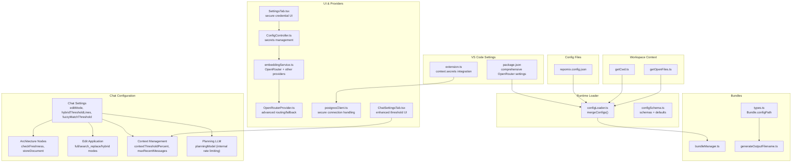

**Diagram sources**
- [configLoader.ts](file://src/config/configLoader.ts#L145-L229)
- [configSchema.ts](file://src/config/configSchema.ts#L15-L165)
- [repomix.config.json](file://repomix.config.json#L1-L43)
- [package.json](file://package.json#L307-L348)
- [getCwd.ts](file://src/config/getCwd.ts#L8-L17)
- [getOpenFiles.ts](file://src/config/getOpenFiles.ts#L4-L12)
- [bundleManager.ts](file://src/core/bundles/bundleManager.ts)
- [types.ts](file://src/core/bundles/types.ts#L3-L12)
- [generateOutputFilename.ts](file://src/utils/generateOutputFilename.ts#L4-L38)
- [checkFreshness.ts](file://src/chat/architecture/nodes/checkFreshness.ts#L1-L64)
- [storeDocument.ts](file://src/chat/architecture/nodes/storeDocument.ts#L1-L41)
- [editModeSelector.ts](file://src/chat/apply/editModeSelector.ts#L1-L51)
- [searchReplaceApplier.ts](file://src/chat/apply/searchReplaceApplier.ts#L1-L133)
- [SettingsTab.tsx](file://src/webview/components/SettingsTab.tsx#L1084-L1093)
- [embeddingService.ts](file://src/core/indexing/embeddingService.ts#L1-L198)
- [OpenRouterProvider.ts](file://src/core/indexing/embeddings/OpenRouterProvider.ts#L1-L137)
- [ConfigController.ts](file://src/webview/controllers/ConfigController.ts#L696-L734)
- [extension.ts](file://src/extension.ts#L75-L106)
- [postgresClient.ts](file://src/chat/db/postgresClient.ts#L282-L312)
- [ChatSettingsTab.tsx](file://src/webview/components/ai-chat/ChatSettingsTab.tsx#L302-L314)
- [compressContext.ts](file://src/chat/nodes/compressContext.ts#L22-L27)
- [contextManager.ts](file://src/chat/compression/contextManager.ts#L138-L182)
- [llmClient.ts](file://src/agent/llmClient.ts#L1-L25)

**Section sources**
- [configLoader.ts](file://src/config/configLoader.ts#L1-L230)
- [configSchema.ts](file://src/config/configSchema.ts#L1-L165)
- [repomix.config.json](file://repomix.config.json#L1-L43)
- [package.json](file://package.json#L30-L284)

## Core Components
- Configuration schemas define supported properties, enums, defaults, and validation rules with OpenRouter integration.
- VS Code settings contribute default values and UI for configuration including comprehensive OpenRouter settings.
- repomix.config.json provides per-project overrides.
- mergeConfigs applies precedence and produces a validated MergedConfig.
- Bundle-level configPath allows per-bundle overrides.
- Output filename generation integrates bundle names and configuration paths.
- **Enhanced Security**: VS Code secrets storage API manages sensitive credentials including OpenRouter API keys with encryption and secure storage patterns.
- **Chat Configuration**: Comprehensive chat settings including architecture document refresh controls, batch processing parameters, context management, and file edit application modes.
- **File Edit Application**: Three distinct edit modes (full file write, SEARCH/REPLACE patch, hybrid auto-selection) with configurable thresholds for optimal edit application.
- **Enhanced Context Management**: Improved user experience with clearer threshold descriptions and real-time visual feedback for context compression settings.
- **Simplified Planning LLM**: Planning LLM configuration now uses internal rate limiting via environment variables instead of user-configurable RPM settings.
- **OpenRouter Integration**: Advanced OpenRouter provider support with routing order, fallback mechanisms, and quantization preferences for optimal embedding performance.

**Section sources**
- [configSchema.ts](file://src/config/configSchema.ts#L15-L165)
- [package.json](file://package.json#L30-L284)
- [repomix.config.json](file://repomix.config.json#L1-L43)
- [configLoader.ts](file://src/config/configLoader.ts#L145-L229)
- [types.ts](file://src/core/bundles/types.ts#L3-L12)
- [generateOutputFilename.ts](file://src/utils/generateOutputFilename.ts#L4-L38)

## Architecture Overview
The configuration pipeline reads VS Code settings, optionally loads a repomix.config.json file, merges them with defaults, and validates the final configuration. The merge respects a strict precedence order and supports runtime overrides. **Enhanced security** ensures sensitive credentials are stored securely using VS Code's secrets storage API. **Chat configuration** provides granular control over AI workflows including architecture document refresh intervals, batch processing parameters, context management, and file edit application modes with fine-grained control over edit behavior. **OpenRouter integration** extends embedding provider capabilities with advanced routing, fallback, and quantization controls for optimal performance.

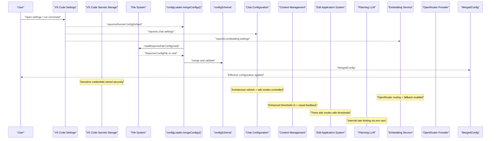

**Diagram sources**
- [configLoader.ts](file://src/config/configLoader.ts#L145-L229)
- [configSchema.ts](file://src/config/configSchema.ts#L138-L149)
- [extension.ts](file://src/extension.ts#L75-L106)
- [package.json](file://package.json#L307-L348)
- [ChatSettingsTab.tsx](file://src/webview/components/ai-chat/ChatSettingsTab.tsx#L302-L314)
- [llmClient.ts](file://src/agent/llmClient.ts#L1-L25)

## Detailed Component Analysis

### Configuration Precedence and Merge Logic
The merge prioritizes configuration sources from highest to lowest:
1. overrideConfig (direct function parameter)
2. configFromRepomixFile (from repomix.config.json)
3. configFromRepomixRunnerVscode (from VS Code settings)
4. baseConfig (default configuration)

Key behaviors:
- Arrays and nested objects are merged left-to-right respecting precedence.
- output.filePath is resolved against cwd and extended with a default extension based on output.style.
- Special handling: when runner.useTargetAsOutput is enabled and include resolves to a single directory, output is placed inside that directory using the configured output filename.
- **Enhanced**: Chat configuration settings are merged separately and include architecture refresh controls, edit application mode settings, and improved context management with clearer threshold descriptions.
- **Enhanced**: OpenRouter configuration settings are integrated with provider routing, fallback, and quantization preferences.

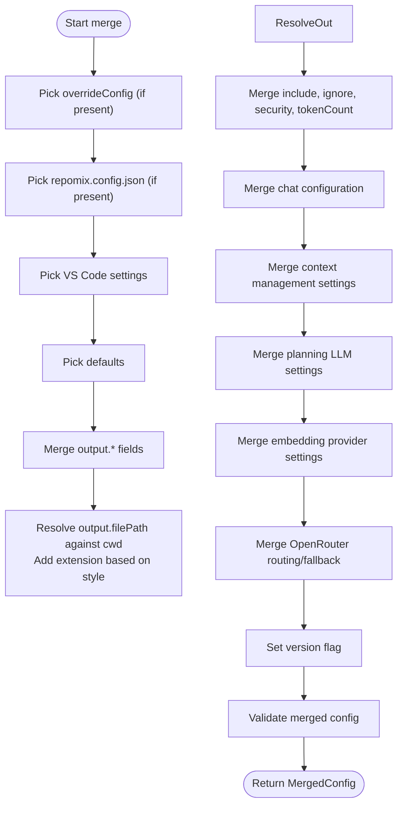

**Diagram sources**
- [configLoader.ts](file://src/config/configLoader.ts#L145-L229)

**Section sources**
- [configLoader.ts](file://src/config/configLoader.ts#L132-L229)

### Schema Validation and Supported Properties
- Output styles: plain, xml, markdown, json.
- Default file name mapping per style is defined centrally.
- Base schema supports optional output, include, ignore, security, tokenCount, and version.
- Default schema sets concrete defaults for all keys.
- Runner-specific schema adds runner.* keys and enforces enums.
- Merged schema adds runtime-only fields like cwd, version, and optional remote.
- **Enhanced**: Chat configuration schema includes architecture refresh controls, batch processing parameters, file edit application mode settings, and comprehensive context management with improved threshold descriptions.
- **Enhanced**: OpenRouter configuration schema includes advanced routing, fallback, and quantization controls with comprehensive validation.

Supported properties include:
- output: filePath, style, parsableStyle, headerText, instructionFilePath, fileSummary, directoryStructure, removeComments, removeEmptyLines, topFilesLength, showLineNumbers, copyToClipboard, includeEmptyDirectories, compress
- include: array of strings
- ignore: useGitignore, useDefaultPatterns, customPatterns
- security: enableSecurityCheck
- tokenCount: encoding
- runner: verbose, keepOutputFile, copyMode, useTargetAsOutput, useBundleNameAsOutputName, configPath
- **Embedding**: provider (gemini, ollama, lmstudio, openrouter), ollama (url, model, dimension), lmstudio (baseUrl, apiKey, model, dimension), **openrouter (baseUrl, model, dimension, providerOrder, allowFallbacks, quantizations)**
- **Chat configuration**: contextThresholdPercent, maxRecentMessages, batchModel, batchMaxTokens, batchThinkingBudget, batchPollIntervalSeconds, batchSendAllLimit, batchApiMaxRetries, batchApiRetryBaseMs, batchApiRetryMaxMs, architectureRefreshHours, **editMode**, **hybridThresholdLines**, **fuzzyMatchThreshold**, **planningModel**
- **Context management**: **contextThresholdPercent** (with enhanced UI description), **maxRecentMessages** (with improved slider feedback)
- **Planning LLM**: **planningModel** (with internal rate limiting via environment variables)
- version: boolean

Defaults are declared in the default schema and enforced by Zod parsing.

**Section sources**
- [configSchema.ts](file://src/config/configSchema.ts#L3-L165)
- [repomix.config.json](file://repomix.config.json#L6-L42)
- [package.json](file://package.json#L307-L348)

### Environment-Specific Configurations
- Workspace vs user settings: VS Code settings contribute defaults and can be overridden per workspace via .vscode/settings.json.
- Per-project overrides: repomix.config.json in the project root (or a custom path) overrides VS Code settings for that project.
- Global defaults: baseConfig provides fallbacks when keys are absent.
- Bundle-level overrides: Bundle.configPath can point to a project-local repomix.config.json for a specific bundle.
- **Chat environment**: Architecture refresh settings and edit mode configurations are environment-specific and control document freshness and edit application behavior across sessions.
- **Enhanced Context Management**: Context threshold settings provide real-time visual feedback with percentage displays and improved descriptions for better user understanding.
- **Simplified Planning LLM**: Planning model configuration is environment-specific and uses internal rate limiting via GEMINI_RPM environment variable.
- **OpenRouter Environment**: OpenRouter provider settings are environment-specific and include routing order, fallback mechanisms, and quantization preferences.

Practical effects:
- runner.configPath allows selecting a non-default config file path.
- useTargetAsOutput influences output directory placement when include targets a single directory.
- useBundleNameAsOutputName affects generated output filenames for bundles.
- **Chat**: architectureRefreshHours controls TTL-based document regeneration frequency.
- **Chat**: editMode controls how file edits are applied (full, search_replace, hybrid).
- **Chat**: hybridThresholdLines determines when hybrid mode switches between edit modes.
- **Chat**: fuzzyMatchThreshold controls similarity requirements for fuzzy matching.
- **Enhanced Context**: contextThresholdPercent provides real-time percentage display in the UI with improved threshold descriptions.
- **Planning LLM**: planningModel selects between gemini-2.5-flash and gemini-2.5-flash-lite models with internal rate limiting.
- **OpenRouter**: providerOrder controls routing order through different providers, allowFallbacks enables automatic fallback, quantizations specify preferred quantization levels.

**Section sources**
- [package.json](file://package.json#L30-L284)
- [repomix.config.json](file://repomix.config.json#L1-L43)
- [types.ts](file://src/core/bundles/types.ts#L3-L12)
- [generateOutputFilename.ts](file://src/utils/generateOutputFilename.ts#L4-L38)

### AI Provider Settings and Embedding Configuration
- Embedding provider selection and configuration are exposed in the UI and validated by the embedding service.
- Gemini requires an API key; Ollama requires URL, model, and dimension; **OpenRouter requires API key, model, dimension, and supports advanced routing/fallback/quantization**.
- **Enhanced**: OpenRouter provider supports provider routing order, automatic fallback mechanisms, and quantization preferences for optimal performance.
- Changing provider or dimensions triggers compatibility checks and may require re-indexing.

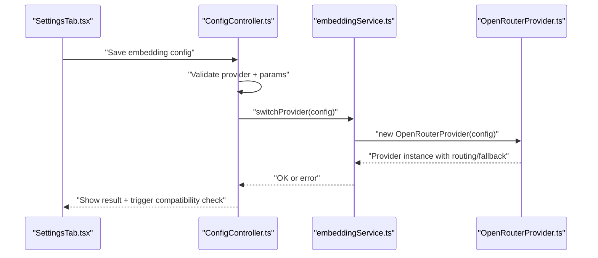

**Diagram sources**
- [SettingsTab.tsx](file://src/webview/components/SettingsTab.tsx#L450-L479)
- [ConfigController.ts](file://src/webview/controllers/ConfigController.ts#L696-L734)
- [embeddingService.ts](file://src/core/indexing/embeddingService.ts#L1-L198)
- [OpenRouterProvider.ts](file://src/core/indexing/embeddings/OpenRouterProvider.ts#L1-L137)

**Section sources**
- [SettingsTab.tsx](file://src/webview/components/SettingsTab.tsx#L450-L479)
- [ConfigController.ts](file://src/webview/controllers/ConfigController.ts#L696-L734)
- [embeddingService.ts](file://src/core/indexing/embeddingService.ts#L1-L198)
- [OpenRouterProvider.ts](file://src/core/indexing/embeddings/OpenRouterProvider.ts#L1-L137)

### Practical Examples

- Custom output directory with useTargetAsOutput:
  - Set runner.useTargetAsOutput to true.
  - Provide include with a single directory path.
  - The effective output will be placed under that directory using the configured output filename.

- Bundle-specific configuration:
  - Set Bundle.configPath to a project-local repomix.config.json.
  - Use bundle-level output customization via output.filePath and output.style.

- AI provider configuration:
  - For Gemini: set provider to gemini and supply the API key.
  - For Ollama: set provider to ollama and supply URL, model, and dimension.
  - **For OpenRouter: set provider to openrouter and supply API key, model, dimension, and optional routing/fallback/quantization settings**.

- **Enhanced Security**: PostgreSQL connection management:
  - Store connection strings securely in VS Code secrets storage.
  - Use the Repomix Runner settings panel to configure and manage connections.
  - Connection strings are automatically encrypted and decrypted as needed.

- **Enhanced Security**: OpenRouter API key management:
  - Store OpenRouter API keys securely in VS Code secrets storage.
  - Use the Repomix Runner settings panel to configure OpenRouter provider settings.
  - API keys are automatically encrypted and decrypted as needed.

- **Chat Architecture Management**:
  - Set repomix.chat.architectureRefreshHours to control TTL-based regeneration (default: 24 hours).
  - Architecture documents are refreshed when git HEAD changes or TTL expires.
  - Manual refresh can be triggered via the AI Chat interface.

- **Enhanced Context Management**:
  - Set repomix.chat.contextThresholdPercent to control when context compression triggers (default: 80%).
  - Set repomix.chat.maxRecentMessages to control how many recent messages are kept in full before summarizing (default: 10).
  - **Enhanced**: The ChatSettingsTab now provides real-time percentage display and improved descriptions for context threshold settings.

- **File Edit Application Control**:
  - Set repomix.chat.editMode to 'full', 'search_replace', or 'hybrid' (default: hybrid).
  - Configure repomix.chat.hybridThresholdLines to determine when hybrid mode switches (default: 300 lines).
  - Set repomix.chat.fuzzyMatchThreshold to control similarity requirements for fuzzy matching (default: 0.85, range 0-1).
  - New files and deletions always use full mode regardless of threshold settings.
  - Existing files below threshold use full mode; files at or above threshold use SEARCH/REPLACE mode.

- **Simplified Planning LLM Configuration**:
  - Set repomix.chat.planningModel to 'gemini-2.5-flash' or 'gemini-2.5-flash-lite' (default: gemini-2.5-flash).
  - Rate limiting is handled internally via GEMINI_RPM environment variable (default: 10).
  - Configure Google API key through the settings UI for planning functionality.

- **OpenRouter Advanced Configuration**:
  - Set repomix.embedding.provider to 'openrouter'.
  - Configure repomix.openrouter.baseUrl, model, and dimension.
  - Set repomix.openrouter.providerOrder for routing preference (e.g., ['nebius']).
  - Enable repomix.openrouter.allowFallbacks for automatic fallback (default: true).
  - Configure repomix.openrouter.quantizations for preferred quantization levels (e.g., ['fp8', 'fp16']).
  - Store OpenRouter API key securely in VS Code secrets storage.

Note: These examples describe behaviors implemented by the configuration system and UI; refer to the linked sources for precise property names and defaults.

**Section sources**
- [configLoader.ts](file://src/config/configLoader.ts#L167-L176)
- [types.ts](file://src/core/bundles/types.ts#L3-L12)
- [SettingsTab.tsx](file://src/webview/components/SettingsTab.tsx#L450-L479)
- [ConfigController.ts](file://src/webview/controllers/ConfigController.ts#L696-L734)
- [storeDocument.ts](file://src/chat/architecture/nodes/storeDocument.ts#L24-L30)
- [editModeSelector.ts](file://src/chat/apply/editModeSelector.ts#L8-L51)
- [searchReplaceApplier.ts](file://src/chat/apply/searchReplaceApplier.ts#L9-L133)
- [contentAnalyst.ts](file://src/core/patching/contentAnalyst.ts#L21-L75)
- [ChatSettingsTab.tsx](file://src/webview/components/ai-chat/ChatSettingsTab.tsx#L302-L314)
- [compressContext.ts](file://src/chat/nodes/compressContext.ts#L22-L27)
- [llmClient.ts](file://src/agent/llmClient.ts#L1-L25)
- [OpenRouterProvider.ts](file://src/core/indexing/embeddings/OpenRouterProvider.ts#L28-L51)

### Configuration Loading Process
- getCwd determines the workspace root used as cwd for resolving paths.
- readRepomixRunnerVscodeConfig reads VS Code settings and validates them against the runner default schema including OpenRouter settings.
- readRepomixFileConfig attempts to locate and parse repomix.config.json, stripping comments before parsing.
- mergeConfigs performs the precedence-based merge and validates the final configuration.
- **Enhanced**: Chat configuration settings are loaded separately and integrated into the merged configuration, including edit mode settings for file application control and enhanced context management with improved UI descriptions.
- **Enhanced**: OpenRouter configuration settings are validated and integrated with provider routing, fallback, and quantization preferences.

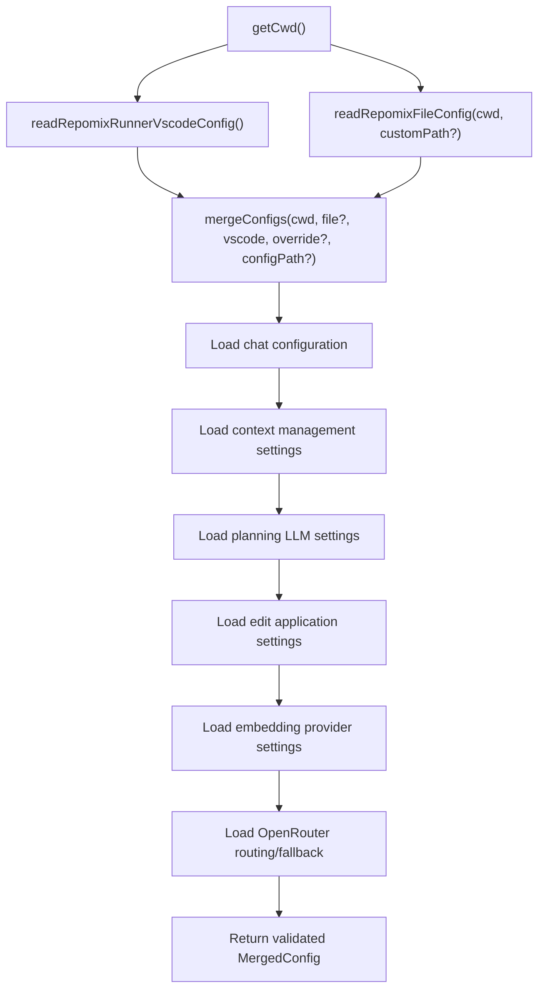

**Diagram sources**
- [getCwd.ts](file://src/config/getCwd.ts#L8-L17)
- [configLoader.ts](file://src/config/configLoader.ts#L99-L229)

**Section sources**
- [getCwd.ts](file://src/config/getCwd.ts#L8-L17)
- [configLoader.ts](file://src/config/configLoader.ts#L99-L229)

### CLI Flags Compatibility
CLI flags builder validates whether configuration keys are supported by CLI. Some keys (like runner.configPath, include, and version) are not mapped to CLI flags and will produce warnings if present in the configuration.

**Section sources**
- [cliFlagsBuilder.ts](file://src/core/cli/cliFlagsBuilder.ts#L168-L214)

## Chat Configuration Management

### Architecture Document Refresh Controls
The chat system includes sophisticated architecture document management with configurable refresh intervals. The `repomix.chat.architectureRefreshHours` setting controls how frequently architecture documents are regenerated based on TTL (time-to-live) calculations.

#### Configuration Details
- **Property**: `repomix.chat.architectureRefreshHours`
- **Type**: number
- **Default**: 24
- **Minimum**: 1
- **Maximum**: 168 (1 week)
- **Description**: Hours between automatic architecture document refreshes

#### Architecture Workflow Integration
The architecture refresh system operates through a LangGraph workflow that:
1. **checkFreshnessNode**: Compares current git HEAD with stored commit hash and checks TTL expiration
2. **scanDirectory**: Builds directory tree structure respecting .gitignore patterns
3. **analyzeKeyFiles**: Identifies entry points, configuration files, and type definitions
4. **gatherDependencies**: Parses package manifests for dependency information
5. **generateDocument**: Uses Gemini Flash to synthesize markdown architecture document
6. **storeDocument**: Persists to PostgreSQL and writes local .repomix/architecture.md

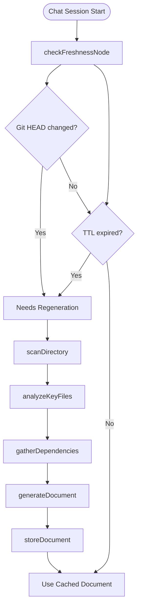

**Diagram sources**
- [checkFreshness.ts](file://src/chat/architecture/nodes/checkFreshness.ts#L11-L64)
- [storeDocument.ts](file://src/chat/architecture/nodes/storeDocument.ts#L11-L41)
- [008_repo_architecture_generator.md](file://PRDs/008_repo_architecture_generator.md#L92-L119)

#### TTL Calculation and Storage
Architecture documents are stored with expiration timestamps calculated from the refresh interval:
- Expiration time = current time + (architectureRefreshHours × 60 × 60 × 1000)
- Stored in PostgreSQL `repo_architecture` table with `expires_at` field
- Git commit hash comparison ensures regeneration when code changes

#### UI Integration
The AI Chat interface provides:
- Architecture refresh interval setting in the Settings tab
- Manual refresh button for immediate regeneration
- Status indicators showing document freshness
- Last generated timestamp display

**Section sources**
- [package.json](file://package.json#L468-L475)
- [checkFreshness.ts](file://src/chat/architecture/nodes/checkFreshness.ts#L1-L64)
- [storeDocument.ts](file://src/chat/architecture/nodes/storeDocument.ts#L1-L41)
- [architectureRepository.ts](file://src/chat/db/architectureRepository.ts#L40-L81)
- [010_chat_settings_ui.md](file://PRDs/010_chat_settings_ui.md#L55-L59)

### Enhanced Context Management Configuration

#### Improved Threshold Descriptions and Visual Feedback
The context management system now provides enhanced user experience with clearer threshold descriptions and real-time visual feedback. The `repomix.chat.contextThresholdPercent` setting controls when context compression is triggered based on token usage percentage.

**Configuration Details**
- **Property**: `repomix.chat.contextThresholdPercent`
- **Type**: number
- **Default**: 80
- **Minimum**: 50
- **Maximum**: 95
- **Description**: Context window usage percentage that triggers automatic compression

**Enhanced UI Features**
The ChatSettingsTab now provides:
- Real-time percentage display showing current threshold value
- Improved slider with clearer visual feedback
- Enhanced descriptions explaining compression trigger conditions
- Better understanding of when context compression will activate

#### Context Management Workflow

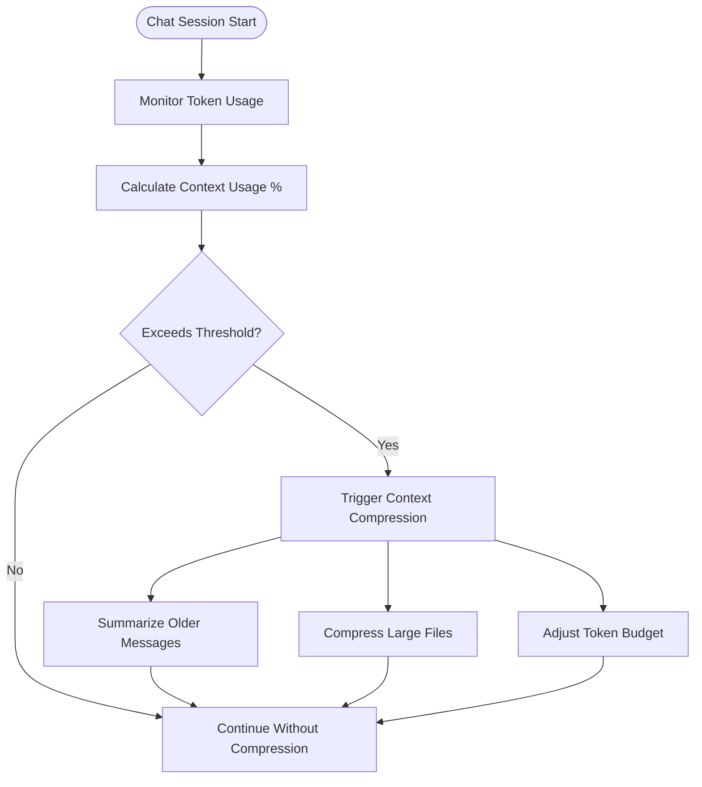

**Diagram sources**
- [compressContext.ts](file://src/chat/nodes/compressContext.ts#L36-L75)
- [contextManager.ts](file://src/chat/compression/contextManager.ts#L138-L200)
- [tokenBudget.ts](file://src/chat/compression/tokenBudget.ts#L196-L208)

#### Implementation Details

**Context Compression Detection**
The `compressContextNode` function reads settings from VS Code configuration and evaluates current token usage against the configured threshold. When token usage exceeds the threshold percentage, the system triggers compression to maintain optimal context size.

**Compression Configuration**
The `createCompressionConfig` function creates compression settings with configurable parameters:
- `contextThresholdPercent`: Percentage threshold for triggering compression
- `maxRecentMessages`: Number of recent messages to keep in full
- `modelContextWindow`: Total context window size for the model
- `messageGroupSize`: Group size for message summarization

**Enhanced User Experience**
The ChatSettingsTab provides:
- Real-time percentage display for context threshold (e.g., "Context Threshold: 80%")
- Clear descriptions explaining when compression triggers
- Improved slider interaction with better visual feedback
- Better understanding of compression behavior and timing

#### UI Integration
The AI Chat Settings tab provides:
- Context threshold slider with real-time percentage display
- Enhanced descriptions explaining compression trigger conditions
- Improved visual feedback for threshold configuration
- Better understanding of context management behavior

**Section sources**
- [package.json](file://package.json#L390-L397)
- [compressContext.ts](file://src/chat/nodes/compressContext.ts#L22-L27)
- [contextManager.ts](file://src/chat/compression/contextManager.ts#L138-L182)
- [tokenBudget.ts](file://src/chat/compression/tokenBudget.ts#L196-L208)
- [ChatSettingsTab.tsx](file://src/webview/components/ai-chat/ChatSettingsTab.tsx#L302-L314)
- [010_chat_settings_ui.md](file://PRDs/010_chat_settings_ui.md#L50-L59)

### File Edit Application Configuration

#### Edit Mode Selection System
The chat system now provides three distinct file edit application modes with fine-grained control over when each mode is used:

**Edit Modes:**
1. **Full File Write**: Complete file replacement
   - New files: write entire content
   - Existing files: overwrite entire file
   - Pros: reliable, no matching issues
   - Cons: consumes more tokens in batch responses

2. **SEARCH/REPLACE Patch**: Incremental file modifications
   - Uses existing patch system with fuzzy matching
   - Finds exact or fuzzy matches for SEARCH blocks
   - Preserves surrounding code context
   - Pros: fewer tokens, maintains code structure
   - Cons: can fail if file content has changed significantly

3. **Hybrid Mode** (Default): Intelligent auto-selection
   - New files → full write
   - Deletions → full write
   - Existing files < hybridThresholdLines → full write
   - Existing files ≥ hybridThresholdLines → SEARCH/REPLACE

#### Configuration Options

**Edit Mode Control**
- **Property**: `repomix.chat.editMode`
- **Type**: string enum
- **Values**: 'full' | 'search_replace' | 'hybrid'
- **Default**: 'hybrid'
- **Description**: How to apply file edits from batch responses

**Hybrid Threshold Configuration**
- **Property**: `repomix.chat.hybridThresholdLines`
- **Type**: number
- **Default**: 300
- **Minimum**: 50
- **Maximum**: 1000
- **Description**: Line count threshold for hybrid mode (files ≥ this use SEARCH/REPLACE)

**Fuzzy Matching Control**
- **Property**: `repomix.chat.fuzzyMatchThreshold`
- **Type**: number (0-1)
- **Default**: 0.85
- **Minimum**: 0
- **Maximum**: 1.0
- **Description**: Similarity score threshold for fuzzy matching

#### Edit Application Workflow

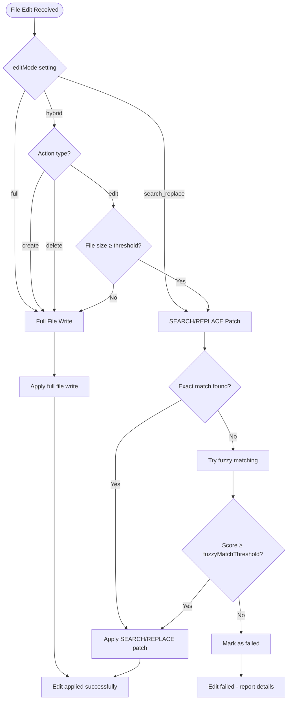

**Diagram sources**
- [editModeSelector.ts](file://src/chat/apply/editModeSelector.ts#L8-L51)
- [searchReplaceApplier.ts](file://src/chat/apply/searchReplaceApplier.ts#L95-L133)
- [contentAnalyst.ts](file://src/core/patching/contentAnalyst.ts#L21-L75)

#### Implementation Details

**Edit Mode Selector**
The `editModeSelector` function determines which mode to use based on:
- Explicit user configuration (if set)
- File action type (create/delete always use full mode)
- File size compared to hybrid threshold
- Current workspace file availability

**SEARCH/REPLACE Application**
The `searchReplaceApplier` handles incremental edits with:
- Exact match detection first
- Fuzzy matching fallback using Levenshtein distance
- Indentation preservation and repair
- Comprehensive error reporting

**Fuzzy Matching Algorithm**
The `contentAnalyst` provides intelligent fuzzy matching with:
- Whitespace normalization for better matching
- Sliding window approach for optimal search
- Indentation detection and preservation
- Configurable similarity thresholds

#### UI Integration
The AI Chat Settings tab provides:
- Edit mode dropdown with three options
- Hybrid threshold slider (50-1000 lines)
- Fuzzy match threshold slider (0.5-1.0 scale)
- Real-time validation and feedback
- Enhanced descriptions for each setting

**Section sources**
- [package.json](file://package.json#L476-L502)
- [editModeSelector.ts](file://src/chat/apply/editModeSelector.ts#L1-L51)
- [searchReplaceApplier.ts](file://src/chat/apply/searchReplaceApplier.ts#L1-L133)
- [contentAnalyst.ts](file://src/core/patching/contentAnalyst.ts#L1-L102)
- [types.ts](file://src/chat/apply/types.ts#L1-L50)
- [010_chat_settings_ui.md](file://PRDs/010_chat_settings_ui.md#L50-L59)
- [009_file_edit_applier.md](file://PRDs/009_file_edit_applier.md#L128-L169)

### Simplified Planning LLM Configuration

#### Internal Rate Limiting via Environment Variables
The planning LLM configuration has been simplified to focus on model selection while handling rate limiting internally through environment variables. The `repomix.chat.planningModel` setting controls which Gemini model to use for planning and orchestration tasks.

**Configuration Details**
- **Property**: `repomix.chat.planningModel`
- **Type**: string enum
- **Values**: 'gemini-2.5-flash' | 'gemini-2.5-flash-lite'
- **Default**: 'gemini-2.5-flash'
- **Description**: LLM model for planning and orchestration

**Internal Rate Limiting Implementation**
The system uses a rate limiting mechanism that:
- Reads GEMINI_RPM environment variable (default: 10 requests per minute)
- Enforces rate limits using p-queue with 60-second intervals
- Maintains sequential processing to stay within API limits
- Allows capacity carryover between intervals

**Rate Limiting Configuration**
- Environment variable: `GEMINI_RPM` (default: 10)
- Free tier limit: 15 RPM
- Safety buffer: 1 RPM (14 effective)
- Processing: Sequential with low concurrency

#### Planning LLM Workflow

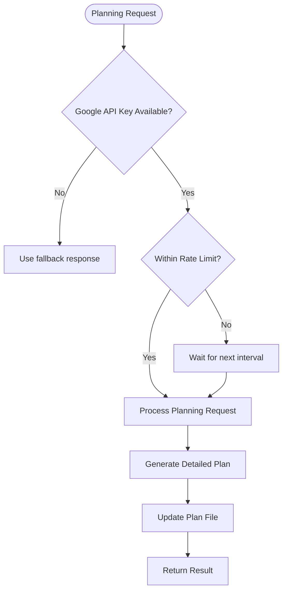

**Diagram sources**
- [llmClient.ts](file://src/agent/llmClient.ts#L1-L25)
- [AiChatWebviewProvider.ts](file://src/webview/AiChatWebviewProvider.ts#L99-L99)

#### Implementation Details

**Environment Variable Configuration**
The rate limiting system reads from environment variables:
- `GEMINI_RPM`: Maximum requests per minute (default: 10)
- Falls back to 10 if not set or invalid
- Provides safety margin below free tier limits

**Rate Limiting Queue**
The `geminiQueue` uses p-queue with:
- Concurrency: 1 (sequential processing)
- Interval: 60,000ms (1 minute)
- Interval capacity: GEMINI_RPM
- Carryover: true (unused capacity carried forward)

**API Key Management**
- Stored securely in VS Code secrets storage
- Retrieved on-demand during extension activation
- Used for planning LLM requests in chat workflows

#### UI Integration
The AI Chat Settings tab provides:
- Planning model selection dropdown
- Google API key input field
- Real-time status display for rate limiting
- Clear descriptions for model capabilities

**Section sources**
- [package.json](file://package.json#L503-L512)
- [llmClient.ts](file://src/agent/llmClient.ts#L1-L25)
- [AiChatWebviewProvider.ts](file://src/webview/AiChatWebviewProvider.ts#L99-L99)
- [ChatSettingsTab.tsx](file://src/webview/components/ai-chat/ChatSettingsTab.tsx#L302-L333)

### OpenRouter Configuration Management

#### Advanced Provider Configuration
The OpenRouter provider supports sophisticated configuration options for optimal embedding performance including routing order, fallback mechanisms, and quantization preferences.

**Configuration Details**
- **Property**: `repomix.embedding.provider`
- **Type**: string enum
- **Values**: 'gemini' | 'ollama' | 'lmstudio' | **'openrouter'**
- **Default**: 'gemini'
- **Description**: Embedding provider to use

**OpenRouter Specific Properties**
- **repomix.openrouter.baseUrl**: Base URL for OpenRouter API (default: https://openrouter.ai/api/v1)
- **repomix.openrouter.model**: Model name for embeddings (default: openai/text-embedding-3-small)
- **repomix.openrouter.dimension**: Embedding dimension size (default: 1536)
- **repomix.openrouter.providerOrder**: Ordered list of providers to route through (default: ['nebius'])
- **repomix.openrouter.allowFallbacks**: Enable automatic fallback to other providers (default: true)
- **repomix.openrouter.quantizations**: Preferred quantization levels (default: ['fp8'])

#### Provider Routing and Fallback Mechanisms
The OpenRouter provider implements intelligent routing and fallback:
- **Routing Order**: Specifies preferred providers in order of preference
- **Automatic Fallback**: Enables fallback to alternative providers if primary fails
- **Quantization Preferences**: Allows specifying preferred quantization levels for optimal performance

#### Security and Integration
- **API Key Management**: Stored securely in VS Code secrets storage
- **Provider Integration**: Seamlessly integrates with embedding service architecture
- **Compatibility Checking**: Validates model dimensions and compatibility

#### UI Integration
The AI Chat Settings tab provides:
- OpenRouter configuration section with all advanced settings
- API key input field with secure storage
- Model selection with dimension auto-detection
- Provider routing configuration
- Fallback and quantization preference controls
- Real-time testing and validation capabilities

**Section sources**
- [package.json](file://package.json#L253-L348)
- [OpenRouterProvider.ts](file://src/core/indexing/embeddings/OpenRouterProvider.ts#L1-L137)
- [embeddingService.ts](file://src/core/indexing/embeddingService.ts#L23-L34)
- [SettingsTab.tsx](file://src/webview/components/SettingsTab.tsx#L672-L1300)
- [ConfigController.ts](file://src/webview/controllers/ConfigController.ts#L752-L778)

## Security and Secrets Management

### Enhanced Security Through VS Code Secrets Storage
The configuration system now uses VS Code's secrets storage API to securely manage sensitive credentials. This migration replaces plaintext storage in VS Code settings with encrypted, platform-protected storage.

#### PostgreSQL Connection String Security
- **Migration**: Connection strings previously stored in VS Code settings are now managed through the secrets API.
- **Storage Location**: Credentials are stored in VS Code's secure secrets vault, encrypted at rest.
- **Access Pattern**: Connection strings are retrieved on-demand using `context.secrets.get()` during extension activation.
- **UI Integration**: The settings panel provides secure input fields with masking and confirmation dialogs.

#### OpenRouter API Key Security
- **New Feature**: OpenRouter API keys are now stored securely in VS Code secrets storage.
- **Storage Location**: API keys are stored in VS Code's secure secrets vault, encrypted at rest.
- **Access Pattern**: API keys are retrieved on-demand using `context.secrets.get()` during extension activation.
- **UI Integration**: The settings panel provides secure input fields with masking and confirmation dialogs.

#### Secrets Management Implementation
The system implements a comprehensive secrets management strategy:

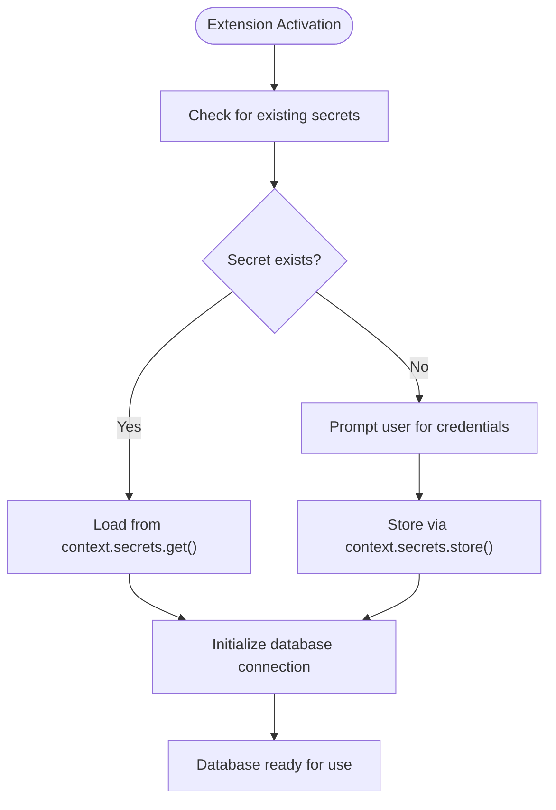

**Diagram sources**
- [extension.ts](file://src/extension.ts#L75-L106)
- [ConfigController.ts](file://src/webview/controllers/ConfigController.ts#L210-L247)

#### Security Benefits
- **Encryption**: All secrets are automatically encrypted using platform-specific key derivation.
- **Platform Protection**: Leverages OS-level keychain integration (Windows Credential Manager, macOS Keychain, Linux Secret Service).
- **Scope Isolation**: Secrets are scoped to the extension and cannot be accessed by other extensions.
- **Automatic Rotation**: Supports seamless credential rotation without manual intervention.

#### Best Practices for Teams
- **Consistent Storage**: All sensitive credentials should be migrated to secrets storage.
- **Backup Strategy**: Secrets are automatically backed up with VS Code settings synchronization.
- **Access Control**: Only authorized users with access to the development machine can access stored credentials.
- **Audit Trail**: Changes to secrets are tracked through the extension lifecycle.

**Section sources**
- [extension.ts](file://src/extension.ts#L75-L106)
- [ConfigController.ts](file://src/webview/controllers/ConfigController.ts#L15-L15)
- [ConfigController.ts](file://src/webview/controllers/ConfigController.ts#L210-L247)
- [SettingsTab.tsx](file://src/webview/components/SettingsTab.tsx#L1084-L1093)

## Dependency Analysis
The configuration system exhibits clear separation of concerns with enhanced security integration, OpenRouter provider support, chat integration, and file edit application capabilities:
- Schemas define contracts and defaults with OpenRouter integration.
- Loaders orchestrate reading and merging.
- VS Code contributes defaults and UI with comprehensive OpenRouter settings.
- Bundles integrate per-bundle configuration.
- UI components manage provider configuration and compatibility checks.
- **Enhanced Security**: Secrets management handles sensitive credential storage and retrieval.
- **OpenRouter Integration**: Advanced provider configuration with routing, fallback, and quantization controls.
- **Chat Configuration**: Architecture refresh controls integrate with the LangGraph workflow system.
- **File Edit Application**: Edit mode selection and application system provides flexible file modification capabilities.
- **Enhanced Context Management**: Improved UI integration with real-time threshold feedback and clearer descriptions.
- **Simplified Planning LLM**: Internal rate limiting via environment variables reduces configuration complexity.

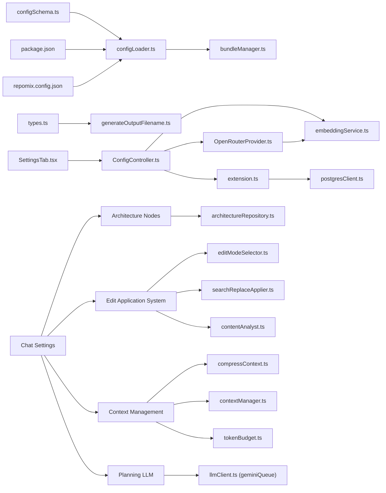

**Diagram sources**
- [configSchema.ts](file://src/config/configSchema.ts#L15-L165)
- [configLoader.ts](file://src/config/configLoader.ts#L145-L229)
- [package.json](file://package.json#L30-L284)
- [repomix.config.json](file://repomix.config.json#L1-L43)
- [bundleManager.ts](file://src/core/bundles/bundleManager.ts)
- [types.ts](file://src/core/bundles/types.ts#L3-L12)
- [generateOutputFilename.ts](file://src/utils/generateOutputFilename.ts#L4-L38)
- [SettingsTab.tsx](file://src/webview/components/SettingsTab.tsx#L450-L479)
- [ConfigController.ts](file://src/webview/controllers/ConfigController.ts#L696-L734)
- [embeddingService.ts](file://src/core/indexing/embeddingService.ts#L1-L198)
- [OpenRouterProvider.ts](file://src/core/indexing/embeddings/OpenRouterProvider.ts#L1-L137)
- [extension.ts](file://src/extension.ts#L75-L106)
- [postgresClient.ts](file://src/chat/db/postgresClient.ts#L282-L312)
- [checkFreshness.ts](file://src/chat/architecture/nodes/checkFreshness.ts#L1-L64)
- [storeDocument.ts](file://src/chat/architecture/nodes/storeDocument.ts#L1-L41)
- [architectureRepository.ts](file://src/chat/db/architectureRepository.ts#L40-L81)
- [editModeSelector.ts](file://src/chat/apply/editModeSelector.ts#L1-L51)
- [searchReplaceApplier.ts](file://src/chat/apply/searchReplaceApplier.ts#L1-L133)
- [contentAnalyst.ts](file://src/core/patching/contentAnalyst.ts#L1-L102)
- [compressContext.ts](file://src/chat/nodes/compressContext.ts#L1-L75)
- [contextManager.ts](file://src/chat/compression/contextManager.ts#L1-L200)
- [tokenBudget.ts](file://src/chat/compression/tokenBudget.ts#L1-L209)
- [llmClient.ts](file://src/agent/llmClient.ts#L1-L25)

**Section sources**
- [configLoader.ts](file://src/config/configLoader.ts#L145-L229)
- [configSchema.ts](file://src/config/configSchema.ts#L15-L165)

## Performance Considerations
- Prefer minimal include patterns to reduce processing overhead.
- Use ignore.useGitignore and ignore.useDefaultPatterns to exclude large or irrelevant directories.
- Limit output.style to the least verbose format that meets your needs to reduce token count.
- Avoid excessive customPatterns; leverage built-in defaults where possible.
- When using embedding providers, choose appropriate models and dimensions to balance accuracy and performance.
- **Enhanced Security**: Secrets storage operations are optimized for minimal overhead during extension activation.
- **OpenRouter Performance**: Provider routing order and fallback mechanisms help optimize embedding performance and reliability.
- **Chat Performance**: Architecture refresh intervals should balance document freshness with computational overhead; 24-hour default provides reasonable balance.
- **Edit Application Performance**: Hybrid threshold tuning can optimize performance for large codebases; adjust based on typical file sizes.
- **Fuzzy Matching**: Lower fuzzyMatchThreshold values increase matching tolerance but may reduce accuracy; tune based on codebase characteristics.
- **Enhanced Context Management**: Real-time threshold monitoring provides better performance by triggering compression only when needed, with improved user feedback for optimal configuration.
- **Simplified Planning LLM**: Internal rate limiting eliminates configuration overhead while maintaining API compliance with automatic safety margins.

## Troubleshooting Guide
Common issues and resolutions:
- Invalid repomix.config.json format:
  - Symptom: Error message and thrown exception during parsing.
  - Resolution: Fix JSON syntax and comments; ensure properties match the schema.
  - Reference: [configLoader.ts](file://src/config/configLoader.ts#L121-L129)

- Missing workspace root:
  - Symptom: Error indicating no root workspace folder found.
  - Resolution: Open a folder/workspace in VS Code.
  - Reference: [getCwd.ts](file://src/config/getCwd.ts#L11-L14)

- No config files found:
  - Symptom: Warning when searching for repomix.config.json files.
  - Resolution: Create a repomix.config.json in your project or select a different config path.
  - Reference: [utils.ts](file://src/commands/utils.ts#L95-L98)

- Embedding provider misconfiguration:
  - Symptom: Errors when switching provider or saving embedding config.
  - Resolution: Ensure required keys are present (e.g., Gemini API key, Ollama URL/model/dimension, **OpenRouter API key/model/dimension**).
  - Reference: [embeddingService.ts](file://src/core/indexing/embeddingService.ts#L30-L41), [ConfigController.ts](file://src/webview/controllers/ConfigController.ts#L696-L734)

- CLI flag mismatch:
  - Symptom: Warnings that certain configuration keys are not supported by CLI flags.
  - Resolution: Use VS Code settings or repomix.config.json for those keys.
  - Reference: [cliFlagsBuilder.ts](file://src/core/cli/cliFlagsBuilder.ts#L168-L214)

- Output path resolution:
  - Symptom: Unexpected output location.
  - Resolution: Review runner.useTargetAsOutput and include patterns; confirm cwd and output.filePath.
  - Reference: [configLoader.ts](file://src/config/configLoader.ts#L167-L176)

- **Enhanced Security Issues**:
  - Symptom: PostgreSQL connection fails despite correct credentials.
  - Resolution: Verify credentials are stored in secrets storage, not VS Code settings. Check extension logs for secrets API errors.
  - Reference: [extension.ts](file://src/extension.ts#L75-L106), [ConfigController.ts](file://src/webview/controllers/ConfigController.ts#L210-L247)

- **OpenRouter Configuration Issues**:
  - Symptom: OpenRouter embedding failures or incorrect dimensions.
  - Resolution: Verify OpenRouter API key is stored in secrets storage, check model compatibility, validate provider routing order, and ensure quantization preferences are appropriate for the selected model.
  - Reference: [OpenRouterProvider.ts](file://src/core/indexing/embeddings/OpenRouterProvider.ts#L28-L51), [ConfigController.ts](file://src/webview/controllers/ConfigController.ts#L752-L778)

- **Secrets Storage Problems**:
  - Symptom: Cannot save or retrieve secrets, connection string appears empty.
  - Resolution: Check VS Code version compatibility with secrets API, verify extension permissions, restart VS Code to refresh secrets cache.
  - Reference: [ConfigController.ts](file://src/webview/controllers/ConfigController.ts#L15-L15)

- **Architecture Refresh Issues**:
  - Symptom: Architecture documents not refreshing or appearing stale.
  - Resolution: Check repomix.chat.architectureRefreshHours setting, verify git HEAD changes are detected, ensure PostgreSQL connectivity for document storage.
  - Reference: [checkFreshness.ts](file://src/chat/architecture/nodes/checkFreshness.ts#L11-L64), [storeDocument.ts](file://src/chat/architecture/nodes/storeDocument.ts#L11-L41)

- **Edit Application Issues**:
  - Symptom: File edits failing to apply or being rejected.
  - Resolution: Check repomix.chat.editMode setting, verify repomix.chat.hybridThresholdLines is appropriate for file sizes, adjust repomix.chat.fuzzyMatchThreshold if fuzzy matching is needed.
  - Reference: [editModeSelector.ts](file://src/chat/apply/editModeSelector.ts#L8-L51), [searchReplaceApplier.ts](file://src/chat/apply/searchReplaceApplier.ts#L95-L133), [contentAnalyst.ts](file://src/core/patching/contentAnalyst.ts#L21-L75)

- **Enhanced Context Management Issues**:
  - Symptom: Context compression not triggering or triggering too frequently.
  - Resolution: Adjust repomix.chat.contextThresholdPercent setting based on conversation length and file sizes. Use the real-time percentage display to understand current threshold behavior.
  - Reference: [ChatSettingsTab.tsx](file://src/webview/components/ai-chat/ChatSettingsTab.tsx#L302-L314), [compressContext.ts](file://src/chat/nodes/compressContext.ts#L22-L27), [contextManager.ts](file://src/chat/compression/contextManager.ts#L166-L182)

- **Planning LLM Issues**:
  - Symptom: Planning requests failing or rate limited.
  - Resolution: Check Google API key configuration, verify GEMINI_RPM environment variable setting, ensure rate limiting is not exceeded. The system automatically handles rate limiting internally.
  - Reference: [llmClient.ts](file://src/agent/llmClient.ts#L1-L25), [AiChatWebviewProvider.ts](file://src/webview/AiChatWebviewProvider.ts#L99-L99)

**Section sources**
- [configLoader.ts](file://src/config/configLoader.ts#L121-L129)
- [getCwd.ts](file://src/config/getCwd.ts#L11-L14)
- [utils.ts](file://src/commands/utils.ts#L95-L98)
- [embeddingService.ts](file://src/core/indexing/embeddingService.ts#L30-L41)
- [ConfigController.ts](file://src/webview/controllers/ConfigController.ts#L696-L734)
- [cliFlagsBuilder.ts](file://src/core/cli/cliFlagsBuilder.ts#L168-L214)
- [extension.ts](file://src/extension.ts#L75-L106)
- [ConfigController.ts](file://src/webview/controllers/ConfigController.ts#L210-L247)
- [checkFreshness.ts](file://src/chat/architecture/nodes/checkFreshness.ts#L11-L64)
- [storeDocument.ts](file://src/chat/architecture/nodes/storeDocument.ts#L11-L41)
- [editModeSelector.ts](file://src/chat/apply/editModeSelector.ts#L8-L51)
- [searchReplaceApplier.ts](file://src/chat/apply/searchReplaceApplier.ts#L95-L133)
- [contentAnalyst.ts](file://src/core/patching/contentAnalyst.ts#L21-L75)
- [ChatSettingsTab.tsx](file://src/webview/components/ai-chat/ChatSettingsTab.tsx#L302-L314)
- [compressContext.ts](file://src/chat/nodes/compressContext.ts#L22-L27)
- [contextManager.ts](file://src/chat/compression/contextManager.ts#L166-L182)
- [llmClient.ts](file://src/agent/llmClient.ts#L1-L25)
- [AiChatWebviewProvider.ts](file://src/webview/AiChatWebviewProvider.ts#L99-L99)

## Conclusion
The configuration system combines VS Code settings and repomix.config.json with a clear precedence model, robust schema validation, and helpful defaults. **Enhanced security** through VS Code secrets storage ensures sensitive credentials like PostgreSQL connection strings and OpenRouter API keys are protected with automatic encryption and platform-level security. **Chat configuration management** provides comprehensive controls for AI workflows including architecture document refresh intervals, batch processing parameters, context management, and advanced file edit application modes with fine-grained control over edit behavior. **OpenRouter integration** extends embedding provider capabilities with sophisticated routing, fallback, and quantization controls for optimal performance and reliability. The architecture refresh system offers TTL-based document regeneration that balances freshness with computational efficiency. The new file edit application system provides three distinct modes (full, search_replace, hybrid) with configurable thresholds, enabling optimal edit application based on file characteristics and team preferences. **Enhanced context management** delivers improved user experience with clearer threshold descriptions and real-time visual feedback, making it easier for users to understand when and how context compression is triggered. **Simplified planning LLM configuration** removes the complexity of user-configurable rate limiting by handling it internally through environment variables, reducing configuration surface area while maintaining API compliance. By following the documented precedence, defaults, security practices, OpenRouter configuration guidelines, chat configuration controls, edit application controls, enhanced context management features, simplified planning LLM configuration, and troubleshooting steps, teams can maintain consistent and secure configurations across diverse development environments.

## Appendices

### Configuration Precedence Summary
Highest to lowest:
1. overrideConfig (function parameter)
2. repomix.config.json
3. VS Code settings (package.json contributes)
4. baseConfig (defaults)

**Section sources**
- [configLoader.ts](file://src/config/configLoader.ts#L132-L138)
- [configSchema.ts](file://src/config/configSchema.ts#L157-L165)

### Default Values Reference
- output: filePath defaults to a style-specific default; style defaults to plain; fileSummary defaults to true; directoryStructure defaults to true; removeComments defaults to false; removeEmptyLines defaults to false; topFilesLength defaults to 5; showLineNumbers defaults to false; copyToClipboard defaults to false; includeEmptyDirectories defaults to false; compress defaults to false.
- ignore: useGitignore defaults to true; useDefaultPatterns defaults to true; customPatterns defaults to [].
- security: enableSecurityCheck defaults to true.
- runner: verbose defaults to false; keepOutputFile defaults to true; copyMode defaults to file; useTargetAsOutput defaults to true; useBundleNameAsOutputName defaults to true; configPath defaults to empty string.
- tokenCount: encoding is optional.
- **Embedding**: provider defaults to gemini; ollama (url defaults to http://localhost:11434, model defaults to nomic-embed-text, dimension defaults to 768); lmstudio (baseUrl defaults to http://localhost:1234/v1, apiKey defaults to empty, model defaults to empty, dimension defaults to 768); **openrouter (baseUrl defaults to https://openrouter.ai/api/v1, model defaults to openai/text-embedding-3-small, dimension defaults to 1536, providerOrder defaults to ['nebius'], allowFallbacks defaults to true, quantizations defaults to ['fp8'])**
- **Chat configuration**: contextThresholdPercent defaults to 80; maxRecentMessages defaults to 10; batchModel defaults to claude-opus-4-20250514; batchMaxTokens defaults to 16384; batchThinkingBudget defaults to 10000; batchPollIntervalSeconds defaults to 60; batchSendAllLimit defaults to 100; batchApiMaxRetries defaults to 3; batchApiRetryBaseMs defaults to 1000; batchApiRetryMaxMs defaults to 8000; architectureRefreshHours defaults to 24; **editMode defaults to hybrid; hybridThresholdLines defaults to 300; fuzzyMatchThreshold defaults to 0.85; planningModel defaults to gemini-2.5-flash**.
- **Enhanced Context Management**: **contextThresholdPercent** provides real-time percentage display with improved threshold descriptions.
- **Simplified Planning LLM**: **planningModel** defaults to gemini-2.5-flash with internal rate limiting via GEMINI_RPM environment variable.

**Section sources**
- [configSchema.ts](file://src/config/configSchema.ts#L60-L101)
- [configSchema.ts](file://src/config/configSchema.ts#L125-L136)
- [package.json](file://package.json#L307-L348)
- [package.json](file://package.json#L418-L476)

### Migration Guidance
- From legacy formats to repomix.config.json:
  - Map old settings to equivalent properties in the base schema.
  - Place the file at the project root or a custom path and update runner.configPath accordingly.
  - Validate by running a test bundle and checking the effective configuration in the UI.
- Team consistency:
  - Commit repomix.config.json to version control.
  - Define a shared .vscode/settings.json for common defaults across the team.
  - Use bundle.configPath for per-bundle overrides to keep the root config minimal.
- **Enhanced Security Migration**:
  - Migrate existing PostgreSQL connection strings from VS Code settings to secrets storage.
  - Use the Repomix Runner settings panel to re-enter credentials securely.
  - Remove plaintext connection strings from VS Code settings to prevent accidental exposure.
  - **Migrate OpenRouter API keys from VS Code settings to secrets storage using the new OpenRouter configuration UI**.
- **Chat Configuration Migration**:
  - Review existing chat settings and migrate to repomix.chat namespace.
  - Set architectureRefreshHours based on project complexity and team preferences.
  - Configure batch processing parameters according to Anthropic API limits and team workflows.
- **Edit Application Migration**:
  - Review existing edit behavior and migrate to repomix.chat.editMode setting.
  - Set hybridThresholdLines based on typical file sizes in the codebase.
  - Configure fuzzyMatchThreshold based on codebase similarity requirements.
  - Test edit application with representative files to validate configuration.
- **Enhanced Context Management Migration**:
  - Review existing context compression behavior and migrate to repomix.chat.contextThresholdPercent setting.
  - Use the real-time percentage display to understand current threshold behavior.
  - Adjust maxRecentMessages based on conversation patterns and team preferences.
  - Test context compression with representative conversations to validate configuration.
- **Simplified Planning LLM Migration**:
  - Review existing planning configuration and migrate to repomix.chat.planningModel setting.
  - Configure Google API key through the settings UI for planning functionality.
  - Set GEMINI_RPM environment variable if custom rate limiting is needed (default: 10).
  - Remove any existing planningRateLimitRpm configuration as it is no longer supported.
  - Test planning functionality with representative queries to validate configuration.
- **OpenRouter Migration**:
  - Review existing embedding configuration and migrate to repomix.embedding.provider setting.
  - Set provider to 'openrouter' and configure baseUrl, model, and dimension.
  - Configure providerOrder, allowFallbacks, and quantizations for optimal performance.
  - Store OpenRouter API key securely in VS Code secrets storage.
  - Test OpenRouter configuration with the new UI testing features.
  - Validate dimension compatibility with existing vector database indexes.

**Section sources**
- [repomix.config.json](file://repomix.config.json#L1-L43)
- [types.ts](file://src/core/bundles/types.ts#L3-L12)
- [goToConfigFile.ts](file://src/commands/goToConfigFile.ts#L10-L69)
- [extension.ts](file://src/extension.ts#L75-L106)
- [ConfigController.ts](file://src/webview/controllers/ConfigController.ts#L210-L247)
- [package.json](file://package.json#L307-L348)
- [package.json](file://package.json#L418-L476)
- [editModeSelector.ts](file://src/chat/apply/editModeSelector.ts#L8-L51)
- [searchReplaceApplier.ts](file://src/chat/apply/searchReplaceApplier.ts#L9-L133)
- [contentAnalyst.ts](file://src/core/patching/contentAnalyst.ts#L4-L7)
- [ChatSettingsTab.tsx](file://src/webview/components/ai-chat/ChatSettingsTab.tsx#L302-L314)
- [compressContext.ts](file://src/chat/nodes/compressContext.ts#L22-L27)
- [contextManager.ts](file://src/chat/compression/contextManager.ts#L166-L182)
- [llmClient.ts](file://src/agent/llmClient.ts#L1-L25)