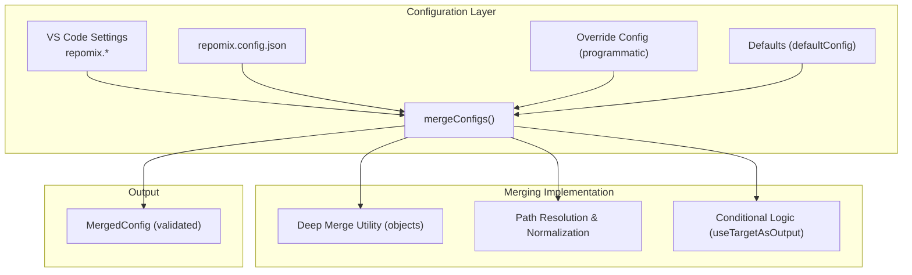
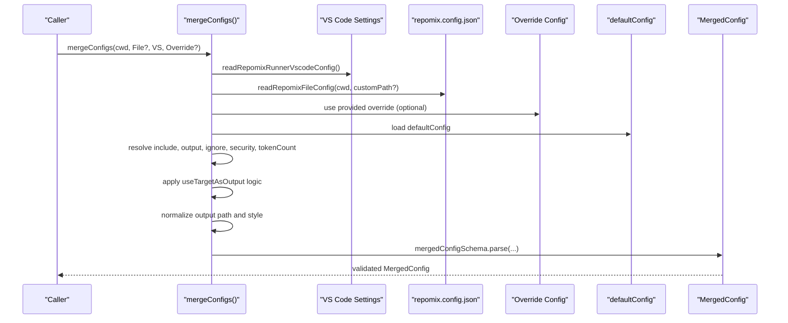
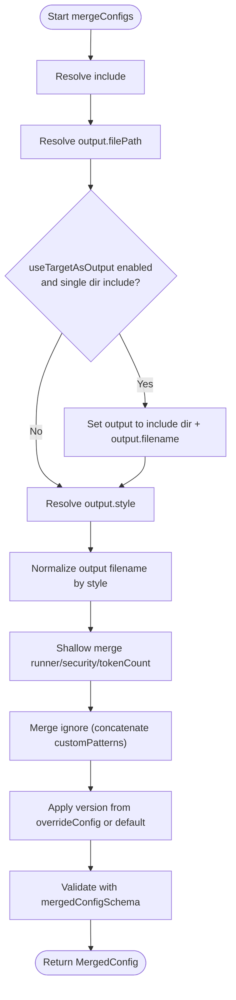
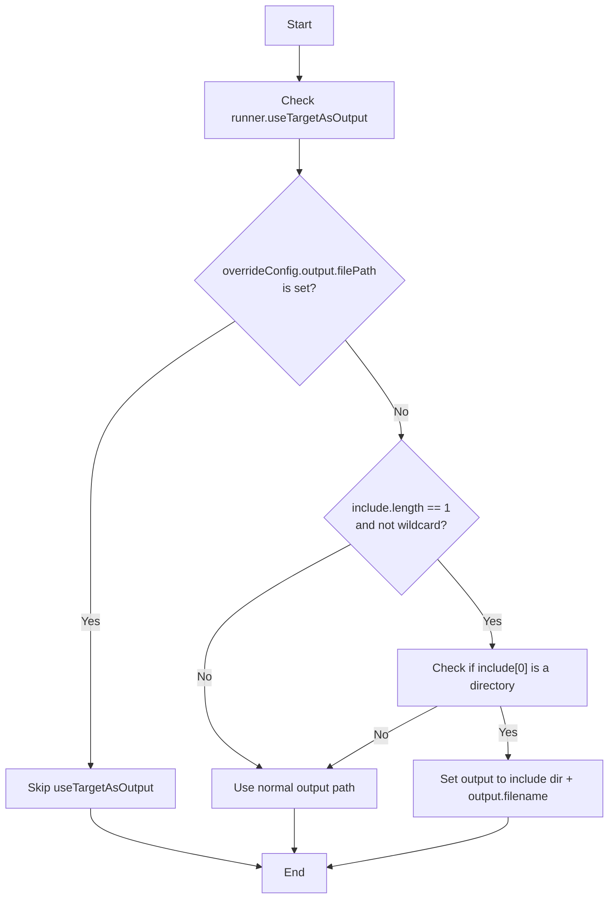
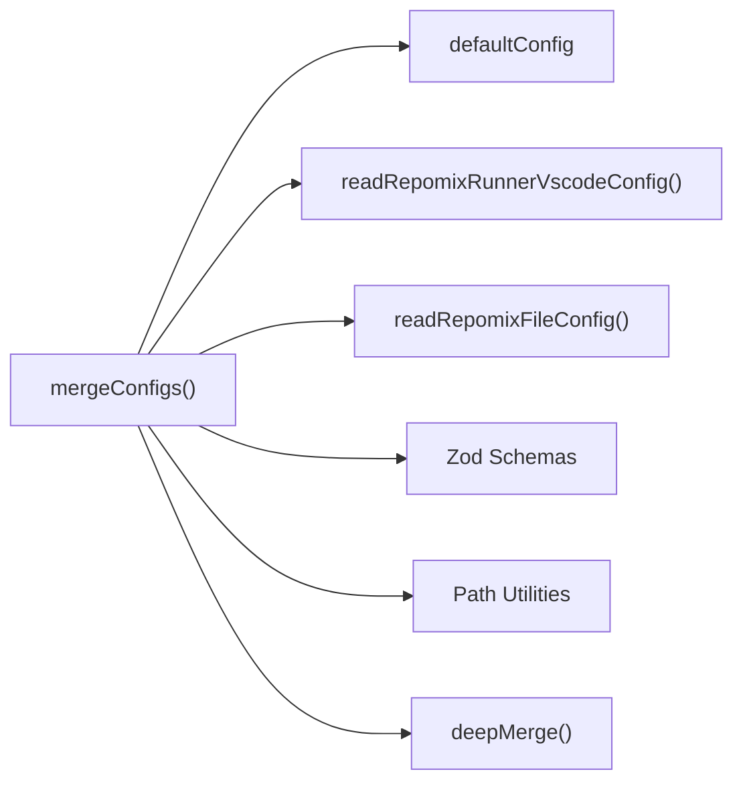

# Configuration Merging and Precedence

<cite>
**Referenced Files in This Document**
- [configLoader.ts](file://src/config/configLoader.ts)
- [configSchema.ts](file://src/config/configSchema.ts)
- [deepMerge.ts](file://src/utils/deepMerge.ts)
- [repomix.config.json](file://repomix.config.json)
- [getCwd.ts](file://src/config/getCwd.ts)
- [cliFlagsBuilder.ts](file://src/core/cli/cliFlagsBuilder.ts)
- [deepMerge.test.ts](file://src/test/utils/deepMerge.test.ts)
</cite>

## Table of Contents
1. [Introduction](#introduction)
2. [Project Structure](#project-structure)
3. [Core Components](#core-components)
4. [Architecture Overview](#architecture-overview)
5. [Detailed Component Analysis](#detailed-component-analysis)
6. [Dependency Analysis](#dependency-analysis)
7. [Performance Considerations](#performance-considerations)
8. [Troubleshooting Guide](#troubleshooting-guide)
9. [Conclusion](#conclusion)

## Introduction
This document explains the configuration merging and precedence system used by the application. It details the hierarchical precedence order (overrideConfig > repomix.config.json > VS Code settings > defaultConfig), the implementation of the mergeConfigs function, and how different configuration categories are merged. It also covers conflict resolution strategies, inheritance patterns, special behaviors such as useTargetAsOutput, path resolution and normalization, and conditional configuration application. Practical examples, conflict resolution guidance, and debugging tips are included to help teams organize and troubleshoot configuration effectively.

## Project Structure
The configuration system spans three primary areas:
- Configuration loading and merging: implemented in the configuration loader
- Configuration schemas and defaults: defined via Zod schemas
- Utility helpers for deep merging of nested structures

**Diagram sources**
- [configLoader.ts](file://src/config/configLoader.ts#L132-L229)
- [configSchema.ts](file://src/config/configSchema.ts#L157-L165)
- [deepMerge.ts](file://src/utils/deepMerge.ts#L20-L45)

**Section sources**
- [configLoader.ts](file://src/config/configLoader.ts#L132-L229)
- [configSchema.ts](file://src/config/configSchema.ts#L157-L165)

## Core Components
- mergeConfigs: central function orchestrating precedence and merging
- Zod schemas: define allowed shapes, defaults, and validation for configs
- deepMerge: helper for recursive object merging
- Path utilities: normalization and extension handling for output paths
- Special behaviors: useTargetAsOutput and conditional output path derivation

Key responsibilities:
- Resolve precedence order and compute final merged configuration
- Normalize and validate paths and styles
- Apply special conditional logic for output directory selection
- Preserve defaults when higher-priority sources are absent

**Section sources**
- [configLoader.ts](file://src/config/configLoader.ts#L145-L229)
- [configSchema.ts](file://src/config/configSchema.ts#L157-L165)
- [deepMerge.ts](file://src/utils/deepMerge.ts#L20-L45)

## Architecture Overview
The configuration pipeline follows a strict precedence order. At runtime, the system:
1. Reads VS Code settings (repomix.*) and validates against the runner schema
2. Optionally loads repomix.config.json from disk and validates against the base schema
3. Applies an optional override configuration (programmatic)
4. Merges all sources into a single validated MergedConfig
5. Performs path normalization and conditional output directory resolution

**Diagram sources**
- [configLoader.ts](file://src/config/configLoader.ts#L99-L229)
- [configSchema.ts](file://src/config/configSchema.ts#L157-L165)

## Detailed Component Analysis

### Precedence Order and mergeConfigs Implementation
The precedence order is explicitly documented and implemented:
1) overrideConfig (highest)
2) repomix.config.json
3) VS Code settings
4) defaultConfig (lowest)

The mergeConfigs function computes each top-level category by selecting the first non-null value from the precedence chain, with special handling for arrays and nested structures.

Highlights:
- include: resolves to the first non-empty array from highest precedence source
- output.filePath: resolved with path normalization and style-aware extension addition
- output.style: determines default filename mapping and extension
- ignore.customPatterns: concatenates patterns from all sources (highest wins last)
- runner, security, tokenCount: shallow merges of object properties
- version: overrideable via overrideConfig
- configFilePath: either provided externally or taken from VS Code runner config

**Diagram sources**
- [configLoader.ts](file://src/config/configLoader.ts#L145-L229)

**Section sources**
- [configLoader.ts](file://src/config/configLoader.ts#L132-L229)

### Schema-Driven Defaults and Validation
The system defines:
- Base schema for repomix.config.json (allows passthrough keys)
- Default schema with explicit defaults for all fields
- Runner-specific schema extending the base with runner options
- Merged schema combining runner defaults with additional runtime fields

Defaults are loaded via defaultConfig and applied when higher-priority sources are absent.

Practical impact:
- Ensures predictable behavior when parts of the configuration are omitted
- Prevents runtime errors by validating final merged configuration

**Section sources**
- [configSchema.ts](file://src/config/configSchema.ts#L15-L101)
- [configSchema.ts](file://src/config/configSchema.ts#L138-L149)
- [configSchema.ts](file://src/config/configSchema.ts#L157-L165)

### Deep Merging Behavior (Objects)
While mergeConfigs uses spread operators for object-level merges, the repository also provides a deepMerge utility for recursive object merging. The utility:
- Recursively merges nested plain objects
- Overwrites primitives and arrays at leaf level
- Mutates the target object in place
- Handles null/undefined gracefully

This behavior underpins how nested structures are merged when present, complementing the spread-based merges in mergeConfigs.

**Section sources**
- [deepMerge.ts](file://src/utils/deepMerge.ts#L20-L45)
- [deepMerge.test.ts](file://src/test/utils/deepMerge.test.ts#L5-L68)

### Array and Nested Structure Merging
- Arrays: resolved by precedence (first non-empty array wins). There is no concatenation of arrays across sources in mergeConfigs.
- Nested objects: merged using spread operators at each level. For deeper nesting, the deepMerge utility demonstrates recursive merging semantics.
- ignore.customPatterns: special case where patterns are concatenated from sources in precedence order; the final value is the concatenation of all sources’ patterns.

Conflict resolution:
- Highest precedence source wins for arrays and object properties
- For ignore.customPatterns, the final list reflects all sources combined in order

**Section sources**
- [configLoader.ts](file://src/config/configLoader.ts#L154-L211)
- [deepMerge.ts](file://src/utils/deepMerge.ts#L20-L45)

### Special Merge Behaviors
- useTargetAsOutput: When enabled and include resolves to a single directory (no wildcards), the output file path is placed inside that directory. This behavior is gated by conditions ensuring only one include and that it points to a directory.
- Path resolution and normalization: output.filePath is resolved relative to cwd and normalized. The final filename is ensured to have the correct extension based on output.style.
- Conditional application: The function checks runtime conditions (e.g., include length, directory detection) before applying special logic.

**Diagram sources**
- [configLoader.ts](file://src/config/configLoader.ts#L166-L176)

**Section sources**
- [configLoader.ts](file://src/config/configLoader.ts#L166-L176)

### Path Resolution and Normalization
- output.filePath is normalized using path resolution relative to cwd
- The addFileExtension helper ensures the filename matches the configured output.style
- The final mergedConfig includes the absolute cwd and resolved output path

**Section sources**
- [configLoader.ts](file://src/config/configLoader.ts#L178-L198)

### Conditional Configuration Application
- version: overridden by overrideConfig or defaults to false
- configFilePath: provided externally or taken from runner.configPath in VS Code settings
- remote: optional remote fields included in mergedConfig for downstream consumers

**Section sources**
- [configLoader.ts](file://src/config/configLoader.ts#L224-L226)
- [configSchema.ts](file://src/config/configSchema.ts#L138-L149)

### Practical Examples and Scenarios
- Example 1: overrideConfig sets output.style to markdown and output.filePath to a custom name. The final output filename is normalized and receives the markdown extension.
- Example 2: VS Code settings enable runner.useTargetAsOutput and include points to a single directory. The output file is placed inside that directory.
- Example 3: repomix.config.json defines ignore.customPatterns. When combined with VS Code settings, patterns are concatenated in precedence order.
- Example 4: A missing repomix.config.json is handled gracefully; the system falls back to defaults and VS Code settings.

Note: These examples illustrate behaviors derived from the code; they are conceptual and not direct code snippets.

**Section sources**
- [configLoader.ts](file://src/config/configLoader.ts#L145-L229)
- [repomix.config.json](file://repomix.config.json#L1-L43)

### Debugging Merged Configuration Results
- Inspect the final MergedConfig returned by mergeConfigs to verify precedence and normalization outcomes
- Use the CLI flags builder to confirm which runtime flags are derived from merged configuration
- Validate that paths are absolute and extensions match the intended style
- Confirm that ignore.customPatterns reflect the expected concatenation order

**Section sources**
- [cliFlagsBuilder.ts](file://src/core/cli/cliFlagsBuilder.ts#L125-L149)
- [configLoader.ts](file://src/config/configLoader.ts#L228-L229)

## Dependency Analysis
The configuration system exhibits clear separation of concerns:
- mergeConfigs depends on:
  - defaultConfig for fallback values
  - VS Code settings reader for runner and output options
  - repomix.config.json reader for file-based configuration
  - Zod schemas for validation
  - Path utilities for normalization and extension handling
  - Optional deepMerge for recursive object merging semantics

**Diagram sources**
- [configLoader.ts](file://src/config/configLoader.ts#L99-L229)
- [configSchema.ts](file://src/config/configSchema.ts#L157-L165)
- [deepMerge.ts](file://src/utils/deepMerge.ts#L20-L45)

**Section sources**
- [configLoader.ts](file://src/config/configLoader.ts#L99-L229)
- [configSchema.ts](file://src/config/configSchema.ts#L157-L165)

## Performance Considerations
- mergeConfigs performs minimal work: precedence resolution, conditional checks, and path normalization. It is lightweight and suitable for frequent invocation.
- deepMerge is useful for recursive object merging but is not used in mergeConfigs; its presence allows future enhancements if recursive merges are needed.
- Schema parsing occurs once per merge operation; keep configuration updates coarse-grained to avoid repeated merges.

## Troubleshooting Guide
Common issues and resolutions:
- Unexpected output path:
  - Verify runner.useTargetAsOutput and include conditions. If include is a single directory and useTargetAsOutput is true, output is placed inside that directory.
  - Ensure output.style matches the desired extension and that addFileExtension is applied.
- Conflicting arrays:
  - Remember that arrays resolve by precedence; the first non-empty array encountered takes effect. If include is empty in repomix.config.json but present in VS Code settings, the latter wins.
- Ignored patterns not taking effect:
  - ignore.customPatterns are concatenated in order. If a pattern appears in multiple sources, the final list reflects all sources in precedence order.
- Missing repomix.config.json:
  - The loader handles absence gracefully and falls back to defaults and VS Code settings. Confirm file location and comments stripping if JSON parsing fails.
- Debugging merged results:
  - Log or inspect the returned MergedConfig to verify cwd, output.path, include, ignore.customPatterns, and other fields.

**Section sources**
- [configLoader.ts](file://src/config/configLoader.ts#L166-L176)
- [configLoader.ts](file://src/config/configLoader.ts#L205-L211)
- [configLoader.ts](file://src/config/configLoader.ts#L121-L129)

## Conclusion
The configuration system enforces a clear and predictable precedence order, with robust validation and normalization. mergeConfigs consolidates inputs from multiple sources, applies special conditional logic, and produces a validated MergedConfig. Teams should:
- Keep repomix.config.json minimal and centralized
- Use overrideConfig sparingly for temporary overrides
- Leverage VS Code settings for environment-specific defaults
- Understand array and nested-object merging semantics
- Validate merged results and rely on schema-driven defaults for resilience