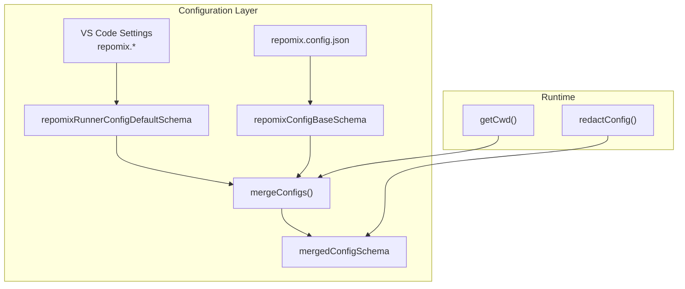
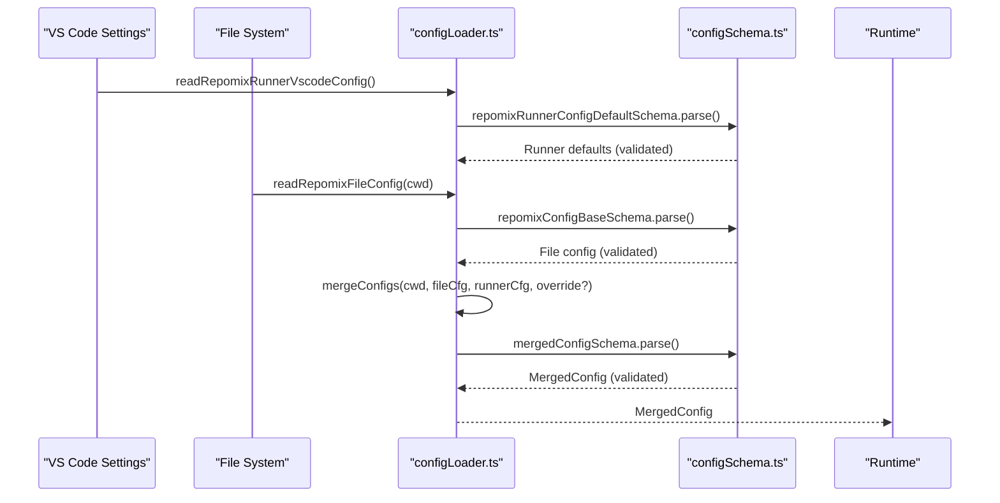
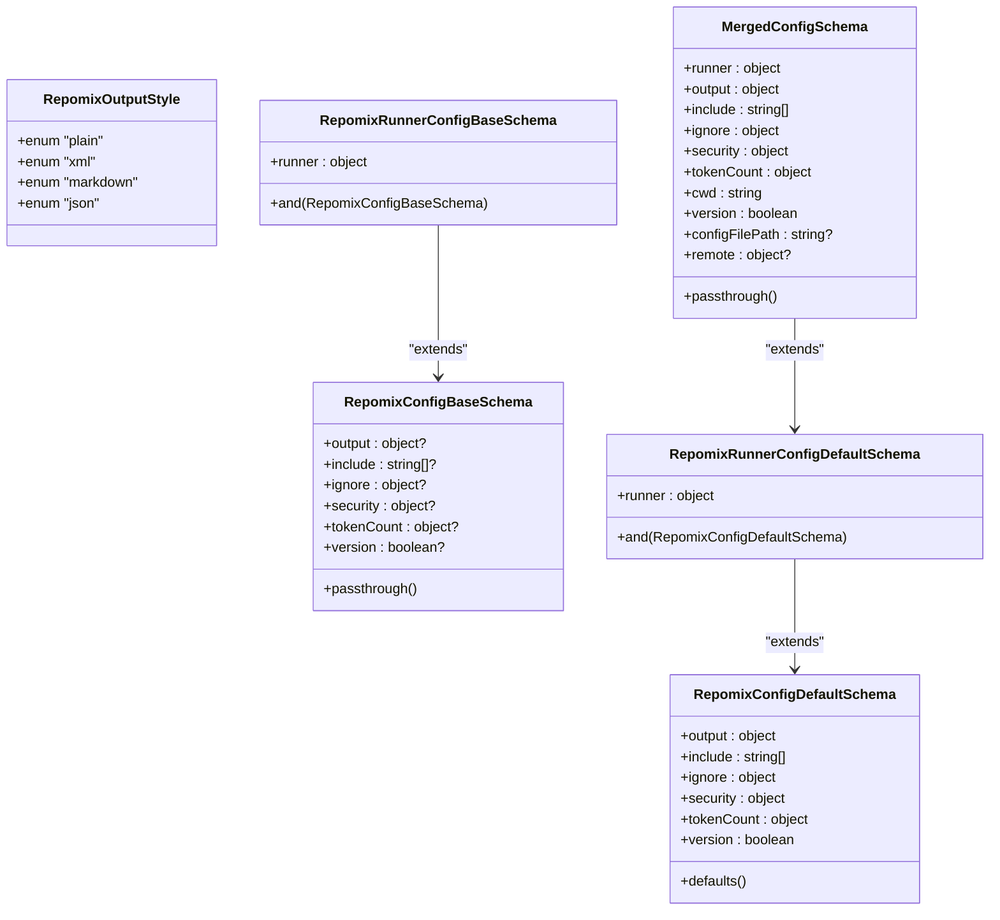
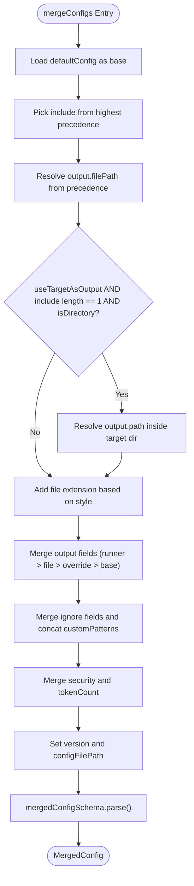
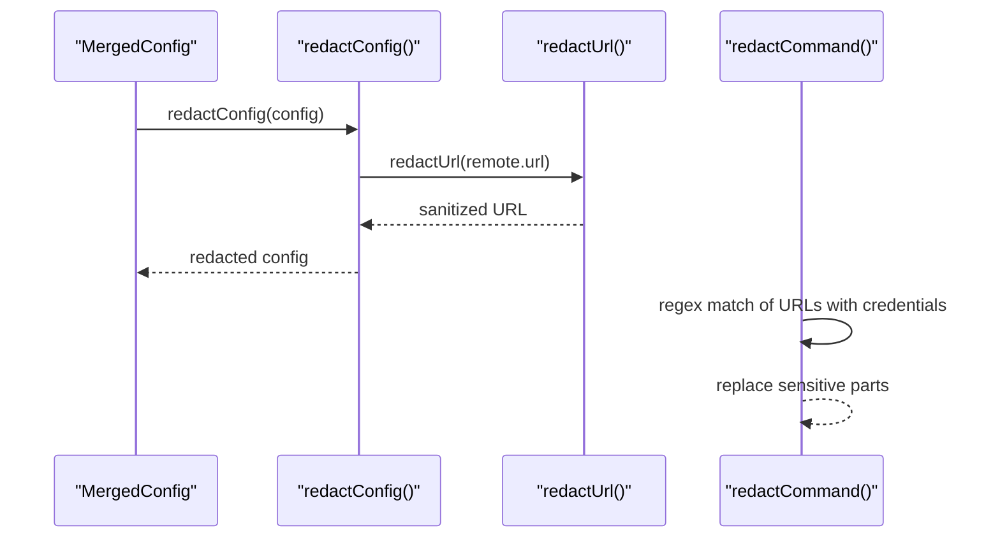
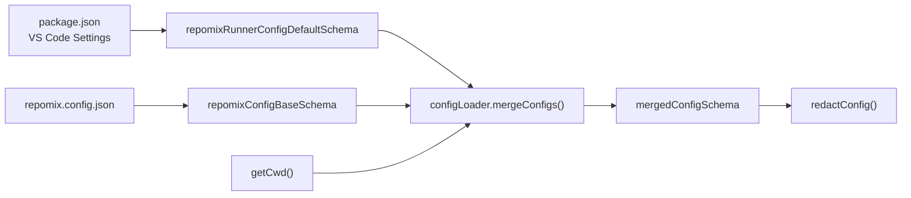

# Configuration Schema and Validation

<cite>
**Referenced Files in This Document**
- [configSchema.ts](file://src/config/configSchema.ts)
- [configLoader.ts](file://src/config/configLoader.ts)
- [repomix.config.json](file://repomix.config.json)
- [package.json](file://package.json)
- [getCwd.ts](file://src/config/getCwd.ts)
- [redactConfig.ts](file://src/utils/redactConfig.ts)
- [redactConfig.test.ts](file://src/test/utils/redactConfig.test.ts)
</cite>

## Table of Contents
1. [Introduction](#introduction)
2. [Project Structure](#project-structure)
3. [Core Components](#core-components)
4. [Architecture Overview](#architecture-overview)
5. [Detailed Component Analysis](#detailed-component-analysis)
6. [Dependency Analysis](#dependency-analysis)
7. [Performance Considerations](#performance-considerations)
8. [Troubleshooting Guide](#troubleshooting-guide)
9. [Conclusion](#conclusion)

## Introduction
This document explains the configuration schema and validation system used by the Repomix Runner. It covers the complete schema definitions for RepomixConfigFile, RepomixRunnerConfigDefault, and MergedConfig, the Zod-based validation pipeline, type safety guarantees, error reporting, schema evolution and backward compatibility, and practical examples of valid and invalid configurations. It also documents default value resolution, type inference patterns, and how configuration integrates with the broader system.

## Project Structure
The configuration system is centered around two modules:
- Schema definitions and types: src/config/configSchema.ts
- Configuration loading, merging, and validation: src/config/configLoader.ts

Additional supporting pieces:
- Example configuration file: repomix.config.json
- VS Code settings contribution and defaults: package.json
- Working directory resolution: src/config/getCwd.ts
- Security-sensitive configuration redaction utilities: src/utils/redactConfig.ts and tests: src/test/utils/redactConfig.test.ts

**Diagram sources**
- [configSchema.ts](file://src/config/configSchema.ts#L15-L165)
- [configLoader.ts](file://src/config/configLoader.ts#L105-L229)
- [getCwd.ts](file://src/config/getCwd.ts#L8-L17)
- [redactConfig.ts](file://src/utils/redactConfig.ts#L3-L12)

**Section sources**
- [configSchema.ts](file://src/config/configSchema.ts#L1-L165)
- [configLoader.ts](file://src/config/configLoader.ts#L1-L230)
- [repomix.config.json](file://repomix.config.json#L1-L43)
- [package.json](file://package.json#L31-L242)
- [getCwd.ts](file://src/config/getCwd.ts#L1-L18)
- [redactConfig.ts](file://src/utils/redactConfig.ts#L1-L79)

## Core Components
- RepomixOutputStyle and default file path map define supported output styles and default filenames per style.
- repomixConfigBaseSchema defines the base configuration shape without defaults (used for parsing repomix.config.json).
- repomixConfigDefaultSchema defines the same shape with explicit defaults (used for VS Code settings).
- repomixRunnerConfigBaseSchema extends the base with runner-specific fields and merges with the base.
- repomixRunnerConfigDefaultSchema extends the default with runner-specific defaults and merges with the default.
- mergedConfigSchema adds runtime-only fields (cwd, version, configFilePath, remote) to the runner defaults.
- Type aliases expose inferred TypeScript types for all shapes.
- defaultConfig provides a parsed baseline for runner defaults.

Key behaviors:
- passthrough() allows unknown fields to pass through in base schemas, enabling future-proofing.
- default() ensures type-safe defaults for runner and output settings.
- mergeConfigs() applies a strict precedence order and resolves derived values (e.g., adding file extensions to output paths).

**Section sources**
- [configSchema.ts](file://src/config/configSchema.ts#L3-L165)

## Architecture Overview
The configuration pipeline validates and merges inputs from multiple sources into a single strongly typed configuration object consumed by the system.

**Diagram sources**
- [configLoader.ts](file://src/config/configLoader.ts#L99-L229)
- [configSchema.ts](file://src/config/configSchema.ts#L15-L165)

## Detailed Component Analysis

### Schema Definitions and Types
- Output style enum and default filename map:
  - Style enum: plain, xml, markdown, json
  - defaultFilePathMap maps each style to a default filename
- Base schema (repomixConfigBaseSchema):
  - output: nested object with optional fields for file path, style, parsable style, header text, instruction file path, file summary, directory structure, comment removal, empty line removal, top files length, line numbers, clipboard copy, empty directory inclusion, compression
  - include: optional array of strings
  - ignore: nested object with useGitignore, useDefaultPatterns, customPatterns; passthrough enabled
  - security: nested object with enableSecurityCheck; passthrough enabled
  - tokenCount: nested object with optional encoding; passthrough enabled
  - version: optional boolean
  - passthrough() allows extra fields
- Default schema (repomixConfigDefaultSchema):
  - Same structure as base, but each field has a default() declaration
  - Ensures type-safe defaults for runner and output settings
- Runner base schema (repomixRunnerConfigBaseSchema):
  - runner: verbose, keepOutputFile, copyMode (enum), useTargetAsOutput, useBundleNameAsOutputName, configPath
  - Merged with repomixConfigBaseSchema via .and()
- Runner default schema (repomixRunnerConfigDefaultSchema):
  - runner fields with default() declarations
  - Merged with repomixConfigDefaultSchema via .and()
- Merged config schema (mergedConfigSchema):
  - Extends runner defaults with cwd, version, configFilePath, and optional remote (url, branch)
  - passthrough() for extensibility
- Type aliases:
  - RepomixConfigFile, RepomixConfigDefault, RepomixRunnerConfigFile, RepomixRunnerConfigDefault, MergedConfig
- defaultConfig:
  - Prevalidated baseline runner defaults

**Diagram sources**
- [configSchema.ts](file://src/config/configSchema.ts#L3-L165)

**Section sources**
- [configSchema.ts](file://src/config/configSchema.ts#L3-L165)

### Configuration Loading and Merging
- readRepomixRunnerVscodeConfig():
  - Reads VS Code settings under repomix.*
  - Validates against repomixRunnerConfigDefaultSchema
  - Returns a strongly typed runner defaults object
- readRepomixFileConfig(cwd, customPath?):
  - Locates repomix.config.json (supports custom relative path)
  - Strips comments from JSON
  - Parses and validates against repomixConfigBaseSchema
  - Returns undefined if file is not accessible
- mergeConfigs(cwd, fileCfg, runnerCfg, override?, configFilePath?):
  - Applies precedence order: overrideConfig > file config > runner defaults > base defaults
  - Resolves include patterns and output file path
  - If useTargetAsOutput is true and include targets a single directory, output path becomes inside that directory
  - Adds appropriate file extension to output file path based on style
  - Merges ignore.customPatterns by concatenating all sources
  - Merges security and tokenCount objects
  - Sets version and configFilePath
  - Validates final merged object against mergedConfigSchema

**Diagram sources**
- [configLoader.ts](file://src/config/configLoader.ts#L145-L229)

**Section sources**
- [configLoader.ts](file://src/config/configLoader.ts#L99-L229)

### Validation Pipeline and Type Safety
- Zod schemas enforce strict validation at runtime:
  - repomixConfigBaseSchema parses repomix.config.json
  - repomixRunnerConfigDefaultSchema parses VS Code settings
  - mergedConfigSchema validates the final merged configuration
- Type inference:
  - z.infer<> produces TypeScript types for each schema
  - Types are exported for consumers across the system
- Error reporting:
  - Invalid repomix.config.json triggers logging and a user-visible error message
  - Access errors for custom config paths produce debug logs and optional error messages
- Backward compatibility:
  - passthrough() on base schemas allows unknown fields to pass through
  - Defaults ensure missing fields are populated safely

**Section sources**
- [configSchema.ts](file://src/config/configSchema.ts#L15-L165)
- [configLoader.ts](file://src/config/configLoader.ts#L105-L130)

### Schema Evolution and Backward Compatibility
- Unknown field tolerance:
  - Base schemas use passthrough(), allowing new fields to appear without breaking validation
- Default-driven stability:
  - Default schemas ensure missing keys are filled, reducing churn when new options are introduced
- Enum constraints:
  - Output style and runner copy mode are enums, preventing invalid values
- Migration patterns:
  - Introduce new optional fields in base/default schemas
  - Keep passthrough() to accept legacy configs
  - Add new defaults to maintain consistent behavior
  - If renaming fields, introduce transitional support in loader logic and document deprecation

[No sources needed since this section provides general guidance]

### Examples of Valid and Invalid Configurations

- Valid repomix.config.json (example structure):
  - Includes output style, file summary, directory structure, include patterns, ignore settings, security, and token count encoding
  - See [repomix.config.json](file://repomix.config.json#L1-L43)

- Invalid repomix.config.json:
  - Non-object output field
  - Invalid enum values (e.g., output.style not one of the allowed styles)
  - Unexpected field names without passthrough support in stricter contexts
  - Invalid types for numeric or boolean fields

- Invalid VS Code settings:
  - Non-boolean values for boolean runner settings
  - Non-string values for string settings like output.filePath
  - Invalid enum values for runner.copyMode

- Invalid merged configuration:
  - Missing required runtime fields (e.g., cwd) after merging
  - Derived values violating constraints (e.g., invalid file path resolution)

Interpretation of schema errors:
- Zod validation errors indicate which field failed and why (type mismatch, enum violation, unexpected key, etc.)
- The loader surfaces user-friendly messages for invalid repomix.config.json format

**Section sources**
- [repomix.config.json](file://repomix.config.json#L1-L43)
- [configLoader.ts](file://src/config/configLoader.ts#L105-L130)
- [configSchema.ts](file://src/config/configSchema.ts#L15-L165)

### Relationship Between Schema Types and Default Resolution
- repomixConfigBaseSchema: used to parse repomix.config.json; no defaults
- repomixConfigDefaultSchema: used to parse VS Code settings; provides defaults
- repomixRunnerConfigBaseSchema: runner fields + base config via .and()
- repomixRunnerConfigDefaultSchema: runner defaults + default config via .and()
- mergedConfigSchema: adds runtime-only fields to runner defaults
- defaultConfig: prevalidated baseline runner defaults

Default value resolution:
- mergeConfigs() selects the highest-precedence value for each field
- For arrays like ignore.customPatterns, it concatenates values from all sources
- For output.filePath, it resolves to an absolute path and appends an extension based on style

**Section sources**
- [configSchema.ts](file://src/config/configSchema.ts#L15-L165)
- [configLoader.ts](file://src/config/configLoader.ts#L145-L229)

### Type Inference Patterns
- z.infer<typeof schema> produces a TypeScript type aligned with the schema’s structure
- Exported types:
  - RepomixConfigFile, RepomixConfigDefault, RepomixRunnerConfigFile, RepomixRunnerConfigDefault, MergedConfig
- Consumers rely on these types to ensure type safety across the system

**Section sources**
- [configSchema.ts](file://src/config/configSchema.ts#L151-L155)

### Security and Sensitive Data Handling
- redactConfig() creates a sanitized copy of MergedConfig, masking credentials in remote.url
- redactCommand() sanitizes command strings containing URLs with credentials
- Tests demonstrate expected behavior for various credential patterns and edge cases

**Diagram sources**
- [redactConfig.ts](file://src/utils/redactConfig.ts#L3-L79)
- [redactConfig.test.ts](file://src/test/utils/redactConfig.test.ts#L6-L89)

**Section sources**
- [redactConfig.ts](file://src/utils/redactConfig.ts#L1-L79)
- [redactConfig.test.ts](file://src/test/utils/redactConfig.test.ts#L1-L138)

## Dependency Analysis
- VS Code settings contribution:
  - package.json contributes repomix.* settings with defaults and descriptions
  - These defaults align with repomixRunnerConfigDefaultSchema defaults
- Runtime dependencies:
  - configLoader depends on configSchema for validation
  - getCwd provides the working directory used by mergeConfigs
  - redactConfig integrates with MergedConfig to sanitize sensitive data

**Diagram sources**
- [package.json](file://package.json#L31-L242)
- [configSchema.ts](file://src/config/configSchema.ts#L15-L165)
- [configLoader.ts](file://src/config/configLoader.ts#L145-L229)
- [getCwd.ts](file://src/config/getCwd.ts#L8-L17)
- [redactConfig.ts](file://src/utils/redactConfig.ts#L3-L12)

**Section sources**
- [package.json](file://package.json#L31-L242)
- [configSchema.ts](file://src/config/configSchema.ts#L15-L165)
- [configLoader.ts](file://src/config/configLoader.ts#L145-L229)
- [getCwd.ts](file://src/config/getCwd.ts#L1-L18)
- [redactConfig.ts](file://src/utils/redactConfig.ts#L1-L79)

## Performance Considerations
- Validation occurs once per configuration load; keep schemas concise and avoid overly complex nested structures
- passthrough() enables forward compatibility at minimal cost
- Default schemas prevent repeated branching logic in downstream code
- Merging is linear in the number of fields; ensure ignore.customPatterns lists remain reasonable

[No sources needed since this section provides general guidance]

## Troubleshooting Guide
Common issues and resolutions:
- Invalid repomix.config.json format:
  - Symptom: Error logged and user message shown
  - Action: Fix JSON syntax and field types; ensure enums match allowed values
  - Reference: [configLoader.ts](file://src/config/configLoader.ts#L121-L129)
- Cannot access custom config path:
  - Symptom: Debug log and optional error message
  - Action: Verify path correctness and file permissions
  - Reference: [configLoader.ts](file://src/config/configLoader.ts#L111-L119)
- Unexpected field in configuration:
  - Symptom: Validation failure if strict mode were used
  - Action: Use passthrough-enabled schemas; unknown fields are allowed
  - Reference: [configSchema.ts](file://src/config/configSchema.ts#L33-L57)
- Credential exposure in logs:
  - Symptom: Sensitive URLs visible
  - Action: Use redactConfig() or redactCommand() before logging
  - References: [redactConfig.ts](file://src/utils/redactConfig.ts#L3-L12), [redactConfig.test.ts](file://src/test/utils/redactConfig.test.ts#L6-L89)

**Section sources**
- [configLoader.ts](file://src/config/configLoader.ts#L111-L129)
- [configSchema.ts](file://src/config/configSchema.ts#L33-L57)
- [redactConfig.ts](file://src/utils/redactConfig.ts#L3-L12)
- [redactConfig.test.ts](file://src/test/utils/redactConfig.test.ts#L6-L89)

## Conclusion
The configuration system leverages Zod schemas to provide robust validation, strong typing, and predictable defaults. The loader enforces a clear precedence order, supports backward compatibility via passthrough, and integrates with VS Code settings and a sample configuration file. Security-sensitive fields are sanitized before logging, and tests validate expected behavior. Together, these patterns ensure reliable configuration handling across environments and versions.