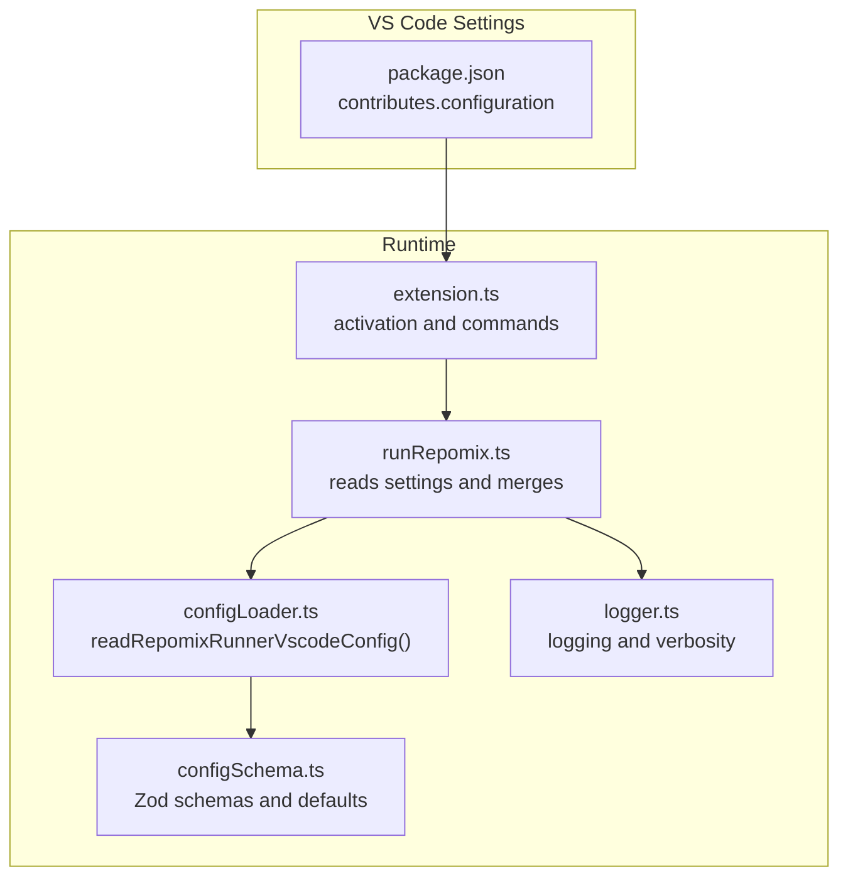
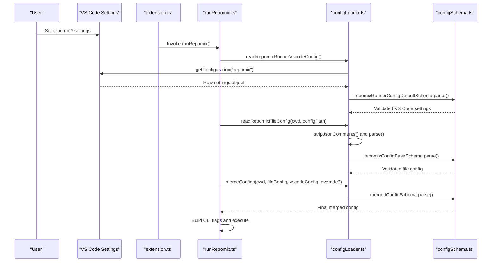
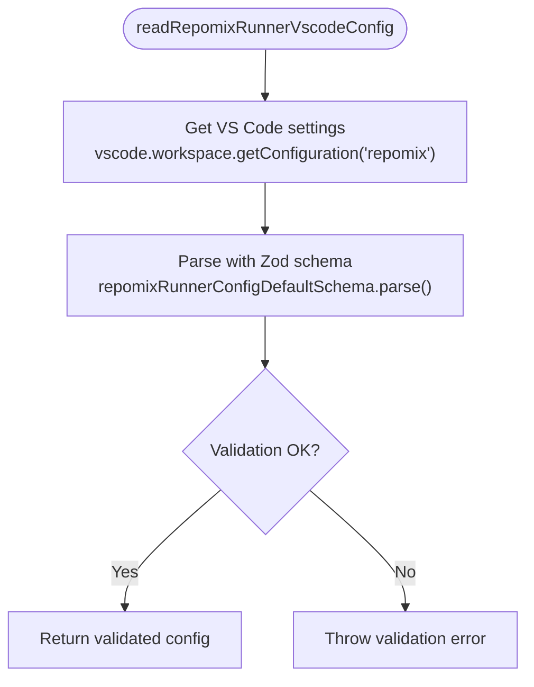
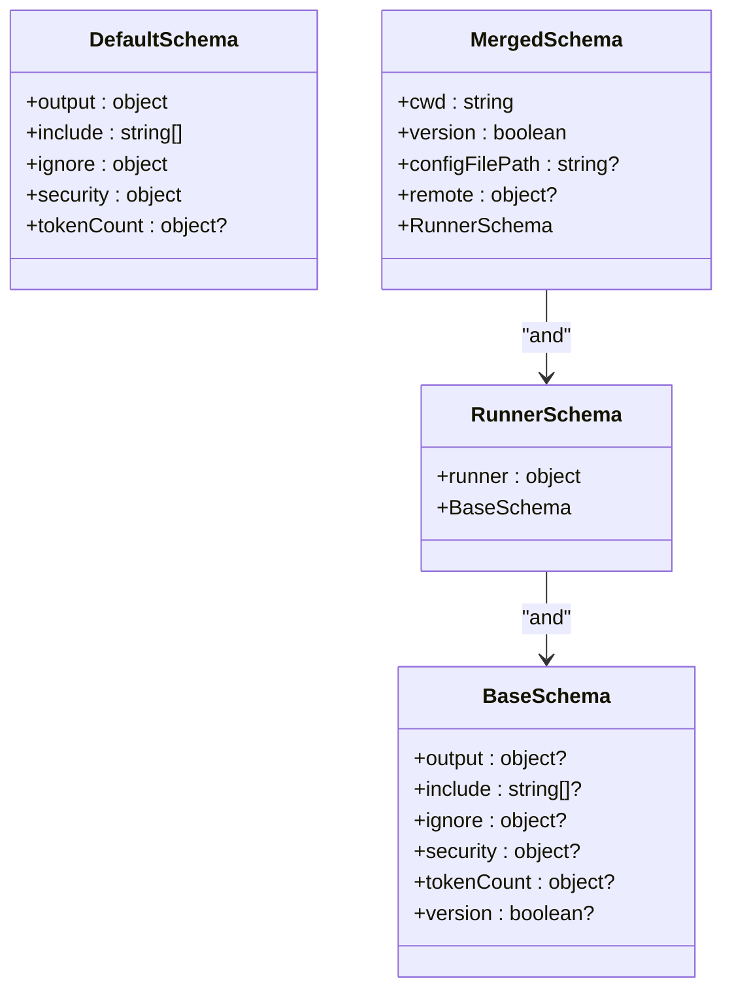
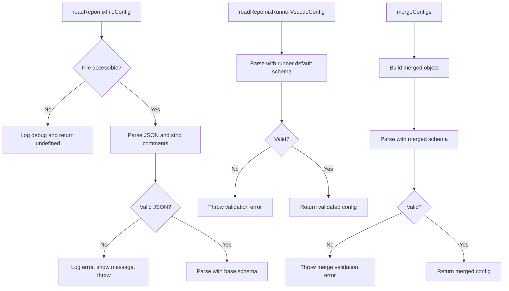
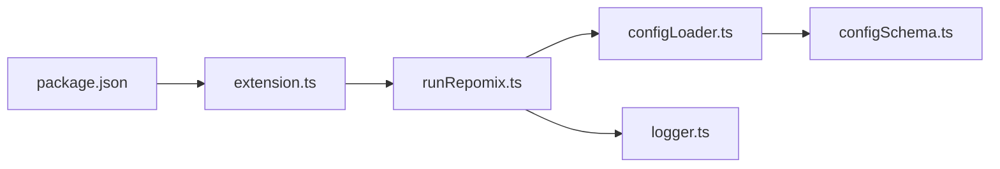

# VS Code Settings Integration

<cite>
**Referenced Files in This Document**
- [configSchema.ts](file://src/config/configSchema.ts)
- [configLoader.ts](file://src/config/configLoader.ts)
- [package.json](file://package.json)
- [runRepomix.ts](file://src/commands/runRepomix.ts)
- [openSettings.ts](file://src/commands/openSettings.ts)
- [extension.ts](file://src/extension.ts)
- [logger.ts](file://src/shared/logger.ts)
</cite>

## Table of Contents
1. [Introduction](#introduction)
2. [Project Structure](#project-structure)
3. [Core Components](#core-components)
4. [Architecture Overview](#architecture-overview)
5. [Detailed Component Analysis](#detailed-component-analysis)
6. [Dependency Analysis](#dependency-analysis)
7. [Performance Considerations](#performance-considerations)
8. [Troubleshooting Guide](#troubleshooting-guide)
9. [Conclusion](#conclusion)

## Introduction
This document explains how the extension reads and validates VS Code configuration for the Repomix Runner. It covers the VS Code settings integration, the Zod-based validation pipeline, supported configuration categories, default value resolution, and the merging strategy. Practical examples, error handling strategies, and guidance for extending the configuration schema are included.

## Project Structure
The VS Code settings integration spans three primary areas:
- Settings definition: declared in the extension manifest
- Runtime reading and validation: via VS Code API and Zod schemas
- Command orchestration: where validated settings drive execution

**Diagram sources**
- [package.json](file://package.json#L31-L284)
- [extension.ts](file://src/extension.ts#L43-L781)
- [runRepomix.ts](file://src/commands/runRepomix.ts#L48-L154)
- [configLoader.ts](file://src/config/configLoader.ts#L99-L103)
- [configSchema.ts](file://src/config/configSchema.ts#L157-L165)
- [logger.ts](file://src/shared/logger.ts#L1-L132)

**Section sources**
- [package.json](file://package.json#L31-L284)
- [extension.ts](file://src/extension.ts#L43-L781)
- [runRepomix.ts](file://src/commands/runRepomix.ts#L48-L154)
- [configLoader.ts](file://src/config/configLoader.ts#L99-L103)
- [configSchema.ts](file://src/config/configSchema.ts#L157-L165)
- [logger.ts](file://src/shared/logger.ts#L1-L132)

## Core Components
- VS Code settings categories exposed to users:
  - Runner: execution behavior and output handling
  - Output: output file path, style, formatting, and clipboard behavior
  - Include: patterns to include
  - Ignore: gitignore usage, defaults, and custom patterns
  - Security: security checks
  - Token Count: encoding selection
  - Embedding: embedding provider and Ollama settings
- Zod schemas:
  - Base schema for repomix configuration (sans defaults)
  - Default schema for repomix configuration (with defaults)
  - Runner-specific schema composition
  - Merged schema for runtime configuration
- Loader functions:
  - Read VS Code settings with validation
  - Read repomix.config.json with comment stripping and validation
  - Merge configurations from multiple sources with priority

**Section sources**
- [configSchema.ts](file://src/config/configSchema.ts#L15-L165)
- [configLoader.ts](file://src/config/configLoader.ts#L99-L229)
- [package.json](file://package.json#L31-L284)

## Architecture Overview
The configuration pipeline reads VS Code settings, validates them against Zod schemas, optionally loads a repomix.config.json file, and merges all sources into a single runtime configuration. The merged configuration drives command execution and CLI flag generation.

**Diagram sources**
- [runRepomix.ts](file://src/commands/runRepomix.ts#L48-L154)
- [configLoader.ts](file://src/config/configLoader.ts#L99-L229)
- [configSchema.ts](file://src/config/configSchema.ts#L157-L165)
- [package.json](file://package.json#L31-L284)

## Detailed Component Analysis

### VS Code Settings Categories and Defaults
The extension contributes a structured settings UI grouped into categories. Each setting includes a default value and description.

- Runner
  - keepOutputFile: boolean, default true
  - copyMode: enum ["content","file"], default "content"
  - useTargetAsOutput: boolean, default false
  - useBundleNameAsOutputName: boolean, default true
  - verbose: boolean, default false
  - configPath: string, default ""
- Output
  - filePath: string, default depends on style
  - style: enum ["plain","xml","markdown","json"], default "xml"
  - parsableStyle: boolean, default false
  - headerText: string, default ""
  - fileSummary: boolean, default true
  - directoryStructure: boolean, default true
  - removeComments: boolean, default false
  - removeEmptyLines: boolean, default false
  - topFilesLength: number, default 5
  - showLineNumbers: boolean, default false
  - copyToClipboard: boolean, default true
  - includeEmptyDirectories: boolean, default false
  - instructionFilePath: string, default ""
  - compress: boolean, default false
- Include
  - array of strings, default []
- Ignore
  - useGitignore: boolean, default true
  - useDefaultPatterns: boolean, default true
  - customPatterns: array of strings, default []
- Security
  - enableSecurityCheck: boolean, default true
- Token Count
  - encoding: enum ["o200k_base","cl100k_base","p50k_edit","p50k_base","r50k_base","gpt2"], default "o200k_base"
- Embedding
  - provider: enum ["gemini","ollama"], default "gemini"
  - ollama.url: string, default "http://localhost:11434"
  - ollama.model: string, default "nomic-embed-text"
  - ollama.dimension: number, default 768

These defaults are also enforced in the Zod default schema for runtime validation.

**Section sources**
- [package.json](file://package.json#L31-L284)
- [configSchema.ts](file://src/config/configSchema.ts#L60-L101)

### readRepomixRunnerVscodeConfig Implementation
- Reads the "repomix" configuration namespace from VS Code.
- Validates the raw settings against the runner default schema.
- Returns a strongly typed configuration object with defaults applied.

**Diagram sources**
- [configLoader.ts](file://src/config/configLoader.ts#L99-L103)
- [configSchema.ts](file://src/config/configSchema.ts#L125-L136)

**Section sources**
- [configLoader.ts](file://src/config/configLoader.ts#L99-L103)
- [configSchema.ts](file://src/config/configSchema.ts#L125-L136)

### Configuration Parsing with Zod Validation
- Base schema: defines allowed keys and types without defaults.
- Default schema: applies defaults for all optional fields.
- Runner schema: composes runner settings with base configuration.
- Merged schema: adds runtime-only fields like cwd and version.

Validation occurs at:
- VS Code settings read-time (runner defaults)
- File config read-time (base schema)
- Final merge-time (merged schema)

**Diagram sources**
- [configSchema.ts](file://src/config/configSchema.ts#L15-L165)

**Section sources**
- [configSchema.ts](file://src/config/configSchema.ts#L15-L165)

### Error Handling Strategies
- Invalid repomix.config.json:
  - Attempts to access the file; if absent, logs debug and returns early.
  - On parse/format errors, logs error, shows a user message, and throws.
- Invalid VS Code settings:
  - Zod validation failure throws; the command catches and displays a message.
- Security checks:
  - Output path is validated to prevent escaping the workspace.
- Logging:
  - Verbose mode controlled by runner.verbose.
  - Centralized logger writes to console and output channel.

**Diagram sources**
- [configLoader.ts](file://src/config/configLoader.ts#L105-L130)
- [configLoader.ts](file://src/config/configLoader.ts#L145-L229)
- [runRepomix.ts](file://src/commands/runRepomix.ts#L75-L80)

**Section sources**
- [configLoader.ts](file://src/config/configLoader.ts#L105-L130)
- [configLoader.ts](file://src/config/configLoader.ts#L145-L229)
- [runRepomix.ts](file://src/commands/runRepomix.ts#L75-L80)
- [logger.ts](file://src/shared/logger.ts#L1-L132)

### Practical Configuration Examples
- Minimal runner configuration:
  - runner.keepOutputFile=true
  - runner.copyMode="file"
  - runner.useTargetAsOutput=false
  - runner.useBundleNameAsOutputName=true
  - runner.verbose=false
  - runner.configPath=""
- Output customization:
  - output.filePath="repomix-output.xml"
  - output.style="xml"
  - output.parsableStyle=false
  - output.headerText=""
  - output.fileSummary=true
  - output.directoryStructure=true
  - output.removeComments=false
  - output.removeEmptyLines=false
  - output.topFilesLength=5
  - output.showLineNumbers=false
  - output.copyToClipboard=true
  - output.includeEmptyDirectories=false
  - output.instructionFilePath=""
  - output.compress=false
- Include and ignore:
  - include=["src/**/*.ts","*.md"]
  - ignore.useGitignore=true
  - ignore.useDefaultPatterns=true
  - ignore.customPatterns=["*.tmp","dist/"]
- Security and token count:
  - security.enableSecurityCheck=true
  - tokenCount.encoding="o200k_base"

These examples reflect the default values and categories defined in the settings contribution.

**Section sources**
- [package.json](file://package.json#L31-L284)

### Troubleshooting Invalid Settings
- Symptom: Settings not applied or errors appear.
  - Verify the setting keys match the repomix.* namespace.
  - Confirm types align with the schema (booleans, strings, enums, arrays).
  - Use the extension’s settings page to filter by extension ID.
- Symptom: Invalid repomix.config.json format.
  - Ensure valid JSON; comments are stripped before parsing.
  - Check for trailing commas or unsupported syntax.
- Symptom: Security violation for output path.
  - Ensure output.filePath resolves within the workspace root.

**Section sources**
- [openSettings.ts](file://src/commands/openSettings.ts#L1-L10)
- [configLoader.ts](file://src/config/configLoader.ts#L105-L130)
- [runRepomix.ts](file://src/commands/runRepomix.ts#L75-L80)

### Extending the Configuration Schema
To add a new settings category or field:
1. Add the setting definition to the extension manifest under contributes.configuration.
2. Extend the base schema with the new field(s).
3. Add defaults to the default schema.
4. If applicable, compose a new runner schema variant or update the merged schema.
5. Update the loader to incorporate the new field during merge if needed.
6. Update tests and documentation accordingly.

Guidance tips:
- Keep passthrough enabled for forward compatibility.
- Use enums for constrained values.
- Prefer explicit defaults in the default schema to simplify runtime logic.
- Validate merged configuration with the merged schema to catch inconsistencies.

**Section sources**
- [configSchema.ts](file://src/config/configSchema.ts#L15-L165)
- [package.json](file://package.json#L31-L284)

## Dependency Analysis
- Settings definition depends on the extension manifest.
- Runtime depends on VS Code workspace configuration API and Zod schemas.
- Commands depend on the loader to produce a validated configuration.
- Logging integrates with the centralized logger utility.

**Diagram sources**
- [package.json](file://package.json#L31-L284)
- [extension.ts](file://src/extension.ts#L43-L781)
- [runRepomix.ts](file://src/commands/runRepomix.ts#L48-L154)
- [configLoader.ts](file://src/config/configLoader.ts#L99-L229)
- [configSchema.ts](file://src/config/configSchema.ts#L15-L165)
- [logger.ts](file://src/shared/logger.ts#L1-L132)

**Section sources**
- [package.json](file://package.json#L31-L284)
- [extension.ts](file://src/extension.ts#L43-L781)
- [runRepomix.ts](file://src/commands/runRepomix.ts#L48-L154)
- [configLoader.ts](file://src/config/configLoader.ts#L99-L229)
- [configSchema.ts](file://src/config/configSchema.ts#L15-L165)
- [logger.ts](file://src/shared/logger.ts#L1-L132)

## Performance Considerations
- Settings read is lightweight; Zod validation overhead is minimal.
- File config parsing strips comments to reduce unnecessary data.
- Merging prioritizes sources to minimize redundant computation.
- Logging verbosity can be toggled via runner.verbose to reduce noise.

## Troubleshooting Guide
- Settings not taking effect:
  - Open the extension settings page and confirm values.
  - Check for typos in setting keys.
- Invalid file config:
  - Review the output channel for parse errors.
  - Validate JSON syntax and remove unsupported constructs.
- Execution errors:
  - Enable verbose mode to inspect the final configuration and command.
  - Review the output channel for detailed logs.

**Section sources**
- [openSettings.ts](file://src/commands/openSettings.ts#L1-L10)
- [logger.ts](file://src/shared/logger.ts#L1-L132)
- [runRepomix.ts](file://src/commands/runRepomix.ts#L92-L98)

## Conclusion
The VS Code settings integration leverages a clear separation of concerns: settings are defined declaratively, validated rigorously with Zod, and merged deterministically. This approach ensures predictable behavior, robust error handling, and a maintainable extension surface for future enhancements.