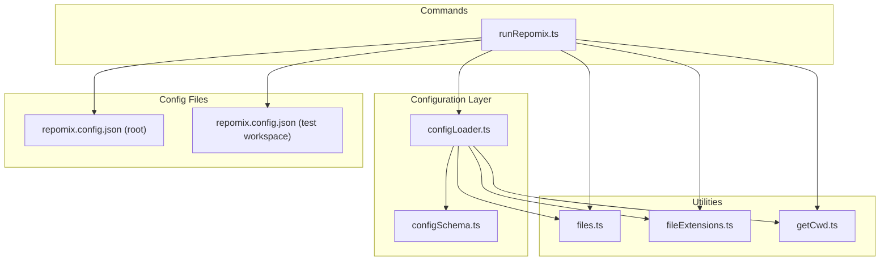
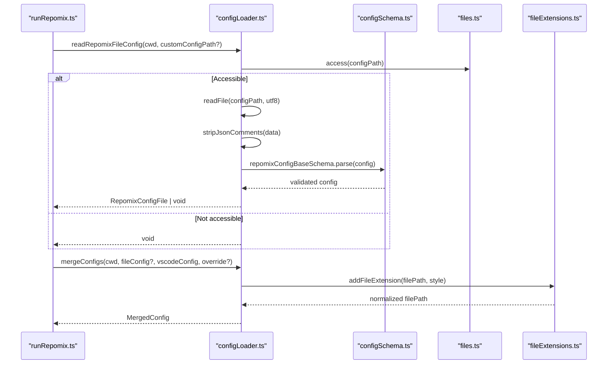
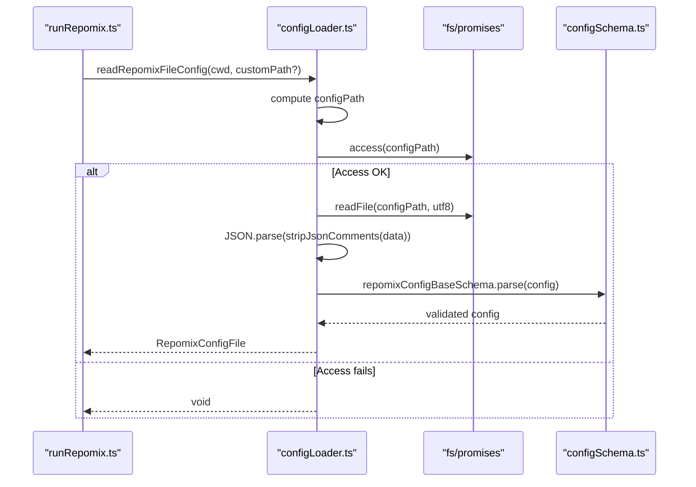
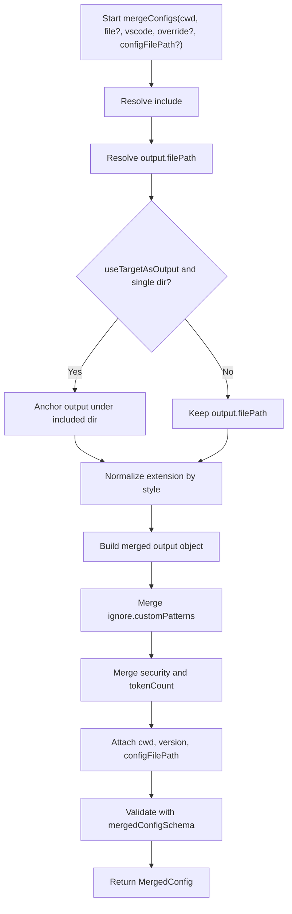
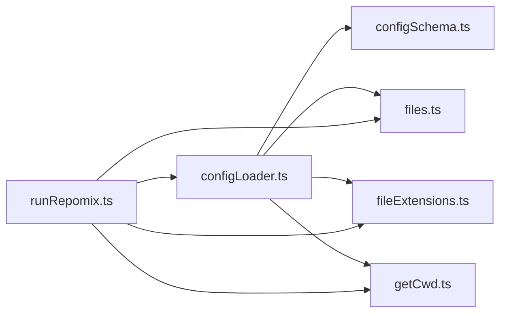

# repomix.config.json Support

<cite>
**Referenced Files in This Document**
- [configLoader.ts](file://src/config/configLoader.ts)
- [configSchema.ts](file://src/config/configSchema.ts)
- [runRepomix.ts](file://src/commands/runRepomix.ts)
- [repomix.config.json](file://repomix.config.json)
- [repomix.config.json](file://src/test/test-workspace/root/repomix.config.json)
- [files.ts](file://src/shared/files.ts)
- [fileExtensions.ts](file://src/utils/fileExtensions.ts)
- [getCwd.ts](file://src/config/getCwd.ts)
- [utils.ts](file://src/commands/utils.ts)
</cite>

## Table of Contents
1. [Introduction](#introduction)
2. [Project Structure](#project-structure)
3. [Core Components](#core-components)
4. [Architecture Overview](#architecture-overview)
5. [Detailed Component Analysis](#detailed-component-analysis)
6. [Dependency Analysis](#dependency-analysis)
7. [Performance Considerations](#performance-considerations)
8. [Troubleshooting Guide](#troubleshooting-guide)
9. [Conclusion](#conclusion)
10. [Appendices](#appendices)

## Introduction
This document explains the repomix.config.json support system in the project. It covers how the configuration file is discovered and loaded, how comments are stripped from JSON, how schema validation is performed using the base configuration schema, and how the resulting configuration integrates into the merging pipeline. It also documents supported properties, practical configuration examples, comment usage in JSON, troubleshooting invalid JSON format errors, file location detection, custom config path specification, and configuration inheritance patterns.

## Project Structure
The repomix.config.json support spans several modules:
- Configuration loading and validation: configLoader.ts
- Schema definitions and defaults: configSchema.ts
- Command orchestration: runRepomix.ts
- Utilities for file handling and path resolution: files.ts, fileExtensions.ts, getCwd.ts
- Example configuration files: repomix.config.json (project root) and test workspace



**Diagram sources**
- [configLoader.ts](file://src/config/configLoader.ts#L1-L230)
- [configSchema.ts](file://src/config/configSchema.ts#L1-L165)
- [runRepomix.ts](file://src/commands/runRepomix.ts#L1-L173)
- [files.ts](file://src/shared/files.ts#L1-L70)
- [fileExtensions.ts](file://src/utils/fileExtensions.ts#L1-L33)
- [getCwd.ts](file://src/config/getCwd.ts#L1-L18)
- [repomix.config.json](file://repomix.config.json#L1-L43)
- [repomix.config.json](file://src/test/test-workspace/root/repomix.config.json#L1-L26)

**Section sources**
- [configLoader.ts](file://src/config/configLoader.ts#L1-L230)
- [configSchema.ts](file://src/config/configSchema.ts#L1-L165)
- [runRepomix.ts](file://src/commands/runRepomix.ts#L1-L173)
- [files.ts](file://src/shared/files.ts#L1-L70)
- [fileExtensions.ts](file://src/utils/fileExtensions.ts#L1-L33)
- [getCwd.ts](file://src/config/getCwd.ts#L1-L18)
- [repomix.config.json](file://repomix.config.json#L1-L43)
- [repomix.config.json](file://src/test/test-workspace/root/repomix.config.json#L1-L26)

## Core Components
- JSON comment stripping: A robust function that removes both single-line (//) and multi-line (/* */) comments while preserving strings and escaping.
- File reading and validation: Reads repomix.config.json, strips comments, parses JSON, validates against the base schema, and returns a typed configuration object.
- Configuration merging: Applies a strict priority order to combine overrides, file-based config, VS Code settings, and defaults into a final merged configuration.
- Output path normalization: Ensures the output file path matches the configured style and resolves to an absolute path within the workspace.

Key responsibilities:
- readRepomixFileConfig: Loads and validates repomix.config.json with comment support.
- stripJsonComments: Safely removes comments from JSON text.
- mergeConfigs: Merges sources with explicit precedence and applies output style normalization.
- Integration: runRepomix orchestrates loading, merging, and security checks before invoking the external tool.

**Section sources**
- [configLoader.ts](file://src/config/configLoader.ts#L17-L130)
- [configLoader.ts](file://src/config/configLoader.ts#L145-L229)
- [configSchema.ts](file://src/config/configSchema.ts#L14-L57)
- [runRepomix.ts](file://src/commands/runRepomix.ts#L48-L154)

## Architecture Overview
The configuration pipeline follows a predictable flow: discover the config file, load and validate it, merge with VS Code settings and defaults, and apply post-processing like output path normalization and security checks.



**Diagram sources**
- [runRepomix.ts](file://src/commands/runRepomix.ts#L48-L73)
- [configLoader.ts](file://src/config/configLoader.ts#L105-L130)
- [configLoader.ts](file://src/config/configLoader.ts#L145-L229)
- [configSchema.ts](file://src/config/configSchema.ts#L14-L57)
- [files.ts](file://src/shared/files.ts#L32-L49)
- [fileExtensions.ts](file://src/utils/fileExtensions.ts#L4-L32)

## Detailed Component Analysis

### JSON Comment Stripping Function
Purpose:
- Remove comments from JSON text safely without breaking strings or escaped sequences.

Implementation highlights:
- Tracks quote state to avoid treating slashes inside strings as comment markers.
- Handles both single-line (//) and multi-line (/* */) comments.
- Preserves whitespace and replaces comment content with spaces to maintain alignment for error reporting.
- Throws a clear error if the input is not a string.

Behavioral notes:
- Escaped backslashes are respected to avoid false positives on quotes.
- The algorithm iterates once through the input, building output segments efficiently.

```mermaid
flowchart TD
Start(["stripJsonComments(input)"]) --> CheckType{"Is input a string?"}
CheckType --> |No| ThrowErr["Throw TypeError"]
CheckType --> |Yes| Init["Initialize state<br/>i, inStr, inCom, comType, sliceStart"]
Init --> Loop{"i < length"}
Loop --> |No| JoinOut["Join output segments"]
JoinOut --> End(["Return stripped JSON"])
Loop --> Char["Read c and n"]
Char --> InString{"inStr?"}
InString --> |Yes| IncI["i++"] --> Loop
InString --> |No| IsQuote{"c == '\"' and not escaped?"}
IsQuote --> |Yes| ToggleStr["Toggle inStr"] --> IncI2["i++"] --> Loop
IsQuote --> |No| IsSingle{"c=='/' and n=='/' and not inCom?"}
IsSingle --> |Yes| PushBefore["Push segment before //"] --> SetCom["Set inCom='single'"] --> IncBy2["i+=2"] --> Loop
IsSingle --> |No| IsMulti{"c=='/' and n=='*' and not inCom?"}
IsMulti --> |Yes| PushBefore2["Push segment before /*"] --> SetCom2["Set inCom='multi'"] --> IncBy3["i+=2"] --> Loop
IsMulti --> |No| InSingleCom{"inCom and comType=='single' and newline?"}
InSingleCom --> |Yes| ReplaceLine["Replace with spaces"] --> ResetCom["Reset inCom/comType"] --> IncI3["i++"] --> Loop
InSingleCom --> |No| InMultiCom{"inCom and comType=='multi' and */ ?"}
InMultiCom --> |Yes| ReplaceMulti["Replace with spaces"] --> ResetCom2["Reset inCom/comType"] --> IncBy4["i+=2"] --> Loop
InMultiCom --> |No| IncI4["i++"] --> Loop
```

**Diagram sources**
- [configLoader.ts](file://src/config/configLoader.ts#L17-L95)

**Section sources**
- [configLoader.ts](file://src/config/configLoader.ts#L17-L95)

### readRepomixFileConfig Implementation
Responsibilities:
- Determine the config file path (default or custom).
- Attempt to access the file; if inaccessible, log and return void.
- Read file content, strip comments, parse JSON, and validate with the base schema.
- On invalid JSON/format errors, log and surface a user-friendly error.

Error handling:
- Missing file: logs debug info and returns void.
- Invalid JSON or schema mismatch: logs an error, shows a message, and throws a typed error.

Integration:
- Called by runRepomix to obtain optional file-based configuration.
- The returned value is passed to mergeConfigs.



**Diagram sources**
- [configLoader.ts](file://src/config/configLoader.ts#L105-L130)
- [configSchema.ts](file://src/config/configSchema.ts#L14-L57)

**Section sources**
- [configLoader.ts](file://src/config/configLoader.ts#L105-L130)

### Configuration Merging Pipeline
Priority order (highest to lowest):
1. overrideConfig (directly passed)
2. configFromRepomixFile (from repomix.config.json)
3. configFromRepomixRunnerVscode (VS Code settings)
4. baseConfig (defaults)

Merging specifics:
- include: resolved from highest priority with fallbacks.
- output: filePath is normalized with style-specific extensions and resolved to absolute path; style influences extension addition.
- ignore: merges patterns from all sources; customPatterns are combined.
- security, tokenCount: shallow merges from sources.
- Special behavior: when useTargetAsOutput is enabled and include targets a single directory, output path is anchored under that directory.
- Final validation: merged configuration is validated against the merged schema.



**Diagram sources**
- [configLoader.ts](file://src/config/configLoader.ts#L145-L229)
- [configSchema.ts](file://src/config/configSchema.ts#L138-L149)
- [fileExtensions.ts](file://src/utils/fileExtensions.ts#L4-L32)
- [files.ts](file://src/shared/files.ts#L32-L49)

**Section sources**
- [configLoader.ts](file://src/config/configLoader.ts#L145-L229)
- [configSchema.ts](file://src/config/configSchema.ts#L138-L149)
- [fileExtensions.ts](file://src/utils/fileExtensions.ts#L4-L32)
- [files.ts](file://src/shared/files.ts#L32-L49)

### Supported Properties in repomix.config.json
The base schema supports the following top-level keys and nested options. Defaults are provided by the runner/default schema.

Top-level keys:
- output: Output formatting and behavior controls.
- include: Array of glob-like patterns to include.
- ignore: Controls gitignore usage, default patterns, and custom patterns.
- security: Security-related toggles.
- tokenCount: Tokenization settings.
- version: Boolean toggle.

Output options (selected):
- filePath: Output file path (may be auto-extended by style).
- style: Output style enum (plain, xml, markdown, json).
- parsableStyle, headerText, instructionFilePath, fileSummary, directoryStructure, removeComments, removeEmptyLines, topFilesLength, showLineNumbers, copyToClipboard, includeEmptyDirectories, compress.

Ignore options:
- useGitignore: Whether to honor .gitignore.
- useDefaultPatterns: Whether to apply default ignore patterns.
- customPatterns: Additional ignore patterns.

Security options:
- enableSecurityCheck: Enable/disable security checks.

Token count options:
- encoding: Encoding identifier for token counting.

Version:
- version: Boolean flag.

Notes:
- passthrough() allows additional fields for future compatibility.
- The runner schema extends the base schema with runner-specific fields.

**Section sources**
- [configSchema.ts](file://src/config/configSchema.ts#L14-L57)
- [configSchema.ts](file://src/config/configSchema.ts#L59-L101)
- [configSchema.ts](file://src/config/configSchema.ts#L103-L136)

### Practical Configuration Examples
Common structures and patterns:

- Minimal configuration with output customization:
  - See [repomix.config.json](file://src/test/test-workspace/root/repomix.config.json#L1-L26) for a concise example focusing on output, include, ignore, security, and tokenCount.

- Full-featured configuration with advanced options:
  - See [repomix.config.json](file://repomix.config.json#L1-L43) for a richer set of options including input limits, git metadata toggles, and extended output controls.

Comment usage in JSON:
- Single-line comments: // This is a comment
- Multi-line comments: /* Block comment */
- Comments inside strings are preserved; comments after closing braces are allowed due to passthrough().

**Section sources**
- [repomix.config.json](file://repomix.config.json#L1-L43)
- [repomix.config.json](file://src/test/test-workspace/root/repomix.config.json#L1-L26)

### File Location Detection and Custom Path Specification
- Default discovery: The loader joins the current working directory with the default filename to locate the config.
- Custom path: A caller may pass a relative path to override the default location.
- Workspace root: The current working directory is derived from the first workspace folder; if none is available, an error is thrown.

Practical guidance:
- Place repomix.config.json at the repository root for global settings.
- Use a custom path when you need per-subproject overrides.
- The run command accepts a config file path parameter and falls back to VS Code settings if unspecified.

**Section sources**
- [configLoader.ts](file://src/config/configLoader.ts#L105-L109)
- [runRepomix.ts](file://src/commands/runRepomix.ts#L60-L62)
- [getCwd.ts](file://src/config/getCwd.ts#L8-L17)

### Configuration Inheritance Patterns
The mergeConfigs function defines a strict precedence:
1. overrideConfig (highest)
2. repomix.config.json
3. VS Code settings
4. defaults (lowest)

This means:
- Per-invocation overrides take precedence over file-based settings.
- File-based settings override VS Code settings.
- VS Code settings override built-in defaults.

Output path inheritance:
- The output file path is resolved relative to the working directory and normalized according to the chosen style.

**Section sources**
- [configLoader.ts](file://src/config/configLoader.ts#L145-L229)

## Dependency Analysis
The configuration system exhibits clear separation of concerns:
- runRepomix orchestrates the entire flow and depends on loaders and utilities.
- configLoader encapsulates IO, parsing, and validation.
- configSchema defines types and validation rules.
- Utilities support path resolution and safety checks.



**Diagram sources**
- [runRepomix.ts](file://src/commands/runRepomix.ts#L1-L173)
- [configLoader.ts](file://src/config/configLoader.ts#L1-L230)
- [configSchema.ts](file://src/config/configSchema.ts#L1-L165)
- [files.ts](file://src/shared/files.ts#L1-L70)
- [fileExtensions.ts](file://src/utils/fileExtensions.ts#L1-L33)
- [getCwd.ts](file://src/config/getCwd.ts#L1-L18)

**Section sources**
- [runRepomix.ts](file://src/commands/runRepomix.ts#L1-L173)
- [configLoader.ts](file://src/config/configLoader.ts#L1-L230)
- [configSchema.ts](file://src/config/configSchema.ts#L1-L165)
- [files.ts](file://src/shared/files.ts#L1-L70)
- [fileExtensions.ts](file://src/utils/fileExtensions.ts#L1-L33)
- [getCwd.ts](file://src/config/getCwd.ts#L1-L18)

## Performance Considerations
- Comment stripping is linear in the size of the input text and avoids unnecessary allocations by building segments incrementally.
- JSON parsing occurs only after successful access and comment removal, minimizing error-prone operations.
- Merging uses shallow spreads and targeted property resolution, avoiding deep cloning overhead.
- Output path normalization performs simple string manipulation and extension replacement, negligible cost.

[No sources needed since this section provides general guidance]

## Troubleshooting Guide
Common issues and resolutions:

- Invalid repomix.config.json format:
  - Symptom: Error logged and a user-facing message indicates invalid format.
  - Causes: Trailing commas, comments without stripping, non-JSON syntax, or schema violations.
  - Resolution: Remove trailing commas, ensure comments are valid, and align with the base schema.

- Missing or inaccessible config file:
  - Symptom: Debug log indicates inability to access the file; execution proceeds without file-based config.
  - Resolution: Verify path correctness and permissions; use a custom path if needed.

- Security violation due to output path traversal:
  - Symptom: Error thrown when output path attempts to escape the workspace.
  - Resolution: Keep output within the workspace; avoid parent directory traversal in filePath.

- Custom config path selection:
  - Symptom: Unexpected config not applied.
  - Resolution: Confirm the path is relative to the workspace root and accessible; use the quick pick utility to select a config file.

- Output style mismatch:
  - Symptom: Unexpected file extension.
  - Resolution: Ensure style matches intended output; the system normalizes the extension accordingly.

**Section sources**
- [configLoader.ts](file://src/config/configLoader.ts#L125-L129)
- [configLoader.ts](file://src/config/configLoader.ts#L111-L119)
- [runRepomix.ts](file://src/commands/runRepomix.ts#L75-L80)
- [utils.ts](file://src/commands/utils.ts#L88-L128)

## Conclusion
The repomix.config.json support system provides a robust, schema-driven configuration mechanism with strong defaults, flexible inheritance, and safe file handling. By combining comment-stripping, strict validation, and a clear merging strategy, it enables reliable configuration across diverse environments while maintaining user control and extensibility.

[No sources needed since this section summarizes without analyzing specific files]

## Appendices

### A. Example Configuration Files
- Minimal example: [repomix.config.json](file://src/test/test-workspace/root/repomix.config.json#L1-L26)
- Full-featured example: [repomix.config.json](file://repomix.config.json#L1-L43)

**Section sources**
- [repomix.config.json](file://src/test/test-workspace/root/repomix.config.json#L1-L26)
- [repomix.config.json](file://repomix.config.json#L1-L43)