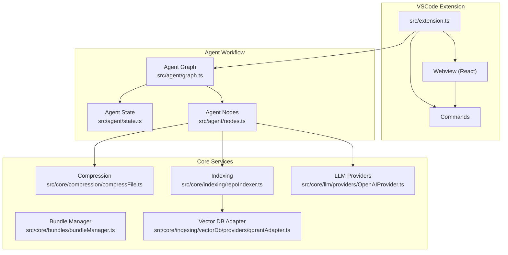
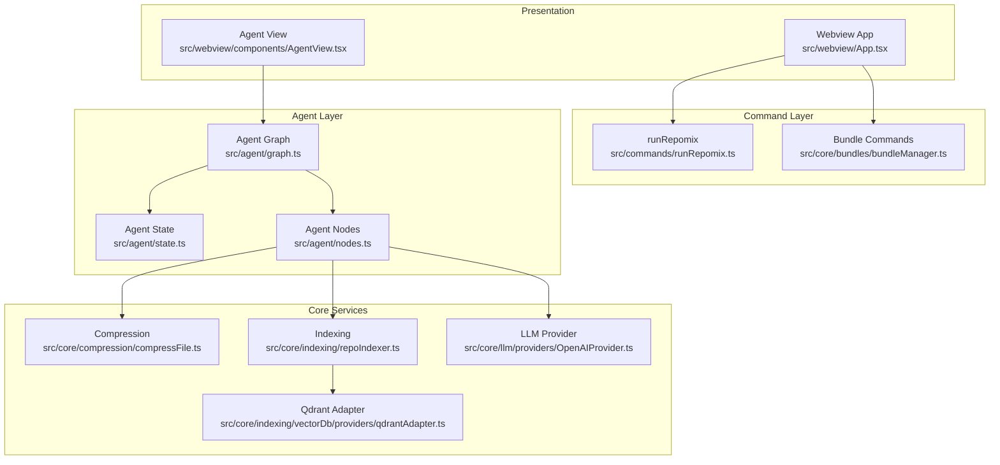
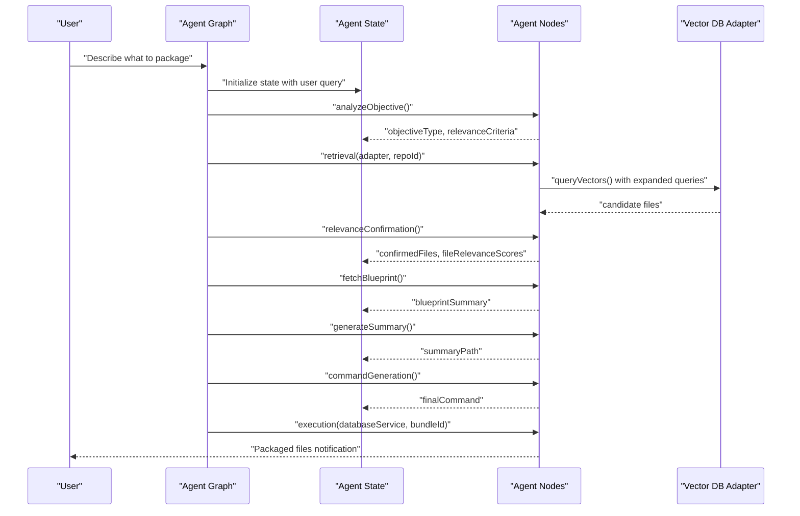
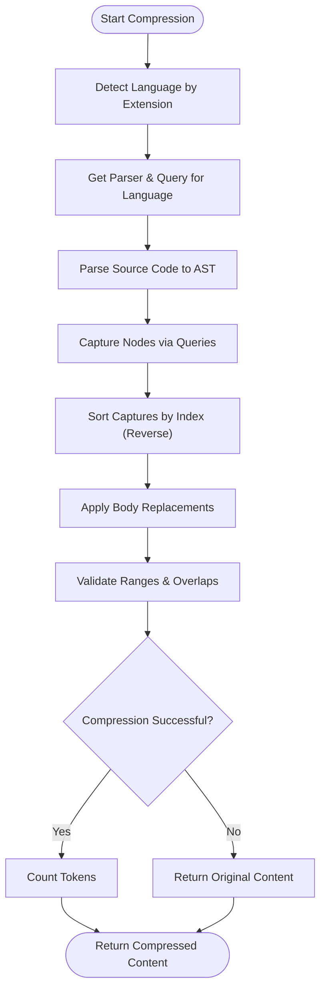
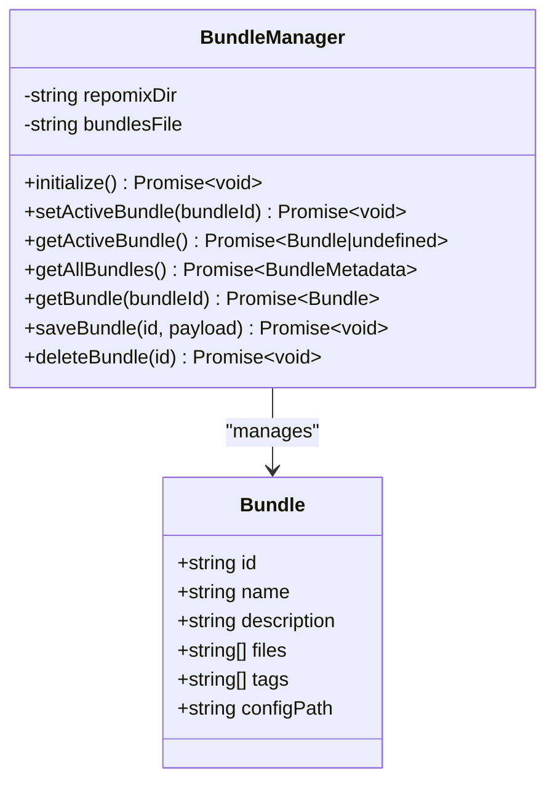
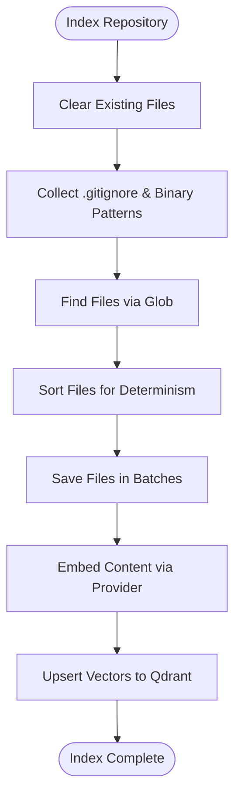
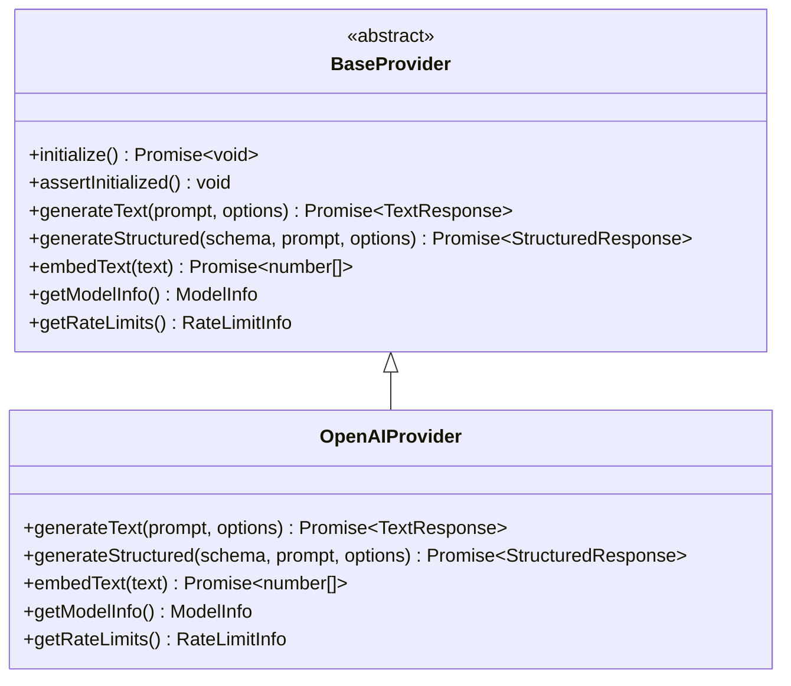
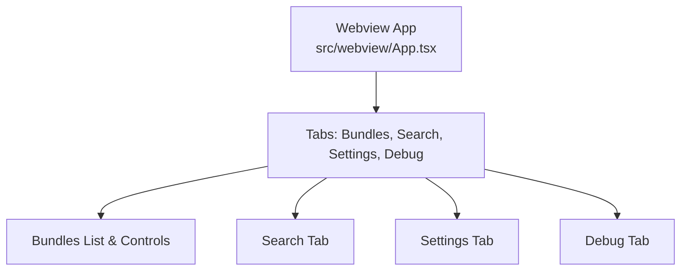
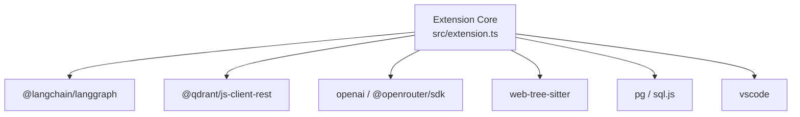

# AI Assistant

<cite>
**Referenced Files in This Document**
- [README.md](file://README.md)
- [package.json](file://package.json)
- [src/extension.ts](file://src/extension.ts)
- [src/agent/graph.ts](file://src/agent/graph.ts)
- [src/agent/state.ts](file://src/agent/state.ts)
- [src/agent/nodes.ts](file://src/agent/nodes.ts)
- [src/core/compression/compressFile.ts](file://src/core/compression/compressFile.ts)
- [src/core/bundles/bundleManager.ts](file://src/core/bundles/bundleManager.ts)
- [src/webview/App.tsx](file://src/webview/App.tsx)
- [src/webview/components/AgentView.tsx](file://src/webview/components/AgentView.tsx)
- [src/core/indexing/repoIndexer.ts](file://src/core/indexing/repoIndexer.ts)
- [src/core/indexing/vectorDb/providers/qdrantAdapter.ts](file://src/core/indexing/vectorDb/providers/qdrantAdapter.ts)
- [src/core/llm/providers/OpenAIProvider.ts](file://src/core/llm/providers/OpenAIProvider.ts)
- [src/commands/runRepomix.ts](file://src/commands/runRepomix.ts)
</cite>

## Table of Contents
1. [Introduction](#introduction)
2. [Project Structure](#project-structure)
3. [Core Components](#core-components)
4. [Architecture Overview](#architecture-overview)
5. [Detailed Component Analysis](#detailed-component-analysis)
6. [Dependency Analysis](#dependency-analysis)
7. [Performance Considerations](#performance-considerations)
8. [Troubleshooting Guide](#troubleshooting-guide)
9. [Conclusion](#conclusion)

## Introduction
Repomix Runner Plus is a VSCode extension designed to streamline AI-assisted code packaging and analysis. It enables developers to bundle files into a single output suitable for AI processing, manage reusable bundles, and leverage an intelligent agent to discover relevant files based on natural language queries. The extension integrates with vector databases for semantic search, supports cross-platform clipboard workflows, and provides a modern webview-based control panel.

Key capabilities include:
- Bundling and packaging files for AI consumption
- Intelligent file discovery using semantic search and multi-query expansion
- Cross-platform clipboard operations (file and text modes)
- Background indexing and incremental re-embedding
- Modular LLM provider support with rate limiting and usage tracking

## Project Structure
The extension follows a layered architecture with clear separation of concerns:
- Extension entry point initializes services, providers, and webview components
- Agent module implements a LangGraph-based workflow for intelligent file selection
- Core modules handle compression, indexing, LLM providers, and file operations
- Webview provides a React-based UI for bundle management, settings, and agent interactions
- Commands bridge VSCode actions to core functionality

**Diagram sources**
- [src/extension.ts:79-544](file://src/extension.ts#L79-L544)
- [src/agent/graph.ts:8-74](file://src/agent/graph.ts#L8-L74)
- [src/agent/state.ts:17-89](file://src/agent/state.ts#L17-L89)
- [src/agent/nodes.ts:134-800](file://src/agent/nodes.ts#L134-L800)
- [src/core/compression/compressFile.ts:52-172](file://src/core/compression/compressFile.ts#L52-L172)
- [src/core/bundles/bundleManager.ts:6-117](file://src/core/bundles/bundleManager.ts#L6-L117)
- [src/core/indexing/repoIndexer.ts:29-114](file://src/core/indexing/repoIndexer.ts#L29-L114)
- [src/core/indexing/vectorDb/providers/qdrantAdapter.ts:12-524](file://src/core/indexing/vectorDb/providers/qdrantAdapter.ts#L12-L524)
- [src/core/llm/providers/OpenAIProvider.ts:26-284](file://src/core/llm/providers/OpenAIProvider.ts#L26-L284)

**Section sources**
- [README.md:13-142](file://README.md#L13-L142)
- [package.json:20-687](file://package.json#L20-L687)
- [src/extension.ts:79-544](file://src/extension.ts#L79-L544)

## Core Components
This section outlines the primary building blocks that power the extension's functionality.

- Extension Activation and Initialization
  - Initializes LLM provider manager, WASM path for compression, database service, embedding service, and background indexing monitor
  - Exposes extension context globally for agent graph access
  - Registers commands for bundle management, file operations, and agent execution

- Agent Workflow (LangGraph)
  - Defines a stateful graph with nodes for objective analysis, retrieval, relevance confirmation, blueprint fetching, context optimization, summary generation, command generation, and execution
  - Implements conditional edges for repack scenarios and fallback mechanisms
  - Manages token budgets and relevance scoring

- Compression Engine
  - Supports AST-based compression for TypeScript, JavaScript, Dart, Python, C#, and Rust
  - Detects language by file extension and applies strategy-specific body replacements
  - Calculates token counts for efficient budget management

- Bundle Management
  - Persists bundles to .repomix/bundles.json
  - Tracks active bundle and emits change events
  - Supports CRUD operations for bundles and files within bundles

- Indexing and Vector Database
  - Scans repository files, respects .gitignore and additional patterns
  - Embeds content using configurable providers (Ollama, LM Studio)
  - Integrates with Qdrant for vector storage and retrieval with deterministic IDs

- LLM Provider Abstraction
  - Unified provider interface supporting text generation, structured output, and embeddings
  - Includes rate limiting, usage tracking, and error handling
  - Supports multiple providers (OpenRouter, Ollama, LM Studio)

- Webview Control Panel
  - React-based UI with tabs for bundles, search, settings, and debug
  - Handles state hydration, execution state updates, and remote clipboard reporting
  - Provides interactive components for agent configuration and history

**Section sources**
- [src/extension.ts:79-544](file://src/extension.ts#L79-L544)
- [src/agent/graph.ts:8-74](file://src/agent/graph.ts#L8-L74)
- [src/agent/state.ts:17-89](file://src/agent/state.ts#L17-L89)
- [src/agent/nodes.ts:134-800](file://src/agent/nodes.ts#L134-L800)
- [src/core/compression/compressFile.ts:52-172](file://src/core/compression/compressFile.ts#L52-L172)
- [src/core/bundles/bundleManager.ts:6-117](file://src/core/bundles/bundleManager.ts#L6-L117)
- [src/core/indexing/repoIndexer.ts:29-114](file://src/core/indexing/repoIndexer.ts#L29-L114)
- [src/core/indexing/vectorDb/providers/qdrantAdapter.ts:12-524](file://src/core/indexing/vectorDb/providers/qdrantAdapter.ts#L12-L524)
- [src/core/llm/providers/OpenAIProvider.ts:26-284](file://src/core/llm/providers/OpenAIProvider.ts#L26-L284)
- [src/webview/App.tsx:47-250](file://src/webview/App.tsx#L47-L250)

## Architecture Overview
The system architecture centers around a modular design that separates concerns across layers:
- Presentation Layer: Webview UI for bundle management and agent interactions
- Command Layer: VSCode commands that orchestrate core operations
- Agent Layer: LangGraph workflow for intelligent file discovery and packaging
- Core Services: Compression, indexing, vector database, and LLM provider abstractions
- Storage Layer: SQLite database for run history and bundle metadata; Qdrant for vector storage

**Diagram sources**
- [src/webview/App.tsx:47-250](file://src/webview/App.tsx#L47-L250)
- [src/webview/components/AgentView.tsx:16-174](file://src/webview/components/AgentView.tsx#L16-L174)
- [src/commands/runRepomix.ts:48-173](file://src/commands/runRepomix.ts#L48-L173)
- [src/core/bundles/bundleManager.ts:6-117](file://src/core/bundles/bundleManager.ts#L6-L117)
- [src/agent/graph.ts:8-74](file://src/agent/graph.ts#L8-L74)
- [src/agent/state.ts:17-89](file://src/agent/state.ts#L17-L89)
- [src/agent/nodes.ts:134-800](file://src/agent/nodes.ts#L134-L800)
- [src/core/compression/compressFile.ts:52-172](file://src/core/compression/compressFile.ts#L52-L172)
- [src/core/indexing/repoIndexer.ts:29-114](file://src/core/indexing/repoIndexer.ts#L29-L114)
- [src/core/indexing/vectorDb/providers/qdrantAdapter.ts:12-524](file://src/core/indexing/vectorDb/providers/qdrantAdapter.ts#L12-L524)
- [src/core/llm/providers/OpenAIProvider.ts:26-284](file://src/core/llm/providers/OpenAIProvider.ts#L26-L284)

## Detailed Component Analysis

### Agent Workflow and State Management
The agent workflow is implemented as a LangGraph with a well-defined state schema and nodes for each phase of the process. The state tracks user queries, workspace context, file lists, relevance scores, and token usage. Nodes implement:
- Objective analysis: Determines whether the request is an action or search task
- Retrieval: Performs multi-query expansion and vector database lookup
- Relevance confirmation: Batch-processed content analysis with confidence thresholds
- Blueprint fetching: Retrieves architectural context for enhanced summarization
- Summary generation: Produces markdown summaries with token accounting
- Command generation and execution: Generates final repomix command and executes it

**Diagram sources**
- [src/agent/graph.ts:8-74](file://src/agent/graph.ts#L8-L74)
- [src/agent/state.ts:17-89](file://src/agent/state.ts#L17-L89)
- [src/agent/nodes.ts:134-800](file://src/agent/nodes.ts#L134-L800)
- [src/core/indexing/vectorDb/providers/qdrantAdapter.ts:253-343](file://src/core/indexing/vectorDb/providers/qdrantAdapter.ts#L253-L343)

**Section sources**
- [src/agent/graph.ts:8-74](file://src/agent/graph.ts#L8-L74)
- [src/agent/state.ts:17-89](file://src/agent/state.ts#L17-L89)
- [src/agent/nodes.ts:134-800](file://src/agent/nodes.ts#L134-L800)

### Compression Pipeline
The compression engine performs AST-based extraction for supported languages. It:
- Detects language by file extension
- Parses source code into syntax trees
- Captures relevant nodes (functions, classes, imports) using language-specific queries
- Applies strategy-based body replacements to extract skeletons
- Validates ranges and avoids overlapping replacements
- Counts tokens for budget management

**Diagram sources**
- [src/core/compression/compressFile.ts:52-172](file://src/core/compression/compressFile.ts#L52-L172)

**Section sources**
- [src/core/compression/compressFile.ts:52-172](file://src/core/compression/compressFile.ts#L52-L172)

### Bundle Management
Bundle management persists user-defined groups of files with metadata and supports:
- Creating, editing, and deleting bundles
- Adding/removing files from active bundles
- Tracking active bundle and emitting change events
- Persisting to .repomix/bundles.json

**Diagram sources**
- [src/core/bundles/bundleManager.ts:6-117](file://src/core/bundles/bundleManager.ts#L6-L117)

**Section sources**
- [src/core/bundles/bundleManager.ts:6-117](file://src/core/bundles/bundleManager.ts#L6-L117)

### Indexing and Vector Database Integration
The indexing pipeline:
- Clears existing repository files
- Collects .gitignore patterns from all subdirectories
- Searches files using glob patterns with binary exclusions
- Saves files in batches to the database
- Embeds content using configured providers
- Upserts vectors to Qdrant with deterministic IDs

**Diagram sources**
- [src/core/indexing/repoIndexer.ts:29-114](file://src/core/indexing/repoIndexer.ts#L29-L114)
- [src/core/indexing/vectorDb/providers/qdrantAdapter.ts:107-251](file://src/core/indexing/vectorDb/providers/qdrantAdapter.ts#L107-L251)

**Section sources**
- [src/core/indexing/repoIndexer.ts:29-114](file://src/core/indexing/repoIndexer.ts#L29-L114)
- [src/core/indexing/vectorDb/providers/qdrantAdapter.ts:107-251](file://src/core/indexing/vectorDb/providers/qdrantAdapter.ts#L107-L251)

### LLM Provider Abstraction
The LLM provider abstraction offers:
- Unified interface for text generation, structured output, and embeddings
- Provider capabilities and model information
- Rate limiting and usage tracking
- Error handling for API failures and rate limits

**Diagram sources**
- [src/core/llm/providers/OpenAIProvider.ts:26-284](file://src/core/llm/providers/OpenAIProvider.ts#L26-L284)

**Section sources**
- [src/core/llm/providers/OpenAIProvider.ts:26-284](file://src/core/llm/providers/OpenAIProvider.ts#L26-L284)

### Webview Control Panel
The webview provides:
- Tabbed interface for bundles, search, settings, and debug
- Real-time state updates from the extension
- Execution state tracking for default repomix and bundles
- Client OS detection for remote clipboard support
- Deprecation of the dedicated Smart Agent tab with future integration plans

**Diagram sources**
- [src/webview/App.tsx:47-250](file://src/webview/App.tsx#L47-L250)

**Section sources**
- [src/webview/App.tsx:47-250](file://src/webview/App.tsx#L47-L250)
- [src/webview/components/AgentView.tsx:16-174](file://src/webview/components/AgentView.tsx#L16-L174)

## Dependency Analysis
The extension relies on several external libraries and services:
- LangChain LangGraph for workflow orchestration
- Qdrant JS client for vector database operations
- OpenAI-compatible APIs for text generation and embeddings
- VS Code extension SDK for commands, views, and webview communication
- Tree-sitter WASM for parsing source code in compression
- SQLite for local run history and bundle metadata

**Diagram sources**
- [src/extension.ts:79-544](file://src/extension.ts#L79-L544)
- [package.json:744-771](file://package.json#L744-L771)

**Section sources**
- [package.json:744-771](file://package.json#L744-L771)
- [src/extension.ts:79-544](file://src/extension.ts#L79-L544)

## Performance Considerations
- Token Budget Management: The agent enforces token budgets and caches LLM responses to minimize cost and latency
- Batch Processing: Parallel batch processing with controlled concurrency reduces processing time for large file sets
- Incremental Indexing: Background file watcher with debouncing prevents excessive re-embedding during rapid saves
- Vector Dimension Validation: Pre-flight checks ensure vector dimensions match collection configuration, avoiding runtime errors
- Compression Efficiency: AST-based compression reduces token count while preserving essential structure

## Troubleshooting Guide
Common issues and resolutions:
- Remote Clipboard Limitations: The webview sandbox disables remote clipboard processing; use extension commands instead
- Vector DB Configuration: Ensure Qdrant URL, API key (for hosted instances), and collection name are correctly configured
- Background Indexing Disabled: If API keys or vector database are missing, background indexing is skipped; configure settings to enable
- LLM Provider Errors: Verify API keys and model configurations; check rate limits and usage tracking
- Compression Failures: Unsupported file extensions or parsing errors may cause compression to fall back to original content

**Section sources**
- [src/webview/App.tsx:111-120](file://src/webview/App.tsx#L111-L120)
- [src/core/indexing/vectorDb/providers/qdrantAdapter.ts:22-43](file://src/core/indexing/vectorDb/providers/qdrantAdapter.ts#L22-L43)
- [src/extension.ts:221-538](file://src/extension.ts#L221-L538)
- [src/agent/nodes.ts:448-470](file://src/agent/nodes.ts#L448-L470)

## Conclusion
Repomix Runner Plus delivers a robust, extensible solution for AI-assisted code packaging and analysis. Its modular architecture, intelligent agent workflow, and seamless VSCode integration provide developers with powerful tools to discover, package, and share relevant code artifacts efficiently. The extension's emphasis on performance, reliability, and cross-platform compatibility makes it a valuable asset for modern development workflows.