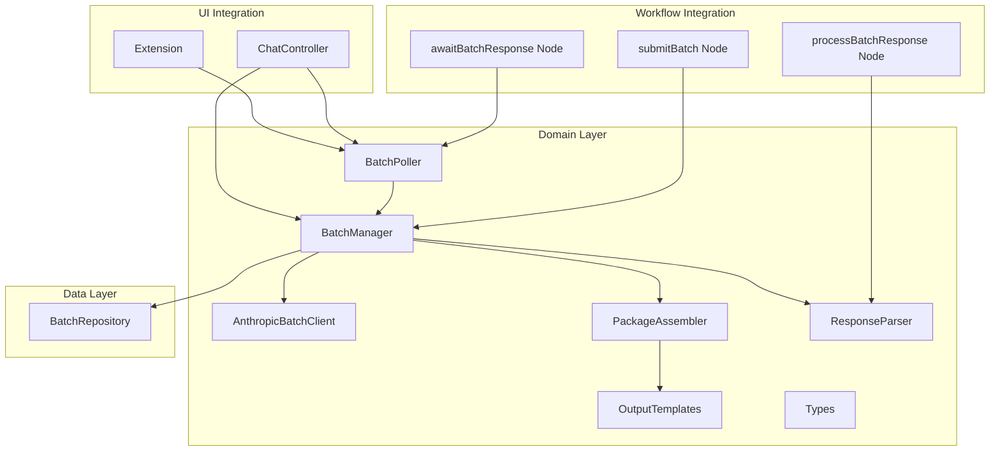
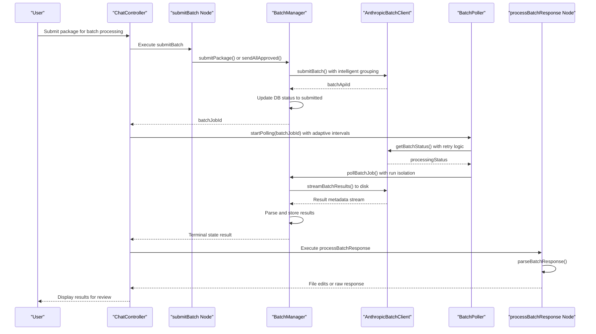
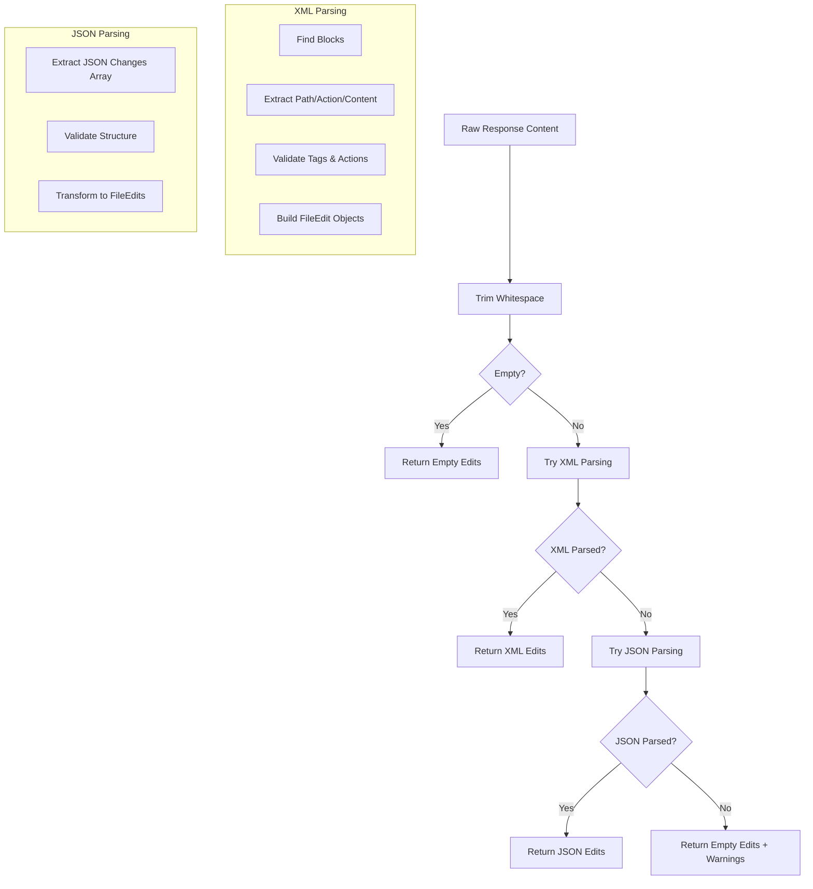

# Batch LLM Pipeline

<cite>
**Referenced Files in This Document**
- [PRD 005_batch_llm_pipeline.md](file://PRDs/005_batch_llm_pipeline.md)
- [batchManager.ts](file://src/chat/batch/batchManager.ts)
- [batchPoller.ts](file://src/chat/batch/batchPoller.ts)
- [anthropicBatchClient.ts](file://src/chat/batch/anthropicBatchClient.ts)
- [packageAssembler.ts](file://src/chat/batch/packageAssembler.ts)
- [responseParser.ts](file://src/chat/batch/responseParser.ts)
- [types.ts](file://src/chat/batch/types.ts)
- [outputTemplates.ts](file://src/chat/batch/outputTemplates.ts)
- [batchRepository.ts](file://src/chat/db/batchRepository.ts)
- [submitBatch.ts](file://src/chat/nodes/submitBatch.ts)
- [awaitBatchResponse.ts](file://src/chat/nodes/awaitBatchResponse.ts)
- [processBatchResponse.ts](file://src/chat/nodes/processBatchResponse.ts)
- [extension.ts](file://src/extension.ts)
- [ChatController.ts](file://src/webview/controllers/ChatController.ts)
- [package.json](file://package.json)
</cite>

## Update Summary
**Changes Made**
- Enhanced BatchManager with intelligent batching capabilities for grouped submissions
- Implemented adaptive polling intervals in BatchPoller with dynamic adjustment based on elapsed time
- Added comprehensive error handling and retry mechanisms with configurable parameters
- Introduced disk-based streaming architecture for memory-efficient result processing
- Enhanced run isolation and lifecycle management for concurrent operations
- Improved error detection with retryable status code handling and comprehensive retry policies

## Table of Contents
1. [Introduction](#introduction)
2. [Project Structure](#project-structure)
3. [Core Components](#core-components)
4. [Architecture Overview](#architecture-overview)
5. [Detailed Component Analysis](#detailed-component-analysis)
6. [Dependency Analysis](#dependency-analysis)
7. [Performance Considerations](#performance-considerations)
8. [Troubleshooting Guide](#troubleshooting-guide)
9. [Conclusion](#conclusion)

## Introduction
This document describes the Batch LLM Pipeline implementation that integrates with the Anthropic Message Batches API. The pipeline enables cost-effective batch processing of AI prompts by submitting multiple requests as a single batch job, polling for completion, storing results, and notifying users. This approach reduces costs by approximately 50% compared to real-time API calls while maintaining the ability to handle complex tasks like plan generation, code implementation, and code review.

**Updated** Enhanced with intelligent batching capabilities, adaptive polling intervals, comprehensive error handling, and memory-efficient streaming architecture. The pipeline now features grouped submissions, dynamic polling strategies, enhanced retry mechanisms, and improved run isolation for production-grade reliability.

## Project Structure
The batch pipeline is organized into several key modules:
- Domain layer: batch orchestration, polling, client integration, prompt assembly, and response parsing
- Data layer: PostgreSQL repository for batch job persistence
- Workflow integration: LangGraph nodes for submission, awaiting completion, and processing responses
- UI integration: ChatController for webview communication and batch lifecycle management
- Extension lifecycle: initialization and disposal of background pollers



**Diagram sources**
- [batchManager.ts](file://src/chat/batch/batchManager.ts#L72-L80)
- [batchPoller.ts](file://src/chat/batch/batchPoller.ts#L16-L30)
- [anthropicBatchClient.ts](file://src/chat/batch/anthropicBatchClient.ts#L123-L133)
- [packageAssembler.ts](file://src/chat/batch/packageAssembler.ts#L27-L40)
- [responseParser.ts](file://src/chat/batch/responseParser.ts#L162-L222)
- [outputTemplates.ts](file://src/chat/batch/outputTemplates.ts#L3-L59)
- [batchRepository.ts](file://src/chat/db/batchRepository.ts#L45-L80)
- [submitBatch.ts](file://src/chat/nodes/submitBatch.ts#L15-L57)
- [awaitBatchResponse.ts](file://src/chat/nodes/awaitBatchResponse.ts#L21-L49)
- [processBatchResponse.ts](file://src/chat/nodes/processBatchResponse.ts#L18-L50)
- [ChatController.ts](file://src/webview/controllers/ChatController.ts#L56-L90)
- [extension.ts](file://src/extension.ts#L124-L157)

**Section sources**
- [PRD 005_batch_llm_pipeline.md](file://PRDs/005_batch_llm_pipeline.md#L1-L401)
- [package.json](file://package.json#L1-L200)

## Core Components
The batch pipeline consists of five primary components that work together to manage the end-to-end workflow:

### BatchManager
The central orchestrator that manages batch job lifecycle, coordinates with the Anthropic client, persists state to the database, and handles result processing. It provides operations for creating, approving, submitting, and managing batch jobs with enhanced intelligent batching capabilities.

Key responsibilities:
- Package lifecycle management (create, approve, submit, cancel, delete)
- Integration with Anthropic Batch API with intelligent grouping
- Database persistence through BatchRepository
- Result parsing and storage
- Token usage tracking and cost estimation
- **Enhanced** Intelligent batching with grouped submissions for multiple packages
- **New** Comprehensive error handling with retry integration and configurable retry parameters
- **Enhanced** Memory-efficient streaming result processing for large batch operations

**Enhanced** Now includes intelligent batching capabilities that allow multiple packages to be submitted in a single batch request, improving efficiency and reducing API overhead. The manager implements memory-efficient architecture by streaming results directly to disk, avoiding memory bloat during large batch processing operations.

### BatchPoller
A background service that monitors batch job status and triggers completion handling when jobs reach terminal states. It implements adaptive polling with configurable intervals and handles extension lifecycle events with enhanced run isolation.

Key features:
- Configurable polling intervals (initial delay, regular intervals, maximum duration)
- Automatic resume of pending jobs on extension startup
- Robust error handling and retry mechanisms
- Resource cleanup on disposal
- **New** Adaptive polling intervals with dynamic adjustment based on elapsed time
- **Enhanced** Run ID tracking for isolation and lifecycle management
- **Enhanced** Run safety checks to prevent race conditions between concurrent polling sessions

### AnthropicBatchClient
A wrapper around the official Anthropic SDK that provides batch operation capabilities with built-in retry logic and error handling. It handles API communication, result streaming, and status monitoring with comprehensive error detection.

Key capabilities:
- Batch submission with custom IDs and model configurations
- Status polling with normalized status mapping
- **Enhanced** Intelligent batching with grouped request processing
- **New** Comprehensive retry logic with exponential backoff and jitter
- **Enhanced** Memory-efficient streaming result processing with disk-based storage
- **New** Comprehensive error detection with retryable status codes and error codes
- **Enhanced** Configurable retry parameters through VS Code settings

### PackageAssembler
Responsible for constructing the final prompt from package payloads using predefined output templates. It handles context file rendering, dependency formatting, and template application.

Key functionality:
- Template-based prompt construction
- Context file formatting and inclusion
- Dependency rendering
- Token estimation for UI feedback

### ResponseParser
Parses AI-generated responses into structured file edit objects, supporting both XML-based `<file_change>` blocks and JSON fallback formats. It provides diagnostic information for malformed outputs.

Key features:
- Dual-format parsing (XML and JSON)
- Diagnostic reporting for parsing issues
- Structured edit extraction
- Fallback mechanisms for malformed responses
- **Enhanced** Robust extraction using string-based parsing to avoid regex issues

**Section sources**
- [batchManager.ts](file://src/chat/batch/batchManager.ts#L72-L510)
- [batchPoller.ts](file://src/chat/batch/batchPoller.ts#L16-L145)
- [anthropicBatchClient.ts](file://src/chat/batch/anthropicBatchClient.ts#L123-L277)
- [packageAssembler.ts](file://src/chat/batch/packageAssembler.ts#L27-L46)
- [responseParser.ts](file://src/chat/batch/responseParser.ts#L162-L222)

## Architecture Overview
The batch pipeline follows a layered architecture with clear separation of concerns and enhanced reliability features:



**Diagram sources**
- [submitBatch.ts](file://src/chat/nodes/submitBatch.ts#L15-L57)
- [batchManager.ts](file://src/chat/batch/batchManager.ts#L138-L186)
- [anthropicBatchClient.ts](file://src/chat/batch/anthropicBatchClient.ts#L160-L182)
- [batchPoller.ts](file://src/chat/batch/batchPoller.ts#L55-L125)
- [processBatchResponse.ts](file://src/chat/nodes/processBatchResponse.ts#L18-L50)

The architecture implements several key design patterns:
- **Repository Pattern**: BatchRepository encapsulates database operations
- **Client Pattern**: AnthropicBatchClient abstracts API communication with comprehensive retry logic and streaming capabilities
- **Observer Pattern**: BatchPoller notifies subscribers of completion events with adaptive intervals and run isolation
- **Command Pattern**: LangGraph nodes represent discrete workflow steps with enhanced error handling

## Detailed Component Analysis

### BatchManager Analysis
The BatchManager serves as the central coordinator for all batch operations, implementing comprehensive lifecycle management and error handling with enhanced memory efficiency and intelligent batching.

```mermaid
classDiagram
class BatchManager {
-BatchRepository batchRepository
+createDraftPackage(threadId, payload, estimatedTokens) Promise~string~
+submitPackage(threadId, payload) Promise~{batchJobId}~
+submitExistingPackage(batchJobId) Promise~{batchJobId}~
+approvePackage(batchJobId) Promise~void~
+unapprovePackage(batchJobId) Promise~void~
+sendAllApproved() Promise~Result~
+cancelBatch(batchJobId) Promise~void~
+deletePackage(batchJobId) Promise~void~
+updateDraftPackage(batchJobId, patch) Promise~void~
+listPackages(filter) Promise~BatchJob[]~
+getPackagePreview(batchJobId) Promise~BatchJob|null~
+getPendingBatches(threadId?) Promise~BatchPendingView[]~
+pollBatchJob(batchJobId) Promise~BatchCompletionResult~
-getClient() Promise~AnthropicBatchClient~
-extractPackageFromPayload(payload) PackagePayload|null
-finalizeCompletedResult() Promise~BatchCompletionResult~
}
class BatchRepository {
+createBatchJob(data) Promise~string~
+getBatchJob(id) Promise~BatchJob|null~
+listBatchJobs(threadId?) Promise~BatchJob[]~
+updateBatchJob(id, patch) Promise~void~
+getPendingBatches() Promise~BatchJob[]~
+getBatchesByStatus(status) Promise~BatchJob[]~
+deleteBatchJob(id) Promise~void~
}
class AnthropicBatchClient {
+submitBatch(requests, modelConfig) Promise~{batchApiId}~
+getBatchStatus(batchApiId) Promise~BatchRemoteStatus~
+getBatchResults(batchApiId) Promise~BatchResultItem[]~
+streamBatchResults(batchApiId, outputDir) Promise~BatchResultMetadata[]~
+cancelBatch(batchApiId) Promise~void~
-withRetry(operation, fn) Promise~T~
-isRetryableBatchError(error) boolean
-getRetryDelayMs(attempt, base, max) number
}
BatchManager --> BatchRepository : "persists state"
BatchManager --> AnthropicBatchClient : "calls API with retry"
```

**Diagram sources**
- [batchManager.ts](file://src/chat/batch/batchManager.ts#L72-L510)
- [batchRepository.ts](file://src/chat/db/batchRepository.ts#L45-L237)
- [anthropicBatchClient.ts](file://src/chat/batch/anthropicBatchClient.ts#L123-L277)

Key operational characteristics:
- **Enhanced Error Resilience**: Comprehensive error handling with database rollback capabilities and retry integration
- **Intelligent Batching**: **New** Groups multiple approved packages into a single batch submission for improved efficiency
- **State Management**: Maintains consistent state across API failures and retries
- **Memory Efficiency**: **Enhanced** Streams results to disk to minimize memory usage during large batch processing
- **Audit Trail**: Stores detailed metadata for debugging and compliance
- **Disk-Based Architecture**: **Enhanced** Implements streaming architecture with structured directory organization for incoming batch results

### BatchPoller Analysis
The BatchPoller implements a sophisticated background monitoring system with adaptive polling strategies, lifecycle management, and enhanced concurrency control.

```mermaid
flowchart TD
Start([BatchPoller.startPolling]) --> CheckDisposed{Disposed?}
CheckDisposed --> |Yes| End([Return])
CheckDisposed --> |No| GenerateRunId[Generate Unique Run ID]
GenerateRunId --> ScheduleInitial[Schedule Initial Tick]
ScheduleInitial --> Tick[tick()]
Tick --> CheckTimeout{Within Max Duration?}
CheckTimeout --> |No| TimeoutResult[Timeout Result]
CheckTimeout --> |Yes| PollAPI[Poll Remote Status with Run Check]
PollAPI --> CheckStatus{Terminal Status?}
CheckStatus --> |Yes| StopPolling[Stop Polling]
CheckStatus --> |No| CheckRunActive{Run Still Active?}
CheckRunActive --> |No| End
CheckRunActive --> |Yes| CalculateDelay[Calculate Adaptive Delay]
CalculateDelay --> ScheduleNext[Schedule Next Tick]
ScheduleNext --> Tick
StopPolling --> CallCallback[Call Completion Handler]
CallCallback --> End
TimeoutResult --> CallCallback
```

**Diagram sources**
- [batchPoller.ts](file://src/chat/batch/batchPoller.ts#L55-L125)

Advanced features include:
- **Adaptive Intervals**: Initial immediate check, then periodic polling with exponential backoff and dynamic adjustment based on elapsed time
- **Automatic Resume**: Automatically resumes pending jobs on extension startup
- **Resource Safety**: Prevents memory leaks through proper disposal and cleanup
- **Run Isolation**: **Enhanced** Supports multiple concurrent polling runs with unique run ID tracking
- **Run Safety**: **Enhanced** Ensures only active polling runs process results, preventing race conditions
- **Concurrent Operation Support**: **Enhanced** Allows multiple polling sessions to run simultaneously without interference

### AnthropicBatchClient Analysis
The AnthropicBatchClient provides a robust abstraction over the Anthropic SDK with comprehensive error handling, retry logic, and enhanced streaming capabilities.

```mermaid
classDiagram
class AnthropicBatchClient {
-Anthropic client
-BatchRetryOptions retryOptions
+submitBatch(requests, modelConfig) Promise~{batchApiId}~
+getBatchStatus(batchApiId) Promise~BatchRemoteStatus~
+getBatchResults(batchApiId) Promise~BatchResultItem[]~
+streamBatchResults(batchApiId, outputDir) Promise~BatchResultMetadata[]~
+cancelBatch(batchApiId) Promise~void~
-withRetry(operation, fn) Promise~T~
-isRetryableBatchError(error) boolean
-getRetryDelayMs(attempt, base, max) number
}
class RetryPolicy {
+maxRetries : number
+baseDelayMs : number
+maxDelayMs : number
+retryableStatusCodes : Set~number~
+retryableErrorCodes : Set~string~
}
class StreamingResults {
+streamBatchResults(batchApiId, outputDir) Promise~BatchResultMetadata[]~
+writeToDisk(customId, responseText, rawEntry) void
+extractTokenCounts(entry) object
}
AnthropicBatchClient --> RetryPolicy : "uses"
AnthropicBatchClient --> StreamingResults : "implements"
```

**Diagram sources**
- [anthropicBatchClient.ts](file://src/chat/batch/anthropicBatchClient.ts#L123-L277)

Key reliability features:
- **Enhanced Exponential Backoff**: Implements Jitter-based exponential backoff for retries with configurable parameters
- **Comprehensive Error Detection**: Handles network errors, rate limits, and API failures with extensive retryable error codes
- **Memory-Efficient Streaming**: **Enhanced** Streams results to disk to handle large batch responses without memory bloat
- **Status Normalization**: Converts diverse API responses into unified status objects
- **Disk-Based Storage**: **Enhanced** Writes response files and raw JSON entries for debugging and audit trails
- **Configurable Retry Parameters**: **Enhanced** Supports customization of retry attempts, base delay, and maximum delay through VS Code settings

### ResponseParser Analysis
The ResponseParser implements a dual-format parsing strategy with enhanced robustness and diagnostic capabilities.



**Diagram sources**
- [responseParser.ts](file://src/chat/batch/responseParser.ts#L162-L222)

Parsing capabilities:
- **XML Support**: Handles `<file_change>` blocks with CDATA content
- **JSON Fallback**: Supports JSON-formatted change arrays
- **Diagnostic Reporting**: Provides detailed parsing diagnostics
- **Robust Extraction**: **Enhanced** Uses string-based parsing to avoid regex issues and improve reliability
- **Error Recovery**: **Enhanced** Includes comprehensive error handling and fallback mechanisms

**Section sources**
- [batchManager.ts](file://src/chat/batch/batchManager.ts#L72-L510)
- [batchPoller.ts](file://src/chat/batch/batchPoller.ts#L16-L145)
- [anthropicBatchClient.ts](file://src/chat/batch/anthropicBatchClient.ts#L123-L277)
- [responseParser.ts](file://src/chat/batch/responseParser.ts#L162-L222)

## Dependency Analysis
The batch pipeline exhibits strong modularity with clear dependency boundaries and minimal coupling between components, enhanced with new streaming and error handling dependencies.

```mermaid
graph TB
subgraph "External Dependencies"
AS["@anthropic-ai/sdk"]
PG["pg (PostgreSQL)"]
LC["@langchain/langgraph"]
VS["vscode"]
FS["node:fs"]
PATH["node:path"]
END
subgraph "Internal Dependencies"
BR["BatchRepository"]
BM["BatchManager"]
BP["BatchPoller"]
ABC["AnthropicBatchClient"]
PA["PackageAssembler"]
RP["ResponseParser"]
SB["submitBatch Node"]
AB["awaitBatchResponse Node"]
PR["processBatchResponse Node"]
CC["ChatController"]
EXT["Extension"]
end
AS --> ABC
PG --> BR
VS --> EXT
VS --> CC
LC --> SB
LC --> AB
LC --> PR
SB --> BM
AB --> BP
PR --> RP
BM --> BR
BM --> ABC
BM --> PA
BM --> RP
CC --> BM
CC --> BP
EXT --> BP
FS --> ABC
PATH --> ABC
```

**Diagram sources**
- [package.json](file://package.json#L1-L200)
- [batchManager.ts](file://src/chat/batch/batchManager.ts#L1-L25)
- [ChatController.ts](file://src/webview/controllers/ChatController.ts#L1-L40)

Dependency characteristics:
- **External Libraries**: Minimal external dependencies focused on core functionality
- **Internal Cohesion**: High cohesion within batch domain layer
- **Interface Contracts**: Well-defined interfaces between components
- **Configuration Management**: Centralized configuration through VS Code settings
- **File System Integration**: **Enhanced** Direct file system access for streaming results with enhanced error handling
- **Streaming Dependencies**: **Enhanced** Integrates node:fs and node:path for disk-based result storage

**Section sources**
- [package.json](file://package.json#L1-L200)
- [batchRepository.ts](file://src/chat/db/batchRepository.ts#L1-L237)

## Performance Considerations
The batch pipeline implements several performance optimizations and memory management strategies for large-scale operations:

### Memory Management
- **Enhanced Streaming Results**: **Enhanced** Responses are streamed directly to disk using `streamBatchResults` to avoid memory bloat during large batch processing
- **Lazy Loading**: Package payloads are processed on-demand rather than stored in memory
- **Efficient Parsing**: ResponseParser uses string-based extraction instead of regex for large documents
- **Disk-Based Architecture**: **Enhanced** Eliminates memory pressure by writing results to persistent storage with structured directory organization
- **Configurable Memory Limits**: **Enhanced** Retry parameters can be tuned to balance reliability and memory usage

### Network Optimization
- **Adaptive Polling**: Initial immediate check followed by periodic polling with dynamic interval adjustment reduces unnecessary API calls
- **Enhanced Retry Intelligence**: **Enhanced** Exponential backoff with jitter prevents overwhelming remote APIs and handles transient failures
- **Connection Pooling**: PostgreSQL connections are managed through connection pooling for efficient resource utilization
- **Retry Policy Configuration**: **Enhanced** Configurable retry parameters through VS Code settings for optimal performance tuning
- **Network Error Detection**: **Enhanced** Comprehensive retryable error code detection for better network resilience

### Storage Efficiency
- **Selective Persistence**: Only lightweight metadata is stored in the database, with full responses persisted to disk
- **Token Tracking**: Input and output token counts are tracked for cost optimization
- **Cleanup Mechanisms**: Automatic cleanup of temporary files and orphaned resources
- **Structured Storage**: **Enhanced** Organized directory structure for incoming batch results with proper file naming conventions
- **Audit Trail Storage**: **Enhanced** Raw JSON entries preserved for debugging and compliance purposes

### Run Isolation
- **Unique Run IDs**: **Enhanced** Each polling session gets a unique run identifier to prevent interference between concurrent operations
- **Run Safety Checks**: **Enhanced** Ensures only active polling runs process results, preventing race conditions
- **Lifecycle Management**: **Enhanced** Proper cleanup and disposal of polling sessions
- **Concurrent Operation Support**: **Enhanced** Allows multiple polling sessions to operate simultaneously without conflicts

**Section sources**
- [anthropicBatchClient.ts](file://src/chat/batch/anthropicBatchClient.ts#L227-L275)
- [batchPoller.ts](file://src/chat/batch/batchPoller.ts#L70-L82)
- [batchManager.ts](file://src/chat/batch/batchManager.ts#L412-L434)

## Troubleshooting Guide
Common issues and their resolution strategies with enhanced error handling and retry mechanisms:

### Authentication Problems
**Symptoms**: Batch submission fails with authentication errors
**Causes**: Missing or invalid Anthropic API key
**Resolution**: 
- Verify API key is configured in VS Code secrets
- Check that the key has sufficient permissions for batch operations
- Restart the extension to reload credentials

### Network Connectivity Issues
**Symptoms**: Polling fails intermittently or times out
**Causes**: Network instability or rate limiting
**Resolution**:
- Check internet connectivity and proxy settings
- Monitor API rate limits and adjust polling intervals
- Enable retry logging to identify transient failures
- **Enhanced** Check retry configuration in VS Code settings under batchApiMaxRetries, batchApiRetryBaseMs, and batchApiRetryMaxMs

### Database Connection Problems
**Symptoms**: Batch state not persisting or queries failing
**Causes**: PostgreSQL connection issues
**Resolution**:
- Verify PostgreSQL server is accessible
- Check connection string format and credentials
- Ensure required tables exist and are properly migrated

### Memory Issues
**Symptoms**: Extension becomes unresponsive or crashes
**Causes**: Large batch responses or memory leaks
**Resolution**:
- Monitor memory usage during batch processing
- Verify streaming is functioning correctly
- Check for proper cleanup of temporary files
- **Enhanced** Verify disk space availability for streaming results
- **Enhanced** Check that disk-based streaming architecture is properly configured

### Retry and Timeout Issues
**Symptoms**: Batch operations fail after multiple attempts
**Causes**: Retry configuration or timeout settings
**Resolution**:
- **Enhanced** Adjust `batchApiMaxRetries`, `batchApiRetryBaseMs`, and `batchApiRetryMaxMs` in VS Code settings
- **Enhanced** Check network stability and API rate limits
- **Enhanced** Monitor retry logs for specific error patterns
- **Enhanced** Verify retryable error code detection is working properly

### Run Isolation Problems
**Symptoms**: Polling conflicts or race conditions
**Causes**: Multiple concurrent polling sessions
**Resolution**:
- **Enhanced** Verify run ID tracking is functioning
- **Enhanced** Check for proper run lifecycle management
- **Enhanced** Ensure polling sessions are properly disposed
- **Enhanced** Verify run safety checks are preventing concurrent access issues

### Streaming Storage Issues
**Symptoms**: Disk space exhaustion or file write failures
**Causes**: Insufficient disk space or permission issues
**Resolution**:
- **Enhanced** Check available disk space in the workspace directory
- **Enhanced** Verify write permissions for .repomix/incoming/ directory
- **Enhanced** Monitor disk usage during large batch operations
- **Enhanced** Implement cleanup procedures for old batch result files

**Section sources**
- [batchManager.ts](file://src/chat/batch/batchManager.ts#L82-L95)
- [batchPoller.ts](file://src/chat/batch/batchPoller.ts#L111-L116)
- [anthropicBatchClient.ts](file://src/chat/batch/anthropicBatchClient.ts#L135-L158)

## Conclusion
The Batch LLM Pipeline represents a robust, production-ready solution for cost-effective AI processing with enhanced reliability and performance. Its modular architecture, comprehensive error handling, and performance optimizations make it suitable for enterprise-scale deployments. The implementation successfully balances reliability, efficiency, and maintainability while providing a seamless user experience through the VS Code interface.

**Updated** Recent improvements include intelligent batching capabilities for grouped submissions, adaptive polling intervals with dynamic adjustment, comprehensive error handling and retry mechanisms, memory-efficient streaming architecture, and enhanced run isolation for concurrent operations. The pipeline now features disk-based streaming storage, enhanced error handling, and improved polling mechanisms for robust operation in production environments.

Key achievements include:
- Complete integration with Anthropic's Message Batches API
- **Enhanced** Sophisticated polling and retry mechanisms with adaptive intervals and run isolation
- **Enhanced** Intelligent batching with grouped submissions for improved efficiency
- **Enhanced** Comprehensive error handling and recovery with configurable retry policies
- **Enhanced** Efficient memory and storage management through streaming architecture with disk-based result storage
- **Enhanced** Run ID tracking preventing race conditions and ensuring lifecycle safety
- **Enhanced** Configurable retry parameters for optimal performance tuning
- **Enhanced** Comprehensive error detection with retryable status codes and error codes
- **Enhanced** Structured disk-based storage architecture with audit trail preservation
- **Enhanced** Concurrent operation support for multiple polling sessions
- Seamless UI integration through LangGraph workflows with enhanced error reporting

The pipeline provides a solid foundation for future enhancements, including support for multiple AI providers, advanced scheduling capabilities, enhanced monitoring and analytics features, and improved scalability for enterprise workloads.