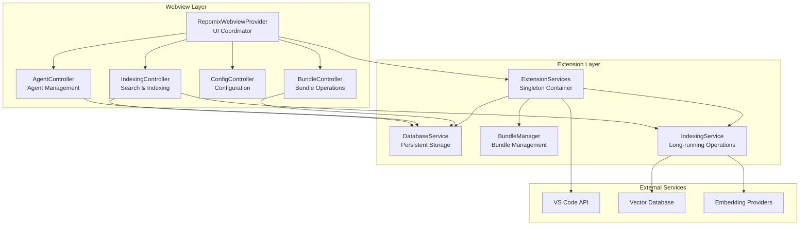
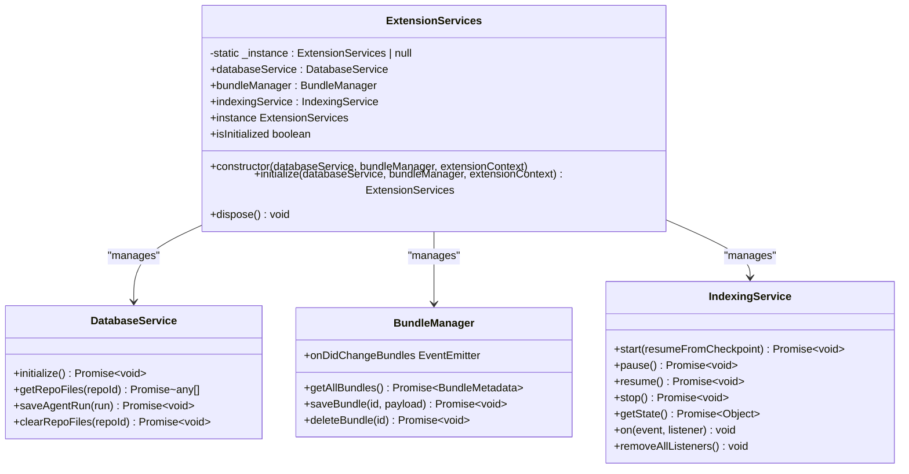
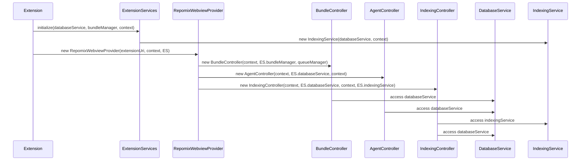
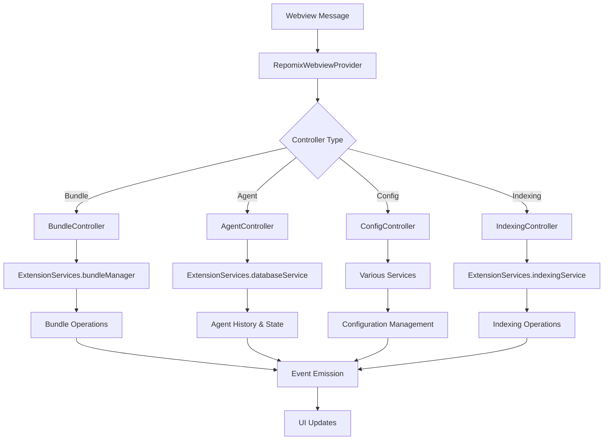
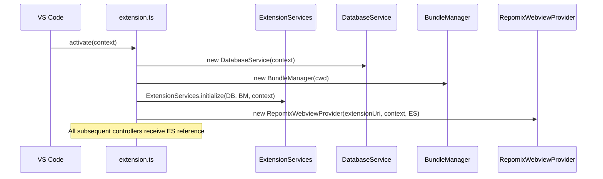
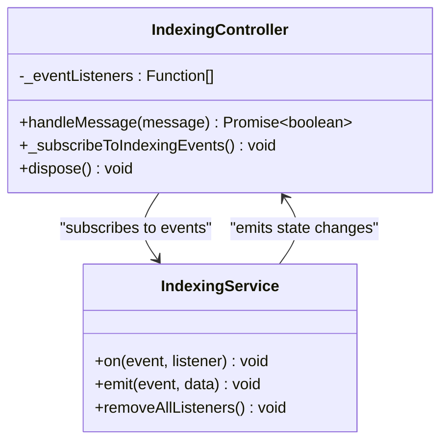
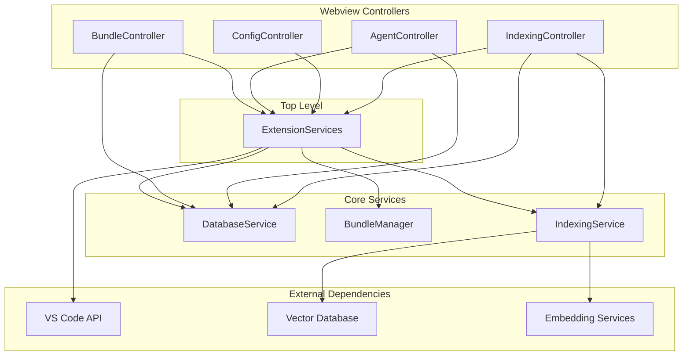

# Centralized Service Locator

<cite>
**Referenced Files in This Document**
- [extension.ts](file://src/extension.ts)
- [ExtensionServices.ts](file://src/core/services/ExtensionServices.ts)
- [IndexingService.ts](file://src/core/services/IndexingService.ts)
- [RepomixWebviewProvider.ts](file://src/webview/RepomixWebviewProvider.ts)
- [BundleController.ts](file://src/webview/controllers/BundleController.ts)
- [AgentController.ts](file://src/webview/controllers/AgentController.ts)
- [ConfigController.ts](file://src/webview/controllers/ConfigController.ts)
- [IndexingController.ts](file://src/webview/controllers/IndexingController.ts)
- [BundleManager.ts](file://src/core/bundles/bundleManager.ts)
- [databaseService.ts](file://src/core/storage/databaseService.ts)
</cite>

## Table of Contents
1. [Introduction](#introduction)
2. [Project Structure](#project-structure)
3. [Core Components](#core-components)
4. [Architecture Overview](#architecture-overview)
5. [Detailed Component Analysis](#detailed-component-analysis)
6. [Dependency Analysis](#dependency-analysis)
7. [Performance Considerations](#performance-considerations)
8. [Troubleshooting Guide](#troubleshooting-guide)
9. [Conclusion](#conclusion)

## Introduction

The Repomix Runner Plus extension implements a centralized Service Locator pattern to manage and coordinate multiple services across the extension lifecycle. This pattern ensures that long-running operations, persistent state, and cross-component communication are handled efficiently while maintaining separation of concerns between the extension's core services and the webview UI components.

The Service Locator centralizes service instantiation, lifecycle management, and inter-service communication, allowing controllers and UI components to access required services without tight coupling to their internal implementations.

## Project Structure

The extension follows a modular architecture with clear separation between extension-level services and webview controllers:

**Diagram sources**
- [extension.ts](file://src/extension.ts#L44-L105)
- [ExtensionServices.ts](file://src/core/services/ExtensionServices.ts#L17-L32)

**Section sources**
- [extension.ts](file://src/extension.ts#L1-L836)
- [ExtensionServices.ts](file://src/core/services/ExtensionServices.ts#L1-L86)

## Core Components

### ExtensionServices - Central Service Container

The ExtensionServices class serves as the primary Service Locator, implementing a singleton pattern that manages all extension-level services:

**Diagram sources**
- [ExtensionServices.ts](file://src/core/services/ExtensionServices.ts#L17-L85)

### Service Lifecycle Management

The service lifecycle follows a strict initialization pattern:

1. **Activation Phase**: Services are instantiated in the extension's activate() function
2. **Singleton Pattern**: ExtensionServices ensures single instance throughout extension lifetime
3. **Controller Registration**: Webview controllers receive references to services via the locator
4. **Event-Driven Communication**: Services communicate through EventEmitter patterns
5. **Graceful Shutdown**: Proper disposal of resources during deactivation

**Section sources**
- [ExtensionServices.ts](file://src/core/services/ExtensionServices.ts#L34-L85)
- [extension.ts](file://src/extension.ts#L44-L105)

## Architecture Overview

The Service Locator architecture enables loose coupling between components while maintaining centralized control:

**Diagram sources**
- [extension.ts](file://src/extension.ts#L99-L105)
- [RepomixWebviewProvider.ts](file://src/webview/RepomixWebviewProvider.ts#L114-L125)

### Cross-Component Communication Flow

The Service Locator enables seamless communication between controllers and services:

**Diagram sources**
- [RepomixWebviewProvider.ts](file://src/webview/RepomixWebviewProvider.ts#L225-L241)
- [BundleController.ts](file://src/webview/controllers/BundleController.ts#L38-L60)

**Section sources**
- [RepomixWebviewProvider.ts](file://src/webview/RepomixWebviewProvider.ts#L100-L126)
- [BundleController.ts](file://src/webview/controllers/BundleController.ts#L17-L60)

## Detailed Component Analysis

### Extension Activation and Service Initialization

The extension activation process demonstrates proper Service Locator implementation:

**Diagram sources**
- [extension.ts](file://src/extension.ts#L44-L105)

### Service Coordination Patterns

The Service Locator enables several coordination patterns:

#### Event-Driven Architecture
Controllers subscribe to service events rather than polling for state changes:

**Diagram sources**
- [IndexingController.ts](file://src/webview/controllers/IndexingController.ts#L49-L109)

#### Lazy Service Access
Services are accessed only when needed, reducing memory footprint:

| Service | Access Pattern | Benefits |
|---------|---------------|----------|
| DatabaseService | Lazy initialization | Reduces startup time |
| Embedding Providers | Dynamic loading | Supports multiple providers |
| Vector Database Adapters | On-demand resolution | Flexible backend switching |

**Section sources**
- [extension.ts](file://src/extension.ts#L54-L91)
- [IndexingController.ts](file://src/webview/controllers/IndexingController.ts#L292-L430)

### Controller Implementation Patterns

Each controller demonstrates Service Locator usage patterns:

#### BundleController
- Accesses BundleManager for bundle operations
- Uses DatabaseService for state queries
- Manages file system watchers for output files

#### AgentController  
- Utilizes DatabaseService for agent run history
- Integrates with ExtensionContext for secrets management
- Coordinates with external AI services

#### ConfigController
- Manages multiple service configurations
- Handles provider switching with validation
- Implements compatibility checks

**Section sources**
- [BundleController.ts](file://src/webview/controllers/BundleController.ts#L17-L36)
- [AgentController.ts](file://src/webview/controllers/AgentController.ts#L11-L18)
- [ConfigController.ts](file://src/webview/controllers/ConfigController.ts#L15-L25)

## Dependency Analysis

The Service Locator creates a well-defined dependency hierarchy:

**Diagram sources**
- [ExtensionServices.ts](file://src/core/services/ExtensionServices.ts#L20-L31)
- [RepomixWebviewProvider.ts](file://src/webview/RepomixWebviewProvider.ts#L114-L125)

### Dependency Injection Benefits

The Service Locator pattern provides several advantages:

1. **Loose Coupling**: Controllers don't depend on specific service implementations
2. **Testability**: Services can be easily mocked for testing
3. **Flexibility**: Easy to swap implementations or add new services
4. **Lifecycle Management**: Centralized resource management and cleanup
5. **Event-Driven Communication**: Decoupled inter-service communication

**Section sources**
- [ExtensionServices.ts](file://src/core/services/ExtensionServices.ts#L6-L16)
- [RepomixWebviewProvider.ts](file://src/webview/RepomixWebviewProvider.ts#L114-L125)

## Performance Considerations

### Memory Management
- Services are created once and reused throughout extension lifetime
- Proper disposal in deactivate() prevents memory leaks
- Event listeners are properly cleaned up

### Concurrency Handling
- IndexingService uses AbortController for cancellation
- Database operations are properly awaited
- File system watchers are managed efficiently

### Resource Optimization
- Lazy loading of embedding services reduces startup overhead
- Conditional initialization based on configuration
- Efficient event subscription/unsubscription

## Troubleshooting Guide

### Common Issues and Solutions

#### Service Not Initialized Error
**Symptoms**: Error indicating ExtensionServices not initialized
**Solution**: Ensure ExtensionServices.initialize() is called during activation
**Prevention**: Check that activate() calls the initialization method

#### Service Lifecycle Issues
**Symptoms**: Services not properly disposed or memory leaks
**Solution**: Verify dispose() methods are called in deactivate()
**Prevention**: Implement proper cleanup in all services

#### Event Listener Leaks
**Symptoms**: Memory growth over time
**Solution**: Ensure all event listeners are removed in dispose()
**Prevention**: Track all subscriptions and clean them up

**Section sources**
- [ExtensionServices.ts](file://src/core/services/ExtensionServices.ts#L80-L85)
- [IndexingController.ts](file://src/webview/controllers/IndexingController.ts#L114-L117)

## Conclusion

The Repomix Runner Plus extension successfully implements a centralized Service Locator pattern that provides:

- **Centralized Service Management**: Single point of control for all extension services
- **Loose Coupling**: Controllers access services through well-defined interfaces
- **Event-Driven Architecture**: Decoupled communication between components
- **Flexible Service Replacement**: Easy to swap implementations or add new services
- **Proper Lifecycle Management**: Centralized resource allocation and cleanup

This architecture enables the extension to handle complex operations like repository indexing, AI-powered search, and bundle management while maintaining clean separation of concerns and efficient resource utilization. The Service Locator pattern proves particularly valuable for VS Code extensions where long-running operations and persistent state management are essential requirements.

The implementation demonstrates best practices for service-oriented architecture in the VS Code extension ecosystem, providing a solid foundation for future enhancements and maintenance.