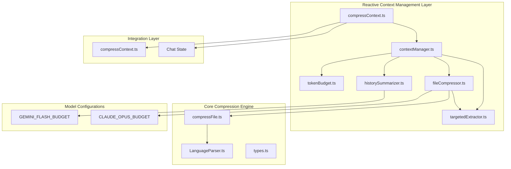
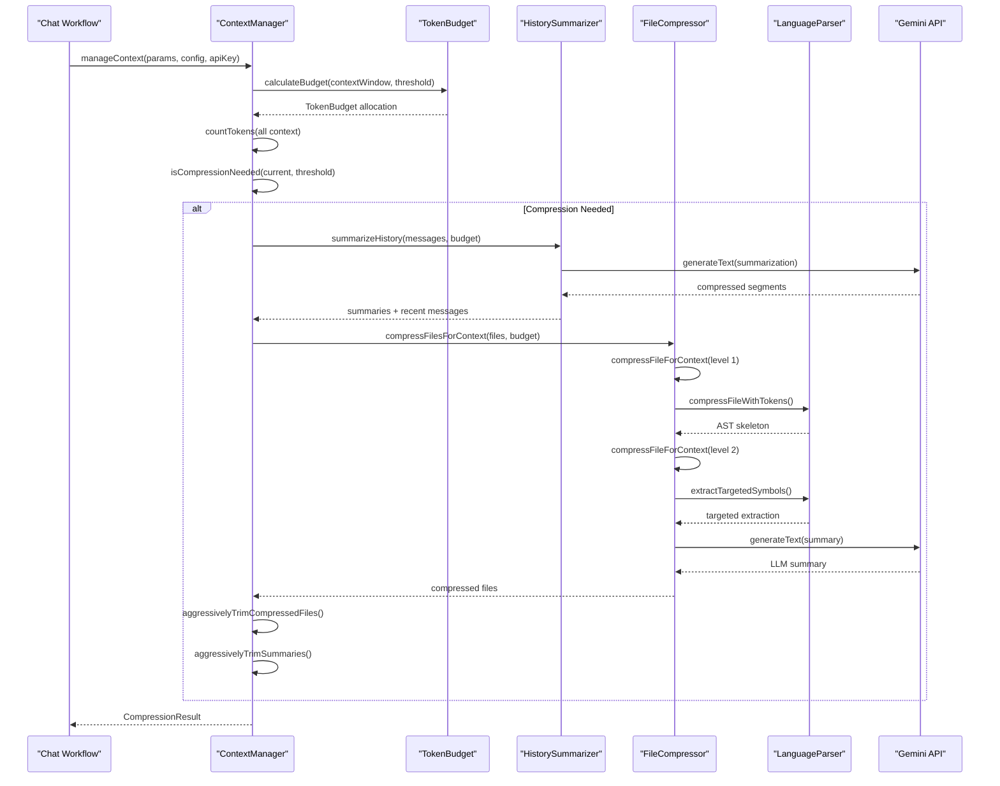
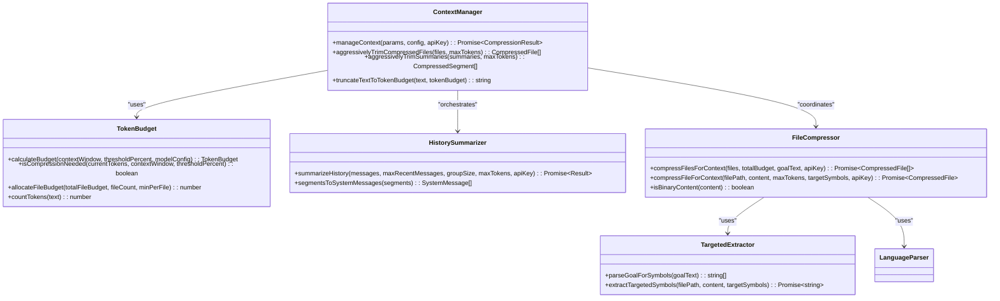
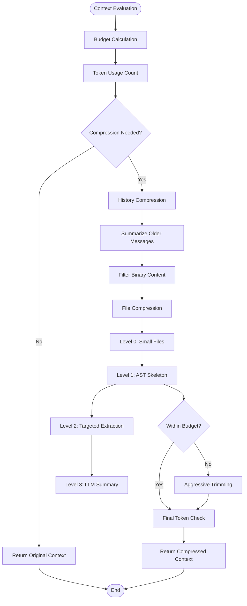
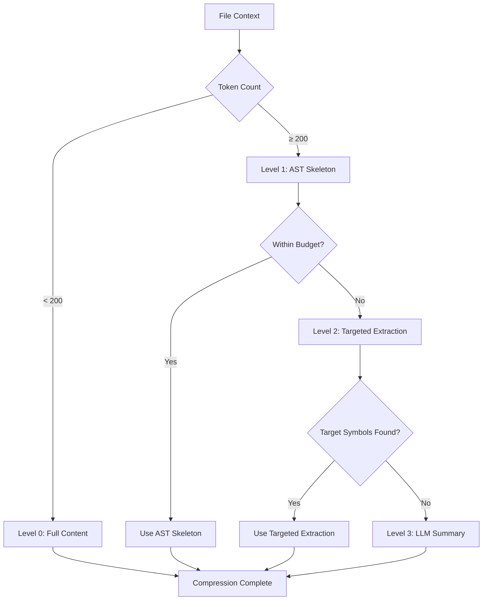

# Compression Engine Architecture

<cite>
**Referenced Files in This Document**
- [contextManager.ts](file://src/chat/compression/contextManager.ts)
- [tokenBudget.ts](file://src/chat/compression/tokenBudget.ts)
- [historySummarizer.ts](file://src/chat/compression/historySummarizer.ts)
- [fileCompressor.ts](file://src/chat/compression/fileCompressor.ts)
- [targetedExtractor.ts](file://src/chat/compression/targetedExtractor.ts)
- [types.ts](file://src/chat/compression/types.ts)
- [compressContext.ts](file://src/chat/nodes/compressContext.ts)
- [compressFile.ts](file://src/core/compression/compressFile.ts)
- [LanguageParser.ts](file://src/core/compression/LanguageParser.ts)
- [index.ts](file://src/core/compression/index.ts)
- [003_context_compression_strategy.md](file://PRDs/003_context_compression_strategy.md)
</cite>

## Update Summary
**Changes Made**
- Added comprehensive documentation for the new reactive context compression system
- Integrated ContextManager, TokenBudget, and intelligent compression strategies
- Documented conversation history summarization and targeted file extraction
- Added binary content detection for efficient token budget management
- Updated architecture diagrams to reflect the new multi-layer compression pipeline

## Table of Contents
1. [Introduction](#introduction)
2. [Project Structure](#project-structure)
3. [Core Components](#core-components)
4. [Architecture Overview](#architecture-overview)
5. [Detailed Component Analysis](#detailed-component-analysis)
6. [Reactive Context Management](#reactive-context-management)
7. [Multi-Level Compression Strategies](#multi-level-compression-strategies)
8. [Dependency Analysis](#dependency-analysis)
9. [Performance Considerations](#performance-considerations)
10. [Troubleshooting Guide](#troubleshooting-guide)
11. [Conclusion](#conclusion)

## Introduction
The Compression Engine has evolved into a sophisticated reactive context compression system that intelligently manages token usage in AI-assisted development workflows. The new system introduces a ContextManager that monitors conversation context against configurable thresholds and applies multi-level compression strategies to maintain optimal performance while preserving essential information.

The system combines advanced token budget management with intelligent compression strategies including conversation history summarization, targeted file extraction, and binary content detection. This reactive approach ensures that long-running conversations and complex code analysis sessions remain functional without manual intervention.

**Updated** The system now includes conversation history summarization, targeted file extraction, and binary content detection for efficient token budget management, representing a significant evolution from the original static compression approach.

## Project Structure
The compression engine now operates as a layered system with reactive context management at the core:



**Diagram sources**
- [contextManager.ts](file://src/chat/compression/contextManager.ts#L1-L303)
- [tokenBudget.ts](file://src/chat/compression/tokenBudget.ts#L1-L209)
- [fileCompressor.ts](file://src/chat/compression/fileCompressor.ts#L1-L212)
- [compressContext.ts](file://src/chat/nodes/compressContext.ts#L1-L125)

**Section sources**
- [contextManager.ts](file://src/chat/compression/contextManager.ts#L1-L303)
- [tokenBudget.ts](file://src/chat/compression/tokenBudget.ts#L1-L209)
- [compressContext.ts](file://src/chat/nodes/compressContext.ts#L1-L125)

## Core Components

### ContextManager - Reactive Orchestrator
The ContextManager serves as the central coordinator for all compression operations, implementing a reactive monitoring system that triggers compression when token usage exceeds configurable thresholds.

Key responsibilities include:
- **Token Usage Monitoring**: Real-time tracking of conversation history, file context, and system prompt token counts
- **Compression Decision Logic**: Intelligent determination of when compression is needed based on model context windows and user-configurable thresholds
- **Multi-Level Compression Coordination**: Orchestration of history summarization and file compression strategies
- **Aggressive Trimming**: Final safety net that reduces content to meet budget constraints when needed

### TokenBudget System
Advanced token budget calculation and allocation system with model-specific configurations:

- **Model-Aware Budgeting**: Predefined configurations for Gemini 2.5 Flash and Claude Opus 4 models
- **Dynamic Allocation**: Percentage-based distribution of remaining budget across conversation summaries, recent messages, and file context
- **Threshold-Based Triggering**: Configurable percentage thresholds that determine when compression activates
- **Safety Reserves**: Fixed allocations for system prompts and output buffers to prevent overflow

### HistorySummarizer - Conversation Intelligence
Intelligent conversation history compression using Gemini 2.5 Flash:

- **Selective Preservation**: Keeps recent messages in full while summarizing older conversation segments
- **Structured Summaries**: Preserves key decisions, file paths, code changes, and user preferences
- **Batch Processing**: Groups messages into configurable sizes for efficient summarization
- **Fallback Mechanisms**: Heuristic-based summarization when LLM calls fail

### FileCompressor - Multi-Level Content Management
Progressive file compression system with four distinct levels:

- **Level 0**: Full content for small files (< 200 tokens)
- **Level 1**: AST skeleton extraction for supported languages
- **Level 2**: Targeted extraction of specific symbols mentioned in goals
- **Level 3**: LLM-generated summaries for unsupported languages or oversized content

**Section sources**
- [contextManager.ts](file://src/chat/compression/contextManager.ts#L138-L279)
- [tokenBudget.ts](file://src/chat/compression/tokenBudget.ts#L91-L163)
- [historySummarizer.ts](file://src/chat/compression/historySummarizer.ts#L36-L84)
- [fileCompressor.ts](file://src/chat/compression/fileCompressor.ts#L32-L122)

## Architecture Overview



**Diagram sources**
- [contextManager.ts](file://src/chat/compression/contextManager.ts#L138-L279)
- [tokenBudget.ts](file://src/chat/compression/tokenBudget.ts#L91-L163)
- [historySummarizer.ts](file://src/chat/compression/historySummarizer.ts#L36-L84)
- [fileCompressor.ts](file://src/chat/compression/fileCompressor.ts#L177-L197)

The architecture demonstrates a sophisticated reactive compression system that intelligently manages token usage while preserving conversation context and code information. The system operates as a closed-loop feedback mechanism that continuously monitors and adjusts compression strategies based on real-time usage patterns.

## Detailed Component Analysis

### ContextManager Implementation



**Diagram sources**
- [contextManager.ts](file://src/chat/compression/contextManager.ts#L138-L279)
- [tokenBudget.ts](file://src/chat/compression/tokenBudget.ts#L91-L163)
- [fileCompressor.ts](file://src/chat/compression/fileCompressor.ts#L177-L197)
- [targetedExtractor.ts](file://src/chat/compression/targetedExtractor.ts#L99-L155)

### Compression Process Flow



**Diagram sources**
- [contextManager.ts](file://src/chat/compression/contextManager.ts#L138-L279)
- [fileCompressor.ts](file://src/chat/compression/fileCompressor.ts#L32-L122)

### Token Budget Allocation Strategy

The system implements sophisticated token budget allocation with model-specific configurations:

```mermaid
graph LR
subgraph "Model Context Window"
WINDOW[200K tokens (Opus)]
END
subgraph "Fixed Allocations"
SYSTEM[2K system prompt]
OUTPUT[16K output buffer]
ARCH[1K repo architecture]
END
subgraph "Remaining Budget"
REMAINING[181K remaining]
END
subgraph "Percentage Allocations"
HISTORY[10% = 18.1K for summaries]
RECENT[20% = 36.2K for recent messages]
FILES[65% = 117.65K for file context]
END
WINDOW --> SYSTEM
WINDOW --> OUTPUT
WINDOW --> ARCH
WINDOW --> REMAINING
REMAINING --> HISTORY
REMAINING --> RECENT
REMAINING --> FILES
```

**Diagram sources**
- [tokenBudget.ts](file://src/chat/compression/tokenBudget.ts#L34-L81)

**Section sources**
- [contextManager.ts](file://src/chat/compression/contextManager.ts#L1-L303)
- [tokenBudget.ts](file://src/chat/compression/tokenBudget.ts#L1-L209)
- [historySummarizer.ts](file://src/chat/compression/historySummarizer.ts#L1-L192)
- [fileCompressor.ts](file://src/chat/compression/fileCompressor.ts#L1-L212)

## Reactive Context Management

### Threshold-Based Compression Triggering
The system implements intelligent compression triggering based on configurable thresholds:

- **Configurable Threshold**: Users can set compression activation at 50-95% of model context window
- **Real-Time Monitoring**: Continuous token usage tracking across conversation history, file context, and system prompts
- **Adaptive Response**: Compression applied only when necessary to minimize computational overhead

### Multi-Layered Compression Coordination
The ContextManager coordinates multiple compression layers in a strategic sequence:

1. **History Compression**: Summarizes older conversation segments while preserving recent context
2. **File Compression**: Applies progressive compression levels to context files
3. **Safety Net**: Aggressive trimming ensures final compliance with budget constraints

### Binary Content Detection
Intelligent filtering of binary content prevents unnecessary processing:

- **Null Byte Detection**: Immediate identification of binary files
- **Non-Printable Character Analysis**: Statistical detection of binary content
- **Performance Optimization**: Excludes binary files from compression pipeline

**Section sources**
- [contextManager.ts](file://src/chat/compression/contextManager.ts#L165-L182)
- [contextManager.ts](file://src/chat/compression/contextManager.ts#L219-L234)
- [fileCompressor.ts](file://src/chat/compression/fileCompressor.ts#L202-L211)

## Multi-Level Compression Strategies

### Conversation History Summarization
Advanced summarization preserves critical context while dramatically reducing token usage:

- **Selective Preservation**: Recent messages (default 10) maintained in full
- **Structured Summaries**: Gemini 2.5 Flash generates comprehensive summaries
- **Key Information Extraction**: Preserves decisions, file paths, code changes, and user preferences
- **Fallback Mechanisms**: Heuristic-based summarization when LLM calls fail

### Targeted File Extraction
Intelligent symbol extraction focuses on relevant code sections:

- **Goal-Based Extraction**: Identifies symbols mentioned in user goals
- **Language-Aware Parsing**: Leverages Tree-Sitter for precise symbol location
- **Import Preservation**: Maintains necessary import statements
- **Cross-Language Support**: Extends to TypeScript, JavaScript, Python, Rust, C#, and Dart

### Progressive Compression Levels
Four-tier compression system with intelligent fallback:



**Diagram sources**
- [fileCompressor.ts](file://src/chat/compression/fileCompressor.ts#L32-L122)

**Section sources**
- [historySummarizer.ts](file://src/chat/compression/historySummarizer.ts#L14-L24)
- [targetedExtractor.ts](file://src/chat/compression/targetedExtractor.ts#L49-L67)
- [fileCompressor.ts](file://src/chat/compression/fileCompressor.ts#L53-L91)

## Dependency Analysis

The compression system exhibits sophisticated interdependencies with clear separation of concerns:

```mermaid
graph TB
subgraph "External Dependencies"
TOKEN[gpt-tokenizer]
GEMINI[Gemini API]
TREE_SITTER[Tree-Sitter]
END
subgraph "Context Management Layer"
CM[ContextManager]
TB[TokenBudget]
HS[HistorySummarizer]
FC[FileCompressor]
TE[TargetedExtractor]
END
subgraph "Core Compression Engine"
CF[compressFile]
LP[LanguageParser]
TYPES[Types & Interfaces]
END
subgraph "Integration Layer"
CC[compressContext Node]
STATE[Chat State]
END
TOKEN --> TB
TOKEN --> HS
TOKEN --> FC
GEMINI --> HS
GEMINI --> FC
TREE_SITTER --> LP
TREE_SITTER --> TE
LP --> CF
TE --> LP
CM --> TB
CM --> HS
CM --> FC
CC --> CM
CC --> STATE
```

**Diagram sources**
- [contextManager.ts](file://src/chat/compression/contextManager.ts#L9-L20)
- [tokenBudget.ts](file://src/chat/compression/tokenBudget.ts#L6-L7)
- [fileCompressor.ts](file://src/chat/compression/fileCompressor.ts#L12-L17)

The dependency structure shows a clean layered architecture where the ContextManager acts as the central orchestrator, coordinating between token budget management, content compression, and integration with the broader chat workflow.

**Section sources**
- [types.ts](file://src/chat/compression/types.ts#L1-L168)
- [contextManager.ts](file://src/chat/compression/contextManager.ts#L1-L303)

## Performance Considerations

### Reactive Compression Efficiency
The new system optimizes performance through intelligent compression triggering:

- **Lazy Evaluation**: Compression only applied when token usage exceeds threshold
- **Parallel Processing**: Asynchronous operations for LLM calls and file compression
- **Caching Strategies**: Results cached to avoid redundant computations
- **Early Termination**: Quick exit when context remains within budget

### Memory Management Optimizations
Advanced memory management for large-scale operations:

- **Streaming Processing**: Large files processed in chunks to prevent memory overflow
- **Incremental Summarization**: Conversation segments processed individually
- **Efficient Data Structures**: Optimized arrays and maps for compression tracking
- **Garbage Collection**: Automatic cleanup of temporary compression artifacts

### Model-Specific Optimizations
Tailored configurations for different AI models:

- **Context Window Awareness**: Budget calculations adapt to model capabilities
- **Output Buffer Management**: Reserve tokens for model responses
- **Processing Priority**: Recent messages prioritized for preservation
- **Fallback Strategies**: Graceful degradation when model limitations reached

### Compression Strategy Optimization
Intelligent selection of compression methods:

- **Language Detection**: Automatic recognition of supported compression languages
- **Content Analysis**: Binary content detection prevents wasted processing
- **Symbol Extraction**: Targeted extraction maximizes information retention
- **Budget Distribution**: Dynamic allocation based on content characteristics

**Section sources**
- [contextManager.ts](file://src/chat/compression/contextManager.ts#L22-L23)
- [tokenBudget.ts](file://src/chat/compression/tokenBudget.ts#L133-L146)
- [fileCompressor.ts](file://src/chat/compression/fileCompressor.ts#L177-L197)

## Troubleshooting Guide

### Common Issues and Solutions

**Compression Not Triggering**
- Verify context threshold percentage is set appropriately (50-95%)
- Check model context window configuration matches actual model capabilities
- Ensure token counting functions are working correctly
- Monitor log output for compression decision rationale

**History Summarization Failures**
- Verify Gemini API key is configured and valid
- Check network connectivity for LLM calls
- Review summarization prompt quality and length
- Implement fallback mechanisms for summarization failures

**File Compression Performance Issues**
- Monitor token budget allocation for file context
- Verify Tree-Sitter parser initialization success
- Check language support for target files
- Review compression level selection logic

**Memory Usage Problems**
- Implement file size limits for compression
- Monitor compression result sizes
- Check for memory leaks in compression pipelines
- Optimize chunk sizes for large files

### Debugging Strategies
Enhanced debugging capabilities for the new system:

- **Compression Decision Logging**: Track threshold calculations and trigger points
- **Token Budget Tracking**: Monitor allocation and utilization across categories
- **Compression Level Analysis**: Log compression effectiveness by level
- **Performance Metrics**: Track processing times and resource usage
- **Error Handling**: Comprehensive error logging with recovery attempts

**Section sources**
- [contextManager.ts](file://src/chat/compression/contextManager.ts#L160-L182)
- [historySummarizer.ts](file://src/chat/compression/historySummarizer.ts#L72-L78)
- [fileCompressor.ts](file://src/chat/compression/fileCompressor.ts#L86-L110)

## Conclusion

The Compression Engine has evolved into a sophisticated reactive context management system that represents a significant advancement in AI-assisted development tooling. The new ContextManager, TokenBudget, and multi-level compression strategies provide intelligent, automated context management that maintains system performance while preserving essential information.

Key achievements include:
- **Reactive Compression**: Intelligent triggering based on real-time token usage monitoring
- **Multi-Layered Strategy**: Progressive compression levels with sophisticated fallback mechanisms
- **Model-Aware Design**: Configurations optimized for different AI models and capabilities
- **Performance Optimization**: Efficient processing with minimal computational overhead
- **Extensible Architecture**: Clean separation of concerns enabling future enhancements

The system successfully addresses the challenges of long-running conversations and complex code analysis by providing automatic context management that scales with usage patterns. The integration with existing compression infrastructure ensures backward compatibility while adding powerful new capabilities for modern AI-assisted development workflows.

Future enhancements could include adaptive threshold tuning, machine learning-based compression strategy selection, and enhanced binary content detection for improved performance in diverse codebases.