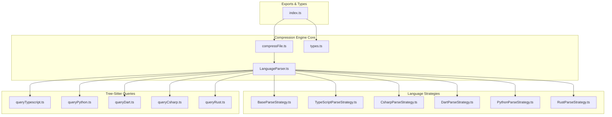
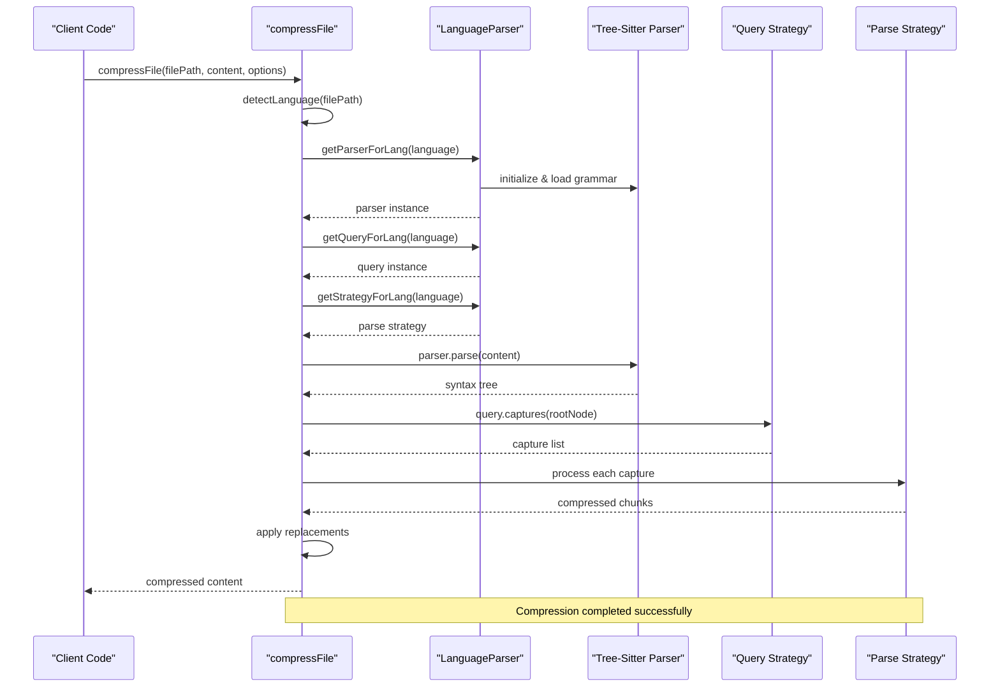
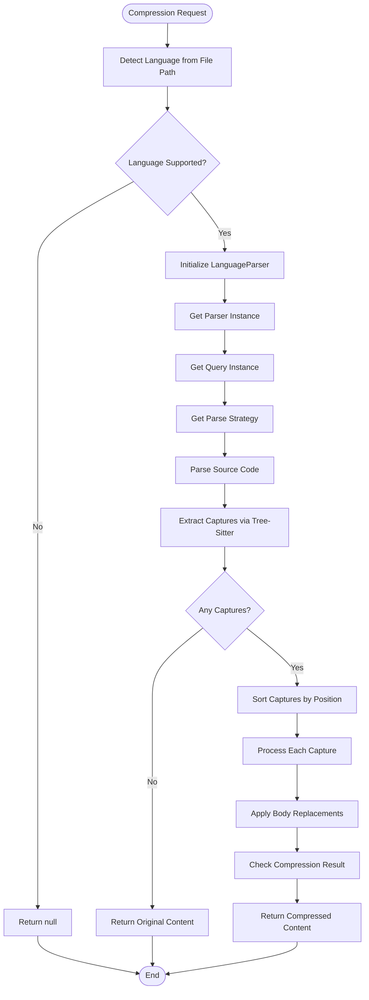
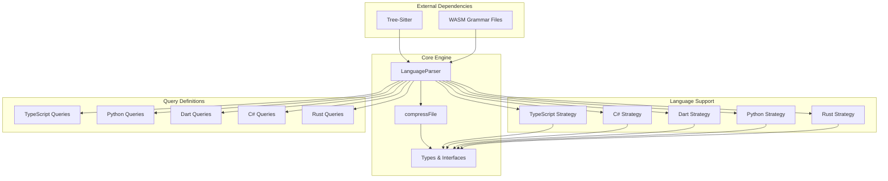

# Compression Engine Architecture

<cite>
**Referenced Files in This Document**
- [index.ts](file://src/core/compression/index.ts)
- [compressFile.ts](file://src/core/compression/compressFile.ts)
- [LanguageParser.ts](file://src/core/compression/LanguageParser.ts)
- [types.ts](file://src/core/compression/types.ts)
- [BaseParseStrategy.ts](file://src/core/compression/strategies/BaseParseStrategy.ts)
- [TypeScriptParseStrategy.ts](file://src/core/compression/strategies/TypeScriptParseStrategy.ts)
- [CsharpParseStrategy.ts](file://src/core/compression/strategies/CsharpParseStrategy.ts)
- [DartParseStrategy.ts](file://src/core/compression/strategies/DartParseStrategy.ts)
- [PythonParseStrategy.ts](file://src/core/compression/strategies/PythonParseStrategy.ts)
- [RustParseStrategy.ts](file://src/core/compression/strategies/RustParseStrategy.ts)
- [queryTypescript.ts](file://src/core/compression/queries/queryTypescript.ts)
- [queryPython.ts](file://src/core/compression/queries/queryPython.ts)
- [queryDart.ts](file://src/core/compression/queries/queryDart.ts)
- [queryCsharp.ts](file://src/core/compression/queries/queryCsharp.ts)
- [queryRust.ts](file://src/core/compression/queries/queryRust.ts)
</cite>

## Table of Contents
1. [Introduction](#introduction)
2. [Project Structure](#project-structure)
3. [Core Components](#core-components)
4. [Architecture Overview](#architecture-overview)
5. [Detailed Component Analysis](#detailed-component-analysis)
6. [Dependency Analysis](#dependency-analysis)
7. [Performance Considerations](#performance-considerations)
8. [Troubleshooting Guide](#troubleshooting-guide)
9. [Conclusion](#conclusion)

## Introduction
The Compression Engine is a sophisticated code compression system built on Tree-Sitter syntax parsing technology. It intelligently analyzes source code files and generates compressed representations by extracting structural elements while preserving essential semantic meaning. The engine supports multiple programming languages including TypeScript, JavaScript, Dart, Python, C#, and Rust, each with specialized parsing strategies and language-specific optimizations.

The system operates by leveraging Tree-Sitter's high-performance parsing capabilities combined with custom capture queries to identify code constructs such as functions, classes, imports, exports, and other structural elements. It then applies language-specific strategies to compress these constructs into concise representations suitable for AI processing and analysis.

## Project Structure
The compression engine follows a modular architecture organized around language support, parsing strategies, and Tree-Sitter integration:



**Diagram sources**
- [compressFile.ts](file://src/core/compression/compressFile.ts#L1-L85)
- [LanguageParser.ts](file://src/core/compression/LanguageParser.ts#L1-L218)
- [BaseParseStrategy.ts](file://src/core/compression/strategies/BaseParseStrategy.ts#L1-L75)

**Section sources**
- [index.ts](file://src/core/compression/index.ts#L1-L3)
- [compressFile.ts](file://src/core/compression/compressFile.ts#L1-L85)
- [LanguageParser.ts](file://src/core/compression/LanguageParser.ts#L1-L218)

## Core Components

### LanguageParser Service
The LanguageParser serves as the central coordinator for all compression operations. It implements a singleton pattern with lazy initialization and maintains caches for parsers, languages, and queries to optimize performance across multiple compression operations.

Key responsibilities include:
- **Language Detection**: Automatic file extension-based language identification
- **Tree-Sitter Initialization**: Dynamic loading and initialization of Tree-Sitter parsers
- **Resource Management**: Caching mechanisms for parsers, languages, and queries
- **WASM Resolution**: Intelligent path resolution for Tree-Sitter grammar files

### Compression Pipeline
The compression process follows a multi-stage pipeline:

1. **Language Detection**: File extension analysis determines appropriate parser
2. **Tree-Sitter Parsing**: Syntax tree generation using language-specific grammars
3. **Capture Extraction**: Query-based identification of code constructs
4. **Strategy Application**: Language-specific processing of identified constructs
5. **Body Replacement**: Generation of compressed representations

### Strategy Pattern Implementation
Each supported language implements a dedicated parsing strategy extending the BaseParseStrategy. This design enables:
- **Consistent Interface**: Unified API across all language implementations
- **Specialized Logic**: Language-specific compression algorithms
- **Extensibility**: Easy addition of new language support

**Section sources**
- [LanguageParser.ts](file://src/core/compression/LanguageParser.ts#L26-L218)
- [compressFile.ts](file://src/core/compression/compressFile.ts#L25-L85)
- [BaseParseStrategy.ts](file://src/core/compression/strategies/BaseParseStrategy.ts#L11-L75)

## Architecture Overview



**Diagram sources**
- [compressFile.ts](file://src/core/compression/compressFile.ts#L25-L85)
- [LanguageParser.ts](file://src/core/compression/LanguageParser.ts#L95-L173)

The architecture demonstrates a clean separation of concerns with clear boundaries between parsing, querying, and strategy application phases. The use of caching and lazy initialization ensures optimal performance for repeated compression operations.

## Detailed Component Analysis

### LanguageParser Implementation

```mermaid
classDiagram
class LanguageParser {
-instance : LanguageParser
-initialized : boolean
-parserClass : TreeSitterModule
-wasmDirectory : string
-parserCache : Map~string, ParserInstance~
-languageCache : Map~string, LanguageInstance~
-queryCache : Map~string, QueryInstance~
-configs : Record~string, LanguageConfig~
+getInstance() : LanguageParser
+setWasmDirectory(wasmDirectory) : void
+init() : Promise~void~
+getParserForLang(language) : Promise~ParserInstance|null~
+getQueryForLang(language) : Promise~QueryInstance|null~
+getStrategyForLang(language) : ParseStrategy|null
-normalizeLanguage(language) : string|null
-loadLanguage(language, wasmPath) : Promise~LanguageInstance|null~
-resolveWasmPath(wasmFile) : string|null
}
class BaseParseStrategy {
<<abstract>>
+parseCapture(capture, context, options) : ParsedChunk|null
+getBodyReplacement(capture, context, options) : BodyReplacement|null
#getNodeText(node, sourceCode) : string
#collapseWhitespace(text) : string
#findSignatureEnd(text) : number
#ensureTerminal(text) : string
#cleanFunctionSignature(text) : string
}
class TypeScriptParseStrategy {
+parseCapture(capture, context, options) : ParsedChunk|null
+getBodyReplacement(capture, context, options) : BodyReplacement|null
-findBodyRange(node, nodeText) : {start, end}|null
-extractNodeName(node) : string|null
-createClassSkeleton(text) : string
-parseExport(text, startIndex, endIndex) : ParsedChunk|null
}
class CsharpParseStrategy {
+parseCapture(capture, context, options) : ParsedChunk|null
+getBodyReplacement(capture, context, options) : BodyReplacement|null
-findBodyRange(node, nodeText) : {start, end}|null
-extractNodeName(node) : string|null
-createClassSkeleton(text) : string
}
class DartParseStrategy {
+parseCapture(capture, context, options) : ParsedChunk|null
+getBodyReplacement(capture, context, options) : BodyReplacement|null
-findBodyRange(node, nodeText) : {start, end}|null
-extractNodeName(node) : string|null
-createClassSkeleton(text) : string
}
class PythonParseStrategy {
+parseCapture(capture, context, options) : ParsedChunk|null
+getBodyReplacement(capture, context, options) : BodyReplacement|null
-findBlockNode(node) : SyntaxNodeLike|null
-resolveDecoratedType(node) : CaptureType|null
-extractNodeName(node) : string|null
-extractSignature(node, sourceCode) : string
-formatSignature(signature) : string
}
class RustParseStrategy {
+parseCapture(capture, context, options) : ParsedChunk|null
+getBodyReplacement(capture, context, options) : BodyReplacement|null
-findBodyRange(node, nodeText) : {start, end}|null
-extractNodeName(node) : string|null
-createClassSkeleton(text) : string
}
LanguageParser --> BaseParseStrategy : "uses"
TypeScriptParseStrategy --|> BaseParseStrategy
CsharpParseStrategy --|> BaseParseStrategy
DartParseStrategy --|> BaseParseStrategy
PythonParseStrategy --|> BaseParseStrategy
RustParseStrategy --|> BaseParseStrategy
```

**Diagram sources**
- [LanguageParser.ts](file://src/core/compression/LanguageParser.ts#L26-L218)
- [BaseParseStrategy.ts](file://src/core/compression/strategies/BaseParseStrategy.ts#L11-L75)
- [TypeScriptParseStrategy.ts](file://src/core/compression/strategies/TypeScriptParseStrategy.ts#L12-L208)
- [CsharpParseStrategy.ts](file://src/core/compression/strategies/CsharpParseStrategy.ts#L12-L195)
- [DartParseStrategy.ts](file://src/core/compression/strategies/DartParseStrategy.ts#L12-L182)
- [PythonParseStrategy.ts](file://src/core/compression/strategies/PythonParseStrategy.ts#L12-L238)
- [RustParseStrategy.ts](file://src/core/compression/strategies/RustParseStrategy.ts#L12-L193)

### Compression Process Flow



**Diagram sources**
- [compressFile.ts](file://src/core/compression/compressFile.ts#L25-L85)

### Language-Specific Strategy Patterns

Each language strategy implements specialized compression logic tailored to that language's syntax and conventions:

#### TypeScript/JavaScript Strategy
Focuses on preserving function signatures, class skeletons, and import/export statements while compressing method bodies to `{ ... }`.

#### C# Strategy  
Handles properties differently from methods, treating property declarations as class-like structures with skeleton compression.

#### Dart Strategy
Supports function declarations, method declarations, constructor declarations, and getter/setter signatures with consistent skeleton compression.

#### Python Strategy
Complex handling for decorated functions and classes, extracting signature information while preserving decorators and async keywords.

#### Rust Strategy
Manages function items, struct items, trait items, and macro definitions with specialized skeleton creation for different construct types.

**Section sources**
- [LanguageParser.ts](file://src/core/compression/LanguageParser.ts#L37-L69)
- [TypeScriptParseStrategy.ts](file://src/core/compression/strategies/TypeScriptParseStrategy.ts#L12-L208)
- [PythonParseStrategy.ts](file://src/core/compression/strategies/PythonParseStrategy.ts#L12-L238)

## Dependency Analysis

The compression engine exhibits excellent modularity with clear dependency relationships:



**Diagram sources**
- [LanguageParser.ts](file://src/core/compression/LanguageParser.ts#L1-L218)
- [compressFile.ts](file://src/core/compression/compressFile.ts#L1-L85)

The dependency structure shows minimal coupling between components, with LanguageParser acting as the central hub that manages all external dependencies and internal component coordination. This design facilitates easy maintenance and future language additions.

**Section sources**
- [types.ts](file://src/core/compression/types.ts#L1-L66)
- [LanguageParser.ts](file://src/core/compression/LanguageParser.ts#L1-L218)

## Performance Considerations

### Caching Strategy
The engine implements a three-tier caching system:
- **Parser Cache**: Prevents reloading Tree-Sitter parsers for the same language
- **Language Cache**: Caches compiled grammar modules
- **Query Cache**: Stores parsed query instances

### Memory Management
- Lazy initialization ensures resources are loaded only when needed
- Automatic cleanup of unused parser instances
- Efficient string manipulation using slice operations instead of regex replacements where possible

### Parallel Processing
While individual compression operations are synchronous, the caching mechanism enables concurrent operations across different files without parser reload overhead.

### Optimization Opportunities
- Implement worker threads for CPU-intensive parsing operations
- Add batch processing capabilities for multiple files
- Consider incremental parsing for large files
- Implement compression result caching for identical content

## Troubleshooting Guide

### Common Issues and Solutions

**Language Not Supported**
- Verify file extension matches supported languages
- Check WASM grammar files are accessible in configured directories
- Ensure Tree-Sitter initialization completes successfully

**Compression Returns Null**
- Occurs when no captures are found or parser fails
- Verify Tree-Sitter grammar compatibility
- Check source code syntax validity

**Memory Issues with Large Files**
- Consider streaming approaches for very large files
- Implement file size limits
- Monitor cache growth for long-running processes

**Performance Degradation**
- Clear parser caches periodically
- Limit concurrent compression operations
- Optimize query patterns for specific use cases

### Debugging Strategies
- Enable verbose logging for Tree-Sitter operations
- Monitor cache hit rates
- Profile memory usage during compression operations
- Test with representative samples of target codebases

**Section sources**
- [compressFile.ts](file://src/core/compression/compressFile.ts#L80-L85)
- [LanguageParser.ts](file://src/core/compression/LanguageParser.ts#L113-L120)

## Conclusion

The Compression Engine represents a sophisticated approach to code compression that leverages modern parsing technology and language-specific strategies. Its modular architecture enables extensible support for new programming languages while maintaining high performance through intelligent caching and resource management.

The engine successfully balances compression effectiveness with preservation of semantic meaning, making it suitable for AI-assisted code analysis and documentation generation. The clean separation of concerns and well-defined interfaces facilitate maintenance and future enhancements.

Key strengths include:
- **Robust Language Support**: Comprehensive coverage of major programming languages
- **High Performance**: Optimized caching and lazy initialization
- **Extensible Design**: Clean architecture supporting new language additions
- **Reliable Operation**: Comprehensive error handling and fallback mechanisms

The system provides an excellent foundation for advanced code analysis tools and AI-assisted development environments, with clear pathways for performance optimization and feature expansion.