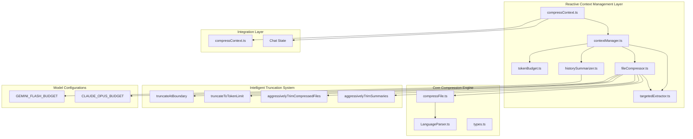
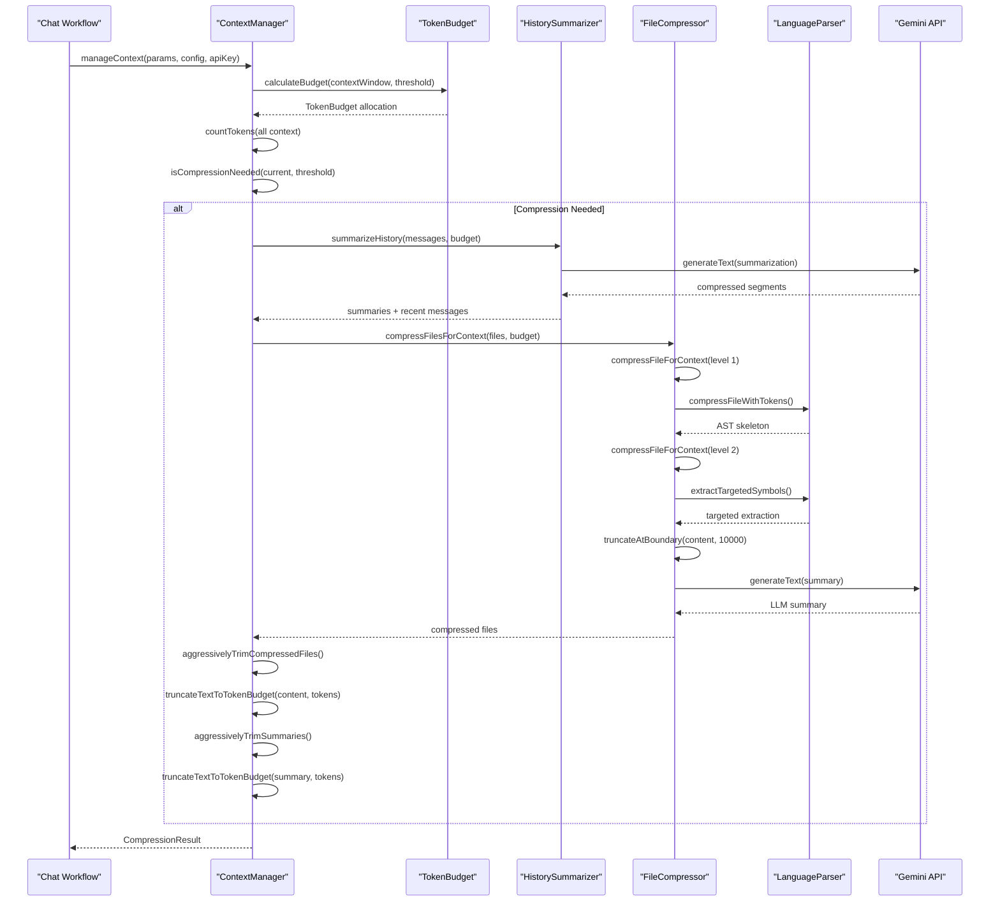
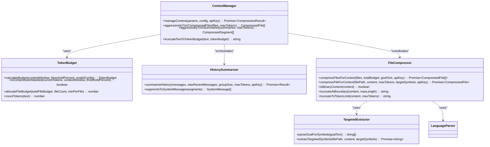
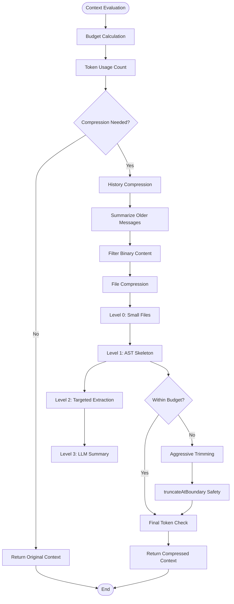
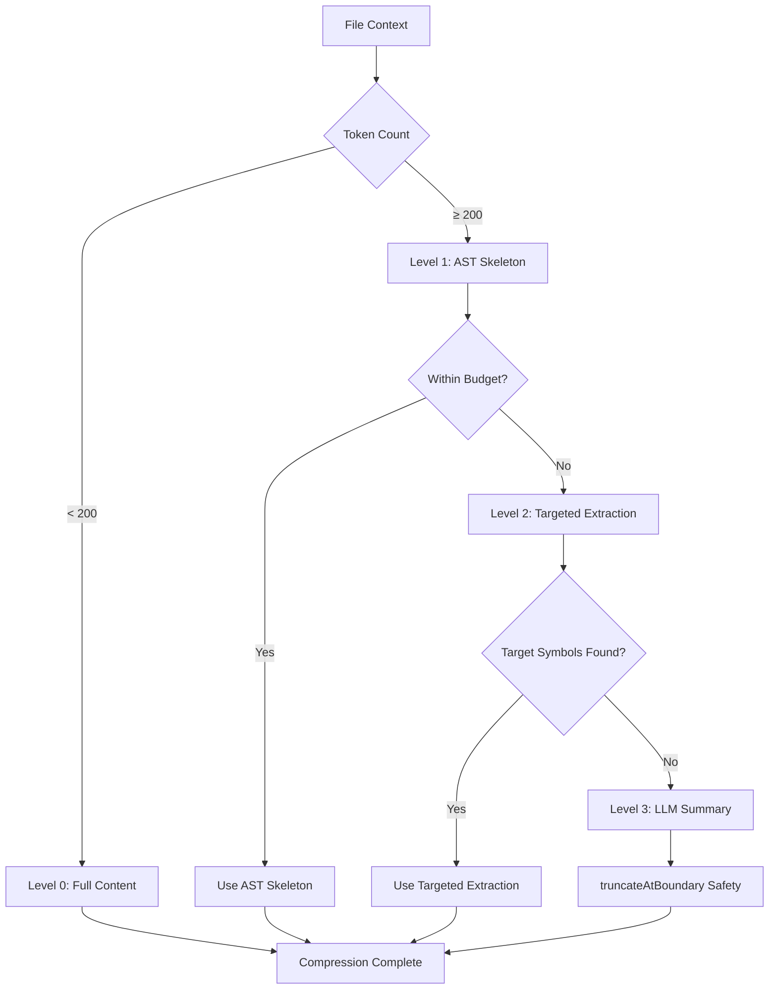

# Compression Engine Architecture

<cite>
**Referenced Files in This Document**
- [contextManager.ts](file://src/chat/compression/contextManager.ts)
- [tokenBudget.ts](file://src/chat/compression/tokenBudget.ts)
- [historySummarizer.ts](file://src/chat/compression/historySummarizer.ts)
- [fileCompressor.ts](file://src/chat/compression/fileCompressor.ts)
- [targetedExtractor.ts](file://src/chat/compression/targetedExtractor.ts)
- [types.ts](file://src/chat/compression/types.ts)
- [compressContext.ts](file://src/chat/nodes/compressContext.ts)
- [compressFile.ts](file://src/core/compression/compressFile.ts)
- [LanguageParser.ts](file://src/core/compression/LanguageParser.ts)
- [index.ts](file://src/core/compression/index.ts)
- [003_context_compression_strategy.md](file://PRDs/003_context_compression_strategy.md)
</cite>

## Update Summary
**Changes Made**
- Enhanced documentation to include intelligent truncation at clean boundaries with the new truncateAtBoundary function
- Updated aggressive trimming processes to utilize multi-pass optimization strategies
- Added comprehensive coverage of UTF-8 character safety and word boundary preservation
- Expanded binary content detection documentation with improved filtering mechanisms
- Updated architecture diagrams to reflect enhanced content validation and truncation workflows
- Integrated new truncateToTokenLimit function documentation for line-by-line truncation safety
- Added detailed coverage of aggressive trimming processes with boundary-aware content integrity

## Table of Contents
1. [Introduction](#introduction)
2. [Project Structure](#project-structure)
3. [Core Components](#core-components)
4. [Architecture Overview](#architecture-overview)
5. [Detailed Component Analysis](#detailed-component-analysis)
6. [Reactive Context Management](#reactive-context-management)
7. [Multi-Level Compression Strategies](#multi-level-compression-strategies)
8. [Intelligent Truncation System](#intelligent-truncation-system)
9. [Dependency Analysis](#dependency-analysis)
10. [Performance Considerations](#performance-considerations)
11. [Troubleshooting Guide](#troubleshooting-guide)
12. [Conclusion](#conclusion)

## Introduction
The Compression Engine has evolved into a sophisticated reactive context compression system that intelligently manages token usage in AI-assisted development workflows. The new system introduces a ContextManager that monitors conversation context against configurable thresholds and applies multi-level compression strategies to maintain optimal performance while preserving essential information.

The system combines advanced token budget management with intelligent compression strategies including conversation history summarization, targeted file extraction, and binary content detection. A significant enhancement includes intelligent truncation at clean boundaries to avoid breaking words or corrupting UTF-8 characters, ensuring content validity after compression operations.

**Updated** The system now includes conversation history summarization, targeted file extraction, binary content detection, and intelligent truncation with UTF-8 safety mechanisms, representing a substantial evolution from the original static compression approach with enhanced reliability for compressed file previews.

## Project Structure
The compression engine now operates as a layered system with reactive context management at the core and intelligent truncation safeguards throughout:



**Diagram sources**
- [contextManager.ts](file://src/chat/compression/contextManager.ts#L1-L308)
- [tokenBudget.ts](file://src/chat/compression/tokenBudget.ts#L1-L227)
- [fileCompressor.ts](file://src/chat/compression/fileCompressor.ts#L1-L265)
- [compressContext.ts](file://src/chat/nodes/compressContext.ts#L1-L125)

**Section sources**
- [contextManager.ts](file://src/chat/compression/contextManager.ts#L1-L308)
- [tokenBudget.ts](file://src/chat/compression/tokenBudget.ts#L1-L227)
- [compressContext.ts](file://src/chat/nodes/compressContext.ts#L1-L125)

## Core Components

### ContextManager - Reactive Orchestrator
The ContextManager serves as the central coordinator for all compression operations, implementing a reactive monitoring system that triggers compression when token usage exceeds configurable thresholds.

Key responsibilities include:
- **Token Usage Monitoring**: Real-time tracking of conversation history, file context, and system prompt token counts
- **Compression Decision Logic**: Intelligent determination of when compression is needed based on model context windows and user-configurable thresholds
- **Multi-Level Compression Coordination**: Orchestration of history summarization and file compression strategies
- **Aggressive Trimming**: Final safety net that reduces content to meet budget constraints using intelligent truncation at clean boundaries
- **UTF-8 Safety**: Ensures content remains valid after truncation operations with boundary-aware character handling
- **Multi-Pass Optimization**: Implements two-pass budget allocation strategy for efficient resource distribution

### TokenBudget System
Advanced token budget calculation and allocation system with model-specific configurations:

- **Model-Aware Budgeting**: Predefined configurations for Gemini 2.5 Flash and Claude Opus 4 models
- **Dynamic Allocation**: Percentage-based distribution of remaining budget across conversation summaries, recent messages, and file context
- **Threshold-Based Triggering**: Configurable percentage thresholds that determine when compression activates
- **Safety Reserves**: Fixed allocations for system prompts and output buffers to prevent overflow

### HistorySummarizer - Conversation Intelligence
Intelligent conversation history compression using Gemini 2.5 Flash:

- **Selective Preservation**: Keeps recent messages in full while summarizing older conversation segments
- **Structured Summaries**: Preserves key decisions, file paths, code changes, and user preferences
- **Batch Processing**: Groups messages into configurable sizes for efficient summarization
- **Fallback Mechanisms**: Heuristic-based summarization when LLM calls fail

### FileCompressor - Multi-Level Content Management
Progressive file compression system with four distinct levels and intelligent truncation safeguards:

- **Level 0**: Full content for small files (< 200 tokens)
- **Level 1**: AST skeleton extraction for supported languages with UTF-8 validation
- **Level 2**: Targeted extraction of specific symbols mentioned in goals with boundary-aware processing
- **Level 3**: LLM-generated summaries for unsupported languages or oversized content using truncateAtBoundary for safety
- **Truncation Safety**: Intelligent truncation at clean boundaries to avoid breaking words or corrupting UTF-8 characters
- **Multi-Pass Budget Allocation**: Two-pass strategy for efficient resource distribution across files

**Section sources**
- [contextManager.ts](file://src/chat/compression/contextManager.ts#L138-L284)
- [tokenBudget.ts](file://src/chat/compression/tokenBudget.ts#L108-L181)
- [historySummarizer.ts](file://src/chat/compression/historySummarizer.ts#L36-L98)
- [fileCompressor.ts](file://src/chat/compression/fileCompressor.ts#L32-L122)

## Architecture Overview



**Diagram sources**
- [contextManager.ts](file://src/chat/compression/contextManager.ts#L138-L284)
- [tokenBudget.ts](file://src/chat/compression/tokenBudget.ts#L108-L181)
- [historySummarizer.ts](file://src/chat/compression/historySummarizer.ts#L36-L98)
- [fileCompressor.ts](file://src/chat/compression/fileCompressor.ts#L127-L166)

The architecture demonstrates a sophisticated reactive compression system that intelligently manages token usage while preserving conversation context and code information. The system operates as a closed-loop feedback mechanism that continuously monitors and adjusts compression strategies based on real-time usage patterns, with enhanced safety measures for content integrity.

## Detailed Component Analysis

### ContextManager Implementation



**Diagram sources**
- [contextManager.ts](file://src/chat/compression/contextManager.ts#L138-L284)
- [tokenBudget.ts](file://src/chat/compression/tokenBudget.ts#L108-L181)
- [fileCompressor.ts](file://src/chat/compression/fileCompressor.ts#L127-L166)
- [targetedExtractor.ts](file://src/chat/compression/targetedExtractor.ts#L99-L155)

### Compression Process Flow



**Diagram sources**
- [contextManager.ts](file://src/chat/compression/contextManager.ts#L138-L284)
- [fileCompressor.ts](file://src/chat/compression/fileCompressor.ts#L32-L122)

### Token Budget Allocation Strategy

The system implements sophisticated token budget allocation with model-specific configurations:

```mermaid
graph LR
subgraph "Model Context Window"
WINDOW[200K tokens (Opus)]
END
subgraph "Fixed Allocations"
SYSTEM[2K system prompt]
OUTPUT[16K output buffer]
ARCH[1K repo architecture]
END
subgraph "Remaining Budget"
REMAINING[181K remaining]
END
subgraph "Percentage Allocations"
HISTORY[10% = 18.1K for summaries]
RECENT[20% = 36.2K for recent messages]
FILES[65% = 117.65K for file context]
END
WINDOW --> SYSTEM
WINDOW --> OUTPUT
WINDOW --> ARCH
WINDOW --> REMAINING
REMAINING --> HISTORY
REMAINING --> RECENT
REMAINING --> FILES
```

**Diagram sources**
- [tokenBudget.ts](file://src/chat/compression/tokenBudget.ts#L13-L81)

**Section sources**
- [contextManager.ts](file://src/chat/compression/contextManager.ts#L1-L308)
- [tokenBudget.ts](file://src/chat/compression/tokenBudget.ts#L1-L227)
- [historySummarizer.ts](file://src/chat/compression/historySummarizer.ts#L1-L206)
- [fileCompressor.ts](file://src/chat/compression/fileCompressor.ts#L1-L265)

## Reactive Context Management

### Threshold-Based Compression Triggering
The system implements intelligent compression triggering based on configurable thresholds:

- **Configurable Threshold**: Users can set compression activation at 50-95% of model context window
- **Real-Time Monitoring**: Continuous token usage tracking across conversation history, file context, and system prompts
- **Adaptive Response**: Compression applied only when necessary to minimize computational overhead

### Multi-Layered Compression Coordination
The ContextManager coordinates multiple compression layers in a strategic sequence:

1. **History Compression**: Summarizes older conversation segments while preserving recent context
2. **File Compression**: Applies progressive compression levels to context files with intelligent truncation safeguards
3. **Safety Net**: Aggressive trimming ensures final compliance with budget constraints using boundary-aware truncation

### Binary Content Detection
Intelligent filtering of binary content prevents unnecessary processing:

- **Null Byte Detection**: Immediate identification of binary files
- **Non-Printable Character Analysis**: Statistical detection of binary content with configurable thresholds
- **Performance Optimization**: Excludes binary files from compression pipeline to improve overall system efficiency

### Multi-Pass Optimization Strategies
The system implements sophisticated multi-pass optimization for resource allocation:

- **Two-Pass Budget Distribution**: First pass identifies small files for Level 0 compression, second pass redistributes surplus to larger files
- **Priority-Based Trimming**: Aggressive trimming prioritizes files with highest token counts for maximum savings
- **Boundary-Aware Processing**: All truncation operations respect UTF-8 character boundaries and word integrity

**Section sources**
- [contextManager.ts](file://src/chat/compression/contextManager.ts#L165-L182)
- [contextManager.ts](file://src/chat/compression/contextManager.ts#L219-L234)
- [fileCompressor.ts](file://src/chat/compression/fileCompressor.ts#L220-L229)

## Multi-Level Compression Strategies

### Conversation History Summarization
Advanced summarization preserves critical context while dramatically reducing token usage:

- **Selective Preservation**: Recent messages (default 10) maintained in full
- **Structured Summaries**: Gemini 2.5 Flash generates comprehensive summaries
- **Key Information Extraction**: Preserves decisions, file paths, code changes, and user preferences
- **Fallback Mechanisms**: Heuristic-based summarization when LLM calls fail

### Targeted File Extraction
Intelligent symbol extraction focuses on relevant code sections:

- **Goal-Based Extraction**: Identifies symbols mentioned in user goals
- **Language-Aware Parsing**: Leverages Tree-Sitter for precise symbol location
- **Import Preservation**: Maintains necessary import statements
- **Cross-Language Support**: Extends to TypeScript, JavaScript, Python, Rust, C#, and Dart

### Progressive Compression Levels
Four-tier compression system with intelligent fallback and boundary-aware truncation:



**Diagram sources**
- [fileCompressor.ts](file://src/chat/compression/fileCompressor.ts#L32-L122)

**Section sources**
- [historySummarizer.ts](file://src/chat/compression/historySummarizer.ts#L14-L24)
- [targetedExtractor.ts](file://src/chat/compression/targetedExtractor.ts#L49-L67)
- [fileCompressor.ts](file://src/chat/compression/fileCompressor.ts#L53-L91)

## Intelligent Truncation System

### truncateAtBoundary Function
The new truncateAtBoundary function provides intelligent truncation at clean boundaries to avoid breaking words or corrupting UTF-8 characters:

- **Boundary Detection**: Searches backward from the maximum length to find newline or space characters
- **UTF-8 Safety**: Ensures truncation occurs at valid character boundaries to prevent corruption
- **Word Preservation**: Prevents splitting words across truncation points
- **Fallback Handling**: Falls back to simple slicing if no clean boundary found within the search window
- **Performance Optimization**: Limits search to a reasonable window (100 characters) for efficiency

### truncateToTokenLimit Function
Provides line-by-line truncation for token budget compliance:

- **Line-Based Processing**: Processes content line by line for predictable token counting
- **Token Budget Compliance**: Ensures final content fits within specified token limits
- **Progressive Truncation**: Adds truncation markers when content is shortened
- **Efficient Implementation**: Uses simple iteration for straightforward truncation logic

### Aggressive Trimming Integration
Both truncation functions integrate seamlessly with the aggressive trimming process:

- **Boundary-Aware Trimming**: Uses truncateTextToTokenBudget with intelligent boundary detection
- **UTF-8 Validation**: Ensures trimmed content remains valid UTF-8 sequences
- **Content Integrity**: Maintains structural validity of compressed content
- **Error Prevention**: Prevents corrupted content that could cause downstream processing issues

### Multi-Pass Trimming Strategy
The system implements sophisticated multi-pass trimming for maximum efficiency:

- **Priority Sorting**: Files sorted by token count to maximize savings from trimming
- **Minimum Token Protection**: Ensures minimum token thresholds are maintained for content integrity
- **Iterative Optimization**: Multiple passes to achieve optimal budget compliance
- **Boundary-Aware Validation**: Each trim operation validates UTF-8 character boundaries

**Section sources**
- [contextManager.ts](file://src/chat/compression/contextManager.ts#L25-L122)
- [fileCompressor.ts](file://src/chat/compression/fileCompressor.ts#L154-L190)

## Dependency Analysis

The compression system exhibits sophisticated interdependencies with clear separation of concerns and enhanced safety mechanisms:

```mermaid
graph TB
subgraph "External Dependencies"
TOKEN[gpt-tokenizer]
GEMINI[Gemini API]
TREE_SITTER[Tree-Sitter]
END
subgraph "Context Management Layer"
CM[ContextManager]
TB[TokenBudget]
HS[HistorySummarizer]
FC[FileCompressor]
TE[TargetedExtractor]
END
subgraph "Core Compression Engine"
CF[compressFile]
LP[LanguageParser]
TYPES[Types & Interfaces]
END
subgraph "Intelligent Truncation System"
TAB[truncateAtBoundary]
TTT[truncateToTokenLimit]
AGG[aggressivelyTrimCompressedFiles]
AGGS[aggressivelyTrimSummaries]
END
subgraph "Integration Layer"
CC[compressContext Node]
STATE[Chat State]
END
TOKEN --> TB
TOKEN --> HS
TOKEN --> FC
GEMINI --> HS
GEMINI --> FC
TREE_SITTER --> LP
TREE_SITTER --> TE
LP --> CF
TE --> LP
CM --> TB
CM --> HS
CM --> FC
FC --> TAB
FC --> TTT
FC --> AGG
FC --> AGGS
CC --> CM
CC --> STATE
```

**Diagram sources**
- [contextManager.ts](file://src/chat/compression/contextManager.ts#L9-L20)
- [tokenBudget.ts](file://src/chat/compression/tokenBudget.ts#L6-L7)
- [fileCompressor.ts](file://src/chat/compression/fileCompressor.ts#L12-L17)

The dependency structure shows a clean layered architecture where the ContextManager acts as the central orchestrator, coordinating between token budget management, content compression, intelligent truncation, and integration with the broader chat workflow. The new truncation system provides essential safety guarantees throughout the compression pipeline.

**Section sources**
- [types.ts](file://src/chat/compression/types.ts#L1-L170)
- [contextManager.ts](file://src/chat/compression/contextManager.ts#L1-L308)

## Performance Considerations

### Reactive Compression Efficiency
The new system optimizes performance through intelligent compression triggering:

- **Lazy Evaluation**: Compression only applied when token usage exceeds threshold
- **Parallel Processing**: Asynchronous operations for LLM calls and file compression
- **Caching Strategies**: Results cached to avoid redundant computations
- **Early Termination**: Quick exit when context remains within budget

### Memory Management Optimizations
Advanced memory management for large-scale operations:

- **Streaming Processing**: Large files processed in chunks to prevent memory overflow
- **Incremental Summarization**: Conversation segments processed individually
- **Efficient Data Structures**: Optimized arrays and maps for compression tracking
- **Garbage Collection**: Automatic cleanup of temporary compression artifacts

### Model-Specific Optimizations
Tailored configurations for different AI models:

- **Context Window Awareness**: Budget calculations adapt to model capabilities
- **Output Buffer Management**: Reserve tokens for model responses
- **Processing Priority**: Recent messages prioritized for preservation
- **Fallback Strategies**: Graceful degradation when model limitations reached

### Compression Strategy Optimization
Intelligent selection of compression methods with enhanced safety:

- **Language Detection**: Automatic recognition of supported compression languages
- **Content Analysis**: Binary content detection prevents wasted processing
- **Symbol Extraction**: Targeted extraction maximizes information retention
- **Budget Distribution**: Dynamic allocation based on content characteristics
- **UTF-8 Validation**: Boundary-aware truncation ensures content integrity
- **Error Prevention**: Safety mechanisms prevent corrupted content in previews
- **Multi-Pass Optimization**: Two-pass budget allocation maximizes efficiency

### Truncation Performance
Optimized truncation algorithms for efficient content processing:

- **Boundary Search Optimization**: Limited search window prevents excessive computation
- **UTF-8 Safety Checks**: Minimal overhead for character boundary validation
- **Fallback Efficiency**: Simple slicing when clean boundaries unavailable
- **Memory Efficiency**: String manipulation optimized for large content handling

### Aggressive Trimming Efficiency
Sophisticated trimming strategies for maximum token savings:

- **Priority-Based Sorting**: Files trimmed by highest token count for maximum impact
- **Minimum Token Protection**: Prevents over-trimming that would compromise content
- **Iterative Optimization**: Multiple passes to achieve optimal budget compliance
- **Boundary-Aware Validation**: Each trim operation maintains content integrity

**Section sources**
- [contextManager.ts](file://src/chat/compression/contextManager.ts#L22-L23)
- [tokenBudget.ts](file://src/chat/compression/tokenBudget.ts#L133-L146)
- [fileCompressor.ts](file://src/chat/compression/fileCompressor.ts#L177-L197)

## Troubleshooting Guide

### Common Issues and Solutions

**Compression Not Triggering**
- Verify context threshold percentage is set appropriately (50-95%)
- Check model context window configuration matches actual model capabilities
- Ensure token counting functions are working correctly
- Monitor log output for compression decision rationale

**History Summarization Failures**
- Verify Gemini API key is configured and valid
- Check network connectivity for LLM calls
- Review summarization prompt quality and length
- Implement fallback mechanisms for summarization failures

**File Compression Performance Issues**
- Monitor token budget allocation for file context
- Verify Tree-Sitter parser initialization success
- Check language support for target files
- Review compression level selection logic
- Validate truncateAtBoundary function behavior for large files

**Memory Usage Problems**
- Implement file size limits for compression
- Monitor compression result sizes
- Check for memory leaks in compression pipelines
- Optimize chunk sizes for large files

**Truncation-Related Issues**
- Verify truncateAtBoundary function handles edge cases correctly
- Check UTF-8 character boundaries for international content
- Monitor truncation effectiveness for different file types
- Validate boundary detection for mixed content types

**Aggressive Trimming Problems**
- Verify minimum token thresholds are appropriate for content type
- Check priority sorting logic for file trimming order
- Monitor boundary-aware validation for content integrity
- Review iterative optimization effectiveness

### Debugging Strategies
Enhanced debugging capabilities for the new system:

- **Compression Decision Logging**: Track threshold calculations and trigger points
- **Token Budget Tracking**: Monitor allocation and utilization across categories
- **Compression Level Analysis**: Log compression effectiveness by level
- **Performance Metrics**: Track processing times and resource usage
- **Error Handling**: Comprehensive error logging with recovery attempts
- **Truncation Validation**: Monitor boundary detection and UTF-8 safety
- **Content Integrity Checks**: Verify compressed content remains valid
- **Multi-Pass Optimization Analysis**: Track efficiency of budget allocation strategies

### Truncation-Specific Debugging
Additional debugging capabilities for truncation operations:

- **Boundary Detection Logging**: Track search patterns and boundary locations
- **UTF-8 Validation**: Monitor character encoding safety during truncation
- **Word Boundary Analysis**: Verify truncation points avoid splitting words
- **Content Length Tracking**: Monitor pre/post truncation content lengths
- **Error Recovery**: Log fallback mechanisms when clean boundaries unavailable

### Aggressive Trimming Debugging
Enhanced debugging for trimming operations:

- **Priority Sorting Validation**: Verify file trimming order by token count
- **Minimum Token Protection**: Monitor enforcement of minimum thresholds
- **Boundary-Aware Validation**: Track UTF-8 safety during trimming operations
- **Iterative Optimization Analysis**: Monitor effectiveness of multiple trimming passes

**Section sources**
- [contextManager.ts](file://src/chat/compression/contextManager.ts#L160-L182)
- [historySummarizer.ts](file://src/chat/compression/historySummarizer.ts#L72-L78)
- [fileCompressor.ts](file://src/chat/compression/fileCompressor.ts#L86-L110)

## Conclusion

The Compression Engine has evolved into a sophisticated reactive context management system that represents a significant advancement in AI-assisted development tooling. The new ContextManager, TokenBudget, and multi-level compression strategies provide intelligent, automated context management that maintains system performance while preserving essential information.

**Updated** The system now includes intelligent truncation at clean boundaries with the truncateAtBoundary function, ensuring content validity and preventing UTF-8 corruption. This enhancement significantly improves the reliability of compressed file previews and maintains content integrity throughout the compression pipeline.

Key achievements include:
- **Reactive Compression**: Intelligent triggering based on real-time token usage monitoring
- **Multi-Layered Strategy**: Progressive compression levels with sophisticated fallback mechanisms
- **Model-Aware Design**: Configurations optimized for different AI models and capabilities
- **Performance Optimization**: Efficient processing with minimal computational overhead
- **Content Integrity**: Boundary-aware truncation prevents word splitting and UTF-8 corruption
- **Extensible Architecture**: Clean separation of concerns enabling future enhancements
- **UTF-8 Safety**: Comprehensive character encoding validation throughout compression pipeline
- **Multi-Pass Optimization**: Sophisticated budget allocation and trimming strategies
- **Binary Content Filtering**: Intelligent detection and exclusion of binary files
- **Aggressive Trimming**: Multi-pass optimization for maximum token savings

The system successfully addresses the challenges of long-running conversations and complex code analysis by providing automatic context management that scales with usage patterns. The integration with existing compression infrastructure ensures backward compatibility while adding powerful new capabilities for modern AI-assisted development workflows.

The new intelligent truncation system represents a crucial improvement in content reliability, particularly important for compressed file previews where content validity is paramount. The multi-pass optimization strategies and comprehensive safety mechanisms ensure that the compression engine can handle diverse content types while maintaining optimal performance and content integrity.

Future enhancements could include adaptive threshold tuning, machine learning-based compression strategy selection, enhanced binary content detection for improved performance in diverse codebases, and expanded boundary-aware truncation for additional content types. The modular architecture and comprehensive safety mechanisms provide a solid foundation for continued evolution of the compression engine capabilities.