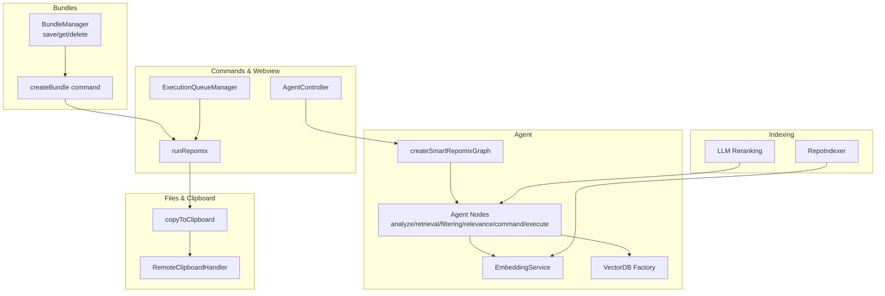
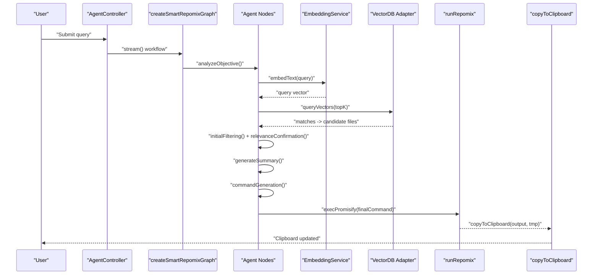
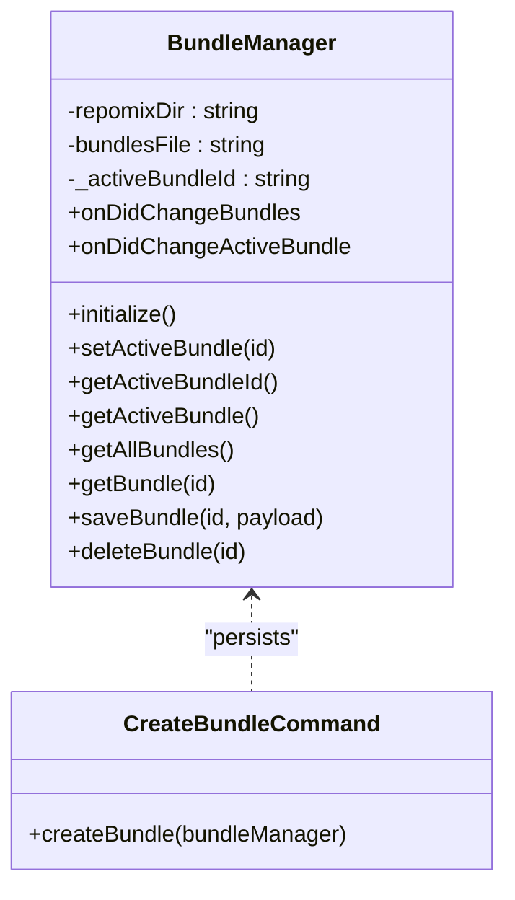
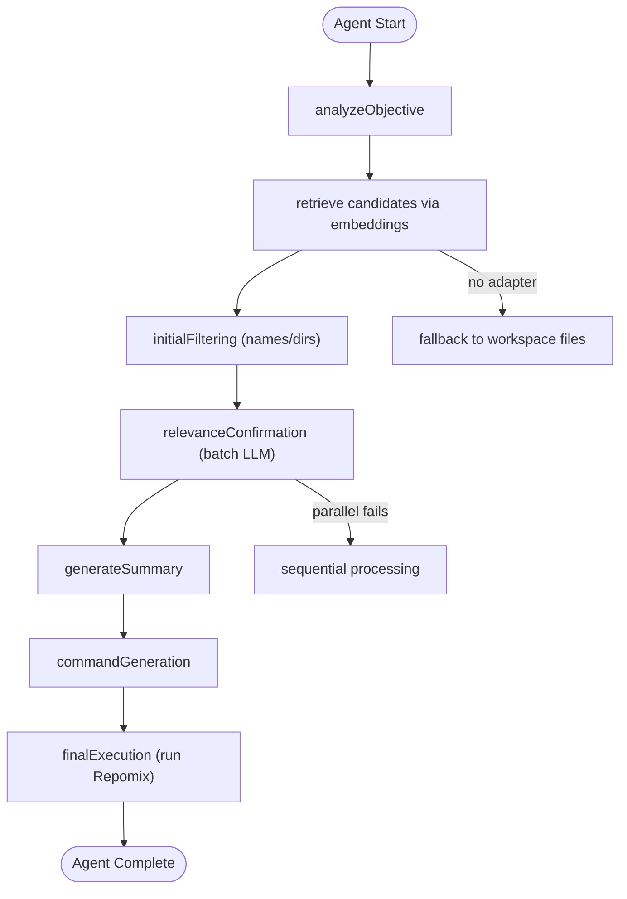
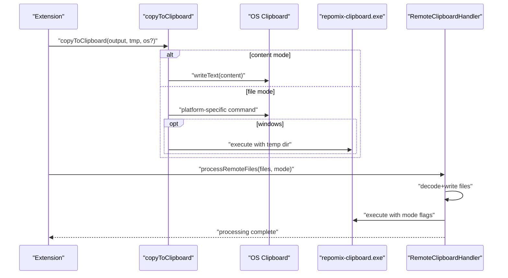
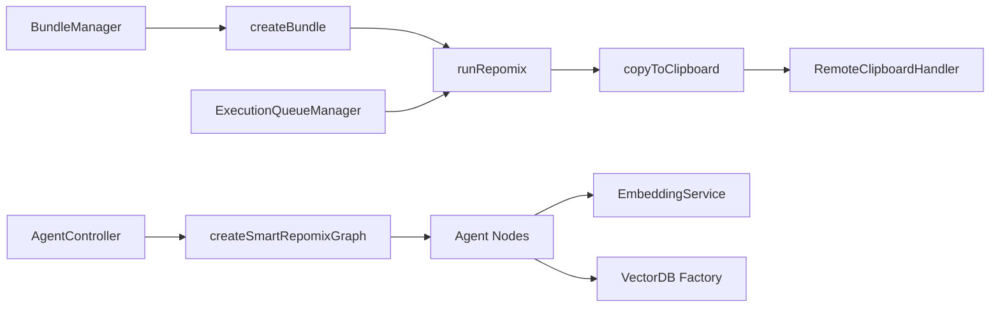

# Core Features

<cite>
**Referenced Files in This Document**
- [bundleManager.ts](file://src/core/bundles/bundleManager.ts)
- [createBundle.ts](file://src/commands/createBundle.ts)
- [runRepomix.ts](file://src/commands/runRepomix.ts)
- [ExecutionQueueManager.ts](file://src/webview/services/ExecutionQueueManager.ts)
- [graph.ts](file://src/agent/graph.ts)
- [nodes.ts](file://src/agent/nodes.ts)
- [embeddingService.ts](file://src/core/indexing/embeddingService.ts)
- [repoIndexer.ts](file://src/core/indexing/repoIndexer.ts)
- [llmReranking.ts](file://src/core/indexing/llmReranking.ts)
- [factory.ts](file://src/core/indexing/vectorDb/factory.ts)
- [copyToClipboard.ts](file://src/core/files/copyToClipboard.ts)
- [remoteClipboardHandler.ts](file://src/webview/handlers/remoteClipboardHandler.ts)
- [AgentController.ts](file://src/webview/controllers/AgentController.ts)
- [configSchema.ts](file://src/config/configSchema.ts)
</cite>

## Table of Contents
1. [Introduction](#introduction)
2. [Project Structure](#project-structure)
3. [Core Components](#core-components)
4. [Architecture Overview](#architecture-overview)
5. [Detailed Component Analysis](#detailed-component-analysis)
6. [Dependency Analysis](#dependency-analysis)
7. [Performance Considerations](#performance-considerations)
8. [Troubleshooting Guide](#troubleshooting-guide)
9. [Conclusion](#conclusion)

## Introduction
This document details the three primary feature pillars of Repomix Runner Plus:
- Bundle Management System: persistent, organized collections of files and configurations for repeatable runs.
- AI-Powered File Selection: a smart agent workflow that performs semantic search, relevance confirmation, and automated packaging.
- Enhanced Clipboard Operations: cross-platform copy modes, remote clipboard support, and binary integration.

It explains how each feature addresses user needs, the workflows they enable, interdependencies among components, configuration options, and practical examples.

## Project Structure
The core features span several subsystems:
- Bundles: persistent storage and lifecycle management for user-defined groups of files and settings.
- Agent: a LangGraph-based workflow orchestrating retrieval, filtering, summarization, command generation, and execution.
- Indexing: repository indexing, embedding generation, and vector database adapters for semantic search.
- Files and Clipboard: cross-platform copy-to-clipboard logic, temp file handling, and remote clipboard binary integration.
- Commands and Webview: orchestration of runs, queueing, and UI-driven agent interactions.

**Diagram sources**
- [bundleManager.ts](file://src/core/bundles/bundleManager.ts#L6-L117)
- [createBundle.ts](file://src/commands/createBundle.ts#L7-L31)
- [runRepomix.ts](file://src/commands/runRepomix.ts#L48-L154)
- [graph.ts](file://src/agent/graph.ts#L8-L67)
- [nodes.ts](file://src/agent/nodes.ts#L129-L742)
- [embeddingService.ts](file://src/core/indexing/embeddingService.ts#L17-L68)
- [factory.ts](file://src/core/indexing/vectorDb/factory.ts#L17-L62)
- [repoIndexer.ts](file://src/core/indexing/repoIndexer.ts#L28-L121)
- [llmReranking.ts](file://src/core/indexing/llmReranking.ts#L43-L143)
- [copyToClipboard.ts](file://src/core/files/copyToClipboard.ts#L52-L160)
- [remoteClipboardHandler.ts](file://src/webview/handlers/remoteClipboardHandler.ts#L10-L190)
- [ExecutionQueueManager.ts](file://src/webview/services/ExecutionQueueManager.ts#L15-L133)
- [AgentController.ts](file://src/webview/controllers/AgentController.ts#L44-L178)

**Section sources**
- [bundleManager.ts](file://src/core/bundles/bundleManager.ts#L6-L117)
- [createBundle.ts](file://src/commands/createBundle.ts#L7-L31)
- [runRepomix.ts](file://src/commands/runRepomix.ts#L48-L154)
- [graph.ts](file://src/agent/graph.ts#L8-L67)
- [nodes.ts](file://src/agent/nodes.ts#L129-L742)
- [embeddingService.ts](file://src/core/indexing/embeddingService.ts#L17-L68)
- [factory.ts](file://src/core/indexing/vectorDb/factory.ts#L17-L62)
- [repoIndexer.ts](file://src/core/indexing/repoIndexer.ts#L28-L121)
- [llmReranking.ts](file://src/core/indexing/llmReranking.ts#L43-L143)
- [copyToClipboard.ts](file://src/core/files/copyToClipboard.ts#L52-L160)
- [remoteClipboardHandler.ts](file://src/webview/handlers/remoteClipboardHandler.ts#L10-L190)
- [ExecutionQueueManager.ts](file://src/webview/services/ExecutionQueueManager.ts#L15-L133)
- [AgentController.ts](file://src/webview/controllers/AgentController.ts#L44-L178)

## Core Components
- Bundle Management System
  - Persistent storage of bundles in a workspace-local JSON file.
  - Active bundle tracking and events for UI updates.
  - Creation, retrieval, saving, and deletion of bundles.
- AI-Powered File Selection
  - LangGraph workflow with nodes for objective analysis, retrieval, filtering, relevance confirmation, summary, command generation, and execution.
  - Semantic search powered by embeddings and vector databases.
  - Structured LLM prompts and caching for performance.
- Enhanced Clipboard Operations
  - Cross-platform copy modes: content (text) and file (binary).
  - Remote clipboard support via a Windows helper binary invoked from a temp directory.
  - OS-specific clipboard commands and dependency checks.

**Section sources**
- [bundleManager.ts](file://src/core/bundles/bundleManager.ts#L6-L117)
- [createBundle.ts](file://src/commands/createBundle.ts#L7-L31)
- [graph.ts](file://src/agent/graph.ts#L8-L67)
- [nodes.ts](file://src/agent/nodes.ts#L129-L742)
- [embeddingService.ts](file://src/core/indexing/embeddingService.ts#L17-L68)
- [factory.ts](file://src/core/indexing/vectorDb/factory.ts#L17-L62)
- [copyToClipboard.ts](file://src/core/files/copyToClipboard.ts#L52-L160)
- [remoteClipboardHandler.ts](file://src/webview/handlers/remoteClipboardHandler.ts#L10-L190)

## Architecture Overview
The system integrates three pillars around a central execution pipeline:
- Users define or select bundles to run.
- The agent optionally discovers relevant files using semantic search and LLM-based filtering.
- Repomix executes with discovered files, and output is copied according to configuration.

**Diagram sources**
- [AgentController.ts](file://src/webview/controllers/AgentController.ts#L44-L178)
- [graph.ts](file://src/agent/graph.ts#L8-L67)
- [nodes.ts](file://src/agent/nodes.ts#L129-L742)
- [embeddingService.ts](file://src/core/indexing/embeddingService.ts#L48-L60)
- [factory.ts](file://src/core/indexing/vectorDb/factory.ts#L17-L62)
- [runRepomix.ts](file://src/commands/runRepomix.ts#L88-L123)
- [copyToClipboard.ts](file://src/core/files/copyToClipboard.ts#L52-L160)

## Detailed Component Analysis

### Bundle Management System
Purpose
- Persist user-defined groups of files and settings.
- Enable quick selection and reuse of predefined configurations.
- Track an active bundle for UI and execution contexts.

Key Behaviors
- Initialize workspace storage directory and metadata file.
- CRUD operations on bundles with JSON persistence.
- Track and emit active bundle changes.
- Create bundles via a form and set them active.

User Workflows
- Create a bundle, add files, and run it.
- Switch active bundle to quickly compare configurations.
- Delete unused bundles to keep workspace tidy.

Interdependencies
- Commands depend on BundleManager for persistence.
- ExecutionQueueManager uses bundle IDs to run bundles.
- UI components subscribe to bundle change events.

**Diagram sources**
- [bundleManager.ts](file://src/core/bundles/bundleManager.ts#L6-L117)
- [createBundle.ts](file://src/commands/createBundle.ts#L7-L31)

**Section sources**
- [bundleManager.ts](file://src/core/bundles/bundleManager.ts#L18-L115)
- [createBundle.ts](file://src/commands/createBundle.ts#L7-L31)

### AI-Powered File Selection
Purpose
- Automatically discover relevant files for a given query using semantic search and LLM-based filtering.
- Provide a reproducible, auditable run history.

Workflow
- Objective analysis: classify task type and relevance criteria.
- Retrieval: embed query and search vector database for candidate files.
- Filtering: fast pass to reduce candidate set.
- Relevance confirmation: batched LLM evaluation with confidence thresholds.
- Summary: optional markdown summary of selected files.
- Command generation: build Repomix CLI command with selected files.
- Execution: run Repomix and record run history.

Semantic Search and Embeddings
- EmbeddingService supports multiple providers and exposes dimensionality.
- VectorDB factory selects provider and adapter per repository.
- RepoIndexer builds a file catalog and clears old entries before indexing.

Recommendation Engine
- Retrieval uses vector similarity; fallback to filesystem listing if unavailable.
- LLM reranking refines top candidates using structured prompts and confidence thresholds.
- Nodes cache LLM responses to reduce cost and latency.

**Diagram sources**
- [graph.ts](file://src/agent/graph.ts#L8-L67)
- [nodes.ts](file://src/agent/nodes.ts#L129-L742)
- [embeddingService.ts](file://src/core/indexing/embeddingService.ts#L17-L68)
- [factory.ts](file://src/core/indexing/vectorDb/factory.ts#L17-L62)
- [repoIndexer.ts](file://src/core/indexing/repoIndexer.ts#L28-L121)
- [llmReranking.ts](file://src/core/indexing/llmReranking.ts#L43-L143)

**Section sources**
- [graph.ts](file://src/agent/graph.ts#L8-L67)
- [nodes.ts](file://src/agent/nodes.ts#L129-L742)
- [embeddingService.ts](file://src/core/indexing/embeddingService.ts#L17-L68)
- [factory.ts](file://src/core/indexing/vectorDb/factory.ts#L17-L62)
- [repoIndexer.ts](file://src/core/indexing/repoIndexer.ts#L28-L121)
- [llmReranking.ts](file://src/core/indexing/llmReranking.ts#L43-L143)

### Enhanced Clipboard Operations
Purpose
- Provide flexible copy modes to clipboard: raw content or entire file.
- Support remote environments by invoking a Windows helper binary when needed.
- Manage temporary files and OS-specific clipboard commands.

Cross-Platform Modes
- Content mode: uses VS Code’s clipboard API to copy text.
- File mode: copies a file to the OS clipboard using platform-specific commands or a helper binary.

Remote Clipboard Support
- A remote handler decodes base64-encoded files into a temp directory and invokes a Windows helper binary to set the clipboard.
- The handler manages temp directories, binary discovery, timeouts, and asynchronous cleanup.

**Diagram sources**
- [copyToClipboard.ts](file://src/core/files/copyToClipboard.ts#L52-L160)
- [remoteClipboardHandler.ts](file://src/webview/handlers/remoteClipboardHandler.ts#L22-L67)

**Section sources**
- [copyToClipboard.ts](file://src/core/files/copyToClipboard.ts#L52-L160)
- [remoteClipboardHandler.ts](file://src/webview/handlers/remoteClipboardHandler.ts#L10-L190)

## Dependency Analysis
- Bundle Management
  - Depends on VS Code workspace and file system APIs.
  - Used by creation command and execution queue manager.
- Agent
  - Depends on EmbeddingService and VectorDB adapter factory.
  - Uses structured LLM clients and caches.
  - Persists run history via DatabaseService.
- Clipboard
  - Uses OS-specific commands and a Windows helper binary.
  - Integrates with temp directory manager and VS Code clipboard API.
- Commands and Webview
  - runRepomix orchestrates CLI flags, execution, and post-processing.
  - ExecutionQueueManager coordinates runs and cancellation.

**Diagram sources**
- [bundleManager.ts](file://src/core/bundles/bundleManager.ts#L6-L117)
- [createBundle.ts](file://src/commands/createBundle.ts#L7-L31)
- [runRepomix.ts](file://src/commands/runRepomix.ts#L48-L154)
- [copyToClipboard.ts](file://src/core/files/copyToClipboard.ts#L52-L160)
- [AgentController.ts](file://src/webview/controllers/AgentController.ts#L44-L178)
- [graph.ts](file://src/agent/graph.ts#L8-L67)
- [nodes.ts](file://src/agent/nodes.ts#L129-L742)
- [embeddingService.ts](file://src/core/indexing/embeddingService.ts#L17-L68)
- [factory.ts](file://src/core/indexing/vectorDb/factory.ts#L17-L62)
- [remoteClipboardHandler.ts](file://src/webview/handlers/remoteClipboardHandler.ts#L10-L190)
- [ExecutionQueueManager.ts](file://src/webview/services/ExecutionQueueManager.ts#L15-L133)

**Section sources**
- [bundleManager.ts](file://src/core/bundles/bundleManager.ts#L6-L117)
- [createBundle.ts](file://src/commands/createBundle.ts#L7-L31)
- [runRepomix.ts](file://src/commands/runRepomix.ts#L48-L154)
- [copyToClipboard.ts](file://src/core/files/copyToClipboard.ts#L52-L160)
- [AgentController.ts](file://src/webview/controllers/AgentController.ts#L44-L178)
- [graph.ts](file://src/agent/graph.ts#L8-L67)
- [nodes.ts](file://src/agent/nodes.ts#L129-L742)
- [embeddingService.ts](file://src/core/indexing/embeddingService.ts#L17-L68)
- [factory.ts](file://src/core/indexing/vectorDb/factory.ts#L17-L62)
- [remoteClipboardHandler.ts](file://src/webview/handlers/remoteClipboardHandler.ts#L10-L190)
- [ExecutionQueueManager.ts](file://src/webview/services/ExecutionQueueManager.ts#L15-L133)

## Performance Considerations
- Agent
  - Parallel batching with controlled concurrency reduces LLM calls while maintaining rate limits.
  - Response caching minimizes repeated computations for identical queries.
  - Fallbacks prevent stalls when vector DB or network calls fail.
- Indexing
  - Chunked saves and deterministic sorting improve reliability for large repositories.
  - Binary pattern exclusions reduce noise and speed up scans.
- Clipboard
  - Content mode avoids disk I/O and is instant.
  - File mode leverages native OS mechanisms or a lightweight helper binary.

[No sources needed since this section provides general guidance]

## Troubleshooting Guide
Common Issues and Resolutions
- Missing API Keys
  - Agent requires a valid API key; without it, runs fail early with a clear message. Save the key in settings or secrets.
- Vector DB Adapter Not Available
  - If the adapter cannot be acquired, the agent falls back to basic file listing. Verify provider configuration and credentials.
- Clipboard Failures
  - On Linux, ensure the required tool is installed; on Windows, confirm the helper binary is present and executable.
  - Remote clipboard sessions require the Windows helper binary; verify its presence and permissions.
- Bundle Persistence Errors
  - Initialization and save operations log and surface errors; check workspace permissions and disk availability.

**Section sources**
- [AgentController.ts](file://src/webview/controllers/AgentController.ts#L51-L55)
- [nodes.ts](file://src/agent/nodes.ts#L216-L229)
- [copyToClipboard.ts](file://src/core/files/copyToClipboard.ts#L112-L118)
- [remoteClipboardHandler.ts](file://src/webview/handlers/remoteClipboardHandler.ts#L107-L132)
- [bundleManager.ts](file://src/core/bundles/bundleManager.ts#L26-L29)

## Conclusion
Repomix Runner Plus delivers a cohesive toolkit:
- Bundle Management enables persistent, reusable configurations.
- AI-Powered File Selection automates discovery and packaging with semantic search and LLM-based filtering.
- Enhanced Clipboard Operations provide flexible, cross-platform output delivery, including remote environments.

These features integrate cleanly through commands, webview controllers, and shared services, offering robust workflows for developers who want reliable, repeatable, and intelligent file packaging.