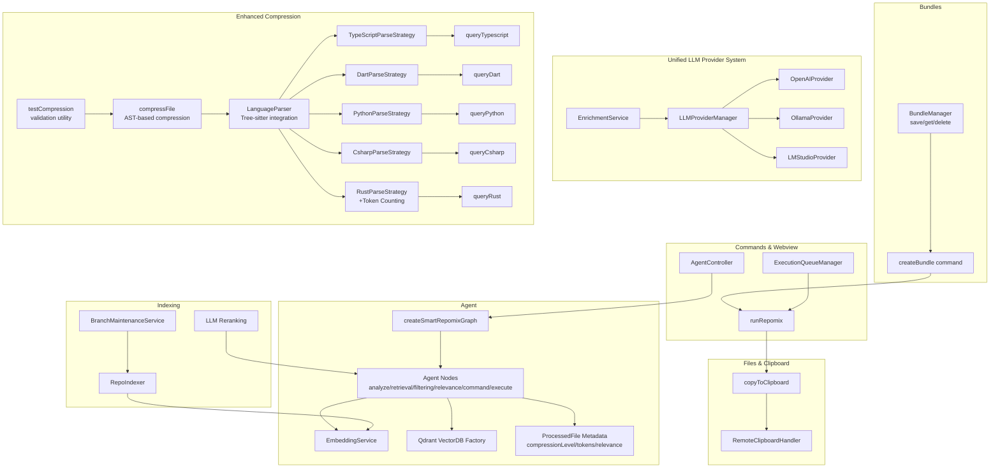
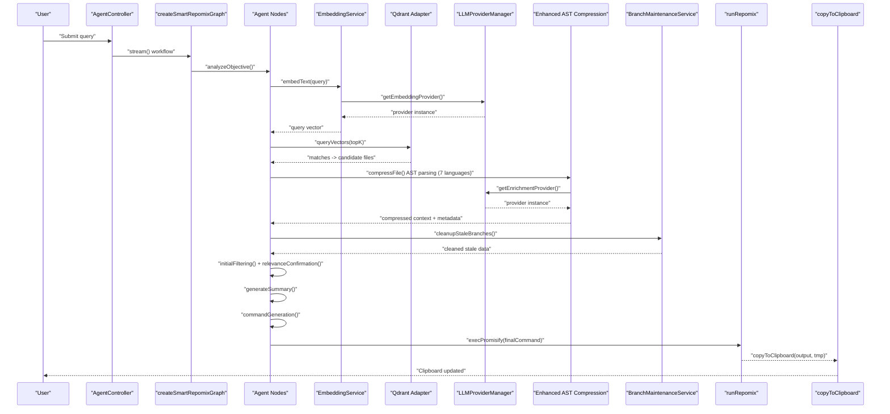
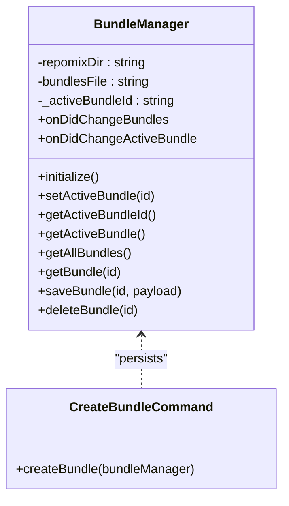
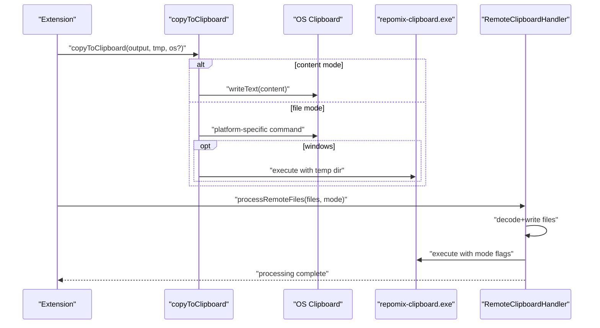
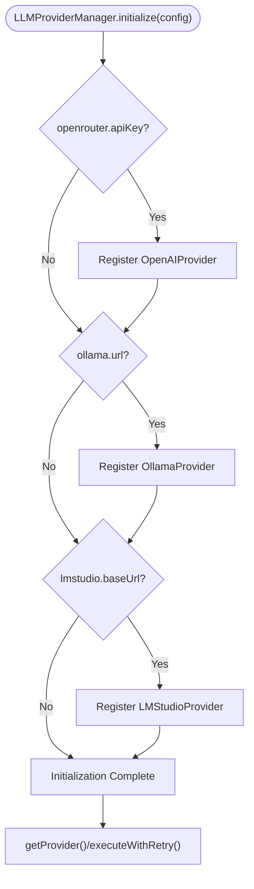
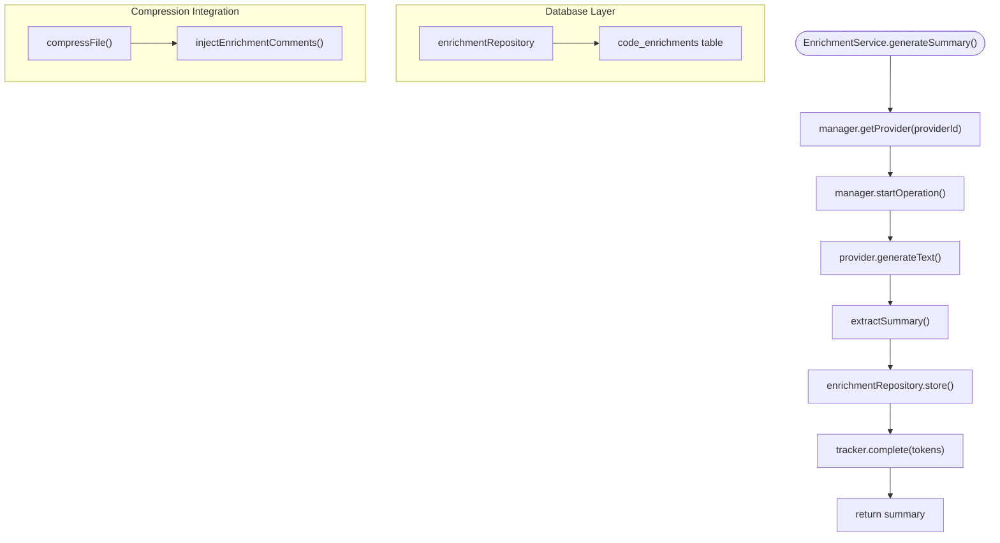
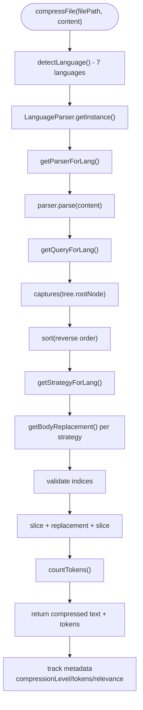
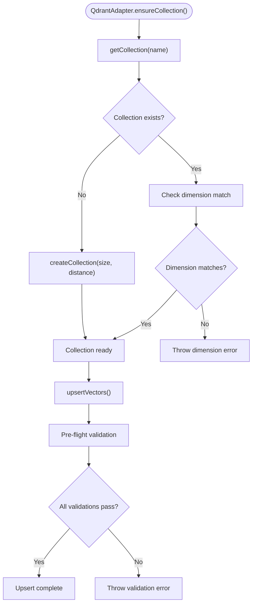
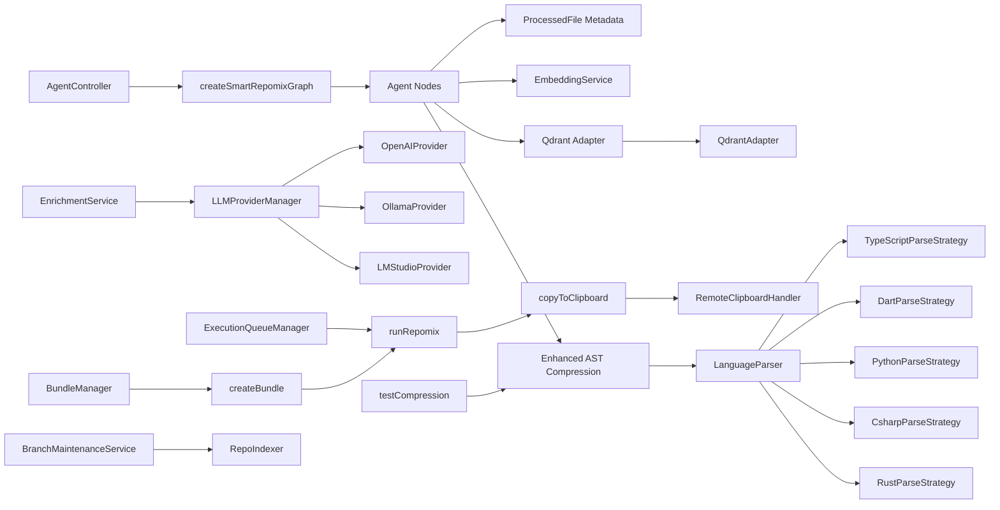

# Core Features

<cite>
**Referenced Files in This Document**
- [bundleManager.ts](file://src/core/bundles/bundleManager.ts)
- [createBundle.ts](file://src/commands/createBundle.ts)
- [runRepomix.ts](file://src/commands/runRepomix.ts)
- [ExecutionQueueManager.ts](file://src/webview/services/ExecutionQueueManager.ts)
- [graph.ts](file://src/agent/graph.ts)
- [nodes.ts](file://src/agent/nodes.ts)
- [embeddingService.ts](file://src/core/indexing/embeddingService.ts)
- [repoIndexer.ts](file://src/core/indexing/repoIndexer.ts)
- [llmReranking.ts](file://src/core/indexing/llmReranking.ts)
- [factory.ts](file://src/core/indexing/vectorDb/factory.ts)
- [copyToClipboard.ts](file://src/core/files/copyToClipboard.ts)
- [remoteClipboardHandler.ts](file://src/webview/handlers/remoteClipboardHandler.ts)
- [AgentController.ts](file://src/webview/controllers/AgentController.ts)
- [configSchema.ts](file://src/config/configSchema.ts)
- [compressFile.ts](file://src/core/compression/compressFile.ts)
- [LanguageParser.ts](file://src/core/compression/LanguageParser.ts)
- [BaseParseStrategy.ts](file://src/core/compression/strategies/BaseParseStrategy.ts)
- [TypeScriptParseStrategy.ts](file://src/core/compression/strategies/TypeScriptParseStrategy.ts)
- [DartParseStrategy.ts](file://src/core/compression/strategies/DartParseStrategy.ts)
- [PythonParseStrategy.ts](file://src/core/compression/strategies/PythonParseStrategy.ts)
- [CsharpParseStrategy.ts](file://src/core/compression/strategies/CsharpParseStrategy.ts)
- [RustParseStrategy.ts](file://src/core/compression/strategies/RustParseStrategy.ts)
- [queryTypescript.ts](file://src/core/compression/queries/queryTypescript.ts)
- [queryDart.ts](file://src/core/compression/queries/queryDart.ts)
- [queryPython.ts](file://src/core/compression/queries/queryPython.ts)
- [queryCsharp.ts](file://src/core/compression/queries/queryCsharp.ts)
- [queryRust.ts](file://src/core/compression/queries/queryRust.ts)
- [BranchMaintenanceService.ts](file://src/core/indexing/BranchMaintenanceService.ts)
- [databaseService.ts](file://src/core/storage/databaseService.ts)
- [LLMProviderManager.ts](file://src/core/llm/LLMProviderManager.ts)
- [BaseProvider.ts](file://src/core/llm/providers/BaseProvider.ts)
- [OpenAIProvider.ts](file://src/core/llm/providers/OpenAIProvider.ts)
- [OllamaProvider.ts](file://src/core/llm/providers/OllamaProvider.ts)
- [LMStudioProvider.ts](file://src/core/llm/providers/LMStudioProvider.ts)
- [EnrichmentService.ts](file://src/core/llm/services/EnrichmentService.ts)
- [qdrantAdapter.ts](file://src/core/indexing/vectorDb/providers/qdrantAdapter.ts)
- [types.ts](file://src/core/indexing/vectorDb/types.ts)
- [ENRICHMENT_README.md](file://ENRICHMENT_README.md)
- [testCompression.ts](file://src/commands/testCompression.ts)
- [state.ts](file://src/agent/state.ts)
- [AGENTS.md](file://src/core/compression/AGENTS.md)
- [COMPRESSION_TESTING.md](file://COMPRESSION_TESTING.md)
- [diagnose-compression.js](file://scripts/diagnose-compression.js)
</cite>

## Update Summary
**Changes Made**
- Removed chat system components and replaced with unified LLM provider architecture
- Added new LLM provider system with OpenAI, Ollama, and LM Studio support
- Introduced code enrichment capabilities with PostgreSQL-backed storage
- Enhanced compression engine with improved AST parsing and token counting
- Streamlined vector database to focus exclusively on Qdrant provider
- Updated configuration options for unified provider management

## Table of Contents
1. [Introduction](#introduction)
2. [Project Structure](#project-structure)
3. [Core Components](#core-components)
4. [Architecture Overview](#architecture-overview)
5. [Detailed Component Analysis](#detailed-component-analysis)
6. [Dependency Analysis](#dependency-analysis)
7. [Performance Considerations](#performance-considerations)
8. [Troubleshooting Guide](#troubleshooting-guide)
9. [Conclusion](#conclusion)

## Introduction
This document details the three primary feature pillars of Repomix Runner Plus:
- Bundle Management System: persistent, organized collections of files and configurations for repeatable runs.
- AI-Powered File Selection: a smart agent workflow that performs semantic search, relevance confirmation, and automated packaging.
- Enhanced Clipboard Operations: cross-platform copy modes, remote clipboard support, and binary integration.

**Updated** The system now features a unified LLM provider architecture supporting multiple providers (OpenAI, Ollama, LM Studio), enhanced code enrichment capabilities with PostgreSQL-backed storage, and streamlined vector database focusing on Qdrant. The compression engine has been enhanced with improved AST parsing and token counting for better context optimization.

It explains how each feature addresses user needs, the workflows they enable, interdependencies among components, configuration options, and practical examples.

## Project Structure
The core features span several subsystems:
- Bundles: persistent storage and lifecycle management for user-defined groups of files and settings.
- Agent: a LangGraph-based workflow orchestrating retrieval, filtering, summarization, command generation, and execution.
- Indexing: repository indexing, embedding generation, and Qdrant-focused vector database adapters for semantic search.
- Files and Clipboard: cross-platform copy-to-clipboard logic, temp file handling, and remote clipboard binary integration.
- Commands and Webview: orchestration of runs, queueing, and UI-driven agent interactions.
- **New** Unified LLM Provider System: centralized provider management with OpenAI, Ollama, and LM Studio support.
- **New** Code Enrichment: AI-generated summaries for code symbols stored in PostgreSQL for enhanced comprehension.
- **New** Enhanced Compression: AST-based file compression system with improved token counting and error handling.

**Diagram sources**
- [bundleManager.ts:6-117](file://src/core/bundles/bundleManager.ts#L6-L117)
- [createBundle.ts:7-31](file://src/commands/createBundle.ts#L7-L31)
- [runRepomix.ts:48-154](file://src/commands/runRepomix.ts#L48-L154)
- [graph.ts:8-67](file://src/agent/graph.ts#L8-L67)
- [nodes.ts:129-742](file://src/agent/nodes.ts#L129-L742)
- [embeddingService.ts:17-68](file://src/core/indexing/embeddingService.ts#L17-L68)
- [factory.ts:17-62](file://src/core/indexing/vectorDb/factory.ts#L17-L62)
- [repoIndexer.ts:28-121](file://src/core/indexing/repoIndexer.ts#L28-L121)
- [llmReranking.ts:43-143](file://src/core/indexing/llmReranking.ts#L43-L143)
- [BranchMaintenanceService.ts:12-32](file://src/core/indexing/BranchMaintenanceService.ts#L12-L32)
- [LLMProviderManager.ts:13-187](file://src/core/llm/LLMProviderManager.ts#L13-L187)
- [OpenAIProvider.ts:26-284](file://src/core/llm/providers/OpenAIProvider.ts#L26-L284)
- [OllamaProvider.ts:18-194](file://src/core/llm/providers/OllamaProvider.ts#L18-L194)
- [LMStudioProvider.ts:19-172](file://src/core/llm/providers/LMStudioProvider.ts#L19-L172)
- [EnrichmentService.ts:14-61](file://src/core/llm/services/EnrichmentService.ts#L14-L61)
- [compressFile.ts:52-172](file://src/core/compression/compressFile.ts#L52-L172)
- [LanguageParser.ts:26-88](file://src/core/compression/LanguageParser.ts#L26-L88)
- [TypeScriptParseStrategy.ts:11-62](file://src/core/compression/strategies/TypeScriptParseStrategy.ts#L11-L62)
- [DartParseStrategy.ts:1-118](file://src/core/compression/strategies/DartParseStrategy.ts#L1-L118)
- [PythonParseStrategy.ts:1-118](file://src/core/compression/strategies/PythonParseStrategy.ts#L1-L118)
- [CsharpParseStrategy.ts:1-118](file://src/core/compression/strategies/CsharpParseStrategy.ts#L1-L118)
- [RustParseStrategy.ts:11-118](file://src/core/compression/strategies/RustParseStrategy.ts#L11-L118)
- [queryTypescript.ts:1-18](file://src/core/compression/queries/queryTypescript.ts#L1-L18)
- [queryDart.ts:1-118](file://src/core/compression/queries/queryDart.ts#L1-L118)
- [queryPython.ts:1-118](file://src/core/compression/queries/queryPython.ts#L1-L118)
- [queryCsharp.ts:1-118](file://src/core/compression/queries/queryCsharp.ts#L1-L118)
- [queryRust.ts:1-22](file://src/core/compression/queries/queryRust.ts#L1-L22)
- [copyToClipboard.ts:52-160](file://src/core/files/copyToClipboard.ts#L52-L160)
- [remoteClipboardHandler.ts:10-190](file://src/webview/handlers/remoteClipboardHandler.ts#L10-L190)
- [ExecutionQueueManager.ts:15-133](file://src/webview/services/ExecutionQueueManager.ts#L15-L133)
- [AgentController.ts:44-178](file://src/webview/controllers/AgentController.ts#L44-L178)
- [testCompression.ts:1-38](file://src/commands/testCompression.ts#L1-L38)
- [state.ts:3-12](file://src/agent/state.ts#L3-L12)

**Section sources**
- [bundleManager.ts:6-117](file://src/core/bundles/bundleManager.ts#L6-L117)
- [createBundle.ts:7-31](file://src/commands/createBundle.ts#L7-L31)
- [runRepomix.ts:48-154](file://src/commands/runRepomix.ts#L48-L154)
- [graph.ts:8-67](file://src/agent/graph.ts#L8-L67)
- [nodes.ts:129-742](file://src/agent/nodes.ts#L129-L742)
- [embeddingService.ts:17-68](file://src/core/indexing/embeddingService.ts#L17-L68)
- [factory.ts:17-62](file://src/core/indexing/vectorDb/factory.ts#L17-L62)
- [repoIndexer.ts:28-121](file://src/core/indexing/repoIndexer.ts#L28-L121)
- [llmReranking.ts:43-143](file://src/core/indexing/llmReranking.ts#L43-L143)
- [copyToClipboard.ts:52-160](file://src/core/files/copyToClipboard.ts#L52-L160)
- [remoteClipboardHandler.ts:10-190](file://src/webview/handlers/remoteClipboardHandler.ts#L10-L190)
- [ExecutionQueueManager.ts:15-133](file://src/webview/services/ExecutionQueueManager.ts#L15-L133)
- [AgentController.ts:44-178](file://src/webview/controllers/AgentController.ts#L44-L178)
- [compressFile.ts:52-172](file://src/core/compression/compressFile.ts#L52-L172)
- [LanguageParser.ts:37-64](file://src/core/compression/LanguageParser.ts#L37-L64)
- [BranchMaintenanceService.ts:6-33](file://src/core/indexing/BranchMaintenanceService.ts#L6-L33)
- [LLMProviderManager.ts:26-52](file://src/core/llm/LLMProviderManager.ts#L26-L52)
- [EnrichmentService.ts:14-61](file://src/core/llm/services/EnrichmentService.ts#L14-L61)
- [testCompression.ts:1-38](file://src/commands/testCompression.ts#L1-L38)
- [state.ts:3-12](file://src/agent/state.ts#L3-L12)

## Core Components
- Bundle Management System
  - Persistent storage of bundles in a workspace-local JSON file.
  - Active bundle tracking and events for UI updates.
  - Creation, retrieval, saving, and deletion of bundles.
- AI-Powered File Selection
  - LangGraph workflow with nodes for objective analysis, retrieval, filtering, relevance confirmation, summary, command generation, and execution.
  - Semantic search powered by embeddings and Qdrant vector database.
  - Structured LLM prompts and caching for performance.
  - **Enhanced** ProcessedFile metadata tracking with compression levels, token counts, and relevance scores for transparent context optimization.
- Enhanced Clipboard Operations
  - Cross-platform copy modes: content (text) and file (binary).
  - Remote clipboard support via a Windows helper binary invoked from a temp directory.
  - OS-specific clipboard commands and dependency checks.
- **New** Unified LLM Provider System
  - Centralized provider management through LLMProviderManager supporting OpenAI, Ollama, and LM Studio.
  - Standardized provider interface with BaseProvider abstract class.
  - Provider capabilities declaration and model information management.
  - Integrated rate limiting and usage tracking across all providers.
  - Structured output generation with JSON schema validation.
- **New** Code Enrichment Capabilities
  - AI-generated summaries for functions, methods, classes, and other symbols.
  - PostgreSQL-backed storage through enrichmentRepository for persistent caching.
  - Integration with compression pipeline for enhanced code comprehension.
  - Configurable provider selection for enrichment generation.
  - Support for dry-run operations and batch processing.
- **New** Enhanced AST-Based Compression System
  - Comprehensive file compression using Tree-sitter AST parsing across seven programming languages.
  - Multi-language support including TypeScript, JavaScript, Dart, Python, C#, and enhanced Rust support.
  - Selective full-code retention via `keepNames` configuration.
  - Advanced body replacement strategy with hierarchical chunk processing and deduplication.
  - Dedicated language-specific strategies for optimal compression quality.
  - **Enhanced** Comprehensive metadata tracking including compression levels, token usage, and relevance scoring.
  - Improved error handling with fallback mechanisms and detailed logging.
  - **Enhanced** Token counting integration for better budget management.

**Section sources**
- [bundleManager.ts:6-117](file://src/core/bundles/bundleManager.ts#L6-L117)
- [createBundle.ts:7-31](file://src/commands/createBundle.ts#L7-L31)
- [graph.ts:8-67](file://src/agent/graph.ts#L8-L67)
- [nodes.ts:129-742](file://src/agent/nodes.ts#L129-L742)
- [embeddingService.ts:17-68](file://src/core/indexing/embeddingService.ts#L17-L68)
- [factory.ts:17-62](file://src/core/indexing/vectorDb/factory.ts#L17-L62)
- [copyToClipboard.ts:52-160](file://src/core/files/copyToClipboard.ts#L52-L160)
- [remoteClipboardHandler.ts:10-190](file://src/webview/handlers/remoteClipboardHandler.ts#L10-L190)
- [LLMProviderManager.ts:13-187](file://src/core/llm/LLMProviderManager.ts#L13-L187)
- [BaseProvider.ts:16-145](file://src/core/llm/providers/BaseProvider.ts#L16-L145)
- [OpenAIProvider.ts:26-284](file://src/core/llm/providers/OpenAIProvider.ts#L26-L284)
- [OllamaProvider.ts:18-194](file://src/core/llm/providers/OllamaProvider.ts#L18-L194)
- [LMStudioProvider.ts:19-172](file://src/core/llm/providers/LMStudioProvider.ts#L19-L172)
- [EnrichmentService.ts:14-61](file://src/core/llm/services/EnrichmentService.ts#L14-L61)
- [compressFile.ts:52-172](file://src/core/compression/compressFile.ts#L52-L172)
- [LanguageParser.ts:26-88](file://src/core/compression/LanguageParser.ts#L26-L88)
- [BranchMaintenanceService.ts:12-32](file://src/core/indexing/BranchMaintenanceService.ts#L12-L32)

## Architecture Overview
The system integrates three pillars around a central execution pipeline with enhanced compression, unified LLM providers, and code enrichment capabilities:
- Users define or select bundles to run.
- The agent optionally discovers relevant files using semantic search and LLM-based filtering.
- **Enhanced** File compression using AST-based techniques improves context quality across seven programming languages with comprehensive metadata tracking.
- **New** Unified LLM provider system manages multiple providers with standardized interfaces and integrated rate limiting.
- **New** Code enrichment system generates AI summaries stored in PostgreSQL for enhanced code comprehension.
- **New** Streamlined vector database focuses exclusively on Qdrant with enhanced error handling and collection management.
- Repomix executes with discovered files, and output is copied according to configuration.

**Diagram sources**
- [AgentController.ts:44-178](file://src/webview/controllers/AgentController.ts#L44-L178)
- [graph.ts:8-67](file://src/agent/graph.ts#L8-L67)
- [nodes.ts:129-742](file://src/agent/nodes.ts#L129-L742)
- [embeddingService.ts:48-60](file://src/core/indexing/embeddingService.ts#L48-L60)
- [factory.ts:17-62](file://src/core/indexing/vectorDb/factory.ts#L17-L62)
- [compressFile.ts:52-172](file://src/core/compression/compressFile.ts#L52-L172)
- [BranchMaintenanceService.ts:12-32](file://src/core/indexing/BranchMaintenanceService.ts#L12-L32)
- [runRepomix.ts:88-123](file://src/commands/runRepomix.ts#L88-L123)
- [copyToClipboard.ts:52-160](file://src/core/files/copyToClipboard.ts#L52-L160)
- [LLMProviderManager.ts:77-88](file://src/core/llm/LLMProviderManager.ts#L77-L88)
- [EnrichmentService.ts:20-44](file://src/core/llm/services/EnrichmentService.ts#L20-L44)

## Detailed Component Analysis

### Bundle Management System
Purpose
- Persist user-defined groups of files and settings.
- Enable quick selection and reuse of predefined configurations.
- Track an active bundle for UI and execution contexts.

Key Behaviors
- Initialize workspace storage directory and metadata file.
- CRUD operations on bundles with JSON persistence.
- Track and emit active bundle changes.
- Create bundles via a form and set them active.

User Workflows
- Create a bundle, add files, and run it.
- Switch active bundle to quickly compare configurations.
- Delete unused bundles to keep workspace tidy.

Interdependencies
- Commands depend on BundleManager for persistence.
- ExecutionQueueManager uses bundle IDs to run bundles.
- UI components subscribe to bundle change events.

**Diagram sources**
- [bundleManager.ts:6-117](file://src/core/bundles/bundleManager.ts#L6-L117)
- [createBundle.ts:7-31](file://src/commands/createBundle.ts#L7-L31)

**Section sources**
- [bundleManager.ts:18-115](file://src/core/bundles/bundleManager.ts#L18-L115)
- [createBundle.ts:7-31](file://src/commands/createBundle.ts#L7-L31)

### AI-Powered File Selection
Purpose
- Automatically discover relevant files for a given query using semantic search and LLM-based filtering.
- Provide a reproducible, auditable run history.
- **Enhanced** Track comprehensive metadata about compression results for transparent context optimization.

Workflow
- Objective analysis: classify task type and relevance criteria.
- Retrieval: embed query and search Qdrant vector database for candidate files.
- **Enhanced** Context compression: apply AST-based compression to improve semantic quality across seven programming languages with detailed metadata tracking.
- Filtering: fast pass to reduce candidate set.
- Relevance confirmation: batched LLM evaluation with confidence thresholds.
- Summary: optional markdown summary of selected files.
- Command generation: build Repomix CLI command with selected files.
- Execution: run Repomix and record run history.

**Enhanced** Semantic Search Infrastructure
- EmbeddingService supports multiple providers and exposes dimensionality.
- Qdrant vector database factory selects provider and adapter per repository.
- RepoIndexer builds a file catalog and clears old entries before indexing.
- **New** BranchMaintenanceService automatically cleans stale branches across vector databases.

**Enhanced** Compression Metadata Tracking
- ProcessedFile interface tracks compressionLevel ('full' | 'skeleton' | 'summary'), tokens, and relevanceScore for each processed file.
- Agent nodes collect detailed compression metrics during context optimization.
- Transparent logging provides insights into compression success rates and fallback scenarios.
- Token estimation provides real-time cost awareness for different compression strategies.

Recommendation Engine
- Retrieval uses vector similarity; fallback to filesystem listing if unavailable.
- LLM reranking refines top candidates using structured prompts and confidence thresholds.
- Nodes cache LLM responses to reduce cost and latency.

**Diagram sources**
- [graph.ts:8-67](file://src/agent/graph.ts#L8-L67)
- [nodes.ts:129-742](file://src/agent/nodes.ts#L129-L742)
- [embeddingService.ts:17-68](file://src/core/indexing/embeddingService.ts#L17-L68)
- [factory.ts:17-62](file://src/core/indexing/vectorDb/factory.ts#L17-L62)
- [repoIndexer.ts:28-121](file://src/core/indexing/repoIndexer.ts#L28-L121)
- [llmReranking.ts:43-143](file://src/core/indexing/llmReranking.ts#L43-L143)
- [compressFile.ts:52-172](file://src/core/compression/compressFile.ts#L52-L172)
- [BranchMaintenanceService.ts:12-32](file://src/core/indexing/BranchMaintenanceService.ts#L12-L32)
- [state.ts:3-12](file://src/agent/state.ts#L3-L12)

**Section sources**
- [graph.ts:8-67](file://src/agent/graph.ts#L8-L67)
- [nodes.ts:129-742](file://src/agent/nodes.ts#L129-L742)
- [embeddingService.ts:17-68](file://src/core/indexing/embeddingService.ts#L17-L68)
- [factory.ts:17-62](file://src/core/indexing/vectorDb/factory.ts#L17-L62)
- [repoIndexer.ts:28-121](file://src/core/indexing/repoIndexer.ts#L28-L121)
- [llmReranking.ts:43-143](file://src/core/indexing/llmReranking.ts#L43-L143)
- [compressFile.ts:52-172](file://src/core/compression/compressFile.ts#L52-L172)
- [BranchMaintenanceService.ts:12-32](file://src/core/indexing/BranchMaintenanceService.ts#L12-L32)
- [state.ts:3-12](file://src/agent/state.ts#L3-L12)

### Enhanced Clipboard Operations
Purpose
- Provide flexible copy modes to clipboard: raw content or entire file.
- Support remote environments by invoking a Windows helper binary when needed.
- Manage temporary files and OS-specific clipboard commands.

Cross-Platform Modes
- Content mode: uses VS Code's clipboard API to copy text.
- File mode: copies a file to the OS clipboard using platform-specific commands or a helper binary.

Remote Clipboard Support
- A remote handler decodes base64-encoded files into a temp directory and invokes a Windows helper binary to set the clipboard.
- The handler manages temp directories, binary discovery, timeouts, and asynchronous cleanup.

**Diagram sources**
- [copyToClipboard.ts:52-160](file://src/core/files/copyToClipboard.ts#L52-L160)
- [remoteClipboardHandler.ts:22-67](file://src/webview/handlers/remoteClipboardHandler.ts#L22-L67)

**Section sources**
- [copyToClipboard.ts:52-160](file://src/core/files/copyToClipboard.ts#L52-L160)
- [remoteClipboardHandler.ts:10-190](file://src/webview/handlers/remoteClipboardHandler.ts#L10-L190)

### **New** Unified LLM Provider System
Purpose
- Provide a centralized, extensible architecture for managing multiple LLM providers.
- Support standardized interfaces across different provider implementations.
- Enable seamless switching between local and cloud-based LLM services.

**Enhanced** Provider Architecture
- LLMProviderManager serves as the central orchestrator for all providers.
- BaseProvider abstract class defines common functionality and enforces interface compliance.
- Provider capabilities declaration with support for text generation, embeddings, and structured output.
- Integrated rate limiting and usage tracking across all providers.

**Supported Providers**
- **OpenAIProvider**: Supports OpenRouter/OpenAI with configurable base URLs and models.
- **OllamaProvider**: Local LLM support with dynamic model discovery and configuration.
- **LMStudioProvider**: Local inference server support with optional API key authentication.

**Enhanced** Provider Capabilities
- Standardized model information and rate limit management.
- Structured output generation with JSON schema validation.
- Provider-specific configuration with validation and error handling.
- Integration with usage tracking and retry mechanisms.

**Enhanced** Configuration Management
- Centralized provider configuration through LLMConfig interface.
- Provider capability-based selection for specific operations.
- Default provider selection with fallback mechanisms.
- Integrated error handling and configuration validation.

**Diagram sources**
- [LLMProviderManager.ts:26-52](file://src/core/llm/LLMProviderManager.ts#L26-L52)
- [BaseProvider.ts:16-145](file://src/core/llm/providers/BaseProvider.ts#L16-L145)
- [OpenAIProvider.ts:57-68](file://src/core/llm/providers/OpenAIProvider.ts#L57-L68)
- [OllamaProvider.ts:38-56](file://src/core/llm/providers/OllamaProvider.ts#L38-L56)
- [LMStudioProvider.ts:38-44](file://src/core/llm/providers/LMStudioProvider.ts#L38-L44)

**Section sources**
- [LLMProviderManager.ts:13-187](file://src/core/llm/LLMProviderManager.ts#L13-L187)
- [BaseProvider.ts:16-145](file://src/core/llm/providers/BaseProvider.ts#L16-L145)
- [OpenAIProvider.ts:26-284](file://src/core/llm/providers/OpenAIProvider.ts#L26-L284)
- [OllamaProvider.ts:18-194](file://src/core/llm/providers/OllamaProvider.ts#L18-L194)
- [LMStudioProvider.ts:19-172](file://src/core/llm/providers/LMStudioProvider.ts#L19-L172)

### **New** Code Enrichment Capabilities
Purpose
- Enhance compressed code output with AI-generated summaries for better comprehension.
- Provide persistent storage of enrichment data for cache invalidation and reuse.
- Integrate seamlessly with the compression pipeline for enhanced developer experience.

**Enhanced** Enrichment Architecture
- EnrichmentService generates summaries using configured LLM providers.
- PostgreSQL-backed storage through enrichmentRepository for persistent caching.
- Integration with compression pipeline for automatic enrichment injection.
- Configurable provider selection with dry-run support.

**Enhanced** Database Integration
- Code enrichment table with fields for file path, symbol information, and summary data.
- Cache invalidation through git commit tracking for automatic refresh.
- Support for batch processing and incremental updates.
- Integration with existing database service infrastructure.

**Enhanced** Provider Integration
- Flexible provider selection supporting Gemini, Ollama, LM Studio, and OpenRouter.
- Configurable generation parameters and retry mechanisms.
- Structured output validation with JSON schema compliance.
- Usage tracking and cost estimation for enrichment operations.

**Enhanced** Compression Integration
- Automatic enrichment injection during compression with comment-based insertion.
- Support for selective enrichment based on symbol types and locations.
- Integration with token counting for budget management.
- Fallback mechanisms when enrichment generation fails.

**Diagram sources**
- [EnrichmentService.ts:20-44](file://src/core/llm/services/EnrichmentService.ts#L20-L44)
- [LLMProviderManager.ts:77-88](file://src/core/llm/LLMProviderManager.ts#L77-L88)
- [ENRICHMENT_README.md:68-85](file://ENRICHMENT_README.md#L68-L85)

**Section sources**
- [EnrichmentService.ts:14-61](file://src/core/llm/services/EnrichmentService.ts#L14-L61)
- [ENRICHMENT_README.md:1-124](file://ENRICHMENT_README.md#L1-L124)

### **New** Enhanced AST-Based Compression System
Purpose
- Provide intelligent file compression using Tree-sitter AST parsing for improved LLM context quality.
- Support seven programming languages with dedicated language-specific parsing strategies.
- Enable selective retention of important code elements while compressing the rest.
- **Enhanced** Provide comprehensive metadata tracking for transparency and debugging.

**Enhanced** Multi-Language Support
- TypeScript/JavaScript: Uses `typescript.wasm` and `TypeScriptParseStrategy`.
- Dart: Uses `dart.wasm` and `DartParseStrategy`.
- Python: Uses `python.wasm` and `PythonParseStrategy` (handles decorators and indentation).
- C#: Uses `csharp.wasm` and `CsharpParseStrategy` (handles namespaces and properties).
- **Enhanced** Rust: Uses `rust.wasm` and `RustParseStrategy` (handles structs, impls, and traits).

**Enhanced** Metadata Tracking System
- ProcessedFile interface includes compressionLevel, tokens, and relevanceScore for detailed tracking.
- Compression results logged with success/failure status and fallback mechanisms.
- Token estimation provides real-time cost awareness for different compression strategies.
- Error handling with graceful fallback to full content when compression fails.

**Enhanced** Advanced Body Replacement Strategy
- Complete rewrite from chunk-based to body replacement approach.
- Processes AST captures in reverse order to preserve indices during replacement.
- Implements sophisticated body detection and replacement logic.
- Handles complex nested structures and maintains syntax validity.

**Enhanced** Token Counting Integration
- Integration with gpt-tokenizer for accurate token counting.
- Fallback character-based estimation when encoding fails.
- Token budget management for compression pipeline optimization.
- Real-time token estimation for cost awareness.

Compression Workflow
- Language detection based on file extensions (.ts, .tsx, .js, .jsx, .dart, .py, .cs, .rs).
- AST parsing using Tree-sitter with language-specific queries.
- Strategy-based extraction of meaningful code constructs with body replacement.
- Hierarchical chunk processing with deduplication and merging.
- Selective full-code retention via `keepNames` configuration.

**Enhanced** Language-Specific Strategies
- **TypeScript/JavaScript**: Optimized for modern JavaScript frameworks and TypeScript features.
- **Dart**: Handles Flutter and Dart-specific syntax patterns.
- **Python**: Manages decorators, indentation, and Pythonic constructs.
- **C#**: Supports namespaces, properties, and .NET framework patterns.
- **Enhanced** Rust: Specialized for structs, enums, traits, and ownership patterns with advanced body replacement.

**Enhanced** Testing and Validation
- Comprehensive testCompression command for manual validation.
- Automated fallback mechanisms with detailed error logging.
- Support for selective retention testing with keepNames parameter.
- Diagnostic script for compression system health verification.

**Diagram sources**
- [compressFile.ts:52-172](file://src/core/compression/compressFile.ts#L52-L172)
- [LanguageParser.ts:90-122](file://src/core/compression/LanguageParser.ts#L90-L122)
- [TypeScriptParseStrategy.ts:12-62](file://src/core/compression/strategies/TypeScriptParseStrategy.ts#L12-L62)
- [DartParseStrategy.ts:12-118](file://src/core/compression/strategies/DartParseStrategy.ts#L12-L118)
- [PythonParseStrategy.ts:12-118](file://src/core/compression/strategies/PythonParseStrategy.ts#L12-L118)
- [CsharpParseStrategy.ts:12-118](file://src/core/compression/strategies/CsharpParseStrategy.ts#L12-L118)
- [RustParseStrategy.ts:12-118](file://src/core/compression/strategies/RustParseStrategy.ts#L12-L118)
- [queryTypescript.ts:1-18](file://src/core/compression/queries/queryTypescript.ts#L1-L18)
- [queryDart.ts:1-118](file://src/core/compression/queries/queryDart.ts#L1-L118)
- [queryPython.ts:1-118](file://src/core/compression/queries/queryPython.ts#L1-L118)
- [queryCsharp.ts:1-118](file://src/core/compression/queries/queryCsharp.ts#L1-L118)
- [queryRust.ts:1-22](file://src/core/compression/queries/queryRust.ts#L1-L22)
- [testCompression.ts:1-38](file://src/commands/testCompression.ts#L1-L38)

**Section sources**
- [compressFile.ts:1-172](file://src/core/compression/compressFile.ts#L1-L172)
- [LanguageParser.ts:37-64](file://src/core/compression/LanguageParser.ts#L37-L64)
- [LanguageParser.ts:90-122](file://src/core/compression/LanguageParser.ts#L90-L122)
- [BaseParseStrategy.ts:10-68](file://src/core/compression/strategies/BaseParseStrategy.ts#L10-L68)
- [TypeScriptParseStrategy.ts:11-62](file://src/core/compression/strategies/TypeScriptParseStrategy.ts#L11-L62)
- [DartParseStrategy.ts:11-118](file://src/core/compression/strategies/DartParseStrategy.ts#L11-L118)
- [PythonParseStrategy.ts:11-118](file://src/core/compression/strategies/PythonParseStrategy.ts#L11-L118)
- [CsharpParseStrategy.ts:11-118](file://src/core/compression/strategies/CsharpParseStrategy.ts#L11-L118)
- [RustParseStrategy.ts:11-118](file://src/core/compression/strategies/RustParseStrategy.ts#L11-L118)
- [queryTypescript.ts:1-18](file://src/core/compression/queries/queryTypescript.ts#L1-L18)
- [queryDart.ts:1-118](file://src/core/compression/queries/queryDart.ts#L1-L118)
- [queryPython.ts:1-118](file://src/core/compression/queries/queryPython.ts#L1-L118)
- [queryCsharp.ts:1-118](file://src/core/compression/queries/queryCsharp.ts#L1-L118)
- [queryRust.ts:1-22](file://src/core/compression/queries/queryRust.ts#L1-L22)
- [testCompression.ts:1-38](file://src/commands/testCompression.ts#L1-L38)
- [AGENTS.md:1-83](file://src/core/compression/AGENTS.md#L1-L83)
- [COMPRESSION_TESTING.md:1-68](file://COMPRESSION_TESTING.md#L1-L68)
- [diagnose-compression.js:1-62](file://scripts/diagnose-compression.js#L1-L62)

### **New** Streamlined Vector Database Architecture
Purpose
- Provide focused, reliable vector database operations centered on Qdrant.
- Simplify configuration and reduce complexity compared to multi-provider approaches.
- Ensure consistent performance and error handling across all vector operations.

**Enhanced** Qdrant-Focused Implementation
- Single provider support with QdrantAdapter as the sole vector database implementation.
- Enhanced collection management with dimension validation and auto-creation.
- Improved error handling with detailed diagnostic information.
- Support for grouped queries and branch-aware filtering.

**Enhanced** Collection Management
- Auto-collection mode generating collection names based on repository identity and embedding configuration.
- Dimension validation ensuring embedding provider and collection configuration match.
- Hosted instance validation requiring API keys for cloud deployments.
- Collection existence verification with clear error messaging.

**Enhanced** Query Operations
- Grouped query support with configurable group sizes and grouping fields.
- Branch-aware filtering for multi-branch repository support.
- Enhanced error handling with specific error messages for different failure scenarios.
- Performance optimizations for large-scale vector operations.

**Enhanced** Error Handling and Diagnostics
- Comprehensive error logging with full API response details.
- Specific error messages for dimension mismatches, connection failures, and invalid data.
- Sample vector inspection for debugging vector data issues.
- Graceful handling of transient network issues and collection validation failures.

**Diagram sources**
- [qdrantAdapter.ts:53-105](file://src/core/indexing/vectorDb/providers/qdrantAdapter.ts#L53-L105)
- [factory.ts:48-116](file://src/core/indexing/vectorDb/factory.ts#L48-L116)

**Section sources**
- [factory.ts:17-116](file://src/core/indexing/vectorDb/factory.ts#L17-L116)
- [qdrantAdapter.ts:12-524](file://src/core/indexing/vectorDb/providers/qdrantAdapter.ts#L12-L524)
- [types.ts:1-55](file://src/core/indexing/vectorDb/types.ts#L1-L55)

## Dependency Analysis
- Bundle Management
  - Depends on VS Code workspace and file system APIs.
  - Used by creation command and execution queue manager.
- Agent
  - Depends on EmbeddingService and Qdrant vector database adapter.
  - Uses structured LLM clients and caches.
  - Persists run history via DatabaseService.
  - **Enhanced** Integrates with enhanced AST compression system for improved context across seven programming languages with comprehensive metadata tracking.
  - **New** Utilizes LLMProviderManager for unified provider management.
  - **New** Integrates with EnrichmentService for code enhancement capabilities.
  - **New** Utilizes BranchMaintenanceService for branch-aware cleanup.
- **New** Unified LLM Provider System
  - Depends on provider-specific implementations (OpenAI, Ollama, LM Studio).
  - Integrates with RateLimitQueue and UsageTracker for resource management.
  - Supports structured output generation with JSON schema validation.
  - Provides standardized interfaces across all provider implementations.
- **New** Code Enrichment System
  - Depends on EnrichmentService and PostgreSQL database integration.
  - Integrates with LLMProviderManager for provider selection.
  - Supports batch processing and incremental updates.
  - Provides cache invalidation through git commit tracking.
- **New** Enhanced Compression System
  - Depends on Tree-sitter WASM parsers and language-specific strategies.
  - Integrates with LanguageParser for unified access to parsers.
  - Supports seven programming languages with shared infrastructure.
  - Dedicated strategies for TypeScript, JavaScript, Dart, Python, C#, and Rust.
  - **Enhanced** Provides ProcessedFile metadata for transparent compression tracking.
  - Includes comprehensive error handling and fallback mechanisms.
  - **Enhanced** Integrates token counting for budget management.
- **New** Streamlined Vector Database
  - Depends exclusively on QdrantAdapter implementation.
  - Integrates with enhanced error handling and collection management.
  - Supports grouped queries and branch-aware filtering.
  - Provides dimension validation and auto-collection creation.
- Clipboard
  - Uses OS-specific commands and a Windows helper binary.
  - Integrates with temp directory manager and VS Code clipboard API.
- Commands and Webview
  - runRepomix orchestrates CLI flags, execution, and post-processing.
  - ExecutionQueueManager coordinates runs and cancellation.

**Diagram sources**
- [bundleManager.ts:6-117](file://src/core/bundles/bundleManager.ts#L6-L117)
- [createBundle.ts:7-31](file://src/commands/createBundle.ts#L7-L31)
- [runRepomix.ts:48-154](file://src/commands/runRepomix.ts#L48-L154)
- [copyToClipboard.ts:52-160](file://src/core/files/copyToClipboard.ts#L52-L160)
- [AgentController.ts:44-178](file://src/webview/controllers/AgentController.ts#L44-L178)
- [graph.ts:8-67](file://src/agent/graph.ts#L8-L67)
- [nodes.ts:129-742](file://src/agent/nodes.ts#L129-L742)
- [embeddingService.ts:17-68](file://src/core/indexing/embeddingService.ts#L17-L68)
- [factory.ts:17-62](file://src/core/indexing/vectorDb/factory.ts#L17-L62)
- [compressFile.ts:52-172](file://src/core/compression/compressFile.ts#L52-L172)
- [LanguageParser.ts:26-88](file://src/core/compression/LanguageParser.ts#L26-L88)
- [TypeScriptParseStrategy.ts:11-62](file://src/core/compression/strategies/TypeScriptParseStrategy.ts#L11-L62)
- [DartParseStrategy.ts:11-118](file://src/core/compression/strategies/DartParseStrategy.ts#L11-L118)
- [PythonParseStrategy.ts:11-118](file://src/core/compression/strategies/PythonParseStrategy.ts#L11-L118)
- [CsharpParseStrategy.ts:11-118](file://src/core/compression/strategies/CsharpParseStrategy.ts#L11-L118)
- [RustParseStrategy.ts:11-118](file://src/core/compression/strategies/RustParseStrategy.ts#L11-L118)
- [remoteClipboardHandler.ts:10-190](file://src/webview/handlers/remoteClipboardHandler.ts#L10-L190)
- [ExecutionQueueManager.ts:15-133](file://src/webview/services/ExecutionQueueManager.ts#L15-L133)
- [BranchMaintenanceService.ts:12-32](file://src/core/indexing/BranchMaintenanceService.ts#L12-L32)
- [LLMProviderManager.ts:13-187](file://src/core/llm/LLMProviderManager.ts#L13-L187)
- [OpenAIProvider.ts:26-284](file://src/core/llm/providers/OpenAIProvider.ts#L26-L284)
- [OllamaProvider.ts:18-194](file://src/core/llm/providers/OllamaProvider.ts#L18-L194)
- [LMStudioProvider.ts:19-172](file://src/core/llm/providers/LMStudioProvider.ts#L19-L172)
- [EnrichmentService.ts:14-61](file://src/core/llm/services/EnrichmentService.ts#L14-L61)
- [qdrantAdapter.ts:12-524](file://src/core/indexing/vectorDb/providers/qdrantAdapter.ts#L12-L524)
- [testCompression.ts:1-38](file://src/commands/testCompression.ts#L1-L38)
- [state.ts:3-12](file://src/agent/state.ts#L3-L12)

**Section sources**
- [bundleManager.ts:6-117](file://src/core/bundles/bundleManager.ts#L6-L117)
- [createBundle.ts:7-31](file://src/commands/createBundle.ts#L7-L31)
- [runRepomix.ts:48-154](file://src/commands/runRepomix.ts#L48-L154)
- [copyToClipboard.ts:52-160](file://src/core/files/copyToClipboard.ts#L52-L160)
- [AgentController.ts:44-178](file://src/webview/controllers/AgentController.ts#L44-L178)
- [graph.ts:8-67](file://src/agent/graph.ts#L8-L67)
- [nodes.ts:129-742](file://src/agent/nodes.ts#L129-L742)
- [embeddingService.ts:17-68](file://src/core/indexing/embeddingService.ts#L17-L68)
- [factory.ts:17-62](file://src/core/indexing/vectorDb/factory.ts#L17-L62)
- [compressFile.ts:52-172](file://src/core/compression/compressFile.ts#L52-L172)
- [LanguageParser.ts:26-88](file://src/core/compression/LanguageParser.ts#L26-L88)
- [BranchMaintenanceService.ts:12-32](file://src/core/indexing/BranchMaintenanceService.ts#L12-L32)
- [LLMProviderManager.ts:13-187](file://src/core/llm/LLMProviderManager.ts#L13-L187)
- [EnrichmentService.ts:14-61](file://src/core/llm/services/EnrichmentService.ts#L14-L61)
- [qdrantAdapter.ts:12-524](file://src/core/indexing/vectorDb/providers/qdrantAdapter.ts#L12-L524)
- [testCompression.ts:1-38](file://src/commands/testCompression.ts#L1-L38)
- [state.ts:3-12](file://src/agent/state.ts#L3-L12)

## Performance Considerations
- Agent
  - Parallel batching with controlled concurrency reduces LLM calls while maintaining rate limits.
  - Response caching minimizes repeated computations for identical queries.
  - Fallbacks prevent stalls when vector DB or network calls fail.
  - **Enhanced** AST compression reduces context size while preserving semantic meaning across seven programming languages with comprehensive metadata tracking.
  - **Enhanced** ProcessedFile metadata enables better context optimization decisions with compressionLevel and token tracking.
  - **New** Unified LLM provider system reduces overhead through centralized management and shared resources.
  - **New** Code enrichment system provides caching layer to avoid redundant AI generations.
- **New** Unified LLM Provider System
  - Centralized provider registration reduces initialization overhead.
  - Shared rate limiting queues across providers optimize resource utilization.
  - Provider capability-based selection prevents unnecessary provider initialization.
  - Structured output generation with JSON schema validation reduces parsing overhead.
- **New** Enhanced Compression System
  - Tree-sitter parser initialization and caching minimize overhead.
  - Language-specific strategies optimize parsing for different code constructs.
  - Advanced body replacement strategy with reverse-order processing preserves indices efficiently.
  - Deduplication and chunk merging reduce memory usage and processing time.
  - Support for seven programming languages with efficient resource sharing.
  - **Enhanced** Token counting integration with gpt-tokenizer provides accurate budget management.
  - **Enhanced** Comprehensive error handling with fallback mechanisms prevents performance degradation from compression failures.
  - **Enhanced** Metadata tracking adds minimal overhead while providing valuable insights for optimization.
- **New** Streamlined Vector Database
  - Single provider focus eliminates provider switching overhead.
  - Auto-collection mode reduces configuration complexity and setup time.
  - Enhanced error handling ensures operations complete without blocking.
  - Grouped queries optimize retrieval performance for multi-symbol searches.
- Indexing
  - Chunked saves and deterministic sorting improve reliability for large repositories.
  - Binary pattern exclusions reduce noise and speed up scans.
  - **Enhanced** Branch-aware indexing prevents redundant processing across branches.
- Clipboard
  - Content mode avoids disk I/O and is instant.
  - File mode leverages native OS mechanisms or a lightweight helper binary.

## Troubleshooting Guide
Common Issues and Resolutions
- Missing API Keys
  - Agent requires a valid API key; without it, runs fail early with a clear message. Save the key in settings or secrets.
  - **New** LLM provider configuration requires valid API keys for cloud providers (OpenAI, Qdrant hosted instances).
- Vector DB Adapter Not Available
  - If the adapter cannot be acquired, the agent falls back to basic file listing. Verify provider configuration and credentials.
  - **New** Qdrant collection validation ensures dimension and configuration match embedding provider settings.
- Clipboard Failures
  - On Linux, ensure the required tool is installed; on Windows, confirm the helper binary is present and executable.
  - Remote clipboard sessions require the Windows helper binary; verify its presence and permissions.
- Bundle Persistence Errors
  - Initialization and save operations log and surface errors; check workspace permissions and disk availability.
- **New** LLM Provider Issues
  - Provider initialization failures indicate misconfiguration or connectivity issues.
  - Rate limit errors require adjusting provider settings or reducing request frequency.
  - Structured output generation failures indicate schema validation errors or provider limitations.
  - **New** Provider capability mismatches require selecting appropriate providers for specific operations.
- **New** Code Enrichment Problems
  - Database connection failures require verifying PostgreSQL configuration and credentials.
  - Provider configuration errors require checking API keys and endpoint settings.
  - Cache invalidation issues require git commit tracking verification.
  - **New** Enrichment generation failures can be resolved by adjusting provider settings or retrying operations.
- **New** Enhanced Compression Issues
  - Tree-sitter WASM parser loading failures indicate missing language support files.
  - AST parsing errors often result from unsupported language features or corrupted source code.
  - Verify language detection matches expected file extensions (.ts, .tsx, .js, .jsx, .dart, .py, .cs, .rs).
  - Check that the corresponding `.wasm` files are present in `assets/tree-sitter-wasm/`.
  - **Enhanced** Compression failures trigger fallback to full content with detailed logging for debugging.
  - **Enhanced** ProcessedFile metadata helps identify which files failed compression and why.
  - **Enhanced** Token counting integration provides budget management insights.
  - **Enhanced** Advanced body replacement strategy requires proper body detection and replacement logic.
- **New** Streamlined Vector Database Failures
  - Collection dimension mismatches require recreating collections with correct embedding dimensions.
  - Hosted Qdrant instances require API key configuration for cloud deployments.
  - Network connectivity issues require checking firewall settings and endpoint accessibility.
  - **New** Auto-collection mode requires proper embedding configuration for successful creation.
- Indexing
  - Chunked saves and deterministic sorting improve reliability for large repositories.
  - Binary pattern exclusions reduce noise and speed up scans.
  - **Enhanced** Branch-aware indexing prevents redundant processing across branches.

**Section sources**
- [AgentController.ts:51-55](file://src/webview/controllers/AgentController.ts#L51-L55)
- [nodes.ts:216-229](file://src/agent/nodes.ts#L216-L229)
- [copyToClipboard.ts:112-118](file://src/core/files/copyToClipboard.ts#L112-L118)
- [remoteClipboardHandler.ts:107-132](file://src/webview/handlers/remoteClipboardHandler.ts#L107-L132)
- [bundleManager.ts:26-29](file://src/core/bundles/bundleManager.ts#L26-L29)
- [LLMProviderManager.ts:77-88](file://src/core/llm/LLMProviderManager.ts#L77-L88)
- [EnrichmentService.ts:20-44](file://src/core/llm/services/EnrichmentService.ts#L20-L44)
- [compressFile.ts:128-131](file://src/core/compression/compressFile.ts#L128-L131)
- [qdrantAdapter.ts:53-105](file://src/core/indexing/vectorDb/providers/qdrantAdapter.ts#L53-L105)
- [BranchMaintenanceService.ts:28-31](file://src/core/indexing/BranchMaintenanceService.ts#L28-L31)
- [state.ts:3-12](file://src/agent/state.ts#L3-L12)

## Conclusion
Repomix Runner Plus delivers a comprehensive toolkit with enhanced capabilities:
- Bundle Management enables persistent, reusable configurations.
- AI-Powered File Selection automates discovery and packaging with semantic search, LLM-based filtering, and **enhanced** AST-based compression across seven programming languages with comprehensive metadata tracking.
- Enhanced Clipboard Operations provide flexible, cross-platform output delivery, including remote environments.
- **New** Unified LLM Provider System offers centralized management of multiple providers with standardized interfaces, integrated rate limiting, and usage tracking.
- **New** Code Enrichment Capabilities provide AI-generated summaries stored in PostgreSQL for enhanced code comprehension and faster development workflows.
- **New** Enhanced AST-Based Compression System improves context quality through intelligent file compression across TypeScript, JavaScript, Dart, Python, C#, Rust, and enhanced language strategies, plus comprehensive metadata tracking for transparency and debugging.
- **New** Streamlined Vector Database Architecture focuses exclusively on Qdrant with enhanced error handling, collection management, and performance optimizations.

These features integrate cleanly through commands, webview controllers, and shared services, offering robust workflows for developers who want reliable, repeatable, and intelligent file packaging with enhanced semantic understanding, comprehensive compression tracking, unified provider management, and code enrichment capabilities across multiple programming languages.