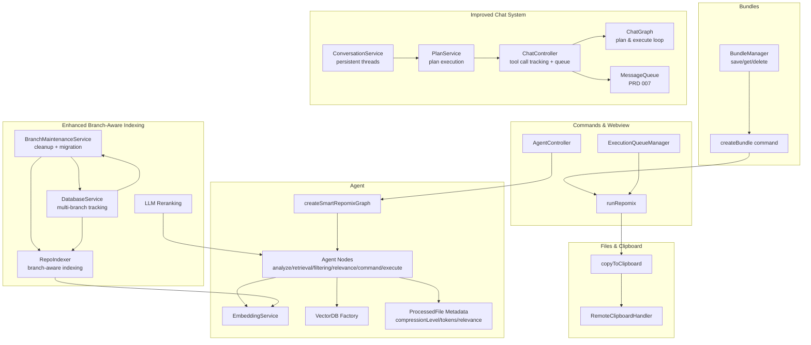
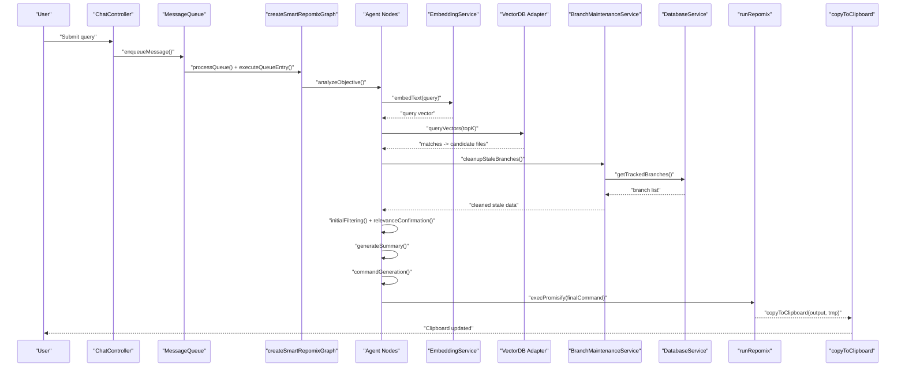
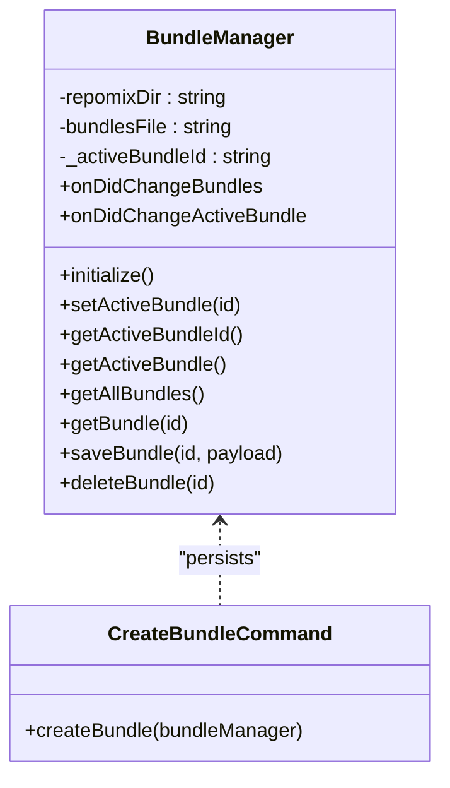
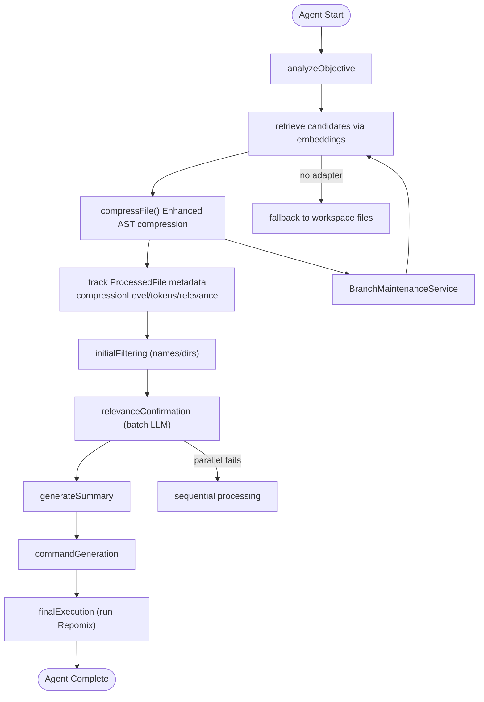
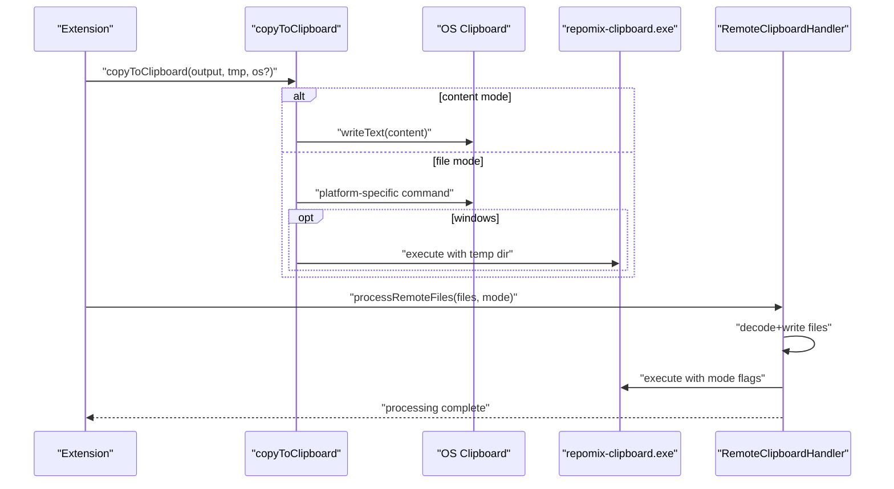
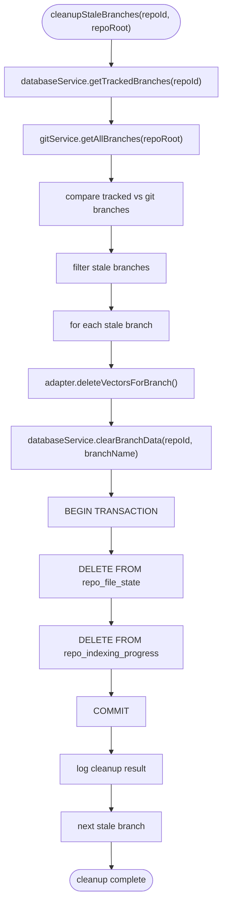
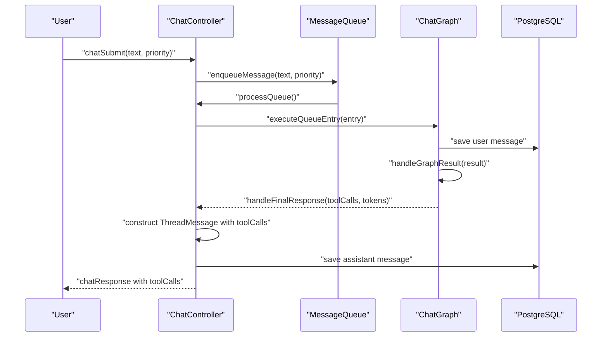
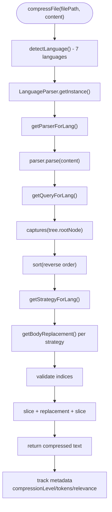
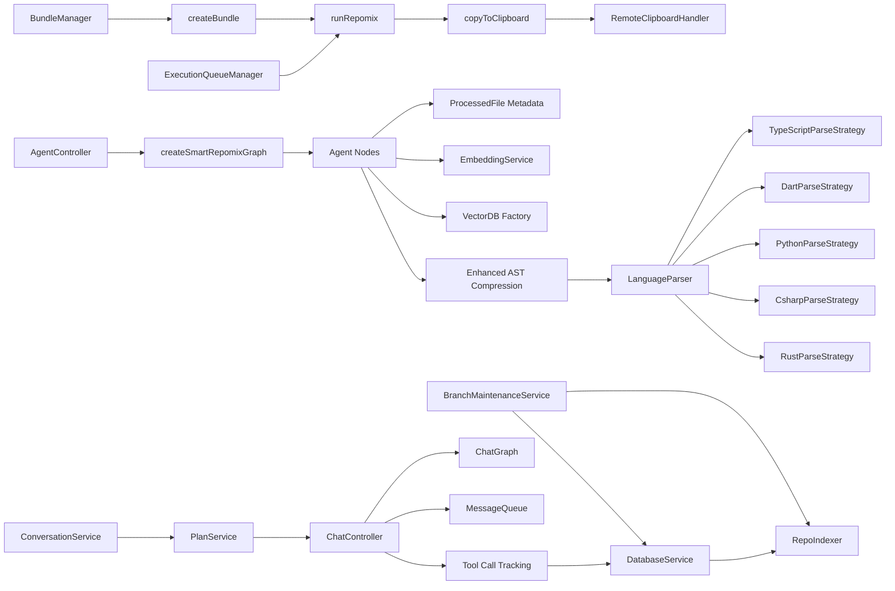

# Core Features

<cite>
**Referenced Files in This Document**
- [bundleManager.ts](file://src/core/bundles/bundleManager.ts)
- [createBundle.ts](file://src/commands/createBundle.ts)
- [runRepomix.ts](file://src/commands/runRepomix.ts)
- [ExecutionQueueManager.ts](file://src/webview/services/ExecutionQueueManager.ts)
- [graph.ts](file://src/agent/graph.ts)
- [nodes.ts](file://src/agent/nodes.ts)
- [embeddingService.ts](file://src/core/indexing/embeddingService.ts)
- [repoIndexer.ts](file://src/core/indexing/repoIndexer.ts)
- [llmReranking.ts](file://src/core/indexing/llmReranking.ts)
- [factory.ts](file://src/core/indexing/vectorDb/factory.ts)
- [copyToClipboard.ts](file://src/core/files/copyToClipboard.ts)
- [remoteClipboardHandler.ts](file://src/webview/handlers/remoteClipboardHandler.ts)
- [AgentController.ts](file://src/webview/controllers/AgentController.ts)
- [configSchema.ts](file://src/config/configSchema.ts)
- [compressFile.ts](file://src/core/compression/compressFile.ts)
- [LanguageParser.ts](file://src/core/compression/LanguageParser.ts)
- [BaseParseStrategy.ts](file://src/core/compression/strategies/BaseParseStrategy.ts)
- [TypeScriptParseStrategy.ts](file://src/core/compression/strategies/TypeScriptParseStrategy.ts)
- [DartParseStrategy.ts](file://src/core/compression/strategies/DartParseStrategy.ts)
- [PythonParseStrategy.ts](file://src/core/compression/strategies/PythonParseStrategy.ts)
- [CsharpParseStrategy.ts](file://src/core/compression/strategies/CsharpParseStrategy.ts)
- [RustParseStrategy.ts](file://src/core/compression/strategies/RustParseStrategy.ts)
- [queryTypescript.ts](file://src/core/compression/queries/queryTypescript.ts)
- [queryDart.ts](file://src/core/compression/queries/queryDart.ts)
- [queryPython.ts](file://src/core/compression/queries/queryPython.ts)
- [queryCsharp.ts](file://src/core/compression/queries/queryCsharp.ts)
- [queryRust.ts](file://src/core/compression/queries/queryRust.ts)
- [BranchMaintenanceService.ts](file://src/core/indexing/BranchMaintenanceService.ts)
- [databaseService.ts](file://src/core/storage/databaseService.ts)
- [conversationService.ts](file://src/services/conversationService.ts)
- [ChatController.ts](file://src/webview/controllers/ChatController.ts)
- [chat.ts](file://src/types/chat.ts)
- [planService.ts](file://src/services/planService.ts)
- [graph.ts](file://src/chat/graph.ts)
- [testCompression.ts](file://src/commands/testCompression.ts)
- [state.ts](file://src/agent/state.ts)
- [AGENTS.md](file://src/core/compression/AGENTS.md)
- [COMPRESSION_TESTING.md](file://COMPRESSION_TESTING.md)
- [diagnose-compression.js](file://scripts/diagnose-compression.js)
- [prompt.md](file://prompt.md)
</cite>

## Update Summary
**Changes Made**
- Enhanced branch-aware indexing architecture with comprehensive database service capabilities for multi-branch repository management
- Improved tool call tracking in ChatController with structured tool call representation and enhanced token accounting
- Added new prompt guidelines documentation for improved AI interaction quality
- Implemented comprehensive branch maintenance with automatic cleanup and schema migration support

## Table of Contents
1. [Introduction](#introduction)
2. [Project Structure](#project-structure)
3. [Core Components](#core-components)
4. [Architecture Overview](#architecture-overview)
5. [Detailed Component Analysis](#detailed-component-analysis)
6. [Dependency Analysis](#dependency-analysis)
7. [Performance Considerations](#performance-considerations)
8. [Troubleshooting Guide](#troubleshooting-guide)
9. [Conclusion](#conclusion)

## Introduction
This document details the three primary feature pillars of Repomix Runner Plus:
- Bundle Management System: persistent, organized collections of files and configurations for repeatable runs.
- AI-Powered File Selection: a smart agent workflow that performs semantic search, relevance confirmation, and automated packaging.
- Enhanced Clipboard Operations: cross-platform copy modes, remote clipboard support, and binary integration.

**Updated** The system now features an enhanced branch-aware indexing architecture with comprehensive database service capabilities, improved tool call tracking in ChatController for better workflow transparency, and new prompt guidelines documentation for optimized AI interactions. These enhancements provide robust multi-branch repository management, structured tool call representation, and improved conversational intelligence.

It explains how each feature addresses user needs, the workflows they enable, interdependencies among components, configuration options, and practical examples.

## Project Structure
The core features span several subsystems:
- Bundles: persistent storage and lifecycle management for user-defined groups of files and settings.
- Agent: a LangGraph-based workflow orchestrating retrieval, filtering, summarization, command generation, and execution.
- Indexing: repository indexing, embedding generation, and vector database adapters for semantic search with branch-aware capabilities.
- Files and Clipboard: cross-platform copy-to-clipboard logic, temp file handling, and remote clipboard binary integration.
- Commands and Webview: orchestration of runs, queueing, and UI-driven agent interactions.
- **New** Enhanced Branch-Aware Indexing: comprehensive multi-branch repository management with automatic cleanup and schema migration.
- **New** Improved Chat System: structured tool call tracking, enhanced token accounting, and message queue management.
- **New** Prompt Guidelines: standardized AI interaction patterns for consistent and effective conversations.

**Diagram sources**
- [bundleManager.ts](file://src/core/bundles/bundleManager.ts#L6-L117)
- [createBundle.ts](file://src/commands/createBundle.ts#L7-L31)
- [runRepomix.ts](file://src/commands/runRepomix.ts#L48-L154)
- [graph.ts](file://src/agent/graph.ts#L8-L67)
- [nodes.ts](file://src/agent/nodes.ts#L129-L742)
- [embeddingService.ts](file://src/core/indexing/embeddingService.ts#L17-L68)
- [factory.ts](file://src/core/indexing/vectorDb/factory.ts#L17-L62)
- [repoIndexer.ts](file://src/core/indexing/repoIndexer.ts#L28-L121)
- [llmReranking.ts](file://src/core/indexing/llmReranking.ts#L43-L143)
- [BranchMaintenanceService.ts](file://src/core/indexing/BranchMaintenanceService.ts#L12-L32)
- [databaseService.ts](file://src/core/storage/databaseService.ts#L383-L507)
- [conversationService.ts](file://src/services/conversationService.ts#L39-L157)
- [planService.ts](file://src/services/planService.ts#L10-L96)
- [ChatController.ts](file://src/webview/controllers/ChatController.ts#L1719-L1952)
- [graph.ts](file://src/chat/graph.ts#L11-L67)
- [copyToClipboard.ts](file://src/core/files/copyToClipboard.ts#L52-L160)
- [remoteClipboardHandler.ts](file://src/webview/handlers/remoteClipboardHandler.ts#L10-L190)
- [ExecutionQueueManager.ts](file://src/webview/services/ExecutionQueueManager.ts#L15-L133)
- [AgentController.ts](file://src/webview/controllers/AgentController.ts#L44-L178)
- [testCompression.ts](file://src/commands/testCompression.ts#L1-L38)
- [state.ts](file://src/agent/state.ts#L3-L12)

**Section sources**
- [bundleManager.ts](file://src/core/bundles/bundleManager.ts#L6-L117)
- [createBundle.ts](file://src/commands/createBundle.ts#L7-L31)
- [runRepomix.ts](file://src/commands/runRepomix.ts#L48-L154)
- [graph.ts](file://src/agent/graph.ts#L8-L67)
- [nodes.ts](file://src/agent/nodes.ts#L129-L742)
- [embeddingService.ts](file://src/core/indexing/embeddingService.ts#L17-L68)
- [factory.ts](file://src/core/indexing/vectorDb/factory.ts#L17-L62)
- [repoIndexer.ts](file://src/core/indexing/repoIndexer.ts#L28-L121)
- [llmReranking.ts](file://src/core/indexing/llmReranking.ts#L43-L143)
- [copyToClipboard.ts](file://src/core/files/copyToClipboard.ts#L52-L160)
- [remoteClipboardHandler.ts](file://src/webview/handlers/remoteClipboardHandler.ts#L10-L190)
- [ExecutionQueueManager.ts](file://src/webview/services/ExecutionQueueManager.ts#L15-L133)
- [AgentController.ts](file://src/webview/controllers/AgentController.ts#L44-L178)
- [compressFile.ts](file://src/core/compression/compressFile.ts#L6-L25)
- [LanguageParser.ts](file://src/core/compression/LanguageParser.ts#L37-L64)
- [BranchMaintenanceService.ts](file://src/core/indexing/BranchMaintenanceService.ts#L6-L33)
- [conversationService.ts](file://src/services/conversationService.ts#L39-L157)
- [ChatController.ts](file://src/webview/controllers/ChatController.ts#L14-L303)
- [planService.ts](file://src/services/planService.ts#L10-L96)
- [testCompression.ts](file://src/commands/testCompression.ts#L1-L38)
- [state.ts](file://src/agent/state.ts#L3-L12)

## Core Components
- Bundle Management System
  - Persistent storage of bundles in a workspace-local JSON file.
  - Active bundle tracking and events for UI updates.
  - Creation, retrieval, saving, and deletion of bundles.
- AI-Powered File Selection
  - LangGraph workflow with nodes for objective analysis, retrieval, filtering, relevance confirmation, summary, command generation, and execution.
  - Semantic search powered by embeddings and vector databases with branch-aware capabilities.
  - Structured LLM prompts and caching for performance.
  - **Enhanced** ProcessedFile metadata tracking with compression levels, token counts, and relevance scores for transparent context optimization.
- Enhanced Clipboard Operations
  - Cross-platform copy modes: content (text) and file (binary).
  - Remote clipboard support via a Windows helper binary invoked from a temp directory.
  - OS-specific clipboard commands and dependency checks.
- **New** Enhanced Branch-Aware Indexing Architecture
  - Comprehensive multi-branch repository management with automatic cleanup and schema migration.
  - DatabaseService provides branch-aware unique indexes and tracking for repo indexing progress.
  - BranchMaintenanceService automatically detects and cleans stale branches across vector databases.
  - Schema migration support with timestamped legacy table naming for backward compatibility.
  - Transaction-safe branch data cleanup with rollback protection.
- **New** Improved Chat System with Enhanced Tool Call Tracking
  - Structured tool call representation with standardized naming conventions (file_edit, file_create, etc.).
  - Enhanced token accounting with input/output token separation and total calculation.
  - Message queue system (PRD 007) for sequential processing with force-send and cancellation capabilities.
  - Abort controller integration for graceful execution cancellation.
  - Comprehensive queue status reporting and persistence across extension restarts.
- **New** Prompt Guidelines Documentation
  - Standardized AI interaction patterns for consistent and effective conversations.
  - Structured role definitions and task-oriented instructions.
  - Follow-up pass methodology for code review and maintenance.

**Section sources**
- [bundleManager.ts](file://src/core/bundles/bundleManager.ts#L6-L117)
- [createBundle.ts](file://src/commands/createBundle.ts#L7-L31)
- [graph.ts](file://src/agent/graph.ts#L8-L67)
- [nodes.ts](file://src/agent/nodes.ts#L129-L742)
- [embeddingService.ts](file://src/core/indexing/embeddingService.ts#L17-L68)
- [factory.ts](file://src/core/indexing/vectorDb/factory.ts#L17-L62)
- [copyToClipboard.ts](file://src/core/files/copyToClipboard.ts#L52-L160)
- [remoteClipboardHandler.ts](file://src/webview/handlers/remoteClipboardHandler.ts#L10-L190)
- [compressFile.ts](file://src/core/compression/compressFile.ts#L74-L132)
- [LanguageParser.ts](file://src/core/compression/LanguageParser.ts#L26-L88)
- [BranchMaintenanceService.ts](file://src/core/indexing/BranchMaintenanceService.ts#L12-L32)
- [databaseService.ts](file://src/core/storage/databaseService.ts#L383-L507)
- [conversationService.ts](file://src/services/conversationService.ts#L39-L157)
- [ChatController.ts](file://src/webview/controllers/ChatController.ts#L1569-L1644)
- [ChatController.ts](file://src/webview/controllers/ChatController.ts#L1719-L1952)
- [prompt.md](file://prompt.md#L1-L52)

## Architecture Overview
The system integrates three pillars around a central execution pipeline with enhanced branch-aware indexing and improved chat capabilities:
- Users define or select bundles to run.
- The agent optionally discovers relevant files using semantic search and LLM-based filtering with branch-aware indexing.
- **Enhanced** File compression using AST-based techniques improves context quality across seven programming languages with comprehensive metadata tracking.
- **New** Branch-aware indexing ensures accurate search results across repository branches with automatic maintenance and schema migration.
- **New** Enhanced chat system provides structured tool call tracking, message queuing, and improved conversational intelligence.
- Repomix executes with discovered files, and output is copied according to configuration.

**Diagram sources**
- [ChatController.ts](file://src/webview/controllers/ChatController.ts#L1719-L1952)
- [ChatController.ts](file://src/webview/controllers/ChatController.ts#L1787-L1853)
- [graph.ts](file://src/agent/graph.ts#L8-L67)
- [nodes.ts](file://src/agent/nodes.ts#L129-L742)
- [embeddingService.ts](file://src/core/indexing/embeddingService.ts#L48-L60)
- [factory.ts](file://src/core/indexing/vectorDb/factory.ts#L17-L62)
- [compressFile.ts](file://src/core/compression/compressFile.ts#L74-L132)
- [BranchMaintenanceService.ts](file://src/core/indexing/BranchMaintenanceService.ts#L12-L32)
- [databaseService.ts](file://src/core/storage/databaseService.ts#L1819-L1845)
- [runRepomix.ts](file://src/commands/runRepomix.ts#L88-L123)
- [copyToClipboard.ts](file://src/core/files/copyToClipboard.ts#L52-L160)

## Detailed Component Analysis

### Bundle Management System
Purpose
- Persist user-defined groups of files and settings.
- Enable quick selection and reuse of predefined configurations.
- Track an active bundle for UI and execution contexts.

Key Behaviors
- Initialize workspace storage directory and metadata file.
- CRUD operations on bundles with JSON persistence.
- Track and emit active bundle changes.
- Create bundles via a form and set them active.

User Workflows
- Create a bundle, add files, and run it.
- Switch active bundle to quickly compare configurations.
- Delete unused bundles to keep workspace tidy.

Interdependencies
- Commands depend on BundleManager for persistence.
- ExecutionQueueManager uses bundle IDs to run bundles.
- UI components subscribe to bundle change events.

**Diagram sources**
- [bundleManager.ts](file://src/core/bundles/bundleManager.ts#L6-L117)
- [createBundle.ts](file://src/commands/createBundle.ts#L7-L31)

**Section sources**
- [bundleManager.ts](file://src/core/bundles/bundleManager.ts#L18-L115)
- [createBundle.ts](file://src/commands/createBundle.ts#L7-L31)

### AI-Powered File Selection
Purpose
- Automatically discover relevant files for a given query using semantic search and LLM-based filtering.
- Provide a reproducible, auditable run history.
- **Enhanced** Track comprehensive metadata about compression results for transparent context optimization.

Workflow
- Objective analysis: classify task type and relevance criteria.
- Retrieval: embed query and search vector database for candidate files.
- **Enhanced** Context compression: apply AST-based compression to improve semantic quality across seven programming languages with detailed metadata tracking.
- Filtering: fast pass to reduce candidate set.
- Relevance confirmation: batched LLM evaluation with confidence thresholds.
- Summary: optional markdown summary of selected files.
- Command generation: build Repomix CLI command with selected files.
- Execution: run Repomix and record run history.

**Enhanced** Semantic Search Infrastructure
- EmbeddingService supports multiple providers and exposes dimensionality.
- VectorDB factory selects provider and adapter per repository.
- RepoIndexer builds a file catalog and clears old entries before indexing.
- **New** BranchMaintenanceService automatically cleans stale branches across vector databases with transaction-safe cleanup.

**Enhanced** Compression Metadata Tracking
- ProcessedFile interface tracks compressionLevel ('full' | 'skeleton' | 'summary'), tokens, and relevanceScore for each processed file.
- Agent nodes collect detailed compression metrics during context optimization.
- Transparent logging provides insights into compression success rates and fallback scenarios.
- Token estimation provides real-time cost awareness for different compression strategies.

Recommendation Engine
- Retrieval uses vector similarity; fallback to filesystem listing if unavailable.
- LLM reranking refines top candidates using structured prompts and confidence thresholds.
- Nodes cache LLM responses to reduce cost and latency.

**Diagram sources**
- [graph.ts](file://src/agent/graph.ts#L8-L67)
- [nodes.ts](file://src/agent/nodes.ts#L129-L742)
- [embeddingService.ts](file://src/core/indexing/embeddingService.ts#L17-L68)
- [factory.ts](file://src/core/indexing/vectorDb/factory.ts#L17-L62)
- [repoIndexer.ts](file://src/core/indexing/repoIndexer.ts#L28-L121)
- [llmReranking.ts](file://src/core/indexing/llmReranking.ts#L43-L143)
- [compressFile.ts](file://src/core/compression/compressFile.ts#L74-L132)
- [BranchMaintenanceService.ts](file://src/core/indexing/BranchMaintenanceService.ts#L12-L32)
- [state.ts](file://src/agent/state.ts#L3-L12)

**Section sources**
- [graph.ts](file://src/agent/graph.ts#L8-L67)
- [nodes.ts](file://src/agent/nodes.ts#L129-L742)
- [embeddingService.ts](file://src/core/indexing/embeddingService.ts#L17-L68)
- [factory.ts](file://src/core/indexing/vectorDb/factory.ts#L17-L62)
- [repoIndexer.ts](file://src/core/indexing/repoIndexer.ts#L28-L121)
- [llmReranking.ts](file://src/core/indexing/llmReranking.ts#L43-L143)
- [compressFile.ts](file://src/core/compression/compressFile.ts#L74-L132)
- [BranchMaintenanceService.ts](file://src/core/indexing/BranchMaintenanceService.ts#L12-L32)
- [state.ts](file://src/agent/state.ts#L3-L12)

### Enhanced Clipboard Operations
Purpose
- Provide flexible copy modes to clipboard: raw content or entire file.
- Support remote environments by invoking a Windows helper binary when needed.
- Manage temporary files and OS-specific clipboard commands.

Cross-Platform Modes
- Content mode: uses VS Code's clipboard API to copy text.
- File mode: copies a file to the OS clipboard using platform-specific commands or a helper binary.

Remote Clipboard Support
- A remote handler decodes base64-encoded files into a temp directory and invokes a Windows helper binary to set the clipboard.
- The handler manages temp directories, binary discovery, timeouts, and asynchronous cleanup.

**Diagram sources**
- [copyToClipboard.ts](file://src/core/files/copyToClipboard.ts#L52-L160)
- [remoteClipboardHandler.ts](file://src/webview/handlers/remoteClipboardHandler.ts#L22-L67)

**Section sources**
- [copyToClipboard.ts](file://src/core/files/copyToClipboard.ts#L52-L160)
- [remoteClipboardHandler.ts](file://src/webview/handlers/remoteClipboardHandler.ts#L10-L190)

### **New** Enhanced Branch-Aware Indexing Architecture
Purpose
- Enable accurate semantic search across multiple repository branches with comprehensive branch management.
- Maintain separate indexing progress and vector data per branch with automatic cleanup.
- Provide schema migration support for backward compatibility and transaction-safe operations.

**Enhanced** Database Service Capabilities
- DatabaseService maintains branch-aware unique indexes for repository indexing progress with composite keys (repo_id, branch_name, file_path).
- Schema migration support with timestamped legacy table naming for backward compatibility.
- Transaction-safe branch data cleanup with rollback protection for reliability.
- Comprehensive branch tracking with getTrackedBranches() method supporting both legacy and branch-aware schemas.

**Enhanced** Branch Maintenance Workflow
- Automatic cleanup of stale branches across vector databases and local storage.
- Schema-aware branch detection comparing tracked branches with actual Git branches.
- Transaction-safe deletion of vectors and branch data with error handling and logging.
- Legacy table migration with timestamped naming for seamless upgrades.

**Enhanced** Migration and Compatibility
- migrateRepoIndexingProgressToBranchAware() handles schema evolution with transaction safety.
- migrateRepoFileStateToBranchAware() adds branch_name column and required indexes.
- Backward compatibility maintained through legacy table preservation during migration.

**Diagram sources**
- [BranchMaintenanceService.ts](file://src/core/indexing/BranchMaintenanceService.ts#L12-L32)
- [databaseService.ts](file://src/core/storage/databaseService.ts#L1847-L1861)
- [databaseService.ts](file://src/core/storage/databaseService.ts#L383-L507)

**Section sources**
- [BranchMaintenanceService.ts](file://src/core/indexing/BranchMaintenanceService.ts#L6-L33)
- [databaseService.ts](file://src/core/storage/databaseService.ts#L383-L507)
- [databaseService.ts](file://src/core/storage/databaseService.ts#L1819-L1845)
- [databaseService.ts](file://src/core/storage/databaseService.ts#L1847-L1861)
- [repoIndexer.ts](file://src/core/indexing/repoIndexer.ts#L28-L121)

### **New** Improved Chat System with Enhanced Tool Call Tracking
Purpose
- Provide structured tool call representation for better workflow transparency and debugging.
- Enable message queue management with sequential processing, force-send, and cancellation capabilities.
- Support comprehensive token accounting and enhanced conversational intelligence.

**Enhanced** Tool Call Tracking
- Structured tool call representation with standardized naming conventions (file_edit, file_create, update_plan).
- Enhanced token accounting with separate input/output token tracking and total calculation.
- Comprehensive tool call metadata including path, relativePath, and isNew flags for plan updates.
- File edit tracking with approval status and action categorization.

**Enhanced** Message Queue System (PRD 007)
- Sequential message processing with queue management and status reporting.
- Force-send capability to bypass queue order for urgent messages.
- Abort controller integration for graceful execution cancellation with proper error handling.
- Queue persistence across extension restarts with serialization/deserialization support.

**Enhanced** Conversation Management
- Thread-based conversation storage with automatic ordering and token usage tracking.
- Enhanced interrupt handling with structured payload types for different workflow states.
- Comprehensive error handling with user notifications and graceful degradation.

**Diagram sources**
- [ChatController.ts](file://src/webview/controllers/ChatController.ts#L1569-L1644)
- [ChatController.ts](file://src/webview/controllers/ChatController.ts#L1719-L1952)
- [ChatController.ts](file://src/webview/controllers/ChatController.ts#L1787-L1853)

**Section sources**
- [ChatController.ts](file://src/webview/controllers/ChatController.ts#L1569-L1644)
- [ChatController.ts](file://src/webview/controllers/ChatController.ts#L1719-L1952)
- [ChatController.ts](file://src/webview/controllers/ChatController.ts#L1787-L1853)
- [chat.ts](file://src/types/chat.ts#L1-L35)

### **New** Enhanced AST-Based Compression System
Purpose
- Provide intelligent file compression using Tree-sitter AST parsing for improved LLM context quality.
- Support seven programming languages with dedicated language-specific parsing strategies.
- Enable selective retention of important code elements while compressing the rest.
- **Enhanced** Provide comprehensive metadata tracking for transparency and debugging.

**Enhanced** Multi-Language Support
- TypeScript/JavaScript: Uses `typescript.wasm` and `TypeScriptParseStrategy`.
- Dart: Uses `dart.wasm` and `DartParseStrategy`.
- Python: Uses `python.wasm` and `PythonParseStrategy` (handles decorators and indentation).
- C#: Uses `csharp.wasm` and `CsharpParseStrategy` (handles namespaces and properties).
- **New** Rust: Uses `rust.wasm` and `RustParseStrategy` (handles structs, impls, and traits).

**Enhanced** Metadata Tracking System
- ProcessedFile interface includes compressionLevel, tokens, and relevanceScore for detailed tracking.
- Compression results logged with success/failure status and fallback mechanisms.
- Token estimation provides real-time cost awareness for different compression strategies.
- Error handling with graceful fallback to full content when compression fails.

**Enhanced** Advanced Body Replacement Strategy
- Complete rewrite from chunk-based to body replacement approach.
- Processes AST captures in reverse order to preserve indices during replacement.
- Implements sophisticated body detection and replacement logic.
- Handles complex nested structures and maintains syntax validity.

Compression Workflow
- Language detection based on file extensions (.ts, .tsx, .js, .jsx, .dart, .py, .cs, .rs).
- AST parsing using Tree-sitter with language-specific queries.
- Strategy-based extraction of meaningful code constructs with body replacement.
- Hierarchical chunk processing with deduplication and merging.
- Selective full-code retention via `keepNames` configuration.

**Enhanced** Language-Specific Strategies
- **TypeScript/JavaScript**: Optimized for modern JavaScript frameworks and TypeScript features.
- **Dart**: Handles Flutter and Dart-specific syntax patterns.
- **Python**: Manages decorators, indentation, and Pythonic constructs.
- **C#**: Supports namespaces, properties, and .NET framework patterns.
- **Rust**: Specialized for structs, enums, traits, and ownership patterns with advanced body replacement.

**Enhanced** Testing and Validation
- Comprehensive testCompression command for manual validation.
- Automated fallback mechanisms with detailed error logging.
- Support for selective retention testing with keepNames parameter.
- Diagnostic script for compression system health verification.

**Diagram sources**
- [compressFile.ts](file://src/core/compression/compressFile.ts#L74-L132)
- [LanguageParser.ts](file://src/core/compression/LanguageParser.ts#L90-L122)
- [TypeScriptParseStrategy.ts](file://src/core/compression/strategies/TypeScriptParseStrategy.ts#L12-L62)
- [DartParseStrategy.ts](file://src/core/compression/strategies/DartParseStrategy.ts#L12-L118)
- [PythonParseStrategy.ts](file://src/core/compression/strategies/PythonParseStrategy.ts#L12-L118)
- [CsharpParseStrategy.ts](file://src/core/compression/strategies/CsharpParseStrategy.ts#L12-L118)
- [RustParseStrategy.ts](file://src/core/compression/strategies/RustParseStrategy.ts#L12-L118)
- [queryTypescript.ts](file://src/core/compression/queries/queryTypescript.ts#L1-L18)
- [queryDart.ts](file://src/core/compression/queries/queryDart.ts#L1-L118)
- [queryPython.ts](file://src/core/compression/queries/queryPython.ts#L1-L118)
- [queryCsharp.ts](file://src/core/compression/queries/queryCsharp.ts#L1-L118)
- [queryRust.ts](file://src/core/compression/queries/queryRust.ts#L1-L22)
- [testCompression.ts](file://src/commands/testCompression.ts#L1-L38)

**Section sources**
- [compressFile.ts](file://src/core/compression/compressFile.ts#L6-L25)
- [compressFile.ts](file://src/core/compression/compressFile.ts#L74-L132)
- [LanguageParser.ts](file://src/core/compression/LanguageParser.ts#L37-L64)
- [LanguageParser.ts](file://src/core/compression/LanguageParser.ts#L90-L122)
- [BaseParseStrategy.ts](file://src/core/compression/strategies/BaseParseStrategy.ts#L10-L68)
- [TypeScriptParseStrategy.ts](file://src/core/compression/strategies/TypeScriptParseStrategy.ts#L11-L62)
- [DartParseStrategy.ts](file://src/core/compression/strategies/DartParseStrategy.ts#L11-L118)
- [PythonParseStrategy.ts](file://src/core/compression/strategies/PythonParseStrategy.ts#L11-L118)
- [CsharpParseStrategy.ts](file://src/core/compression/strategies/CsharpParseStrategy.ts#L11-L118)
- [RustParseStrategy.ts](file://src/core/compression/strategies/RustParseStrategy.ts#L11-L118)
- [queryTypescript.ts](file://src/core/compression/queries/queryTypescript.ts#L1-L18)
- [queryDart.ts](file://src/core/compression/queries/queryDart.ts#L1-L118)
- [queryPython.ts](file://src/core/compression/queries/queryPython.ts#L1-L118)
- [queryCsharp.ts](file://src/core/compression/queries/queryCsharp.ts#L1-L118)
- [queryRust.ts](file://src/core/compression/queries/queryRust.ts#L1-L22)
- [testCompression.ts](file://src/commands/testCompression.ts#L1-L38)
- [AGENTS.md](file://src/core/compression/AGENTS.md#L1-L83)
- [COMPRESSION_TESTING.md](file://COMPRESSION_TESTING.md#L1-L68)
- [diagnose-compression.js](file://scripts/diagnose-compression.js#L1-L62)

### **New** Prompt Guidelines Documentation
Purpose
- Establish standardized AI interaction patterns for consistent and effective conversations.
- Provide structured role definitions and task-oriented instructions for optimal AI performance.
- Implement follow-up pass methodology for code review and maintenance workflows.

**Enhanced** AI Interaction Patterns
- Role-based AI positioning with clear task definitions and responsibilities.
- Follow-up pass methodology targeting lower-priority risks, cleanup items, and maintainability improvements.
- Structured validation processes with concrete findings and implemented fixes.
- Risk assessment prioritization with High, Medium, Low severity categorization.

**Enhanced** Code Review Methodology
- Second focused review after initial fixes for comprehensive coverage.
- Targeted auditing of leftover items and identification of concrete issues.
- Minimal patch implementation for valid findings with validation checks.
- Comprehensive reporting with findings, implemented fixes, and residual risks.

**Enhanced** Documentation Standards
- Required process adherence with confirmation of scope and assumptions.
- Evidence-based findings with file and line references where possible.
- Incremental changes focused on specific issues without broad refactors.
- Validation results with commands run and pass/fail outcomes.

**Section sources**
- [prompt.md](file://prompt.md#L1-L52)

## Dependency Analysis
- Bundle Management
  - Depends on VS Code workspace and file system APIs.
  - Used by creation command and execution queue manager.
- Agent
  - Depends on EmbeddingService and VectorDB adapter factory.
  - Uses structured LLM clients and caches.
  - Persists run history via DatabaseService.
  - **Enhanced** Integrates with enhanced AST compression system for improved context across seven programming languages with comprehensive metadata tracking.
  - **New** Utilizes BranchMaintenanceService for branch-aware cleanup with transaction safety.
- **New** Enhanced Branch-Aware Indexing
  - DatabaseService provides branch-aware unique indexes and comprehensive branch tracking.
  - BranchMaintenanceService depends on DatabaseService and GitService for cleanup operations.
  - Schema migration support with backward compatibility and transaction safety.
- **New** Improved Chat System
  - ChatController depends on MessageQueue for sequential processing and AbortController for cancellation.
  - Enhanced tool call tracking with structured representation and comprehensive metadata.
  - Token accounting integration with DatabaseService for conversation persistence.
- **New** Enhanced Compression System
  - Depends on Tree-sitter WASM parsers and language-specific strategies.
  - Integrates with LanguageParser for unified access to parsers.
  - Supports seven programming languages with shared infrastructure.
  - Dedicated strategies for TypeScript, JavaScript, Dart, Python, C#, and Rust.
  - **Enhanced** Provides ProcessedFile metadata for transparent compression tracking.
  - Includes comprehensive error handling and fallback mechanisms.
- Clipboard
  - Uses OS-specific commands and a Windows helper binary.
  - Integrates with temp directory manager and VS Code clipboard API.
- Commands and Webview
  - runRepomix orchestrates CLI flags, execution, and post-processing.
  - ExecutionQueueManager coordinates runs and cancellation.

**Diagram sources**
- [bundleManager.ts](file://src/core/bundles/bundleManager.ts#L6-L117)
- [createBundle.ts](file://src/commands/createBundle.ts#L7-L31)
- [runRepomix.ts](file://src/commands/runRepomix.ts#L48-L154)
- [copyToClipboard.ts](file://src/core/files/copyToClipboard.ts#L52-L160)
- [AgentController.ts](file://src/webview/controllers/AgentController.ts#L44-L178)
- [graph.ts](file://src/agent/graph.ts#L8-L67)
- [nodes.ts](file://src/agent/nodes.ts#L129-L742)
- [embeddingService.ts](file://src/core/indexing/embeddingService.ts#L17-L68)
- [factory.ts](file://src/core/indexing/vectorDb/factory.ts#L17-L62)
- [compressFile.ts](file://src/core/compression/compressFile.ts#L74-L132)
- [LanguageParser.ts](file://src/core/compression/LanguageParser.ts#L26-L88)
- [TypeScriptParseStrategy.ts](file://src/core/compression/strategies/TypeScriptParseStrategy.ts#L11-L62)
- [DartParseStrategy.ts](file://src/core/compression/strategies/DartParseStrategy.ts#L11-L118)
- [PythonParseStrategy.ts](file://src/core/compression/strategies/PythonParseStrategy.ts#L11-L118)
- [CsharpParseStrategy.ts](file://src/core/compression/strategies/CsharpParseStrategy.ts#L11-L118)
- [RustParseStrategy.ts](file://src/core/compression/strategies/RustParseStrategy.ts#L11-L118)
- [remoteClipboardHandler.ts](file://src/webview/handlers/remoteClipboardHandler.ts#L10-L190)
- [ExecutionQueueManager.ts](file://src/webview/services/ExecutionQueueManager.ts#L15-L133)
- [BranchMaintenanceService.ts](file://src/core/indexing/BranchMaintenanceService.ts#L12-L32)
- [databaseService.ts](file://src/core/storage/databaseService.ts#L383-L507)
- [conversationService.ts](file://src/services/conversationService.ts#L39-L157)
- [planService.ts](file://src/services/planService.ts#L10-L96)
- [ChatController.ts](file://src/webview/controllers/ChatController.ts#L14-L303)
- [graph.ts](file://src/chat/graph.ts#L11-L67)
- [testCompression.ts](file://src/commands/testCompression.ts#L1-L38)
- [state.ts](file://src/agent/state.ts#L3-L12)

**Section sources**
- [bundleManager.ts](file://src/core/bundles/bundleManager.ts#L6-L117)
- [createBundle.ts](file://src/commands/createBundle.ts#L7-L31)
- [runRepomix.ts](file://src/commands/runRepomix.ts#L48-L154)
- [copyToClipboard.ts](file://src/core/files/copyToClipboard.ts#L52-L160)
- [AgentController.ts](file://src/webview/controllers/AgentController.ts#L44-L178)
- [graph.ts](file://src/agent/graph.ts#L8-L67)
- [nodes.ts](file://src/agent/nodes.ts#L129-L742)
- [embeddingService.ts](file://src/core/indexing/embeddingService.ts#L17-L68)
- [factory.ts](file://src/core/indexing/vectorDb/factory.ts#L17-L62)
- [compressFile.ts](file://src/core/compression/compressFile.ts#L74-L132)
- [LanguageParser.ts](file://src/core/compression/LanguageParser.ts#L26-L88)
- [BranchMaintenanceService.ts](file://src/core/indexing/BranchMaintenanceService.ts#L12-L32)
- [databaseService.ts](file://src/core/storage/databaseService.ts#L383-L507)
- [conversationService.ts](file://src/services/conversationService.ts#L39-L157)
- [ChatController.ts](file://src/webview/controllers/ChatController.ts#L14-L303)
- [planService.ts](file://src/services/planService.ts#L10-L96)
- [testCompression.ts](file://src/commands/testCompression.ts#L1-L38)
- [state.ts](file://src/agent/state.ts#L3-L12)

## Performance Considerations
- Agent
  - Parallel batching with controlled concurrency reduces LLM calls while maintaining rate limits.
  - Response caching minimizes repeated computations for identical queries.
  - Fallbacks prevent stalls when vector DB or network calls fail.
  - **Enhanced** AST compression reduces context size while preserving semantic meaning across seven programming languages with comprehensive metadata tracking.
  - **Enhanced** ProcessedFile metadata enables better context optimization decisions with compressionLevel and token tracking.
- **New** Enhanced Branch-Aware Indexing
  - Transaction-safe operations prevent data corruption during cleanup and migration.
  - Schema migration with timestamped legacy tables ensures backward compatibility.
  - Batch processing of stale branches prevents performance degradation.
  - Graceful error handling ensures cleanup doesn't block main operations.
  - Efficient branch comparison using Set data structures minimizes computational overhead.
- **New** Improved Chat System
  - Message queue processing with AbortController provides responsive cancellation.
  - Structured tool call representation reduces parsing overhead and improves debugging.
  - Enhanced token accounting with separate input/output tracking improves cost monitoring.
  - Queue persistence prevents message loss across extension restarts.
- **New** Enhanced Compression System
  - Tree-sitter parser initialization and caching minimize overhead.
  - Language-specific strategies optimize parsing for different code constructs.
  - Advanced body replacement strategy with reverse-order processing preserves indices efficiently.
  - Deduplication and chunk merging reduce memory usage and processing time.
  - Support for seven programming languages with efficient resource sharing.
  - **Enhanced** Comprehensive error handling with fallback mechanisms prevents performance degradation from compression failures.
  - **Enhanced** Metadata tracking adds minimal overhead while providing valuable insights for optimization.
- Indexing
  - Chunked saves and deterministic sorting improve reliability for large repositories.
  - Binary pattern exclusions reduce noise and speed up scans.
  - **Enhanced** Branch-aware indexing prevents redundant processing across branches with transaction safety.
- Clipboard
  - Content mode avoids disk I/O and is instant.
  - File mode leverages native OS mechanisms or a lightweight helper binary.

## Troubleshooting Guide
Common Issues and Resolutions
- Missing API Keys
  - Agent requires a valid API key; without it, runs fail early with a clear message. Save the key in settings or secrets.
- Vector DB Adapter Not Available
  - If the adapter cannot be acquired, the agent falls back to basic file listing. Verify provider configuration and credentials.
- Clipboard Failures
  - On Linux, ensure the required tool is installed; on Windows, confirm the helper binary is present and executable.
  - Remote clipboard sessions require the Windows helper binary; verify its presence and permissions.
- Bundle Persistence Errors
  - Initialization and save operations log and surface errors; check workspace permissions and disk availability.
- **New** Enhanced Branch-Aware Indexing Issues
  - Schema migration failures require manual intervention with timestamped legacy table cleanup.
  - Transaction failures during cleanup indicate database corruption requiring rollback and retry.
  - Branch maintenance failures may result from insufficient permissions with vector database adapters.
  - Git branch detection failures require proper Git installation and repository access.
  - Database connection issues prevent branch tracking and cleanup operations.
- **New** Improved Chat System Issues
  - Message queue persistence failures indicate workspace permission issues or disk space constraints.
  - Tool call tracking failures suggest malformed tool call data or missing tool implementations.
  - Abort controller failures may result from improper signal handling or concurrent operations.
  - Token accounting discrepancies require manual reconciliation of input/output token counts.
- **New** Enhanced Compression Issues
  - Tree-sitter WASM parser loading failures indicate missing language support files.
  - AST parsing errors often result from unsupported language features or corrupted source code.
  - Verify language detection matches expected file extensions (.ts, .tsx, .js, .jsx, .dart, .py, .cs, .rs).
  - Check that the corresponding `.wasm` files are present in `assets/tree-sitter-wasm/`.
  - **Enhanced** Compression failures trigger fallback to full content with detailed logging for debugging.
  - **Enhanced** ProcessedFile metadata helps identify which files failed compression and why.
  - **Enhanced** Advanced body replacement strategy requires proper body detection and replacement logic.
- **New** Prompt Guidelines Issues
  - AI interaction failures may result from unclear role definitions or ambiguous task instructions.
  - Follow-up pass methodology requires proper validation checks and concrete findings.
  - Risk assessment prioritization should follow established severity categories (High, Medium, Low).

**Section sources**
- [AgentController.ts](file://src/webview/controllers/AgentController.ts#L51-L55)
- [nodes.ts](file://src/agent/nodes.ts#L216-L229)
- [copyToClipboard.ts](file://src/core/files/copyToClipboard.ts#L112-L118)
- [remoteClipboardHandler.ts](file://src/webview/handlers/remoteClipboardHandler.ts#L107-L132)
- [bundleManager.ts](file://src/core/bundles/bundleManager.ts#L26-L29)
- [compressFile.ts](file://src/core/compression/compressFile.ts#L128-L131)
- [BranchMaintenanceService.ts](file://src/core/indexing/BranchMaintenanceService.ts#L28-L31)
- [conversationService.ts](file://src/services/conversationService.ts#L46-L49)
- [planService.ts](file://src/services/planService.ts#L66-L94)
- [state.ts](file://src/agent/state.ts#L3-L12)
- [prompt.md](file://prompt.md#L1-L52)

## Conclusion
Repomix Runner Plus delivers a comprehensive toolkit with enhanced capabilities:
- Bundle Management enables persistent, reusable configurations.
- AI-Powered File Selection automates discovery and packaging with semantic search, LLM-based filtering, and **enhanced** AST-based compression across seven programming languages with comprehensive metadata tracking.
- Enhanced Clipboard Operations provide flexible, cross-platform output delivery, including remote environments.
- **New** Enhanced Branch-Aware Indexing Architecture ensures accurate search results across repository branches with automatic maintenance, schema migration, and transaction safety.
- **New** Improved Chat System provides structured tool call tracking, message queue management, and enhanced conversational intelligence with comprehensive token accounting.
- **New** Prompt Guidelines establish standardized AI interaction patterns for consistent and effective conversations with structured validation and risk assessment methodologies.

These features integrate cleanly through commands, webview controllers, and shared services, offering robust workflows for developers who want reliable, repeatable, and intelligent file packaging with enhanced semantic understanding, comprehensive compression tracking, conversation management capabilities, and improved multi-branch repository management across multiple programming languages.