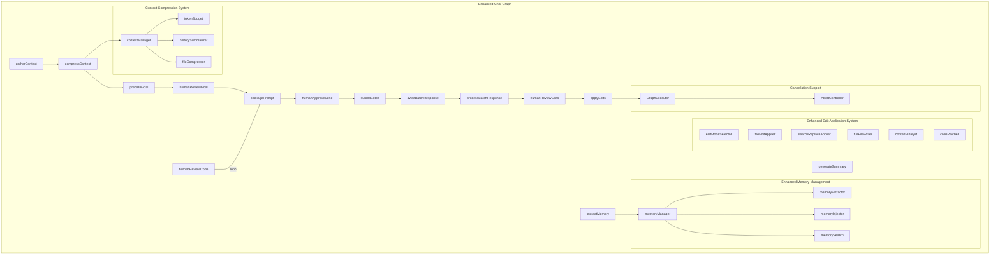
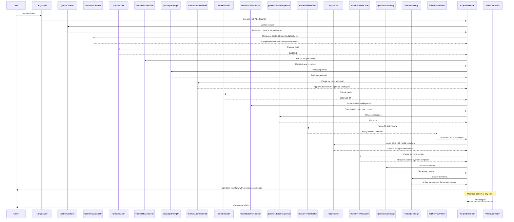
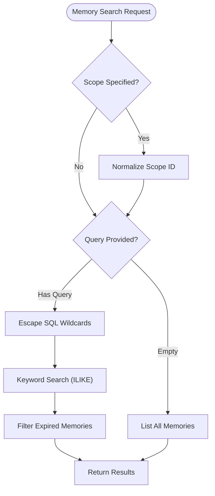
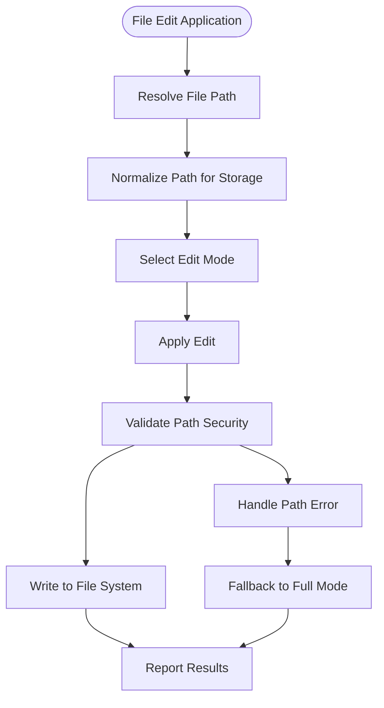
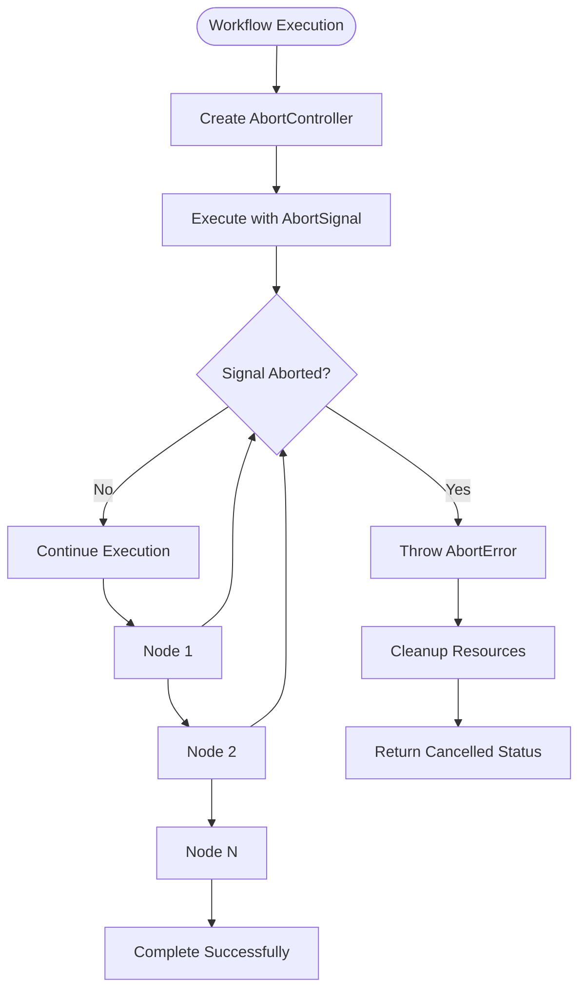
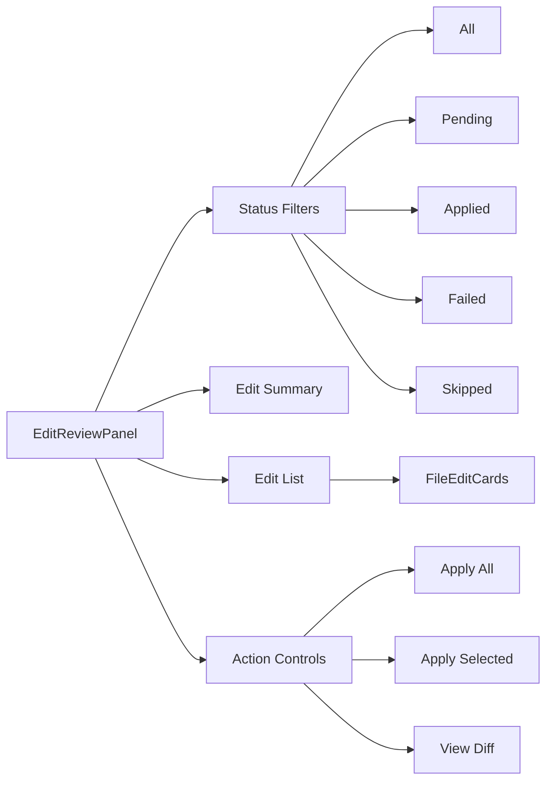
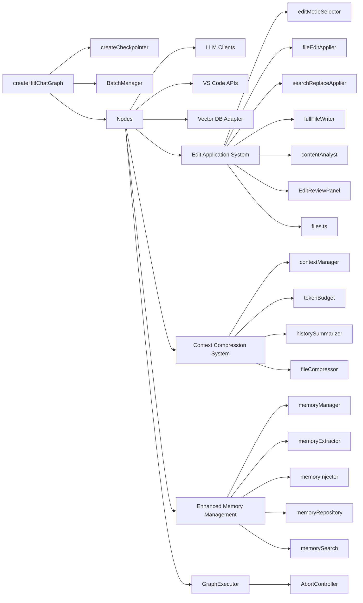

# Human-in-the-Loop Workflow

<cite>
**Referenced Files in This Document**
- [002_langgraph_hitl_workflow.md](file://PRDs/002_langgraph_hitl_workflow.md)
- [003_context_compression_strategy.md](file://PRDs/003_context_compression_strategy.md)
- [004_memory_manager_crud.md](file://PRDs/004_memory_manager_crud.md)
- [graph.ts](file://src/chat/graph.ts)
- [state.ts](file://src/chat/state.ts)
- [compressContext.ts](file://src/chat/nodes/compressContext.ts)
- [contextManager.ts](file://src/chat/compression/contextManager.ts)
- [types.ts](file://src/chat/compression/types.ts)
- [checkpointer.ts](file://src/chat/checkpointer.ts)
- [humanReviewGoal.ts](file://src/chat/nodes/humanReviewGoal.ts)
- [humanApproveSend.ts](file://src/chat/nodes/humanApproveSend.ts)
- [awaitBatchResponse.ts](file://src/chat/nodes/awaitBatchResponse.ts)
- [humanReviewEdits.ts](file://src/chat/nodes/humanReviewEdits.ts)
- [humanReviewCode.ts](file://src/chat/nodes/humanReviewCode.ts)
- [gatherContext.ts](file://src/chat/nodes/gatherContext.ts)
- [prepareGoal.ts](file://src/chat/nodes/prepareGoal.ts)
- [packagePrompt.ts](file://src/chat/nodes/packagePrompt.ts)
- [submitBatch.ts](file://src/chat/nodes/submitBatch.ts)
- [processBatchResponse.ts](file://src/chat/nodes/processBatchResponse.ts)
- [applyEdits.ts](file://src/chat/nodes/applyEdits.ts)
- [extractMemory.ts](file://src/chat/nodes/extractMemory.ts)
- [editModeSelector.ts](file://src/chat/apply/editModeSelector.ts)
- [fileEditApplier.ts](file://src/chat/apply/fileEditApplier.ts)
- [fullFileWriter.ts](file://src/chat/apply/fullFileWriter.ts)
- [searchReplaceApplier.ts](file://src/chat/apply/searchReplaceApplier.ts)
- [types.ts](file://src/chat/apply/types.ts)
- [contentAnalyst.ts](file://src/core/patching/contentAnalyst.ts)
- [codePatcher.ts](file://src/core/patching/codePatcher.ts)
- [types.ts](file://src/core/patching/types.ts)
- [EditReviewPanel.tsx](file://src/webview/components/ai-chat/EditReviewPanel.tsx)
- [ChatSettingsTab.tsx](file://src/webview/components/ai-chat/ChatSettingsTab.tsx)
- [ChatController.ts](file://src/webview/controllers/ChatController.ts)
- [memoryManager.ts](file://src/chat/memory/memoryManager.ts)
- [memoryRepository.ts](file://src/chat/db/memoryRepository.ts)
- [graphExecutor.ts](file://src/chat/queue/graphExecutor.ts)
- [files.ts](file://src/shared/files.ts)
- [MemoryPanel.tsx](file://src/webview/components/ai-chat/MemoryPanel.tsx)
</cite>

## Update Summary
**Changes Made**
- Enhanced memory management with keyword search functionality across both session and repository scopes
- Improved file application logic with cross-platform path normalization and enhanced security checks
- Added comprehensive AbortSignal support throughout the workflow for clean cancellation of operations
- Implemented memory health monitoring with failure tracking and alerting
- Enhanced file edit application with improved path resolution and OS-specific compatibility

## Table of Contents
1. [Introduction](#introduction)
2. [Project Structure](#project-structure)
3. [Core Components](#core-components)
4. [Architecture Overview](#architecture-overview)
5. [Detailed Component Analysis](#detailed-component-analysis)
6. [Enhanced Context Compression System](#enhanced-context-compression-system)
7. [Enhanced Memory Management System](#enhanced-memory-management-system)
8. [Enhanced Edit Application System](#enhanced-edit-application-system)
9. [AbortSignal Support Implementation](#abortsignal-support-implementation)
10. [Edit Review Panel Integration](#edit-review-panel-integration)
11. [Dependency Analysis](#dependency-analysis)
12. [Performance Considerations](#performance-considerations)
13. [Troubleshooting Guide](#troubleshooting-guide)
14. [Conclusion](#conclusion)

## Introduction
This document describes the Human-in-the-Loop (HITL) workflow implemented in the chat graph with enhanced context compression capabilities, persistent memory management, and robust cancellation support. The workflow integrates LangGraph's interrupt/resume primitives to pause execution at strategic checkpoints where users can review, edit, approve, or reject decisions before the system continues. The system now features intelligent context compression with configurable thresholds, sophisticated memory management with keyword search functionality, improved file application logic for cross-platform compatibility, and comprehensive AbortSignal support for clean operation cancellation.

## Project Structure
The HITL workflow is centered around a LangGraph that orchestrates a series of nodes responsible for context gathering, intelligent compression, goal synthesis, packaging, batch submission, response processing, and edit application. The workflow state is persisted using a PostgreSQL-backed checkpointer to support resumption across extension sessions. The enhanced system now includes reactive context compression, persistent memory management with keyword search, and robust cancellation handling.

**Diagram sources**
- [graph.ts](file://src/chat/graph.ts#L78-L154)
- [compressContext.ts](file://src/chat/nodes/compressContext.ts#L36-L124)
- [contextManager.ts](file://src/chat/compression/contextManager.ts#L138-L284)
- [extractMemory.ts](file://src/chat/nodes/extractMemory.ts#L62-L165)
- [memoryManager.ts](file://src/chat/memory/memoryManager.ts#L113-L130)
- [graphExecutor.ts](file://src/chat/queue/graphExecutor.ts#L22-L107)

**Section sources**
- [graph.ts](file://src/chat/graph.ts#L1-L179)
- [state.ts](file://src/chat/state.ts#L1-L287)

## Core Components
- State Management: The ChatState annotation defines all workflow phases, user inputs, intermediate context, outputs, and compression/memory states. It includes fields for workflowPhase, goalText, packagePayload, batchJobId, fileEdits, requestReviewCycle, and comprehensive compression annotations.
- Interrupt Nodes: Five nodes use LangGraph interrupts to yield control back to the UI: humanReviewGoal, humanApproveSend, awaitBatchResponse, humanReviewEdits, and humanReviewCode.
- Persistence: The workflow is compiled with a PostgreSQL-backed checkpointer to persist state across extension restarts.
- Batch Integration: The submitBatch node interacts with a batch manager to submit packages and track job IDs.
- **Enhanced Memory Management**: Keyword search functionality across session and repository scopes, memory health monitoring, and non-blocking extraction with failure tracking.
- **Improved File Application**: Cross-platform path normalization, enhanced security checks, and OS-specific compatibility improvements.
- **Cancellation Support**: Comprehensive AbortSignal implementation for clean operation cancellation throughout the workflow.

**Section sources**
- [state.ts](file://src/chat/state.ts#L51-L287)
- [graph.ts](file://src/chat/graph.ts#L78-L154)
- [memoryManager.ts](file://src/chat/memory/memoryManager.ts#L113-L130)
- [graphExecutor.ts](file://src/chat/queue/graphExecutor.ts#L112-L161)

## Architecture Overview
The HITL workflow follows a structured pipeline with explicit user checkpoints, intelligent context compression, persistent memory management, and robust cancellation support:

**Diagram sources**
- [graph.ts](file://src/chat/graph.ts#L78-L154)
- [compressContext.ts](file://src/chat/nodes/compressContext.ts#L36-L124)
- [extractMemory.ts](file://src/chat/nodes/extractMemory.ts#L62-L165)
- [humanReviewGoal.ts](file://src/chat/nodes/humanReviewGoal.ts#L26-L52)
- [humanApproveSend.ts](file://src/chat/nodes/humanApproveSend.ts#L41-L74)
- [awaitBatchResponse.ts](file://src/chat/nodes/awaitBatchResponse.ts#L21-L49)
- [humanReviewEdits.ts](file://src/chat/nodes/humanReviewEdits.ts#L27-L69)
- [humanReviewCode.ts](file://src/chat/nodes/humanReviewCode.ts#L23-L59)
- [EditReviewPanel.tsx](file://src/webview/components/ai-chat/EditReviewPanel.tsx#L73-L232)
- [graphExecutor.ts](file://src/chat/queue/graphExecutor.ts#L112-L161)

## Detailed Component Analysis

### Workflow Phases and State
The workflow tracks progress through distinct phases: idle, gathering, goal_review, packaging, send_review, batch_pending, response_review, applying, code_review, and complete. The state includes:
- workflowPhase: Tracks current phase for UI synchronization
- goalText: Editable goal synthesized from user query and context
- packagePayload: Structured payload for batch submission
- batchJobId: Reference to submitted batch job
- fileEdits: Parsed edits from batch response with status tracking
- requestReviewCycle: Flag to loop back for another review cycle
- **Enhanced Compression State**: contextThresholdPercent, currentTokenCount, compressionApplied, compressedHistory, maxRecentMessages, modelContextWindow, compressionLevel, tokenBudget
- **Enhanced Memory State**: activeMemories, memoryExtractionFailureCount, memoryExtractionLastAlertAt

**Section sources**
- [state.ts](file://src/chat/state.ts#L9-L24)
- [state.ts](file://src/chat/state.ts#L237-L287)

### Context Gathering
The gatherContext node performs vector search against the repository, extracts dependencies from package manifests, and prepares the initial context for goal synthesis. It reports progress and handles abort signals.

**Section sources**
- [gatherContext.ts](file://src/chat/nodes/gatherContext.ts#L41-L149)

### Intelligent Context Compression
The compressContext node evaluates current token usage against configurable thresholds and applies multi-level compression when needed. It uses reactive compression (only triggers when needed) and integrates with the contextManager for orchestration.

**Section sources**
- [compressContext.ts](file://src/chat/nodes/compressContext.ts#L36-L124)

### Goal Synthesis
The prepareGoal node builds a structured prompt incorporating retrieved context, repository architecture, dependencies, and injected memory context. It invokes an LLM to synthesize a concise goal text and calculates token/cost metrics.

**Section sources**
- [prepareGoal.ts](file://src/chat/nodes/prepareGoal.ts#L16-L91)

### Human Review: Goal
The humanReviewGoal node interrupts the graph to present the synthesized goal and context files to the user. Users can edit the goal text and adjust the set of context files. On resume, the state updates with user modifications and transitions to packaging.

**Section sources**
- [humanReviewGoal.ts](file://src/chat/nodes/humanReviewGoal.ts#L26-L52)

### Packaging
The packagePrompt node constructs the final package payload from the goal, context files, repository architecture, dependencies, and inferred output instruction. It validates token budget usage and transitions to send approval.

**Section sources**
- [packagePrompt.ts](file://src/chat/nodes/packagePrompt.ts#L37-L86)

### Human Approval: Send
The humanApproveSend node interrupts to present the package card and estimated token usage. Users can approve or decline sending to the batch API. If approved, it captures optional package identifiers and transitions to batch submission.

**Section sources**
- [humanApproveSend.ts](file://src/chat/nodes/humanApproveSend.ts#L41-L74)

### Batch Submission
The submitBatch node submits the package to the batch manager and records the resulting batch job ID. It handles cases where no package is present or the manager is unavailable.

**Section sources**
- [submitBatch.ts](file://src/chat/nodes/submitBatch.ts#L15-L57)

### Await Batch Response
The awaitBatchResponse node interrupts while polling for batch completion. An external poller resumes the graph when the batch reaches a terminal state, passing back completion status and response content.

**Section sources**
- [awaitBatchResponse.ts](file://src/chat/nodes/awaitBatchResponse.ts#L21-L49)

### Process Batch Response
The processBatchResponse node parses the raw batch response into structured file edits. If parsing fails, it surfaces the raw content as a manual review file edit. It transitions to edit review or completes if no edits are produced.

**Section sources**
- [processBatchResponse.ts](file://src/chat/nodes/processBatchResponse.ts#L18-L50)

### Human Review: Edits
The humanReviewEdits node interrupts to present file changes for approval. Users can approve specific edits, which are then marked in state. If no edits are approved, the workflow completes; otherwise, it proceeds to apply edits.

**Section sources**
- [humanReviewEdits.ts](file://src/chat/nodes/humanReviewEdits.ts#L27-L69)

### Apply Edits
The applyEdits node writes approved changes to the workspace using VS Code APIs with enhanced edit mode selection and comprehensive error handling. It supports create, edit (including search/replace), and delete actions with security checks to prevent path traversal. It reports results and transitions to code review.

**Section sources**
- [applyEdits.ts](file://src/chat/nodes/applyEdits.ts#L10-L116)

### Human Review: Code
The humanReviewCode node optionally loops back for another review cycle. If requested, it resets relevant state and returns to packaging; otherwise, it completes the workflow and generates a summary.

**Section sources**
- [humanReviewCode.ts](file://src/chat/nodes/humanReviewCode.ts#L23-L59)

### Memory Extraction
The extractMemory node runs after workflow completion to identify and store memorable facts from the conversation. It uses LLM-based extraction with auto-detection of relevant knowledge, tracks extraction health, and stores it in the persistent memory system.

**Section sources**
- [extractMemory.ts](file://src/chat/nodes/extractMemory.ts#L62-L165)

## Enhanced Memory Management System

### Keyword Search Functionality
The enhanced memory management system now includes comprehensive keyword search capabilities across both session and repository scopes:

**Diagram sources**
- [memoryManager.ts](file://src/chat/memory/memoryManager.ts#L113-L130)
- [memoryRepository.ts](file://src/chat/db/memoryRepository.ts#L245-L263)

### Memory Health Monitoring
The system implements comprehensive health monitoring for memory extraction operations:

- **Failure Tracking**: Tracks consecutive extraction failures with exponential backoff
- **Alert System**: Provides user notifications after threshold breaches
- **Cooldown Periods**: Prevents alert spam with configurable cooldown periods
- **Non-blocking Operations**: Extraction failures don't prevent workflow completion

**Section sources**
- [extractMemory.ts](file://src/chat/nodes/extractMemory.ts#L32-L60)
- [memoryManager.ts](file://src/chat/memory/memoryManager.ts#L113-L130)

### Enhanced Memory Storage and Retrieval
The memory system now supports:
- **Cross-platform Path Normalization**: Ensures consistent storage across different operating systems
- **Keyword Search**: Case-insensitive search across both keys and values
- **Expiration Handling**: Automatic filtering of expired memories
- **Scope Validation**: Strict validation for session vs repository memory scopes

**Section sources**
- [memoryRepository.ts](file://src/chat/db/memoryRepository.ts#L245-L263)
- [memoryManager.ts](file://src/chat/memory/memoryManager.ts#L27-L39)

## Enhanced Edit Application System

### Cross-Platform Path Compatibility
The file application system now includes comprehensive cross-platform compatibility improvements:

**Diagram sources**
- [fileEditApplier.ts](file://src/chat/apply/fileEditApplier.ts#L34-L68)
- [files.ts](file://src/shared/files.ts#L57-L69)

### Enhanced Security and Validation
The system now includes:
- **Path Resolution**: Resolves file paths to handle case sensitivity and encoding issues
- **Cross-Platform Normalization**: Converts between OS-specific separators and storage format
- **Security Validation**: Ensures all file operations stay within workspace boundaries
- **OS-Specific Compatibility**: Handles different path separators and file system semantics

**Section sources**
- [fileEditApplier.ts](file://src/chat/apply/fileEditApplier.ts#L34-L68)
- [files.ts](file://src/shared/files.ts#L57-L69)
- [fullFileWriter.ts](file://src/chat/apply/fullFileWriter.ts#L17-L26)

### Improved Edit Mode Selection
The edit mode selection logic now includes enhanced path resolution and OS compatibility:

**Section sources**
- [editModeSelector.ts](file://src/chat/apply/editModeSelector.ts#L28-L49)

## AbortSignal Support Implementation

### Comprehensive Cancellation Framework
The workflow now supports clean cancellation at every stage through a robust AbortSignal implementation:

**Diagram sources**
- [graphExecutor.ts](file://src/chat/queue/graphExecutor.ts#L112-L161)
- [applyEdits.ts](file://src/chat/nodes/applyEdits.ts#L11-L57)

### Cancellation Handling Throughout Workflow
The AbortSignal support is implemented across all major workflow components:

- **Graph Execution**: Centralized cancellation through GraphExecutor
- **Node Operations**: Individual nodes check for cancellation signals
- **File Operations**: File system operations respect cancellation
- **Database Operations**: PostgreSQL queries can be cancelled
- **API Calls**: LLM and external service calls support cancellation

**Section sources**
- [graphExecutor.ts](file://src/chat/queue/graphExecutor.ts#L112-L161)
- [applyEdits.ts](file://src/chat/nodes/applyEdits.ts#L11-L57)

## Edit Review Panel Integration

### Comprehensive Edit Review Interface
The EditReviewPanel provides an enhanced user interface for reviewing and managing file edits with advanced filtering and status tracking:

**Diagram sources**
- [EditReviewPanel.tsx](file://src/webview/components/ai-chat/EditReviewPanel.tsx#L73-L232)

### Advanced Filtering and Status Tracking
The panel supports comprehensive filtering by edit status and provides detailed summary statistics:

**Section sources**
- [EditReviewPanel.tsx](file://src/webview/components/ai-chat/EditReviewPanel.tsx#L85-L148)

### Chat Settings Integration
The edit application system integrates with the new chat settings system for configurable behavior:

**Section sources**
- [ChatSettingsTab.tsx](file://src/webview/components/ai-chat/ChatSettingsTab.tsx#L344-L386)

## Dependency Analysis
The chat graph depends on:
- PostgreSQL-backed checkpointer for state persistence
- Batch manager for submitting packages and tracking jobs
- LLM clients for goal synthesis, compression, and memory extraction
- VS Code APIs for applying file edits
- Vector database adapters for context retrieval
- **Enhanced Compression Dependencies**: Token budget calculators, history summarizers, file compressors, and context managers
- **Enhanced Memory Management Dependencies**: Memory repositories with keyword search, extraction engines, and injection systems
- **Cancellation Dependencies**: AbortController implementation, GraphExecutor for coordinated cancellation
- **Cross-Platform Dependencies**: Path normalization utilities, OS-specific file handling

**Diagram sources**
- [graph.ts](file://src/chat/graph.ts#L78-L154)
- [compressContext.ts](file://src/chat/nodes/compressContext.ts#L1-L125)
- [extractMemory.ts](file://src/chat/nodes/extractMemory.ts#L1-L166)
- [memoryManager.ts](file://src/chat/memory/memoryManager.ts#L1-L156)
- [graphExecutor.ts](file://src/chat/queue/graphExecutor.ts#L1-L173)

**Section sources**
- [graph.ts](file://src/chat/graph.ts#L6-L24)

## Performance Considerations
- Token Budget Validation: The packagePrompt node validates prompt token usage against a calculated budget to prevent exceeding model context windows.
- Conditional Edge Looping: The humanReviewCode node conditionally loops back to packaging, enabling iterative refinement without restarting the entire workflow.
- **Enhanced Cancellation Performance**: AbortSignal support allows immediate termination of long-running operations without resource leaks.
- Progress Reporting: Each node reports progress to the UI, improving responsiveness and user feedback.
- **Enhanced Memory Performance**: Keyword search uses efficient ILIKE queries with proper wildcard escaping to minimize database load.
- **Improved File Operation Performance**: Cross-platform path normalization reduces file system errors and retries.
- **Smart Error Handling**: Comprehensive error tracking and recovery mechanisms improve system reliability.
- **UI Responsiveness**: EditReviewPanel provides real-time feedback and status updates during edit application.
- **Reactive Compression**: Context compression only triggers when needed, minimizing overhead for short conversations.
- **Non-blocking Memory Operations**: Memory extraction failures don't prevent workflow completion, ensuring system resilience.
- **Aggressive Trimming**: Compression system includes safety mechanisms to ensure final context always fits within budget.

## Troubleshooting Guide
Common issues and resolutions:
- Missing API Key: If no API key is available, goal synthesis falls back to using the raw user query as the goal text.
- Batch Manager Unavailable: If the batch manager is not initialized, batch submission returns a failure response and completes the workflow.
- No Edits to Apply: If no edits are approved, the workflow completes without applying changes.
- External Poller Failure: If the batch does not complete successfully, the awaitBatchResponse node returns an error message and completes the workflow.
- Workspace Not Found: If no workspace folder is available, edit application is skipped and the workflow transitions to code review.
- **Memory Search Issues**: If keyword search returns unexpected results, check for proper wildcard escaping and case sensitivity.
- **Cancellation Problems**: If operations don't cancel properly, ensure AbortController is properly managed and signal listeners are cleaned up.
- **Path Resolution Failures**: If file paths aren't resolving correctly, verify cross-platform path normalization and OS-specific separator handling.
- **Compression Threshold Issues**: If compression threshold is too low/high, adjust repomix.chat.contextThresholdPercent setting.
- **Memory Extraction Failures**: Extraction failures are tracked and alerted after threshold breaches; check API key/network connectivity and extension logs.
- **Edit Mode Issues**: If edit mode selection fails, the system automatically falls back to full mode for safety.
- **Search/Replace Matching**: If fuzzy matching fails, the system provides detailed error messages with suggested alternatives.
- **Path Security**: Path traversal attempts are automatically detected and blocked with appropriate error reporting.
- **Memory Scope Validation**: Session memories require valid threadId UUID; repository memories use repoId scope.

**Section sources**
- [prepareGoal.ts](file://src/chat/nodes/prepareGoal.ts#L30-L37)
- [submitBatch.ts](file://src/chat/nodes/submitBatch.ts#L30-L37)
- [applyEdits.ts](file://src/chat/nodes/applyEdits.ts#L14-L20)
- [awaitBatchResponse.ts](file://src/chat/nodes/awaitBatchResponse.ts#L25-L30)
- [compressContext.ts](file://src/chat/nodes/compressContext.ts#L44-L50)
- [extractMemory.ts](file://src/chat/nodes/extractMemory.ts#L73-L77)
- [editModeSelector.ts](file://src/chat/apply/editModeSelector.ts#L46-L50)
- [searchReplaceApplier.ts](file://src/chat/apply/searchReplaceApplier.ts#L125-L131)
- [memoryManager.ts](file://src/chat/memory/memoryManager.ts#L113-L130)
- [graphExecutor.ts](file://src/chat/queue/graphExecutor.ts#L112-L161)

## Conclusion
The HITL workflow integrates user oversight at every major decision point, leveraging LangGraph interrupts to pause and resume execution. With the enhanced edit application system featuring configurable modes, sophisticated review capabilities, cross-platform compatibility, and comprehensive cancellation support, the system ensures safe, transparent, and efficient automation of codebase interactions. The integration of intelligent context compression with reactive threshold detection, persistent memory management with keyword search functionality, and robust cancellation handling provides a comprehensive solution for long-running conversations while maintaining optimal performance and user experience. The enhanced persistence with PostgreSQL-backed checkpointer ensures seamless continuation of workflows across extension sessions, making the system robust for complex development scenarios.