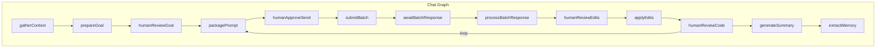
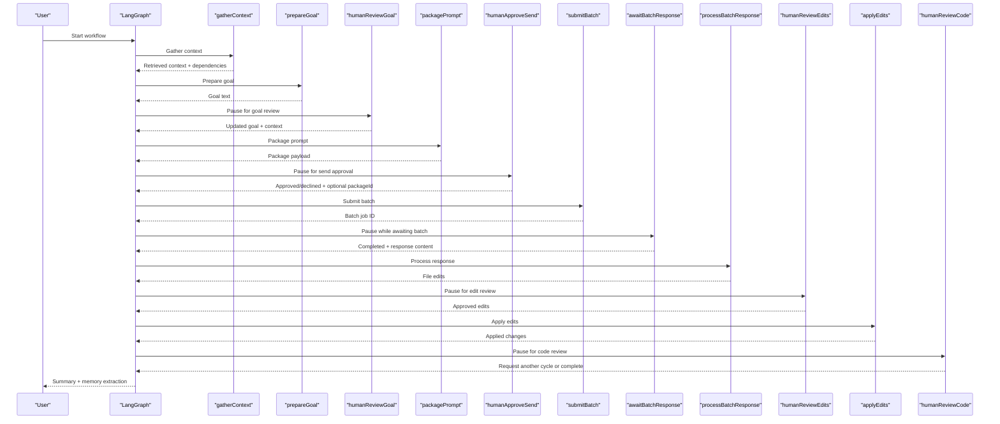
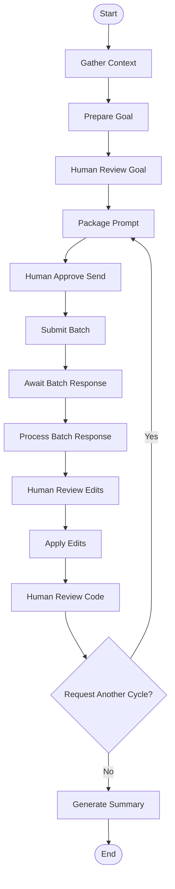
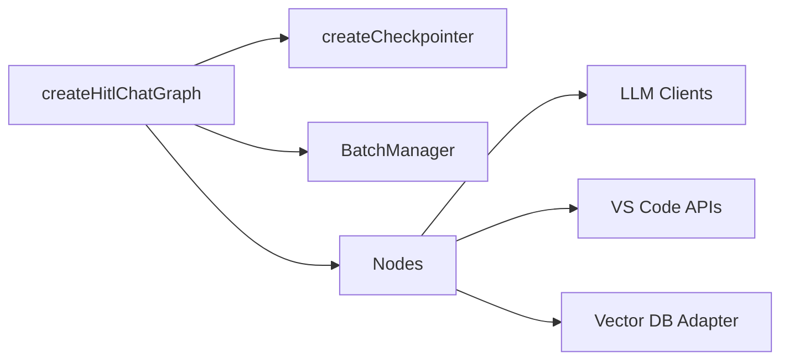

# Human-in-the-Loop Workflow

<cite>
**Referenced Files in This Document**
- [002_langgraph_hitl_workflow.md](file://PRDs/002_langgraph_hitl_workflow.md)
- [graph.ts](file://src/chat/graph.ts)
- [state.ts](file://src/chat/state.ts)
- [humanReviewGoal.ts](file://src/chat/nodes/humanReviewGoal.ts)
- [humanApproveSend.ts](file://src/chat/nodes/humanApproveSend.ts)
- [awaitBatchResponse.ts](file://src/chat/nodes/awaitBatchResponse.ts)
- [humanReviewEdits.ts](file://src/chat/nodes/humanReviewEdits.ts)
- [humanReviewCode.ts](file://src/chat/nodes/humanReviewCode.ts)
- [gatherContext.ts](file://src/chat/nodes/gatherContext.ts)
- [prepareGoal.ts](file://src/chat/nodes/prepareGoal.ts)
- [packagePrompt.ts](file://src/chat/nodes/packagePrompt.ts)
- [submitBatch.ts](file://src/chat/nodes/submitBatch.ts)
- [processBatchResponse.ts](file://src/chat/nodes/processBatchResponse.ts)
- [applyEdits.ts](file://src/chat/nodes/applyEdits.ts)
</cite>

## Table of Contents
1. [Introduction](#introduction)
2. [Project Structure](#project-structure)
3. [Core Components](#core-components)
4. [Architecture Overview](#architecture-overview)
5. [Detailed Component Analysis](#detailed-component-analysis)
6. [Dependency Analysis](#dependency-analysis)
7. [Performance Considerations](#performance-considerations)
8. [Troubleshooting Guide](#troubleshooting-guide)
9. [Conclusion](#conclusion)

## Introduction
This document describes the Human-in-the-Loop (HITL) workflow implemented in the chat graph. The workflow integrates LangGraph's interrupt/resume primitives to pause execution at strategic checkpoints where users can review, edit, approve, or reject decisions before the system continues. The flow spans from gathering context to applying changes, with explicit user approvals at each critical stage.

## Project Structure
The HITL workflow is centered around a LangGraph that orchestrates a series of nodes responsible for context gathering, goal synthesis, packaging, batch submission, response processing, and edit application. The workflow state is persisted using a PostgreSQL-backed checkpointer to support resumption across extension sessions.

**Diagram sources**
- [graph.ts](file://src/chat/graph.ts#L62-L154)

**Section sources**
- [graph.ts](file://src/chat/graph.ts#L1-L175)
- [state.ts](file://src/chat/state.ts#L1-L278)

## Core Components
- State Management: The ChatState annotation defines all workflow phases, user inputs, intermediate context, and outputs. It includes fields for workflowPhase, goalText, packagePayload, batchJobId, fileEdits, and requestReviewCycle.
- Interrupt Nodes: Five nodes use LangGraph interrupts to yield control back to the UI: humanReviewGoal, humanApproveSend, awaitBatchResponse, humanReviewEdits, and humanReviewCode.
- Persistence: The workflow is compiled with a PostgreSQL-backed checkpointer to persist state across extension restarts.
- Batch Integration: The submitBatch node interacts with a batch manager to submit packages and track job IDs.

**Section sources**
- [state.ts](file://src/chat/state.ts#L51-L277)
- [graph.ts](file://src/chat/graph.ts#L62-L154)

## Architecture Overview
The HITL workflow follows a structured pipeline with explicit user checkpoints:

**Diagram sources**
- [graph.ts](file://src/chat/graph.ts#L62-L154)
- [humanReviewGoal.ts](file://src/chat/nodes/humanReviewGoal.ts#L26-L52)
- [humanApproveSend.ts](file://src/chat/nodes/humanApproveSend.ts#L41-L74)
- [awaitBatchResponse.ts](file://src/chat/nodes/awaitBatchResponse.ts#L21-L49)
- [humanReviewEdits.ts](file://src/chat/nodes/humanReviewEdits.ts#L27-L69)
- [humanReviewCode.ts](file://src/chat/nodes/humanReviewCode.ts#L23-L59)

## Detailed Component Analysis

### Workflow Phases and State
The workflow tracks progress through distinct phases: idle, gathering, goal_review, packaging, send_review, batch_pending, response_review, applying, code_review, and complete. The state includes:
- workflowPhase: Tracks current phase for UI synchronization
- goalText: Editable goal synthesized from user query and context
- packagePayload: Structured payload for batch submission
- batchJobId: Reference to submitted batch job
- fileEdits: Parsed edits from batch response
- requestReviewCycle: Flag to loop back for another review cycle

**Section sources**
- [state.ts](file://src/chat/state.ts#L9-L24)
- [state.ts](file://src/chat/state.ts#L176-L231)

### Context Gathering
The gatherContext node performs vector search against the repository, extracts dependencies from package manifests, and prepares the initial context for goal synthesis. It reports progress and handles abort signals.

**Section sources**
- [gatherContext.ts](file://src/chat/nodes/gatherContext.ts#L41-L149)

### Goal Synthesis
The prepareGoal node builds a structured prompt incorporating retrieved context, repository architecture, dependencies, and injected memory context. It invokes an LLM to synthesize a concise goal text and calculates token/cost metrics.

**Section sources**
- [prepareGoal.ts](file://src/chat/nodes/prepareGoal.ts#L16-L91)

### Human Review: Goal
The humanReviewGoal node interrupts the graph to present the synthesized goal and context files to the user. Users can edit the goal text and adjust the set of context files. On resume, the state updates with user modifications and transitions to packaging.

**Section sources**
- [humanReviewGoal.ts](file://src/chat/nodes/humanReviewGoal.ts#L26-L52)

### Packaging
The packagePrompt node constructs the final package payload from the goal, context files, repository architecture, dependencies, and inferred output instruction. It validates token budget usage and transitions to send approval.

**Section sources**
- [packagePrompt.ts](file://src/chat/nodes/packagePrompt.ts#L37-L86)

### Human Approval: Send
The humanApproveSend node interrupts to present the package card and estimated token usage. Users can approve or decline sending to the batch API. If approved, it captures optional package identifiers and transitions to batch submission.

**Section sources**
- [humanApproveSend.ts](file://src/chat/nodes/humanApproveSend.ts#L41-L74)

### Batch Submission
The submitBatch node submits the package to the batch manager and records the resulting batch job ID. It handles cases where no package is present or the manager is unavailable.

**Section sources**
- [submitBatch.ts](file://src/chat/nodes/submitBatch.ts#L15-L57)

### Await Batch Response
The awaitBatchResponse node interrupts while polling for batch completion. An external poller resumes the graph when the batch reaches a terminal state, passing back completion status and response content.

**Section sources**
- [awaitBatchResponse.ts](file://src/chat/nodes/awaitBatchResponse.ts#L21-L49)

### Process Batch Response
The processBatchResponse node parses the raw batch response into structured file edits. If parsing fails, it surfaces the raw content as a manual review file edit. It transitions to edit review or completes if no edits are produced.

**Section sources**
- [processBatchResponse.ts](file://src/chat/nodes/processBatchResponse.ts#L18-L50)

### Human Review: Edits
The humanReviewEdits node interrupts to present file changes for approval. Users can approve specific edits, which are then marked in state. If no edits are approved, the workflow completes; otherwise, it proceeds to apply edits.

**Section sources**
- [humanReviewEdits.ts](file://src/chat/nodes/humanReviewEdits.ts#L27-L69)

### Apply Edits
The applyEdits node writes approved changes to the workspace using VS Code APIs. It supports create, edit (including search/replace), and delete actions with security checks to prevent path traversal. It reports results and transitions to code review.

**Section sources**
- [applyEdits.ts](file://src/chat/nodes/applyEdits.ts#L10-L116)

### Human Review: Code
The humanReviewCode node optionally loops back for another review cycle. If requested, it resets relevant state and returns to packaging; otherwise, it completes the workflow and generates a summary.

**Section sources**
- [humanReviewCode.ts](file://src/chat/nodes/humanReviewCode.ts#L23-L59)

### Conceptual Overview
The workflow enforces a strict sequence of user approvals, ensuring that each significant decision is vetted before proceeding. The interrupt/resume mechanism enables asynchronous user interaction while maintaining deterministic state progression.

[No sources needed since this diagram shows conceptual workflow, not actual code structure]

## Dependency Analysis
The chat graph depends on:
- PostgreSQL-backed checkpointer for state persistence
- Batch manager for submitting packages and tracking jobs
- LLM clients for goal synthesis and cost estimation
- VS Code APIs for applying file edits
- Vector database adapters for context retrieval

**Diagram sources**
- [graph.ts](file://src/chat/graph.ts#L62-L154)

**Section sources**
- [graph.ts](file://src/chat/graph.ts#L6-L24)

## Performance Considerations
- Token Budget Validation: The packagePrompt node validates prompt token usage against a calculated budget to prevent exceeding model context windows.
- Conditional Edge Looping: The humanReviewCode node conditionally loops back to packaging, enabling iterative refinement without restarting the entire workflow.
- Abort Handling: Nodes check abort signals to gracefully terminate long-running operations.
- Progress Reporting: Each node reports progress to the UI, improving responsiveness and user feedback.

[No sources needed since this section provides general guidance]

## Troubleshooting Guide
Common issues and resolutions:
- Missing API Key: If no API key is available, goal synthesis falls back to using the raw user query as the goal text.
- Batch Manager Unavailable: If the batch manager is not initialized, batch submission returns a failure response and completes the workflow.
- No Edits to Apply: If no edits are approved, the workflow completes without applying changes.
- External Poller Failure: If the batch does not complete successfully, the awaitBatchResponse node returns an error message and completes the workflow.
- Workspace Not Found: If no workspace folder is available, edit application is skipped and the workflow transitions to code review.

**Section sources**
- [prepareGoal.ts](file://src/chat/nodes/prepareGoal.ts#L30-L37)
- [submitBatch.ts](file://src/chat/nodes/submitBatch.ts#L30-L37)
- [applyEdits.ts](file://src/chat/nodes/applyEdits.ts#L14-L20)
- [awaitBatchResponse.ts](file://src/chat/nodes/awaitBatchResponse.ts#L25-L30)

## Conclusion
The HITL workflow integrates user oversight at every major decision point, leveraging LangGraph interrupts to pause and resume execution. With persistent state, structured approvals, and robust error handling, the system ensures safe, transparent automation of codebase interactions.