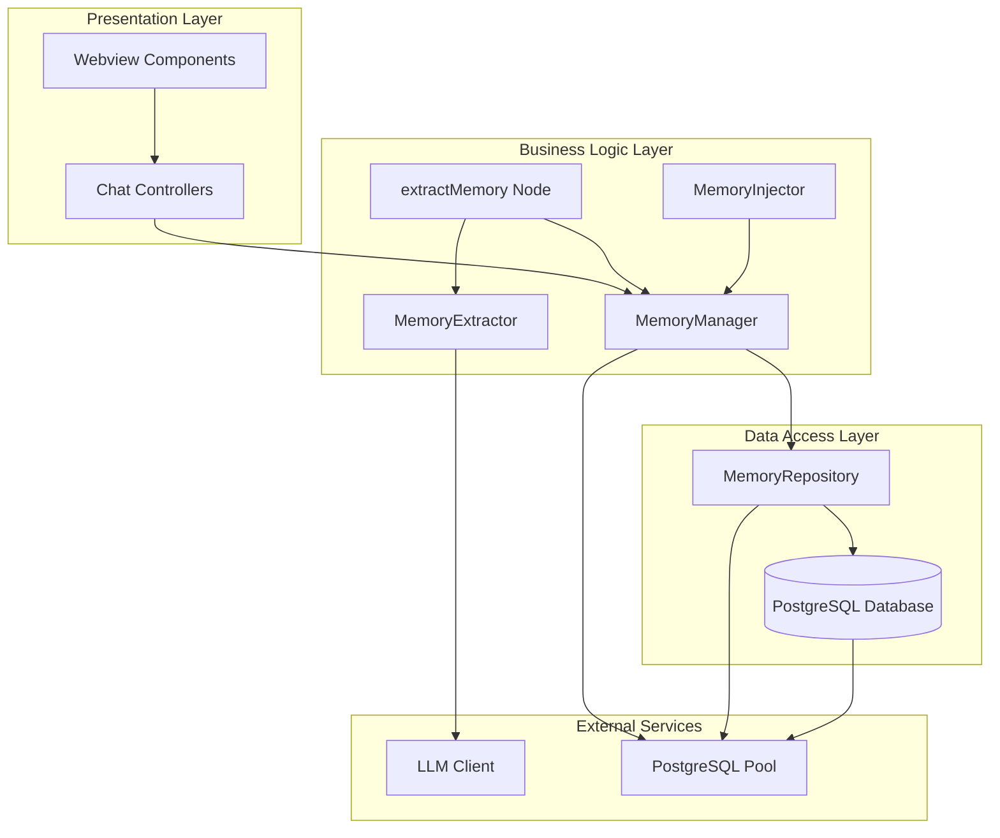
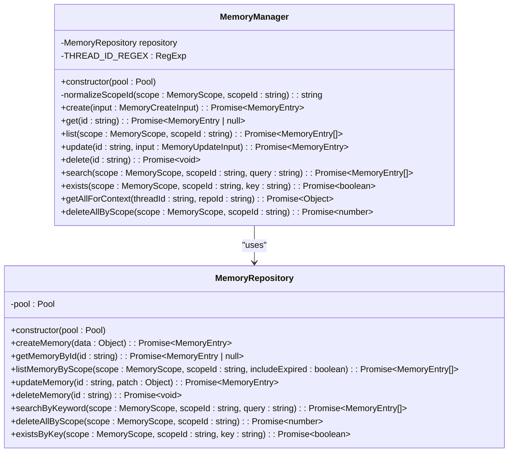
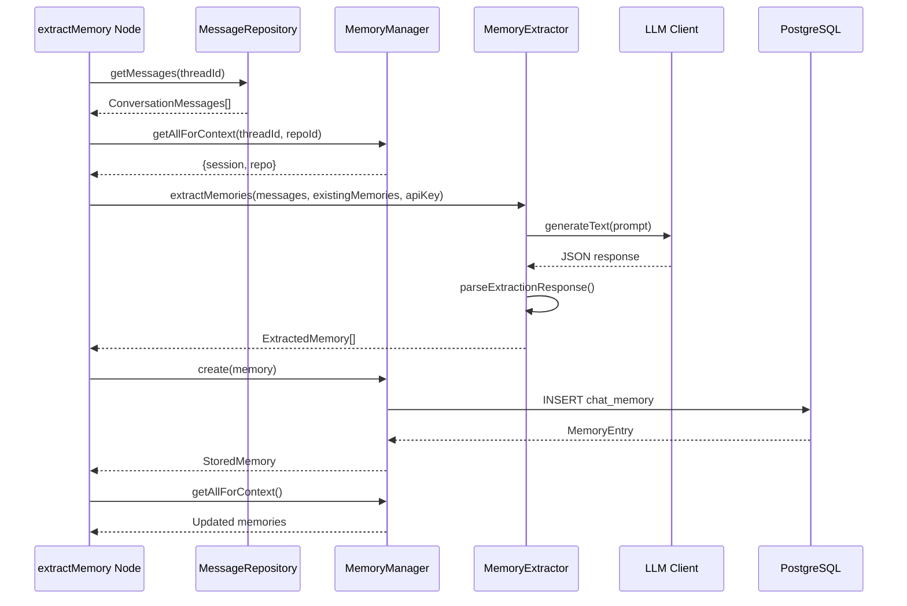
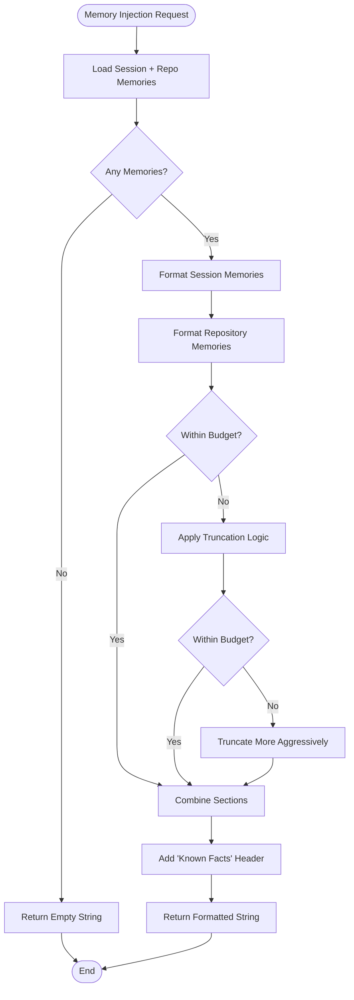
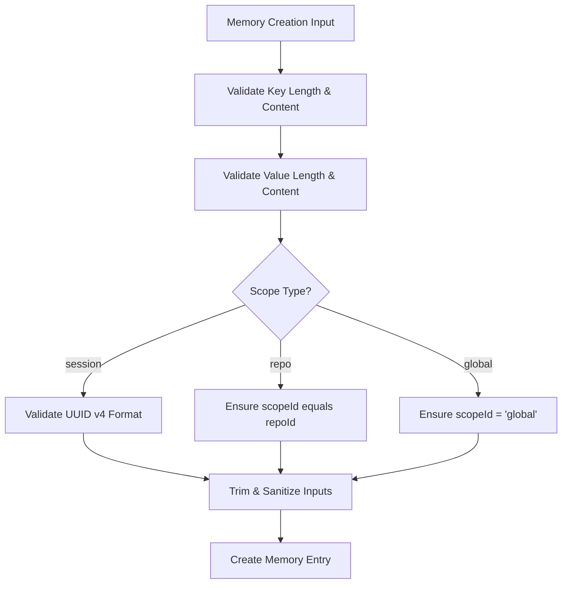
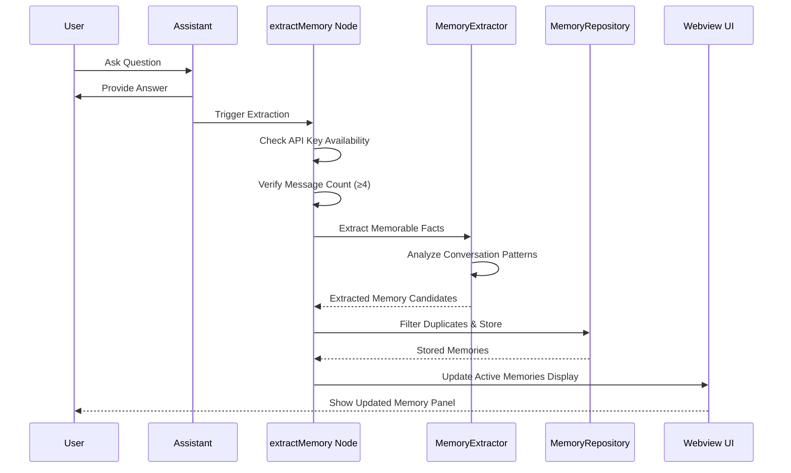
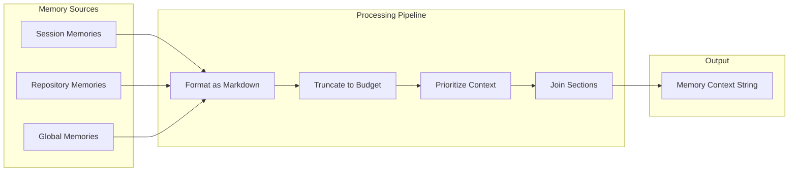
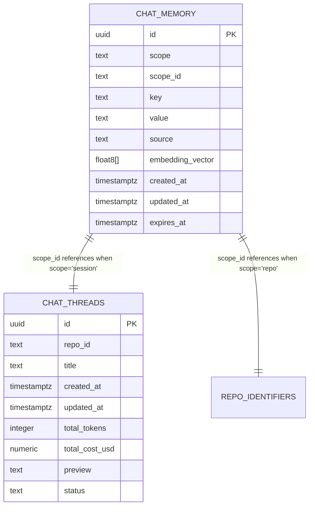
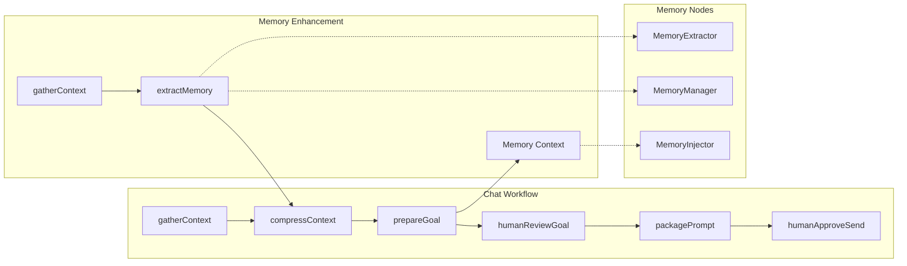
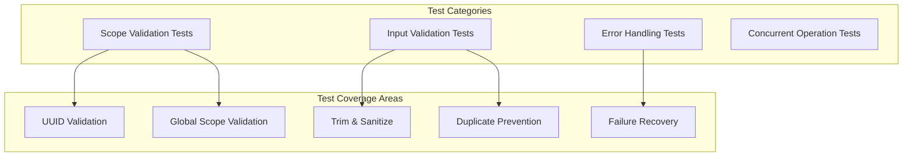

# Memory Management System

<cite>
**Referenced Files in This Document**
- [memoryManager.ts](file://src/chat/memory/memoryManager.ts)
- [memoryExtractor.ts](file://src/chat/memory/memoryExtractor.ts)
- [memoryInjector.ts](file://src/chat/memory/memoryInjector.ts)
- [types.ts](file://src/chat/memory/types.ts)
- [memoryRepository.ts](file://src/chat/db/memoryRepository.ts)
- [extractMemory.ts](file://src/chat/nodes/extractMemory.ts)
- [prepareGoal.ts](file://src/chat/nodes/prepareGoal.ts)
- [state.ts](file://src/chat/state.ts)
- [001_initial_schema.sql](file://src/chat/db/migrations/001_initial_schema.sql)
- [002_compression_schema.sql](file://src/chat/db/migrations/002_compression_schema.sql)
- [memoryManager.test.ts](file://src/test/chat/memory/memoryManager.test.ts)
- [004_memory_manager_crud.md](file://PRDs/004_memory_manager_crud.md)
</cite>

## Table of Contents
1. [Introduction](#introduction)
2. [System Architecture](#system-architecture)
3. [Core Components](#core-components)
4. [Memory Scopes and Validation](#memory-scopes-and-validation)
5. [Auto-Extraction Workflow](#auto-extraction-workflow)
6. [Memory Injection Pipeline](#memory-injection-pipeline)
7. [Database Schema and Operations](#database-schema-and-operations)
8. [Integration Points](#integration-points)
9. [Testing and Quality Assurance](#testing-and-quality-assurance)
10. [Performance Considerations](#performance-considerations)
11. [Troubleshooting Guide](#troubleshooting-guide)
12. [Conclusion](#conclusion)

## Introduction

The Memory Management System is a sophisticated persistent knowledge storage solution designed for the Repomix Runner chat system. This system enables the AI assistant to maintain contextual awareness across conversations by storing, retrieving, updating, and deleting key-value pairs of project-related information. The system operates at three distinct scopes: session-level (thread-specific), repository-level (shared across all threads), and global-level (cross-repository knowledge).

The primary objective is to eliminate the current statelessness of chat threads by providing persistent context about user preferences, architectural decisions, and project-specific knowledge that survives across conversations. This enhancement significantly improves the AI's ability to provide coherent, context-aware assistance tailored to each user's specific projects and development workflows.

## System Architecture

The Memory Management System follows a layered architecture pattern with clear separation of concerns:

**Diagram sources**
- [memoryManager.ts](file://src/chat/memory/memoryManager.ts#L18-L159)
- [memoryRepository.ts](file://src/chat/db/memoryRepository.ts#L41-L243)
- [memoryExtractor.ts](file://src/chat/memory/memoryExtractor.ts#L106-L145)
- [memoryInjector.ts](file://src/chat/memory/memoryInjector.ts#L68-L97)

The architecture ensures loose coupling between components while maintaining clear data flow patterns. The system is designed to be non-blocking and resilient, with proper error handling throughout the pipeline.

## Core Components

### MemoryManager Class

The MemoryManager serves as the central orchestrator for all memory operations, providing a comprehensive CRUD interface with built-in validation and business logic:

**Diagram sources**
- [memoryManager.ts](file://src/chat/memory/memoryManager.ts#L18-L159)
- [memoryRepository.ts](file://src/chat/db/memoryRepository.ts#L41-L243)

The MemoryManager encapsulates business logic including scope validation, input sanitization, and concurrent operation handling. It provides a unified interface for all memory operations while delegating database interactions to the repository layer.

**Section sources**
- [memoryManager.ts](file://src/chat/memory/memoryManager.ts#L18-L159)

### MemoryExtractor Service

The MemoryExtractor component handles automatic knowledge extraction from conversation history using LLM capabilities:

**Diagram sources**
- [extractMemory.ts](file://src/chat/nodes/extractMemory.ts#L62-L168)
- [memoryExtractor.ts](file://src/chat/memory/memoryExtractor.ts#L106-L145)
- [memoryRepository.ts](file://src/chat/db/memoryRepository.ts#L48-L86)

The extractor processes recent conversation messages, builds specialized prompts, and leverages LLM capabilities to identify valuable knowledge patterns that should be preserved for future interactions.

**Section sources**
- [memoryExtractor.ts](file://src/chat/memory/memoryExtractor.ts#L106-L145)

### MemoryInjector Service

The MemoryInjector formats stored memories for optimal inclusion in LLM prompts while managing token budget constraints:

**Diagram sources**
- [memoryInjector.ts](file://src/chat/memory/memoryInjector.ts#L68-L97)

The injector implements sophisticated truncation algorithms that prioritize session memories over repository memories, ensuring the most relevant context is preserved within token limits.

**Section sources**
- [memoryInjector.ts](file://src/chat/memory/memoryInjector.ts#L68-L97)

## Memory Scopes and Validation

The system enforces strict scope-based validation to maintain data integrity and prevent cross-scope contamination:

| Scope | Scope ID Requirement | Usage Context | Example Keys |
|-------|---------------------|---------------|--------------|
| session | Valid UUID v4 thread ID | Thread-specific knowledge | `react_query_preference`, `testing_framework_choice` |
| repo | Repository identifier | Project-wide knowledge | `monorepo_structure`, `auth_module_location`, `coding_standards` |
| global | Must be exactly "global" | Cross-project knowledge | `common_design_patterns`, `framework_guidelines` |

**Diagram sources**
- [memoryManager.ts](file://src/chat/memory/memoryManager.ts#L27-L42)

The validation system prevents common data integrity issues while maintaining flexibility for different use cases. Each scope type enforces specific constraints that align with its intended usage pattern.

**Section sources**
- [memoryManager.ts](file://src/chat/memory/memoryManager.ts#L27-L42)
- [types.ts](file://src/chat/memory/types.ts#L6-L34)

## Auto-Extraction Workflow

The auto-extraction process operates as a non-blocking background service that enhances conversation quality without impacting user experience:

**Diagram sources**
- [extractMemory.ts](file://src/chat/nodes/extractMemory.ts#L62-L168)
- [memoryExtractor.ts](file://src/chat/memory/memoryExtractor.ts#L106-L145)

The workflow includes comprehensive error handling, health monitoring, and progress reporting to ensure reliability and user feedback.

**Section sources**
- [extractMemory.ts](file://src/chat/nodes/extractMemory.ts#L62-L168)

## Memory Injection Pipeline

The memory injection pipeline seamlessly integrates stored knowledge into LLM prompts while maintaining optimal token utilization:

**Diagram sources**
- [memoryInjector.ts](file://src/chat/memory/memoryInjector.ts#L68-L97)
- [prepareGoal.ts](file://src/chat/nodes/prepareGoal.ts#L39-L50)

The pipeline prioritizes session memories for maximum relevance, followed by repository memories, with global knowledge as the lowest priority. This hierarchical approach ensures the most pertinent information is presented to the LLM.

**Section sources**
- [memoryInjector.ts](file://src/chat/memory/memoryInjector.ts#L68-L97)
- [prepareGoal.ts](file://src/chat/nodes/prepareGoal.ts#L39-L50)

## Database Schema and Operations

The memory system utilizes a PostgreSQL database with optimized indexing for efficient querying and retrieval:

**Diagram sources**
- [001_initial_schema.sql](file://src/chat/db/migrations/001_initial_schema.sql#L38-L50)

The database schema includes unique constraints on (scope, scope_id, key) combinations to prevent duplicate entries and maintains timestamps for audit trails. The embedding_vector column supports future semantic search capabilities.

**Section sources**
- [001_initial_schema.sql](file://src/chat/db/migrations/001_initial_schema.sql#L38-L50)
- [memoryRepository.ts](file://src/chat/db/memoryRepository.ts#L41-L243)

## Integration Points

### Chat Graph Integration

The memory system integrates seamlessly with the LangGraph workflow through dedicated nodes:

**Diagram sources**
- [extractMemory.ts](file://src/chat/nodes/extractMemory.ts#L62-L168)
- [prepareGoal.ts](file://src/chat/nodes/prepareGoal.ts#L16-L92)

### State Management Integration

The system maintains memory state through the ChatState annotation system, enabling real-time updates and persistence:

| State Field | Type | Purpose | Update Mechanism |
|-------------|------|---------|------------------|
| activeMemories | string | Formatted memory context for display | Updated after extraction |
| memoryContext | string | Memory context for LLM prompts | Injected into goal preparation |
| memoryHealth | object | Extraction failure tracking | Monitored for reliability |

**Section sources**
- [state.ts](file://src/chat/state.ts#L232-L238)
- [extractMemory.ts](file://src/chat/nodes/extractMemory.ts#L150-L159)

## Testing and Quality Assurance

The memory system includes comprehensive testing coverage to ensure reliability and correctness:

### Unit Tests

The test suite validates critical functionality including scope validation, input sanitization, and error handling:

**Diagram sources**
- [memoryManager.test.ts](file://src/test/chat/memory/memoryManager.test.ts#L5-L72)

### Test Scenarios

The testing framework covers essential scenarios including invalid scope IDs, boundary condition validation, and concurrent access patterns. Each test validates specific aspects of the memory management system to ensure robust operation under various conditions.

**Section sources**
- [memoryManager.test.ts](file://src/test/chat/memory/memoryManager.test.ts#L5-L72)

## Performance Considerations

### Token Budget Management

The system implements sophisticated token budget management to prevent context overflow:

- **Maximum Memory Characters**: 8,000 characters (~2,000 tokens)
- **Priority Hierarchy**: Session > Repository > Global
- **Truncation Strategy**: Aggressive truncation of lower-priority contexts
- **Character Limits**: Keys (≤100 chars), Values (≤500 chars for extraction)

### Database Optimization

The PostgreSQL schema includes strategic indexing for optimal query performance:

- **Composite Index**: (scope, scope_id) for efficient scoping
- **Unique Constraint**: Prevents duplicate key entries within scopes
- **Timestamp Indexes**: Support for expiration and sorting operations

### Concurrency Handling

The system handles concurrent operations through:

- **Non-blocking Operations**: Memory extraction doesn't block user workflows
- **Error Containment**: Individual failures don't impact overall system
- **Health Monitoring**: Automatic detection and alerting for repeated failures

## Troubleshooting Guide

### Common Issues and Solutions

| Issue | Symptoms | Solution |
|-------|----------|----------|
| Memory Extraction Failures | Extraction node shows errors, no new memories | Check API key validity, network connectivity, LLM service availability |
| Scope Validation Errors | "Invalid threadId UUID" or "Invalid scopeId" errors | Verify UUID format for session scopes, ensure "global" for global scope |
| Memory Not Persisting | Memories disappear after restart | Check database connectivity, verify unique constraint violations |
| Performance Degradation | Slow response times with many memories | Review memory count per thread, consider pruning old memories |

### Health Monitoring

The system includes built-in health monitoring for memory extraction:

- **Failure Count Tracking**: Monitors consecutive extraction failures
- **Alert Thresholds**: Automatic alerts after 3+ failures within 30 minutes
- **Cooldown Periods**: Prevents alert spamming during extended outages

### Debug Information

Key debug indicators include:

- **Extraction Logs**: Detailed logging of extraction attempts and results
- **Memory Counts**: Track number of memories per scope for performance analysis
- **API Key Validation**: Clear indication when API key is missing or invalid

**Section sources**
- [extractMemory.ts](file://src/chat/nodes/extractMemory.ts#L32-L60)

## Conclusion

The Memory Management System represents a significant advancement in conversational AI capabilities for the Repomix Runner platform. By implementing persistent knowledge storage across multiple scopes with sophisticated validation, auto-extraction, and injection mechanisms, the system provides users with a more coherent and context-aware conversational experience.

The modular architecture ensures maintainability and extensibility, while comprehensive error handling and health monitoring guarantee reliable operation. The integration with the LangGraph workflow demonstrates seamless incorporation of memory capabilities into existing chat infrastructure.

Future enhancements could include semantic search capabilities through embedding vectors, automated memory pruning based on recency and relevance, and advanced conflict resolution for overlapping memory entries. The current foundation provides an excellent base for these evolutionary improvements while maintaining backward compatibility and system stability.

The system successfully addresses the core challenge of conversation statelessness, enabling AI assistants to provide increasingly sophisticated and personalized assistance tailored to individual users' development workflows and project requirements.