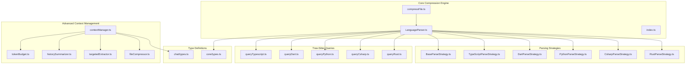
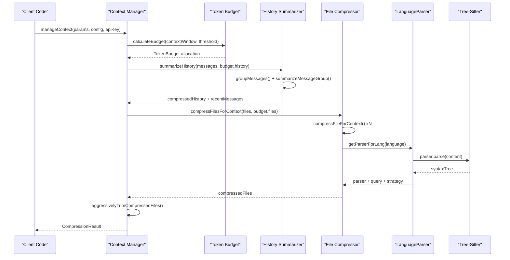
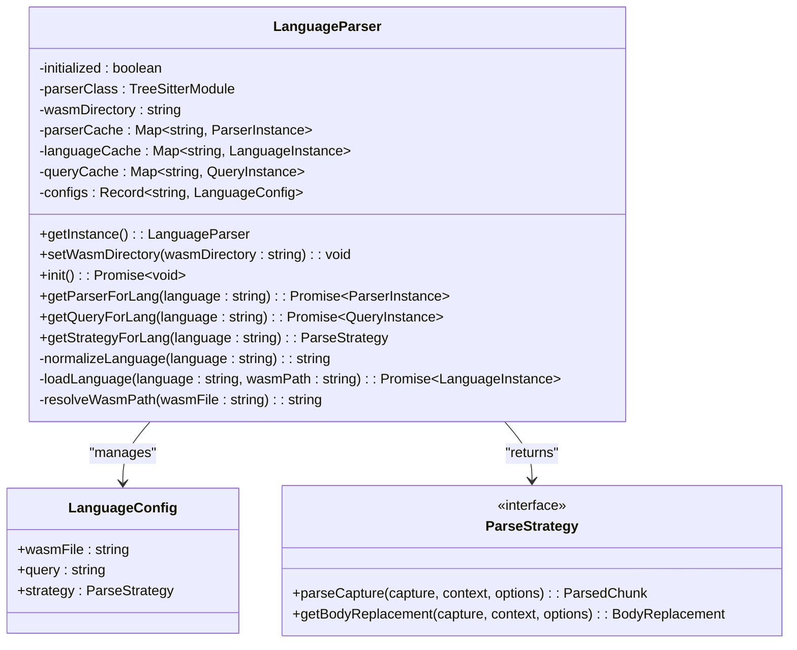
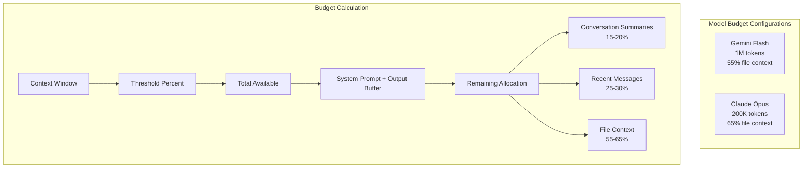
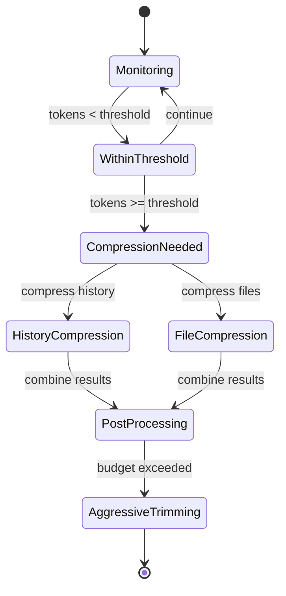
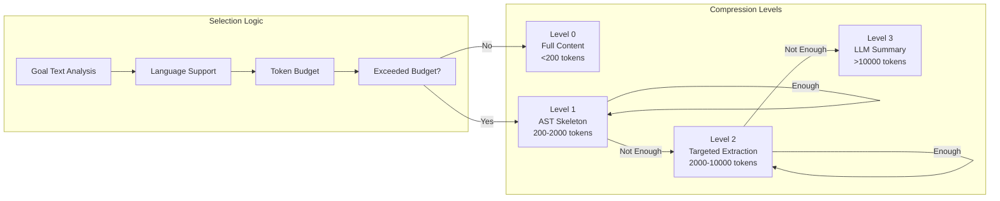

# Multi-Language Compression Support

<cite>
**Referenced Files in This Document**
- [index.ts](file://src/core/compression/index.ts)
- [LanguageParser.ts](file://src/core/compression/LanguageParser.ts)
- [compressFile.ts](file://src/core/compression/compressFile.ts)
- [types.ts](file://src/core/compression/types.ts)
- [BaseParseStrategy.ts](file://src/core/compression/strategies/BaseParseStrategy.ts)
- [TypeScriptParseStrategy.ts](file://src/core/compression/strategies/TypeScriptParseStrategy.ts)
- [DartParseStrategy.ts](file://src/core/compression/strategies/DartParseStrategy.ts)
- [PythonParseStrategy.ts](file://src/core/compression/strategies/PythonParseStrategy.ts)
- [CsharpParseStrategy.ts](file://src/core/compression/strategies/CsharpParseStrategy.ts)
- [RustParseStrategy.ts](file://src/core/compression/strategies/RustParseStrategy.ts)
- [queryTypescript.ts](file://src/core/compression/queries/queryTypescript.ts)
- [queryDart.ts](file://src/core/compression/queries/queryDart.ts)
- [queryPython.ts](file://src/core/compression/queries/queryPython.ts)
- [queryCsharp.ts](file://src/core/compression/queries/queryCsharp.ts)
- [queryRust.ts](file://src/core/compression/queries/queryRust.ts)
- [contextManager.ts](file://src/chat/compression/contextManager.ts)
- [tokenBudget.ts](file://src/chat/compression/tokenBudget.ts)
- [historySummarizer.ts](file://src/chat/compression/historySummarizer.ts)
- [targetedExtractor.ts](file://src/chat/compression/targetedExtractor.ts)
- [fileCompressor.ts](file://src/chat/compression/fileCompressor.ts)
- [types.ts](file://src/chat/compression/types.ts)
- [003_context_compression_strategy.md](file://PRDs/003_context_compression_strategy.md)
</cite>

## Update Summary
**Changes Made**
- Enhanced reactive context management system with intelligent token budget allocation
- Implemented conversation summarization using Gemini 2.5 Flash for long-running chat sessions
- Integrated targeted file extraction for large repository management using Tree-Sitter
- Enhanced compression engine with multi-level compression strategies (0-3 levels)
- Added sophisticated token counting and budget calculation mechanisms
- Introduced sliding window with anchors for batch prompt optimization
- Added comprehensive multi-language support with specialized parsing strategies

## Table of Contents
1. [Introduction](#introduction)
2. [Project Structure](#project-structure)
3. [Core Components](#core-components)
4. [Architecture Overview](#architecture-overview)
5. [Detailed Component Analysis](#detailed-component-analysis)
6. [Language Support Matrix](#language-support-matrix)
7. [Reactive Context Management](#reactive-context-management)
8. [Multi-Level Compression Strategies](#multi-level-compression-strategies)
9. [Performance Considerations](#performance-considerations)
10. [Troubleshooting Guide](#troubleshooting-guide)
11. [Conclusion](#conclusion)

## Introduction

The Multi-Language Compression Support system provides intelligent code compression capabilities across multiple programming languages using Tree-Sitter parsing technology. This system enables developers to selectively compress code while preserving essential structural information, making codebases more manageable for AI assistance, documentation generation, and code sharing scenarios.

**Enhanced** The system now includes advanced reactive context management capabilities with intelligent token budget allocation, conversation summarization, and targeted file extraction for large repository management. The compression engine operates on four distinct levels, from full content preservation to LLM-generated summaries, ensuring optimal token usage while maintaining contextual integrity.

The compression system supports five major programming languages: TypeScript/JavaScript, Dart, Python, C#, and Rust. Each language has specialized parsing strategies that understand language-specific syntax patterns, allowing for accurate extraction of function signatures, class skeletons, and other structural elements while removing implementation details.

## Project Structure

The compression system is organized into several key modules that work together to provide language-agnostic compression capabilities:



**Diagram sources**
- [contextManager.ts](file://src/chat/compression/contextManager.ts#L1-L308)
- [tokenBudget.ts](file://src/chat/compression/tokenBudget.ts#L1-L227)
- [compressFile.ts](file://src/core/compression/compressFile.ts#L1-L157)
- [LanguageParser.ts](file://src/core/compression/LanguageParser.ts#L1-L218)

**Section sources**
- [index.ts](file://src/core/compression/index.ts#L1-L3)
- [compressFile.ts](file://src/core/compression/compressFile.ts#L1-L157)
- [LanguageParser.ts](file://src/core/compression/LanguageParser.ts#L1-L218)
- [contextManager.ts](file://src/chat/compression/contextManager.ts#L1-L308)

## Core Components

### LanguageParser Service

The LanguageParser serves as the central coordinator for all compression operations. It implements a singleton pattern to ensure efficient resource utilization and manages the lifecycle of Tree-Sitter parsers, queries, and language configurations.

Key responsibilities include:
- Language detection based on file extensions
- Tree-Sitter parser initialization and caching
- Query loading and compilation
- Strategy selection for specific languages
- WASM module path resolution

### Advanced Context Manager

**New** The Context Manager orchestrates the entire compression workflow, monitoring token usage against configurable thresholds and triggering compression reactively. It manages conversation history summarization, file compression, and intelligent budget allocation.

Key features:
- Reactive token usage monitoring with configurable thresholds
- Conversation history summarization using Gemini 2.5 Flash
- Multi-level file compression (0-3 levels)
- Aggressive trimming for post-compression optimization
- Binary content detection and filtering

### Compression Pipeline

The compression pipeline follows a structured approach with four distinct levels:

1. **Level 0**: Full content preservation for small files (< 200 tokens)
2. **Level 1**: AST skeleton extraction using Tree-Sitter for supported languages
3. **Level 2**: Targeted symbol extraction based on goal text analysis
4. **Level 3**: LLM-generated summaries for unsupported languages or oversized content

### Strategy Pattern Implementation

Each programming language has a dedicated parsing strategy that extends the base strategy class. These strategies handle language-specific syntax patterns, node type recognition, and compression logic.

**Section sources**
- [LanguageParser.ts](file://src/core/compression/LanguageParser.ts#L26-L218)
- [compressFile.ts](file://src/core/compression/compressFile.ts#L52-L157)
- [BaseParseStrategy.ts](file://src/core/compression/strategies/BaseParseStrategy.ts#L11-L75)
- [contextManager.ts](file://src/chat/compression/contextManager.ts#L138-L279)

## Architecture Overview

The compression system employs a modular architecture that separates concerns between language detection, parsing, and compression logic:



**Diagram sources**
- [contextManager.ts](file://src/chat/compression/contextManager.ts#L138-L279)
- [tokenBudget.ts](file://src/chat/compression/tokenBudget.ts#L91-L123)
- [historySummarizer.ts](file://src/chat/compression/historySummarizer.ts#L36-L84)
- [fileCompressor.ts](file://src/chat/compression/fileCompressor.ts#L177-L197)

The architecture ensures scalability and maintainability through clear separation of concerns and reusable components.

**Section sources**
- [contextManager.ts](file://src/chat/compression/contextManager.ts#L138-L279)
- [LanguageParser.ts](file://src/core/compression/LanguageParser.ts#L83-L130)

## Detailed Component Analysis

### LanguageParser Implementation

The LanguageParser implements a sophisticated caching mechanism to optimize performance across multiple compression operations:



**Diagram sources**
- [LanguageParser.ts](file://src/core/compression/LanguageParser.ts#L26-L218)
- [types.ts](file://src/core/compression/types.ts#L61-L66)

The parser service maintains separate caches for parsers, languages, and queries to minimize initialization overhead during repeated compression operations.

### BaseParseStrategy Framework

The BaseParseStrategy provides common functionality shared across all language-specific strategies:

Key utilities include:
- **Node Text Extraction**: Safely extracts text content from syntax nodes
- **Whitespace Normalization**: Consistent formatting of extracted content
- **Signature Processing**: Intelligent parsing of function and method signatures
- **Body Range Detection**: Accurate identification of code block boundaries

### Language-Specific Strategies

Each language strategy implements specialized logic for handling language-specific syntax patterns:

#### TypeScript/JavaScript Strategy
Handles function declarations, class definitions, method signatures, and export/import statements with support for modern JavaScript features including arrow functions and generator functions.

#### Dart Strategy
Supports class definitions, function declarations, method signatures, and import/export directives specific to Dart's syntax including library and part directives.

#### Python Strategy
Manages Python's unique syntax including decorated functions, class definitions, and indentation-based block structure. Special handling for decorator patterns and function signatures.

#### C# Strategy
Addresses C#'s property declarations, method signatures, class definitions, and namespace structures. Includes special handling for property getters/setters and file-scoped namespaces.

#### Rust Strategy
Handles Rust's function declarations, struct/class definitions, trait implementations, and macro definitions. Supports both traditional and modern Rust syntax patterns.

### Advanced Context Management System

**New** The context management system provides comprehensive reactive compression capabilities:

#### Token Budget Management
- Configurable model-specific budget allocations
- Dynamic threshold-based compression triggering
- Per-category token distribution (system prompt, history, files, recent messages)
- Output buffer reservation for LLM responses

#### Conversation History Summarization
- Automatic grouping of older messages
- Gemini 2.5 Flash-powered summarization
- Preservation of key decisions, file paths, and technical context
- Fallback mechanisms for summarization failures

#### Multi-Level File Compression
Progressive compression approach:
- **Level 0**: Full content for files under 200 tokens
- **Level 1**: AST skeleton extraction for supported languages
- **Level 2**: Targeted symbol extraction based on goal text
- **Level 3**: LLM-generated summaries for unsupported languages

#### Targeted Symbol Extraction
- Goal text analysis using regex patterns
- Tree-Sitter AST traversal for symbol identification
- Import statement preservation
- Language-aware symbol name detection

**Section sources**
- [BaseParseStrategy.ts](file://src/core/compression/strategies/BaseParseStrategy.ts#L11-L75)
- [TypeScriptParseStrategy.ts](file://src/core/compression/strategies/TypeScriptParseStrategy.ts#L12-L208)
- [DartParseStrategy.ts](file://src/core/compression/strategies/DartParseStrategy.ts#L12-L182)
- [PythonParseStrategy.ts](file://src/core/compression/strategies/PythonParseStrategy.ts#L12-L238)
- [CsharpParseStrategy.ts](file://src/core/compression/strategies/CsharpParseStrategy.ts#L12-L195)
- [RustParseStrategy.ts](file://src/core/compression/strategies/RustParseStrategy.ts#L12-L193)
- [contextManager.ts](file://src/chat/compression/contextManager.ts#L1-L308)
- [tokenBudget.ts](file://src/chat/compression/tokenBudget.ts#L1-L227)
- [historySummarizer.ts](file://src/chat/compression/historySummarizer.ts#L1-L206)
- [targetedExtractor.ts](file://src/chat/compression/targetedExtractor.ts#L1-L188)
- [fileCompressor.ts](file://src/chat/compression/fileCompressor.ts#L1-L265)

### Tree-Sitter Query System

Each language uses specialized Tree-Sitter queries to identify structural elements within source code:

| Language | Query Patterns | Supported Elements |
|----------|---------------|-------------------|
| TypeScript | Import/Export, Functions, Classes, Interfaces, Types, Enums | Complete structural coverage |
| Dart | Import/Export, Classes, Functions, Methods, Enums, Typedefs | Dart-specific constructs |
| Python | Import Statements, Decorated Definitions, Functions, Classes | Python decorators and blocks |
| C# | Using Directives, Classes, Methods, Properties, Interfaces | C# specific syntax |
| Rust | Use Declarations, Functions, Structs, Traits, Impl Blocks | Rust module system |

**Section sources**
- [queryTypescript.ts](file://src/core/compression/queries/queryTypescript.ts#L1-L18)
- [queryDart.ts](file://src/core/compression/queries/queryDart.ts#L1-L25)
- [queryPython.ts](file://src/core/compression/queries/queryPython.ts#L1-L11)
- [queryCsharp.ts](file://src/core/compression/queries/queryCsharp.ts#L1-L22)
- [queryRust.ts](file://src/core/compression/queries/queryRust.ts#L1-L22)

## Language Support Matrix

The compression system provides comprehensive support for modern programming languages with varying levels of structural element recognition:

```mermaid
flowchart TD
subgraph "Supported Languages"
TS[TypeScript/JavaScript]
DT[Dart]
PY[Python]
CS[C#]
RS[Rust]
end
subgraph "Compression Features"
IMP[Import/Export<br/>Statements]
FUN[Function<br/>Signatures]
CLS[Class/Skeleton<br/>Structures]
MTH[Method<br/>Definitions]
DEC[Decorators<br/>(Python)]
SKL[Skeleton<br/>Generation]
end
TS --> IMP
TS --> FUN
TS --> CLS
TS --> MTH
TS --> SKL
DT --> IMP
DT --> FUN
DT --> CLS
DT --> MTH
DT --> SKL
PY --> IMP
PY --> FUN
PY --> CLS
PY --> DEC
PY --> SKL
CS --> IMP
CS --> FUN
CS --> CLS
CS --> MTH
CS --> SKL
RS --> IMP
RS --> FUN
RS --> CLS
RS --> SKL
```

**Diagram sources**
- [compressFile.ts](file://src/core/compression/compressFile.ts#L31-L50)
- [LanguageParser.ts](file://src/core/compression/LanguageParser.ts#L37-L69)

**Section sources**
- [compressFile.ts](file://src/core/compression/compressFile.ts#L31-L50)
- [LanguageParser.ts](file://src/core/compression/LanguageParser.ts#L37-L69)

## Reactive Context Management

**New** The reactive context management system provides intelligent compression orchestration:

### Token Budget Allocation

The system calculates token budgets based on model context windows and configurable thresholds:



**Diagram sources**
- [tokenBudget.ts](file://src/chat/compression/tokenBudget.ts#L37-L81)
- [tokenBudget.ts](file://src/chat/compression/tokenBudget.ts#L91-L123)

### Compression Trigger Mechanism

Compression is triggered reactively when token usage exceeds configurable thresholds:



### Conversation History Summarization

Older conversation messages are automatically summarized while preserving recent exchanges:

- **Recent Messages**: Last N messages kept in full (configurable, default 10)
- **Message Grouping**: Older messages grouped in batches of ~5
- **Summarization**: Gemini 2.5 Flash generates concise summaries
- **Preservation**: Key decisions, file paths, and technical context maintained

### File Context Compression

Files are compressed using progressive multi-level strategies:

- **Small Files**: Level 0 - Full content preservation
- **Supported Languages**: Level 1 - AST skeleton extraction
- **Targeted Extraction**: Level 2 - Specific symbols based on goal text
- **Fallback**: Level 3 - LLM-generated summaries

**Section sources**
- [contextManager.ts](file://src/chat/compression/contextManager.ts#L138-L279)
- [tokenBudget.ts](file://src/chat/compression/tokenBudget.ts#L91-L163)
- [historySummarizer.ts](file://src/chat/compression/historySummarizer.ts#L36-L84)
- [fileCompressor.ts](file://src/chat/compression/fileCompressor.ts#L32-L122)

## Multi-Level Compression Strategies

**New** The compression system implements four distinct compression levels:

### Level 0: Full Content Preservation
- **Trigger**: Files with less than 200 tokens
- **Purpose**: Preserve complete context for small files
- **Token Savings**: None (100% preservation)
- **Use Case**: Configuration files, small scripts, minimal context

### Level 1: AST Skeleton Extraction
- **Trigger**: Supported language files exceeding 200 tokens
- **Process**: Tree-Sitter parsing with language-specific queries
- **Output**: Imports, exports, function signatures, class skeletons
- **Token Savings**: 60-85% reduction depending on file complexity

### Level 2: Targeted Symbol Extraction
- **Trigger**: AST skeleton still exceeds budget after Level 1
- **Process**: Goal text analysis + Tree-Sitter symbol extraction
- **Output**: Specific functions/classes mentioned in goal
- **Token Savings**: 70-90% reduction for targeted contexts

### Level 3: LLM Summary Generation
- **Trigger**: Unsupported languages or oversized content
- **Process**: Gemini 2.5 Flash generates technical summaries
- **Output**: Concise technical overview with key exports
- **Token Savings**: 80-95% reduction for large files



**Diagram sources**
- [fileCompressor.ts](file://src/chat/compression/fileCompressor.ts#L32-L122)
- [targetedExtractor.ts](file://src/chat/compression/targetedExtractor.ts#L50-L67)

**Section sources**
- [fileCompressor.ts](file://src/chat/compression/fileCompressor.ts#L32-L122)
- [targetedExtractor.ts](file://src/chat/compression/targetedExtractor.ts#L50-L155)
- [compressFile.ts](file://src/core/compression/compressFile.ts#L122-L141)

## Performance Considerations

The compression system implements several optimization strategies to ensure efficient processing:

### Caching Strategy
- Parser instances are cached per language to avoid repeated initialization
- Language modules are cached after first load
- Query objects are cached for improved performance
- WASM module paths are resolved once and reused

### Memory Management
- Weak references are used where appropriate to prevent memory leaks
- Large string operations are performed efficiently using slice operations
- Capture lists are processed in reverse order to maintain index validity
- Binary content detection prevents unnecessary processing

### Asynchronous Operations
- All Tree-Sitter operations are asynchronous to prevent blocking
- WASM module loading is optimized through path resolution
- Parser initialization uses lazy loading patterns
- Parallel processing for multiple files

### Token Budget Optimization
- **Efficient Token Counting**: gpt-tokenizer with fallback character estimation
- **Progressive Compression**: Multi-level approach minimizes unnecessary processing
- **Aggressive Trimming**: Post-compression optimization ensures budget compliance
- **Sliding Window**: Anchored context preservation for critical information

**Section sources**
- [LanguageParser.ts](file://src/core/compression/LanguageParser.ts#L33-L36)
- [LanguageParser.ts](file://src/core/compression/LanguageParser.ts#L185-L198)
- [compressFile.ts](file://src/core/compression/compressFile.ts#L53-L75)
- [contextManager.ts](file://src/chat/compression/contextManager.ts#L25-L48)

## Troubleshooting Guide

### Common Issues and Solutions

**Language Not Recognized**
- Verify file extension matches supported languages
- Check that Tree-Sitter WASM files are available in expected locations
- Ensure language-specific queries are properly loaded

**Compression Returns Null**
- Occurs when no structural elements are found
- May indicate unsupported file format or empty content
- Check that Tree-Sitter grammar is compatible with the code

**Performance Issues**
- Monitor cache effectiveness for repeated operations
- Verify WASM module loading paths
- Consider reducing concurrent compression operations

**Memory Leaks**
- LanguageParser uses singleton pattern to prevent multiple instances
- Cache keys use normalized language names
- Ensure proper cleanup of large content buffers

**Compression Budget Exceeded**
- **Solution**: Adjust context threshold percentage in settings
- **Solution**: Reduce maxRecentMessages configuration
- **Solution**: Implement more targeted goal text for symbol extraction

**Summarization Failures**
- **Solution**: Verify Gemini API key availability
- **Solution**: Check network connectivity for LLM calls
- **Solution**: Review fallback mechanisms for compression levels

### Debugging Tips

Enable verbose logging to track compression operations:
- Monitor parser initialization status
- Track query compilation results
- Observe capture processing order
- Verify replacement operations
- Log token budget calculations
- Trace compression level selection

**Section sources**
- [compressFile.ts](file://src/core/compression/compressFile.ts#L107-L111)
- [LanguageParser.ts](file://src/core/compression/LanguageParser.ts#L113-L120)
- [LanguageParser.ts](file://src/core/compression/LanguageParser.ts#L200-L216)
- [contextManager.ts](file://src/chat/compression/contextManager.ts#L160-L163)

## Conclusion

The Multi-Language Compression Support system provides a robust, extensible framework for intelligent code compression across multiple programming languages. Through its modular architecture, sophisticated caching mechanisms, and language-specific parsing strategies, it delivers efficient and accurate compression capabilities.

**Enhanced** The system now features comprehensive reactive context management with intelligent token budget allocation, conversation summarization, and targeted file extraction for large repository management. The multi-level compression approach (0-3) ensures optimal token usage while maintaining contextual integrity across diverse development scenarios.

Key strengths include:
- Comprehensive language support with specialized parsing strategies
- Intelligent reactive compression with configurable thresholds
- Multi-level compression strategies for different use cases
- Advanced conversation history summarization using Gemini 2.5 Flash
- Targeted symbol extraction for goal-oriented development workflows
- Sophisticated token budget management and allocation
- Efficient caching and resource management
- Extensible architecture for adding new languages and compression strategies
- Robust error handling and performance optimization
- Flexible configuration options for selective compression

The system successfully balances accuracy and performance, making it suitable for production environments where code compression is needed for various AI-assisted development workflows, documentation generation, and code sharing scenarios. The reactive context management capabilities ensure long-running chat sessions remain functional while maintaining optimal token usage for batch processing workflows.