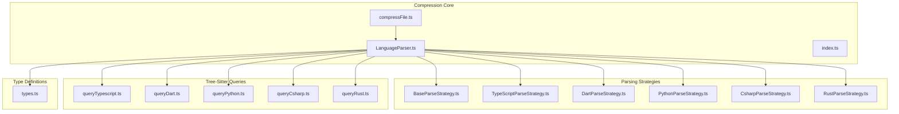
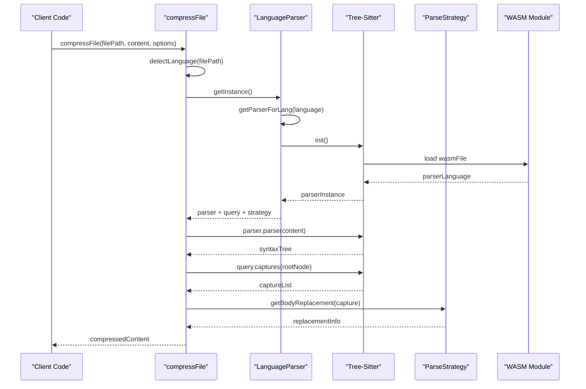
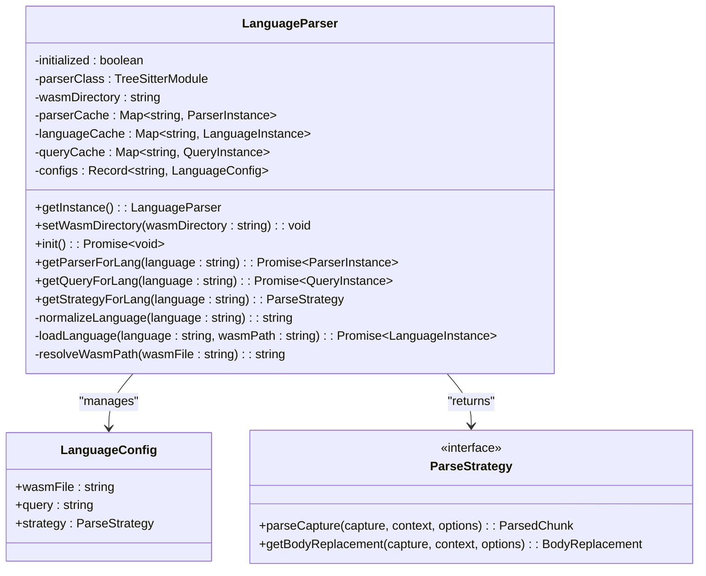

# Multi-Language Compression Support

<cite>
**Referenced Files in This Document**
- [index.ts](file://src/core/compression/index.ts)
- [LanguageParser.ts](file://src/core/compression/LanguageParser.ts)
- [compressFile.ts](file://src/core/compression/compressFile.ts)
- [types.ts](file://src/core/compression/types.ts)
- [BaseParseStrategy.ts](file://src/core/compression/strategies/BaseParseStrategy.ts)
- [TypeScriptParseStrategy.ts](file://src/core/compression/strategies/TypeScriptParseStrategy.ts)
- [DartParseStrategy.ts](file://src/core/compression/strategies/DartParseStrategy.ts)
- [PythonParseStrategy.ts](file://src/core/compression/strategies/PythonParseStrategy.ts)
- [CsharpParseStrategy.ts](file://src/core/compression/strategies/CsharpParseStrategy.ts)
- [RustParseStrategy.ts](file://src/core/compression/strategies/RustParseStrategy.ts)
- [queryTypescript.ts](file://src/core/compression/queries/queryTypescript.ts)
- [queryDart.ts](file://src/core/compression/queries/queryDart.ts)
- [queryPython.ts](file://src/core/compression/queries/queryPython.ts)
- [queryCsharp.ts](file://src/core/compression/queries/queryCsharp.ts)
- [queryRust.ts](file://src/core/compression/queries/queryRust.ts)
</cite>

## Table of Contents
1. [Introduction](#introduction)
2. [Project Structure](#project-structure)
3. [Core Components](#core-components)
4. [Architecture Overview](#architecture-overview)
5. [Detailed Component Analysis](#detailed-component-analysis)
6. [Language Support Matrix](#language-support-matrix)
7. [Performance Considerations](#performance-considerations)
8. [Troubleshooting Guide](#troubleshooting-guide)
9. [Conclusion](#conclusion)

## Introduction

The Multi-Language Compression Support system provides intelligent code compression capabilities across multiple programming languages using Tree-Sitter parsing technology. This system enables developers to selectively compress code while preserving essential structural information, making codebases more manageable for AI assistance, documentation generation, and code sharing scenarios.

The compression system supports five major programming languages: TypeScript/JavaScript, Dart, Python, C#, and Rust. Each language has specialized parsing strategies that understand language-specific syntax patterns, allowing for accurate extraction of function signatures, class skeletons, and other structural elements while removing implementation details.

## Project Structure

The compression system is organized into several key modules that work together to provide language-agnostic compression capabilities:



**Diagram sources**
- [compressFile.ts](file://src/core/compression/compressFile.ts#L1-L85)
- [LanguageParser.ts](file://src/core/compression/LanguageParser.ts#L1-L218)
- [BaseParseStrategy.ts](file://src/core/compression/strategies/BaseParseStrategy.ts#L1-L75)

**Section sources**
- [index.ts](file://src/core/compression/index.ts#L1-L3)
- [compressFile.ts](file://src/core/compression/compressFile.ts#L1-L85)
- [LanguageParser.ts](file://src/core/compression/LanguageParser.ts#L1-L218)

## Core Components

### LanguageParser Service

The LanguageParser serves as the central coordinator for all compression operations. It implements a singleton pattern to ensure efficient resource utilization and manages the lifecycle of Tree-Sitter parsers, queries, and language configurations.

Key responsibilities include:
- Language detection based on file extensions
- Tree-Sitter parser initialization and caching
- Query loading and compilation
- Strategy selection for specific languages
- WASM module path resolution

### Compression Pipeline

The compression pipeline follows a structured approach:

1. **Language Detection**: File extensions are mapped to supported languages
2. **Parser Initialization**: Tree-Sitter parsers are loaded with appropriate grammars
3. **Syntax Tree Generation**: Source code is parsed into syntax trees
4. **Pattern Matching**: Language-specific queries identify structural elements
5. **Selective Compression**: Implementation details are removed while preserving signatures
6. **Result Construction**: Compressed content is generated with preserved whitespace

### Strategy Pattern Implementation

Each programming language has a dedicated parsing strategy that extends the base strategy class. These strategies handle language-specific syntax patterns, node type recognition, and compression logic.

**Section sources**
- [LanguageParser.ts](file://src/core/compression/LanguageParser.ts#L26-L218)
- [compressFile.ts](file://src/core/compression/compressFile.ts#L25-L85)
- [BaseParseStrategy.ts](file://src/core/compression/strategies/BaseParseStrategy.ts#L11-L75)

## Architecture Overview

The compression system employs a modular architecture that separates concerns between language detection, parsing, and compression logic:



**Diagram sources**
- [compressFile.ts](file://src/core/compression/compressFile.ts#L25-L85)
- [LanguageParser.ts](file://src/core/compression/LanguageParser.ts#L95-L164)

The architecture ensures scalability and maintainability through clear separation of concerns and reusable components.

**Section sources**
- [compressFile.ts](file://src/core/compression/compressFile.ts#L25-L85)
- [LanguageParser.ts](file://src/core/compression/LanguageParser.ts#L83-L130)

## Detailed Component Analysis

### LanguageParser Implementation

The LanguageParser implements a sophisticated caching mechanism to optimize performance across multiple compression operations:



**Diagram sources**
- [LanguageParser.ts](file://src/core/compression/LanguageParser.ts#L26-L218)
- [types.ts](file://src/core/compression/types.ts#L61-L66)

The parser service maintains separate caches for parsers, languages, and queries to minimize initialization overhead during repeated compression operations.

### BaseParseStrategy Framework

The BaseParseStrategy provides common functionality shared across all language-specific strategies:

Key utilities include:
- **Node Text Extraction**: Safely extracts text content from syntax nodes
- **Whitespace Normalization**: Consistent formatting of extracted content
- **Signature Processing**: Intelligent parsing of function and method signatures
- **Body Range Detection**: Accurate identification of code block boundaries

### Language-Specific Strategies

Each language strategy implements specialized logic for handling language-specific syntax patterns:

#### TypeScript/JavaScript Strategy
Handles function declarations, class definitions, method signatures, and export/import statements with support for modern JavaScript features including arrow functions and generator functions.

#### Dart Strategy
Supports class definitions, function declarations, method signatures, and import/export directives specific to Dart's syntax including library and part directives.

#### Python Strategy
Manages Python's unique syntax including decorated functions, class definitions, and indentation-based block structure. Special handling for decorator patterns and function signatures.

#### C# Strategy
Addresses C#'s property declarations, method signatures, class definitions, and namespace structures. Includes special handling for property getters/setters and file-scoped namespaces.

#### Rust Strategy
Handles Rust's function declarations, struct/class definitions, trait implementations, and macro definitions. Supports both traditional and modern Rust syntax patterns.

**Section sources**
- [BaseParseStrategy.ts](file://src/core/compression/strategies/BaseParseStrategy.ts#L11-L75)
- [TypeScriptParseStrategy.ts](file://src/core/compression/strategies/TypeScriptParseStrategy.ts#L12-L208)
- [DartParseStrategy.ts](file://src/core/compression/strategies/DartParseStrategy.ts#L12-L182)
- [PythonParseStrategy.ts](file://src/core/compression/strategies/PythonParseStrategy.ts#L12-L238)
- [CsharpParseStrategy.ts](file://src/core/compression/strategies/CsharpParseStrategy.ts#L12-L195)
- [RustParseStrategy.ts](file://src/core/compression/strategies/RustParseStrategy.ts#L12-L193)

### Tree-Sitter Query System

Each language uses specialized Tree-Sitter queries to identify structural elements within source code:

| Language | Query Patterns | Supported Elements |
|----------|---------------|-------------------|
| TypeScript | Import/Export, Functions, Classes, Interfaces, Types, Enums | Complete structural coverage |
| Dart | Import/Export, Classes, Functions, Methods, Enums, Typedefs | Dart-specific constructs |
| Python | Import Statements, Decorated Definitions, Functions, Classes | Python decorators and blocks |
| C# | Using Directives, Classes, Methods, Properties, Interfaces | C# specific syntax |
| Rust | Use Declarations, Functions, Structs, Traits, Impl Blocks | Rust module system |

**Section sources**
- [queryTypescript.ts](file://src/core/compression/queries/queryTypescript.ts#L1-L18)
- [queryDart.ts](file://src/core/compression/queries/queryDart.ts#L1-L25)
- [queryPython.ts](file://src/core/compression/queries/queryPython.ts#L1-L11)
- [queryCsharp.ts](file://src/core/compression/queries/queryCsharp.ts#L1-L22)
- [queryRust.ts](file://src/core/compression/queries/queryRust.ts#L1-L22)

## Language Support Matrix

The compression system provides comprehensive support for modern programming languages with varying levels of structural element recognition:

```mermaid
flowchart TD
subgraph "Supported Languages"
TS[TypeScript/JavaScript]
DT[Dart]
PY[Python]
CS[C#]
RS[Rust]
end
subgraph "Compression Features"
IMP[Import/Export<br/>Statements]
FUN[Function<br/>Signatures]
CLS[Class/Skeleton<br/>Structures]
MTH[Method<br/>Definitions]
DEC[Decorators<br/>(Python)]
SKL[Skeleton<br/>Generation]
end
TS --> IMP
TS --> FUN
TS --> CLS
TS --> MTH
TS --> SKL
DT --> IMP
DT --> FUN
DT --> CLS
DT --> MTH
DT --> SKL
PY --> IMP
PY --> FUN
PY --> CLS
PY --> DEC
PY --> SKL
CS --> IMP
CS --> FUN
CS --> CLS
CS --> MTH
CS --> SKL
RS --> IMP
RS --> FUN
RS --> CLS
RS --> SKL
```

**Diagram sources**
- [compressFile.ts](file://src/core/compression/compressFile.ts#L4-L23)
- [LanguageParser.ts](file://src/core/compression/LanguageParser.ts#L37-L69)

**Section sources**
- [compressFile.ts](file://src/core/compression/compressFile.ts#L4-L23)
- [LanguageParser.ts](file://src/core/compression/LanguageParser.ts#L37-L69)

## Performance Considerations

The compression system implements several optimization strategies to ensure efficient processing:

### Caching Strategy
- Parser instances are cached per language to avoid repeated initialization
- Language modules are cached after first load
- Query objects are cached for improved performance
- WASM module paths are resolved once and reused

### Memory Management
- Weak references are used where appropriate to prevent memory leaks
- Large string operations are performed efficiently using slice operations
- Capture lists are processed in reverse order to maintain index validity

### Asynchronous Operations
- All Tree-Sitter operations are asynchronous to prevent blocking
- WASM module loading is optimized through path resolution
- Parser initialization uses lazy loading patterns

**Section sources**
- [LanguageParser.ts](file://src/core/compression/LanguageParser.ts#L33-L36)
- [LanguageParser.ts](file://src/core/compression/LanguageParser.ts#L185-L198)
- [compressFile.ts](file://src/core/compression/compressFile.ts#L53-L75)

## Troubleshooting Guide

### Common Issues and Solutions

**Language Not Recognized**
- Verify file extension matches supported languages
- Check that Tree-Sitter WASM files are available in expected locations
- Ensure language-specific queries are properly loaded

**Compression Returns Null**
- Occurs when no structural elements are found
- May indicate unsupported file format or empty content
- Check that Tree-Sitter grammar is compatible with the code

**Performance Issues**
- Monitor cache effectiveness for repeated operations
- Verify WASM module loading paths
- Consider reducing concurrent compression operations

**Memory Leaks**
- LanguageParser uses singleton pattern to prevent multiple instances
- Cache keys use normalized language names
- Ensure proper cleanup of large content buffers

### Debugging Tips

Enable verbose logging to track compression operations:
- Monitor parser initialization status
- Track query compilation results
- Observe capture processing order
- Verify replacement operations

**Section sources**
- [compressFile.ts](file://src/core/compression/compressFile.ts#L80-L83)
- [LanguageParser.ts](file://src/core/compression/LanguageParser.ts#L113-L120)
- [LanguageParser.ts](file://src/core/compression/LanguageParser.ts#L200-L216)

## Conclusion

The Multi-Language Compression Support system provides a robust, extensible framework for intelligent code compression across multiple programming languages. Through its modular architecture, sophisticated caching mechanisms, and language-specific parsing strategies, it delivers efficient and accurate compression capabilities.

Key strengths include:
- Comprehensive language support with specialized parsing strategies
- Efficient caching and resource management
- Extensible architecture for adding new languages
- Robust error handling and performance optimization
- Flexible configuration options for selective compression

The system successfully balances accuracy and performance, making it suitable for production environments where code compression is needed for various AI-assisted development workflows, documentation generation, and code sharing scenarios.