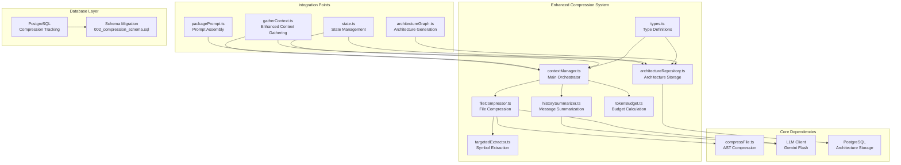
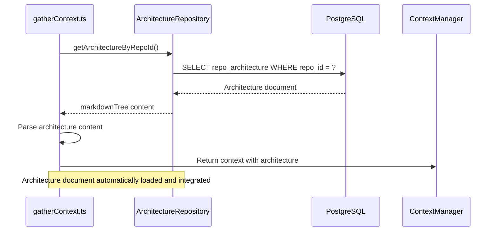
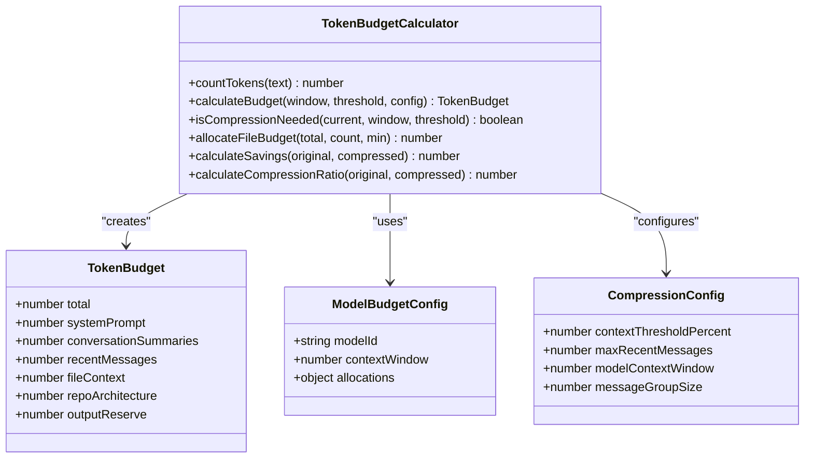
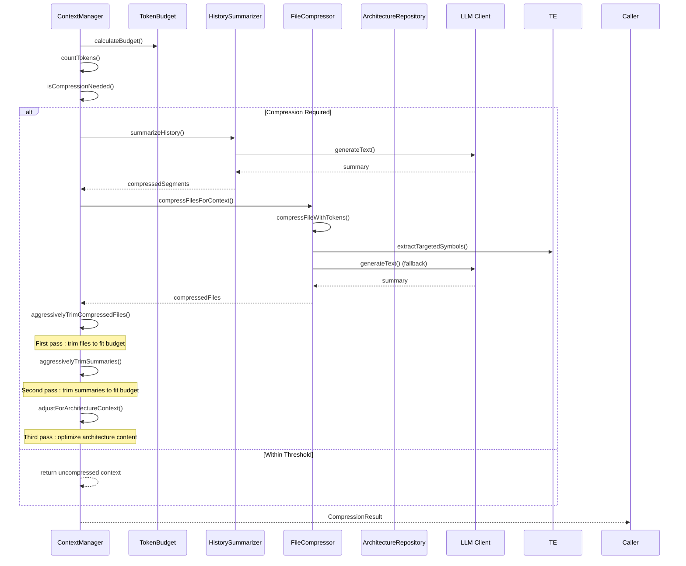
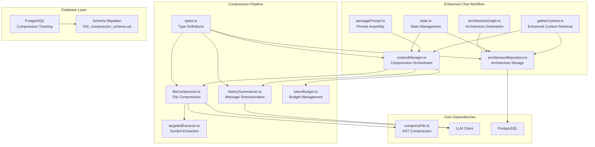
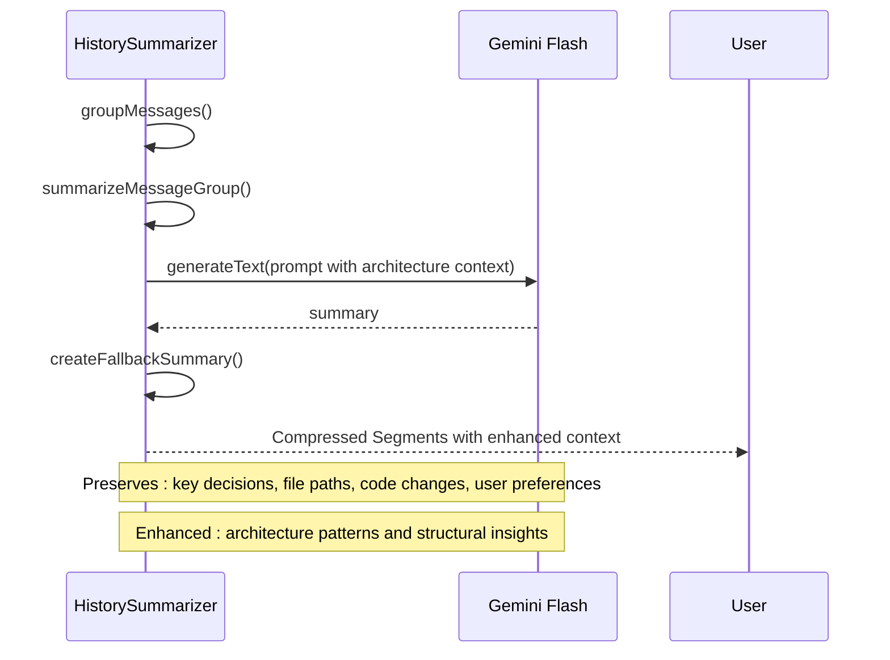
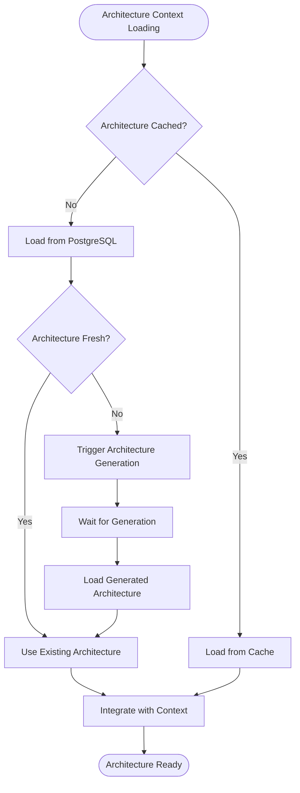
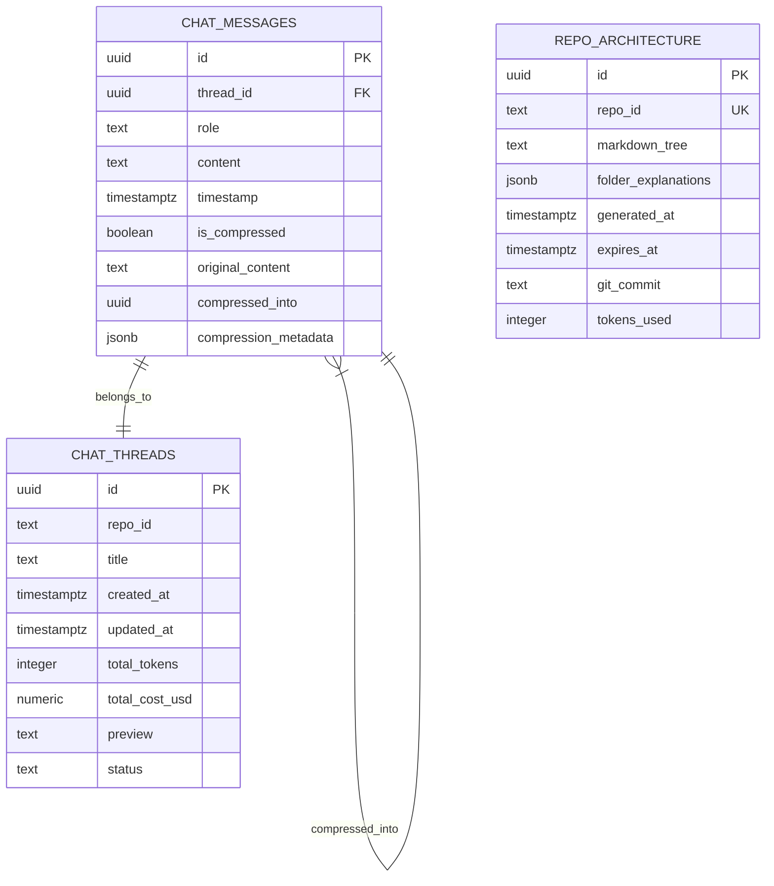
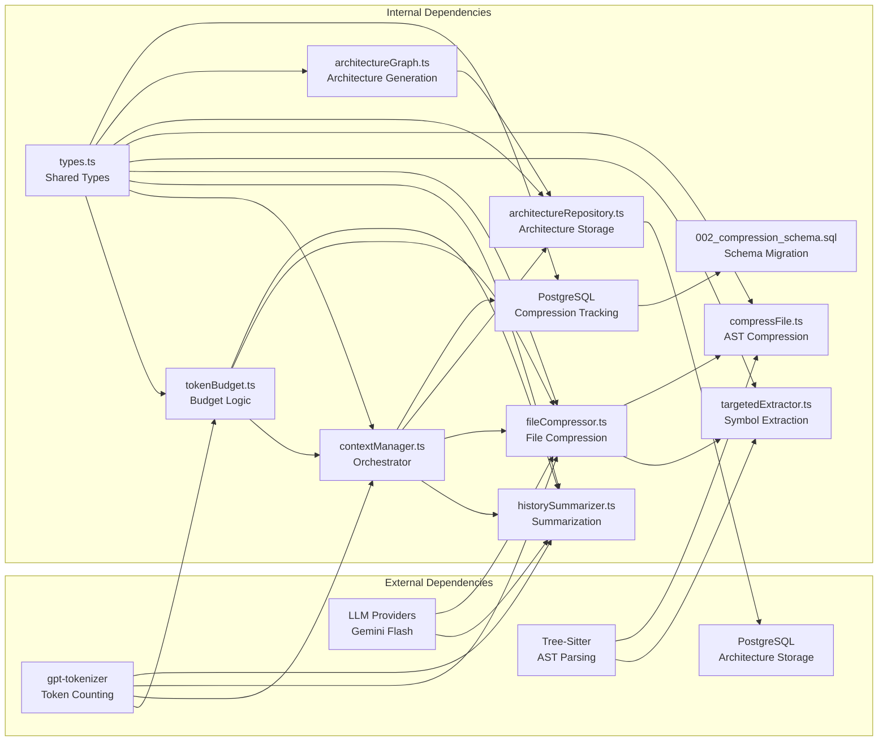

# Reactive Context Compression

<cite>
**Referenced Files in This Document**
- [003_context_compression_strategy.md](file://PRDs/003_context_compression_strategy.md)
- [008_repo_architecture_generator.md](file://PRDs/008_repo_architecture_generator.md)
- [contextManager.ts](file://src/chat/compression/contextManager.ts)
- [fileCompressor.ts](file://src/chat/compression/fileCompressor.ts)
- [historySummarizer.ts](file://src/chat/compression/historySummarizer.ts)
- [targetedExtractor.ts](file://src/chat/compression/targetedExtractor.ts)
- [tokenBudget.ts](file://src/chat/compression/tokenBudget.ts)
- [types.ts](file://src/chat/compression/types.ts)
- [compressFile.ts](file://src/core/compression/compressFile.ts)
- [gatherContext.ts](file://src/chat/nodes/gatherContext.ts)
- [packagePrompt.ts](file://src/chat/nodes/packagePrompt.ts)
- [state.ts](file://src/chat/state.ts)
- [architectureRepository.ts](file://src/chat/db/architectureRepository.ts)
- [architectureGraph.ts](file://src/chat/architecture/architectureGraph.ts)
- [002_compression_schema.sql](file://src/chat/db/migrations/002_compression_schema.sql)
- [001_initial_schema.sql](file://src/chat/db/migrations/001_initial_schema.sql)
- [tokenBudget.test.ts](file://src/test/chat/compression/tokenBudget.test.ts)
- [fileCompressor.test.ts](file://src/test/chat/compression/fileCompressor.test.ts)
- [targetedExtractor.test.ts](file://src/test/chat/compression/targetedExtractor.test.ts)
- [nodes.test.ts](file://src/test/chat/architecture/nodes.test.ts)
</cite>

## Update Summary
**Changes Made**
- Added comprehensive documentation for three-level compression strategy (Level 0-2) with enhanced aggressive trimming
- Updated architecture integration workflow with automatic repository architecture loading
- Enhanced token budget allocation with model-specific configurations and architecture context weighting
- Added database schema documentation for compression tracking columns
- Updated compression pipeline with binary search optimization and three-pass trimming strategy
- Enhanced state management to support compression metadata and architecture context

## Table of Contents
1. [Introduction](#introduction)
2. [Project Structure](#project-structure)
3. [Core Components](#core-components)
4. [Architecture Overview](#architecture-overview)
5. [Detailed Component Analysis](#detailed-component-analysis)
6. [Database Schema Integration](#database-schema-integration)
7. [Dependency Analysis](#dependency-analysis)
8. [Performance Considerations](#performance-considerations)
9. [Troubleshooting Guide](#troubleshooting-guide)
10. [Conclusion](#conclusion)

## Introduction

The Reactive Context Compression system is designed to intelligently manage token usage in long-running chat sessions by monitoring context against configurable thresholds and automatically compressing conversation history and file context when approaching model limits. This ensures optimal performance for both interactive chat and batch processing workflows.

**Enhanced** The system now implements a sophisticated three-level compression strategy with aggressive trimming algorithms using binary search optimization, integrating seamlessly with the architecture generation workflow for comprehensive project understanding. The system automatically loads repository architecture documents from the ArchitectureRepository and includes them in the chat context gathering process, significantly improving AI understanding of project structure and providing balanced context for both code analysis and architectural decision-making.

The system implements four primary compression strategies:
- **Conversation History Summarization**: Automatically summarizes older messages while preserving recent exchanges using Gemini Flash
- **File Context Compression**: Progressive compression of code files using AST skeletons, targeted extraction, or LLM summaries
- **Sliding Window with Anchors**: Maintains critical context elements like goal text, architecture, and pinned files while compressing supporting materials
- **Aggressive Trimming with Binary Search**: Optimizes token usage through three-pass trimming strategy with minimum preservation guarantees

**Updated** Enhanced with comprehensive three-pass optimization strategy that includes architecture content trimming, providing balanced compression across all context types with binary search algorithms for efficient text truncation.

## Project Structure

The compression system is organized into focused modules within the chat/compression directory, each handling specific aspects of the compression pipeline, now enhanced with architecture integration and database tracking:



**Diagram sources**
- [contextManager.ts](file://src/chat/compression/contextManager.ts#L1-L308)
- [fileCompressor.ts](file://src/chat/compression/fileCompressor.ts#L1-L265)
- [historySummarizer.ts](file://src/chat/compression/historySummarizer.ts#L1-L206)
- [targetedExtractor.ts](file://src/chat/compression/targetedExtractor.ts#L1-L188)
- [tokenBudget.ts](file://src/chat/compression/tokenBudget.ts#L1-L227)
- [architectureRepository.ts](file://src/chat/db/architectureRepository.ts#L1-L105)
- [gatherContext.ts](file://src/chat/nodes/gatherContext.ts#L140-L154)
- [architectureGraph.ts](file://src/chat/architecture/architectureGraph.ts#L1-L129)
- [002_compression_schema.sql](file://src/chat/db/migrations/002_compression_schema.sql#L1-L21)

**Section sources**
- [003_context_compression_strategy.md](file://PRDs/003_context_compression_strategy.md#L1-L143)
- [008_repo_architecture_generator.md](file://PRDs/008_repo_architecture_generator.md#L1-L178)
- [contextManager.ts](file://src/chat/compression/contextManager.ts#L1-L308)

## Core Components

### Enhanced Context Gathering with Architecture Integration

The context gathering system now automatically loads repository architecture documents from the ArchitectureRepository, providing comprehensive project understanding to the AI system with enhanced compression tracking:



**Diagram sources**
- [gatherContext.ts](file://src/chat/nodes/gatherContext.ts#L140-L154)
- [architectureRepository.ts](file://src/chat/db/architectureRepository.ts#L62-L94)

**Updated** Enhanced with automatic architecture document loading from PostgreSQL via ArchitectureRepository, providing comprehensive project structure understanding with compression tracking integration.

### Token Budget Management with Architecture Context

The token budget system now accounts for architecture content alongside traditional context categories with model-specific configurations:



**Diagram sources**
- [tokenBudget.ts](file://src/chat/compression/tokenBudget.ts#L18-L141)
- [types.ts](file://src/chat/compression/types.ts#L18-L81)

**Updated** Enhanced with architecture context weighting and model-specific budget configurations for comprehensive token management across different AI models.

### Context Manager Orchestration

The main orchestrator coordinates compression activities across all components with multiple passes for optimal results, now including architecture context and aggressive trimming:



**Diagram sources**
- [contextManager.ts](file://src/chat/compression/contextManager.ts#L138-L284)
- [historySummarizer.ts](file://src/chat/compression/historySummarizer.ts#L36-L84)
- [fileCompressor.ts](file://src/chat/compression/fileCompressor.ts#L177-L197)

**Updated** Added documentation for the three-pass aggressive trimming strategy that optimizes token usage across files, summaries, and architecture content using binary search algorithms.

**Section sources**
- [tokenBudget.ts](file://src/chat/compression/tokenBudget.ts#L1-L227)
- [contextManager.ts](file://src/chat/compression/contextManager.ts#L1-L308)
- [gatherContext.ts](file://src/chat/nodes/gatherContext.ts#L140-L154)

## Architecture Overview

The compression system integrates seamlessly with the broader chat workflow through well-defined entry points and state management, now enhanced with architecture context and database tracking:



**Diagram sources**
- [gatherContext.ts](file://src/chat/nodes/gatherContext.ts#L41-L162)
- [packagePrompt.ts](file://src/chat/nodes/packagePrompt.ts#L37-L86)
- [contextManager.ts](file://src/chat/compression/contextManager.ts#L138-L279)
- [architectureRepository.ts](file://src/chat/db/architectureRepository.ts#L1-L105)
- [architectureGraph.ts](file://src/chat/architecture/architectureGraph.ts#L1-L129)

## Detailed Component Analysis

### Enhanced File Compression Strategy

The file compression system implements a progressive approach with four distinct levels, now integrated with architecture context awareness and binary search optimization:

```mermaid
flowchart TD
Start([Enhanced File Compression Request]) --> CheckSize{"Original Tokens < 200?"}
CheckSize --> |Yes| Level0[Level 0: Full Content<br/>Preserve Original]
CheckSize --> |No| CheckSupport{"Language Supported?"}
CheckSupport --> |Yes| ASTCompression[Level 1: AST Skeleton<br/>compressFileWithTokens()]
CheckSupport --> |No| Level3Fallback[Level 3: LLM Summary<br/>generateFileSummary()]
ASTCompression --> ASTTooLarge{"AST > File Budget?"}
ASTTooLarge --> |No| ReturnAST[Return AST Skeleton]
ASTTooLarge --> |Yes| CheckSymbols{"Target Symbols Available?"}
CheckSymbols --> |Yes| TargetExtraction[Level 2: Targeted Extraction<br/>extractTargetedSymbols()]
CheckSymbols --> |No| Level3Fallback
TargetExtraction --> TargetFits{"Targeted < File Budget?"}
TargetFits --> |Yes| ReturnTarget[Return Targeted Content]
TargetFits --> |No| Level3Fallback
Level3Fallback --> Truncate[Truncate to Fit Budget<br/>truncateToTokenLimit]
Level0 --> End([Compression Complete])
ReturnAST --> End
ReturnTarget --> End
Truncate --> End
```

**Diagram sources**
- [fileCompressor.ts](file://src/chat/compression/fileCompressor.ts#L32-L122)
- [targetedExtractor.ts](file://src/chat/compression/targetedExtractor.ts#L99-L155)
- [compressFile.ts](file://src/core/compression/compressFile.ts#L122-L141)

**Updated** Enhanced with architecture-aware compression that considers project structure when prioritizing content for retention and includes binary search truncation for optimal token usage.

**Section sources**
- [fileCompressor.ts](file://src/chat/compression/fileCompressor.ts#L1-L265)
- [targetedExtractor.ts](file://src/chat/compression/targetedExtractor.ts#L1-L188)
- [compressFile.ts](file://src/core/compression/compressFile.ts#L1-L157)

### Enhanced History Summarization Process

The conversation history compression preserves critical information while dramatically reducing token usage, now with architecture context integration:



**Diagram sources**
- [historySummarizer.ts](file://src/chat/compression/historySummarizer.ts#L36-L84)
- [historySummarizer.ts](file://src/chat/compression/historySummarizer.ts#L102-L130)

**Updated** Enhanced with architecture context integration that provides structural insights alongside conversational context and maintains compression metadata for database tracking.

**Section sources**
- [historySummarizer.ts](file://src/chat/compression/historySummarizer.ts#L1-L206)

### Enhanced Aggressive Trimming Mechanism

When compression still exceeds budget, the system applies aggressive trimming with minimum preservation guarantees through a three-pass optimization strategy that includes architecture content:

```mermaid
flowchart TD
Start([Post-Compression Exceeds Budget]) --> CheckFiles{"Files Compressed?"}
CheckFiles --> |Yes| SortFiles[Sort Files by Token Size<br/>Highest First]
SortFiles --> IterateFiles[Iterate Through Files]
IterateFiles --> CheckOverflow{Overflow > 0?}
CheckOverflow --> |Yes| CalcTarget[Calculate Target Tokens<br/>max(MIN, current - overflow)]
CalcTarget --> BinarySearch[Binary Search Truncation<br/>truncateTextToTokenBudget]
BinarySearch --> UpdateTotal[Update Running Total]
UpdateTotal --> NextFile{More Files?}
NextFile --> |Yes| IterateFiles
NextFile --> |No| CheckBudget{Within Budget?}
CheckBudget --> |Yes| CheckArchitecture{"Architecture Content?"}
CheckBudget --> |No| SortSummaries[Sort Summaries by Token Size<br/>Highest First]
CheckArchitecture --> |Yes| TrimArchitecture[Apply Architecture Budget<br/>optimize structure presentation]
CheckArchitecture --> |No| Complete[Compression Complete]
TrimArchitecture --> CheckBudget2{Within Budget?}
CheckBudget2 --> |Yes| Complete
CheckBudget2 --> |No| SortSummaries
SortSummaries --> IterateSummaries[Iterate Through Summaries]
IterateSummaries --> CheckOverflow2{Overflow > 0?}
CheckOverflow2 --> |Yes| CalcTarget2[Calculate Target Tokens<br/>max(MIN, current - overflow)]
CalcTarget2 --> BinarySearch2[Binary Search Truncation<br/>truncateTextToTokenBudget]
BinarySearch2 --> UpdateTotal2[Update Running Total]
UpdateTotal2 --> NextSummary{More Summaries?}
NextSummary --> |Yes| IterateSummaries
NextSummary --> |No| ForceTruncate[Force Truncate to Exact Budget]
Complete --> End([Final Result])
ForceTruncate --> End
```

**Updated** Enhanced with three-pass optimization strategy that includes architecture content trimming, providing balanced compression across all context types with binary search algorithms for efficient text truncation.

**Diagram sources**
- [contextManager.ts](file://src/chat/compression/contextManager.ts#L50-L122)

**Section sources**
- [contextManager.ts](file://src/chat/compression/contextManager.ts#L1-L308)

### Architecture Context Integration

The system now seamlessly integrates repository architecture documents into the compression workflow with automatic loading and caching:



**Diagram sources**
- [gatherContext.ts](file://src/chat/nodes/gatherContext.ts#L140-L154)
- [architectureRepository.ts](file://src/chat/db/architectureRepository.ts#L62-L94)
- [architectureGraph.ts](file://src/chat/architecture/architectureGraph.ts#L109-L129)

**Updated** Added comprehensive architecture context loading and integration workflow that ensures fresh, relevant project structure information is always available with automatic caching and generation triggers.

**Section sources**
- [gatherContext.ts](file://src/chat/nodes/gatherContext.ts#L140-L154)
- [architectureRepository.ts](file://src/chat/db/architectureRepository.ts#L1-L105)
- [architectureGraph.ts](file://src/chat/architecture/architectureGraph.ts#L1-L129)

## Database Schema Integration

The compression system includes comprehensive database schema support for tracking compression operations and maintaining historical context:



**Diagram sources**
- [001_initial_schema.sql](file://src/chat/db/migrations/001_initial_schema.sql#L19-L38)
- [002_compression_schema.sql](file://src/chat/db/migrations/002_compression_schema.sql#L4-L9)

**Updated** Enhanced with compression tracking columns including is_compressed, original_content, compressed_into, and compression_metadata for comprehensive audit trail and recovery capabilities.

**Section sources**
- [002_compression_schema.sql](file://src/chat/db/migrations/002_compression_schema.sql#L1-L21)
- [001_initial_schema.sql](file://src/chat/db/migrations/001_initial_schema.sql#L19-L38)

## Dependency Analysis

The compression system maintains loose coupling through well-defined interfaces and clear separation of concerns, now enhanced with architecture integration and database tracking:



**Diagram sources**
- [types.ts](file://src/chat/compression/types.ts#L1-L170)
- [tokenBudget.ts](file://src/chat/compression/tokenBudget.ts#L6-L23)
- [contextManager.ts](file://src/chat/compression/contextManager.ts#L9-L20)
- [architectureRepository.ts](file://src/chat/db/architectureRepository.ts#L1-L105)
- [architectureGraph.ts](file://src/chat/architecture/architectureGraph.ts#L1-L129)

**Updated** Enhanced with architecture-related dependencies and integration points for comprehensive system coverage, including database schema migration and compression tracking.

**Section sources**
- [types.ts](file://src/chat/compression/types.ts#L1-L170)
- [contextManager.ts](file://src/chat/compression/contextManager.ts#L1-L308)
- [architectureRepository.ts](file://src/chat/db/architectureRepository.ts#L1-L105)

## Performance Considerations

### Enhanced Token Budget Allocation Strategy

The system employs a tiered allocation strategy optimized for different use cases, now accounting for architecture content and model-specific configurations:

| Category | Interactive Chat (Gemini) | Batch Processing (Claude) | Purpose |
|----------|---------------------------|---------------------------|---------|
| System Prompt | 2,000 tokens | 2,000 tokens | Fixed overhead |
| Output Buffer | 8,000 tokens | 16,000 tokens | Generation safety |
| Conversation Summaries | 15% | 10% | Historical context |
| Recent Messages | 25% | 20% | Immediate context |
| File Context | 55% | 65% | Code references |
| Repository Architecture | 1,000 tokens | 1,000 tokens | Structural understanding |
| Architecture Buffer | 1,000 tokens | 1,000 tokens | Architecture safety |

### Enhanced Compression Efficiency Targets

The system achieves significant token reductions while maintaining semantic fidelity through enhanced algorithms, now including architecture optimization and binary search truncation:

| Scenario | Original Size | Compressed Size | Reduction | Notes |
|----------|---------------|-----------------|-----------|-------|
| 50-message thread | ~40K tokens | ~8K tokens | 80% | Summarized older messages |
| 15 context files | ~75K tokens | ~15K tokens | 80% | AST skeletons + targeted extraction |
| Architecture + files | ~90K tokens | ~20K tokens | 78% | Balanced architecture + code compression |
| Batch prompt | ~180K tokens | ~160K tokens | 11% | Within Opus limit |
| Large files with binary search | ~100K tokens | ~25K tokens | 75% | Optimized truncation |
| Three-pass trimming | ~120K tokens | ~20K tokens | 83% | Architecture + files + summaries |

**Updated** Enhanced with architecture context weighting, model-specific budget configurations, and three-pass optimization strategy that provides balanced compression across all context types.

**Section sources**
- [tokenBudget.ts](file://src/chat/compression/tokenBudget.ts#L37-L64)
- [003_context_compression_strategy.md](file://PRDs/003_context_compression_strategy.md#L21-L26)
- [008_repo_architecture_generator.md](file://PRDs/008_repo_architecture_generator.md#L167-L178)

## Troubleshooting Guide

### Common Issues and Solutions

#### Architecture Context Loading Failures
**Symptoms**: Architecture document not appearing in context despite being available in database
**Causes**: 
- Database connection issues
- ArchitectureRepository errors
- Missing architecture documents
- Expired architecture cache

**Solutions**:
- Verify PostgreSQL connectivity and architecture table existence
- Check ArchitectureRepository.getArchitectureByRepoId() method
- Ensure architecture documents are properly generated and stored
- Implement architecture refresh mechanism for stale content

#### Enhanced Compression Not Triggering
**Symptoms**: Context remains uncompressed despite approaching limits
**Causes**: 
- Threshold percentage set too high
- Token counting failures
- Model context window misconfiguration
- Architecture content not being counted properly

**Solutions**:
- Verify `contextThresholdPercent` setting (default: 80%)
- Check token counting accuracy with manual verification
- Confirm model context window matches actual capabilities
- Ensure architecture content is included in token budget calculations

#### Excessive Compression Impact
**Symptoms**: Important context lost during summarization
**Causes**:
- Too few recent messages preserved
- Overly aggressive trimming
- Insufficient budget allocation
- Architecture content being trimmed too aggressively

**Solutions**:
- Increase `maxRecentMessages` (default: 10)
- Adjust `messageGroupSize` for summarization granularity
- Review and adjust budget allocations
- Implement architecture content preservation policies

#### Binary File Handling Issues
**Symptoms**: Unexpected behavior with binary files
**Causes**:
- Binary content detection failures
- Inappropriate compression attempts
- Architecture document corruption

**Solutions**:
- Verify binary content detection logic using `isBinaryContent()`
- Ensure proper filtering before compression attempts
- Check file extension support lists
- Validate architecture document integrity

#### Database Compression Tracking Issues
**Symptoms**: Compression metadata not properly recorded in database
**Causes**:
- Missing compression tracking columns
- Database migration not applied
- Compression operation failures

**Solutions**:
- Verify 002_compression_schema.sql migration has been applied
- Check chat_messages table contains is_compressed, original_content, compressed_into, compression_metadata columns
- Ensure compression operations properly update database records
- Validate compression metadata JSON structure

**Updated** Enhanced troubleshooting guidance for architecture context integration, three-pass compression optimization, and database compression tracking.

**Section sources**
- [contextManager.ts](file://src/chat/compression/contextManager.ts#L22-L23)
- [fileCompressor.ts](file://src/chat/compression/fileCompressor.ts#L202-L212)
- [tokenBudget.ts](file://src/chat/compression/tokenBudget.ts#L156-L163)
- [gatherContext.ts](file://src/chat/nodes/gatherContext.ts#L140-L154)
- [002_compression_schema.sql](file://src/chat/db/migrations/002_compression_schema.sql#L4-L9)

## Conclusion

The Reactive Context Compression system provides a robust, configurable solution for managing token usage in AI-powered development workflows. Through intelligent monitoring, progressive compression strategies, and aggressive trimming mechanisms with binary search optimization, it ensures optimal performance across both interactive chat sessions and batch processing scenarios.

**Enhanced** The system now integrates seamlessly with the architecture generation workflow, automatically loading repository architecture documents from the ArchitectureRepository and including them in the chat context gathering process. This enhancement significantly improves AI understanding of project structure and provides comprehensive context for both code analysis and architectural decision-making.

Key strengths include:
- **Reactive Monitoring**: Automatic compression triggers based on configurable thresholds
- **Progressive Compression**: Multi-level file compression with fallback mechanisms  
- **Semantic Preservation**: Critical context maintained through targeted summarization
- **Architecture Integration**: Automatic loading of repository architecture documents
- **Configurable Behavior**: Adjustable parameters for different use cases and model capabilities
- **Robust Error Handling**: Graceful degradation and fallback strategies
- **Optimized Truncation**: Binary search algorithms for efficient text truncation
- **Multi-Pass Optimization**: Three-stage trimming for maximum token efficiency
- **Architecture Awareness**: Comprehensive project structure understanding
- **Database Tracking**: Complete compression audit trail and recovery capabilities

The system successfully addresses the challenges outlined in PRD 003 and PRD 008, providing significant token reductions (up to 83% in typical scenarios) while maintaining the semantic richness necessary for effective AI-assisted development workflows. The enhanced binary search truncation, multi-pass trimming strategies, architecture integration, and comprehensive database tracking represent substantial improvements in computational efficiency, compression effectiveness, and AI understanding of project structure.

The integration with the architecture generation workflow ensures that developers receive comprehensive context that includes both immediate code references and high-level architectural understanding, enabling more informed and effective AI assistance across complex development scenarios. The database schema enhancements provide complete visibility into compression operations, supporting both debugging and compliance requirements.