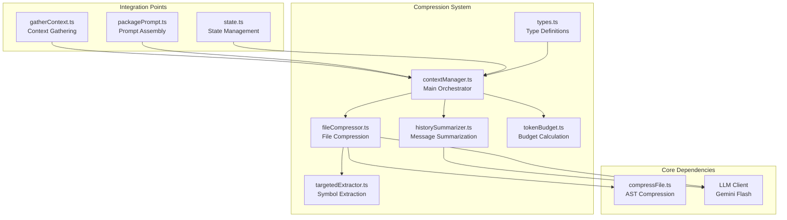
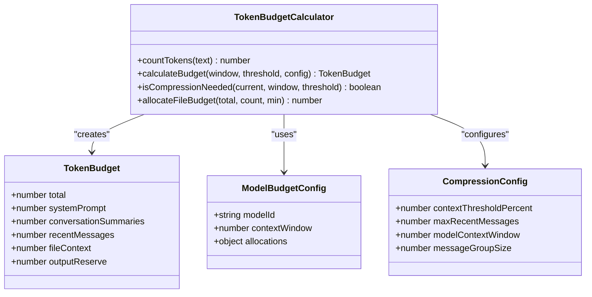
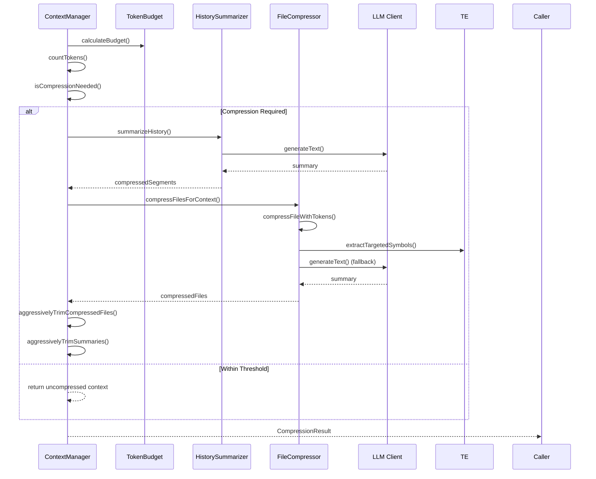
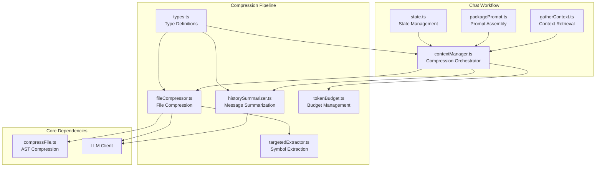
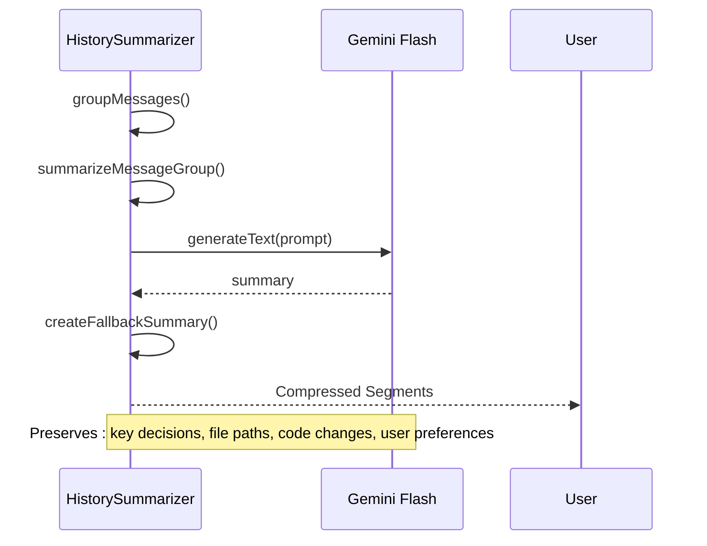
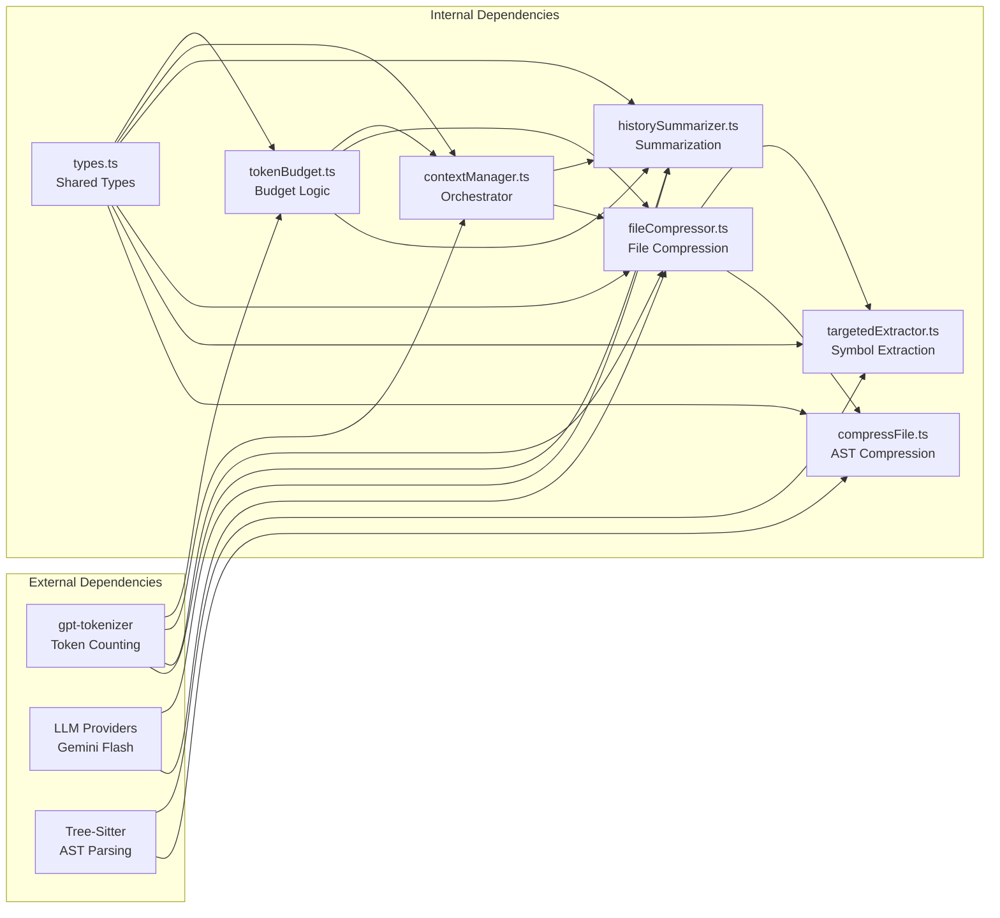

# Reactive Context Compression

<cite>
**Referenced Files in This Document**
- [003_context_compression_strategy.md](file://PRDs/003_context_compression_strategy.md)
- [contextManager.ts](file://src/chat/compression/contextManager.ts)
- [fileCompressor.ts](file://src/chat/compression/fileCompressor.ts)
- [historySummarizer.ts](file://src/chat/compression/historySummarizer.ts)
- [targetedExtractor.ts](file://src/chat/compression/targetedExtractor.ts)
- [tokenBudget.ts](file://src/chat/compression/tokenBudget.ts)
- [types.ts](file://src/chat/compression/types.ts)
- [compressFile.ts](file://src/core/compression/compressFile.ts)
- [gatherContext.ts](file://src/chat/nodes/gatherContext.ts)
- [packagePrompt.ts](file://src/chat/nodes/packagePrompt.ts)
- [state.ts](file://src/chat/state.ts)
- [tokenBudget.test.ts](file://src/test/chat/compression/tokenBudget.test.ts)
- [fileCompressor.test.ts](file://src/test/chat/compression/fileCompressor.test.ts)
- [targetedExtractor.test.ts](file://src/test/chat/compression/targetedExtractor.test.ts)
</cite>

## Table of Contents
1. [Introduction](#introduction)
2. [Project Structure](#project-structure)
3. [Core Components](#core-components)
4. [Architecture Overview](#architecture-overview)
5. [Detailed Component Analysis](#detailed-component-analysis)
6. [Dependency Analysis](#dependency-analysis)
7. [Performance Considerations](#performance-considerations)
8. [Troubleshooting Guide](#troubleshooting-guide)
9. [Conclusion](#conclusion)

## Introduction

The Reactive Context Compression system is designed to intelligently manage token usage in long-running chat sessions by monitoring context against configurable thresholds and automatically compressing conversation history and file context when approaching model limits. This ensures optimal performance for both interactive chat and batch processing workflows.

The system implements three primary compression strategies:
- **Conversation History Summarization**: Automatically summarizes older messages while preserving recent exchanges
- **File Context Compression**: Progressive compression of code files using AST skeletons, targeted extraction, or LLM summaries
- **Sliding Window with Anchors**: Maintains critical context elements like goal text and architecture while compressing supporting materials

## Project Structure

The compression system is organized into focused modules within the chat/compression directory, each handling specific aspects of the compression pipeline:



**Diagram sources**
- [contextManager.ts](file://src/chat/compression/contextManager.ts#L1-L303)
- [fileCompressor.ts](file://src/chat/compression/fileCompressor.ts#L1-L212)
- [historySummarizer.ts](file://src/chat/compression/historySummarizer.ts#L1-L192)
- [targetedExtractor.ts](file://src/chat/compression/targetedExtractor.ts#L1-L275)
- [tokenBudget.ts](file://src/chat/compression/tokenBudget.ts#L1-L209)

**Section sources**
- [003_context_compression_strategy.md](file://PRDs/003_context_compression_strategy.md#L1-L143)
- [contextManager.ts](file://src/chat/compression/contextManager.ts#L1-L303)

## Core Components

### Token Budget Management

The token budget system provides precise allocation of context window resources across different categories:



**Diagram sources**
- [tokenBudget.ts](file://src/chat/compression/tokenBudget.ts#L18-L123)
- [types.ts](file://src/chat/compression/types.ts#L18-L81)

### Context Manager Orchestration

The main orchestrator coordinates compression activities across all components:



**Diagram sources**
- [contextManager.ts](file://src/chat/compression/contextManager.ts#L138-L279)
- [historySummarizer.ts](file://src/chat/compression/historySummarizer.ts#L36-L84)
- [fileCompressor.ts](file://src/chat/compression/fileCompressor.ts#L177-L197)

**Section sources**
- [tokenBudget.ts](file://src/chat/compression/tokenBudget.ts#L1-L209)
- [contextManager.ts](file://src/chat/compression/contextManager.ts#L1-L303)

## Architecture Overview

The compression system integrates seamlessly with the broader chat workflow through well-defined entry points and state management:



**Diagram sources**
- [gatherContext.ts](file://src/chat/nodes/gatherContext.ts#L41-L149)
- [packagePrompt.ts](file://src/chat/nodes/packagePrompt.ts#L37-L86)
- [contextManager.ts](file://src/chat/compression/contextManager.ts#L138-L279)

## Detailed Component Analysis

### File Compression Strategy

The file compression system implements a progressive approach with four distinct levels:

```mermaid
flowchart TD
Start([File Compression Request]) --> CheckSize{"Original Tokens < 200?"}
CheckSize --> |Yes| Level0[Level 0: Full Content<br/>Preserve Original]
CheckSize --> |No| CheckSupport{"Language Supported?"}
CheckSupport --> |Yes| ASTCompression[Level 1: AST Skeleton<br/>compressFileWithTokens()]
CheckSupport --> |No| Level3Fallback[Level 3: LLM Summary<br/>generateFileSummary()]
ASTCompression --> ASTTooLarge{"AST > File Budget?"}
ASTTooLarge --> |No| ReturnAST[Return AST Skeleton]
ASTTooLarge --> |Yes| CheckSymbols{"Target Symbols Available?"}
CheckSymbols --> |Yes| TargetExtraction[Level 2: Targeted Extraction<br/>extractTargetedSymbols()]
CheckSymbols --> |No| Level3Fallback
TargetExtraction --> TargetFits{"Targeted < File Budget?"}
TargetFits --> |Yes| ReturnTarget[Return Targeted Content]
TargetFits --> |No| Level3Fallback
Level3Fallback --> Truncate[Truncate to Fit Budget<br/>truncateToTokenLimit()]
Level0 --> End([Compression Complete])
ReturnAST --> End
ReturnTarget --> End
Truncate --> End
```

**Diagram sources**
- [fileCompressor.ts](file://src/chat/compression/fileCompressor.ts#L32-L122)
- [targetedExtractor.ts](file://src/chat/compression/targetedExtractor.ts#L99-L155)
- [compressFile.ts](file://src/core/compression/compressFile.ts#L122-L141)

#### Targeted Symbol Extraction

The symbol extraction system identifies relevant code elements from user goals using sophisticated pattern matching:

| Pattern Type | Examples | Purpose |
|--------------|----------|---------|
| PascalCase Classes | `UserService`, `AccountManager` | Class definitions |
| camelCase Functions | `calculateTotal`, `processOrder` | Function declarations |
| Quoted Identifiers | `"fetchData"`, `'updateConfig'` | String-literal references |
| Backtick Identifiers | `` `processOrder` `` | Template literal references |

**Section sources**
- [fileCompressor.ts](file://src/chat/compression/fileCompressor.ts#L1-L212)
- [targetedExtractor.ts](file://src/chat/compression/targetedExtractor.ts#L1-L275)
- [compressFile.ts](file://src/core/compression/compressFile.ts#L1-L157)

### History Summarization Process

The conversation history compression preserves critical information while dramatically reducing token usage:



**Diagram sources**
- [historySummarizer.ts](file://src/chat/compression/historySummarizer.ts#L36-L84)
- [historySummarizer.ts](file://src/chat/compression/historySummarizer.ts#L102-L130)

**Section sources**
- [historySummarizer.ts](file://src/chat/compression/historySummarizer.ts#L1-L192)

### Aggressive Trimming Mechanism

When compression still exceeds budget, the system applies aggressive trimming with minimum preservation guarantees:

```mermaid
flowchart TD
Start([Post-Compression Exceeds Budget]) --> CheckFiles{"Files Compressed?"}
CheckFiles --> |Yes| TrimFiles[aggressivelyTrimCompressedFiles()<br/>Min 40 tokens/file]
CheckFiles --> |No| CheckSummaries{"Summaries Created?"}
TrimFiles --> Recalculate[Recalculate Total Tokens]
Recalculate --> CheckBudget{"Within Budget?"}
CheckBudget --> |Yes| Complete[Compression Complete]
CheckBudget --> |No| TrimSummaries[aggressivelyTrimSummaries()<br/>Min 30 tokens/summary]
TrimSummaries --> Recalculate2[Recalculate Total Tokens]
Recalculate2 --> CheckBudget2{"Within Budget?"}
CheckBudget2 --> |Yes| Complete
CheckBudget2 --> |No| ForceTruncate[Force Truncate to Exact Budget]
Complete --> End([Final Result])
ForceTruncate --> End
```

**Diagram sources**
- [contextManager.ts](file://src/chat/compression/contextManager.ts#L50-L122)

**Section sources**
- [contextManager.ts](file://src/chat/compression/contextManager.ts#L1-L303)

## Dependency Analysis

The compression system maintains loose coupling through well-defined interfaces and clear separation of concerns:



**Diagram sources**
- [types.ts](file://src/chat/compression/types.ts#L1-L168)
- [tokenBudget.ts](file://src/chat/compression/tokenBudget.ts#L6-L23)
- [contextManager.ts](file://src/chat/compression/contextManager.ts#L9-L20)

**Section sources**
- [types.ts](file://src/chat/compression/types.ts#L1-L168)
- [contextManager.ts](file://src/chat/compression/contextManager.ts#L1-L303)

## Performance Considerations

### Token Budget Allocation Strategy

The system employs a tiered allocation strategy optimized for different use cases:

| Category | Interactive Chat (Gemini) | Batch Processing (Claude) | Purpose |
|----------|---------------------------|---------------------------|---------|
| System Prompt | 2,000 tokens | 2,000 tokens | Fixed overhead |
| Output Buffer | 8,000 tokens | 16,000 tokens | Generation safety |
| Conversation Summaries | 15% | 10% | Historical context |
| Recent Messages | 25% | 20% | Immediate context |
| File Context | 55% | 65% | Code references |
| Architecture | 1,000 tokens | 1,000 tokens | Structural info |

### Compression Efficiency Targets

The system achieves significant token reductions while maintaining semantic fidelity:

| Scenario | Original Size | Compressed Size | Reduction | Notes |
|----------|---------------|-----------------|-----------|-------|
| 50-message thread | ~40K tokens | ~8K tokens | 80% | Summarized older messages |
| 15 context files | ~75K tokens | ~15K tokens | 80% | AST skeletons + targeted extraction |
| Batch prompt | ~180K tokens | ~160K tokens | 11% | Within Opus limit |

**Section sources**
- [tokenBudget.ts](file://src/chat/compression/tokenBudget.ts#L37-L64)
- [003_context_compression_strategy.md](file://PRDs/003_context_compression_strategy.md#L21-L26)

## Troubleshooting Guide

### Common Issues and Solutions

#### Compression Not Triggering
**Symptoms**: Context remains uncompressed despite approaching limits
**Causes**: 
- Threshold percentage set too high
- Token counting failures
- Model context window misconfiguration

**Solutions**:
- Verify `contextThresholdPercent` setting (default: 80%)
- Check token counting accuracy with manual verification
- Confirm model context window matches actual capabilities

#### Excessive Compression Impact
**Symptoms**: Important context lost during summarization
**Causes**:
- Too few recent messages preserved
- Overly aggressive trimming
- Insufficient budget allocation

**Solutions**:
- Increase `maxRecentMessages` (default: 10)
- Adjust `messageGroupSize` for summarization granularity
- Review and adjust budget allocations

#### Binary File Handling Issues
**Symptoms**: Unexpected behavior with binary files
**Causes**:
- Binary content detection failures
- Inappropriate compression attempts

**Solutions**:
- Verify binary content detection logic
- Ensure proper filtering before compression attempts
- Check file extension support lists

**Section sources**
- [contextManager.ts](file://src/chat/compression/contextManager.ts#L22-L23)
- [fileCompressor.ts](file://src/chat/compression/fileCompressor.ts#L202-L212)
- [tokenBudget.ts](file://src/chat/compression/tokenBudget.ts#L156-L163)

## Conclusion

The Reactive Context Compression system provides a robust, configurable solution for managing token usage in AI-powered development workflows. Through intelligent monitoring, progressive compression strategies, and aggressive trimming mechanisms, it ensures optimal performance across both interactive chat sessions and batch processing scenarios.

Key strengths include:
- **Reactive Monitoring**: Automatic compression triggers based on configurable thresholds
- **Progressive Compression**: Multi-level file compression with fallback mechanisms  
- **Semantic Preservation**: Critical context maintained through targeted summarization
- **Configurable Behavior**: Adjustable parameters for different use cases and model capabilities
- **Robust Error Handling**: Graceful degradation and fallback strategies

The system successfully addresses the challenges outlined in PRD 003, providing significant token reductions (up to 80% in typical scenarios) while maintaining the semantic richness necessary for effective AI-assisted development workflows.