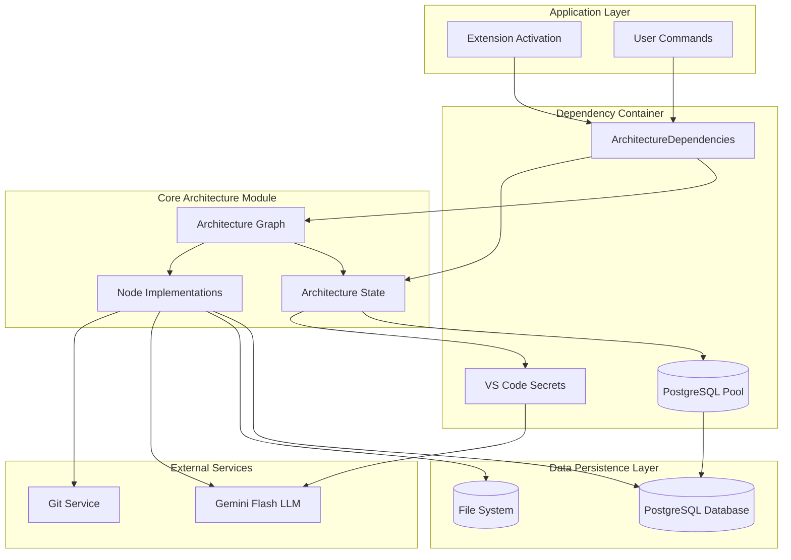
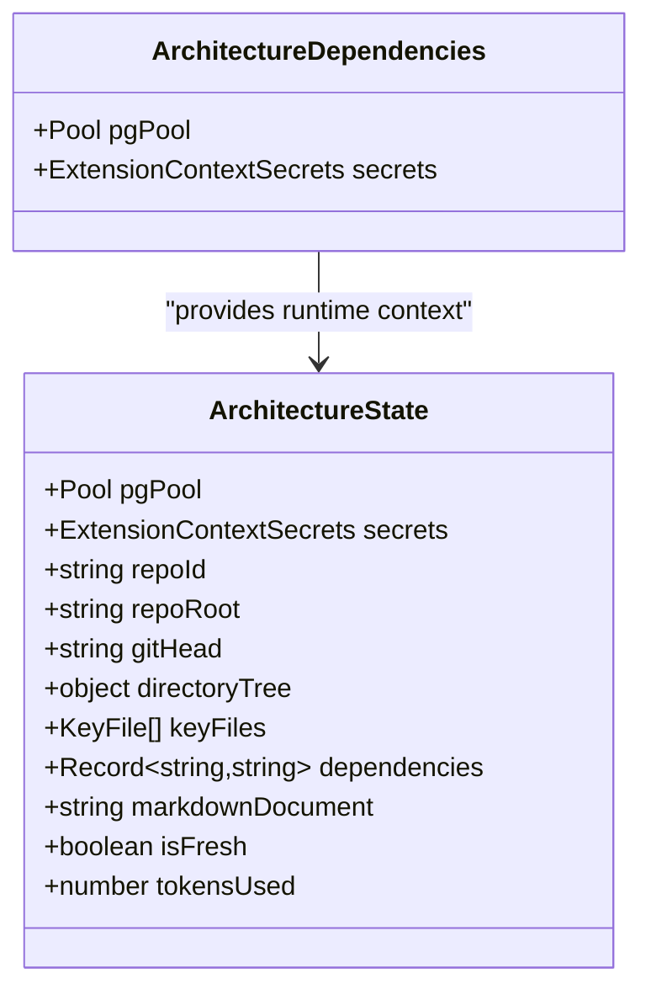
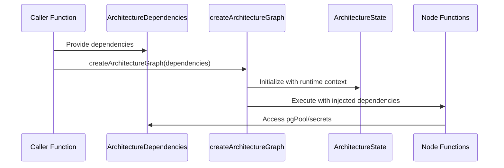
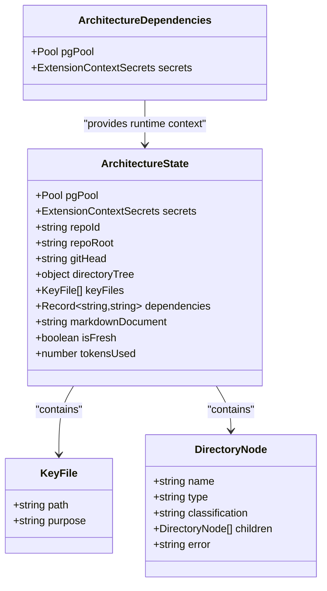
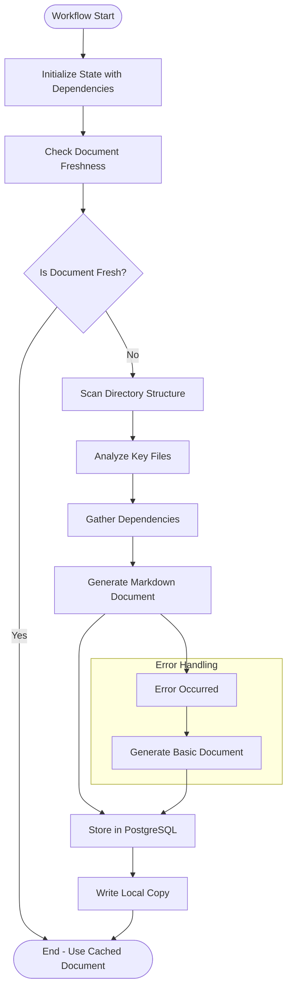
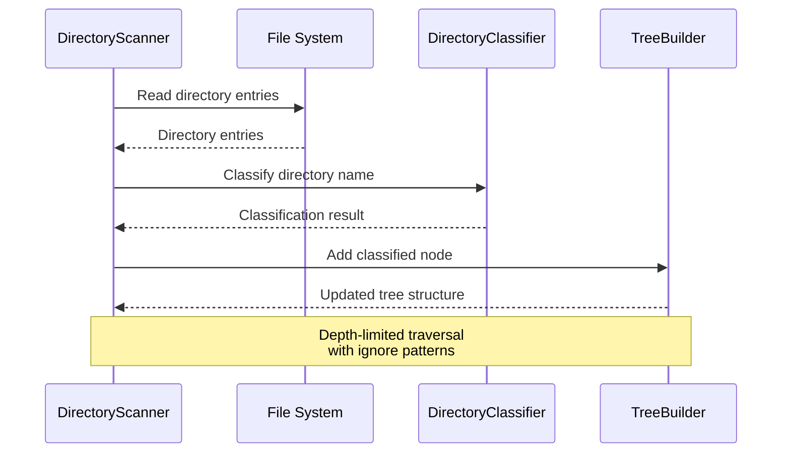
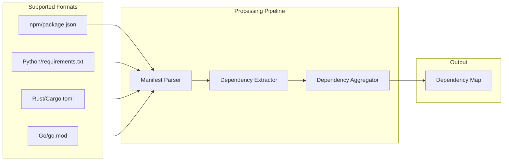
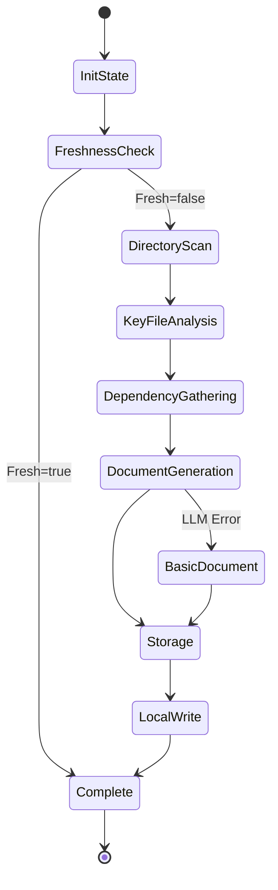
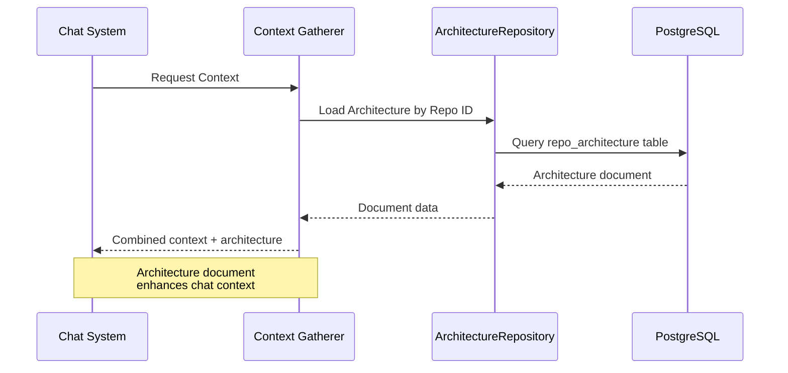
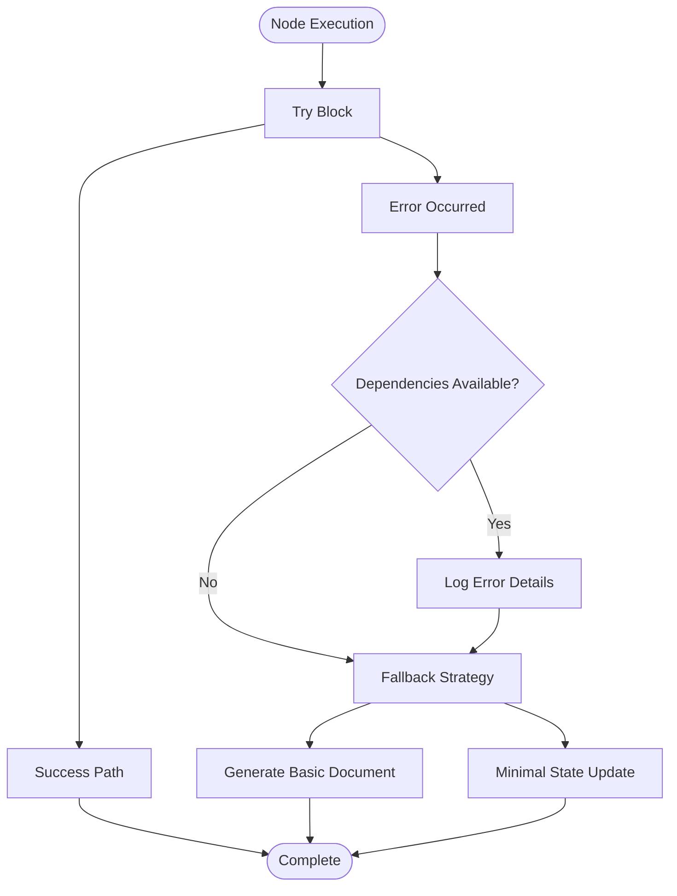

# Repository Architecture Generation Workflow

<cite>
**Referenced Files in This Document**
- [008_repo_architecture_generator.md](file://PRDs/008_repo_architecture_generator.md)
- [architecture/index.ts](file://src/chat/architecture/index.ts)
- [architectureGraph.ts](file://src/chat/architecture/architectureGraph.ts)
- [architectureState.ts](file://src/chat/architecture/architectureState.ts)
- [prompts.ts](file://src/chat/architecture/prompts.ts)
- [checkFreshness.ts](file://src/chat/architecture/nodes/checkFreshness.ts)
- [scanDirectory.ts](file://src/chat/architecture/nodes/scanDirectory.ts)
- [analyzeKeyFiles.ts](file://src/chat/architecture/nodes/analyzeKeyFiles.ts)
- [gatherDependencies.ts](file://src/chat/architecture/nodes/gatherDependencies.ts)
- [generateDocument.ts](file://src/chat/architecture/nodes/generateDocument.ts)
- [storeDocument.ts](file://src/chat/architecture/nodes/storeDocument.ts)
- [architectureRepository.ts](file://src/chat/db/architectureRepository.ts)
- [gatherContext.ts](file://src/chat/nodes/gatherContext.ts)
- [extension.ts](file://src/extension.ts)
- [nodes.ts](file://src/fingerprint/nodes.ts)
</cite>

## Update Summary
**Changes Made**
- Updated architecture overview to reflect dependency injection pattern replacing global state
- Added new section on Dependency Injection Architecture
- Updated system architecture diagrams to show ArchitectureDependencies interface
- Revised state management section to explain runtime context fields
- Updated integration points to show proper dependency passing
- Enhanced error handling section to cover dependency injection failures

## Table of Contents
1. [Introduction](#introduction)
2. [System Architecture Overview](#system-architecture-overview)
3. [Dependency Injection Architecture](#dependency-injection-architecture)
4. [Core Components](#core-components)
5. [Architecture Generation Workflow](#architecture-generation-workflow)
6. [Node Implementation Details](#node-implementation-details)
7. [Data Flow and State Management](#data-flow-and-state-management)
8. [Integration Points](#integration-points)
9. [Performance Considerations](#performance-considerations)
10. [Error Handling and Recovery](#error-handling-and-recovery)
11. [Configuration and Settings](#configuration-and-settings)
12. [Conclusion](#conclusion)

## Introduction

The Repository Architecture Generation Workflow is a sophisticated LangGraph-based system designed to automatically generate and maintain comprehensive markdown documentation describing a repository's architecture. This system serves as a critical foundation for both planning LLMs and batch LLMs, providing them with essential context about the overall codebase structure without requiring them to process every individual file.

**Updated** The workflow has undergone a complete architectural transformation from global state management to dependency injection. The system now uses ArchitectureState with runtime context fields (pgPool, secrets) and ArchitectureDependencies interface for cleaner separation of concerns. Functions accept dependencies as parameters instead of relying on global variables, improving testability and modularity.

The workflow addresses the gap between the existing fingerprint system, which generates structured JSON data, and the need for LLM-friendly markdown documentation. By creating a persistent, cache-aware architecture document stored in PostgreSQL, the system enables efficient context retrieval and reduces computational overhead for AI-driven code analysis tasks.

## System Architecture Overview

The architecture generation workflow operates as an autonomous LangGraph sub-workflow integrated seamlessly with the broader Repomix Runner ecosystem. The system follows a modular design pattern, separating concerns into distinct nodes that handle specific aspects of the architecture documentation process.

**Updated** The system now implements dependency injection throughout the architecture, eliminating global state dependencies and providing cleaner separation of concerns.

**Diagram sources**
- [architectureGraph.ts](file://src/chat/architecture/architectureGraph.ts#L37-L100)
- [architectureState.ts](file://src/chat/architecture/architectureState.ts#L8-L72)
- [extension.ts](file://src/extension.ts#L616-L631)

The system architecture demonstrates several key characteristics:

- **Dependency Injection Pattern**: All runtime dependencies are passed through ArchitectureDependencies interface
- **Runtime Context Fields**: ArchitectureState includes pgPool and secrets as runtime context fields
- **Autonomous Operation**: The workflow can run independently without blocking primary chat operations
- **Cache-Aware Design**: Implements intelligent caching based on git commit hashes and TTL settings
- **Persistent Storage**: Maintains documents in PostgreSQL for cross-session retrieval
- **Modular Node Structure**: Each processing step is encapsulated in dedicated nodes for maintainability
- **Integration Ready**: Seamlessly integrates with existing chat and fingerprint systems

## Dependency Injection Architecture

**New Section** The architecture generation system now implements a comprehensive dependency injection pattern that replaces global state dependencies with explicit parameter passing.

### ArchitectureDependencies Interface

The ArchitectureDependencies interface serves as the central dependency container, providing all runtime dependencies required by the architecture workflow:

**Diagram sources**
- [architectureState.ts](file://src/chat/architecture/architectureState.ts#L68-L72)
- [architectureState.ts](file://src/chat/architecture/architectureState.ts#L8-L63)

### Dependency Passing Pattern

The dependency injection pattern ensures that all functions receive their dependencies explicitly:

**Diagram sources**
- [architectureGraph.ts](file://src/chat/architecture/architectureGraph.ts#L37-L100)
- [architectureGraph.ts](file://src/chat/architecture/architectureGraph.ts#L110-L133)

**Section sources**
- [architectureState.ts](file://src/chat/architecture/architectureState.ts#L68-L72)
- [architectureGraph.ts](file://src/chat/architecture/architectureGraph.ts#L37-L100)
- [architectureGraph.ts](file://src/chat/architecture/architectureGraph.ts#L110-L133)

## Core Components

### Architecture State Management

The system employs a centralized state management approach using LangGraph's Annotation system. The ArchitectureState defines the complete data model for the workflow, encompassing repository identification, git state tracking, directory structure analysis, key file identification, dependency extraction, and markdown document generation.

**Updated** ArchitectureState now includes runtime context fields (pgPool, secrets) that are populated from ArchitectureDependencies during graph initialization.

**Diagram sources**
- [architectureState.ts](file://src/chat/architecture/architectureState.ts#L8-L72)

### LangGraph Workflow Definition

The workflow is structured as a stateful graph with conditional branching based on document freshness. The graph consists of six primary nodes: checkFreshness, scanDirectory, analyzeKeyFiles, gatherDependencies, generateDocument, and storeDocument, each serving a specific purpose in the architecture documentation pipeline.

**Section sources**
- [architectureGraph.ts](file://src/chat/architecture/architectureGraph.ts#L15-L100)
- [architectureState.ts](file://src/chat/architecture/architectureState.ts#L8-L72)

## Architecture Generation Workflow

### Workflow Flowchart

The architecture generation process follows a well-defined sequence that balances efficiency with accuracy. The workflow begins by checking document freshness, then proceeds through systematic analysis steps before generating and storing the final markdown document.

**Updated** The workflow now receives dependencies through ArchitectureDependencies interface, eliminating global state dependencies.

**Diagram sources**
- [architectureGraph.ts](file://src/chat/architecture/architectureGraph.ts#L18-L100)
- [checkFreshness.ts](file://src/chat/architecture/nodes/checkFreshness.ts#L11-L72)

### Freshness Checking Mechanism

The freshness checking mechanism implements a dual-validation system combining git commit hash comparison with time-based expiration checks. This approach ensures documents remain current while preventing unnecessary regeneration during short intervals.

The system compares the current git HEAD commit with the stored commit hash and evaluates whether the TTL (time-to-live) period has expired. The default TTL is set to 24 hours, configurable through the `repomix.chat.architectureRefreshHours` setting.

**Section sources**
- [checkFreshness.ts](file://src/chat/architecture/nodes/checkFreshness.ts#L11-L72)
- [storeDocument.ts](file://src/chat/architecture/nodes/storeDocument.ts#L25-L30)

## Node Implementation Details

### Directory Scanning and Classification

The directory scanning node implements a sophisticated tree-building algorithm that respects `.gitignore` patterns and applies intelligent classification heuristics. The system ignores common development directories while focusing on meaningful project structure indicators.

**Diagram sources**
- [scanDirectory.ts](file://src/chat/architecture/nodes/scanDirectory.ts#L71-L111)

The classification system recognizes patterns commonly associated with different architectural layers:
- **Frontend**: pages, components, layouts, styles, hooks, state
- **Backend**: api, controllers, services, middleware, models
- **Database**: prisma, drizzle, migrations, db, database
- **Testing**: test, tests, __tests__, spec, specs, e2e, integration
- **Shared**: utils, helpers, lib, common, shared, types, interfaces, typings
- **Configuration**: config, configs, configuration, public, static, assets

**Section sources**
- [scanDirectory.ts](file://src/chat/architecture/nodes/scanDirectory.ts#L34-L66)

### Key File Analysis and Purpose Determination

The key file analysis system identifies critical project files using pattern matching combined with intelligent purpose determination. The system searches for entry points, configuration files, type definitions, and documentation while limiting results to prevent overwhelming the LLM with excessive context.

The purpose determination algorithm considers file names, locations, and content patterns to provide accurate descriptions for each key file. This contextual understanding helps LLMs quickly grasp the project's structure and important components.

**Section sources**
- [analyzeKeyFiles.ts](file://src/chat/architecture/nodes/analyzeKeyFiles.ts#L110-L186)

### Dependency Extraction and Management

The dependency extraction system supports multiple package management ecosystems, parsing manifest files from popular languages and frameworks. The system handles various formats including npm's package.json, Python's requirements.txt, Rust's Cargo.toml, and Go's go.mod files.

**Diagram sources**
- [gatherDependencies.ts](file://src/chat/architecture/nodes/gatherDependencies.ts#L19-L133)

**Section sources**
- [gatherDependencies.ts](file://src/chat/architecture/nodes/gatherDependencies.ts#L10-L146)

### Document Generation and Prompt Engineering

The document generation leverages Gemini Flash LLM to create comprehensive markdown architecture documents. The system employs carefully crafted prompts that guide the LLM to produce structured, useful documentation covering overview, tech stack, directory structure, key files, and architectural patterns.

The prompt engineering approach ensures consistent formatting and comprehensive coverage of architectural aspects while remaining adaptable to different project types and sizes.

**Section sources**
- [prompts.ts](file://src/chat/architecture/prompts.ts#L9-L76)
- [generateDocument.ts](file://src/chat/architecture/nodes/generateDocument.ts#L11-L79)

## Data Flow and State Management

### State Transition Diagram

The workflow demonstrates sophisticated state management with explicit transitions between processing stages. Each node modifies specific state properties while maintaining data integrity throughout the process.

**Updated** State transitions now occur within the context of injected dependencies, ensuring proper access to runtime resources.

**Diagram sources**
- [architectureGraph.ts](file://src/chat/architecture/architectureGraph.ts#L82-L100)

### Data Persistence Strategy

The system implements a dual-persistence strategy combining PostgreSQL storage for cross-session retrieval with local file storage for immediate accessibility. The PostgreSQL implementation uses a sophisticated upsert operation that maintains document history while allowing updates.

The persistence layer includes metadata tracking such as generation timestamps, expiration schedules, git commit references, and token usage statistics for cost monitoring and optimization.

**Section sources**
- [architectureRepository.ts](file://src/chat/db/architectureRepository.ts#L29-L60)
- [storeDocument.ts](file://src/chat/architecture/nodes/storeDocument.ts#L33-L41)

## Integration Points

### Context Gathering Integration

The architecture document integrates seamlessly with the broader context gathering system used by the chat interface. The gatherContext node automatically loads architecture documents when available, providing essential structural context for code analysis and AI-assisted development tasks.

**Updated** Integration now uses the ArchitectureRepository instance created with injected dependencies rather than global state.

**Diagram sources**
- [gatherContext.ts](file://src/chat/nodes/gatherContext.ts#L140-L154)

### Extension Activation and Auto-Trigger

The extension system includes intelligent auto-trigger functionality that generates architecture documents when workspaces are opened and documents are missing or expired. This proactive approach ensures that AI features have access to current architectural context without manual intervention.

**Updated** Auto-trigger now passes ArchitectureDependencies to executeArchitectureGeneration, eliminating reliance on global state.

**Section sources**
- [gatherContext.ts](file://src/chat/nodes/gatherContext.ts#L140-L154)
- [extension.ts](file://src/extension.ts#L616-L631)
- [extension.ts](file://src/extension.ts#L1076-L1095)

### Fingerprint System Synchronization

The architecture generation workflow coordinates with the fingerprint system to maintain consistency across different analysis approaches. Both systems share directory classification logic and ignore patterns, ensuring uniform analysis results and preventing redundant processing.

**Section sources**
- [nodes.ts](file://src/fingerprint/nodes.ts#L149-L182)
- [scanDirectory.ts](file://src/chat/architecture/nodes/scanDirectory.ts#L34-L66)

## Performance Considerations

### Caching Strategy

The system implements a multi-layered caching strategy that minimizes computational overhead while ensuring document currency. The freshness checking mechanism prevents unnecessary regeneration by comparing git commit hashes and evaluating TTL expiration.

The caching approach includes:
- **Git Commit Hash Comparison**: Immediate detection of structural changes
- **Time-Based Expiration**: Configurable refresh intervals (default 24 hours)
- **Error Recovery**: Graceful degradation to basic documents when LLM services are unavailable
- **Progressive Enhancement**: Basic documents serve as fallback while maintaining system functionality

### Resource Optimization

The workflow incorporates several optimization strategies to minimize resource consumption:

- **Depth-Limited Directory Traversal**: Maximum 4 levels to prevent excessive file system scanning
- **Pattern-Based File Selection**: Targeted key file discovery reduces processing overhead
- **Content Sampling**: Limited file content reading (first 100 lines) for purpose determination
- **Efficient Tree Building**: Optimized directory structure construction with early termination

**Section sources**
- [scanDirectory.ts](file://src/chat/architecture/nodes/scanDirectory.ts#L27-L28)
- [analyzeKeyFiles.ts](file://src/chat/architecture/nodes/analyzeKeyFiles.ts#L10-L24)

## Error Handling and Recovery

### Robust Error Management

The architecture generation workflow implements comprehensive error handling across all processing stages. Each node includes specific error handling mechanisms that ensure system stability and graceful degradation when external services fail.

**Updated** Error handling now accounts for dependency injection failures and provides appropriate fallback mechanisms.

**Diagram sources**
- [generateDocument.ts](file://src/chat/architecture/nodes/generateDocument.ts#L61-L78)

### Fallback Mechanisms

The system provides multiple fallback strategies to maintain functionality under adverse conditions:

- **API Key Unavailable**: Automatic generation of basic architecture documents
- **LLM Service Failures**: Graceful degradation to pre-generated content
- **Database Connection Issues**: Error logging with continued processing
- **Network Connectivity Problems**: Cached document usage with delayed regeneration

**Section sources**
- [generateDocument.ts](file://src/chat/architecture/nodes/generateDocument.ts#L42-L78)

## Configuration and Settings

### User Configuration Options

The system provides flexible configuration options controlled through VS Code settings:

| Setting | Default Value | Description |
|---------|---------------|-------------|
| `repomix.chat.architectureRefreshHours` | 24 | Hours between automatic document refresh |
| `repomix.chat.architectureRefreshTTL` | 86400000 | Milliseconds for document expiration (24 hours) |

### Environment Integration

The workflow integrates with the extension's secret management system for secure API key storage and retrieval. The system automatically detects available credentials and adapts its behavior accordingly, providing transparent fallback functionality when keys are unavailable.

**Section sources**
- [storeDocument.ts](file://src/chat/architecture/nodes/storeDocument.ts#L25-L27)
- [generateDocument.ts](file://src/chat/architecture/nodes/generateDocument.ts#L38-L50)

## Conclusion

The Repository Architecture Generation Workflow represents a sophisticated solution for automated codebase documentation that bridges the gap between static analysis and AI-driven code understanding. The system's modular design, intelligent caching mechanisms, and seamless integration capabilities make it an essential component of modern AI-assisted development environments.

**Updated** The recent architectural transformation to dependency injection significantly improves the system's maintainability, testability, and separation of concerns. The elimination of global state dependencies enhances modularity and makes the system more robust and easier to extend.

The workflow successfully addresses key challenges in repository analysis by providing:

- **Automated Documentation**: Reduces manual effort in maintaining project documentation
- **Intelligent Caching**: Minimizes computational overhead through strategic refresh policies
- **Cross-Platform Compatibility**: Supports multiple programming languages and package managers
- **Seamless Integration**: Works harmoniously with existing chat and fingerprint systems
- **Robust Error Handling**: Maintains system stability under various failure conditions
- **Dependency Injection**: Eliminates global state dependencies for improved modularity
- **Runtime Context Management**: Properly manages database connections and secrets

Future enhancements could include expanded language support, enhanced pattern recognition capabilities, and integration with additional AI services for more sophisticated architectural analysis. The modular architecture provides a solid foundation for these potential improvements while maintaining backward compatibility and system reliability.