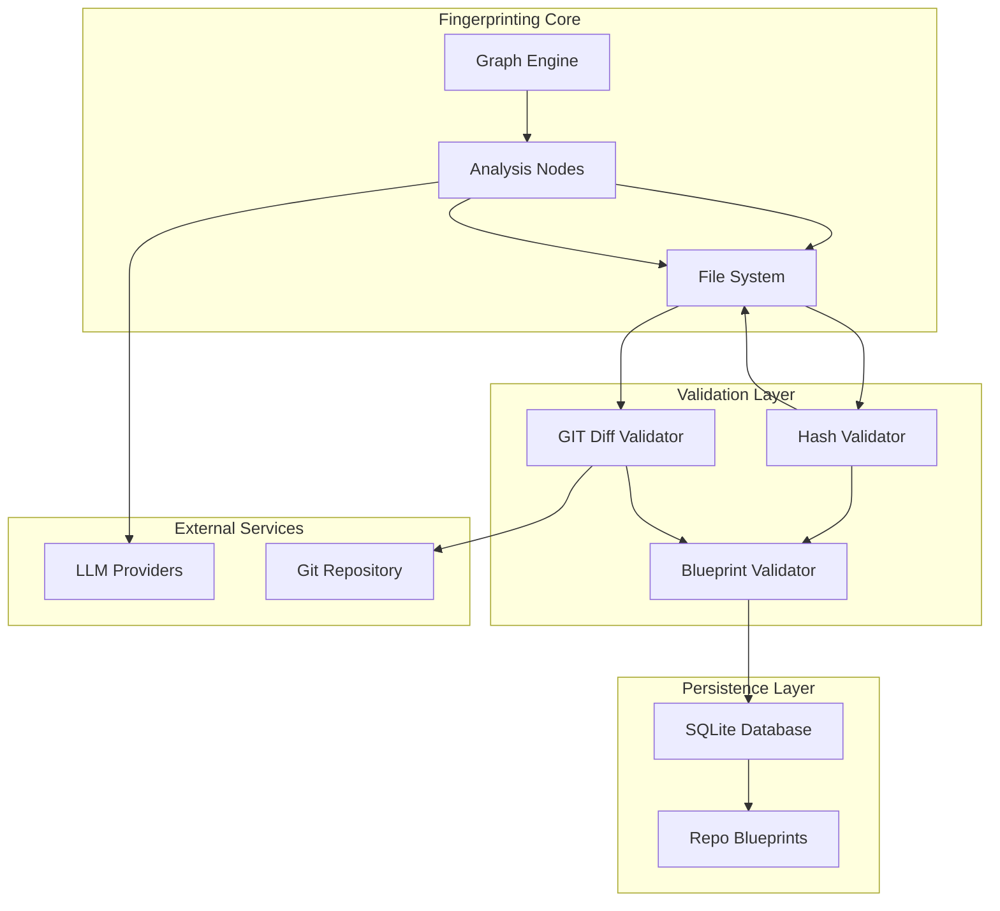
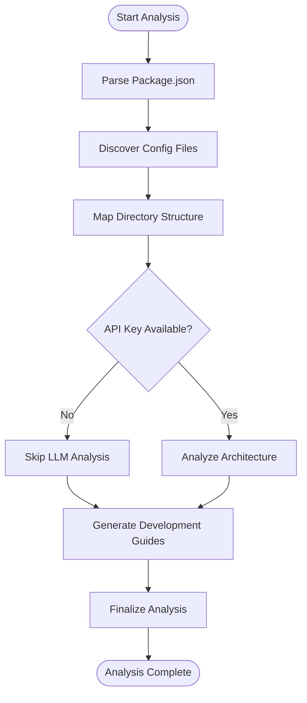
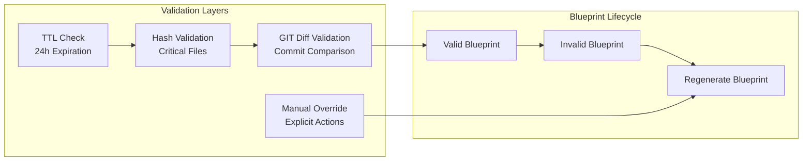
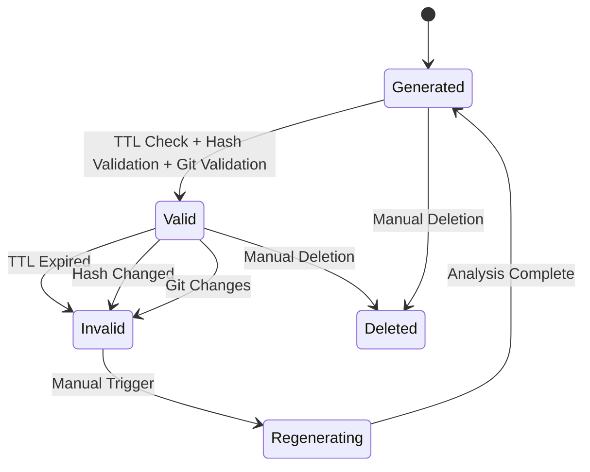
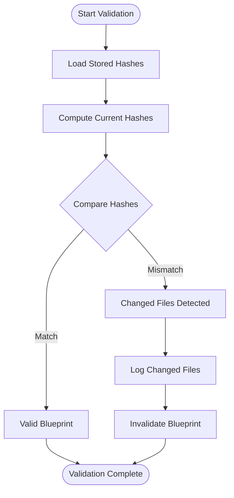
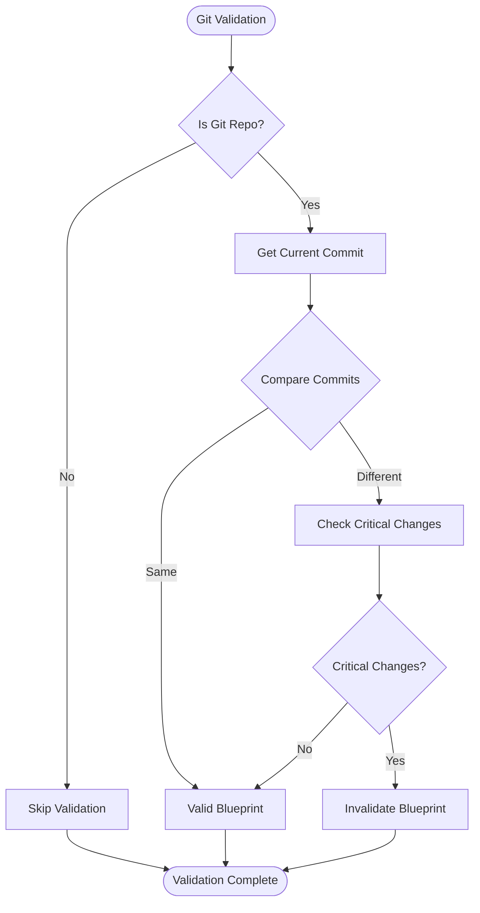

# Repository Fingerprinting System

<cite>
**Referenced Files in This Document**
- [index.ts](file://src/fingerprint/index.ts)
- [graph.ts](file://src/fingerprint/graph.ts)
- [nodes.ts](file://src/fingerprint/nodes.ts)
- [state.ts](file://src/fingerprint/state.ts)
- [blueprintService.ts](file://src/fingerprint/blueprintService.ts)
- [hashValidator.ts](file://src/fingerprint/validation/hashValidator.ts)
- [gitDiffValidator.ts](file://src/fingerprint/validation/gitDiffValidator.ts)
- [databaseService.ts](file://src/core/storage/databaseService.ts)
- [extension.ts](file://src/extension.ts)
</cite>

## Table of Contents
1. [Introduction](#introduction)
2. [System Architecture](#system-architecture)
3. [Core Components](#core-components)
4. [Fingerprint Analysis Workflow](#fingerprint-analysis-workflow)
5. [Blueprint Management System](#blueprint-management-system)
6. [Validation Strategies](#validation-strategies)
7. [Data Storage and Persistence](#data-storage-and-persistence)
8. [Integration Points](#integration-points)
9. [Performance Considerations](#performance-considerations)
10. [Troubleshooting Guide](#troubleshooting-guide)
11. [Conclusion](#conclusion)

## Introduction

The Repository Fingerprinting System is a sophisticated component within the Repomix Runner Plus extension that provides comprehensive repository analysis and blueprint management capabilities. This system enables developers to understand codebase structure, identify architectural patterns, and maintain up-to-date knowledge about their projects through automated analysis and validation processes.

The fingerprinting system operates as a multi-layered validation framework that combines static analysis, machine learning insights, and persistent storage to create reliable, versioned blueprints of repositories. These blueprints serve as trusted references for various extension features, including intelligent file selection, semantic search, and automated code generation workflows.

## System Architecture

The fingerprinting system is built on a modular architecture that separates concerns between analysis, validation, and persistence layers. The system leverages LangGraph for workflow orchestration and implements a comprehensive validation strategy to ensure blueprint freshness and reliability.

**Diagram sources**
- [graph.ts](file://src/fingerprint/graph.ts#L14-L42)
- [blueprintService.ts](file://src/fingerprint/blueprintService.ts#L24-L32)
- [databaseService.ts](file://src/core/storage/databaseService.ts#L1324-L1481)

## Core Components

### Fingerprint Graph Engine

The fingerprint graph engine serves as the central orchestrator for repository analysis workflows. Built on LangGraph, it defines a structured pipeline that processes repositories through multiple analytical stages while maintaining state consistency across operations.

**Diagram sources**
- [graph.ts](file://src/fingerprint/graph.ts#L14-L42)

### Analysis State Management

The system maintains comprehensive state throughout the analysis process using LangGraph's Annotation pattern. This state structure captures everything from basic repository metadata to advanced architectural insights and validation results.

**Section sources**
- [state.ts](file://src/fingerprint/state.ts#L32-L140)

### Validation Strategy Architecture

The fingerprinting system implements a four-tier validation strategy designed to ensure blueprint reliability and freshness:

1. **TTL (Time-To-Live)**: Expiration-based invalidation
2. **Hash Validation**: Critical file content verification
3. **Git Diff Validation**: Commit-based change detection
4. **Manual Override**: Explicit blueprint management

**Diagram sources**
- [blueprintService.ts](file://src/fingerprint/blueprintService.ts#L98-L157)

**Section sources**
- [blueprintService.ts](file://src/fingerprint/blueprintService.ts#L98-L157)

## Fingerprint Analysis Workflow

### Static Analysis Phase

The fingerprinting system begins with comprehensive static analysis of repository structure and configuration. This phase extracts essential metadata without requiring external API calls.

#### Package Analysis
The system parses package.json files to identify project metadata, dependencies, and framework identification. This information forms the foundation for subsequent architectural analysis.

#### Configuration Discovery
Automated discovery of configuration files across the repository using predefined patterns. The system focuses on critical configuration files that define project structure and technology stack.

#### Directory Structure Mapping
Hierarchical mapping of repository directories with intelligent classification of common directory patterns (components, pages, services, etc.).

### Machine Learning Enhancement Phase

When API credentials are available, the system enhances analysis with machine learning insights to identify architectural patterns and generate practical development guides.

**Section sources**
- [nodes.ts](file://src/fingerprint/nodes.ts#L186-L551)

## Blueprint Management System

### Blueprint Lifecycle

The blueprint management system provides a complete lifecycle for repository analysis artifacts, from generation to validation and cleanup.

**Diagram sources**
- [blueprintService.ts](file://src/fingerprint/blueprintService.ts#L38-L53)

### Blueprint Storage Schema

The system stores comprehensive repository information in a structured format optimized for both human readability and machine processing.

**Section sources**
- [databaseService.ts](file://src/core/storage/databaseService.ts#L81-L95)

## Validation Strategies

### Hash-Based Validation

The hash validation system tracks critical files using SHA256 hashing to detect content changes without requiring full repository analysis.

#### Critical File Tracking
The system monitors specific files that indicate significant project changes:
- Package configuration files
- Framework configuration files  
- Database configuration files
- Build configuration files

#### Change Detection Algorithm

**Diagram sources**
- [hashValidator.ts](file://src/fingerprint/validation/hashValidator.ts#L82-L127)

### Git-Based Validation

The git validation system provides commit-level change detection for repositories that maintain version control history.

#### Critical Path Monitoring
The system monitors specific paths and patterns that indicate significant architectural changes:
- Framework configuration directories
- Source code directories
- Database schema files
- Build configuration files

#### Commit Analysis

**Diagram sources**
- [gitDiffValidator.ts](file://src/fingerprint/validation/gitDiffValidator.ts#L143-L198)

**Section sources**
- [hashValidator.ts](file://src/fingerprint/validation/hashValidator.ts#L82-L127)
- [gitDiffValidator.ts](file://src/fingerprint/validation/gitDiffValidator.ts#L143-L198)

## Data Storage and Persistence

### SQLite Database Architecture

The fingerprinting system utilizes SQLite for persistent storage of analysis results and validation metadata. The database schema is optimized for efficient querying and long-term data retention.

#### Repository Blueprints Table
The primary storage mechanism for fingerprint analysis results, including:
- Repository metadata and configuration
- Directory structure analysis
- Architectural pattern identification
- Development guide generation
- Validation timestamps and hashes

#### Indexing Strategy
The database implements strategic indexing on frequently queried columns to optimize performance for:
- Repository ID lookups
- Expiration timestamp queries
- Status-based filtering
- Timestamp-based sorting

**Section sources**
- [databaseService.ts](file://src/core/storage/databaseService.ts#L237-L255)

## Integration Points

### Extension Integration

The fingerprinting system integrates seamlessly with the broader Repomix Runner Plus extension ecosystem, providing shared infrastructure for:

#### Background Monitoring
The system participates in the extension's background monitoring framework, automatically updating blueprints when repository changes are detected.

#### Command Integration
Multiple extension commands leverage fingerprint analysis results for intelligent file selection and automated workflows.

#### Webview Integration
The fingerprinting system provides data for the extension's webview components, enabling users to visualize repository analysis results and manage blueprints.

**Section sources**
- [extension.ts](file://src/extension.ts#L43-L51)

## Performance Considerations

### Memory Management

The fingerprinting system implements several strategies to minimize memory footprint during analysis operations:
- Streaming analysis results to prevent memory accumulation
- Progressive state updates to reduce peak memory usage
- Efficient file content handling with size limits

### Concurrency Control

The system manages concurrent operations through:
- Queue-based blueprint regeneration
- Debounced file change processing
- Controlled LLM API usage

### Caching Strategy

Intelligent caching mechanisms prevent redundant analysis:
- Blueprint-level caching with TTL validation
- Hash-based change detection to avoid full re-analysis
- Incremental updates for partial repository changes

## Troubleshooting Guide

### Common Validation Failures

#### TTL Expiration Issues
When blueprints expire, the system automatically invalidates them and triggers regeneration. Users can manually refresh blueprints or adjust TTL settings.

#### Hash Validation Failures
Hash mismatches typically indicate critical file modifications. The system logs affected files and triggers blueprint regeneration.

#### Git Validation Failures
Git validation failures occur when repository commits change since blueprint generation. The system identifies affected files and marks blueprints as invalid.

### Performance Optimization

#### Large Repository Handling
For repositories with extensive file counts, the system implements:
- Depth-limited directory traversal
- File size filtering to prevent oversized content processing
- Sampling strategies for LLM analysis

#### API Rate Limiting
When using LLM services, the system implements:
- Token usage tracking
- Request batching strategies
- Graceful fallback for API failures

**Section sources**
- [blueprintService.ts](file://src/fingerprint/blueprintService.ts#L98-L157)

## Conclusion

The Repository Fingerprinting System represents a comprehensive solution for automated repository analysis and management within the Repomix Runner Plus extension. By combining static analysis, machine learning insights, and robust validation strategies, the system provides reliable, up-to-date knowledge about codebases that serves as the foundation for advanced features like intelligent file selection, semantic search, and automated code generation.

The modular architecture ensures extensibility and maintainability, while the four-tier validation strategy guarantees blueprint reliability and freshness. Through careful consideration of performance, memory management, and user experience, the system delivers a production-ready solution for modern development workflows.

Future enhancements could include expanded framework detection, additional validation layers, and integration with more sophisticated machine learning models for deeper architectural analysis. The current design provides a solid foundation for these potential improvements while maintaining backward compatibility and system stability.