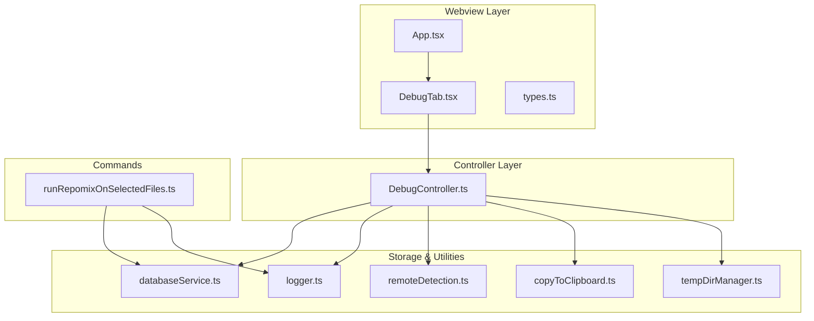
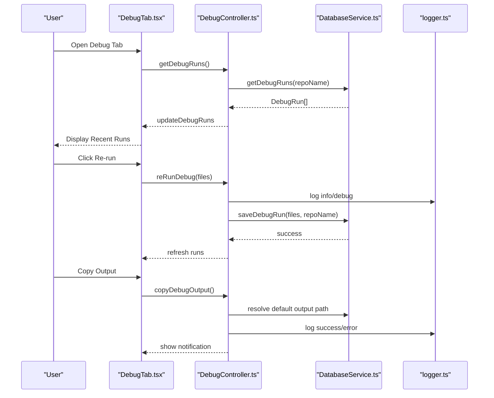
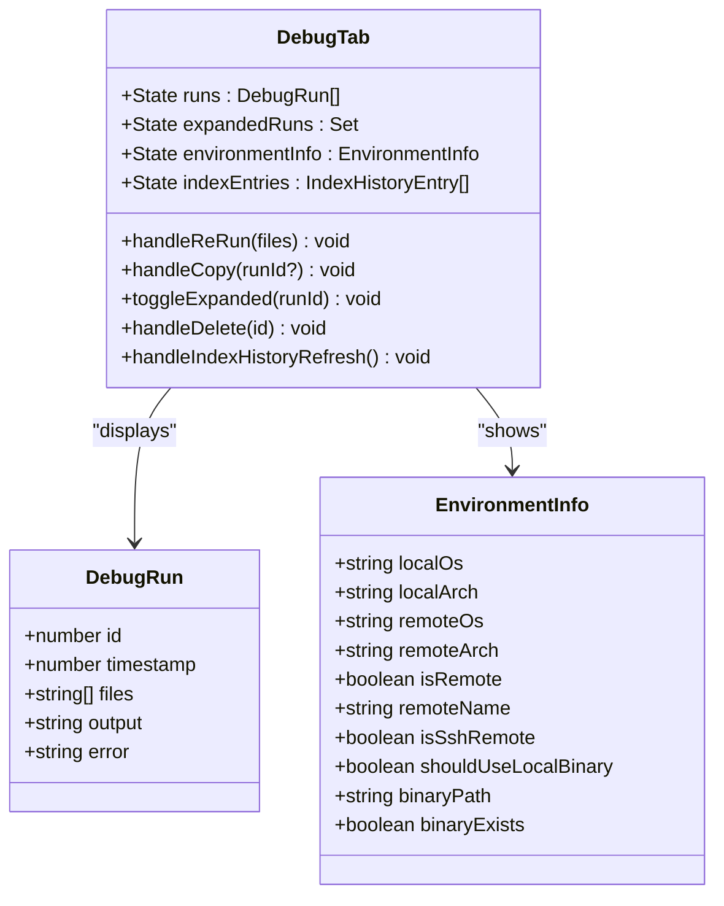
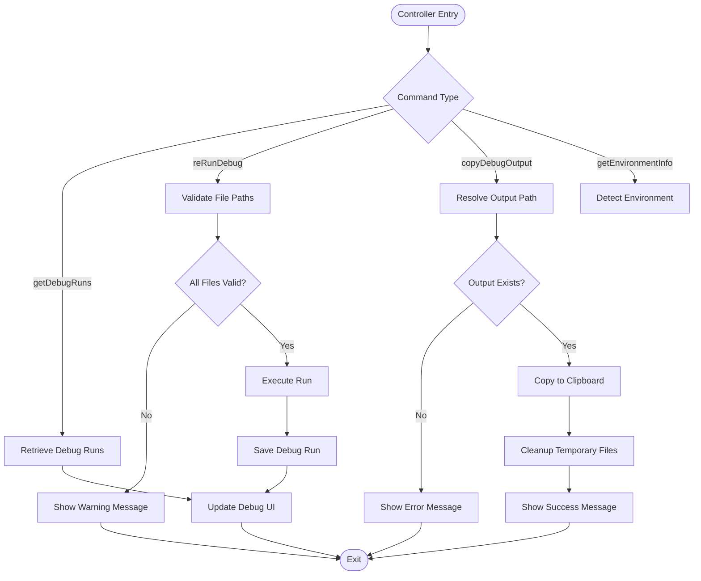
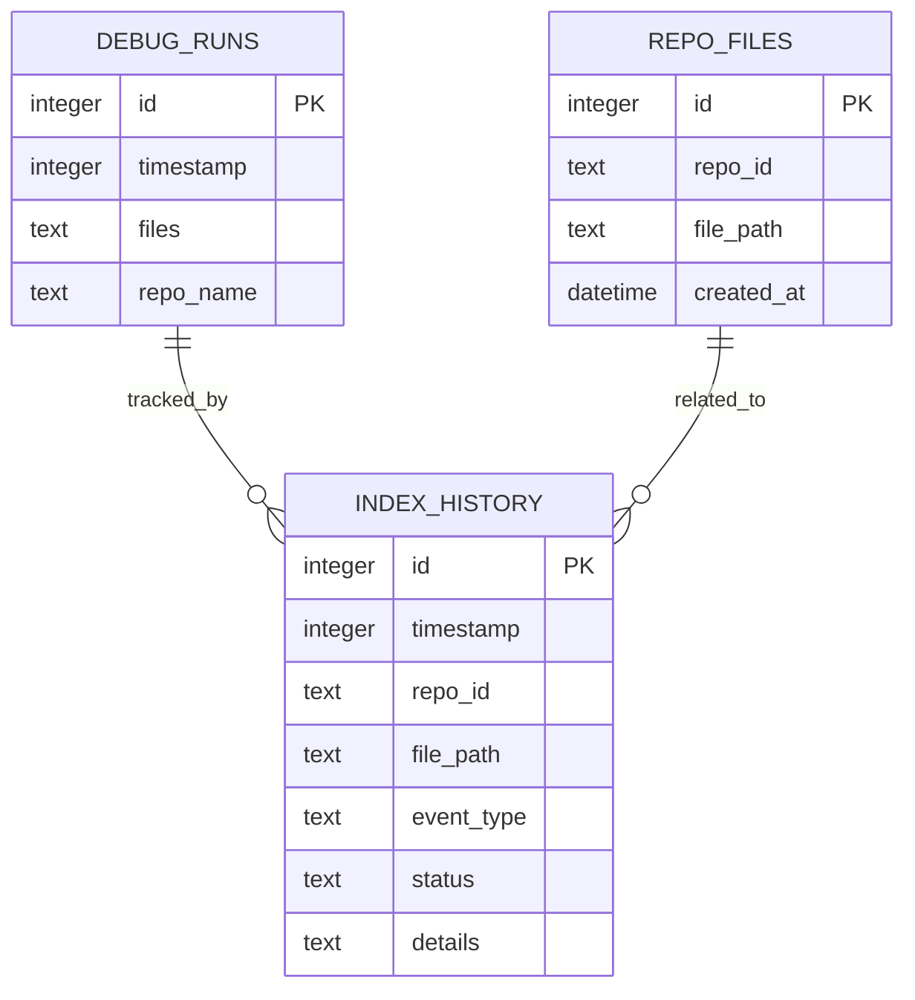
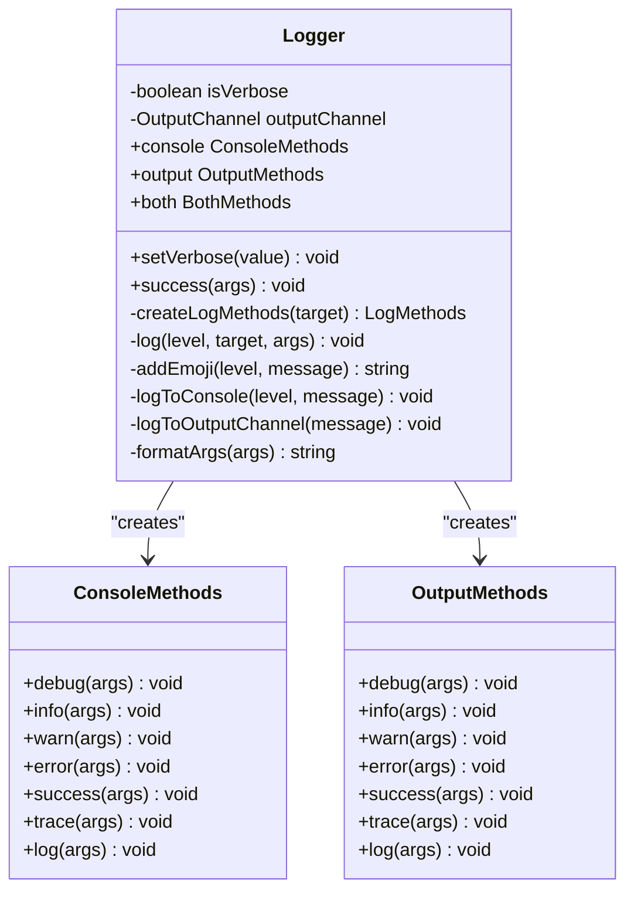
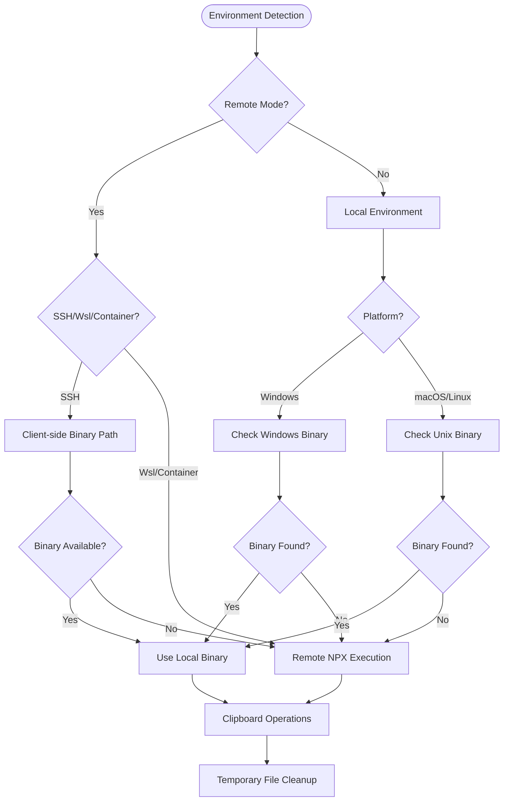
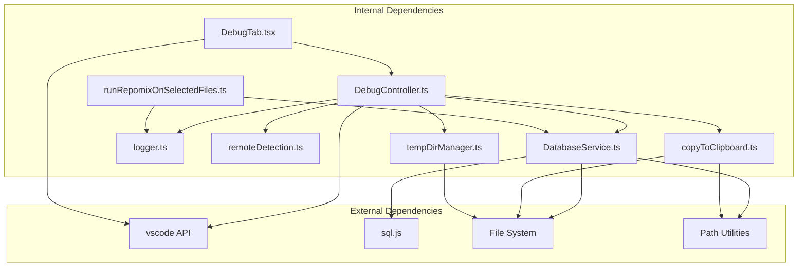

# Debugging Utilities

<cite>
**Referenced Files in This Document**
- [DebugTab.tsx](file://src/webview/components/DebugTab.tsx)
- [DebugController.ts](file://src/webview/controllers/DebugController.ts)
- [logger.ts](file://src/shared/logger.ts)
- [databaseService.ts](file://src/core/storage/databaseService.ts)
- [runRepomixOnSelectedFiles.ts](file://src/commands/runRepomixOnSelectedFiles.ts)
- [copyToClipboard.ts](file://src/core/files/copyToClipboard.ts)
- [tempDirManager.ts](file://src/core/files/tempDirManager.ts)
- [remoteDetection.ts](file://src/core/files/remoteDetection.ts)
- [types.ts](file://src/webview/types.ts)
- [App.tsx](file://src/webview/App.tsx)
- [verify_debug_tab.py](file://verification/verify_debug_tab.py)
- [mock_debug_webview.html](file://verification/mock_debug_webview.html)
- [repoIndexer.ts](file://src/core/indexing/repoIndexer.ts)
- [embeddingService.ts](file://src/core/indexing/embeddingService.ts)
</cite>

## Table of Contents
1. [Introduction](#introduction)
2. [Project Structure](#project-structure)
3. [Core Components](#core-components)
4. [Architecture Overview](#architecture-overview)
5. [Detailed Component Analysis](#detailed-component-analysis)
6. [Dependency Analysis](#dependency-analysis)
7. [Performance Considerations](#performance-considerations)
8. [Troubleshooting Guide](#troubleshooting-guide)
9. [Conclusion](#conclusion)

## Introduction
This document provides comprehensive documentation for the debugging utilities within the Repomix Runner Plus project. The debugging system encompasses a webview-based Debug tab, controller logic for managing debug sessions, persistent storage of debug runs, environment detection capabilities, and robust logging infrastructure. These utilities enable developers and users to inspect recent runs, analyze indexing progress, examine environment configurations, and troubleshoot execution issues effectively.

## Project Structure
The debugging utilities are organized across three primary layers:
- Webview Layer: Provides the user interface for viewing debug information and interacting with debugging features.
- Controller Layer: Manages communication between the webview and extension host, handles user actions, and orchestrates data retrieval.
- Storage and Utility Layer: Persists debug runs, manages environment detection, and provides logging capabilities.

**Diagram sources**
- [DebugTab.tsx:1-472](file://src/webview/components/DebugTab.tsx#L1-L472)
- [DebugController.ts:1-230](file://src/webview/controllers/DebugController.ts#L1-L230)
- [databaseService.ts:112-800](file://src/core/storage/databaseService.ts#L112-L800)
- [logger.ts:1-132](file://src/shared/logger.ts#L1-L132)
- [remoteDetection.ts:1-173](file://src/core/files/remoteDetection.ts#L1-L173)
- [copyToClipboard.ts:1-160](file://src/core/files/copyToClipboard.ts#L1-L160)
- [tempDirManager.ts:1-68](file://src/core/files/tempDirManager.ts#L1-L68)
- [runRepomixOnSelectedFiles.ts:1-101](file://src/commands/runRepomixOnSelectedFiles.ts#L1-L101)

**Section sources**
- [DebugTab.tsx:1-472](file://src/webview/components/DebugTab.tsx#L1-L472)
- [DebugController.ts:1-230](file://src/webview/controllers/DebugController.ts#L1-L230)
- [databaseService.ts:112-800](file://src/core/storage/databaseService.ts#L112-L800)
- [logger.ts:1-132](file://src/shared/logger.ts#L1-L132)
- [remoteDetection.ts:1-173](file://src/core/files/remoteDetection.ts#L1-L173)
- [copyToClipboard.ts:1-160](file://src/core/files/copyToClipboard.ts#L1-L160)
- [tempDirManager.ts:1-68](file://src/core/files/tempDirManager.ts#L1-L68)
- [runRepomixOnSelectedFiles.ts:1-101](file://src/commands/runRepomixOnSelectedFiles.ts#L1-L101)

## Core Components
The debugging utilities consist of several interconnected components that work together to provide comprehensive debugging capabilities:

### Debug Tab Interface
The DebugTab component serves as the primary user interface for debugging operations. It displays recent debug runs, allows re-running selections, copying outputs, and provides environment information. The component maintains state for runs, expanded run details, and index history.

### Debug Controller
The DebugController manages all debugging-related operations, including retrieving debug runs from storage, handling user actions (re-run, copy, delete), and providing environment information. It acts as a bridge between the webview and the extension host.

### Database Service Integration
The DatabaseService provides persistent storage for debug runs and indexing history. It supports CRUD operations for debug runs, maintains index history with automatic cleanup, and provides statistics for debugging purposes.

### Logging Infrastructure
The logger utility offers configurable logging with multiple targets (console, output channel, both) and supports different log levels with emoji indicators. It enables verbose logging for detailed debugging information.

### Environment Detection
The remote detection utilities help determine the execution environment, including remote vs local execution, client OS information, and binary availability for clipboard operations.

**Section sources**
- [DebugTab.tsx:7-472](file://src/webview/components/DebugTab.tsx#L7-L472)
- [DebugController.ts:16-230](file://src/webview/controllers/DebugController.ts#L16-L230)
- [databaseService.ts:21-800](file://src/core/storage/databaseService.ts#L21-L800)
- [logger.ts:7-132](file://src/shared/logger.ts#L7-L132)
- [remoteDetection.ts:7-173](file://src/core/files/remoteDetection.ts#L7-L173)

## Architecture Overview
The debugging architecture follows a clear separation of concerns with distinct layers for presentation, logic, and persistence:

**Diagram sources**
- [DebugTab.tsx:25-89](file://src/webview/components/DebugTab.tsx#L25-L89)
- [DebugController.ts:24-118](file://src/webview/controllers/DebugController.ts#L24-L118)
- [databaseService.ts:534-598](file://src/core/storage/databaseService.ts#L534-L598)
- [logger.ts:44-102](file://src/shared/logger.ts#L44-L102)

The architecture ensures loose coupling between components while maintaining clear data flow and error handling mechanisms.

## Detailed Component Analysis

### DebugTab Component Analysis
The DebugTab component provides a comprehensive interface for debugging operations with the following key features:

#### State Management
- Maintains runs state for displaying recent debug sessions
- Tracks expanded run details for accordion functionality
- Manages environment information display
- Handles index history with automatic loading states

#### Event Handling
- Processes user interactions for re-running selections
- Handles output copying with proper error handling
- Manages run deletion operations
- Implements index history refresh functionality

#### UI Components
- Uses FluentUI components for consistent styling
- Implements responsive design with VS Code theme integration
- Provides visual feedback through badges and color coding
- Supports truncation of long file paths for readability

**Diagram sources**
- [DebugTab.tsx:7-472](file://src/webview/components/DebugTab.tsx#L7-L472)
- [types.ts:46-65](file://src/webview/types.ts#L46-L65)

**Section sources**
- [DebugTab.tsx:7-472](file://src/webview/components/DebugTab.tsx#L7-L472)
- [types.ts:46-120](file://src/webview/types.ts#L46-L120)

### DebugController Implementation
The DebugController serves as the central orchestrator for debugging operations:

#### Command Processing
- Handles getDebugRuns for retrieving stored debug sessions
- Manages reRunDebug for executing previously selected files
- Processes copyDebugOutput for clipboard operations
- Supports environment information retrieval

#### Security and Validation
- Implements file path validation for re-run operations
- Ensures safe file handling through path resolution
- Validates user inputs and provides appropriate warnings

#### Integration Points
- Connects with DatabaseService for persistent storage
- Integrates with file operations for output copying
- Coordinates with remote detection for environment awareness

**Diagram sources**
- [DebugController.ts:24-230](file://src/webview/controllers/DebugController.ts#L24-L230)
- [runRepomixOnSelectedFiles.ts:78-91](file://src/commands/runRepomixOnSelectedFiles.ts#L78-L91)

**Section sources**
- [DebugController.ts:16-230](file://src/webview/controllers/DebugController.ts#L16-L230)
- [runRepomixOnSelectedFiles.ts:26-101](file://src/commands/runRepomixOnSelectedFiles.ts#L26-L101)

### Database Service Debug Operations
The DatabaseService provides comprehensive debugging capabilities through structured storage and retrieval:

#### Debug Run Management
- Stores debug runs with timestamps and file selections
- Supports filtering by repository name
- Maintains run history with automatic cleanup
- Provides efficient querying with indexing

#### Index History Tracking
- Records indexing events with timestamps
- Maintains statistics counters for event types
- Implements automatic cleanup to limit record count
- Supports batch operations for performance

#### Storage Schema
- Uses SQLite with sql.js for cross-platform compatibility
- Implements proper indexing for query performance
- Supports migrations for schema evolution
- Provides transaction support for data integrity

**Diagram sources**
- [databaseService.ts:204-266](file://src/core/storage/databaseService.ts#L204-L266)
- [databaseService.ts:1417-1450](file://src/core/storage/databaseService.ts#L1417-L1450)

**Section sources**
- [databaseService.ts:21-800](file://src/core/storage/databaseService.ts#L21-L800)
- [databaseService.ts:1417-1604](file://src/core/storage/databaseService.ts#L1417-L1604)

### Logging Infrastructure
The logging system provides flexible debugging capabilities with multiple output targets:

#### Log Levels and Targets
- Supports debug, info, warn, error, success, trace, and log levels
- Provides console-only, output-only, and both-target logging
- Includes emoji indicators for visual distinction
- Enables verbose mode for detailed debugging information

#### Configuration Options
- Configurable verbosity through setVerbose method
- Structured message formatting with object inspection
- Platform-appropriate console output handling
- Integration with VS Code output channels

**Diagram sources**
- [logger.ts:7-132](file://src/shared/logger.ts#L7-L132)

**Section sources**
- [logger.ts:1-132](file://src/shared/logger.ts#L1-L132)

### Environment Detection and Clipboard Operations
The system includes sophisticated environment detection and clipboard handling for cross-platform compatibility:

#### Remote Environment Detection
- Identifies remote vs local execution contexts
- Detects client OS and architecture information
- Handles SSH, WSL, and container environments
- Provides binary availability assessment

#### Clipboard Operations
- Supports content-based copying via VS Code API
- Implements file-based copying for different platforms
- Handles platform-specific clipboard utilities
- Manages temporary file cleanup

**Diagram sources**
- [remoteDetection.ts:31-108](file://src/core/files/remoteDetection.ts#L31-L108)
- [copyToClipboard.ts:52-160](file://src/core/files/copyToClipboard.ts#L52-L160)
- [tempDirManager.ts:44-64](file://src/core/files/tempDirManager.ts#L44-L64)

**Section sources**
- [remoteDetection.ts:1-173](file://src/core/files/remoteDetection.ts#L1-L173)
- [copyToClipboard.ts:1-160](file://src/core/files/copyToClipboard.ts#L1-L160)
- [tempDirManager.ts:1-68](file://src/core/files/tempDirManager.ts#L1-L68)

## Dependency Analysis
The debugging utilities exhibit well-structured dependencies that promote maintainability and testability:

**Diagram sources**
- [DebugTab.tsx:1-5](file://src/webview/components/DebugTab.tsx#L1-L5)
- [DebugController.ts:1-14](file://src/webview/controllers/DebugController.ts#L1-L14)
- [databaseService.ts:1-6](file://src/core/storage/databaseService.ts#L1-L6)

The dependency structure shows clear separation of concerns with minimal circular dependencies. The system leverages VS Code's extension APIs for UI integration and file system operations, while maintaining internal consistency through well-defined interfaces.

**Section sources**
- [DebugTab.tsx:1-5](file://src/webview/components/DebugTab.tsx#L1-L5)
- [DebugController.ts:1-14](file://src/webview/controllers/DebugController.ts#L1-L14)
- [databaseService.ts:1-6](file://src/core/storage/databaseService.ts#L1-L6)

## Performance Considerations
The debugging utilities incorporate several performance optimizations:

### Database Performance
- Uses indexed columns for fast query operations
- Implements batch operations for large datasets
- Automatic cleanup to prevent unbounded growth
- Transaction support for data integrity

### Memory Management
- Limited index history to 500 records
- Efficient JSON serialization for file lists
- Proper resource cleanup for temporary files
- Lazy initialization of expensive resources

### Network and I/O Efficiency
- Optimized file path resolution
- Minimal filesystem operations
- Buffered clipboard operations
- Efficient message passing between webview and extension host

## Troubleshooting Guide
Common debugging scenarios and their resolutions:

### Debug Tab Issues
- **No runs displayed**: Verify database initialization and check for permission issues
- **Environment info missing**: Ensure client OS detection is working properly
- **Index history not loading**: Check network connectivity and database access

### Clipboard Operation Problems
- **Copy fails**: Verify platform-specific clipboard utilities are installed
- **File not found errors**: Check output file paths and permissions
- **Remote clipboard issues**: Confirm remote environment detection accuracy

### Database Connectivity
- **Initialization failures**: Check sql.js WASM file availability
- **Permission errors**: Verify file system write permissions
- **Corruption issues**: Implement database backup and restore procedures

**Section sources**
- [DebugTab.tsx:25-89](file://src/webview/components/DebugTab.tsx#L25-L89)
- [DebugController.ts:58-70](file://src/webview/controllers/DebugController.ts#L58-L70)
- [copyToClipboard.ts:112-118](file://src/core/files/copyToClipboard.ts#L112-L118)

## Conclusion
The debugging utilities in Repomix Runner Plus provide a comprehensive solution for diagnosing and resolving issues during development and execution. The system combines a user-friendly webview interface with robust backend storage, sophisticated environment detection, and flexible logging capabilities. The modular architecture ensures maintainability while the performance optimizations support efficient debugging workflows across diverse environments.

The debugging system successfully addresses key requirements including run history tracking, environment diagnostics, clipboard operations, and persistent storage, making it an essential tool for both developers and advanced users of the Repomix Runner Plus extension.