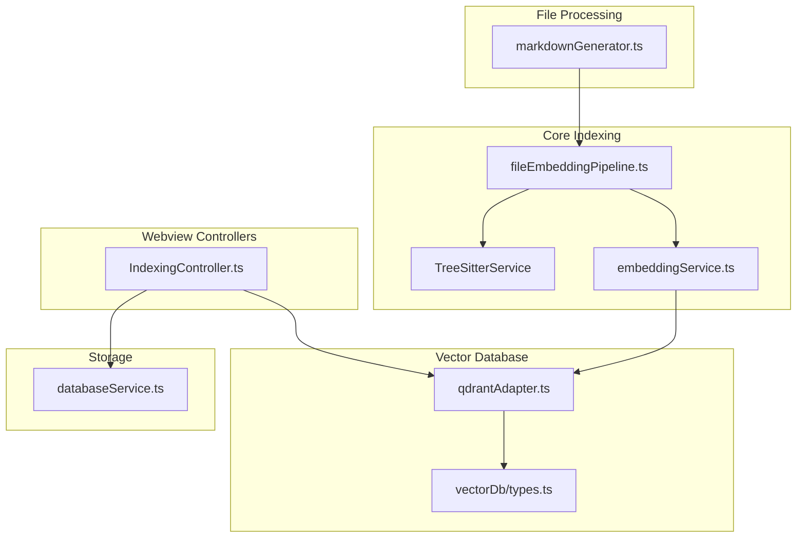
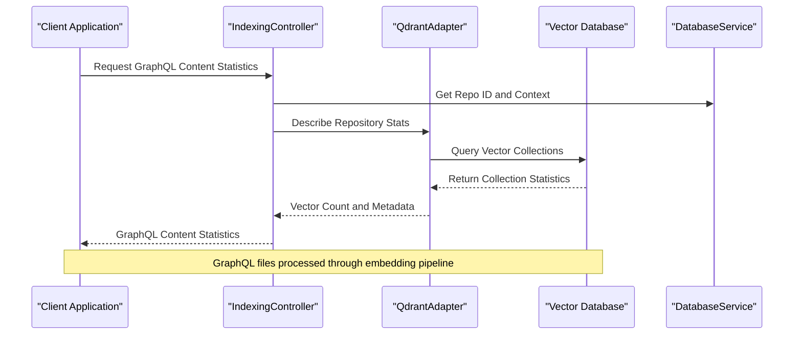
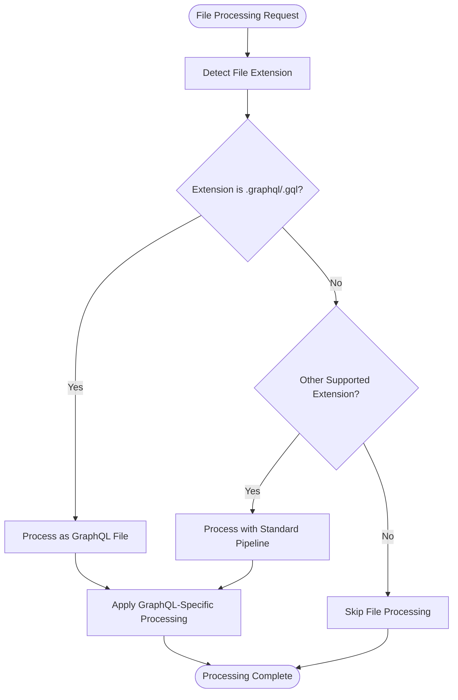
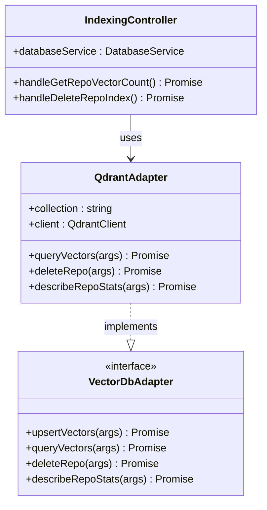
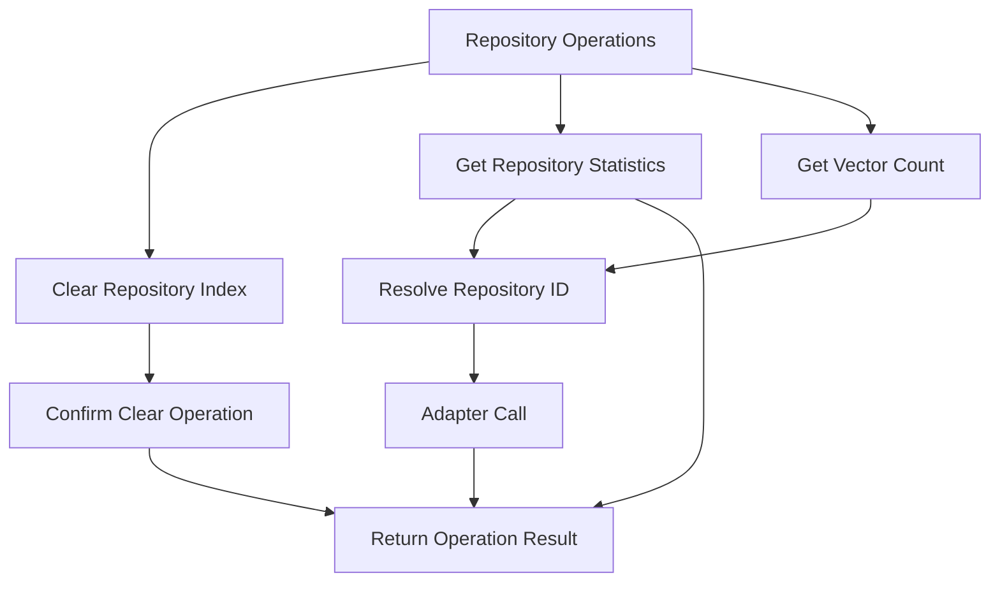
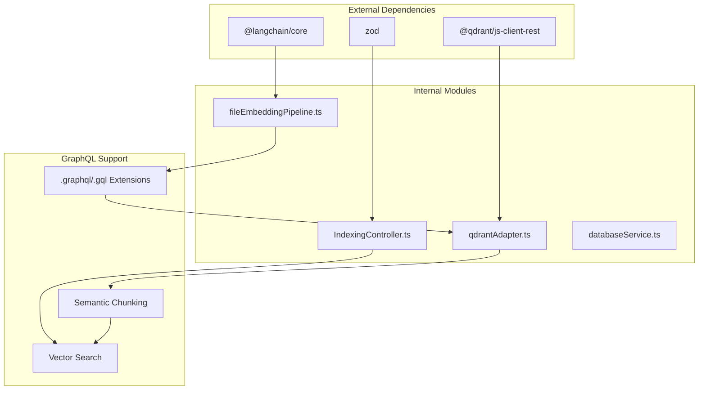

# Experimental Graphql Api

<cite>
**Referenced Files in This Document**
- [package.json](file://package.json)
- [fileEmbeddingPipeline.ts](file://src/core/indexing/fileEmbeddingPipeline.ts)
- [markdownGenerator.ts](file://src/core/files/markdownGenerator.ts)
- [qdrantAdapter.ts](file://src/core/indexing/vectorDb/providers/qdrantAdapter.ts)
- [IndexingController.ts](file://src/webview/controllers/IndexingController.ts)
- [databaseService.ts](file://src/core/storage/databaseService.ts)
</cite>

## Table of Contents
1. [Introduction](#introduction)
2. [Project Structure](#project-structure)
3. [Core Components](#core-components)
4. [Architecture Overview](#architecture-overview)
5. [Detailed Component Analysis](#detailed-component-analysis)
6. [Dependency Analysis](#dependency-analysis)
7. [Performance Considerations](#performance-considerations)
8. [Troubleshooting Guide](#troubleshooting-guide)
9. [Conclusion](#conclusion)

## Introduction
This document describes the experimental GraphQL API capabilities within the Repomix Runner Plus project. The system integrates GraphQL support primarily through file type recognition and indexing pipeline configuration, enabling semantic search and vector database operations for GraphQL schema and query files. While there is no dedicated GraphQL server implementation, the project leverages GraphQL file extensions and indexing strategies to power search and retrieval functionality.

## Project Structure
The GraphQL-related functionality is distributed across several core modules:
- File type detection and processing for GraphQL files
- Vector database integration for semantic search
- Webview controllers for managing indexing operations
- Database service for persistence and statistics

**Diagram sources**
- [fileEmbeddingPipeline.ts:1-485](file://src/core/indexing/fileEmbeddingPipeline.ts#L1-L485)
- [qdrantAdapter.ts:326-368](file://src/core/indexing/vectorDb/providers/qdrantAdapter.ts#L326-L368)
- [IndexingController.ts:263-301](file://src/webview/controllers/IndexingController.ts#L263-L301)
- [markdownGenerator.ts:57-73](file://src/core/files/markdownGenerator.ts#L57-L73)

**Section sources**
- [package.json:744-771](file://package.json#L744-L771)
- [fileEmbeddingPipeline.ts:80-102](file://src/core/indexing/fileEmbeddingPipeline.ts#L80-L102)
- [markdownGenerator.ts:57-73](file://src/core/files/markdownGenerator.ts#L57-L73)

## Core Components
The experimental GraphQL API functionality centers around three primary components:

### GraphQL File Recognition
The system recognizes GraphQL files through explicit file extension lists in both the embedding pipeline and markdown generator. This enables targeted processing and semantic analysis for GraphQL schema and query files.

### Vector Database Integration
Qdrant vector database adapter provides semantic search capabilities for GraphQL content, supporting vector-based similarity queries and repository-wide search operations.

### Webview Controller Operations
The IndexingController manages GraphQL-related indexing operations, including repository statistics retrieval and vector count management.

**Section sources**
- [fileEmbeddingPipeline.ts:92-93](file://src/core/indexing/fileEmbeddingPipeline.ts#L92-L93)
- [markdownGenerator.ts:68-68](file://src/core/files/markdownGenerator.ts#L68-L68)
- [qdrantAdapter.ts:326-368](file://src/core/indexing/vectorDb/providers/qdrantAdapter.ts#L326-L368)
- [IndexingController.ts:286-301](file://src/webview/controllers/IndexingController.ts#L286-L301)

## Architecture Overview
The GraphQL experimental API architecture integrates multiple layers for processing, indexing, and retrieval of GraphQL content:

**Diagram sources**
- [IndexingController.ts:286-301](file://src/webview/controllers/IndexingController.ts#L286-L301)
- [qdrantAdapter.ts:326-368](file://src/core/indexing/vectorDb/providers/qdrantAdapter.ts#L326-L368)
- [databaseService.ts:1496-1539](file://src/core/storage/databaseService.ts#L1496-L1539)

## Detailed Component Analysis

### File Type Detection System
The system maintains explicit lists of text-based file extensions that include GraphQL formats (.graphql, .gql). This dual recognition ensures comprehensive coverage for GraphQL file processing.

**Diagram sources**
- [fileEmbeddingPipeline.ts:92-93](file://src/core/indexing/fileEmbeddingPipeline.ts#L92-L93)
- [markdownGenerator.ts:68-68](file://src/core/files/markdownGenerator.ts#L68-L68)

**Section sources**
- [fileEmbeddingPipeline.ts:80-102](file://src/core/indexing/fileEmbeddingPipeline.ts#L80-L102)
- [markdownGenerator.ts:57-73](file://src/core/files/markdownGenerator.ts#L57-L73)

### Vector Database Operations
The Qdrant adapter provides comprehensive vector database operations for GraphQL content management:

**Diagram sources**
- [qdrantAdapter.ts:326-368](file://src/core/indexing/vectorDb/providers/qdrantAdapter.ts#L326-L368)
- [IndexingController.ts:286-301](file://src/webview/controllers/IndexingController.ts#L286-L301)

**Section sources**
- [qdrantAdapter.ts:326-368](file://src/core/indexing/vectorDb/providers/qdrantAdapter.ts#L326-L368)
- [IndexingController.ts:263-301](file://src/webview/controllers/IndexingController.ts#L263-L301)

### Database Management Operations
The database service provides comprehensive repository management capabilities for GraphQL content:

**Diagram sources**
- [databaseService.ts:1496-1539](file://src/core/storage/databaseService.ts#L1496-L1539)
- [IndexingController.ts:267-301](file://src/webview/controllers/IndexingController.ts#L267-L301)

**Section sources**
- [databaseService.ts:1496-1539](file://src/core/storage/databaseService.ts#L1496-L1539)
- [IndexingController.ts:263-301](file://src/webview/controllers/IndexingController.ts#L263-L301)

## Dependency Analysis
The GraphQL experimental API relies on several key dependencies and external services:

**Diagram sources**
- [package.json:744-771](file://package.json#L744-L771)
- [fileEmbeddingPipeline.ts:262-270](file://src/core/indexing/fileEmbeddingPipeline.ts#L262-L270)
- [qdrantAdapter.ts:326-368](file://src/core/indexing/vectorDb/providers/qdrantAdapter.ts#L326-L368)

**Section sources**
- [package.json:744-771](file://package.json#L744-L771)
- [fileEmbeddingPipeline.ts:262-270](file://src/core/indexing/fileEmbeddingPipeline.ts#L262-L270)

## Performance Considerations
The experimental GraphQL API implements several performance optimizations:

- **Concurrent Processing**: Batch operations for embedding and vector upserts
- **Binary File Filtering**: Efficient exclusion of non-text GraphQL files
- **Retry Mechanisms**: Backoff strategies for external API calls
- **Memory Management**: Proper cleanup of vector operations

## Troubleshooting Guide
Common issues and solutions for the experimental GraphQL API:

### Vector Database Connection Issues
- Verify Qdrant client configuration
- Check collection existence and permissions
- Monitor network connectivity to vector database

### GraphQL File Processing Failures
- Validate file extensions (.graphql, .gql)
- Check file encoding and content validity
- Review embedding service availability

### Indexing Operation Errors
- Monitor repository ID resolution
- Verify vector database adapter initialization
- Check database service connection status

**Section sources**
- [qdrantAdapter.ts:334-343](file://src/core/indexing/vectorDb/providers/qdrantAdapter.ts#L334-L343)
- [IndexingController.ts:280-284](file://src/webview/controllers/IndexingController.ts#L280-L284)

## Conclusion
The experimental GraphQL API in Repomix Runner Plus provides a foundation for GraphQL-aware content processing through integrated file recognition, vector database operations, and webview controller management. While not a full GraphQL server implementation, the system demonstrates practical approaches to semantic search and content management for GraphQL schemas and queries through its indexing pipeline and vector database integration.